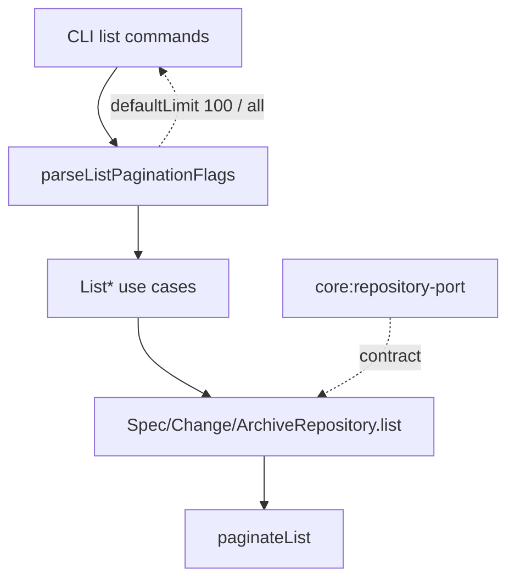

# Design: host-controlled-list-limits

## Non-goals

- Cross-workspace pagination for `ListSpecs` (still out of scope).
- A new `GetWorkspaceSpecTree` use case or API route changes on `feat/user-interface` (merge follow-up).
- Changing search APIs (`SpecRepository.search`, graph search) beyond removing `Number.MAX_SAFE_INTEGER` workarounds where they only exist to defeat the old default list limit.
- Introducing `all: true` on `ListOptions`.

## Affected areas

### Core ports and pagination helper

- `ListOptions` / `ListMeta` docs in `packages/core/src/application/ports/repository.ts`  
  Change: JSDoc — omit default 100; document page-requires-limit and after-without-limit.  
  Callers: all listable ports · Risk: CRITICAL (shared contract)

- `paginateList()` in `packages/core/src/infrastructure/fs/list-pagination.ts`  
  Change: no default limit; reject `page` without `limit` and `page` + `after` with `InvalidInputError`; support `after` without `limit` (remainder); when unpaginated set `meta.limit === total`.  
  Direct dependents: FS index caches, change-list projection · Risk: CRITICAL

- `packages/core/test/infrastructure/fs/list-pagination.spec.ts`  
  Change: rewrite default-limit tests to match new semantics.

### FS repositories / caches

- `FsIndexCache.list` (`fs-index-cache-base.ts`), `FsChangeIndexCache`, `FsArchiveIndexCache`, `FsSpecIndexCache`, `FsSpecRepository.list` / `search`, `FsChangeRepository` list helpers, `change-list-projection` paginate helpers.  
  Change: rely on updated `paginateList`; remove `limit: Number.MAX_SAFE_INTEGER` in `FsSpecRepository.search` and any similar callers.  
  Risk: CRITICAL

### Use cases

- `ListSpecs` (`packages/core/src/application/use-cases/list-specs.ts`)  
  Change: stop applying `limit ?? 100` when aggregating meta; forward options as provided.  
  Risk: HIGH

- Internal full-catalog callers: `validate-specs.ts`, `_shared/spec-pattern-matching.ts`, and `packages/code-graph/.../index-code-graph.ts`  
  Change: call `list()` / `list(undefined, {})` without magic unlimited limits.  
  Risk: MEDIUM

- List change use cases (`ListChanges`, `ListDrafts`, `ListDiscarded`, `ListArchived`) — confirm they already only forward options; do not add host defaults in core.

### CLI host

- `packages/cli/src/helpers/list-pagination.ts`  
  Change: parse `--limit` as positive integer **or** `all`; add options for applying host default 100 vs no default; validate `page` requires numeric limit; reject `page` + `all` with `CliValidationError`.  
  Callers: all list commands · Risk: HIGH

- Commands: `change/list.ts`, `drafts/list.ts`, `discarded/list.ts`, `archive/list.ts`  
  Change: use helper with `defaultLimit: 100`; pass through `--limit all` as omitted limit.

- `spec/list.ts`  
  Change: use helper with **no** default limit; accept `--limit all` as synonym for omit.

- CLI tests under `packages/cli/test/commands/*list*.spec.ts` and `helpers.ts` (`DEFAULT_LIST_LIMIT`).

### Documentation

- `docs/cli/cli-reference.md` — list command flags: default 100 for change buckets; no default for specs; `--limit all`.
- `docs/core/use-cases.md` — remove “default limit 100” where it describes repository/use-case behaviour; note host-controlled limits.

## New constructs

### CLI limit parser (extend existing helper)

**Location:** `packages/cli/src/helpers/list-pagination.ts`

**Shape:**

```typescript
export type ParsedLimit = { kind: 'number'; value: number } | { kind: 'all' } | { kind: 'omitted' }

export interface ParseListPaginationOptions {
  allowAfterId?: boolean
  /** When set, omitted --limit becomes this numeric limit. Spec list passes undefined. */
  defaultLimit?: number
}

export function parseLimitFlag(raw: string | undefined): ParsedLimit
// parseListPaginationFlags(flags, options): ListOptions
// - defaultLimit 100 + omitted → { limit: 100 }
// - all → omit limit
// - page without numeric limit → CliValidationError
```

**Responsibility:** Map CLI flags to core `ListOptions` without inventing defaults for the port layer.

**Relationships:** Used only by CLI list commands; core remains unaware of `all`.

No new core types beyond updated JSDoc on existing `ListOptions`.

### List pagination errors

Invalid list options MUST surface as typed `SpecdError` subclasses — no plain `Error` or ad hoc strings.

**Core / port (`paginateList`, programmatic callers):** `InvalidInputError` (`INVALID_INPUT`), same pattern as `update-spec-deps` for mutually exclusive input.

| Condition                   | Type                | Code            | Message                                 |
| --------------------------- | ------------------- | --------------- | --------------------------------------- |
| `page` without `limit`      | `InvalidInputError` | `INVALID_INPUT` | `page requires an explicit limit`       |
| `page` and `after` together | `InvalidInputError` | `INVALID_INPUT` | `page and after are mutually exclusive` |

**CLI host (`parseListPaginationFlags`):** `CliValidationError` (`CLI_VALIDATION_ERROR`), extends `SpecdError` via `SpecdCliError`. Reject before invoking use cases so invalid flag combinations never reach core.

| Condition                                                             | Type                 | Code                   | Message                                                               |
| --------------------------------------------------------------------- | -------------------- | ---------------------- | --------------------------------------------------------------------- |
| `page` + `--limit all`                                                | `CliValidationError` | `CLI_VALIDATION_ERROR` | `--page requires a numeric --limit`                                   |
| `page` without numeric `--limit` when host has no default (spec list) | `CliValidationError` | `CLI_VALIDATION_ERROR` | `--page requires a numeric --limit`                                   |
| `page` + `--after-key` / `--after-id`                                 | `CliValidationError` | `CLI_VALIDATION_ERROR` | `--page is mutually exclusive with --after-key/--after-id` (existing) |

Verify deltas for `core:repository-port` SHOULD assert `InvalidInputError` / `INVALID_INPUT` on the “Page without limit is rejected” scenario (align with `core:update-spec-deps` verify wording).

## Approach

1. **Core `paginateList`**
   - If `page !== undefined` and `limit === undefined` → throw `InvalidInputError('page requires an explicit limit')` before slicing.
   - If `page !== undefined` and `after !== undefined` → throw `InvalidInputError('page and after are mutually exclusive')` before slicing.
   - If `limit === undefined` and `after === undefined` → return full `allItems`; `meta = { total, count: total, limit: total }`.
   - If `limit === undefined` and `after` set → window from cursor to end; `meta.limit = count`; omit `meta.after`.
   - If `limit` set → existing offset/`after` behaviour; `meta.limit = limit`.

2. **Port JSDoc** in `repository.ts` aligned with `core:repository-port`.

3. **Use cases** forward options only; `ListSpecs` aggregate `meta.limit` from last workspace slice or compute consistently when options omit limit (each slice already has `limit === total`).

4. **CLI**
   - Change lists: `parseListPaginationFlags(opts, { defaultLimit: 100 })`.
   - Spec list: `parseListPaginationFlags(opts, { allowAfterId: false })` with no `defaultLimit`.
   - `--limit` option parser accepts `all` or integer; update help text.

5. **Remove** `Number.MAX_SAFE_INTEGER` list workarounds in core/code-graph.

6. **Docs** update in the same change.

7. **Tests** updated to match verify scenarios.

## Key decisions

- **No default limit on ports** → hosts decide. **Rejected:** keep default 100 + `all: true` flag (extra surface; wrong layer).
- **`--limit all`** not `none` → clearer CLI intent. **Rejected:** `--no-limit` separate flag (more surface).
- **`page` without `limit` errors** → prevents ambiguous offset; core throws `InvalidInputError`, CLI throws `CliValidationError` before the use case. **`after` without `limit` allowed** → remainder after cursor for agents/scripts.
- **Reuse `InvalidInputError` in core** → no new `InvalidListOptionsError`; matches existing validation-error pattern. **Rejected:** dedicated list-options error class (extra surface, same handling).
- **`meta.limit === meta.total` when unpaginated** → uniform envelope; empty → `limit: 0`.
- **CLI default 100 only on change buckets** → agents need full `spec list` by default.

## Trade-offs

- [Callers that assumed silent truncation at 100] → Mitigation: CLI change lists still default 100; changelog/docs call out port behaviour change.
- [Large monorepo `spec list` payload] → Mitigation: agents/UI need full catalog; optional numeric `--limit` remains; include flags still opt-in for heavy fields.
- [CRITICAL blast radius on `paginateList`] → Mitigation: concentrated helper + existing unit tests; keep signature of `paginateList` stable.

## Spec impact

### `core:repository-port`

- Direct dependents: `core:spec-repository-port`, `core:change-repository-port`, `core:archive-repository-port`, `core:list-specs` (via list options), CLI list specs.
- Deltas in this change cover those dependents’ limit wording.
- No further untracked ripple: list use cases for changes already consume `ListOptions` without stating default 100 in their own specs (if any do, treat as docs-only / no-op).

### `cli:spec-list` / change list specs

- Depend on core list use cases; CLI deltas already specify host defaults.

## Dependency map



```
┌──────────────────┐     ┌─────────────────────────┐
│ change/drafts/   │────▶│ parseListPaginationFlags│
│ archive/discarded│     │ defaultLimit: 100       │
│ list             │     │ --limit all → omit      │
└──────────────────┘     └───────────┬─────────────┘
┌──────────────────┐                 │
│ spec list        │─────────────────┤
│ (no default)     │                 │
└──────────────────┘                 ▼
                         ┌─────────────────────┐
                         │ ListSpecs / List*   │
                         │ (forward options)   │
                         └──────────┬──────────┘
                                    ▼
                         ┌─────────────────────┐
                         │ Repository.list     │
                         └──────────┬──────────┘
                                    ▼
                         ┌─────────────────────┐
                         │ paginateList        │
                         │ [CRITICAL]          │
                         └─────────────────────┘
```

## Migration / Rollback

- Behavioural breaking change for programmatic callers that omitted `limit` and expected ≤100 rows.
- Rollback: revert change / restore `?? 100` in `paginateList` and CLI defaults as before.
- No data migration.

## Testing

### Automated

- `packages/core/test/infrastructure/fs/list-pagination.spec.ts` — omitted limit; `page` without limit → `InvalidInputError` / `INVALID_INPUT`; `page` + `after` → same; after without limit; `meta.limit === total`.
- FS repository / cache list specs — empty meta `limit: 0`; large lists without limit return all.
- `list-specs` unit/composition tests — no invented default limit.
- CLI: `change-list`, `drafts-list`, `archive-list`, `discarded-list` — default 100; `--limit all`; `--page` + `all` → `CliValidationError` / `CLI_VALIDATION_ERROR`.
- CLI: `spec-list` — omitted limit full catalog; no truncation hint; `--limit 100` shows hint when truncated; `--limit all` omits limit; `--page` without numeric limit → `CliValidationError`.

### Manual / E2E

```bash
node packages/cli/dist/index.js specs list --workspace core --format json
# expect meta.limit === meta.total (>= 100 on this repo)

node packages/cli/dist/index.js changes list --format json
# expect meta.limit === 100 when many changes

node packages/cli/dist/index.js changes list --limit all --format json
# expect full list; meta.limit === meta.total

node packages/cli/dist/index.js changes list --limit all --page 2
# expect CLI usage error
```

### Docs

- Update `docs/cli/cli-reference.md` and `docs/core/use-cases.md` as part of implementation tasks.
- Follow `default:_global/docs` (English, under `docs/`).

## Open questions

- none (list pagination error types resolved — see **List pagination errors**)
