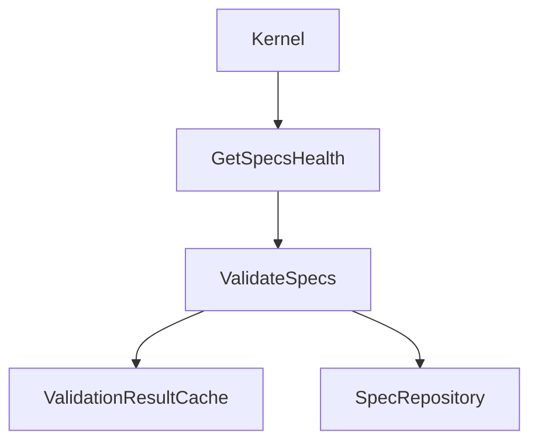

# Design: get-specs-health-use-case

## Affected areas

- `Kernel` in `packages/core/src/composition/kernel.ts`
  - Change: Add `getHealth: GetSpecsHealth` to the `Kernel` interface and register it in `createKernel` using `createGetSpecsHealth({ validateSpecs })`.
  - Callers: 1 (CLI adapter) · Risk: LOW (Additive change).
- `docs/core/use-cases.md`
  - Change: Add documentation for `GetSpecsHealth` including constructor, input/output shapes, behavior, and exceptions.

## New constructs

### `GetSpecsHealth` Usecase Class

- **Location**: `packages/core/src/application/use-cases/get-specs-health.ts`
- **Shape**:

  ```typescript
  export interface GetSpecsHealthInput {
    readonly workspace?: string
  }

  export interface GetSpecsHealthResult {
    readonly totalSpecs: number
    readonly passed: number
    readonly failed: number
    readonly warned: number
    readonly issues: readonly {
      readonly spec: string
      readonly passed: boolean
      readonly failures: readonly { readonly artifactId: string; readonly description: string }[]
      readonly warnings: readonly { readonly artifactId: string; readonly description: string }[]
    }[]
  }

  export class GetSpecsHealth {
    constructor(validateSpecs: ValidateSpecs)
    execute(input: GetSpecsHealthInput): Promise<GetSpecsHealthResult>
  }
  ```

- **Responsibility**: Runs specification validation, counts spec health statuses mutually exclusively, and returns detailed issues only for failing or warned specifications.
- **Relationships**: Depends on `ValidateSpecs` usecase. Exposes `GetSpecsHealthInput` and `GetSpecsHealthResult` structures.

### Composition Factories for `GetSpecsHealth`

- **Location**: `packages/core/src/composition/use-cases/get-specs-health.ts`
- **Shape**:

  ```typescript
  export interface GetSpecsHealthDeps {
    readonly validateSpecs: ValidateSpecs
  }

  export function resolveGetSpecsHealthDeps(resolver: CompositionResolver): GetSpecsHealthDeps

  export function createGetSpecsHealth(deps: GetSpecsHealthDeps): GetSpecsHealth
  export function createGetSpecsHealth(
    config: SpecdConfig,
    options?: CompositionResolutionOptions,
  ): GetSpecsHealth
  ```

- **Responsibility**: Constructs a `GetSpecsHealth` usecase instance, resolving its dependencies either explicitly or from config.

## Approach

1. **Instantiation**: `GetSpecsHealth` takes `ValidateSpecs` as a constructor parameter.
2. **Execution Flow**:
   - Calls `this._validateSpecs.execute({ workspace: input.workspace })`.
   - Iterates through the returned validation entries:
     - A spec is **passed** if it has 0 failures and 0 warnings.
     - A spec is **failed** if it has 1 or more failures.
     - A spec is **warned** if it has 0 failures and 1 or more warnings.
     - Increments the corresponding counter (`passed`, `failed`, `warned`).
     - If the spec is not passed cleanly (i.e. is `failed` or `warned`), maps its failures and warnings to the consolidated `issues` list, setting `passed: failed === 0`.
   - Returns the aggregated counts and the consolidated `issues` list.

## Key decisions

- **Decision**: Single consolidated `issues` array instead of separate `failures` and `warnings` lists.
  - Rationale: Prevents clients from having to correlate multiple lists for a single spec containing both warnings and errors.
  - Alternatives rejected: Retaining separate lists (makes consumption and diagnostic reporting harder for the client).
- **Decision**: Mutually exclusive counters (`passed`, `failed`, `warned`).
  - Rationale: Guarantees that $\text{totalSpecs} = \text{passed} + \text{failed} + \text{warned}$, matching standard health check expectations. A spec with both failures and warnings counts strictly as `failed`.

## Dependency map



```
 ┌──────────────┐
 │    Kernel    │
 └──────┬───────┘
        │ (exposes)
        ▼
 ┌──────────────┐
 │GetSpecsHealth│
 └──────┬───────┘
        │ (calls)
        ▼
 ┌──────────────┐
 │ValidateSpecs │
 └──────────────┘
```

## Testing

### Automated tests

- New file `packages/core/test/application/use-cases/get-specs-health.spec.ts`:
  - `describe('GetSpecsHealth')`
    - Test: returns empty issues list and all counters at 0 when no specs are validated.
    - Test: counts clean specs under `passed` and does not add them to `issues`.
    - Test: counts specs with failures under `failed` and adds their errors to `issues` (with `passed: false`).
    - Test: counts specs with warnings but no failures under `warned` and adds their warnings to `issues` (with `passed: true`).
    - Test: counts specs with both failures and warnings under `failed` and consolidates both in the `issues` array entry.
    - Test: delegates `workspace` filter correctly to `ValidateSpecs`.
- Existing file `packages/core/test/composition/kernel.spec.ts`:
  - Verify that the kernel instantiates and exposes `specs.getHealth` correctly.

### Manual / E2E verification

Since this is a library change, we will write a temporary script under `/scratch/test-health.js` that loads the project's config, compiles the kernel, and calls `kernel.specs.getHealth.execute()`. We will run it and assert that the structure of the JSON output matches the design.

## Open questions

_none_
