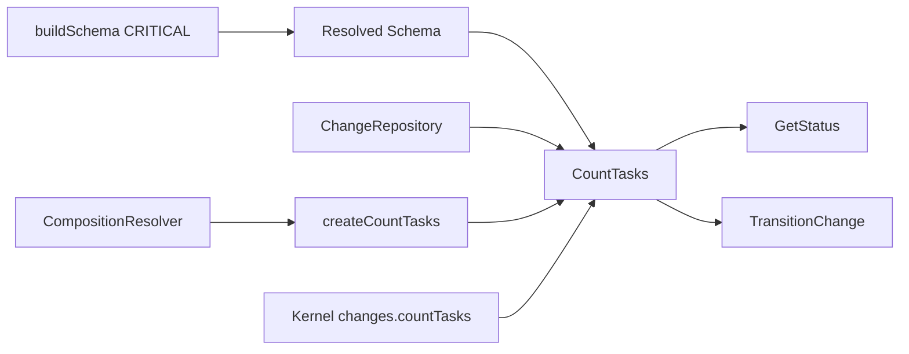

# Design: refactor-task-completion

## Objectives

Introduce one read-only application query, `CountTasks`, so status projection and lifecycle gating share file discovery, safe regex handling, per-artifact counts, and a change-wide aggregate. Materialize the schema default completed-checkbox pattern as `^\s*-\s+\[[xX]\]`, so the documented case-insensitive default is represented by the resolved `ArtifactType` rather than only by consumer fallbacks.

## Non-goals

- Do not change the workflow, lifecycle routing, error codes, progress-event names, persistence format, configuration format, or `CompositionResolver` interface.
- Do not add a change-wide task total to `GetStatusResult`; the aggregate belongs only to `CountTasksResult.total`.
- Do not add retries, feature flags, telemetry, migrations, or external API endpoints.

## Affected areas

- `packages/core/src/domain/services/build-schema.ts` — `buildArtifactType()` materializes `taskCompletionCheck` for every `hasTasks: true` artifact and fills omitted fields. Change the completed default from `^\s*-\s+\[x\]` to `^\s*-\s+\[[xX]\]`; keep the incomplete default unchanged. This pure domain service is a CRITICAL integration point: graph impact reports 8 direct and 18 indirect dependents across 27 files, including schema resolution, kernel composition, and status/transition factories. No caller contract changes.
- `packages/core/test/domain/services/build-schema.spec.ts` — update the default-pattern expectation and add an explicit `[X]` match assertion.
- `packages/core/src/application/use-cases/count-tasks.ts` — own `TaskCompletionStatus`, `CountTasksInput`, `CountTasksResult`, schema lookup, artifact-content reads, `safeRegex` compilation with `gm`, per-artifact aggregation, and result aggregate calculation.
- `packages/core/src/application/use-cases/get-status.ts` — replace local task counting with one `CountTasks.execute({ change })` call; map only `byArtifact[artifactId]` into `ArtifactStatusEntry.taskCompletion`.
- `packages/core/src/application/use-cases/transition-change.ts` — replace the private counter with one query call, while retaining schema capability validation and the existing transition error/event semantics.
- `packages/core/src/composition/use-cases/count-tasks.ts`, `get-status.ts`, and `transition-change.ts` — provide normalized resolver-backed construction and inject the shared query into both consumers.
- `packages/core/src/composition/kernel.ts`, `packages/core/src/public.ts`, and `packages/core/src/index.ts` — expose `kernel.changes.countTasks`, the use case types, and `createCountTasks`.
- `packages/core/test/application/use-cases/{count-tasks,get-status,transition-change}.spec.ts` and `packages/core/test/composition/` — cover contracts, dependency injection, and kernel wiring.
- `docs/core/use-cases.md` — document the public `CountTasks` query and its aggregate result alongside the other core use cases.

## New constructs

### `CountTasks`

Location: `packages/core/src/application/use-cases/count-tasks.ts`.

```ts
export interface TaskCompletionStatus {
  readonly complete: number
  readonly incomplete: number
  readonly total: number
}

export interface CountTasksInput {
  readonly change: Change
}

export interface CountTasksResult {
  readonly byArtifact: Readonly<Record<string, TaskCompletionStatus>>
  readonly total: TaskCompletionStatus
}

export class CountTasks {
  constructor(changes: ChangeRepository, schemaProvider: SchemaProvider)
  execute(input: CountTasksInput): Promise<CountTasksResult>
}
```

The query is application-layer only: it reads through `ChangeRepository` and `SchemaProvider`, never mutates a `Change`, and never decides transition validity.

### Composition factory

Location: `packages/core/src/composition/use-cases/count-tasks.ts`.

```ts
export interface CountTasksDeps {
  readonly changes: ChangeRepository
  readonly schemaProvider: SchemaProvider
}

export function resolveCountTasksDeps(resolver: CompositionResolver): CountTasksDeps
export function createCountTasks(deps: CountTasksDeps): CountTasks
export function createCountTasks(
  config: SpecdConfig,
  options?: CompositionResolutionOptions,
): CountTasks
```

The config overload creates a scoped resolver, calls `resolveCountTasksDeps`, and delegates to the explicit-dependencies overload using the established normalized-argument helper pattern.

## Approach

1. In schema construction, every raw artifact with `hasTasks: true` receives a resolved `taskCompletionCheck`, even when the raw property is absent. Materialize omitted `completePattern` as `^\s*-\s+\[[xX]\]` and omitted `incompletePattern` as `^\s*-\s+\[ \]`; preserve every supplied pattern verbatim.
2. `CountTasks.execute()` resolves the schema once, iterates only artifacts attached to the input change, and qualifies an artifact only when its resolved type declares `hasTasks: true` and `taskCompletionCheck`.
3. For every existing, non-empty file of a qualifying artifact, read through `ChangeRepository.artifact(change, filename)`. Compile the resolved patterns with `safeRegex(..., 'gm')`; it must not define or substitute fallback patterns. An unsafe pattern contributes zero matches and never throws. A qualifying artifact with non-empty content receives a zero-valued entry even when both patterns are unsafe.
4. For each included artifact, calculate `total = complete + incomplete`. Return `byArtifact` keyed by artifact ID and `total` as the sum of every included entry. Missing or empty files produce no entry; when no artifact has qualifying content, both aggregate fields are zero.
5. `GetStatus` receives `countTasks: CountTasks` as an explicit required dependency in its constructor and factory dependency shape. It invokes the query once, retains metadata-only lifecycle projection, and delegates content reads only for applicable task projection. It must not expose the query aggregate in `GetStatusResult`.
6. `TransitionChange` receives the same explicit required dependency and invokes it once for a completion-gated transition. Before lookup, it verifies that each required artifact declares `hasTasks: true` and `taskCompletionCheck`; missing either throws `InvalidStateTransitionError('missing-task-capability')`. An absent query entry means no qualifying content and does not block. `incomplete > 0` emits `task-completion-failed` before throwing `incomplete-tasks` with artifact ID, complete, incomplete, and total.
7. Factories and kernel use `createCountTasks(resolveCountTasksDeps(resolver))`; direct constructor fixtures are updated to pass a real or fake query rather than relying on a fallback. Public barrels export the new query and types. Update `docs/core/use-cases.md` in the same change.

## Key decisions

- **Materialize `^\\s*-\\s+\\[[xX]\\]` in `buildSchema`** → all schema consumers receive the same actual default. **Rejected:** only widening `CountTasks` fallback, because resolved `taskCompletionCheck.completePattern` would still remain lower-case-only and the use case would duplicate schema policy.
- **`CountTasksResult` has `byArtifact` plus `total`** → status needs artifact granularity while other consumers can use a canonical aggregate. **Rejected:** a synthetic record key, because it conflates an artifact ID with change-level data.
- **Unsafe patterns yield zeroes for non-empty qualifying artifacts** → the query is non-throwing and callers can distinguish content inspected with no usable matches from absent content. **Rejected:** omitting the entry, because it makes unsafe configuration indistinguishable from missing content.
- **Capability validation stays in `TransitionChange`** → only the lifecycle use case owns `missing-task-capability`; the reader does not infer policy from absence in `byArtifact`.

## Trade-offs

- `buildSchema` is CRITICAL and broadly consumed; the one-character semantic widening requires focused domain tests plus the full core suite.
- Making `countTasks` explicit requires updating direct construction tests, but prevents hidden fallback wiring from violating the shared-query contract.
- Status and transition each perform one read-only query in their own invocation; this replaces duplicated loops without adding cache state or consistency hazards.

## Spec impact

- `core:schema-format` now states the exact materialized completed default and verifies `[X]`; its schema-resolution dependents remain compatible because the pattern only widens accepted completed markers.
- `core:count-tasks` defines the shared query, including zero entries for unsafe patterns and aggregate semantics.
- `core:get-status`, `core:transition-change`, and `core:kernel` consume or expose the query. Their external status and transition contracts remain unchanged except for the documented shared dependency and consistent `[X]` handling.
- No additional dependent spec requires a delta: no spec identifier, public result field, lifecycle state, or error code is renamed or removed.

## Dependency map



```
┌───────────────────────┐     ┌─────────────────┐
│ buildSchema [CRITICAL]│────▶│ Resolved Schema │
└───────────────────────┘     └────────┬────────┘
┌───────────────────┐                  ▼
│ ChangeRepository  │──────────▶┌──────────────┐
└───────────────────┘           │ CountTasks   │
┌───────────────────┐            └──┬──────┬───┘
│CompositionResolver│──▶ factory ────┘      └──▶ TransitionChange
└───────────────────┘                  └──────▶ GetStatus
                                         ▲
                                  Kernel.changes.countTasks
```

## Migration / Rollback

This is additive internal wiring and a widening regex default; it needs no data migration. Rollback reverts the new query wiring and restores the lower-case materialized default as one atomic change.

## Testing

- `packages/core/test/domain/services/build-schema.spec.ts`: assert absent or empty task-completion configuration resolves to `^\s*-\s+\[[xX]\]` and that its regex matches both `[x]` and `[X]`; preserve the incomplete default and supplied-pattern tests.
- `packages/core/test/application/use-cases/count-tasks.spec.ts`: construct the default-bearing fixture through `buildSchema`, then cover multi-file aggregation, aggregation across two distinct qualifying artifact types (both `byArtifact` entries and the change-wide total), `[x]` and `[X]` defaults, missing/empty omission, non-task exclusion, one unsafe pattern, both unsafe patterns producing a zero entry, and all-zero aggregate. Fixtures that intentionally bypass schema construction must provide resolved patterns explicitly.
- `get-status.spec.ts`: inject `CountTasks`, assert one query call, per-artifact mapping only, absent-content omission, and no aggregate field on status output.
- `transition-change.spec.ts`: inject `CountTasks`, preserve missing capability/configuration errors, missing-content allowance, incomplete counts and progress-event-before-error order, completed allowance, and no-gate behavior.
- Composition and kernel tests: verify explicit and config `createCountTasks` forms, required injection into dependent factories, public exports, and `kernel.changes.countTasks`.
- Run `pnpm --filter @specd/core test`, `pnpm lint --filter @specd/core`, and `pnpm build --filter @specd/core`. Manually execute the targeted CountTasks fixture and confirm `[X]` contributes to `complete` and `total` while `GetStatus` remains per-artifact.

## Open questions

None.
