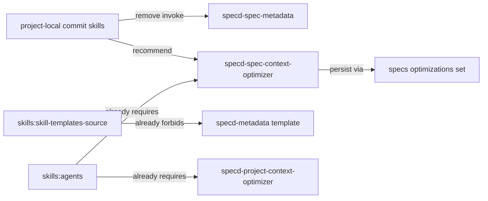

# Design: remove-legacy-metadata-skill

## Objectives

Close every remaining active invocation path for the obsolete standard skill
`specd-metadata` / `specd-spec-metadata`. After this change, metadata optimization
is reachable only through `specd-project-context-optimizer` and
`specd-spec-context-optimizer`. Canonical template discovery, plugin registrations,
archive guidance, and the live skill-template / agents contracts already satisfy that
end state; this change finishes the leftover project-local commit guidance and
re-validates absence across active sources.

## Non-goals

- Do not alter Core metadata materialization, `GenerateSpecMetadata`,
  `RegenerateSpecMetadata`, `PersistSpecMetadata`, `MaterializeSpecMetadata`, or
  lock-owned optimization use cases.
- Do not resurrect or call removed surfaces (`UpdateSpecMetadata`, `SaveSpecMetadata`,
  `specs update-metadata`, `specs write-metadata`, `specs invalidate-metadata`).
- Do not change `specs optimizations set` / `get` / `clear` semantics.
- Do not modify historical archives under `specd-sdd/changes/` or `.specd/changes/`.
- Do not add an alias, deprecation warning, migration guide, compatibility shim, or
  feature flag.
- Do not rewrite unrelated specs that still mention the historical sidecar filename
  `.specd-metadata.yaml` as documentation of the metadata mechanism (out of scope
  unless they form an active skill invocation path).
- Do not re-delete canonical templates, plugin frontmatter entries, or installed
  `specd-metadata` directories that are already absent.

## Affected areas

### Already landed (verify only; do not re-implement)

- `packages/skills/templates/skills/specd-metadata/` — directory already removed.
- `packages/plugin-agent-{claude,codex,copilot,opencode,standard}/src/domain/frontmatter/index.ts`
  — `skillFrontmatter` maps already omit `specd-metadata`.
- `packages/plugin-agent-*/test/install-skills.spec.ts` — inventories already omit it.
- `packages/skills/templates/skills/specd-archive/SKILL.md.tpl` — already recommends
  `specd-spec-context-optimizer` when optimization is enabled (LOW graph impact; no
  code dependents).
- `dev/ai-agents/skills/specd-spec-metadata/` — already absent.
- `.agents/skills/specd-metadata/` and `.codex/skills/specd-metadata/` — already absent.
- Live specs `skills:skill-templates-source` and `skills:agents` (and their verify
  scenarios) already encode the removal contract. Change deltas are `no-op`.

### Remaining edits

- `.claude/skills/commit/SKILL.md`
- `.agents/skills/commit/SKILL.md`
- `.codex/skills/commit/SKILL.md`

  These three project-local copies are identical today and are **not** produced from
  `packages/skills/templates/`. Update all three in lockstep.

  Required content changes:
  1. Remove every instruction that names `specd-spec-metadata` or `specd-metadata` as
     a skill to invoke.
  2. For LLM-optimized context work, instruct agents to launch
     `specd-spec-context-optimizer` (and project-level work via
     `specd-project-context-optimizer`) only when effective `llmOptimizedContext` is
     `true`, matching `skills:agents`.
  3. Stop telling agents to regenerate and `git add specs/**/.specd-metadata.yaml`.
     Deterministic metadata is a self-healing cache under `.specd/metadata/` (gitignored).
     Commit flow MUST NOT stage gitignored metadata cache files as part of the commit.
  4. Keep Conventional Commits workflow (read `_global/commits`, inspect diff, craft
     message, stage confirmed scope, commit with `SPECD_COMMIT=1`) intact.
  5. Optional forced rebuild remains `specd specs generate-metadata` when the user
     explicitly wants cache warming; it is not a commit prerequisite and its outputs
     are not commit payloads.
  6. Update the skill description / "What this agent does" blurb so it no longer claims
     the commit skill regenerates `.specd-metadata.yaml` sidecars.

- `dev/ai-agents/skills/specd-archive/SKILL.md` — already names the optimizer agent;
  confirm no residual `specd-spec-metadata` string remains (verify-only).

## New constructs

None. No new runtime symbols, APIs, data types, templates, or configuration keys.

## Approach

1. **Treat specs as settled.** Keep `no-op` deltas for `skills:skill-templates-source`
   and `skills:agents`. Implementation proves the existing requirements, including:
   - no `specd-metadata` standard skill template is discovered
   - optimizer agents remain discoverable with `kind: agent`
2. **Rewrite project-local commit skills** (three files) so the only metadata-optimization
   interface they name is the specialized agents, and so metadata filesystem guidance
   matches the self-healing / lock-owned model.
3. **Absence sweep.** Search active source and rendered skill directories for
   `specd-metadata` and `specd-spec-metadata`. Allowed hits: this change's own artifacts,
   historical archives, and incidental documentation of the metadata mechanism that does
   not instruct invoking the removed skill. Fail the change if any active skill still
   recommends the removed skill.
4. **Regression confirmation.** Run plugin install-skills tests and skills package tests
   as a smoke check that the already-landed removals remain green; do not invent new
   plugin inventory expectations unless a test still fails.

This satisfies Template migration and Optimizer agents: the published inventory stays
free of the obsolete skill, and active workflow text no longer routes through it.

## Functional and operational contract

- Standard-skill discovery MUST NOT return an item whose identifier is `specd-metadata`.
- Agent discovery MUST continue to include `specd-project-context-optimizer` and
  `specd-spec-context-optimizer` with `kind: agent`.
- Project-local commit skills MUST NOT instruct invocation of `/specd-metadata`,
  `/specd-spec-metadata`, or a skill named `specd-spec-metadata`.
- When commit guidance mentions LLM optimization, it MUST name
  `specd-spec-context-optimizer` (per-spec) and MUST gate that suggestion on effective
  `llmOptimizedContext === true`.
- Commit guidance MUST NOT stage `.specd-metadata.yaml` or `.specd/metadata/**` as part
  of the normal commit payload.
- Optimized-field persistence remains `specd specs optimizations set` (agents already
  use this); commit skills do not perform that write themselves.
- No persistence, auth, network, retry, concurrency, migration, or feature-flag behavior
  is added.

## Key decisions

- **Complete leftover commit paths rather than reopen canonical removal** → Canonical
  template/plugin work already merged. Re-doing it wastes effort and risks churn.
  **Alternatives rejected:** rewriting already-correct plugin frontmatter; re-adding
  then re-deleting the template for ceremony.
- **`no-op` deltas** → Live specs already contain the desired requirements and scenarios.
  **Alternatives rejected:** identity `modified` deltas that produce empty merges;
  removing the specs from the change (would lose explicit contract linkage for verify).
- **Commit skills are hand-maintained triples** → They are not under
  `packages/skills/templates/`, so skills sync cannot refresh them. Edit all three
  copies explicitly.
  **Alternatives rejected:** editing only `.claude` and hoping sync propagates.
- **Align commit metadata wording with current model while removing the skill** → Leaving
  `.specd-metadata.yaml` staging instructions would keep a broken path next to the
  removed skill name.
  **Alternatives rejected:** only deleting the skill name while leaving obsolete staging
  commands; expanding into a full unrelated rewrite of Conventional Commits policy.

## Trade-offs

- [Narrow remaining surface] → Most removal is already done; residual risk is stale
  project-local text. Mitigate with an explicit string sweep after edits.
- [Triple copy drift] → Three commit files can diverge later. Mitigate by editing them
  identically in one task and diffing the three afterward.
- [Commit metadata step simplification] → Removing forced sidecar staging changes
  operator habit. Mitigate by documenting self-heal + optional `generate-metadata` and
  pointing LLM work at optimizer agents.

## Spec impact

### `skills:skill-templates-source`

- Direct dependents: five `plugin-agent-*:plugin-agent` specs and template discovery
  consumers.
- Assessment: `no-op`. Dependent specs remain satisfied; inventories already exclude
  the skill. No additional spec deltas required.

### `skills:agents`

- Direct dependents: five `plugin-agent-*:plugin-agent` specs and
  `skills:workflow-automation`.
- Assessment: `no-op`. Agent names, fallback, `llmOptimizedContext` gate, and
  `specs optimizations set` write path already specified. No additional spec deltas
  required.

## Dependency map



```
┌──────────────────────────────┐
│ project-local commit skills  │
│ .claude / .agents / .codex   │
└──────────────┬───────────────┘
               │ rewrite
               ▼
┌──────────────────────────────┐     ┌─────────────────────────────┐
│ stop invoking                │     │ recommend when              │
│ specd-spec-metadata          │     │ llmOptimizedContext=true    │
└──────────────────────────────┘     │ specd-spec-context-optimizer│
                                     └──────────────┬──────────────┘
                                                    │
                                                    ▼
                                     ┌─────────────────────────────┐
                                     │ specs optimizations set     │
                                     │ (lock-owned fields)         │
                                     └─────────────────────────────┘

┌──────────────────────────────┐
│ live specs (no-op deltas)    │──── already forbid legacy skill
│ skill-templates-source       │
│ agents                       │
└──────────────────────────────┘
```

## Documentation and generated artifacts

No public `docs/` page currently instructs agents to invoke `specd-metadata`. Do not
add migration documentation. Do not invent a published template for the project-local
commit skill in this change. Update the three commit skill files only.

## Testing

### Automated tests

- Run `packages/skills` tests as a smoke check that template discovery still omits
  `specd-metadata` and still finds both optimizer agents.
- Run each `packages/plugin-agent-*/test/install-skills.spec.ts` suite as a smoke check
  that installed inventories stay free of `specd-metadata`.
- Diff the three commit skill files after editing; they MUST be identical.

### Manual verification

1. Search active skill trees (`.claude/skills`, `.agents/skills`, `.codex/skills`,
   `packages/skills/templates`, `dev/ai-agents/skills`) for `specd-metadata` and
   `specd-spec-metadata`. Expect zero skill-invocation hits.
2. Confirm commit skill text no longer stages `.specd-metadata.yaml` and names
   `specd-spec-context-optimizer` for LLM optimization when enabled.
3. Confirm `packages/skills/templates/skills/` still lists only:
   `specd`, `specd-archive`, `specd-compliance`, `specd-design`, `specd-implement`,
   `specd-new`, `specd-verify`.
4. Confirm `packages/skills/templates/agents/` still lists
   `specd-project-context-optimizer` and `specd-spec-context-optimizer`.

## Open questions

None.
