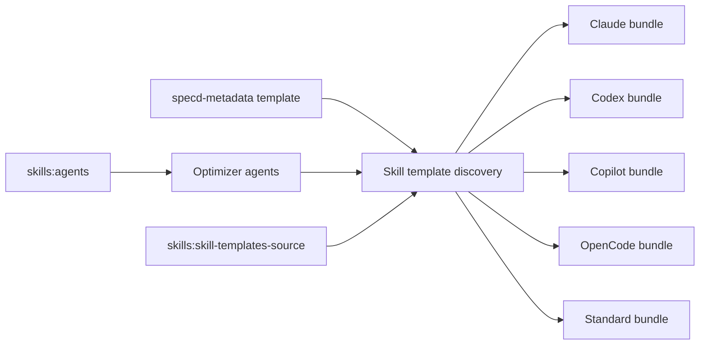

# Design: remove-legacy-metadata-skill

## Objectives

Remove every active invocation path for the obsolete standard `specd-metadata` skill. The resulting bundle exposes metadata optimization only through `specd-project-context-optimizer` and `specd-spec-context-optimizer`, while deterministic metadata generation, persistence, CLI commands, and metadata sidecars remain unchanged.

## Non-goals

- Do not alter `metadata.json`, metadata extraction, `GenerateSpecMetadata`, `UpdateSpecMetadata`, `SaveSpecMetadata`, or any metadata CLI command.
- Do not modify historical archives or historical change artifacts.
- Do not provide an alias, deprecation warning, migration guide, compatibility shim, or feature flag. There are no users to preserve.
- Do not change agent prompt semantics, capability negotiation, or frontmatter field schemas.

## Affected areas

- `packages/skills/templates/skills/specd-metadata/SKILL.md.tpl` and `skill.meta.json`
  - Remove both files by deleting the complete obsolete standard-skill template directory.
  - Graph impact: LOW for the template files themselves; template discovery determines the actual bundle membership.
- `packages/skills/templates/skills/specd-archive/SKILL.md.tpl`
  - Replace the post-archive recommendation for `/specd-spec-metadata` with `specd-spec-context-optimizer` for each affected spec. The wording must preserve the existing condition that optimization is enabled.
- `packages/plugin-agent-{claude,codex,copilot,opencode,standard}/src/domain/frontmatter/index.ts`
  - Remove the `specd-metadata` entry from each `skillFrontmatter` map. Do not alter `agentFrontmatter` entries.
  - Each `skillFrontmatter` symbol has one direct dependent and MEDIUM risk. Its installation flow reaches the package `InstallSkills` use case, package entry point, and `install-skills.spec.ts`.
- `packages/plugin-agent-{claude,codex,copilot,opencode,standard}/test/install-skills.spec.ts`
  - Update expected installed skill inventories so no plugin emits `specd-metadata`; retain assertions for the specialized agents according to each plugin capability.
- `dev/ai-agents/skills/specd-spec-metadata/SKILL.md` and `dev/ai-agents/skills/specd-archive/SKILL.md`
  - Delete the legacy metadata skill and replace its archive reference with the specialized spec-context optimizer.
- `.codex/skills/specd-metadata/SKILL.md`, `.agents/skills/specd-archive/SKILL.md`, `.codex/skills/specd-archive/SKILL.md`, `.agents/skills/commit/SKILL.md`, and `.codex/skills/commit/SKILL.md`
  - Regenerate or update these installed/project skill copies through the repository skills synchronization workflow. They must contain no invocation of `specd-metadata` or `specd-spec-metadata`; references to the metadata persistence sidecar itself remain valid.
  - Note: `.agents/skills/specd-metadata/` is already absent (cleaned by a previous sync). Only `.codex/skills/specd-metadata/` still exists and requires directory removal.
- `specs/skills/skill-templates-source/{spec.md,verify.md}`
  - Remove `specd-metadata` from the canonical standard-template inventory and add verification that discovery omits it while specialized optimizer agents remain available.
- `specs/skills/agents/{spec.md,verify.md}`
  - Define specialized optimizer agents as the exclusive metadata-optimization interface and verify that no standard `specd-metadata` skill is discovered.

## New constructs

None. This change removes registrations and content; it introduces no new runtime symbols, APIs, data types, files, or configuration.

## Approach

1. Delete the canonical `specd-metadata` skill template directory so `@specd/skills` discovery can no longer resolve it.
2. Remove the matching standard-skill frontmatter record from each plugin. Leave each optimizer-agent record intact so capability-aware agent rendering continues to work.
3. Replace every active workflow instruction that names the legacy skill with the specialized optimizer appropriate to per-spec metadata (`specd-spec-context-optimizer`). Remove the separate legacy development skill rather than renaming it.
4. Run the project skills synchronization path to refresh `.agents` and `.codex` generated copies, then verify that the old skill directories and invocations are absent. Note: `.agents/skills/specd-metadata/` is already absent; only `.codex/skills/specd-metadata/` requires directory removal.
5. Update plugin installation tests and run the package tests so installed bundles prove the removal across all supported plugin runtimes.

The implementation satisfies both modified requirements: the template inventory explicitly excludes the standard skill, and only the two specialized agents remain discoverable for metadata optimization. The new verification scenarios map to bundle discovery and agent discovery assertions in the skills/package and plugin installation tests.

## Functional and operational contract

- Standard-skill discovery and rendered plugin bundles MUST NOT include an item whose identifier is `specd-metadata`.
- Agent discovery MUST continue to include `specd-project-context-optimizer` and `specd-spec-context-optimizer` with `kind: agent`.
- When archive guidance is rendered and optimized context is enabled, it MUST direct the orchestrator to `specd-spec-context-optimizer` for each relevant spec.
- Agent-capability fallback remains unchanged: runtimes without `agents` receive agent prompts for manual or inline execution through the existing rendering behavior.
- Any active textual instruction naming `/specd-metadata` or `/specd-spec-metadata` MUST be removed or replaced. References to metadata files, deterministic extraction, or safe metadata-update commands are explicitly retained.
- No persistence, state transition, network operation, authentication, authorization, retry, concurrency, migration, rollback data, or feature-flag behavior is added or changed.

## Key decisions

- **Direct removal** → The user confirmed there are no users, so retaining an alias or migration path adds a second unsupported interface without benefit. **Alternatives rejected:** deprecation period, redirect, and compatibility shim.
- **Retain specialized agents, not a renamed skill** → Existing agent templates already perform focused optimized-context updates through the safe update path. **Alternative rejected:** keeping the orchestration skill, because it duplicates agent responsibilities.
- **Preserve metadata infrastructure** → The removed item is an interaction workflow, not the metadata domain. **Alternative rejected:** deleting core/CLI metadata commands or sidecar support, which would break deterministic generation and context consumers.
- **Regenerate installed copies** → `.agents` and `.codex` are delivery artifacts and must reflect canonical sources. **Alternative rejected:** deleting only canonical templates and leaving stale invocable local copies.

## Trade-offs

- [Bundle and plugin fan-out] → The aggregate file impact is MEDIUM and reaches five plugin installation flows. Mitigate with focused installation tests for every plugin and a post-sync inventory check.
- [Spec ripple] → `skills:agents` has HIGH dependent impact: five agent-plugin specs and `skills:workflow-automation` depend on it. No dependent requirements require a delta because the two agent names, fallback behavior, and agent contract are unchanged; only the obsolete parallel standard-skill path is removed. Confirm this with the affected plugin tests.
- [Generated artifacts] → A manual source edit can leave stale installed skills. Mitigate by running the repository synchronization command and searching the active source and rendered directories afterward.

## Spec impact

### `skills:skill-templates-source`

- Direct dependent specs: the five `plugin-agent-*:plugin-agent` specs and `skills:skill-repository` through template discovery and rendering.
- Transitive impact: plugin `InstallSkills` flows install the discovered templates into their runtime-specific locations.
- Assessment: no dependent specification requires changed behavior; all continue to require deterministic rendering. Their test inventories must change because the discovered standard-skill set becomes smaller.

### `skills:agents`

- Direct dependent specs: `plugin-agent-claude:plugin-agent`, `plugin-agent-codex:plugin-agent`, `plugin-agent-copilot:plugin-agent`, `plugin-agent-opencode:plugin-agent`, `plugin-agent-standard:plugin-agent`, and `skills:workflow-automation`.
- Assessment: the named optimizer agents and capability fallback remain unchanged, so dependent requirements stay satisfied. The removal strengthens the existing agent-first contract; no additional spec delta is required.

## Dependency map



```
┌────────────────────────────┐        ┌─────────────────────────┐
│ legacy specd-metadata      │ ─────▶ │ template discovery      │
│ template + registrations   │ remove │ and bundle rendering    │
└────────────────────────────┘        └──────────┬──────────────┘
                                                  │
             ┌────────────────────────────────────┼───────────────────────────────────┐
             ▼                                    ▼                                   ▼
      ┌────────────┐                       ┌────────────┐                      ┌────────────┐
      │ Claude     │                       │ Codex      │                      │ Copilot    │
      │ install    │                       │ install    │                      │ install    │
      └────────────┘                       └────────────┘                      └────────────┘
             ▲                                    ▲                                   ▲
             └───────────────────┬────────────────┴───────────────────┬───────────────┘
                                 │                                    │
                    ┌────────────┴────────────┐          ┌────────────┴────────────┐
                    │ specialized optimizer   │          │ skills specs: template  │
                    │ agents remain published │          │ source + agents          │
                    └─────────────────────────┘          └─────────────────────────┘
```

## Documentation and generated artifacts

No public `docs/` page currently names the legacy skill. Do not add migration documentation. Update active skill instructions and regenerate their installed copies; do not edit historical archive documents.

## Testing

### Automated tests

- Update each `packages/plugin-agent-*/test/install-skills.spec.ts` inventory expectation to assert that the standard skill list excludes `specd-metadata` and that applicable specialized agents remain present.
- Run the affected plugin test suites for Claude, Codex, Copilot, OpenCode, and Standard.
- Run the skills package test suite to verify discovery and bundle resolution after the template directory is removed.
- Run the repository synchronization check and search active source/rendered skill directories for `specd-metadata` and `specd-spec-metadata`; only metadata file-name references are allowed.

### Manual verification

1. Run the skills synchronization command used by this repository.
2. Inspect the rendered `.agents` and `.codex` skill inventories: neither contains a `specd-metadata` directory.
3. Inspect rendered archive and commit guidance: neither instructs users to invoke the removed skill; archive guidance names `specd-spec-context-optimizer` when optimization is enabled.
4. Execute each plugin's installation test suite and confirm it exits successfully.
5. Confirm `specd-project-context-optimizer` and `specd-spec-context-optimizer` remain discoverable as agents.

## Open questions

None.
