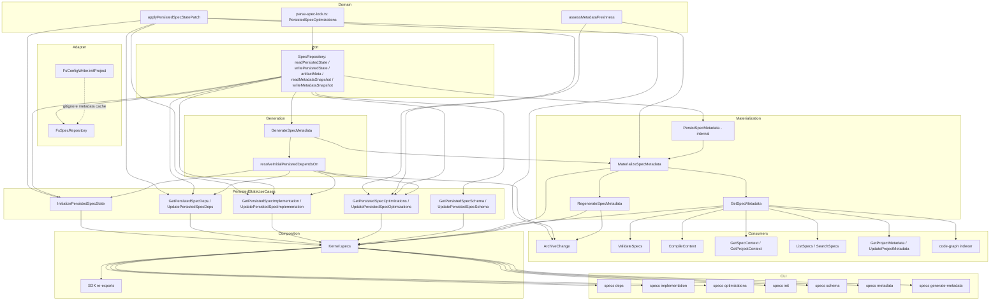

# Design: persist-spec-context-optimizations

## Objectives

Make `spec-lock.json` the sole durable source for canonical dependencies, canonical implementation links, and per-field LLM optimizations (`optimizedDescription`, `optimizedContext`). Turn generated `metadata.json` into a disposable, self-healing normalized cache that any consumer can rely on without a preceding manual generation step, while removing every public metadata-editing surface (`SaveSpecMetadata`, `UpdateSpecMetadata`, `InvalidateSpecMetadata`, and their CLI commands). Introduce explicit persisted-state initialization, schema inspection/reassignment, and dedicated `specs deps|implementation|optimizations|init|schema` CLI families so that canonical lock mutation, deterministic projection, and forced rebuild are three clearly separated capabilities instead of one overloaded metadata surface.

## Non-goals

- Do not implement a database-backed `SpecRepository` in this change. `DbSpecRepository` behavior is described only as a contract obligation that the filesystem adapter must not violate; no such adapter is built here.
- Do not implement full heterogeneous per-spec schema resolution. This change persists a forward-compatible per-spec schema identity but does not make every consumer resolve a different schema per spec — that remains future work.
- Do not implement artifact content transformation between incompatible schema formats. `UpdatePersistedSpecSchema` rebinds compatible existing artifacts only; format migration is a separate future capability.
- Do not provide a compatibility alias, deprecation warning, or feature flag for `update-metadata`, `write-metadata`, or `invalidate-metadata`. They are deleted outright.
- Do not automatically untrack previously committed `.specd/metadata/` content from Git. Adding a `.gitignore` entry never rewrites the Git index; any repository-specific untracking is a one-time manual migration step documented for implementers, not runtime behavior.
- Do not change change-time draft tracking (`trackedImplementationFiles`, in-progress confirmed links, a change's draft `specDependsOn`). The new `specs deps` / `specs implementation` command groups operate only on canonical persisted lock state, never on an active change's draft.
- Do not alter `changes implementation`, `changes edit --add-spec`, or any other change-lifecycle command's existing behavior beyond what is explicitly listed as a modified spec.
- Do not add a new LLM invocation path. `UpdatePersistedSpecOptimizations` and `specs optimizations set` accept caller-supplied strings; they never call an LLM themselves.
- Do not change agent capability negotiation, frontmatter schemas, or unrelated skill orchestration outside the two optimizer agent templates and the archive/metadata-oriented workflow templates named in this design.

## Affected areas

### Domain layer (pure, no I/O)

- `packages/core/src/domain/services/parse-spec-lock.ts` — extend `SpecLockData` and `specLockSchema` with optional `optimizations` (`PersistedSpecOptimizations`), keeping `schema`, `dependsOn`, `implementation`, `originalHash` backward compatible. Add `PersistedArtifactStateEntry`, `PersistedArtifactState`, `PersistedOptimizationField`, `PersistedSpecOptimizations` types and their Zod schemas here (or in a new co-located `spec-optimization.ts` domain service imported by this file). Remove the filesystem-adapter-owned `{ schema: { name: 'unknown', version: 0 } }` fallback wherever it currently leaks into parsed output.
  - Graph impact: part of the `SpecRepository` port + `parse-spec-lock` + `GenerateSpecMetadata` cluster flagged **CRITICAL**, ~205 affected files across the workspace. Every change to this file's exported shapes ripples through the FS adapter, every persisted-state use case, `ArchiveChange`, and metadata generation.
- `packages/core/src/domain/services/parse-metadata.ts` — replace the ad hoc `PersistedSpecMetadata` (`SpecMetadata & { originalHash, freshness }`) with the storage-neutral `MetadataSnapshot` discriminated union (see New constructs). Add `SpecMetadataProvenance` fields to `SpecMetadata` (`projectionVersion`, `projectionFingerprint`, provenance). Remove `optimizedDescription` / `optimizedContext` as metadata-owned authoritative fields — they become read-through projections of lock-owned optimization state, included only when fresh.
- New domain module `packages/core/src/domain/services/apply-persisted-spec-state-patch.ts` — pure `applyPersistedSpecStatePatch()` implementation, `PersistedSpecStateBase`, `PersistedSpecStatePatch`, `PersistedSpecState`, `PersistedSpecStateSnapshot`. No filesystem, repository, or artifact reads.
- New domain module `packages/core/src/domain/services/assess-metadata-freshness.ts` — pure `assessMetadataFreshness()` and `MetadataFreshnessAssessment` type.
- New domain module `packages/core/src/domain/services/spec-optimization-freshness.ts` — pure per-field freshness classification (`artifact-added` / `artifact-removed` / `artifact-changed` / `schema-changed` / `missing`) shared by `GetPersistedSpecOptimizations` and `MaterializeSpecMetadata`.

### Application layer (ports, use cases, errors)

- `packages/core/src/application/ports/spec-repository.ts` — the `SpecRepository` abstract class gains `readPersistedState`, `writePersistedState`, `artifactMeta`, `readMetadataSnapshot`, `writeMetadataSnapshot`; loses `metadata`, `saveMetadata`, `readPersistedSchema`, `readPersistedDependsOn`, `readPersistedImplementation`, `updatePersistedSchema`, `updatePersistedDependsOn`, `updatePersistedImplementation` (folded into the aggregate `readPersistedState` / `writePersistedState` pair). `SpecPublication` gains `persistedState: PersistedSpecState` replacing the three optional `persistedSchema` / `persistedDependsOn` / `persistedImplementation` fields.
  - Graph impact: this port is at the center of the **CRITICAL**, ~205-file cluster named above. Every `SpecRepository` implementer, every use case that type-imports `SpecRepository`, and every test double implementing this abstract class must be updated in the same change.
- New use cases under `packages/core/src/application/use-cases/`:
  - `materialize-spec-metadata.ts` (`MaterializeSpecMetadata`)
  - `persist-spec-metadata.ts` (`PersistSpecMetadata`, internal, not exported from `public.ts`)
  - `get-spec-metadata.ts` (`GetSpecMetadata`)
  - `regenerate-spec-metadata.ts` (`RegenerateSpecMetadata`)
  - `initialize-persisted-spec-state.ts` (`InitializePersistedSpecState`)
  - `resolve-initial-persisted-depends-on.ts` (shared `resolveInitialPersistedDependsOn()` service, not a use case class — a plain exported function with explicit collaborators)
  - `get-persisted-spec-deps.ts` (`GetPersistedSpecDeps`)
  - `update-persisted-spec-deps.ts` (`UpdatePersistedSpecDeps`)
  - `get-persisted-spec-implementation.ts` (`GetPersistedSpecImplementation`)
  - `update-persisted-spec-implementation.ts` (`UpdatePersistedSpecImplementation`)
  - `get-persisted-spec-optimizations.ts` (`GetPersistedSpecOptimizations`)
  - `update-persisted-spec-optimizations.ts` (`UpdatePersistedSpecOptimizations`)
  - `get-persisted-spec-schema.ts` (`GetPersistedSpecSchema`)
  - `update-persisted-spec-schema.ts` (`UpdatePersistedSpecSchema`)
- Modified use cases:
  - `packages/core/src/application/use-cases/generate-spec-metadata.ts` (`GenerateSpecMetadata`) — return the exact source state used (artifact hashes, lock `originalHash`, schema identity), stop importing `readPersistedDependsOn`/`readPersistedImplementation` directly (switch to `readPersistedState`), include only fresh lock-owned optimizations, derive lock-less dependencies from current artifacts, never persist.
    - Graph impact: **CRITICAL** in isolation — 9 direct dependents, 39 indirect dependents. This is the single highest-blast-radius symbol in the change; every consumer of generated metadata depends transitively on this class's return shape.
  - `packages/core/src/application/use-cases/archive-change.ts` (`ArchiveChange`) — read one aggregate `readPersistedState` snapshot, compute the complete `PersistedSpecState` via `applyPersistedSpecStatePatch()` (using `resolveInitialPersistedDependsOn()` when no lock exists yet), pass it through `SpecPublication.persistedState`, guard the observed persisted-state revision, and force-materialize metadata (`MaterializeSpecMetadata` with `policy: 'force'`) after artifacts and lock are committed.
    - Hotspot: `ArchiveChange` is independently flagged as a high-risk hotspot due to its existing high fan-in/fan-out; this change adds `RegenerateSpecMetadata`, `spec-optimization` types, and `InitializePersistedSpecState`'s shared helper as new direct dependencies.
  - `packages/core/src/application/use-cases/validate-specs.ts` (`ValidateSpecs`) — materialize metadata via `MaterializeSpecMetadata`/`GetSpecMetadata` before validating the normalized projection; keep independent validation failure for stale persisted optimizations.
    - Hotspot: `ValidateSpecs` is independently flagged as a high-risk hotspot; it is invoked from multiple CLI paths and from `GetSpecsHealth`.
  - `packages/core/src/application/use-cases/compile-context.ts` (`CompileContext`) — obtain metadata through materialization instead of a raw repository read.
    - Hotspot: `CompileContext` is independently flagged as a high-risk hotspot; it is the shared context-assembly path used by multiple change/spec commands and `_shared/compile-context-fingerprint.ts`.
  - `packages/core/src/application/use-cases/get-spec-context.ts` (`GetSpecContext`) — self-healing metadata plus stale/missing optimization diagnostics.
  - `packages/core/src/application/use-cases/get-project-context.ts` (`GetProjectContext`) — self-heal required spec metadata during project-wide compilation; correct its `project-metadata` dependency.
  - `packages/core/src/application/use-cases/list-specs.ts` (`ListSpecs`) — materialize metadata needed for normalized titles/summaries; remove `metadataStatus` projection/filtering entirely (`SpecListEntry.metadataStatus` and `SpecListOptions.includeMetadataStatus` are deleted).
  - `packages/core/src/application/use-cases/search-specs.ts` (`SearchSpecs`) — obtain normalized fields through materialization instead of a raw repository cache read.
  - `packages/core/src/application/use-cases/get-project-metadata.ts` / `update-project-metadata.ts` — derive spec inputs from semantic metadata fingerprints (`metadataFingerprint`) rather than cache files or repository revisions.
  - `packages/core/src/application/use-cases/update-spec-deps.ts` (`UpdateSpecDeps`) — becomes the extraction source for shared add/remove/set mutation semantics reused by `UpdatePersistedSpecDeps`; its own behavior (mutating a change's draft `specDependsOn`) is unchanged.
  - `packages/core/src/application/use-cases/update-implementation-tracking.ts` (`UpdateImplementationTracking`) — becomes the extraction source for add/enrich/remove link semantics reused by `UpdatePersistedSpecImplementation`; its own behavior is unchanged.
- Deleted use cases (application + composition):
  - `packages/core/src/application/use-cases/save-spec-metadata.ts` and `packages/core/src/composition/use-cases/save-spec-metadata.ts` — responsibility moves to internal `PersistSpecMetadata`.
  - `packages/core/src/application/use-cases/update-spec-metadata.ts` and `packages/core/src/composition/use-cases/update-spec-metadata.ts` — obsolete metadata-owned optimization editor.
  - `packages/core/src/application/use-cases/invalidate-spec-metadata.ts` and `packages/core/src/composition/use-cases/invalidate-spec-metadata.ts` — explicit invalidation is replaced by fingerprint-derived freshness.
- New errors under `packages/core/src/domain/errors/` and/or `packages/core/src/application/errors/` (see New constructs → Error types) — `SpecAlreadyInitializedError`, `SpecNotInitializedError`, `PersistedSchemaDependencyConflictError`, `ImplementationFileNotFoundError`, `ImplementationWorkspaceBoundaryError`. `ArtifactConflictError` (`packages/core/src/domain/errors/artifact-conflict-error.ts`) is reused unchanged as the concurrency-conflict error for both persisted-state and metadata-snapshot writes.

### Infrastructure layer (fs only)

- `packages/core/src/infrastructure/fs/spec-repository.ts` (`FsSpecRepository`) — implement `readPersistedState`/`writePersistedState` against `spec-lock.json` using one canonical serializer/writer shared with staged `publish()`; implement `artifactMeta()` by reusing the existing artifact stat/hash path that already populates `SpecArtifact.originalHash`; implement `readMetadataSnapshot`/`writeMetadataSnapshot` against `.specd/metadata/<spec>.json` (or the configured `metadataPath`) using raw-byte SHA-256 as `revision`; stop applying the read-only source-ownership guard to metadata cache writes (metadata is cache state, not canonical source, even in a `readOnly` workspace); remove the `{ name: 'unknown', version: 0 }` fallback.
  - Graph impact: `FsSpecRepository` is the primary implementer inside the **CRITICAL**, ~205-file `SpecRepository` cluster.
- `packages/core/src/infrastructure/fs/config-writer.ts` (`FsConfigWriter.initProject`) — after existing directory creation, additionally `fs.mkdir` the resolved metadata cache directory (`.specd/metadata/` by default) and call the existing `appendGitignoreEntries(gitignorePath, [...])` helper (already used for `specd.local.yaml`) with the rooted entry `/.specd/metadata/`, so nested directories with a similar name elsewhere are unaffected and duplicate entries are never written.
- `packages/core/src/infrastructure/fs/ensure-tmp-gitignore.ts` pattern is referenced but not reused verbatim: the metadata cache directory uses a root-`.gitignore` entry (so a user cloning the repository never materializes tracked cache files), not a nested `tmp/.gitignore` file, because metadata is a top-level project concern rather than an internal `tmp/` artifact.
- Composition: `packages/core/src/composition/spec-repository.ts` (`createFsSpecStorageFactory`) — wire the same underlying hashing/stat/index helpers into the extended `FsSpecRepository` constructor; no new adapter-level dependencies are introduced.

### Composition and Kernel

- New composition modules under `packages/core/src/composition/use-cases/`: `materialize-spec-metadata.ts`, `get-spec-metadata.ts`, `regenerate-spec-metadata.ts`, `initialize-persisted-spec-state.ts`, `get-persisted-spec-deps.ts`, `update-persisted-spec-deps.ts`, `get-persisted-spec-implementation.ts`, `update-persisted-spec-implementation.ts`, `get-persisted-spec-optimizations.ts`, `update-persisted-spec-optimizations.ts`, `get-persisted-spec-schema.ts`, `update-persisted-spec-schema.ts`. Each follows the existing `resolveXDeps(resolver)` / `createX(deps)` / `createX(config, options?)` pattern already present in every file in this directory (see `packages/core/src/composition/use-cases/generate-spec-metadata.ts` for the canonical current example).
- `packages/core/src/composition/kernel.ts` — `Kernel.specs` gains `materializeMetadata`, `getMetadata`, `regenerateMetadata`, `initializePersistedState`, `getPersistedDeps`, `updatePersistedDeps`, `getPersistedImplementation`, `updatePersistedImplementation`, `getPersistedOptimizations`, `updatePersistedOptimizations`, `getPersistedSchema`, `updatePersistedSchema`; loses `saveMetadata` and `updateMetadata` (both currently wired in `createKernel()` at lines constructing `saveMetadata`/`updateMetadata`); `invalidateMetadata` (`InvalidateSpecMetadata`) is also removed from `Kernel.specs`.
  - Graph impact: `kernel.ts` composition wiring is explicitly named as a hotspot; it currently imports 50+ use-case types and constructs every one of them in `createKernel()`. This change adds 12 new imports/constructions and removes 3.
- `packages/core/src/composition/kernel-builder.ts` (`KernelBuilder.build()`) — must delegate to the revised `createKernel()` so every registry/repository override combination exposes the identical new `Kernel.specs` surface; no independent use-case list is maintained here.
- `packages/core/src/public.ts` — remove `SaveSpecMetadata`/`SaveSpecMetadataInput`/`SaveSpecMetadataResult`, `InvalidateSpecMetadata`/`InvalidateSpecMetadataInput`/`InvalidateSpecMetadataResult`, `UpdateSpecMetadata`/`UpdateSpecMetadataInput`/`UpdateSpecMetadataResult`, `createSaveSpecMetadata`/`SaveSpecMetadataDeps`, `createInvalidateSpecMetadata`/`InvalidateSpecMetadataDeps`, `createUpdateSpecMetadata`; add every new public use case's class, `Input`, `Result`, `Deps`, and `create*` factory (see New constructs).
- `packages/sdk/src/core-reexports.ts` — remove the corresponding re-exports of the three deleted metadata editors and their factories; add re-exports for every new public use case, matching `public.ts` 1:1. `packages/sdk/src/index.ts` is unaffected in structure (it re-exports `core-reexports.ts` wholesale).

### CLI

- New command files under `packages/cli/src/commands/spec/`: `deps.ts` (`specs deps list|add|remove|set|clear`), `implementation.ts` (`specs implementation list|add|remove`), `optimizations.ts` (`specs optimizations get|set|clear`), `init.ts` (`specs init`), `schema.ts` (`specs schema get|set`). Each handler only parses flags, calls one `Kernel.specs.*` method, formats output, and maps typed errors to exit codes — consistent with existing handlers such as `packages/cli/src/commands/spec/generate-metadata.ts`.
- Modified command files: `packages/cli/src/commands/spec/generate-metadata.ts` — delegate one-spec and unfiltered `--all` batch work directly to `Kernel.specs.regenerateMetadata`; remove the old `--write`/`--status` selection flags. `packages/cli/src/commands/spec/metadata.ts` — call `Kernel.specs.getMetadata` and print the self-healed projection plus `source`/`regenerated`/`warnings` diagnostics. `packages/cli/src/commands/spec/list.ts` — remove `--metadata-status` flag and any client-side freshness/regeneration logic.
- Deleted command files: `packages/cli/src/commands/spec/write-metadata.ts`, `packages/cli/src/commands/spec/invalidate-metadata.ts`, `packages/cli/src/commands/spec/update-metadata.ts`.
- CLI command registration (wherever `spec/*.ts` command modules are wired into the `specs` command group, alongside existing registrations for `metadata.ts`/`generate-metadata.ts`/`list.ts`) must register the five new command files and drop the three deleted ones.
- `packages/cli/src/commands/project/update-metadata.ts` and `packages/cli/src/commands/project/metadata.ts` are **not** touched by this change beyond the `project-metadata` fingerprint-source correction already covered by `core:project-metadata` / `core:update-project-metadata` — they operate on project-wide metadata, a distinct concept from per-spec `metadata.json`.

### Skills and templates

- `packages/skills/templates/agents/specd-spec-context-optimizer/SPECD-AGENT.md.tpl` — gate all optimization work behind effective `llmOptimizedContext === true`; replace any metadata-editing instruction with `specs optimizations set`/`get`/`clear`; remove any instruction to run metadata generation afterward.
- `packages/skills/templates/agents/specd-project-context-optimizer/SPECD-AGENT.md.tpl` — same `llmOptimizedContext` gate.
- Archive, commit, and metadata-oriented workflow skill templates under `packages/skills/templates/skills/` — remove metadata-status scans and routine manual `generate-metadata` invocation instructions; normal consumers self-heal.
- `.agents/skills/**` and `.codex/skills/**` generated copies — regenerated through the repository's existing agent-sync workflow, not edited by hand.

### Code graph

- `packages/code-graph` indexer (workspace `code-graph:indexer`) — materialize canonical spec metadata through `Kernel.specs.getMetadata` and use `metadataFingerprint` for incremental spec re-indexing instead of reading a raw metadata snapshot directly.

## New constructs

All new types and classes below are Core domain/application constructs unless otherwise noted. Every public use case follows the project's standard shape: a class with an async `execute(input)` method, an `Input`/`Result` type pair, explicit constructor dependencies, and a composition module exporting `XDeps`, `resolveXDeps(resolver)`, and an overloaded `createX`.

### Persisted optimization state (domain)

```ts
export interface PersistedArtifactStateEntry {
  readonly hash: string
  readonly lastModified: string
}

export type PersistedArtifactState = Readonly<Record<string, PersistedArtifactStateEntry>>

export interface PersistedSchemaIdentity {
  readonly name: string
  readonly version: number
}

export interface PersistedOptimizationField {
  readonly value: string
  readonly schema: PersistedSchemaIdentity
  readonly artifactState: PersistedArtifactState
}

export interface PersistedSpecOptimizations {
  readonly optimizedDescription?: PersistedOptimizationField
  readonly optimizedContext?: PersistedOptimizationField
}
```

Constraints enforced by construction helpers (never by ad hoc call sites):

- `PersistedSpecOptimizations`, when present, contains at least one of the two fields; an empty object is never persisted.
- `artifactState` entries are constructed in filename-ascending order before serialization.
- The `hash` in every `PersistedArtifactStateEntry` is the SHA-256 digest of the artifact's raw UTF-8 byte content — the same algorithm already used for `SpecArtifact.originalHash`.
- `lastModified` is diagnostic only and MUST NOT participate in freshness comparison.

### Persisted implementation link (existing shape, reused)

```ts
export interface PersistedImplementationLink {
  readonly file: string
  readonly symbols?: readonly string[]
}
```

This is the existing `SpecLockImplementationEntry` shape from `parse-spec-lock.ts`, renamed at the port/application boundary to `PersistedImplementationLink` for symmetry with `PersistedSpecOptimizations` and `PersistedSchemaIdentity`; the on-disk `spec-lock.json` field name and structure are unchanged.

### Persisted spec state (domain, storage-neutral)

```ts
export interface PersistedSpecStateSnapshot {
  readonly schema: PersistedSchemaIdentity
  readonly dependsOn: readonly string[]
  readonly implementation: readonly PersistedImplementationLink[]
  readonly optimizations?: PersistedSpecOptimizations
  readonly originalHash: string
}

/** Complete persisted state to be written; identical shape minus the read-only originalHash. */
export type PersistedSpecState = Omit<PersistedSpecStateSnapshot, 'originalHash'>

export type PersistedSpecStateBase =
  | {
      readonly kind: 'existing'
      readonly state: PersistedSpecStateSnapshot
    }
  | {
      readonly kind: 'initial'
      readonly schema: PersistedSchemaIdentity
      readonly dependsOn: readonly string[]
    }

export interface PersistedSpecStatePatch {
  readonly dependsOn?: readonly string[]
  readonly implementation?: readonly PersistedImplementationLink[]
  readonly optimizations?: PersistedSpecOptimizations
}
```

### `applyPersistedSpecStatePatch()`

```ts
/**
 * Pure construction of a complete PersistedSpecState from either an existing
 * snapshot or an explicit initial base, plus a patch of the fields being changed.
 *
 * For `kind: 'initial'`: creates the required `schema` and `dependsOn` from the
 * base, defaults `implementation` to `[]`, omits `optimizations`, then applies
 * the patch on top.
 *
 * For `kind: 'existing'`: preserves every field not present in `patch`. Schema
 * replacement is rejected — `patch` MUST NOT be used to change `schema` on an
 * existing base; only UpdatePersistedSpecSchema constructs a state with a
 * different schema, and it does so by direct construction, not through this
 * helper.
 *
 * Normalizes optimization artifact-state ordering (filename-ascending) and
 * removes an empty `optimizations` object.
 *
 * Never reads artifacts, repositories, metadata, or the filesystem.
 *
 * @throws {PersistedSpecStateSchemaReplacementError} if patch implies a schema change on an existing base
 */
export function applyPersistedSpecStatePatch(
  base: PersistedSpecStateBase,
  patch: PersistedSpecStatePatch,
): PersistedSpecState
```

`PersistedSpecStateSchemaReplacementError` is a new domain error (`packages/core/src/domain/errors/persisted-spec-state-schema-replacement-error.ts`) thrown only if a caller mistakenly attempts schema replacement through the generic patch path; it should never surface in normal operation because only `UpdatePersistedSpecSchema` handles schema changes, and it does so by direct construction.

### `resolveInitialPersistedDependsOn()`

```ts
export interface ResolveInitialPersistedDependsOnInput {
  readonly specId: string
  readonly schema: PersistedSchemaIdentity
  /** A complete, explicitly supplied dependency value that wins over projection, if provided. */
  readonly explicitDependsOn?: readonly string[]
}

/**
 * Shared application service used by InitializePersistedSpecState, incidental
 * first-lock creation inside UpdatePersistedSpecDeps / UpdatePersistedSpecImplementation /
 * UpdatePersistedSpecOptimizations, and ArchiveChange.
 *
 * Resolution order:
 * 1. `explicitDependsOn`, when supplied, wins unconditionally.
 * 2. Otherwise, `dependsOn` from the fresh deterministic projection of the
 *    current canonical artifacts under `schema` (reusing GenerateSpecMetadata's
 *    projection logic and extractMetadataFromSpecArtifacts directly — no
 *    intermediate metadata cache write).
 * 3. When the schema cannot extract dependencies from those artifacts, `[]`.
 *
 * Never reads a persisted metadata snapshot.
 */
export async function resolveInitialPersistedDependsOn(
  input: ResolveInitialPersistedDependsOnInput,
  deps: {
    readonly specRepo: SpecRepository
    readonly schemaProvider: SchemaProvider
    readonly parsers: ArtifactParserRegistry
    readonly extractorTransforms: ExtractorTransformRegistry
    readonly hasher: ContentHasher
  },
): Promise<readonly string[]>
```

### Metadata provenance and freshness (domain)

```ts
export interface SpecMetadataProvenance {
  readonly artifacts: Readonly<
    Record<string, { readonly hash: string; readonly lastModified: string }>
  >
  readonly persistedStateHash: string | null
  readonly schema: PersistedSchemaIdentity
  readonly projectionVersion: number
  readonly projectionFingerprint: string
}

/** Extends the existing SpecMetadata shape in parse-metadata.ts with provenance. */
export interface SpecMetadata {
  readonly title?: string
  readonly description?: string
  readonly keywords?: string[]
  readonly dependsOn?: string[]
  readonly contentHashes?: Record<string, string>
  readonly rules?: ReadonlyArray<{ readonly requirement: string; readonly rules: string[] }>
  readonly constraints?: string[]
  readonly scenarios?: ReadonlyArray<{
    readonly requirement: string
    readonly name: string
    readonly given?: string[]
    readonly when?: string[]
    readonly then?: string[]
  }>
  readonly context?: string[]
  readonly implementation?: {
    readonly files?: ReadonlyArray<{ readonly specId: string; readonly file: string }>
    readonly symbols?: ReadonlyArray<{
      readonly specId: string
      readonly file: string
      readonly symbol: string
    }>
  }
  readonly optimizedDescription?: string
  readonly optimizedContext?: string
  readonly provenance: SpecMetadataProvenance
}
```

`generatedBy: 'agent'` remains leniently readable only for parsing legacy documents during migration and is never emitted by any writer after this change. `originalHash`/`freshness` are removed from `SpecMetadata` itself; they move to the repository-level `MetadataSnapshot` wrapper below, which is the only place a "freshness" label as understood by _storage_ (not semantic freshness) ever appears — and even there it is renamed to avoid confusion (see `MetadataSnapshot.kind`).

```ts
export interface MetadataFreshnessAssessment {
  readonly fresh: boolean
  readonly reasons: readonly (
    | 'missing'
    | 'invalid'
    | 'artifact-added'
    | 'artifact-removed'
    | 'artifact-changed'
    | 'schema-changed'
    | 'persisted-state-changed'
    | 'projection-changed'
  )[]
}

export interface SpecMetadataSourceState {
  readonly artifacts: Readonly<
    Record<string, { readonly hash: string; readonly lastModified: string }>
  >
  readonly persistedStateHash: string | null
  readonly schema: PersistedSchemaIdentity
  readonly projectionVersion: number
  readonly projectionFingerprint: string
}

/**
 * Pure comparison between persisted metadata provenance and current source state.
 * Never performs I/O. Compares the exact artifact filename set and hashes, the
 * raw persisted-state hash (including lock absence, i.e. null vs null), schema
 * identity, projection version, and projection fingerprint. `lastModified` is
 * never compared.
 */
export function assessMetadataFreshness(
  persisted: SpecMetadata,
  current: SpecMetadataSourceState,
): MetadataFreshnessAssessment
```

### Repository port additions

```ts
export interface ArtifactMeta {
  readonly lastModified: string
  readonly hash?: string
}

export interface PersistedStateMeta {
  readonly lastModified: string
  readonly hash?: string
}

export interface GeneratedMetadataMeta {
  readonly lastModified: string
  readonly hash?: string
}

export interface SpecListArtifactMeta {
  readonly filename: string
  readonly lastModified: string
}

export interface SpecMetaOptions {
  readonly includeHash?: boolean
}

export type MetadataSnapshot =
  | { readonly kind: 'missing'; readonly revision: null }
  | { readonly kind: 'invalid'; readonly revision: string; readonly error: SpecMetadataParseError }
  | { readonly kind: 'present'; readonly metadata: SpecMetadata; readonly revision: string }

/** New abstract members added to SpecRepository (packages/core/src/application/ports/spec-repository.ts). */
abstract class SpecRepository extends Repository {
  // ... existing members unchanged (get, list, count, reindex, artifact, save, publish, delete,
  //     search, resolveFromPath, specFingerprint) — persistedStateHash is REMOVED ...

  /**
   * Reads the exact persisted semantic state, or null when no lock exists.
   * Storage-neutral: a database adapter may answer from its own row shape.
   */
  abstract readPersistedState(spec: Spec): Promise<PersistedSpecStateSnapshot | null>

  /**
   * Conditionally replaces the complete persisted state.
   * `expectedRevision: null` means the caller observed persisted state as
   * absent and intends to create it — the write MUST fail if state already
   * exists. A present `expectedRevision` MUST match the current snapshot's
   * `originalHash` exactly or the write fails with ArtifactConflictError.
   * Performs one conditional atomic replacement, refreshes indexes once,
   * enforces read-only source ownership, and returns the newly persisted
   * snapshot (including its new originalHash).
   */
  abstract writePersistedState(
    spec: Spec,
    state: PersistedSpecState,
    options: { readonly expectedRevision: string | null },
  ): Promise<PersistedSpecStateSnapshot>

  /**
   * Returns physical artifact Meta (`lastModified`; `hash` only when
   * `options.includeHash === true`) for one filename, or null when absent.
   * Reuses the existing artifact stat/hash path; not a second hashing
   * implementation.
   */
  abstract artifactMeta(
    spec: Spec,
    filename: string,
    options?: SpecMetaOptions,
  ): Promise<ArtifactMeta | null>

  /**
   * Cheap observation of the persisted semantic state sidecar.
   * `null` when absent. `hash` only when `includeHash === true`.
   * There is NO `persistedStateHash(spec)` method — callers use
   * `persistedStateMeta(spec, { includeHash: true })?.hash ?? null`.
   * (The provenance field named `persistedStateHash` in generated metadata remains.)
   */
  abstract persistedStateMeta(
    spec: Spec,
    options?: SpecMetaOptions,
  ): Promise<PersistedStateMeta | null>

  /**
   * Cheap observation of the generated metadata cache file (not the snapshot body).
   * Same lastModified / optional hash rules as PersistedStateMeta.
   */
  abstract generatedMetadataMeta(
    spec: Spec,
    options?: SpecMetaOptions,
  ): Promise<GeneratedMetadataMeta | null>

  /**
   * Reads the exact persisted metadata observation: missing, invalid (parse
   * failure with revision preserved), or present with its metadata and
   * revision. Never computes freshness — that is an application decision.
   */
  abstract readMetadataSnapshot(spec: Spec): Promise<MetadataSnapshot>

  /**
   * Writes one complete metadata projection. Never patches or merges fields.
   * `expectedRevision: null` means metadata must still be absent. Returns the
   * newly persisted snapshot and revision. FsSpecRepository serializes stable
   * canonical JSON and uses the raw-byte SHA-256 as revision; a database
   * adapter may use a row version, transaction revision, or ETag instead.
   * A readOnly workspace still permits this write — canonical source ownership
   * and cache ownership are distinct.
   */
  abstract writeMetadataSnapshot(
    spec: Spec,
    metadata: SpecMetadata,
    options: { readonly expectedRevision: string | null },
  ): Promise<MetadataSnapshot>
}
```

Removed abstract members: `metadata()`, `saveMetadata()`, `readPersistedSchema()`, `readPersistedDependsOn()`, `readPersistedImplementation()`, `updatePersistedSchema()`, `updatePersistedDependsOn()`, `updatePersistedImplementation()`, and `persistedStateHash()`. Callers that need the lock hash use `persistedStateMeta(spec, { includeHash: true })?.hash ?? null` (or `PersistedSpecStateSnapshot.originalHash` when they already hold a snapshot). The provenance **field** `persistedStateHash` inside generated metadata is unrelated and remains.

`SpecPublication` becomes:

```ts
export interface SpecPublication {
  readonly artifacts: readonly SpecArtifact[]
  readonly persistedState: PersistedSpecState
}
```

replacing the three optional `persistedSchema`/`persistedDependsOn`/`persistedImplementation` fields with one complete, always-present value, so publishing can never drop optimizations or any future persisted-state addition.

`SpecListEntry.metadataStatus` and `SpecListOptions.includeMetadataStatus` are deleted — public metadata freshness status is no longer projectable.

`SpecListOptions.includeMeta?: boolean` projects lastModified-only Meta onto `SpecListEntry`:

- `artifacts?: SpecListArtifactMeta[]` — present schema artifacts only
- `persistedStateMeta?: PersistedStateMeta | null` — `null` means requested and absent; omit the field when `includeMeta` is false
- `generatedMetadataMeta?: GeneratedMetadataMeta | null` — same absence rule

`list({ includeMeta: true })` MUST NEVER populate `hash` on any Meta field. FS list index projects existing `sourceFiles` stamps — no wire-format enrichment.

### `MaterializeSpecMetadata`

```ts
export interface MaterializeSpecMetadataInput {
  readonly specId: string
  readonly policy?: 'if-needed' | 'force'
}

export type SpecMetadataGenerationWarning = {
  readonly kind: 'metadata-cache-write-failed'
  readonly specId: string
  readonly error: string
}

export interface MaterializeSpecMetadataResult {
  readonly metadata: SpecMetadata
  readonly metadataFingerprint: string
  readonly source: 'persisted' | 'generated'
  readonly regenerated: boolean
  readonly warnings: readonly SpecMetadataGenerationWarning[]
}

export class MaterializeSpecMetadata {
  constructor(
    private readonly specRepositories: ReadonlyMap<string, SpecRepository>,
    private readonly generateSpecMetadata: GenerateSpecMetadata,
    private readonly persistSpecMetadata: PersistSpecMetadata,
    private readonly logger: Logger,
  ) {}

  async execute(input: MaterializeSpecMetadataInput): Promise<MaterializeSpecMetadataResult>
}

export interface MaterializeSpecMetadataDeps {
  readonly specRepositories: ReadonlyMap<string, SpecRepository>
  readonly generateSpecMetadata: GenerateSpecMetadata
  readonly logger: Logger
}

export function resolveMaterializeSpecMetadataDeps(
  resolver: CompositionResolver,
): MaterializeSpecMetadataDeps
export function createMaterializeSpecMetadata(
  deps: MaterializeSpecMetadataDeps,
): MaterializeSpecMetadata
export function createMaterializeSpecMetadata(
  config: SpecdConfig,
  options?: CompositionResolutionOptions,
): MaterializeSpecMetadata
```

`resolveMaterializeSpecMetadataDeps` internally constructs `PersistSpecMetadata` from the same resolver (it is not part of the public `Deps` shape because it is never independently overridable — see `PersistSpecMetadata` below). Exposed on `Kernel.specs.materializeMetadata`.

### `PersistSpecMetadata` (internal, not public)

```ts
/**
 * Internal application collaborator. NOT exported from public.ts, NOT
 * re-exported by the SDK, NOT on Kernel, NOT wired to any CLI command or MCP
 * tool. Its only permitted caller is MaterializeSpecMetadata.
 */
export class PersistSpecMetadata {
  constructor(private readonly specRepo: SpecRepository) {}

  /**
   * Validates the complete generated projection against the metadata
   * structural contract, then delegates the conditional write to
   * SpecRepository.writeMetadataSnapshot(). Never reads current artifact or
   * lock state; trusts the projection and revision supplied by the caller.
   * Never partially updates a document — every write is a complete replacement.
   *
   * @throws {SpecMetadataValidationError} if structural validation fails (repository write is never attempted)
   * @throws {ArtifactConflictError} if the repository reports a revision mismatch
   */
  async execute(input: {
    readonly spec: Spec
    readonly metadata: SpecMetadata
    readonly expectedRevision: string | null
  }): Promise<MetadataSnapshot>
}
```

This class lives in `packages/core/src/application/use-cases/persist-spec-metadata.ts` but is deliberately excluded from `packages/core/src/public.ts`. It has no `createPersistSpecMetadata(config, options?)` public wrapper; `MaterializeSpecMetadata`'s own composition module instantiates it directly using the shared `CompositionResolver`.

### `GetSpecMetadata`

```ts
export interface GetSpecMetadataInput {
  readonly specId: string
}

/** Identical result shape to MaterializeSpecMetadataResult — never narrowed. */
export type GetSpecMetadataResult = MaterializeSpecMetadataResult

export class GetSpecMetadata {
  constructor(private readonly materializeSpecMetadata: MaterializeSpecMetadata) {}
  async execute(input: GetSpecMetadataInput): Promise<GetSpecMetadataResult>
}

export interface GetSpecMetadataDeps {
  readonly materializeSpecMetadata: MaterializeSpecMetadata
}

export function resolveGetSpecMetadataDeps(resolver: CompositionResolver): GetSpecMetadataDeps
export function createGetSpecMetadata(deps: GetSpecMetadataDeps): GetSpecMetadata
export function createGetSpecMetadata(
  config: SpecdConfig,
  options?: CompositionResolutionOptions,
): GetSpecMetadata
```

Delegates with `policy: 'if-needed'`. Exposed on `Kernel.specs.getMetadata`.

### `RegenerateSpecMetadata`

```ts
export type RegenerateSpecMetadataTarget =
  | { readonly kind: 'spec'; readonly specId: string }
  | { readonly kind: 'batch'; readonly workspaces?: readonly string[] }

export interface RegenerateSpecMetadataInput {
  readonly target: RegenerateSpecMetadataTarget
}

export interface RegenerateSpecMetadataSpecResult {
  readonly specId: string
  readonly ok: boolean
  readonly result?: MaterializeSpecMetadataResult
  readonly error?: string
}

export type RegenerateSpecMetadataResult =
  | { readonly kind: 'spec'; readonly result: RegenerateSpecMetadataSpecResult }
  | {
      readonly kind: 'batch'
      readonly specs: readonly RegenerateSpecMetadataSpecResult[]
      readonly failed: boolean
    }

export class RegenerateSpecMetadata {
  constructor(
    private readonly materializeSpecMetadata: MaterializeSpecMetadata,
    private readonly listWorkspaces: ListWorkspaces,
  ) {}
  async execute(input: RegenerateSpecMetadataInput): Promise<RegenerateSpecMetadataResult>
}

export interface RegenerateSpecMetadataDeps {
  readonly materializeSpecMetadata: MaterializeSpecMetadata
  readonly listWorkspaces: ListWorkspaces
}

export function resolveRegenerateSpecMetadataDeps(
  resolver: CompositionResolver,
): RegenerateSpecMetadataDeps
export function createRegenerateSpecMetadata(
  deps: RegenerateSpecMetadataDeps,
): RegenerateSpecMetadata
export function createRegenerateSpecMetadata(
  config: SpecdConfig,
  options?: CompositionResolutionOptions,
): RegenerateSpecMetadata
```

Batch target discovery uses `ListWorkspaces` + raw repository listing (`SpecRepository.list()`), never `ListSpecs` (which itself may materialize metadata — using it here would create a use-case cycle). Exposed on `Kernel.specs.regenerateMetadata`.

### `InitializePersistedSpecState`

```ts
export type InitializePersistedSpecStateTarget =
  | { readonly kind: 'spec'; readonly specId: string }
  | { readonly kind: 'all'; readonly workspaces?: readonly string[] }

export interface InitializePersistedSpecStateInput {
  readonly target: InitializePersistedSpecStateTarget
  readonly schemaRef?: string
}

export interface InitializePersistedSpecStateSpecResult {
  readonly specId: string
  readonly schema: PersistedSchemaIdentity
  readonly dependsOn: readonly string[]
}

export interface InitializePersistedSpecStateFailure {
  readonly specId: string
  readonly error: string
}

export type InitializePersistedSpecStateResult =
  | { readonly kind: 'spec'; readonly initialized: InitializePersistedSpecStateSpecResult }
  | {
      readonly kind: 'batch'
      readonly initialized: readonly InitializePersistedSpecStateSpecResult[]
      readonly failed: readonly InitializePersistedSpecStateFailure[]
      readonly existingSkipped: number
    }

export class InitializePersistedSpecState {
  constructor(
    private readonly specRepositories: ReadonlyMap<string, SpecRepository>,
    private readonly listWorkspaces: ListWorkspaces,
    private readonly getActiveSchema: GetActiveSchema,
    private readonly resolveInitialPersistedDependsOnDeps: {
      readonly parsers: ArtifactParserRegistry
      readonly extractorTransforms: ExtractorTransformRegistry
      readonly hasher: ContentHasher
    },
  ) {}

  /**
   * @throws {SpecAlreadyInitializedError} for target.kind === 'spec' against an existing lock
   * @throws {SpecNotFoundError} when the spec identity cannot be resolved
   * @throws {ReadOnlyWorkspaceError} when the target workspace forbids writes
   */
  async execute(
    input: InitializePersistedSpecStateInput,
  ): Promise<InitializePersistedSpecStateResult>
}

export interface InitializePersistedSpecStateDeps {
  readonly specRepositories: ReadonlyMap<string, SpecRepository>
  readonly listWorkspaces: ListWorkspaces
  readonly getActiveSchema: GetActiveSchema
}

export function resolveInitializePersistedSpecStateDeps(
  resolver: CompositionResolver,
): InitializePersistedSpecStateDeps
export function createInitializePersistedSpecState(
  deps: InitializePersistedSpecStateDeps,
): InitializePersistedSpecState
export function createInitializePersistedSpecState(
  config: SpecdConfig,
  options?: CompositionResolutionOptions,
): InitializePersistedSpecState
```

Per-target algorithm (identical across single-spec and batch): resolve schema once → discover raw spec identity (no metadata materialization) → `readPersistedState` → reject with `SpecAlreadyInitializedError` if any state exists → load and parse schema-declared canonical artifacts under the selected schema → `resolveInitialPersistedDependsOn()` → `applyPersistedSpecStatePatch({ kind: 'initial', schema, dependsOn }, {})` → `writePersistedState(spec, state, { expectedRevision: null })`. Exposed on `Kernel.specs.initializePersistedState`.

### Get/update persisted deps

```ts
export interface GetPersistedSpecDepsInput {
  readonly specId: string
}

export interface GetPersistedSpecDepsResult {
  readonly specId: string
  readonly dependsOn: readonly string[]
  readonly initialized: boolean
}

export class GetPersistedSpecDeps {
  constructor(private readonly specRepositories: ReadonlyMap<string, SpecRepository>) {}
  async execute(input: GetPersistedSpecDepsInput): Promise<GetPersistedSpecDepsResult>
}

export interface GetPersistedSpecDepsDeps {
  readonly specRepositories: ReadonlyMap<string, SpecRepository>
}
export function resolveGetPersistedSpecDepsDeps(
  resolver: CompositionResolver,
): GetPersistedSpecDepsDeps
export function createGetPersistedSpecDeps(deps: GetPersistedSpecDepsDeps): GetPersistedSpecDeps
export function createGetPersistedSpecDeps(
  config: SpecdConfig,
  options?: CompositionResolutionOptions,
): GetPersistedSpecDeps

export interface UpdatePersistedSpecDepsInput {
  readonly specId: string
  readonly add?: readonly string[]
  readonly remove?: readonly string[]
  readonly set?: readonly string[]
  readonly clear?: boolean
}

export interface UpdatePersistedSpecDepsResult {
  readonly specId: string
  readonly dependsOn: readonly string[]
  readonly created: boolean
}

export class UpdatePersistedSpecDeps {
  constructor(
    private readonly specRepositories: ReadonlyMap<string, SpecRepository>,
    private readonly initializePersistedSpecState: {
      readonly resolveInitialPersistedDependsOn: typeof resolveInitialPersistedDependsOn
    },
  ) {}

  /**
   * @throws {ValidationError} when set/clear is combined with add/remove, or no operation is given
   * @throws {SpecNotFoundError} when the spec cannot be resolved
   * @throws {ArtifactConflictError} on a concurrent write
   * @throws {ReadOnlyWorkspaceError} for a read-only workspace target
   */
  async execute(input: UpdatePersistedSpecDepsInput): Promise<UpdatePersistedSpecDepsResult>
}

export interface UpdatePersistedSpecDepsDeps {
  readonly specs: ReadonlyMap<string, SpecRepository>
  readonly initializePersistedSpecState: InitializePersistedSpecState
}
export function resolveUpdatePersistedSpecDepsDeps(
  resolver: CompositionResolver,
): UpdatePersistedSpecDepsDeps
export function createUpdatePersistedSpecDeps(
  deps: UpdatePersistedSpecDepsDeps,
): UpdatePersistedSpecDeps
export function createUpdatePersistedSpecDeps(
  config: SpecdConfig,
  options?: CompositionResolutionOptions,
): UpdatePersistedSpecDeps
```

Mutation rules: `set`/`clear` are mutually exclusive with each other and with `add`/`remove`; at least one operation must be given. `remove` is applied before `add` against the current list; `add` is idempotent. `set`/`clear`/non-empty `add` create missing persisted state (via an explicit list for `set`/`clear`, via `resolveInitialPersistedDependsOn()` for `add`); `remove` and empty-net `add` against missing state are no-ops (`created: false`, no write). Exposed on `Kernel.specs.getPersistedDeps` / `updatePersistedDeps`.

### Get/update persisted implementation

```ts
export interface GetPersistedSpecImplementationInput {
  readonly specId: string
}

export interface GetPersistedSpecImplementationResult {
  readonly specId: string
  readonly implementation: readonly PersistedImplementationLink[]
  readonly initialized: boolean
}

export class GetPersistedSpecImplementation {
  constructor(private readonly specRepositories: ReadonlyMap<string, SpecRepository>) {}
  async execute(
    input: GetPersistedSpecImplementationInput,
  ): Promise<GetPersistedSpecImplementationResult>
}
// GetPersistedSpecImplementationDeps / resolveGetPersistedSpecImplementationDeps / createGetPersistedSpecImplementation
// follow the identical two-form create* pattern shown above.

export interface UpdatePersistedSpecImplementationInput {
  readonly specId: string
  readonly action: 'add' | 'remove'
  readonly file: string
  readonly symbols?: readonly string[]
}

export interface UpdatePersistedSpecImplementationResult {
  readonly specId: string
  readonly implementation: readonly PersistedImplementationLink[]
  readonly created: boolean
}

export class UpdatePersistedSpecImplementation {
  constructor(
    private readonly specRepositories: ReadonlyMap<string, SpecRepository>,
    private readonly workspaces: WorkspaceConfigLookup,
    private readonly files: FileReader,
    private readonly initializePersistedSpecState: {
      readonly resolveInitialPersistedDependsOn: typeof resolveInitialPersistedDependsOn
    },
  ) {}

  /**
   * @throws {ImplementationFileNotFoundError} on action 'add' when the file does not exist
   * @throws {ImplementationWorkspaceBoundaryError} when file resolves outside the workspace codeRoot
   * @throws {SpecNotFoundError} when the spec cannot be resolved
   * @throws {ArtifactConflictError} on a concurrent write
   * @throws {ReadOnlyWorkspaceError} for a read-only workspace target
   */
  async execute(
    input: UpdatePersistedSpecImplementationInput,
  ): Promise<UpdatePersistedSpecImplementationResult>
}
// UpdatePersistedSpecImplementationDeps / resolveUpdatePersistedSpecImplementationDeps /
// createUpdatePersistedSpecImplementation follow the identical two-form create* pattern.
```

`action: 'add'` requires the target file to exist on disk under the workspace codeRoot; normalizes `file` into the canonical `workspace:path` identity (forward-slash-normalized, relative to codeRoot); creates or enriches the link, merging `symbols` additively without discarding previously recorded symbols. `action: 'remove'` with `symbols` removes only those symbol names; without `symbols` removes the whole entry. `add` against missing persisted state creates it via `resolveInitialPersistedDependsOn()`; `remove` against missing state is a no-op. Exposed on `Kernel.specs.getPersistedImplementation` / `updatePersistedImplementation`.

### Get/update persisted optimizations

```ts
export type PersistedOptimizationFieldName = 'optimizedDescription' | 'optimizedContext'

export type PersistedOptimizationStaleReason =
  | 'artifact-added'
  | 'artifact-removed'
  | 'artifact-changed'
  | 'schema-changed'

export interface GetPersistedSpecOptimizationsInput {
  readonly specId: string
  readonly field?: PersistedOptimizationFieldName
}

export interface PersistedOptimizationFieldResult {
  readonly value: string
  readonly freshness: 'fresh' | 'stale'
  readonly reasons: readonly PersistedOptimizationStaleReason[]
}

export interface GetPersistedSpecOptimizationsResult {
  readonly specId: string
  readonly initialized: boolean
  readonly optimizedDescription?: PersistedOptimizationFieldResult
  readonly optimizedContext?: PersistedOptimizationFieldResult
  readonly fresh: boolean
}

export class GetPersistedSpecOptimizations {
  constructor(private readonly specRepositories: ReadonlyMap<string, SpecRepository>) {}
  async execute(
    input: GetPersistedSpecOptimizationsInput,
  ): Promise<GetPersistedSpecOptimizationsResult>
}
// GetPersistedSpecOptimizationsDeps / resolveGetPersistedSpecOptimizationsDeps /
// createGetPersistedSpecOptimizations follow the identical two-form create* pattern.

export interface UpdatePersistedSpecOptimizationsInput {
  readonly specId: string
  readonly set?: Partial<Record<PersistedOptimizationFieldName, string>>
  readonly clear?: readonly PersistedOptimizationFieldName[]
}

export interface UpdatePersistedSpecOptimizationsResult {
  readonly specId: string
  readonly optimizations?: Readonly<Record<PersistedOptimizationFieldName, string>>
  readonly created: boolean
}

export class UpdatePersistedSpecOptimizations {
  constructor(
    private readonly specRepositories: ReadonlyMap<string, SpecRepository>,
    private readonly initializePersistedSpecState: {
      readonly resolveInitialPersistedDependsOn: typeof resolveInitialPersistedDependsOn
    },
  ) {}

  /**
   * @throws {ValidationError} when set and clear are both given, or both are empty/absent
   * @throws {SpecNotFoundError} when the spec cannot be resolved
   * @throws {ArtifactConflictError} on a concurrent write
   * @throws {ReadOnlyWorkspaceError} for a read-only workspace target
   */
  async execute(
    input: UpdatePersistedSpecOptimizationsInput,
  ): Promise<UpdatePersistedSpecOptimizationsResult>
}
// UpdatePersistedSpecOptimizationsDeps / resolveUpdatePersistedSpecOptimizationsDeps /
// createUpdatePersistedSpecOptimizations follow the identical two-form create* pattern.
```

Freshness rules (shared with `assessMetadataFreshness`'s per-artifact classification but scoped to one field's baseline): `artifact-added` (present now, absent from baseline), `artifact-removed` (present in baseline, absent now), `artifact-changed` (present in both, unequal hash), `schema-changed` (field's recorded schema ≠ spec's current persisted schema). Equal hash with unequal `lastModified` is diagnostic-only. `set` captures a fresh baseline (via `SpecRepository.artifactMeta()` per canonical filename, sorted) only for the fields present in the call; other fields are untouched. Clearing the last remaining field omits `optimizations` entirely. This use case never validates `llmOptimizedContext` — that gate belongs to the calling skill/agent template. Exposed on `Kernel.specs.getPersistedOptimizations` / `updatePersistedOptimizations`.

### Get/update persisted schema

```ts
export interface GetPersistedSpecSchemaInput {
  readonly specId: string
}

export interface GetPersistedSpecSchemaResult {
  readonly specId: string
  readonly schema: PersistedSchemaIdentity
}

export class GetPersistedSpecSchema {
  constructor(private readonly specRepositories: ReadonlyMap<string, SpecRepository>) {}
  /**
   * @throws {SpecNotFoundError} when the spec cannot be resolved
   * @throws {SpecNotInitializedError} when no persisted state exists
   */
  async execute(input: GetPersistedSpecSchemaInput): Promise<GetPersistedSpecSchemaResult>
}
// GetPersistedSpecSchemaDeps / resolveGetPersistedSpecSchemaDeps / createGetPersistedSpecSchema
// follow the identical two-form create* pattern.

export interface UpdatePersistedSpecSchemaInput {
  readonly specId: string
  readonly schemaRef: string
}

export interface UpdatePersistedSpecSchemaResult {
  readonly specId: string
  readonly schema: PersistedSchemaIdentity
  readonly dependsOn: readonly string[]
  readonly changed: boolean
}

export class UpdatePersistedSpecSchema {
  constructor(
    private readonly specRepositories: ReadonlyMap<string, SpecRepository>,
    private readonly getActiveSchema: GetActiveSchema,
  ) {}

  /**
   * @throws {SpecNotFoundError} when the spec cannot be resolved (checked before initialization)
   * @throws {SpecNotInitializedError} when no persisted state exists — this use case never creates one
   * @throws {PersistedSchemaDependencyConflictError} when the target schema extracts a dependency
   *   list that disagrees with the current canonical dependsOn
   * @throws {ArtifactConflictError} on a concurrent write
   * @throws {ReadOnlyWorkspaceError} for a read-only workspace target
   */
  async execute(input: UpdatePersistedSpecSchemaInput): Promise<UpdatePersistedSpecSchemaResult>
}
// UpdatePersistedSpecSchemaDeps / resolveUpdatePersistedSpecSchemaDeps / createUpdatePersistedSpecSchema
// follow the identical two-form create* pattern.
```

`schemaRef` on `UpdatePersistedSpecSchema` has no effective-project-schema fallback — reassignment is always explicit. Selecting the already-persisted schema is a no-op (`changed: false`, no write, no dependency-conflict check). When the target schema does not declare dependency extraction, current `dependsOn` is preserved unchanged. When it does, the extracted value must equal current `dependsOn` or the call fails with `PersistedSchemaDependencyConflictError`. `implementation` and `optimizations` are preserved verbatim (values and baselines unchanged) — reassignment makes every existing optimization stale only because its recorded `schema` no longer matches, never by mutating the field itself. `UpdatePersistedSpecSchema` constructs the resulting `PersistedSpecState` directly (bypassing `applyPersistedSpecStatePatch()`'s schema-replacement rejection) because it is the sole authorized path for changing a persisted schema on an existing snapshot. Exposed on `Kernel.specs.getPersistedSchema` / `updatePersistedSchema`.

### `Kernel.specs` surface (complete)

```ts
interface KernelSpecUseCases {
  readonly repos: ReadonlyMap<string, SpecRepository>
  readonly list: ListSpecs
  readonly search: SearchSpecs
  readonly get: GetSpec
  readonly getOutline: GetSpecOutline
  readonly getActiveSchema: GetActiveSchema
  readonly resolve: ResolveSchema
  readonly validateSchema: ValidateSchema
  readonly validate: ValidateSpecs
  readonly getHealth: GetSpecsHealth
  readonly getContext: GetSpecContext
  readonly generateMetadata: GenerateSpecMetadata
  readonly materializeMetadata: MaterializeSpecMetadata
  readonly getMetadata: GetSpecMetadata
  readonly regenerateMetadata: RegenerateSpecMetadata
  readonly initializePersistedState: InitializePersistedSpecState
  readonly getPersistedDeps: GetPersistedSpecDeps
  readonly updatePersistedDeps: UpdatePersistedSpecDeps
  readonly getPersistedImplementation: GetPersistedSpecImplementation
  readonly updatePersistedImplementation: UpdatePersistedSpecImplementation
  readonly getPersistedOptimizations: GetPersistedSpecOptimizations
  readonly updatePersistedOptimizations: UpdatePersistedSpecOptimizations
  readonly getPersistedSchema: GetPersistedSpecSchema
  readonly updatePersistedSchema: UpdatePersistedSpecSchema
}
```

Removed from `Kernel.specs`: `saveMetadata: SaveSpecMetadata`, `invalidateMetadata: InvalidateSpecMetadata`, `updateMetadata: UpdateSpecMetadata`. `createKernel()` constructs this full set through the shared `CompositionResolver`; `KernelBuilder.build()` must expose the identical surface for every registry/repository override combination — it delegates to `createKernel()` rather than maintaining a parallel use-case list.

### Error types

All new errors extend the existing `SpecdError` base (`packages/core/src/domain/errors/specd-error.ts`) and follow its `code` getter convention, matching `ArtifactConflictError`'s existing pattern.

```ts
/** packages/core/src/domain/errors/spec-already-initialized-error.ts */
export class SpecAlreadyInitializedError extends SpecdError {
  override get code(): string {
    return 'SPEC_ALREADY_INITIALIZED'
  }
  constructor(readonly specId: string) {
    super(`Spec "${specId}" already has persisted semantic state`)
  }
}

/** packages/core/src/domain/errors/spec-not-initialized-error.ts */
export class SpecNotInitializedError extends SpecdError {
  override get code(): string {
    return 'SPEC_NOT_INITIALIZED'
  }
  constructor(readonly specId: string) {
    super(`Spec "${specId}" has no persisted semantic state — run "specs init" first`)
  }
}

/** packages/core/src/domain/errors/persisted-schema-dependency-conflict-error.ts */
export class PersistedSchemaDependencyConflictError extends SpecdError {
  override get code(): string {
    return 'PERSISTED_SCHEMA_DEPENDENCY_CONFLICT'
  }
  constructor(
    readonly specId: string,
    readonly currentDependsOn: readonly string[],
    readonly extractedDependsOn: readonly string[],
  ) {
    super(
      `Spec "${specId}" schema reassignment found dependencies [${extractedDependsOn.join(', ')}] ` +
        `extracted from the target schema that disagree with persisted dependencies [${currentDependsOn.join(', ')}]`,
    )
  }
}

/** packages/core/src/domain/errors/implementation-file-not-found-error.ts */
export class ImplementationFileNotFoundError extends SpecdError {
  override get code(): string {
    return 'IMPLEMENTATION_FILE_NOT_FOUND'
  }
  constructor(readonly file: string) {
    super(`Implementation file "${file}" does not exist`)
  }
}

/** packages/core/src/domain/errors/implementation-workspace-boundary-error.ts */
export class ImplementationWorkspaceBoundaryError extends SpecdError {
  override get code(): string {
    return 'IMPLEMENTATION_WORKSPACE_BOUNDARY'
  }
  constructor(
    readonly file: string,
    readonly workspace: string,
  ) {
    super(`Implementation file "${file}" resolves outside workspace "${workspace}"'s codeRoot`)
  }
}

/** packages/core/src/domain/errors/persisted-spec-state-schema-replacement-error.ts */
export class PersistedSpecStateSchemaReplacementError extends SpecdError {
  override get code(): string {
    return 'PERSISTED_SPEC_STATE_SCHEMA_REPLACEMENT'
  }
  constructor(readonly specId: string) {
    super(
      `applyPersistedSpecStatePatch() cannot replace the schema of an existing persisted state for "${specId}" — use UpdatePersistedSpecSchema`,
    )
  }
}
```

`ArtifactConflictError` (existing, unmodified) is reused for both persisted-state write conflicts (keyed on the canonical serialized lock JSON) and metadata-snapshot write conflicts (keyed on the canonical serialized metadata JSON), consistent with its current raw-content-diff constructor shape. `SpecMetadataValidationError` and `SpecMetadataParseError` are existing/adjacent types reused for `PersistSpecMetadata`'s structural validation and `MetadataSnapshot.kind === 'invalid'` respectively; if `SpecMetadataParseError` does not already exist under `packages/core/src/domain/errors/`, it is added there as a thin wrapper around the existing metadata-parsing failure surface.

## Approach

Implementation proceeds in ordered phases; each phase must type-check and pass its own tests before the next begins, because later phases depend on earlier ones compiling.

1. **Domain shapes** — Add `PersistedArtifactStateEntry`/`PersistedArtifactState`/`PersistedOptimizationField`/`PersistedSpecOptimizations` and extend `specLockSchema` in `parse-spec-lock.ts` (backward compatible, optional field). Add `SpecMetadataProvenance` to `SpecMetadata` in `parse-metadata.ts`. Add `PersistedSpecState`/`PersistedSpecStateSnapshot`/`PersistedSpecStateBase`/`PersistedSpecStatePatch` and the pure `applyPersistedSpecStatePatch()` in a new domain module. Add pure `assessMetadataFreshness()` and the shared per-field optimization freshness classifier. No adapter or use-case changes yet; unit-test these pure functions exhaustively first, since every later phase depends on their exact behavior.
2. **Repository port and FS adapter** — Extend `SpecRepository` with `readPersistedState`/`writePersistedState`/`artifactMeta`/`readMetadataSnapshot`/`writeMetadataSnapshot`; remove the eight superseded abstract members; update `SpecPublication` to carry `persistedState`. Implement all of this in `FsSpecRepository`, reusing existing hashing/stat/atomic-write/index/staged-publication helpers — no new hashing algorithm, no new atomic-write primitive. Update every existing test double implementing `SpecRepository` (test fixtures, in-memory repositories used across the test suite) in the same phase, since the abstract class is now a compile error for every stale implementer.
3. **Generation and materialization** — Update `GenerateSpecMetadata` to read through `readPersistedState`, include only fresh lock-owned optimizations, derive lock-less dependencies from current artifacts, and return the exact source state used. Add `resolveInitialPersistedDependsOn()`. Add `PersistSpecMetadata` (internal) and `MaterializeSpecMetadata`. Add `GetSpecMetadata` and `RegenerateSpecMetadata` as thin delegators. Wire all four into `Kernel.specs` and `public.ts`/SDK re-exports.
4. **Explicit initialization and persisted-state mutation use cases** — Add `InitializePersistedSpecState`. Add `GetPersistedSpecDeps`/`UpdatePersistedSpecDeps` (extracting shared mutation semantics out of `UpdateSpecDeps` into a reusable pure helper rather than duplicating them). Add `GetPersistedSpecImplementation`/`UpdatePersistedSpecImplementation` (extracting shared link semantics out of `UpdateImplementationTracking`). Add `GetPersistedSpecOptimizations`/`UpdatePersistedSpecOptimizations`. Add `GetPersistedSpecSchema`/`UpdatePersistedSpecSchema`. Wire all into `Kernel.specs`, `public.ts`, and SDK re-exports.
5. **Archive integration** — Update `ArchiveChange` to build `SpecPublication.persistedState` through `applyPersistedSpecStatePatch()` (using `resolveInitialPersistedDependsOn()` for lock-less specs, honoring an explicit dependency value from the publication plan when one exists), guard the observed persisted-state revision, and force-materialize metadata after artifacts and lock are committed. Update `ValidateSpecs`, `CompileContext`, `GetSpecContext`, `GetProjectContext`, `ListSpecs`, `SearchSpecs`, `GetProjectMetadata`/`UpdateProjectMetadata` to consume materialization instead of raw repository reads, in dependency order (leaf consumers first, `CompileContext`/`GetProjectContext` last since they aggregate).
6. **Removal of legacy metadata editors** — Delete `SaveSpecMetadata`, `UpdateSpecMetadata`, `InvalidateSpecMetadata` (application + composition), remove them from `Kernel`, `public.ts`, and SDK re-exports. This phase is ordered after phase 3 so nothing transiently depends on the deleted classes during the transition.
7. **CLI** — Add `specs init`, `specs schema get|set`, `specs deps list|add|remove|set|clear`, `specs implementation list|add|remove`, `specs optimizations get|set|clear`. Update `specs generate-metadata` to delegate to `RegenerateSpecMetadata`; update `specs metadata` to delegate to `GetSpecMetadata`; update `specs list` to drop `--metadata-status`. Delete `update-metadata`, `write-metadata`, `invalidate-metadata` CLI commands and their registrations.
8. **Filesystem cache and project init** — Update `FsConfigWriter.initProject()` to create the metadata cache directory and append the rooted `.gitignore` entry. Document (do not automate) the one-time untracking migration for existing repositories with tracked metadata.
9. **Skills and templates** — Update both optimizer agent templates to gate on `llmOptimizedContext === true` and call `specs optimizations`; update archive/commit/metadata-oriented workflow skill templates to remove metadata-status scans and manual regeneration instructions; run the repository's skill-sync workflow to refresh `.agents`/`.codex` copies.
10. **Code graph indexer** — Switch to `Kernel.specs.getMetadata` and `metadataFingerprint` for incremental re-indexing.
11. **Documentation** — Update every page listed in Spec impact → Documentation updates below.

## Key decisions

- **`spec-lock.json` becomes the sole optimization source of truth, metadata becomes a pure cache** → This directly fixes the motivating problem: optimizations must survive metadata regeneration and must never be served stale. **Alternative rejected:** keeping optimizations in `metadata.json` with a separate invalidation flag — this was the status quo and could not express independent per-field freshness without ad hoc bookkeeping duplicated across every consumer.
- **One shared `MaterializeSpecMetadata` orchestration instead of per-consumer freshness logic** → Every one of `GetSpecMetadata`, `ValidateSpecs`, `CompileContext`, `GetSpecContext`, `GetProjectContext`, `ListSpecs`, `SearchSpecs`, and the code-graph indexer needs the same reuse-or-regenerate decision. **Alternative rejected:** letting each consumer read `readMetadataSnapshot()` and decide freshness itself — this was explicitly the failure mode described in the proposal's "Current behaviour" section (freshness logic split between repository and use-case code).
- **`PersistSpecMetadata` is internal, not a public use case** → Removing `write-metadata`/`update-metadata` must not be undone by accident through a new general-purpose writer. **Alternative rejected:** exposing it as a public Kernel/CLI operation "for completeness" — rejected explicitly by the spec (`core:persist-spec-metadata` Requirement: Internal collaborator, not a public use case).
- **`applyPersistedSpecStatePatch()` and `resolveInitialPersistedDependsOn()` as pure/shared services used by both mutation use cases and `ArchiveChange`** → Both call sites need identical merge and initial-derivation invariants; duplicating them risks the two paths drifting (e.g. archive creating a lock with different default `implementation`/`optimizations` shape than `specs init`). **Alternative rejected:** letting `ArchiveChange` keep its own artifact/metadata fallback algorithm — explicitly forbidden by the proposal ("it does not maintain a second artifact/metadata fallback algorithm").
- **Explicit `InitializePersistedSpecState` distinct from incidental first-lock creation** → Imported repositories and future multi-schema projects need a deliberate per-schema adoption step; an incidental creation during `deps add` cannot express "assign schema X to this whole repository." **Alternative rejected:** treating any mutation as sufficient adoption — rejected because it can't select a schema explicitly and can't report which specs remain lock-less across a repository.
- **`UpdatePersistedSpecSchema` never creates a lock; `InitializePersistedSpecState` never reassigns one** → Keeps "adopt" and "migrate" as two distinct, individually auditable operations with different failure modes (`SpecAlreadyInitializedError` vs `SpecNotInitializedError`). **Alternative rejected:** one combined "upsert schema" operation — rejected because it would silently reassign a schema when a caller intended only to adopt, or silently adopt when a caller intended only to reassign.
- **Dependency-extraction conflict on schema reassignment fails closed (`PersistedSchemaDependencyConflictError`) rather than adopting the extracted value** → Silently changing canonical dependencies as a side effect of a schema change would violate the single-source-of-truth principle for `dependsOn` mutation (`specs deps`). **Alternative rejected:** auto-merging extracted and current dependencies — rejected because merge semantics for disagreeing dependency sources are undefined and would hide a real authoring inconsistency.
- **Read-only workspace still permits metadata cache writes** → Canonical source ownership (`readOnly`) and generated-cache ownership are different concerns; a read-only workspace's specs still benefit from a working cache. **Alternative rejected:** blocking all writes uniformly for `readOnly` workspaces — rejected explicitly by the proposal ("filesystem adapter must therefore stop applying the authored-source ownership guard to metadata cache writes").
- **Root `.gitignore` entry instead of automatic untracking** → The product must never silently mutate the Git index. **Alternative rejected:** running `git rm --cached` automatically during `project init` or first cache write — rejected as an unacceptable implicit side effect on a user's repository history.
- **`RegenerateSpecMetadata` batch discovery uses `ListWorkspaces` + raw listing, not `ListSpecs`** → `ListSpecs` may itself materialize metadata; using it to select forced-rebuild targets would create a circular use-case dependency (`RegenerateSpecMetadata` → `ListSpecs` → `MaterializeSpecMetadata` → ... risk of re-entering `RegenerateSpecMetadata`'s own concern). **Alternative rejected:** reusing `ListSpecs` for convenience — explicitly forbidden by the spec.

## Trade-offs

- **[Port-shape blast radius]** → `SpecRepository` + `parse-spec-lock` + `GenerateSpecMetadata` form a **CRITICAL**-risk cluster touching roughly 205 files across the workspace (every `SpecRepository` implementer/test-double, every use case that imports the port type, and every downstream consumer of generated metadata). Mitigate by sequencing phases so the port and its sole FS implementer change together (phase 2) before any consumer is touched (phase 3+), and by keeping the port's new abstract methods additive-then-subtractive within one phase rather than spread across multiple partial phases that would leave the codebase in a non-compiling intermediate state for longer than necessary.
- **[`GenerateSpecMetadata` fan-out]** → In isolation this class has 9 direct dependents and 39 indirect dependents — the single highest-blast-radius symbol in the change. Mitigate with the existing `generate-spec-metadata.spec.ts` test suite extended to cover the new return shape (exact source state, fresh-optimization inclusion, lock-less derivation) before any dependent is migrated to consume it.
- **[Hotspot concentration in `ArchiveChange`, `kernel.ts`, `ValidateSpecs`, `CompileContext`]** → All four are independently flagged as high-risk hotspots even before this change; this change adds new direct dependencies to each of them (`RegenerateSpecMetadata`/`spec-optimization`/`InitializePersistedSpecState` to `ArchiveChange`; 12 new use-case imports to `kernel.ts`; `MaterializeSpecMetadata` to `ValidateSpecs` and `CompileContext`). Mitigate by not modifying any hotspot's _existing_ control flow beyond the minimal integration point (one materialization call, one patch-and-publish call) and by running each hotspot's existing test suite unmodified as a regression gate before adding new test cases.
- **[Two-writer race on first-lock creation]** → Multiple mutation use cases (`UpdatePersistedSpecDeps` add, `UpdatePersistedSpecImplementation` add, `UpdatePersistedSpecOptimizations` set, `InitializePersistedSpecState`, `ArchiveChange`) can all attempt to create the first persisted state for the same lock-less spec concurrently. Mitigate with `expectedRevision: null` as a strict creation guard in `writePersistedState()` — exactly one concurrent writer succeeds, the rest observe `ArtifactConflictError` and must retry by re-reading.
- **[Metadata write failure semantics differ by policy]** → `if-needed` swallows a cache-write failure into a warning (so `GetSpecMetadata`/`ValidateSpecs`/etc. never fail merely because the cache directory is momentarily unwritable), while `force` treats the identical failure as a command failure. This asymmetry is intentional (self-healing reads should not become brittle; explicit rebuilds must be trustworthy) but must be tested explicitly for both policies to avoid accidental behavioral drift between them.
- **[Untracking migration is manual]** → Repositories with previously committed `.specd/metadata/` content will not automatically stop tracking those files after this change ships; only new writes are ignored going forward. Mitigate with an explicit one-time migration step documented in the implementation change's release notes (`git rm -r --cached .specd/metadata && git commit`), never executed automatically by specd itself.
- **[Schema reassignment can strand an optimization]** → A successful `specs schema set` intentionally makes every existing optimization field stale (per `core:spec-optimization`'s schema-baseline rule), even though no artifact byte changed. This is correct but means the optimizer agent must re-run for every reassigned spec. Mitigate by having `specs schema set`'s CLI output and the `skills:agents` template both surface this consequence explicitly rather than silently.

## Spec impact

### New specs (this change's `specs/` directory)

| Spec                                        | Depends on                                                                                                                                                                                                                     |
| ------------------------------------------- | ------------------------------------------------------------------------------------------------------------------------------------------------------------------------------------------------------------------------------ |
| `core:spec-optimization`                    | `core:spec-lock`, `core:spec-repository-port`                                                                                                                                                                                  |
| `core:materialize-spec-metadata`            | `core:spec-repository-port`, `core:generate-metadata`, `core:persist-spec-metadata`, `core:spec-metadata`, `core:composition-resolver`, `default:_global/logging`                                                              |
| `core:persist-spec-metadata`                | `core:spec-repository-port`, `core:spec-metadata`, `default:_global/architecture`, `core:composition-resolver`                                                                                                                 |
| `core:regenerate-spec-metadata`             | `core:materialize-spec-metadata`, `core:list-workspaces`, `core:spec-metadata`, `core:composition-resolver`                                                                                                                    |
| `core:initialize-persisted-spec-state`      | `core:spec-repository-port`, `core:spec-lock`, `core:schema-format`, `core:get-active-schema`, `core:content-extraction`, `core:list-workspaces`, `core:spec-id-format`, `core:composition-resolver`, `core:generate-metadata` |
| `core:get-persisted-spec-schema`            | `core:spec-repository-port`, `core:spec-id-format`                                                                                                                                                                             |
| `core:update-persisted-spec-schema`         | `core:spec-repository-port`, `core:spec-lock`, `core:schema-format`, `core:get-active-schema`, `core:content-extraction`, `core:spec-optimization`, `core:spec-id-format`, `core:composition-resolver`                         |
| `core:get-persisted-spec-deps`              | `core:spec-repository-port`, `core:spec-id-format`                                                                                                                                                                             |
| `core:update-persisted-spec-deps`           | `core:spec-repository-port`, `core:spec-id-format`, `core:update-spec-deps`, `core:initialize-persisted-spec-state`                                                                                                            |
| `core:get-persisted-spec-implementation`    | `core:spec-repository-port`, `core:spec-id-format`                                                                                                                                                                             |
| `core:update-persisted-spec-implementation` | `core:spec-repository-port`, `core:spec-id-format`, `core:update-implementation-tracking`, `core:storage`, `core:workspace`, `core:initialize-persisted-spec-state`                                                            |
| `core:get-persisted-spec-optimizations`     | `core:spec-optimization`, `core:spec-repository-port`, `core:spec-id-format`                                                                                                                                                   |
| `core:update-persisted-spec-optimizations`  | `core:spec-optimization`, `core:spec-repository-port`, `core:spec-id-format`, `core:initialize-persisted-spec-state`                                                                                                           |
| `core:get-spec-metadata`                    | `core:materialize-spec-metadata`, `core:spec-metadata`, `core:spec-id-format`                                                                                                                                                  |
| `cli:spec-deps`                             | `core:get-persisted-spec-deps`, `core:update-persisted-spec-deps`, `cli:entrypoint`                                                                                                                                            |
| `cli:spec-implementation`                   | `core:get-persisted-spec-implementation`, `core:update-persisted-spec-implementation`, `cli:entrypoint`                                                                                                                        |
| `cli:spec-optimizations`                    | `core:get-persisted-spec-optimizations`, `core:update-persisted-spec-optimizations`, `cli:entrypoint`                                                                                                                          |
| `cli:spec-init`                             | `core:initialize-persisted-spec-state`, `cli:entrypoint`                                                                                                                                                                       |
| `cli:spec-schema`                           | `core:get-persisted-spec-schema`, `core:update-persisted-spec-schema`, `cli:entrypoint`                                                                                                                                        |

### Modified specs (dependency deltas)

| Spec                            | Depends on (added)                                                                                                                                                                                                                                                                                        | Depends on (removed)                                       |
| ------------------------------- | --------------------------------------------------------------------------------------------------------------------------------------------------------------------------------------------------------------------------------------------------------------------------------------------------------- | ---------------------------------------------------------- |
| `core:spec-lock`                | none                                                                                                                                                                                                                                                                                                      | none                                                       |
| `core:spec-repository-port`     | none                                                                                                                                                                                                                                                                                                      | none                                                       |
| `core:fs-spec-repository`       | `core:spec-lock`, `core:spec-metadata`, `core:spec-optimization`                                                                                                                                                                                                                                          | none                                                       |
| `core:spec-metadata`            | `core:spec-lock`, `core:spec-optimization`                                                                                                                                                                                                                                                                | none                                                       |
| `core:generate-metadata`        | `core:spec-optimization`                                                                                                                                                                                                                                                                                  | none                                                       |
| `core:save-spec-metadata`       | none                                                                                                                                                                                                                                                                                                      | none (spec removed)                                        |
| `core:update-spec-metadata`     | none                                                                                                                                                                                                                                                                                                      | `core:save-spec-metadata` (spec removed)                   |
| `core:invalidate-spec-metadata` | none                                                                                                                                                                                                                                                                                                      | none (spec removed)                                        |
| `core:validate-specs`           | `core:spec-lock`, `core:spec-repository-port`, `core:spec-optimization`, `core:materialize-spec-metadata`                                                                                                                                                                                                 | none                                                       |
| `core:archive-change`           | `core:regenerate-spec-metadata`, `core:spec-optimization`, `core:initialize-persisted-spec-state`                                                                                                                                                                                                         | none                                                       |
| `core:compile-context`          | `core:materialize-spec-metadata`, `core:spec-optimization`, `core:project-metadata`                                                                                                                                                                                                                       | malformed `core:core/project-metadata`                     |
| `core:get-spec-context`         | `core:materialize-spec-metadata`, `core:spec-optimization`                                                                                                                                                                                                                                                | none                                                       |
| `core:get-project-context`      | `core:project-metadata`, `core:materialize-spec-metadata`, `core:spec-optimization`                                                                                                                                                                                                                       | malformed `core:core/project-metadata`                     |
| `core:list-specs`               | `core:materialize-spec-metadata`                                                                                                                                                                                                                                                                          | none                                                       |
| `core:search-specs`             | `core:materialize-spec-metadata`                                                                                                                                                                                                                                                                          | none                                                       |
| `core:project-metadata`         | `core:materialize-spec-metadata`                                                                                                                                                                                                                                                                          | none                                                       |
| `core:update-project-metadata`  | `core:materialize-spec-metadata`                                                                                                                                                                                                                                                                          | none                                                       |
| `core:config-writer-port`       | none                                                                                                                                                                                                                                                                                                      | none                                                       |
| `core:kernel`                   | `core:generate-metadata`, `core:initialize-persisted-spec-state`, `core:get-persisted-spec-schema`, `core:update-persisted-spec-schema`, `core:materialize-spec-metadata`, `core:regenerate-spec-metadata`, `core:get-spec-metadata`, persisted deps/implementation/optimization query and mutation specs | `core:save-spec-metadata`, `core:invalidate-spec-metadata` |
| `core:kernel-builder`           | `core:materialize-spec-metadata`                                                                                                                                                                                                                                                                          | none                                                       |
| `core:composition`              | `core:materialize-spec-metadata`                                                                                                                                                                                                                                                                          | none                                                       |
| `sdk:composition`               | none                                                                                                                                                                                                                                                                                                      | none                                                       |
| `cli:project-init`              | none                                                                                                                                                                                                                                                                                                      | none                                                       |
| `cli:spec-update-metadata`      | none                                                                                                                                                                                                                                                                                                      | `core:update-spec-metadata` (spec removed)                 |
| `cli:spec-write-metadata`       | none                                                                                                                                                                                                                                                                                                      | none (spec removed)                                        |
| `cli:spec-invalidate-metadata`  | none                                                                                                                                                                                                                                                                                                      | `core:invalidate-spec-metadata` (spec removed)             |
| `cli:spec-generate-metadata`    | `core:regenerate-spec-metadata`                                                                                                                                                                                                                                                                           | `core:generate-metadata`, `core:list-specs`                |
| `cli:spec-metadata`             | `core:get-spec-metadata`                                                                                                                                                                                                                                                                                  | none                                                       |
| `cli:spec-list`                 | none                                                                                                                                                                                                                                                                                                      | none                                                       |
| `skills:agents`                 | `cli:spec-optimizations`                                                                                                                                                                                                                                                                                  | `cli:spec-generate-metadata`                               |
| `skills:skill-templates-source` | `cli:spec-optimizations`                                                                                                                                                                                                                                                                                  | none                                                       |
| `code-graph:indexer`            | `core:get-spec-metadata`                                                                                                                                                                                                                                                                                  | none                                                       |

### High-coupling assessment

`SpecRepository`, `Spec`, `SpecArtifact`, `GenerateSpecMetadata`, `ArchiveChange`, and kernel composition are the change's high-coupling areas, matching the graph-reported hotspots. Tests must cover: filesystem and future database-capable repository contracts; old locks without `optimizations`; deleted or malformed metadata caches; artifact-and-lock drift combinations; concurrent materializers racing on the same spec; read-only source workspaces receiving cache writes; archive rollback; batch forced rebuilding; one-time initialization from lock-less artifacts; schemas whose artifacts cannot express dependencies; schema reassignment (both compatible and conflicting); direct-dependency and config-bootstrap factory parity for every new `create*`; complete `Kernel`/`KernelBuilder` exposure; SDK export parity; Git hygiene (`.gitignore` idempotency); and removal of the three public editors (compile-time absence, not just runtime 404).

Scope overlaps requiring merged-delta coordination: `implementation-snapshot` (`core:composition`), `deprecate-ladybug-store` (`sdk:composition`), `remove-legacy-metadata-skill` (`skills:agents` and `skills:skill-templates-source` — already implemented per that change's own design, so this change's delta to those specs must be additive on top of it, not a reversion), `code-graph-symbol-semantic-context` and `graph-staleness-dirty-fingerprint` (`code-graph:indexer`).

### Documentation updates

Existing pages to update:

- `docs/guide/_sections/getting-started/spec-metadata.md`
- `docs/guide/_sections/getting-started/project-structure.md`
- `docs/guide/configuration.md`
- `docs/config/config-reference.md`
- `docs/config/examples/approvals-and-workflow-hooks.md`
- `docs/config/examples/single-repo-minimal.md`
- `docs/guide/workflow.md`
- `docs/schemas/schema-format.md`
- `docs/cli/cli-reference.md`
- `docs/cli/project-init.md`
- `docs/core/ports.md`
- `docs/core/use-cases.md`
- `docs/core/services.md`
- `docs/core/overview.md`
- `docs/core/errors.md`
- `docs/core/config-writer.md`
- `docs/core/sdk.md`
- `docs/sdk/index.md`

New CLI pages to add:

- `docs/cli/spec-init.md`
- `docs/cli/spec-schema.md`
- `docs/cli/spec-deps.md`
- `docs/cli/spec-implementation.md`
- `docs/cli/spec-optimizations.md`
- `docs/cli/spec-metadata.md`
- `docs/cli/spec-generate-metadata.md`

Pages to remove:

- `docs/cli/spec-update-metadata.md` (removed outright — no compatibility-alias page is kept)

Agent-facing template paths to update (implementation artifacts, not user documentation):

- `packages/skills/templates/agents/specd-spec-context-optimizer/SPECD-AGENT.md.tpl`
- `packages/skills/templates/agents/specd-project-context-optimizer/SPECD-AGENT.md.tpl`

Generated agent distributions (`.agents/skills/**`, `.codex/skills/**`) are refreshed through the repository's normal agent-sync workflow, never edited independently.

## Dependency map



```
┌─────────────────────────────────────────────────────────────────────────┐
│ Domain (pure)                                                            │
│  parse-spec-lock.ts (PersistedSpecOptimizations)                        │
│  applyPersistedSpecStatePatch()   assessMetadataFreshness()             │
└───────────────────────────────────┬───────────────────────────────────┘
                                    │
                                    ▼
┌─────────────────────────────────────────────────────────────────────────┐
│ SpecRepository port                                                      │
│  readPersistedState / writePersistedState / artifactMeta /              │
│  readMetadataSnapshot / writeMetadataSnapshot                           │
└───────┬────────────────────────────────────────────────────┬───────────┘
        │ implemented by                                     │ consumed by
        ▼                                                     ▼
┌───────────────────┐                         ┌───────────────────────────────┐
│ FsSpecRepository   │                         │ GenerateSpecMetadata           │
│ (fs adapter, CRIT) │                         │ (CRITICAL: 9 direct / 39 indir)│
└─────────┬──────────┘                         └───────────────┬───────────────┘
          │                                                    │
          │ metadata cache dir + .gitignore                    ▼
          ▼                                    ┌───────────────────────────────┐
┌───────────────────┐                          │ resolveInitialPersistedDependsOn│
│ FsConfigWriter     │                          └───────────────┬───────────────┘
│ .initProject()     │                                          │
└────────────────────┘                                          ▼
                                       ┌──────────────────────────────────────┐
                                       │ PersistSpecMetadata (internal)        │
                                       │        ▼                              │
                                       │ MaterializeSpecMetadata                │
                                       │   ├── GetSpecMetadata                  │
                                       │   └── RegenerateSpecMetadata           │
                                       └───────────────┬────────────────────────┘
                                                        │
        ┌───────────────────────────────────────────────┼──────────────────────────────┐
        ▼                    ▼                    ▼      ▼                    ▼         ▼
  ValidateSpecs      CompileContext      GetSpecContext  ListSpecs/     GetProjectMetadata code-graph
  (hotspot)          (hotspot)           GetProjectContext SearchSpecs  /UpdateProjectMetadata indexer

┌─────────────────────────────────────────────────────────────────────────┐
│ Persisted-state mutation use cases (deps / implementation / optimizations /│
│ schema) — all route through applyPersistedSpecStatePatch() and share      │
│ resolveInitialPersistedDependsOn() for incidental first-lock creation      │
└───────────────────────────────────┬───────────────────────────────────────┘
                                    │
                                    ▼
┌─────────────────────────────────────────────────────────────────────────┐
│ ArchiveChange (hotspot) — reads one aggregate snapshot, applies the       │
│ shared patch helper, publishes persistedState, force-materializes after  │
└───────────────────────────────────┬───────────────────────────────────────┘
                                    │
                                    ▼
┌─────────────────────────────────────────────────────────────────────────┐
│ Kernel.specs (kernel.ts, hotspot: 12 additions / 3 removals)             │
│  → KernelBuilder.build() → public.ts → SDK re-exports                    │
└───────────────────────────────────┬───────────────────────────────────────┘
                                    │
                                    ▼
┌─────────────────────────────────────────────────────────────────────────┐
│ CLI: specs deps|implementation|optimizations|init|schema|metadata|       │
│      generate-metadata — handlers only parse/call/format/map-errors      │
└─────────────────────────────────────────────────────────────────────────┘
```

## Migration / Rollback

### Migration

1. **Lock schema** — `optimizations` is optional and additive to `spec-lock.json`; no migration script is required for existing locks. They parse unchanged and are treated as "no optimizations present."
2. **Metadata cache** — Existing `metadata.json` documents remain readable. On first read after this change ships, `assessMetadataFreshness()` will classify most of them as stale (new `provenance` fields absent) and `MaterializeSpecMetadata` will transparently regenerate and re-cache them on the next normal read. No forced batch run is required for correctness, though operators MAY run `specs generate-metadata --all` once to warm the cache proactively and surface any generation failures immediately rather than lazily.
3. **Git hygiene** — For projects with previously committed `.specd/metadata/` content, the implementer must, as a one-time manual step documented in the release notes:
   ```bash
   git rm -r --cached .specd/metadata
   git commit -m "chore: untrack generated metadata cache"
   ```
   `project init` on a _new_ project creates the directory and ignores it from the start; no existing tracked file is ever silently removed or rewritten by specd itself.
4. **Lock-less specs (e.g. adopted from OpenSpec or created before lock existed)** — remain fully functional; `dependsOn`/`implementation`/`optimizations` reads report `initialized: false` with empty/absent values until `specs init` is run explicitly (per-spec or `--all`) or a spec's first mutation creates persisted state incidentally.
5. **Public API removal** — `SaveSpecMetadata`, `UpdateSpecMetadata`, `InvalidateSpecMetadata`, and their CLI commands are a breaking change to any external consumer of `@specd/core`/`@specd/sdk` public exports. There is no compatibility shim; this is called out explicitly in the release notes as a breaking change, consistent with the proposal's "no aliases" decision.

### Rollback

- Because `optimizations` in `spec-lock.json` is additive and optional, reverting this change's code while keeping data produced by it is safe: old code simply ignores the unknown field (Zod's default parsing behavior for optional keys already used elsewhere in `parse-spec-lock.ts`).
- Reverting before any `.gitignore` migration commit is trivial (no data touched). Reverting _after_ an operator has run the one-time `git rm -r --cached .specd/metadata` migration requires re-adding those files to Git tracking manually if the rollback target still expects tracked metadata — this is called out as a rollback caveat in the release notes, not automated.
- `ArchiveChange`'s revision-guarded publish means a rolled-back archive attempt never leaves a torn `PersistedSpecState` — the existing atomic per-spec publication contract is unchanged by this design, only its input shape is (`persistedState` replacing three optional fields).

## Testing

### Automated test mapping (verify scenario counts from this change's `specs/` verify.md files)

| Spec                                        | Scenarios | Suggested test file(s)                                                                                        |
| ------------------------------------------- | --------: | ------------------------------------------------------------------------------------------------------------- |
| `core:spec-optimization`                    |        16 | `packages/core/test/domain/services/spec-optimization.spec.ts` (or co-located with `parse-spec-lock.spec.ts`) |
| `core:materialize-spec-metadata`            |        15 | `packages/core/test/application/use-cases/materialize-spec-metadata.spec.ts`                                  |
| `core:persist-spec-metadata`                |         9 | `packages/core/test/application/use-cases/persist-spec-metadata.spec.ts`                                      |
| `core:regenerate-spec-metadata`             |         8 | `packages/core/test/application/use-cases/regenerate-spec-metadata.spec.ts`                                   |
| `core:get-spec-metadata`                    |         6 | `packages/core/test/application/use-cases/get-spec-metadata.spec.ts`                                          |
| `core:initialize-persisted-spec-state`      |        17 | `packages/core/test/application/use-cases/initialize-persisted-spec-state.spec.ts`                            |
| `core:get-persisted-spec-schema`            |         6 | `packages/core/test/application/use-cases/get-persisted-spec-schema.spec.ts`                                  |
| `core:update-persisted-spec-schema`         |        17 | `packages/core/test/application/use-cases/update-persisted-spec-schema.spec.ts`                               |
| `core:get-persisted-spec-deps`              |         6 | `packages/core/test/application/use-cases/get-persisted-spec-deps.spec.ts`                                    |
| `core:update-persisted-spec-deps`           |        17 | `packages/core/test/application/use-cases/update-persisted-spec-deps.spec.ts`                                 |
| `core:get-persisted-spec-implementation`    |         6 | `packages/core/test/application/use-cases/get-persisted-spec-implementation.spec.ts`                          |
| `core:update-persisted-spec-implementation` |        16 | `packages/core/test/application/use-cases/update-persisted-spec-implementation.spec.ts`                       |
| `core:get-persisted-spec-optimizations`     |        18 | `packages/core/test/application/use-cases/get-persisted-spec-optimizations.spec.ts`                           |
| `core:update-persisted-spec-optimizations`  |        23 | `packages/core/test/application/use-cases/update-persisted-spec-optimizations.spec.ts`                        |
| `cli:spec-deps`                             |        13 | `packages/cli/test/commands/spec/deps.spec.ts`                                                                |
| `cli:spec-implementation`                   |        12 | `packages/cli/test/commands/spec/implementation.spec.ts`                                                      |
| `cli:spec-init`                             |        13 | `packages/cli/test/commands/spec/init.spec.ts`                                                                |
| `cli:spec-optimizations`                    |        14 | `packages/cli/test/commands/spec/optimizations.spec.ts`                                                       |
| `cli:spec-schema`                           |        12 | `packages/cli/test/commands/spec/schema.spec.ts`                                                              |

Additional required coverage beyond direct spec-to-test mapping:

- `packages/core/test/infrastructure/fs/spec-repository.spec.ts` — extend for `readPersistedState`/`writePersistedState` (creation race via `expectedRevision: null`, revision-mismatch conflict, old-lock-without-optimizations parsing), `artifactMeta()` (reuses existing hash path — assert no duplicate hashing implementation via shared spy/count), `readMetadataSnapshot`/`writeMetadataSnapshot` (missing/invalid/present kinds, `readOnly` workspace permits metadata writes but rejects artifact/lock writes).
- `packages/core/test/application/use-cases/generate-spec-metadata.spec.ts` — extend for: only-fresh-optimizations included, lock-less dependency derivation from current artifacts, exact source state returned for materializer reuse (no double-hashing).
- `packages/core/test/application/use-cases/archive-change.spec.ts` and `archive-change-batch-restore.spec.ts` — extend for: `SpecPublication.persistedState` construction via the shared patch helper, revision guard preventing overwrite of concurrent lock changes, forced materialization after commit, optimization preservation across archive.
- `packages/core/test/application/use-cases/validate-specs.spec.ts`, `compile-context.spec.ts` (or equivalents) — extend for materialization-based metadata acquisition and independent stale-optimization validation failure.
- `packages/core/test/composition/use-cases/*.spec.ts` — one file per new composition module verifying both `createX(deps)` and `createX(config, options?)` forms produce equivalent wiring, per the existing `archive-change.spec.ts` composition-test pattern in that directory.
- `packages/core/test/composition/kernel.spec.ts` (or equivalent) — assert `Kernel.specs` exposes exactly the new surface and no longer exposes `saveMetadata`/`updateMetadata`/`invalidateMetadata`; assert `KernelBuilder.build()` parity for at least one custom-registry and one custom-repository-override scenario.
- `packages/sdk` export tests — assert every new public use case/factory is re-exported and every removed one is absent (a static `import type` compile check plus a runtime key-set assertion against `public.ts`).
- `packages/core/src/infrastructure/fs/config-writer.ts` tests — idempotent metadata-directory creation and `.gitignore` entry (no duplicate on repeated `initProject`/`force` re-init), rooted-entry assertion (a same-named nested directory elsewhere is unaffected).
- `packages/cli` command tests for the modified `metadata.ts`, `generate-metadata.ts`, `list.ts` — assert removed flags (`--write`, `--status`, `--metadata-status`) are gone and new delegation targets (`Kernel.specs.getMetadata`, `Kernel.specs.regenerateMetadata`) are called.
- Plugin/skill template tests — verify neither optimizer agent template performs a write when the effective `llmOptimizedContext` is `false`, and that archive/commit workflow templates no longer reference metadata-status scanning or manual `generate-metadata`.

### Manual verification

1. On a fresh project, run `project init`; confirm `.specd/metadata/` exists and `/.specd/metadata/` appears once in the root `.gitignore`.
2. Author a spec, run `specs deps set`, `specs implementation add`, and `specs optimizations set`; confirm each persists into `spec-lock.json` and `specs metadata` reflects the fresh values without a preceding `generate-metadata` call.
3. Modify an artifact referenced by a set optimization; confirm `specs optimizations get` reports it `STALE` with `artifact-changed`, and `specs metadata` regenerates the corresponding field's normalized projection without serving the stale optimized string.
4. Run `specs schema set` on an initialized spec to a compatible schema with matching extracted dependencies; confirm `changed: true`, dependencies unchanged, implementation/optimization values preserved, and optimizations now reported stale due to `schema-changed`.
5. Attempt `specs schema set` to a schema whose extraction disagrees with current `dependsOn`; confirm `PersistedSchemaDependencyConflictError` and no persisted-state mutation.
6. Run `specs init --all` against a directory of lock-less legacy specs; confirm per-spec `initialized`/`failed` reporting and correct `existingSkipped` count on a second run.
7. Delete a spec's cached `metadata.json`; confirm the next `specs metadata` call self-heals transparently.
8. Archive a change touching a spec with existing optimizations; confirm the optimization values and baselines survive publication unchanged and metadata is force-materialized immediately after.
9. Run `specs generate-metadata --all`; confirm it forces regeneration for every spec regardless of freshness and reports any cache-write failure as a command failure.
10. Confirm `update-metadata`, `write-metadata`, and `invalidate-metadata` no longer exist as CLI commands (`--help` output and direct invocation both fail with an unknown-command error).

## Addendum: cheap repository Meta and list stamps (2026-07-24)

### Incremental objective

Eliminate the `ValidateSpecs` workspace/`--all` cost of `list()` then N×`get()` solely to obtain stamp bundles for validation-result-cache **hard hits**. Unify cheap physical observations under a `*Meta` family so `lastModified` is the default observation and content `hash` is opt-in.

### Affected areas (incremental)

- `packages/core/src/application/ports/spec-repository.ts` — reshape `ArtifactMeta`; add `PersistedStateMeta`, `GeneratedMetadataMeta`, `SpecListArtifactMeta`, `SpecMetaOptions`; add `persistedStateMeta` / `generatedMetadataMeta`; make `artifactMeta` accept `options?`; delete `persistedStateHash`; extend `SpecListOptions`/`SpecListEntry` with `includeMeta` and Meta fields.
  - Graph impact: `persistedStateHash` is **HIGH** risk (~6 direct / 18 affected files including FS adapter tests, validation-result-cache tests, composition/kernel wiring). Migrate every call site in the same change; no deprecation alias.
- `packages/core/src/infrastructure/fs/spec-repository.ts` + `fs-spec-index-cache.ts` / `fs-index-cache-base.ts` — implement Meta methods; project `sourceFiles` into list Meta when `includeMeta` is set; drop `persistedStateHash` method wrapper.
- `packages/core/src/application/use-cases/validate-specs.ts` — discover via `list(undefined, { includeMeta: true })`; pass Meta-derived stamps into cache `lookup`.
- `packages/core/src/application/ports/validation-result-cache.ts` (+ `fs-validation-result-cache.ts`) — `lookup` accepts optional `stamps?` equivalent to Spec/list Meta; hard-hit MUST NOT call `get()` when stamps are provided; soft-hit/miss still use injected repository as today.
- `packages/core/src/application/use-cases/generate-spec-metadata.ts` — obtain lock hash via `persistedStateMeta({ includeHash: true })` or snapshot `originalHash`, never `persistedStateHash()`.
- All other `persistedStateHash(` call sites (tests, stubs, doubles) — migrate to Meta.

### Approach (incremental)

1. Port types/methods first (breaks the abstract class compile surface).
2. FS adapter: Meta methods reusing existing `stat`/hash helpers; list projection from existing index `sourceFiles` only.
3. ValidationResultCache: optional stamps on `lookup`; keep soft-hit/`cacheFingerprint` path unchanged.
4. ValidateSpecs: workspace/`--all` list with `includeMeta: true`; map entry Meta → stamp bundle; single-spec path may still `get()`.
5. GenerateSpecMetadata + remaining callers: replace `persistedStateHash` usages.
6. Docs: ports/use-cases notes for Meta + `includeMeta`; no new CLI flags required for this addendum.

### Key decisions (incremental)

- **Decision:** Remove `persistedStateHash` with no alias. **Rejected:** keep as thin wrapper — duplicates the Meta API and confuses the port surface.
- **Decision:** List never returns hash. **Rejected:** optional `includeHash` on list — hashes force content I/O and defeat the cheap-list goal.
- **Decision:** Optional `stamps` on cache `lookup` rather than inventing repository `validationSourceStamps`. **Rejected:** validate-cache-specific helpers on SpecRepository — forbidden by existing port constraints.
- **Decision:** No FS index wire enrichment. **Rejected:** store Meta as first-class wire columns — `sourceFiles` already carry the mtimes.

### Testing (incremental)

Automated:

- Extend `packages/core/test/infrastructure/fs/spec-repository.spec.ts` for Meta methods (optional hash), list `includeMeta` projection from `sourceFiles`, absence of `persistedStateHash`.
- Extend `packages/core/test/infrastructure/fs/fs-validation-result-cache.spec.ts` for optional stamps hard-hit without `get()`.
- Extend `packages/core/test/application/use-cases/validate-specs.spec.ts` for workspace discovery with `includeMeta` and no N×`get` on warm hard hits.
- Extend `packages/core/test/application/use-cases/generate-spec-metadata.spec.ts` for Meta-based provenance hash.
- Update every SpecRepository test double that still declares `persistedStateHash`.

Manual:

1. Warm `specs validate --all` twice; confirm second run hard-hits without per-spec `get()` stamp loads (observable via debug logs or a temporary spy in tests).
2. Confirm `list({ includeMeta: true })` returns lastModified Meta without hashes.
3. Confirm callers that previously used `persistedStateHash` still obtain the same digest via `persistedStateMeta({ includeHash: true })`.

### Out of scope (unchanged)

- `saveArtifact` reopen vs artifact-drift (draft `save-artifact-reopen-vs-drift`)
- Soft-hit / `cacheFingerprint` algorithm changes

## Follow-up from verification audit (2026-07-24)

After full verification + compliance, specs/verify were aligned to Interpretation A
(`GetSpecMetadata` / `getMetadata` for if-needed consumers; `MaterializeSpecMetadata`
reserved for force/regenerate/archive). `core:list-specs` summaries are documented as
coming from `SpecRepository.list` / `FsSpecIndexCache` self-healing at the index boundary.
`core:spec-lock` lock digest access is documented via `persistedStateMeta(..., { includeHash: true })`.

### Remaining implementation fixes (do not weaken verify)

These specs are correct; code must catch up:

1. **`UpdatePersistedSpecOptimizations` clear on uninitialized** — when `readPersistedState`
   returns null and only `clear` is requested, return `{ created: false }` without
   `writePersistedState` (mirror `UpdatePersistedSpecDeps` remove-on-missing behavior).
2. **`UpdatePersistedSpecOptimizations` set schema baseline** — when persisted state already
   exists, record each new field's `schema` from `current.schema`, not the active project
   schema from `getActiveSchema()`.
3. **`GetPersistedSpecOptimizations` missing / aggregate fresh** — absent requested fields
   MUST surface freshness `missing` (domain classifier already supports this); when the
   lock is initialized but both optimization fields are absent, aggregate `fresh` MUST be
   `false`.
4. **`CompileContext` list-mode materialization** — verify still requires materializing only
   specs that are actually rendered; defer `GetSpecMetadata` until after display-mode
   classification so list-mode entries are not eagerly materialized.
5. **CLI contract gaps** (verify already specifies intent):
   - `cli:spec-metadata` structured text sections + top-level JSON fields
   - `cli:spec-generate-metadata` `--force` and batch JSON shape (`total`/`succeeded`/`failed`)
   - `cli:project-init` surface `metadataCachePath` in text and JSON
   - `cli:spec-optimizations get --field` report missing fields explicitly

### Spec naming decisions already applied

No further design ambiguity: consumer constructors/deps use `getMetadata: GetSpecMetadata`.
Force paths keep `materializeMetadata: MaterializeSpecMetadata`.

## Follow-up from compliance notes (2026-07-25)

Section 14 implementation + re-verify passed **PASS WITH NOTES**. Specs/verify and
remaining code catch-up for those notes:

### Spec alignment (this design pass)

1. **`core:config-writer-port`** — `InitProjectResult` shape and verify “required fields”
   scenario now list `metadataCachePath: string` (code already returns it; CLI already
   surfaces it).
2. **`core:get-project-context`** — same list-mode short-circuit as `CompileContext`:
   classify display mode first; call `GetSpecMetadata` only for summary/full; list mode
   MUST NOT materialize. Verify gains “Only rendered specs are materialized”.

### Remaining implementation (section 15)

1. **`GetProjectContext` list-mode defer** — mirror `CompileContext`: do not call
   `GetSpecMetadata` before mode classification; skip materialization for list entries
   (`packages/core/src/application/use-cases/get-project-context.ts`).
2. **Thicker CLI contract tests** — assert `--force: true` on regenerate, batch JSON
   `total`/`succeeded`/`failed`, full `specs metadata` text section contract, and
   project-init text `metadata cache:` line (verify already specifies; tests were thin).

### Approach (incremental)

1. Fix `GetProjectContext` materialization order; add/adjust unit test for list-mode
   call-count (same pattern as CompileContext).
2. Strengthen CLI tests only — no further CLI behaviour change expected if section 14
   already shipped the handlers.

### Out of scope

- Reopening Interpretation A naming or force-path materialize contracts.
- Soft-hit / cacheFingerprint algorithm changes.
