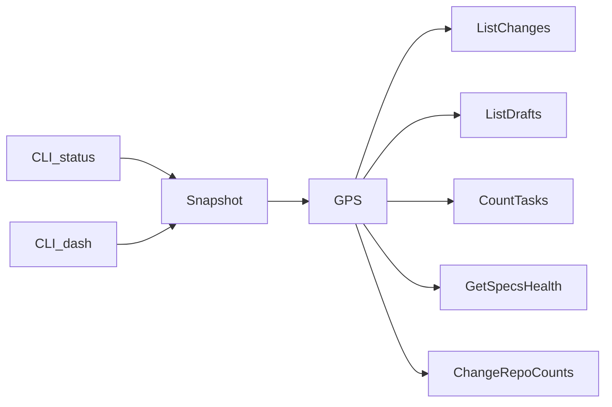

# Design: enrich-project-summary

## Non-goals

- No new CLI flags to disable listings or specs health on `project status` / `project dashboard`.
- No discarded/archived change listings (counts only).
- No per-workspace health badges in the dashboard Specs table (global header only).
- No per-change rows inside the dashboard Changes box (`project status` owns that detail).
- No new `GetProjectStatus` use case; enrichment stays on `GetProjectSummary`.
- No changes to graph health orchestration beyond forwarding existing/new summary flags.
- Documentation under `docs/cli/` does not currently document `project status` / `project dashboard` as dedicated pages; do not invent new CLI doc pages unless an existing guide already describes their output schema — if implementers find an existing mention in `docs/guide`, update that prose to mention always-on listings/health and dashboard header/tasks line.

## Affected areas

- `GetProjectSummary` / `GetProjectSummaryResult` / `execute` in `packages/core/src/application/use-cases/get-project-summary.ts`
  - Change: optional input + optional `active` / `drafts` / `specsHealth`; constructor gains enrichment deps
  - Callers: composition + kernel + tests · Risk: MEDIUM (SDK/CLI consume result shape additively)
- `GetProjectSummaryDeps` / `resolveGetProjectSummaryDeps` / `createGetProjectSummary` in `packages/core/src/composition/use-cases/get-project-summary.ts`
  - Change: resolve `listChanges`, `listDrafts`, `countTasks`, `getSpecsHealth` in addition to existing deps
  - Risk: MEDIUM
- `createKernel` / `Kernel` project namespace in `packages/core/src/composition/kernel.ts`
  - Change: only if factory wiring signature changes through deps; public `kernel.project.getProjectSummary` remains
  - Risk: LOW–MEDIUM
- `buildProjectStatusSnapshot` / `BuildProjectStatusSnapshotOptions` / `BuildProjectStatusSnapshotResult` in `packages/sdk/src/orchestration/build-project-status-snapshot.ts`
  - Change: forward `includeChanges` / `includeSpecsHealth`; summary carries enriched fields
  - Dependents: CLI status + dashboard · Risk: MEDIUM · Overlap with `deprecate-ladybug-store` on this file
- `registerProjectStatus` in `packages/cli/src/commands/project/status.ts`
  - Change: always pass enrichment options; present `active`/`drafts`/`specsHealth` in text/json/toon
  - Risk: MEDIUM
- `registerProjectDashboard` in `packages/cli/src/commands/project/dashboard.ts`
  - Change: always request enrichment; Specs header health; Changes tasks line
  - Risk: MEDIUM
- Tests: `packages/core/test/application/use-cases/get-project-summary.spec.ts`, `packages/core/test/composition/use-cases/get-project-summary.spec.ts`, `packages/sdk/test/orchestration/build-project-status-snapshot.spec.ts`, `packages/cli/test/commands/project/status.spec.ts`, `packages/cli/test/commands/project-dashboard.spec.ts`, related entrypoint stubs

## New constructs

### `GetProjectSummaryInput` — `packages/core/src/application/use-cases/get-project-summary.ts`

```ts
export interface GetProjectSummaryInput {
  readonly includeChanges?: boolean
  readonly includeSpecsHealth?: boolean
}
```

Responsibility: opt-in enrichment switches. Defaults: both false / omitted.

### `ProjectChangeSummaryEntry` — same file

```ts
export interface ProjectChangeSummaryEntry {
  readonly name: string
  readonly state: string
  readonly tasks: {
    readonly incomplete: number
    readonly total: number
  }
}
```

Responsibility: lightweight listing row for active/drafts. Does not embed full `Change` or `byArtifact` maps.

### Extended `GetProjectSummaryResult`

```ts
export interface GetProjectSummaryResult {
  readonly activeCount: number
  readonly draftCount: number
  readonly discardedCount: number
  readonly archivedCount: number
  readonly specsByWorkspace: Readonly<Record<string, number>>
  readonly workspaceCount: number
  readonly active?: readonly ProjectChangeSummaryEntry[]
  readonly drafts?: readonly ProjectChangeSummaryEntry[]
  readonly specsHealth?: GetSpecsHealthResult
}
```

When flags are off, omit `active` / `drafts` / `specsHealth` entirely (not `null`). When `includeChanges` is true, always include both arrays (possibly empty).

### Extended `GetProjectSummaryDeps`

```ts
export interface GetProjectSummaryDeps {
  readonly changes: ChangeRepository
  readonly archive: ArchiveRepository
  readonly listWorkspaces: ListWorkspaces
  readonly listChanges: ListChanges
  readonly listDrafts: ListDrafts
  readonly countTasks: CountTasks
  readonly getSpecsHealth: GetSpecsHealth
}
```

`resolveGetProjectSummaryDeps` must resolve all seven via the composition resolver (use existing `getListChanges` / `getListDrafts` / `getCountTasks` / `getGetSpecsHealth` or equivalent resolver accessors already used by kernel factories).

### Extended snapshot options

```ts
export interface BuildProjectStatusSnapshotOptions {
  readonly includeGraph?: boolean
  readonly includeHotspots?: boolean
  readonly includeChanges?: boolean
  readonly includeSpecsHealth?: boolean
}
```

Result shape unchanged at the root: enriched data lives only under `summary`.

## Approach

1. **Core counts (unchanged path)**  
   Keep parallel `count` / `countDrafts` / `countDiscarded` / `archive.count` / per-workspace `specRepo.count()` assembly. Do not derive counts from list `.length`.

2. **`includeChanges` path**  
   After (or in parallel with) counts when the flag is true:
   - `listChanges.execute()` → active list entries (`name`, `state`)
   - `listDrafts.execute()` → draft list entries
   - For each active name: `changes.get(name)` then `countTasks.execute({ change })`
   - For each draft name: `changes.getDraft(name)` then `countTasks.execute({ change })`
   - Map `tasks: { incomplete: total.incomplete, total: total.total }`
   - Preserve list order from the list use cases
   - Paginate carefully: list defaults `limit: 100`. For enrichment, request a limit high enough to cover all entries for the project status use case — use `limit` equal to `meta.total` after a first page, or pass a sufficiently large limit (prefer: call with `limit` from first response `meta.total` when `total > count`, or a single call with an explicit high limit such as `Number.MAX_SAFE_INTEGER` if the repository accepts it). Implementers MUST ensure every active/draft change appears in enrichment, not only the first page.

3. **`includeSpecsHealth` path**  
   When true: `specsHealth = await getSpecsHealth.execute({})`. When false: do not call it.

4. **Parallelism**  
   Independent work may run via `Promise.all`: base counts; when flags set, listing+task projection and specs health may run concurrent with each other and with counts.

5. **SDK**  
   Build `summaryInput` from options; call `getProjectSummary.execute(summaryInput)` only including true flags (or `{}` when both false). Do not re-expose enrichment at snapshot root.

6. **CLI `project status`**  
   Always call snapshot with `{ includeGraph: true, includeChanges: true, includeSpecsHealth: true }` (and `includeHotspots: true` when `--graph`). Present:
   - existing count fields
   - `changes.active` / `changes.drafts` arrays (or top-level `active`/`drafts` mirroring summary — keep consistency with current toon shape; prefer nesting under `changes` only if the existing presenter already nests counts there; otherwise emit `active`/`drafts` alongside `changes` counts as sibling keys matching summary field names for json/toon)
   - `specsHealth` object
     Text mode (agent bootstrap): readable sections listing each change `name [state] tasks incomplete/total`, and a specs-health line that uses **word labels** (not glyph symbols), e.g. `specsHealth: 265 total · 265 ok · 0 failed · 0 warning`. Issue rows use `failed` / `warning` labels. json/toon keep structured fields `passed` / `failed` / `warned`.

7. **CLI `project dashboard`**  
   Always call snapshot with `{ includeGraph: true, includeChanges: true, includeSpecsHealth: true }`.
   - Specs box first line stays **human-visual**: `${total} total · ${passed}✓ ${failed}✗ ${warned}w` using `summary.specsHealth` (prefer `specsHealth.totalSpecs` when health present). Use ASCII `w` for warned when emoji width would break TUI box alignment.
   - Changes box: existing four count rows, then `tasks ${done}/${total} done` where `done = sum(total - incomplete)` and `total = sum(tasks.total)` over `summary.active` only.
   - Do not list change names in the dashboard.

8. **Composition**  
   Update constructor call sites / `createGetProjectSummaryFromNormalized` to pass new deps. Kernel continues to expose the same use case instance.

## Key decisions

- **Enrich `GetProjectSummary` with flags** → keeps one project-query surface; programmatic callers stay cheap. **Rejected:** new `GetProjectStatus` use case (extra API surface); enrich only in SDK (duplicates listing/task logic outside core).
- **Absent keys when flags off** → preserves count-only contract for typed callers. **Rejected:** `null` placeholders.
- **CLI always opts in** → agent bootstrap needs full picture. **Rejected:** CLI toggle flags.
- **`project status` text uses word labels for health** (`ok` / `failed` / `warning`) → agents parse/read unambiguously. **Rejected:** glyph-only text (`✓`/`✗`/`⚠`) on status. Dashboard may keep compact visual glyphs.
- **Dashboard option C** → health in Specs header + one active-tasks line; no change listing. **Rejected:** per-workspace badges; listing every change in dashboard.
- **Tasks shape `{ incomplete, total }`** → matches “pending/total”; `complete = total - incomplete`. **Rejected:** embedding full `TaskCompletionStatus` / `byArtifact`.
- **Reuse `ListChanges`/`ListDrafts` + `get`/`getDraft` + `CountTasks`** → respects list vs detail ports. **Rejected:** teaching `CountTasks` to accept only a name without loading `Change` in this change.

## Trade-offs

- [Slower CLI `project status` / dashboard] → Acceptable for agent UX; use-case flags keep other hosts fast. Mitigate with parallel I/O.
- [ValidateSpecs cost via GetSpecsHealth] → Always-on for CLI only; programmatic path remains opt-in.
- [Overlap on `build-project-status-snapshot` with `deprecate-ladybug-store`] → Coordinate merges/archive; keep edits additive (options + forward summary input).
- [List pagination] → Must not silently truncate enrichment; implementers must load all active/drafts.

## Spec impact

### `core:get-project-summary`

- Direct dependents in this change: `sdk:build-project-status-snapshot`, `cli:project-status` (updated).
- `cli:project-dashboard` consumes snapshot/summary indirectly (updated).
- No additional out-of-scope specs require requirement changes for additive optional fields.

### `sdk:build-project-status-snapshot`

- Shared with `deprecate-ladybug-store` — keep delta additive; avoid conflicting rewrites of graph orchestration.

## Dependency map



```
┌──────────────────┐     ┌────────────────────────────┐
│ project status   │────▶│ buildProjectStatusSnapshot │
└──────────────────┘     │  includeChanges=true       │
┌──────────────────┐     │  includeSpecsHealth=true   │
│ project dashboard│────▶│                            │
└──────────────────┘     └─────────────┬──────────────┘
                                       │
                                       ▼
                         ┌─────────────────────────────┐
                         │ GetProjectSummary.execute   │
                         │  counts always              │
                         │  lists+tasks / health opt-in│
                         └──────┬──────────┬───────────┘
                                │          │
               ┌────────────────┘          └─────────────────┐
               ▼                                             ▼
     ┌─────────────────┐                          ┌──────────────────┐
     │ ListChanges /   │──get/getDraft──▶CountTasks│ GetSpecsHealth   │
     │ ListDrafts      │                          └──────────────────┘
     └─────────────────┘
```

## Migration / Rollback

Additive TypeScript fields and optional execute input. Existing callers of `execute()` with no args keep prior behaviour. Rollback = revert change; no persisted data migration.

## Testing

### Automated

- `packages/core/test/application/use-cases/get-project-summary.spec.ts`
  - default path omits enrichment keys and does not call list/CountTasks/GetSpecsHealth
  - `includeChanges` builds active/drafts with task projection; empty buckets → `[]`
  - `includeSpecsHealth` embeds health result; false path does not call health
  - counts still from repository `count*`
  - resolver deps include new collaborators
- `packages/sdk/test/orchestration/build-project-status-snapshot.spec.ts`
  - forwards enrichment flags into `getProjectSummary.execute`
  - enriched fields only under `summary`
- `packages/cli/test/commands/project/status.spec.ts`
  - snapshot called with `includeChanges` + `includeSpecsHealth` (+ graph flags as today)
  - output includes listings and health
- `packages/cli/test/commands/project-dashboard.spec.ts`
  - Specs header includes health aggregates
  - Changes box includes active tasks done/total line
  - snapshot enrichment options asserted

Map every new/updated verify scenario to at least one assertion above.

### Manual / E2E

```bash
node packages/cli/dist/index.js project status --format toon
node packages/cli/dist/index.js project status --format text
node packages/cli/dist/index.js project dashboard --format text
```

Expect: status shows active/drafts with tasks and specsHealth text like `N total · N ok · N failed · N warning`; dashboard Specs header `N total · …✓ …✗ …w` and Changes `tasks X/Y done`. Compare counts to `changes list` / `drafts list`.

Also run package unit tests for core/sdk/cli touched suites. Follow `default:_global/testing`, conventions, JSDoc on new exported types.

### Docs

- If any guide/CLI doc already describes `project status` output, update it for always-on listings/health and dashboard Specs/Changes enrichments.
- No mandatory new `docs/cli/project-status.md` in this change unless discoverability gaps appear during implement.

## Open questions

None.
