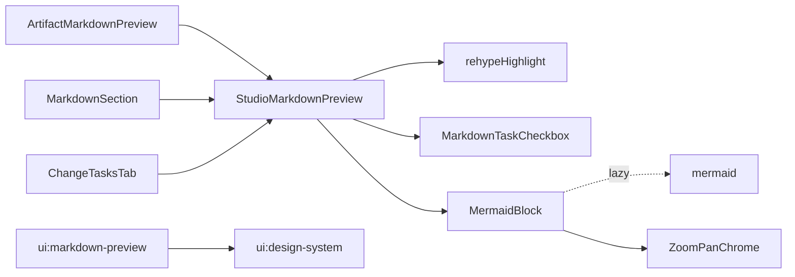

# Design: markdown-preview-code-and-checkboxes

## Non-goals

- Monaco raw/edit highlighting or Monaco theme changes.
- Interactive GFM task toggles that mutate markdown buffers.
- Live Mermaid editing / authoring.
- PNG/SVG export of Mermaid diagrams.
- Other diagram languages (PlantUML, Graphviz, etc.).
- Renaming the change or altering API/kernel/client ports.
- Rewriting unrelated `ui:design-system` chrome beyond clarifying the markdown-preview sentence.

## Affected areas

- `packages/ui/package.json`
  - Change: add runtime deps `rehype-highlight`, `highlight.js`, and `mermaid` (already applied in the first implementation pass).
  - Callers: package consumers via workspace; Risk: LOW (additive deps).

- `packages/ui/src/editor/ArtifactMarkdownPreview.tsx` — `ArtifactMarkdownPreview`
  - Change: thin wrapper around `StudioMarkdownPreview` (done). Keep public name stable.
  - Risk: LOW.

- `packages/ui/src/spec/SpecMainView.tsx` — local `MarkdownSection`
  - Change: use `StudioMarkdownPreview` with `compact` (done).
  - File risk: MEDIUM; symbol LOW.

- `packages/ui/src/change/ChangeTabPanels.tsx` — `ChangeTasksTab` markdown branch
  - Change: use `StudioMarkdownPreview` (done).
  - File risk: MEDIUM; path LOW.

- `packages/ui/src/styles/globals.css` — `.studio-markdown-preview` + highlight themes
  - Change: task-list helpers; Mermaid container rules; **inline** GitHub Dark/Light `.hljs-*` token colors under `.studio-markdown-preview--dark` / `--light` (Tailwind CLI drops nested `@import` without `postcss-import`—do not rely on importing `highlight.js/styles/*.css`). Restrict `text-foreground` to inline code via `:not(pre) > code` so fenced `hljs` tokens keep theme colors. Add Mermaid viewport/toolbar spacing as needed for zoom chrome.
  - Risk: LOW.

- `packages/ui/src/editor/MermaidBlock.tsx` — `MermaidBlock`
  - Change: extend successful-render UI with zoom/pan chrome (remaining work). Loading/error unchanged (no zoom chrome).
  - Graph: new file may be unindexed until `graph index`; Risk: LOW (internal to preview).

- `packages/ui/src/editor/StudioMarkdownPreview.tsx` — `StudioMarkdownPreview`
  - Change: already owns highlight, checks, Mermaid short-circuit; no API change for zoom (chrome lives inside `MermaidBlock`).
  - Risk: LOW.

- `packages/ui/test/studio-markdown-preview.spec.tsx`
  - Change: add zoom/pan interaction tests (mock mermaid success path).
  - Risk: LOW.

## New constructs

### `StudioMarkdownPreview`

- **Location:** `packages/ui/src/editor/StudioMarkdownPreview.tsx`
- **Shape:**

```ts
export type StudioMarkdownPreviewProps = {
  content: string
  className?: string
  /** When true, use compact typography classes (Spec context). Default false. */
  compact?: boolean
}

export function StudioMarkdownPreview(props: StudioMarkdownPreviewProps): React.ReactElement
```

- **Responsibility:** Sole shared Studio markdown preview renderer: empty state, GFM, syntax highlighting for non-mermaid fences, Lucide read-only task checks with success green, lazy Mermaid diagrams (with zoom/pan inside `MermaidBlock`) and failure fallback. Does not edit buffers or talk to `SpecdDataPort`.
- **Relationships:** Used by `ArtifactMarkdownPreview`, `MarkdownSection` in `SpecMainView`, and `ChangeTasksTab` in `ChangeTabPanels`.

### `MarkdownTaskCheckbox` (internal)

- **Location:** `StudioMarkdownPreview.tsx`
- **Shape:** replace GFM checkbox `input` with Lucide `Square` / `SquareCheck`, `role="checkbox"`, `aria-checked`, `aria-disabled="true"`, `text-studio-success` when checked. No toggle handler; no focusable disabled native checkbox.

### `MermaidBlock` (internal)

- **Location:** `packages/ui/src/editor/MermaidBlock.tsx`
- **Shape:**

```ts
export type MermaidBlockProps = {
  source: string
  /** 'dark' | 'light' derived from documentElement theme class */
  theme: 'dark' | 'light'
}

export function MermaidBlock(props: MermaidBlockProps): React.ReactElement
```

- **Responsibility:**
  - Lazy `import('mermaid')`, `securityLevel: 'strict'`, theme `dark` vs `default`, unique render ids.
  - Loading: muted “Loading diagram…” (no zoom chrome).
  - Error: source `<pre>` + short `text-destructive` message (no zoom chrome); sibling markdown stays visible.
  - Success: render SVG inside a clipped viewport with:
    - Local React state: `scale` (number), `translate` `{ x, y }` (CSS pixels).
    - Toolbar (top-right or top-end of the block): icon buttons using Lucide `ZoomIn`, `ZoomOut`, `RotateCcw` (or equivalent) with accessible names (`aria-label`: “Zoom in”, “Zoom out”, “Reset view”).
    - Zoom: multiply/divide `scale` by a fixed factor (e.g. `1.25`), clamp to a sensible range (e.g. `0.5`–`3`).
    - Reset: set `scale = 1`, `translate = { x: 0, y: 0 }`.
    - Pan: on pointer down inside the viewport (not on toolbar buttons), track pointer move to update `translate`; use `setPointerCapture` when available; cursor `grab` / `grabbing`.
    - Apply transform via CSS on an inner wrapper: `transform: translate(x,y) scale(s)` with `transform-origin: center center` (or top-left—pick one and keep consistent). Overflow: `overflow: hidden` on the viewport.
  - MUST NOT add live Mermaid editing, export buttons, or other diagram languages.

### Theme helper

- **Location:** `packages/ui/src/editor/studio-markdown-theme.ts`
- **Shape:** `useStudioDocumentTheme(): 'light' | 'dark'` — `document.documentElement.classList.contains('light')` else `'dark'`; `MutationObserver` on `class`.

## Approach

1. **Dependencies** (done): `rehype-highlight`, `highlight.js`, `mermaid` on `@specd/ui`.

2. **Shared renderer** (done): `StudioMarkdownPreview` with empty state, GFM, rehype-highlight, Lucide checks, Mermaid short-circuit via custom `pre`.

3. **Highlight CSS** (done after bugfix): inline GitHub Dark/Light token rules under `.studio-markdown-preview--dark` / `--light` in `globals.css`; rebuild `pnpm --filter @specd/ui build:css`. Hosts alias `@specd/ui/styles.css` → `packages/ui/dist/styles.css`—reload Studio after CSS rebuild.

4. **Mermaid zoom/pan** (remaining): extend `MermaidBlock` success branch only with toolbar + pan viewport as specified above. Keep loading/error without chrome. Add CSS under `.studio-mermaid-block` for relative positioning, toolbar absolute placement, and viewport height/min-height if needed.

5. **Tests:** keep existing preview tests; add cases that after mocked Mermaid success, zoom buttons exist; zoom in changes transform; reset restores; failure/loading have no zoom buttons.

6. **Docs:** No `docs/` update—Studio presentation chrome only; covered by UI specs.

## Key decisions

- **Shared component over per-call-site plugins** → one place for highlight, checks, Mermaid. **Rejected:** decorating each call site independently.
- **`rehype-highlight` + highlight.js** → lighter than Shiki. **Rejected:** Shiki.
- **Lucide Square / SquareCheck + `text-studio-success`** → bypasses disabled greying. **Rejected:** CSS-only on disabled inputs.
- **Inlined highlight theme CSS in `globals.css`** → reliable with Tailwind CLI. **Rejected:** `@import 'highlight.js/styles/...'` (dropped from build).
- **Lazy `import('mermaid')`** → avoid shell bloat. **Rejected:** eager mermaid.
- **Theme via `documentElement` class + MutationObserver** → matches shell. **Rejected:** prop-drill theme.
- **Mermaid zoom/pan via CSS transform + Lucide toolbar** → lightweight, no new deps. **Rejected:** leaving diagrams static (user requested inspectability); full Mermaid editor / export chrome.

## Trade-offs

- [highlight.js theme CSS size] → Mitigation: only GitHub Dark + Light token rules, scoped under preview theme classes.
- [Mermaid parse quirks / security] → Mitigation: `securityLevel: 'strict'`; failure → source + error.
- [Zoom/pan state is local per block] → Mitigation: acceptable for read-only preview; reset always available.
- [Pointer pan vs text selection] → Mitigation: pan only on viewport pointer gestures; toolbar buttons stopPropagation.
- [`ui:design-system` HIGH fan-in] → Mitigation: delta only clarifies markdown-preview sentence; no token renames.

## Spec impact

### `ui:design-system`

- HIGH dependent-spec fan-in. Delta only expands the “artifact and inspector surfaces” markdown-preview wording to mention zoom/pan chrome. No additional specs required.

### `ui:markdown-preview`

- New requirement: mermaid diagrams expose icon zoom and pan chrome. Dependents: none yet. Depends on `ui:design-system`.

## Dependency map



```
┌────────────────────────┐
│ ArtifactMarkdownPreview│──┐
└────────────────────────┘  │
┌────────────────────────┐  │     ┌──────────────────────┐
│ MarkdownSection        │──┼────▶│ StudioMarkdownPreview│
└────────────────────────┘  │     └──────────┬───────────┘
┌────────────────────────┐  │                │
│ ChangeTasksTab         │──┘       ┌────────┼────────┐
└────────────────────────┘          ▼        ▼        ▼
                              highlight  Lucide    MermaidBlock
                              (rehype)   checks    ├─ lazy mermaid
                                                   └─ zoom/pan chrome

┌────────────────────┐  depends on  ┌─────────────────┐
│ ui:markdown-preview│─ ─ ─ ─ ─ ─ ─▶│ ui:design-system│
└────────────────────┘              └─────────────────┘
```

## Migration / Rollback

- Additive UI-only change. Rollback: revert `@specd/ui` commits / remove deps; no data migration.
- After CSS or component edits: `pnpm --filter @specd/ui build` (or at least `build:css`) so Studio hosts pick up `dist/styles.css`.

## Testing

### Automated

- `packages/ui/test/studio-markdown-preview.spec.tsx`:
  - Empty content → empty indicator.
  - Fenced non-mermaid → `code.hljs` + token span (e.g. `.hljs-keyword`).
  - Checked task → success class; no `input[type=checkbox][disabled]` as visible control.
  - Mermaid success → mocked `import('mermaid')` SVG; assert diagram.
  - Mermaid failure → source + error; sibling prose intact.
  - Mermaid success zoom chrome → zoom in / out / reset buttons present; after zoom in, transform scale increases; reset restores identity transform.
  - Mermaid loading/error → no zoom toolbar.
- Keep `pnpm --filter @specd/ui test` green.

### Manual / E2E

1. Rebuild UI CSS/JS and run Studio web or desktop.
2. Preview with TS fence, checked `- [x]`, valid Mermaid: colored tokens, green checks, diagram + zoom icons; pan after zoom; reset restores.
3. Toggle Appearance: highlight + Mermaid theme update.
4. Invalid Mermaid: source + error; no zoom chrome; rest of doc intact.
5. Spec context + Tasks show the same chrome.

### Lint / docs globals

- Follow `default:_global/conventions`, `default:_global/eslint`, JSDoc on exported functions per `default:_global/docs`.
- No `docs/` file updates in this change.
