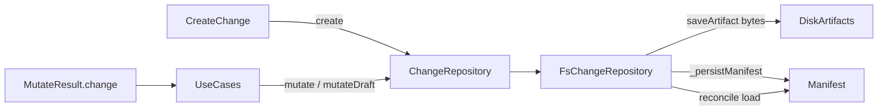

# Design: save-artifact-reopen-vs-drift

## Non-goals

- Changing `LifecycleEngine` transition rules or invalidation policy semantics.
- Introducing a public `isMutating(name)` API.
- Classifying drift inside `saveArtifact` (duplicate of the load path).
- Optional sugar `saveArtifact(name, artifact)` that wraps `mutate` and returns `.change` (may come later; not required).
- SpecList / Meta / other active changes' scopes.
- Index-cache `mutate` helpers (`FsChangeIndexCache`, validation-result cache).

## Affected areas

### Port and FS adapter (primary)

- `ChangeRepository` in `packages/core/src/application/ports/change-repository.ts`
  - Change: add abstract `create(change)`; remove application-facing abstract `save`; change `mutate` / `mutateDraft` to return `Promise<{ result: T; change: Change }>`; rewrite `saveArtifact` docs/contract (void, mutate-window only, no Change mutation).
  - Callers: all change use cases + stubs · Risk: CRITICAL (port surface).
- `FsChangeRepository` in `packages/core/src/infrastructure/fs/change-repository.ts`
  - Change: implement `create` (extract first-persist path from today's `save`); keep internal `_save` / rename current `save` to private/internal; after successful mutate/mutateDraft persist, re-enter `_getInternal`/`_manifestToChange` reconcile and return `.change`; `saveArtifact` require `_activeMutationInProgress` / `_draftMutationInProgress`, drop `setFileStatus`.
  - Risk: HIGH (`saveArtifact` / mutate paths).
- `ChangeArtifact.setFileStatus` in `packages/core/src/domain/entities/change-artifact.ts`
  - Change: remove method if unused after `saveArtifact` change (sole caller today).
  - Risk: LOW (dead API).

### Use cases — `create`

- `CreateChange` in `packages/core/src/application/use-cases/create-change.ts`
  - Change: `await this._changes.create(change)` instead of `.save(change)`.
  - Risk: MEDIUM.

### Use cases — `mutate` / `mutateDraft` return adaptation

Each must stop treating callback `fresh` as the durable returned `Change`. Pattern:

```ts
const { result, change } = await this._changes.mutate(name, (fresh) => {
  // mutate fresh…
  return auxiliaryResult // or void
})
// use `change` for durable aggregate; `result` for projections/flags
```

| File                                     | Adaptation                                                                               |
| ---------------------------------------- | ---------------------------------------------------------------------------------------- |
| `approve-spec.ts` / `approve-signoff.ts` | Return `.change`                                                                         |
| `discard-change.ts`                      | `mutate` / `mutateDraft` → `.change`                                                     |
| `restore-change.ts`                      | `mutateDraft` → `.change`                                                                |
| `skip-artifact.ts`                       | Return `.change`                                                                         |
| `update-spec-deps.ts`                    | Deps list in `result`; entity from `.change` if needed                                   |
| `transition-change.ts`                   | `persistedChange = … .change`                                                            |
| `edit-change.ts`                         | Callback returns `{ invalidated, removedSpecIds }`; assemble with `.change`              |
| `invalidate-change.ts`                   | Same as edit — prefer `.change`                                                          |
| `archive-change.ts`                      | Where `change = await mutate(...)`, use `.change`; side-effect-only awaits ignore return |
| `draft-change.ts`                        | Ignore or assert via `.change`                                                           |
| `validate-artifacts.ts`                  | Side-effect `await mutate` — ignore or use `.change` if needed later                     |
| `refresh-implementation-tracking.ts`     | Prefer `projectImplementationTracking(change)` on `.change` after mutate                 |
| `update-implementation-tracking.ts`      | Same                                                                                     |

### Tests / stubs

- `packages/core/test/application/use-cases/helpers.ts` — `StubChangeRepository`: `create`, mutate return shape, byte-only `saveArtifact`.
- `packages/core/test/infrastructure/fs/change-repository.spec.ts` — create, mutate reconcile, saveArtifact window, no in-progress reopen.
- Per-use-case specs that assert `.save` was called (`create-change.spec.ts`, etc.) → assert `.create` / new mutate shape.

### Documentation

- `docs/core/ports.md` and any examples that document public `save` / `saveArtifact` reopen → update to `create` / mutate-window byte write / `{ result, change }`.

## New constructs

### `MutateResult<T>` (port-level type)

- **Location:** `packages/core/src/application/ports/change-repository.ts` (exported type).
- **Shape:**
  ```ts
  export interface MutateResult<T> {
    readonly result: T
    readonly change: Change
  }
  ```
- **Responsibility:** Return type of `mutate` / `mutateDraft`.
- **Relationships:** Consumed by all mutating use cases.

### Error for saveArtifact outside window

- Reuse `DraftedChangeReadOnlyError` only when drafted-specific; for active changes outside window prefer a clear repository error (e.g. existing domain error if one fits, or a small dedicated error such as `ChangeMutationRequiredError` with operation `saveArtifact`). Exact error class: implementer chooses one existing machine-readable error if suitable; otherwise add `ChangeMutationRequiredError` under `packages/core/src/domain/errors/` with `operation: 'saveArtifact'`.

### Internal save helper (FS)

- **Location:** private method on `FsChangeRepository` (today's `save` body).
- **Shape:** `private async _persistManifest(change: Change): Promise<void>`
- **Responsibility:** Atomic manifest write + bucket moves + index maintenance. Called by `create`, `mutate`, `mutateDraft`, and locked get drift persist.
- **Not** exported on the port.

## Approach

1. **Port reshape**
   - Add `abstract create(change: Change): Promise<void>`.
   - Remove `abstract save` from the public abstract list.
   - `mutate` / `mutateDraft`: `Promise<MutateResult<T>>`.
   - `saveArtifact`: document void + mutate-window + no Change touch.

2. **FsChangeRepository**
   - Rename/move current `save` implementation to `_persistManifest`.
   - `create(change)`: uniqueness check across buckets → mkdir + `_persistManifest` (same first-save path as today).
   - `mutate`:
     ```
     lock
     fresh = _getInternal(name, { skipWrite: true })
     mark in-progress set
     result = await fn(fresh)
     await _persistManifest(fresh)
     change = await reconcileUnderLock(name)  // load path like get; persist if needed
     clear in-progress set
     return { result, change }
     ```
   - `mutateDraft`: same return/reconcile; resolve post-move bucket for reload.
   - `saveArtifact`: if name not in active/draft in-progress sets → reject; else write bytes only (conflict checks unchanged); never `setFileStatus`.

3. **CreateChange** → `create`.

4. **Mechanical use-case updates** for `MutateResult` (table above).

5. **Remove `setFileStatus`** if unused.

6. **Tests + docs** alignment.

Order: port types → FS create/internal save/reconcile/saveArtifact → CreateChange → use-case return adaptations → stub/tests → docs → remove dead `setFileStatus`.

## Key decisions

- **`create` public, `save` internal** → closes stale-snapshot persist bypass. **Rejected:** keep public `save` with docs-only guidance.
- **`mutate` returns `{ result, change }` with post-save reconcile** → single drift chokepoint (`_manifestToChange` / get path); callers stop trusting `fresh`. **Rejected:** classify inside `saveArtifact`; **Rejected:** ad-hoc caller `get()` after mutate.
- **`saveArtifact` = in-mutate byte write, `void`** → enforced via existing mutation-in-progress sets. **Rejected:** opaque top-level mutate sugar as default.
- **Domain mutators stay unchecked** → persistence boundary is the guard, not `Change.transition`.

## Trade-offs

- [CRITICAL port blast radius] → Mechanical, systematic updates + stub first; compile/typecheck gates the migration.
- [Double manifest write when reconcile finds drift] → Acceptable; correctness over one write.
- [Mid-callback `fresh` still stale after `saveArtifact`] → Documented; durable truth only on `.change`.
- [Breaking TypeScript API for `mutate`] → All in-repo callers updated in this change; no external published promise of old signature beyond monorepo.

## Spec impact

### `core:change-repository-port`

- Direct dependents include `core:fs-change-repository`, `core:create-change`, and many use-case specs that mention `save`/`mutate` only narratively.
- Use-case specs that do not name the public `save` API need no delta solely for return-shape wiring.
- `core:create-change` updated in this change for `create`.

### `core:fs-change-repository`

- Depends on the port; deltas in this change cover adapter behaviour.

No additional specs discovered that require requirement changes beyond the three in scope.

## Dependency map



```
┌──────────────┐   create    ┌──────────────────┐
│ CreateChange │────────────▶│ ChangeRepository │
└──────────────┘             │  (port)          │
┌──────────────┐  mutate*    │                  │
│ Other UCs    │────────────▶│                  │
└──────┬───────┘             └────────┬─────────┘
       │                              │
       │  MutateResult.change         ▼
       │                     ┌──────────────────┐
       └─────────────────────│ FsChangeRepository│
                             └────────┬─────────┘
                    ┌─────────────────┼─────────────────┐
                    ▼                 ▼                 ▼
              artifact bytes    _persistManifest    reconcile get
```

## Migration / Rollback

- Pure code/API reshape inside the monorepo; no on-disk manifest schema change.
- Rollback = revert the change; existing manifests remain readable.
- No feature flag required.

## Testing

### Automated

- `packages/core/test/infrastructure/fs/change-repository.spec.ts`
  - `create` success / collision across buckets
  - `mutate` returns `{ result, change }`; `.change` matches subsequent `get` after in-callback `saveArtifact` drift
  - `saveArtifact` outside window rejected; inside window does not call `setFileStatus` / does not alter status
  - drafted guards still work inside `mutateDraft`
- `packages/core/test/application/use-cases/helpers.ts` stub updated; compile all use-case tests
- `create-change.spec.ts` asserts `create` not `save`
- Spot-check `edit-change`, `transition-change`, `discard-change`, `restore-change`, `refresh-implementation-tracking` for `.change` usage
- Map verify scenarios for mutate/create/saveArtifact/reconcile to the FS and use-case tests above

### Manual / E2E

1. Create a change, validate an artifact to `complete`, then in a small script/`mutate` call `saveArtifact` with different content → inspect returned `.change` / `changes status` for drift/`[!]` without unconditional `in-progress` from saveArtifact alone.
2. Confirm `CreateChange` still scaffolds and lists the new change.
3. Run core unit tests: `pnpm --filter @specd/core test` (or package equivalent).

### Docs

- Update `docs/core/ports.md` (and implementing-a-port examples if they show `save`) per `default:_global/docs`.

## Open questions

None.
