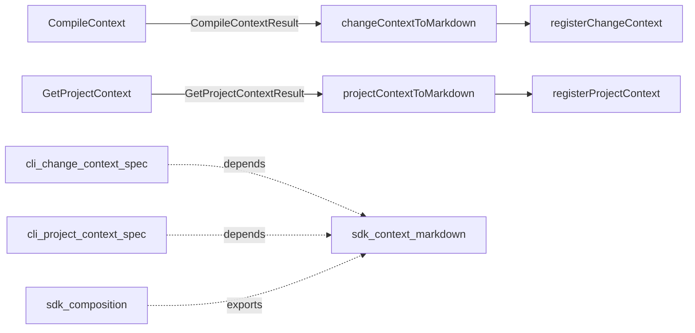

# Design: context-catalogue-load-hints

## Non-goals

- Do not change `CompileContext` or `GetProjectContext` result shapes.
- Do not add a unified `change spec-context` command.
- Do not make `spec-preview` return optimized context.
- Do not change default `contextMode` or `--include-change-specs` defaults.
- Do not put presentation strings in `@specd/core`.

## Affected areas

- `packages/cli/src/commands/change/context.ts` — `registerChangeContext` text branch currently assembles fingerprint, project entries, full specs, and a blanket `spec-preview` catalogue hint inline. Replace text assembly with `changeContextToMarkdown`. Keep flags, use-case call, stderr warnings, json/toon passthrough. Risk: LOW (CLI command + tests only).
- `packages/cli/src/commands/project/context.ts` — `registerProjectContext` text branch assembles catalogue without load hints. Replace with `projectContextToMarkdown`. Risk: LOW.
- `packages/cli/test/commands/change-context.spec.ts` — update assertions that expect blanket `spec-preview` guidance; add source-aware hint expectations.
- `packages/cli/test/commands/project-context.spec.ts` — assert `specs context` catalogue hint and absence of `spec-preview`.
- `packages/sdk/src/index.ts` — export new presentation helpers.
- `packages/sdk/src/composition` barrel / packaging — no composition wiring change beyond exports; presentation is pure.
- `docs/cli/` entries for `change context` and `project context` — document source-aware / specs-context hints.
- `docs/sdk/` — document presentation helpers for host integrators.

## New constructs

### Input contracts (existing core types — restated for implementers)

These types already exist in `@specd/core` and are re-exported by `@specd/sdk`. This change MUST NOT redefine or alter them; helpers consume them as-is.

```typescript
// From CompileContext (change context)
type ContextSpecSource = 'specIds' | 'specDependsOn' | 'includePattern' | 'dependsOnTraversal'

interface ProjectContextEntry {
  readonly source: 'instruction' | 'file'
  readonly path?: string
  readonly content: string
}

interface ContextSpecEntry {
  readonly specId: string
  readonly title?: string
  readonly description?: string
  readonly source: ContextSpecSource
  readonly mode: 'list' | 'summary' | 'full'
  readonly content?: string // only when mode === 'full'
}

interface CompileContextResult {
  readonly contextFingerprint: string
  readonly status: 'changed' | 'unchanged'
  readonly projectContext: readonly ProjectContextEntry[]
  readonly specs: readonly ContextSpecEntry[]
  readonly warnings: readonly ContextWarning[]
}

// From GetProjectContext (project context)
interface GetProjectContextResult {
  readonly contextEntries: string[] // already pre-rendered strings
  readonly specs: ContextSpecEntry[]
  readonly warnings: ContextWarning[]
}
```

When `CompileContextResult.status === 'unchanged'`, `projectContext` and `specs` are empty arrays — helpers MUST still emit fingerprint + unchanged message and MUST NOT invent catalogue content.

### `changeContextToMarkdown`

- **Location:** `packages/sdk/src/presentation/change-context-to-markdown.ts`
- **Shape:**

```typescript
export interface ChangeContextToMarkdownOptions {
  readonly changeName: string
  readonly includeFingerprint?: boolean // default true
}

export function changeContextToMarkdown(
  context: CompileContextResult,
  options: ChangeContextToMarkdownOptions,
): string
```

- **Responsibility:** Render agent-facing markdown for a compiled change context, including source-aware load hints. No I/O.
- **Relationships:** Consumes `CompileContextResult` from core (re-exported by SDK). Called by CLI `change context` text mode; reusable by MCP/other hosts.

### `projectContextToMarkdown`

- **Location:** `packages/sdk/src/presentation/project-context-to-markdown.ts`
- **Shape:**

```typescript
export function projectContextToMarkdown(context: GetProjectContextResult): string
```

- **Responsibility:** Render agent-facing markdown for project context. Catalogue hint is always `specs context`. Never mentions `spec-preview`. Empty context → `no project context configured`.
- **Relationships:** Consumes `GetProjectContextResult`. Called by CLI `project context` text mode.

### Shared catalogue helpers (internal)

- **Location:** `packages/sdk/src/presentation/_shared/catalogue.ts` (or equivalent private module under `presentation/`)
- **Shape:**

```typescript
function renderFullSpecs(specs: readonly ContextSpecEntry[]): string
function renderChangeCatalogue(specs: readonly ContextSpecEntry[], changeName: string): string
function renderProjectCatalogue(specs: readonly ContextSpecEntry[]): string
```

- **Responsibility:** Tables + prose hints. Partition change catalogue entries (`mode !== 'full'`) by `source`:
  1. `specIds` — own table + `spec-preview` hint (only when non-empty). These are change-scoped: deltas or new specs; `specs context` cannot show them correctly.
  2. `specDependsOn` | `includePattern` — own table.
  3. `dependsOnTraversal` — under `### Via dependencies`.
  - Groups 2+3 share one `specs context` prose line when either is non-empty.
  - Project catalogue uses only the `specs context` prose and MUST NEVER include `spec-preview`.
  - Change summary columns: Spec ID, Mode, Source, Title, Description. Project summary columns omit Source.
- **Relationships:** Not required public exports; may stay unexported.

### Presentation barrel

- **Location:** `packages/sdk/src/presentation/index.ts`
- **Responsibility:** Re-export public helpers + `ChangeContextToMarkdownOptions`.
- **Wired from:** `packages/sdk/src/index.ts`.

## Approach

1. Implement SDK presentation helpers mirroring current CLI markdown structure (fingerprint, `---`, `## Spec content`, `## Available context specs`) but with corrected hints.
2. Unit-test helpers in `packages/sdk/test/presentation/` with fixture `CompileContextResult` / `GetProjectContextResult` objects (no kernel).
3. Refactor CLI text branches to call helpers; delete inline table/hint construction (`renderFingerprintLine` can move into the helper or become unused and removed).
4. Update CLI tests for new hint strings.
5. Export helpers from SDK public barrel; update `sdk:composition` layer list to include `presentation/`.
6. Update `docs/cli/` and `docs/sdk/` in the same change.

### Hint wording and catalogue layout (exact)

`mode !== 'full'` entries go under `## Available context specs`. Partition by `source`:

```markdown
## Available context specs

Use `specd changes spec-preview <changeName> <specId>` to load the merged full content of any change spec you need.

| Spec ID | Mode    | Source  | Title | Description |
| ------- | ------- | ------- | ----- | ----------- |
| …       | summary | specIds | …     | …           |

Use `specd specs context <specId>` to load the full optimized context of any listed spec.

| Spec ID | Mode    | Source         | Title | Description |
| ------- | ------- | -------------- | ----- | ----------- |
| …       | summary | includePattern | …     | …           |
| …       | summary | specDependsOn  | …     | …           |

### Via dependencies

| Spec ID | Mode    | Source             | Title | Description |
| ------- | ------- | ------------------ | ----- | ----------- |
| …       | summary | dependsOnTraversal | …     | …           |
```

- Emit the `spec-preview` block only when there is at least one catalogue entry with `source: 'specIds'`.
- Emit the `specs context` line once whenever any catalogue entry has a non-`specIds` source.
- Omit empty groups.

**Project catalogue:** same `specs context` prose; never `spec-preview`; no Source column.

### Unchanged fingerprint behaviour

Fingerprint comparison is done by `CompileContext` when the caller passes `fingerprint`. The CLI always calls `changeContextToMarkdown` on the returned context (including `status: 'unchanged'`). The helper renders:

```
Context Fingerprint: <hash>

Context unchanged since last call.
```

(omit empty sections). Exact message string must match for CLI/SDK test stability.

## Key decisions

- **Presentation in SDK, not CLI** → hosts share one contract; hints are product behaviour. **Rejected:** CLI-only string fix — would leave MCP/other hosts inconsistent.
- **Derive hints from `source`, not a core `recommendedLoadCommand` field** → no core schema change. **Rejected:** core enrichment — unnecessary for this scope.
- **`spec-preview` only for `source: 'specIds'`** → those specs may have deltas or be new; canonical `specs context` is wrong for them. Everything else is canonical → `specs context`.
- **Separate catalogue tables by hint group** → do not mix `specIds` and canonical specs in one table under a single prose line.
- **`sdk:context-markdown` does not depend on `sdk:composition`** → avoids a circular spec dependency; composition exports the helpers, presentation does not need the barrel contract.
- **Prose hints above tables, not a `Load via` column** → simpler agent guidance, less table noise.
- **Plural CLI groups in hints (`changes`, `specs`)** → matches agent-facing guidance elsewhere.

## Trade-offs

- [Overlap with `deprecate-ladybug-store` on `sdk:composition`] → Coordinate archive order; this change only adds presentation exports/layer wording. Mitigate by keeping composition delta minimal.
- [Slight behaviour change for agents that always used `spec-preview` for deps] → Intentional fix; deps never worked with `spec-preview`.

## Spec impact

### `cli:change-context`

- Dependents: skills/docs that cite the blanket `spec-preview` hint. Update docs/skills wording if they hardcode the old string. No other code specs depend on the hint text.

### `cli:project-context`

- Dependents: docs only. Adding a hint is additive.

### `sdk:composition`

- Dependents: host docs and CLI import policy. Additive exports; low risk.
- Overlap: also in `deprecate-ladybug-store` — watch merge conflicts on barrel export lists.

### `sdk:context-markdown` (new)

- No dependents yet; CLI specs depend on it after this change.

## Dependency map



```
┌────────────────────┐     ┌──────────────────────────┐
│ CompileContext     │────▶│ changeContextToMarkdown  │
└────────────────────┘     └────────────┬─────────────┘
                                        │
                                        ▼
                               ┌────────────────────┐
                               │ change context CLI │
                               └────────────────────┘

┌────────────────────┐     ┌──────────────────────────┐
│ GetProjectContext  │────▶│ projectContextToMarkdown │
└────────────────────┘     └────────────┬─────────────┘
                                        │
                                        ▼
                               ┌────────────────────┐
                               │ project context CLI│
                               └────────────────────┘

┌────────────────────┐  depends on  ┌────────────────────┐
│ cli:change-context │─ ─ ─ ─ ─ ─ ▶│ sdk:context-markdown│
│ cli:project-context│─ ─ ─ ─ ─ ─ ▶│                    │
│ sdk:composition    │─ ─ exports ▶│                    │
└────────────────────┘              └────────────────────┘
```

## Testing

### Automated

- `packages/sdk/test/presentation/change-context-to-markdown.spec.ts`
  - unchanged exact message `Context unchanged since last call.`
  - fingerprint + full specs
  - `specIds` catalogue group → `spec-preview` hint
  - canonical catalogue → `specs context` hint
  - `dependsOnTraversal` under `### Via dependencies`
  - no `spec-preview` prose when `specIds` catalogue group empty
- `packages/sdk/test/presentation/project-context-to-markdown.spec.ts`
  - empty → `no project context configured`
  - catalogue includes `specs context`
  - never contains `spec-preview`
- Update `packages/cli/test/commands/change-context.spec.ts` and `project-context.spec.ts` for new guidance strings and delegation behaviour.

### Manual / E2E

```bash
node packages/cli/dist/index.js change context context-catalogue-load-hints designing --format text
# expect: specs context hint for deps; no blanket-only spec-preview for deps

node packages/cli/dist/index.js change context context-catalogue-load-hints designing --include-change-specs --mode hybrid --format text
# expect: full change specs; catalogue deps still use specs context

node packages/cli/dist/index.js project context --format text
# expect: specs context hint; never spec-preview
```

### Docs

- `docs/cli/cli-reference.md` — replace blanket `spec-preview` catalogue guidance with source-aware hints.
- `docs/guide/_sections/getting-started/context-compilation.md` — same correction for agent-facing guide text.
- `docs/cli/` project-context entry — `specs context` only.
- `docs/sdk/` — presentation helpers API (`changeContextToMarkdown` / `projectContextToMarkdown`).

## Open questions

None.
