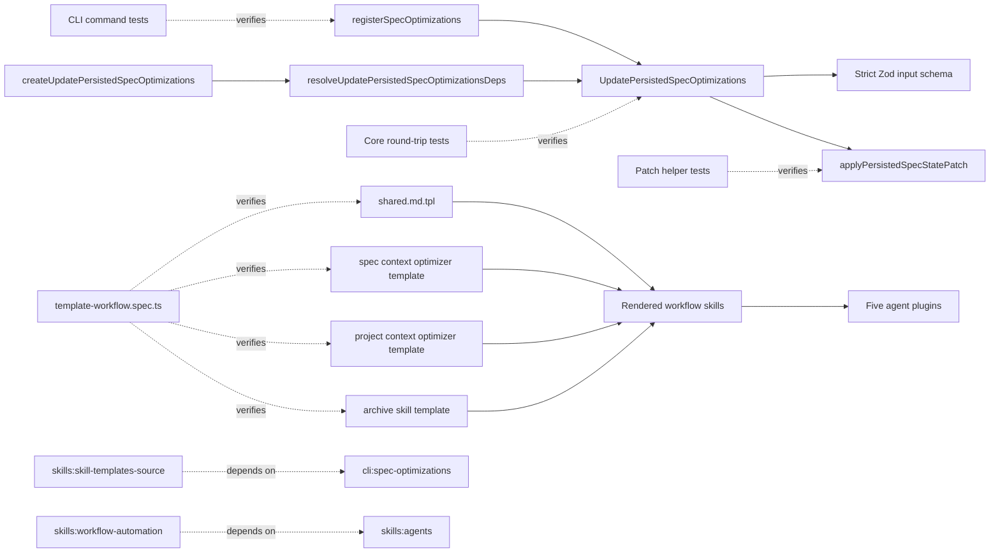

# Design: align-spec-optimization-cli-and-agents

## Objectives and expected outcomes

The spec optimization CLI will expose direct options suitable for agent-generated text while retaining the existing JSON file/stdin interface. The command boundary will reject ambiguous or empty mutations before resolving or calling the Kernel. Successful mutations will continue to delegate exactly once to `Kernel.specs.updatePersistedOptimizations`.

Agent templates and shared workflow guidance will use the correct command for each source of information:

- `specd project status --format toon` and its top-level `llmOptimizedContext` field for the effective optimization gate.
- `specd specs show <spec-id>` for exact raw spec artifacts.
- `specd specs context <spec-id>` for semantic agent-ready context, including filtering, dependency traversal, and optimized-content preference.
- `specd specs metadata <spec-id>` only for the normalized metadata projection and materialization diagnostics such as `source`, `regenerated`, and warnings.

The final result remains backward-compatible for callers that use `--input` on `set` or repeated `--field` on `clear`.

Core clear operations will persist their returned projection. Clearing one field removes
only that field from stored state; clearing the final field omits the entire
`optimizations` block. Tests inspect both the state written to the repository and state
read back after mutation, so a successful-looking return without durable deletion fails.

Core will also validate the full mutation input at runtime with Zod before parsing the
spec ID or invoking any collaborator. Invalid payloads from JavaScript or otherwise
untyped SDK consumers will receive `InvalidInputError`, matching typed callers and CLI
semantics.

## Non-goals

- No SDK, MCP, lock schema, metadata schema, freshness, baseline, or hashing changes.
- No change to the public `UpdatePersistedSpecOptimizations` input or result types.
- No new project-level optimization persistence command.
- No automatic metadata generation after an optimization write.
- No change to plugin installation locations, template metadata, frontmatter, or supported runtime capabilities.
- No direct edits to ignored local installations under `.agents/` or `.codex/`; canonical package templates are the source of truth.
- No removal or deprecation of `--input` or `--field`.

## Functional contract

### Set command

`specd specs optimizations set <spec-id>` accepts these options in addition to the existing format and configuration options:

```text
--input <json-file|->
--optimized-description <text>
--optimized-context <text>
```

The accepted input forms are:

1. `--input` alone. The existing JSON parsing contract remains: the input is an object, contains at least one key, uses only `optimizedDescription` and `optimizedContext`, and maps each present key to a string.
2. One or both direct value options without `--input`. `--optimized-description` maps to `set.optimizedDescription`; `--optimized-context` maps to `set.optimizedContext`. Supplying both performs one atomic update.

The following combinations fail before `resolveCliContext` and before any Kernel method call:

- no `--input` and no direct value option;
- `--input` combined with either direct value option;
- an empty JSON object;
- malformed JSON, a non-object JSON value, an unknown key, or a non-string value.

Empty strings remain valid field values because the existing JSON contract accepts strings without imposing a minimum length.

### Clear command

`specd specs optimizations clear <spec-id>` accepts:

```text
--field optimizedDescription|optimizedContext
--optimized-description
--optimized-context
```

The accepted selection forms are:

1. One or more repeated `--field` options without direct clear flags.
2. One or both direct clear flags without `--field`.

Supplying both direct flags produces one `clear` array containing `optimizedDescription` and `optimizedContext`. Repeated field names are normalized to unique names before delegation.

The following combinations fail before `resolveCliContext` and before any Kernel method call:

- no field selection;
- any `--field` combined with either direct clear flag;
- an unsupported `--field` value.

### Delegation and output

Each valid `set` or `clear` invocation resolves the CLI context only after option validation, parses the canonical spec ID, calls `Kernel.specs.updatePersistedOptimizations.execute` exactly once, and preserves the current text, JSON, and TOON output shapes. Existing error mapping through `handleError` and `cliError` remains in effect. User validation failures exit with code 1 and an `error:` message. No retry is performed by the CLI; existing Core conflict errors retain their retry guidance.

### Core clear persistence

`UpdatePersistedSpecOptimizations.execute()` continues to derive the complete next
optimization value before applying a persisted-state patch. Its patch call uses three
distinct states:

- omitted `optimizations`: preserve the existing block;
- a non-empty `PersistedSpecOptimizations` object: replace the existing block with the
  normalized object;
- `optimizations: null`: remove the existing block.

The use case passes the non-empty object after set or partial clear and `null` after clear
removes the final field. It never uses omission to represent deletion.
`writePersistedState` receives the complete resulting state and the existing
`expectedRevision` contract remains unchanged.

### Core runtime input validation

`UpdatePersistedSpecOptimizations.execute()` accepts the existing public TypeScript input
shape but treats its runtime argument as untrusted. Its first operation is a strict Zod
parse with this contract:

```ts
{
  specId: string // non-empty
  set?: {
    optimizedDescription?: string
    optimizedContext?: string
  } // strict and non-empty when present
  clear?: Array<'optimizedDescription' | 'optimizedContext'> // non-empty when present
}
```

The root object and `set` object are strict. Exactly one of `set` and `clear` is present.
Optimization strings may be empty because the existing contract accepts arbitrary
caller-supplied strings. Duplicate valid clear names remain accepted as idempotent field
selection.

The parser uses `safeParse()`. On failure it formats every issue as
`<dot.path>: <message>`, using `input` when the issue path is empty, joins issues with
`; `, and throws:

```ts
new InvalidInputError(`Invalid persisted optimization update: ${issues}`)
```

No `parseSpecId`, repository lookup, ownership check, schema resolution, artifact read,
or persisted-state read/write occurs before successful validation.

## Non-functional requirements and constraints

- The CLI adapter contains parsing and option normalization only; freshness, hashes, baseline capture, mutation, concurrency protection, and read-only workspace enforcement remain in Core.
- The persisted-state patch helper remains pure and performs no I/O. The `null` sentinel
  is internal to Core and is never serialized as a lock-file value.
- Zod validation is deterministic and linear in the tiny input object. It performs no I/O
  and uses the Core package's existing Zod dependency.
- No additional filesystem reads occur for the direct option form. The compatibility `--input` form retains one file or stdin read.
- Mutation complexity is constant because there are exactly two supported fields.
- No authorization model changes are introduced. Existing workspace ownership and read-only checks remain authoritative.
- No new logging, metrics, or monitoring signals are required. Existing structured output and error handling remain the operational diagnostics.
- TypeScript remains strict, ESM-only, and free of `any` and default exports.
- New source symbols require explicit return types and JSDoc with parameters and return behavior.

## Affected areas

- `registerSpecOptimizations()` in `packages/cli/src/commands/spec/optimizations.ts`
  - Change: make `--input` and `--field` optional at Commander registration, add direct set/clear options, normalize the mutually exclusive forms, and validate before CLI context resolution.
  - Callers/dependents: one direct test dependent, `setup()` in `packages/cli/test/commands/spec-optimizations.spec.ts`; no transitive production callers.
  - Graph risk: LOW at symbol level and MEDIUM at file level. The public command syntax is user-facing, so backward compatibility and error tests are mandatory.

- `readInput()` and `parseOptimizationSetInput()` in `packages/cli/src/commands/spec/optimizations.ts`
  - Change: retain file/stdin parsing; compose them through a new set-input normalizer. `parseOptimizationSetInput()` continues to reject empty objects and invalid shapes.
  - Callers/dependents: `registerSpecOptimizations()` and its command tests only.
  - Graph risk: MEDIUM within the CLI file; no cross-workspace callers.

- `packages/cli/test/commands/spec-optimizations.spec.ts`
  - Change: extend command-level tests for legacy and direct inputs, exclusivity, empty selections, exact Kernel payloads, one-call behavior, no-call failures, and clear/get round-trip expectations.
  - Impact: isolated Vitest adapter tests with a mocked Kernel.

- `applyPersistedSpecStatePatch()` and `PersistedSpecStatePatch` in
  `packages/core/src/domain/services/apply-persisted-spec-state-patch.ts`
  - Change: accept `null` as an explicit optimization-block deletion sentinel, preserve
    existing optimizations only when the property is omitted, and remove the current
    `optimizations ?? state.optimizations` fallback that discards deletions.
  - Callers/dependents: 11 direct and 92 indirect dependents; graph risk: CRITICAL.
  - Mitigation: every existing caller that omits the property or supplies an object keeps
    its current behavior. Only `UpdatePersistedSpecOptimizations` supplies `null`.

- `UpdatePersistedSpecOptimizations.execute()` in
  `packages/core/src/application/use-cases/update-persisted-spec-optimizations.ts`
  - Change: validate runtime input through a strict private Zod schema before any other
    work; then pass `{ optimizations: null }` when clear removes the final field and pass
    the non-empty normalized object for partial clear or set.
  - Callers/dependents: 5 direct and 1 indirect dependent; graph risk: MEDIUM. The public
    method signature, result, conflict behavior, and composition wiring remain unchanged.

- `packages/core/test/domain/services/apply-persisted-spec-state-patch.spec.ts`
  - Change: prove omitted optimizations preserve existing state, `null` removes existing
    state, and object patches still replace and normalize the block.

- `packages/core/test/application/use-cases/update-persisted-spec-optimizations.spec.ts`
  - Change: add table-driven strict-input tests using untyped payloads plus stateful
    repository round trips for partial clear, absent-field clear, and final-field clear;
    assert invalid inputs call no collaborator and clear tests inspect reloaded state.

- `packages/core/test/composition/use-cases/update-persisted-spec-optimizations.spec.ts`
  - Change: extend the factory smoke test with an exact resolver contract test. The test
    supplies a controlled `CompositionResolver`, asserts that
    `resolveUpdatePersistedSpecOptimizationsDeps()` returns `specRepositories`,
    `getActiveSchema`, `parsers`, `extractorTransforms`, and `contentHasher`, and proves
    that no separate `initializePersistedSpecState` dependency is introduced.
  - Impact: isolated Core composition coverage. The production factory and its public
    overloads remain unchanged because they already follow the established
    persisted-spec composition pattern.

- `packages/skills/templates/agents/specd-spec-context-optimizer/SPECD-AGENT.md.tpl`
  - Change: gate with `specd project status --format toon`, read top-level `llmOptimizedContext`, retain raw semantic content loading through `specs context --no-optimized`, and persist through direct optimization options without `--input`.
  - Impact: rendered agent instructions change; metadata and install paths do not.

- `packages/skills/templates/agents/specd-project-context-optimizer/SPECD-AGENT.md.tpl`
  - Change: make the same project status command and top-level field explicit for its
    gate. Retain `specd project update-metadata --optimized-context` as the project-level
    persistence command and explicitly keep the spec-scoped optimizations command out
    of this template.
  - Impact: rendered agent instructions change; no API or metadata change.

- `packages/skills/templates/shared/shared.md.tpl`
  - Change: replace the ambiguous “Read content / Read metadata” list with the three-role command policy. `specs metadata` remains documented only for normalized projection and materialization diagnostics.
  - Impact: every installed workflow skill that includes the shared template receives the clarified guidance.

- `packages/skills/templates/skills/specd-archive/SKILL.md.tpl`
  - Change: retain `specs metadata` for post-archive `source`, `regenerated`, and warning checks; change the optimizer suggestion gate to top-level `llmOptimizedContext` from `project status`; remove the nonexistent `approvals.llmOptimized` reference.
  - Impact: archive behavior remains the same except for reading the actual status contract.

- `packages/skills/test/template-workflow.spec.ts`
  - Change: replace keyword-only optimizer assertions with exact command, field, exclusivity, persistence, archive, and spec-read-role assertions.
  - Impact: protects all canonical templates before the five agent plugins render them.

- `docs/cli/spec-optimizations.md`
  - Change: document both compatibility and direct forms, mutual exclusions, atomic two-field mutations, validation failures, output behavior, and exit code 1.
  - Impact: aligns public CLI documentation with the command contract.

The graph reports `skills:agents` as HIGH risk because it has six dependent specs and thirteen affected plugin installation/uninstallation files across the Claude, Codex, Copilot, OpenCode, and Standard plugins. Those files consume rendered template bundles but do not interpret optimizer prompt text. No plugin source change is required. The risk is mitigated by exact canonical-template tests and the complete `@specd/skills` test suite.

## New constructs

The CLI constructs are private to `packages/cli/src/commands/spec/optimizations.ts`.

```ts
type OptimizationField = 'optimizedDescription' | 'optimizedContext'

interface SetOptimizationOptions {
  readonly input?: string
  readonly optimizedDescription?: string
  readonly optimizedContext?: string
  readonly format: string
  readonly config?: string
}

interface ClearOptimizationOptions {
  readonly field: readonly string[]
  readonly optimizedDescription?: boolean
  readonly optimizedContext?: boolean
  readonly format: string
  readonly config?: string
}

async function resolveOptimizationSet(
  options: SetOptimizationOptions,
): Promise<Partial<Record<OptimizationField, string>>>

function resolveOptimizationClear(options: ClearOptimizationOptions): OptimizationField[]
```

`OptimizationField` is the single typed representation of the two supported Core field names. The option interfaces describe Commander output without exposing a public API. `resolveOptimizationSet` enforces form exclusivity and delegates JSON decoding to `readInput` plus `parseOptimizationSetInput`; it performs no Kernel work. `resolveOptimizationClear` enforces form exclusivity, validates compatibility field names, de-duplicates selections, and performs no I/O.

No new files, exported APIs, persisted schemas, events, messages, persistent fields, or
public types are introduced.

`packages/core/src/application/use-cases/update-persisted-spec-optimizations.ts` adds
these private constructs:

```ts
const optimizationFieldNameSchema = z.enum(['optimizedDescription', 'optimizedContext'])

const optimizationSetSchema = z
  .record(optimizationFieldNameSchema, z.string())
  .refine((value) => Object.keys(value).length > 0, {
    message: 'set must include at least one optimization field',
  })

const updatePersistedSpecOptimizationsInputSchema = z
  .object({
    specId: z.string().min(1, 'specId must not be empty'),
    set: optimizationSetSchema.optional(),
    clear: z.array(optimizationFieldNameSchema).min(1).optional(),
  })
  .strict()
  .superRefine((value, context) => {
    if ((value.set === undefined) === (value.clear === undefined)) {
      context.addIssue({
        code: z.ZodIssueCode.custom,
        message: 'exactly one of set or clear must be provided',
      })
    }
  })

function parseUpdatePersistedSpecOptimizationsInput(
  input: unknown,
): UpdatePersistedSpecOptimizationsInput
```

The parser calls `safeParse`, formats all issue paths deterministically, throws
`InvalidInputError` on failure, and returns the validated data on success.
`execute()` assigns this result to `validatedInput` and uses only that value afterward.

The existing Core patch interface changes internally as follows:

```ts
export interface PersistedSpecStatePatch {
  readonly dependsOn?: readonly string[]
  readonly implementation?: readonly PersistedImplementationLink[]
  readonly optimizations?: PersistedSpecOptimizations | null
  readonly schema?: PersistedSchemaIdentity
}
```

`null` is an in-memory command sentinel meaning “remove the optimization block.” It is
not part of `PersistedSpecState`, `PersistedSpecStateSnapshot`, or serialized
`spec-lock.json`. Omission keeps its existing merge meaning.

## Approach

1. Refactor the CLI file around `OptimizationField` and the two normalizers.
2. Replace `.requiredOption('--input ...')` on `set` with three optional options. In the action, call `resolveOptimizationSet` before `resolveCliContext`.
3. Replace `.requiredOption('--field ...')` on `clear` with an optional repeatable field option whose default remains an empty array, then add two boolean direct flags. In the action, call `resolveOptimizationClear` before `resolveCliContext`.
4. Add the strict private Zod schemas and
   `parseUpdatePersistedSpecOptimizationsInput()`. Make validation the first operation in
   `execute()` and replace every subsequent `input` read with `validatedInput`.
5. Extend `PersistedSpecStatePatch.optimizations` with the internal `null` deletion
   sentinel. In `applyPersistedSpecStatePatch`, branch on the property value: omitted
   preserves, object normalizes/replaces, and `null` removes. Do not change dependency,
   implementation, schema, or initial-state behavior.
6. Update `UpdatePersistedSpecOptimizations.execute` to pass `null` only when the computed
   next optimization block is empty. Partial clear passes the remaining object. Keep
   revision handling and result projection unchanged.
7. Add table-driven invalid-input tests with collaborators that throw if called, plus
   helper-level and use-case round-trip tests, before relying on CLI output tests.
8. Keep `parseSpecId`, the single Core mutation call, output formatting, Core error mapping, and freshness ownership unchanged.
9. Preserve the existing config factory composition: create one shared
   `CompositionResolver`, call `resolveUpdatePersistedSpecOptimizationsDeps(resolver)`,
   and delegate to the dependency overload. Add a focused contract test for the exact
   five resolved dependencies; do not add `initializePersistedSpecState` to the
   use-case dependency interface.
10. Add explicit CLI text-output tests for initialized stale values, uninitialized
    state, and a selected missing field. These tests must assert the user-visible lines,
    not only Kernel delegation.
11. Update both optimizer templates to make the effective configuration source exact.
    The spec optimizer uses the direct CLI values already shown in its persistence
    example and explicitly prohibits combining them with `--input`. The project
    optimizer retains `specd project update-metadata --optimized-context` and must not
    use `specd specs optimizations set`.
12. Update the shared reading section so command choice follows intent. Raw artifact authoring uses `show`; semantic working context uses `context`; materialization inspection uses `metadata`.
13. Correct the archive template’s optimizer gate while preserving its valid post-archive metadata diagnostic.
14. Strengthen template tests so a future typo in a command name or field path fails even if generic keywords remain present.
15. Update the CLI reference documentation in the same implementation.

This flow covers the command signature, strict Core input validation, set, clear, durable
deletion, single-delegation, error, optimizer-gate, persisted-write, template-source, and
spec-read-surface requirements. Existing get behavior and all unrelated template
contracts remain unchanged.

## Key decisions

**Validate exclusivity manually inside the action** → `cliError` preserves specd’s format-aware error contract and lets tests prove that validation precedes CLI context resolution. **Alternatives rejected** → Commander-only `.conflicts()` and `.requiredOption()` errors bypass the existing `handleError`/`cliError` mapping and make structured error behavior inconsistent.

**Validate the complete mutation again with Zod in Core** → CLI validation improves
command errors but cannot protect direct SDK, JavaScript, MCP, or future adapter callers.
Core is the authoritative business boundary and already depends on Zod. **Alternatives
rejected** → trusting TypeScript leaves runtime callers unprotected; reusing the CLI
parser would reverse package dependency direction; manual Core checks would duplicate a
growing structural contract.

**Keep `--input` and `--field` as compatibility forms** → existing scripts remain valid while agents gain direct text options. **Alternatives rejected** → removing them creates an unnecessary breaking change; allowing mixed forms creates precedence ambiguity.

**Allow both direct options in one call** → Core already accepts a partial two-field `set` and a multi-field `clear`, so one call is atomic with respect to the existing use case. **Alternatives rejected** → two sequential calls increase conflict risk and can leave partially updated state.

**Use top-level `llmOptimizedContext` from project status** → this is the effective project configuration contract exposed to agents. **Alternatives rejected** → spec metadata is per-spec projection data, while `approvals.llmOptimized` is not a current status field.

**Keep `specs metadata` in archive diagnostics** → archive legitimately needs projection materialization fields. **Alternatives rejected** → replacing that diagnostic with `specs context` would lose `source`, `regenerated`, and warning information.

**Test canonical templates, not ignored installed copies** → package templates are rendered for every supported plugin and are the maintained source. **Alternatives rejected** → editing `.agents/` or `.codex/` directly creates drift and does not fix other runtimes.

**Represent optimization-block deletion with `null` in the internal patch** → omission
already means “preserve” for partial patch semantics, while persisted optimization
objects must be non-empty. A distinct sentinel makes deletion explicit without changing
serialized state. **Alternatives rejected** → treating omitted or `undefined` as deletion
would break existing callers; constructing final state outside the shared helper would
violate the use-case contract and duplicate merge logic.

**Keep the established lower-level composition dependencies** → adjacent persisted-spec
factories resolve repositories, schema access, parser/transform registries, and hashing,
then reuse `resolveInitialPersistedDependsOn()` when first-state creation is needed.
`UpdatePersistedSpecOptimizations` already follows this pattern. **Alternatives rejected**
→ injecting a separate `initializePersistedSpecState` collaborator duplicates a higher
level use case, changes the public dependency interface without behavioral benefit, and
diverges from the neighboring composition factories.

## Trade-offs

- Direct text values can be awkward for multiline shell content → callers may continue using `--input -` or a JSON file; both remain supported.
- Manual exclusivity validation adds a small amount of adapter code → private typed normalizers centralize it and receive focused unit tests.
- Shared guidance changes content delivered to many runtimes → exact template tests and the skills package suite guard rendering without modifying plugin contracts.
- The project optimizer and spec optimizer use different persistence surfaces → this change only aligns their common configuration gate; it does not invent a project-level equivalent of spec optimization commands.
- The shared patch helper is CRITICAL and broadly reused → the new behavior is opt-in via
  `null`, all existing omission/object paths receive regression tests, and the complete
  Core suite must pass.
- CLI and Core intentionally validate overlapping structure → the CLI preserves
  format-aware early errors, while Core independently protects every caller. Tests pin
  both boundaries so they cannot silently diverge.

## Spec impact

### `cli:spec-optimizations`

- Direct dependent: `skills:skill-templates-source`, already included in this change.
- Transitive dependents through that spec: none declared.
- Assessment: the template source now uses the added direct flags while retaining compatibility forms. No additional spec is required.

### `skills:agents`

- Direct dependents: `skills:workflow-automation` and the plugin-agent specs for Claude, Codex, Copilot, OpenCode, and Standard.
- Transitive dependents: none reported by the graph.
- `skills:workflow-automation` is included and gains the command-role policy.
- The five plugin specs require deterministic installation/rendering of skill and agent bundles. Prompt text changes do not change their install API, metadata contract, target paths, capability matrix, or uninstall behavior, so their requirements remain satisfied without deltas.

### `skills:skill-templates-source`

- No declared dependent specs.
- Assessment: only canonical prompt and shared-guidance content changes; template layout and metadata contracts remain stable.

### `skills:workflow-automation`

- No declared dependent specs.
- Assessment: the added read-surface policy clarifies existing command use without
  changing lifecycle state or transition behavior. Its verification scenarios use
  canonical plural `specd changes status` and prefer TOON; JSON remains only the
  unavailable-or-explicit exception already permitted by the requirement.

### `core:update-persisted-spec-optimizations`

- Direct dependent specs: none reported by the graph.
- Implementation anchor: `UpdatePersistedSpecOptimizations` has MEDIUM symbol risk with
  five direct and one indirect code dependent.
- Shared-helper ripple: `applyPersistedSpecStatePatch` is CRITICAL with 11 direct and 92
  indirect code dependents. Existing callers remain unaffected because only explicit
  `null` changes behavior.
- Composition ripple: the corrected factory requirement matches
  `update-persisted-spec-deps`, `initialize-persisted-spec-state`, and
  `update-persisted-spec-implementation`, which already use the same lower-level
  resolver pattern. Their requirements remain satisfied and require no deltas.
- Assessment: the Core delta adds strict runtime input validation, preserves durable
  removal, and corrects an over-prescriptive composition requirement. Production
  composition remains unchanged; the verify delta adds an exact resolver contract.
  No additional spec needs a requirement change.

No additional requirement-bearing spec ripple was found.

## Dependency map



```text
┌──────────────────────┐       one typed call       ┌──────────────────────────────┐
│ CLI options +        │───────────────────────────▶│ UpdatePersistedSpec          │
│ private normalizers  │                            │ Optimizations [MEDIUM]        │
└──────────┬───────────┘                            └──────────────┬───────────────┘
           ▲                                                       │ validate first
           │ verifies                                              ▼
┌──────────┴───────────┐                            ┌──────────────────────────────┐
│ CLI command tests    │                            │ strict Zod input schema      │
└──────────────────────┘                            └──────────────┬───────────────┘
                                                                   │ object/null patch
                                                                   ▼
                                                    ┌──────────────────────────────┐
                                                    │ applyPersistedSpecStatePatch │
                                                    │ [CRITICAL]                   │
                                                    └──────────────┬───────────────┘
                                                                   │ complete state
                                                                   ▼
                                                    ┌──────────────────────────────┐
                                                    │ SpecRepository               │
                                                    └──────────────────────────────┘

┌────────────┐   ┌────────────┐   ┌────────────┐   ┌──────────────┐
│ shared.tpl │   │ spec agent │   │project     │   │ archive tpl  │
│            │   │ tpl        │   │agent tpl   │   │              │
└─────┬──────┘   └─────┬──────┘   └─────┬──────┘   └──────┬───────┘
      └────────────────┴────────────────┴─────────────────┘
                               │ render
                               ▼
                    ┌───────────────────────┐
                    │ @specd/skills bundles│
                    └───────────┬───────────┘
                                │ consumed by
                                ▼
                    ┌───────────────────────┐
                    │ five agent plugins    │
                    │ [spec impact: HIGH]   │
                    └───────────────────────┘

┌──────────────────────────────┐  depends on  ┌────────────────────────┐
│ skills:skill-templates-source│─ ─ ─ ─ ─ ─ ─▶│cli:spec-optimizations  │
└──────────────────────────────┘              └────────────────────────┘
┌──────────────────────────────┐  depends on  ┌────────────────────────┐
│ skills:workflow-automation   │─ ─ ─ ─ ─ ─ ─▶│skills:agents           │
└──────────────────────────────┘              └────────────────────────┘
```

## Migration / rollback

No persistent data migration is required. Existing lock files remain valid, and existing
JSON/stdin and repeated-field invocations continue to work unchanged.

Deployment consists of publishing the updated Core, CLI, and skills packages together so
agent templates do not advertise direct options before the CLI supports them and clear
does not report success without durable deletion. If rollback is required, revert the
Core patch-sentinel change, CLI, templates, tests, and documentation as one unit.
Persisted optimization state remains schema-compatible in both directions.

## Testing

### Automated tests

`packages/cli/test/commands/spec-optimizations.spec.ts` will cover:

- existing `get` delegation, field filtering, freshness output, uninitialized state, missing fields, formats, unknown specs, Core conflicts, and read-only errors through the existing command/error suites;
- legacy `--input <file>` and `--input -`, including valid one/two-field objects;
- malformed JSON, non-object input, unknown keys, non-string values, and `{}`, all with no context resolution or Kernel mutation;
- one direct set field and both direct set fields, with exact payloads and exactly one Kernel mutation call;
- missing set input and `--input` mixed with either or both direct set options, with no context resolution or Kernel mutation;
- legacy repeated `--field`, one direct clear flag, both direct clear flags, de-duplication, and an empty final result;
- missing clear selection, invalid fields, and `--field` mixed with direct clear flags, with no context resolution or Kernel mutation;
- unchanged text, JSON, and TOON result formatting.

`packages/core/test/domain/services/apply-persisted-spec-state-patch.spec.ts` will cover:

- omitted `optimizations` preserves an existing block;
- a non-empty object replaces and normalizes the block;
- `optimizations: null` removes an existing block and produces no empty object;
- dependency, implementation, schema-replacement, and initial-state behavior remains
  unchanged.

`packages/core/test/application/use-cases/update-persisted-spec-optimizations.spec.ts`
will use the stateful repository test double and cover:

- a table of untyped invalid payloads: non-object input, unknown root key, missing or
  empty `specId`, unknown set key, non-string set value, invalid clear field, non-array
  clear value, and non-string clear entry;
- missing operation, simultaneous operations, empty set, and empty clear;
- every invalid case throws `InvalidInputError` with at least one actionable path/message
  and uses collaborators configured to throw if workspace, schema, artifact, or
  persisted-state work begins;
- set both fields, clear one, then call `readPersistedState` and assert only the untouched
  field remains with its exact value, schema, and artifact baseline;
- clear an absent field and assert the stored remaining field is unchanged;
- clear the final field, call `readPersistedState`, and assert the state has no
  `optimizations` key;
- assert returned projections agree with reloaded state, but never use the return value as
  the only persistence assertion.

`packages/core/test/composition/use-cases/update-persisted-spec-optimizations.spec.ts`
will retain the generic factory smoke test and add a resolver-focused test that:

- supplies controlled repositories, parser and transform registries, content hasher, and
  schema resolution through one composition resolver;
- asserts the exact five keys and identities returned by
  `resolveUpdatePersistedSpecOptimizationsDeps(resolver)`;
- constructs the config form and proves it delegates through the dependency form without
  requiring an `initializePersistedSpecState` dependency.

The `get` cases in `packages/cli/test/commands/spec-optimizations.spec.ts` will separately
assert text output for:

- an initialized stale optimization, including its `stale` marker and reasons;
- an uninitialized spec, using the command's canonical uninitialized diagnostic;
- a selected field whose freshness is `missing`, without printing unrelated fields.

`packages/skills/test/template-workflow.spec.ts` will cover:

- both optimizer templates contain the exact `specd project status --format toon` command and top-level `llmOptimizedContext` decision;
- neither optimizer template uses `specs metadata` as its configuration gate;
- the spec optimizer contains exact direct persistence options, permits a single-field write, prohibits mixing `--input`, and does not request metadata generation;
- the project optimizer contains `specd project update-metadata --optimized-context`,
  does not contain `specd specs optimizations set`, and does not request spec metadata
  generation;
- shared guidance maps `show`, `context`, and `metadata` to their exact roles and does not present metadata as default context or project configuration;
- archive guidance retains metadata materialization diagnostics but gates optimizer suggestions on top-level `llmOptimizedContext`, with no `approvals.llmOptimized`;
- existing template migration, metadata, frontmatter, graph terminology, snippet guidance, implementation tracking, self-healing, and rendering scenarios continue to pass in the complete skills package test suite.

The five plugin package test suites remain regression coverage for deterministic bundle installation and uninstall behavior. Because no plugin API or template metadata changes, no new plugin-specific test is required.

Run:

```bash
pnpm --filter @specd/core test -- apply-persisted-spec-state-patch update-persisted-spec-optimizations
pnpm --filter @specd/cli test -- spec-optimizations
pnpm --filter @specd/skills test
pnpm --filter @specd/plugin-agent-claude test
pnpm --filter @specd/plugin-agent-codex test
pnpm --filter @specd/plugin-agent-copilot test
pnpm --filter @specd/plugin-agent-opencode test
pnpm --filter @specd/plugin-agent-standard test
pnpm --filter @specd/core typecheck
pnpm --filter @specd/cli typecheck
pnpm --filter @specd/skills typecheck
pnpm lint --filter @specd/core
pnpm lint --filter @specd/cli
pnpm lint --filter @specd/skills
```

If the root lint command does not support workspace filters, run the repository lint command and inspect errors only in the affected files.

### Manual / E2E verification

After building the CLI, use a writable test spec:

```bash
node packages/cli/dist/index.js specs optimizations set <spec-id> \
  --optimized-description "Short summary" \
  --optimized-context "# Context"
node packages/cli/dist/index.js specs optimizations get <spec-id> --format toon
```

The result must contain both values and one updated baseline. Then verify compatibility and clear behavior:

```bash
node packages/cli/dist/index.js specs optimizations set <spec-id> --input -
node packages/cli/dist/index.js specs optimizations clear <spec-id> \
  --optimized-context
node packages/cli/dist/index.js specs optimizations get <spec-id> --format toon
node packages/cli/dist/index.js specs optimizations clear <spec-id> \
  --field optimizedDescription
node packages/cli/dist/index.js specs optimizations get <spec-id> --format toon
```

Pipe a valid JSON object containing both fields to the first command. After the direct
partial clear, `get` must report `optimizedContext` missing and return the unchanged
`optimizedDescription`. After the compatibility clear removes the final field, `get`
must report no persisted optimization values. A result that looks empty before the
follow-up `get` is insufficient.

Each of these must exit with code 1, print an `error:` message, and leave persisted state unchanged:

```bash
node packages/cli/dist/index.js specs optimizations set <spec-id>
node packages/cli/dist/index.js specs optimizations set <spec-id> \
  --input values.json \
  --optimized-context "conflict"
node packages/cli/dist/index.js specs optimizations clear <spec-id>
node packages/cli/dist/index.js specs optimizations clear <spec-id> \
  --field optimizedDescription \
  --optimized-context
```

Finally, inspect the rendered canonical templates or install them into a temporary project. Confirm that optimizer gates use the top-level field from project status, shared guidance distinguishes the three read surfaces, archive metadata diagnostics remain present, and no installed optimizer prompt combines `--input` with direct options.

## Documentation

Update `docs/cli/spec-optimizations.md` in the implementation. It must show legacy and direct usage forms, mutual exclusions, atomic two-field behavior, validation failures, durable clear behavior, output formats, and exit codes. No Core reference document changes because the public Core input, result, and persisted schema are unchanged. No ADR is required because the `null` sentinel is a backward-compatible internal patch command, not a new architectural boundary or persisted representation.

## Global constraint compliance

- Architecture: the CLI retains parsing and delivery concerns only; all state mutation,
  I/O policy, freshness, and concurrency remain behind the Kernel. The patch sentinel and
  pure merge logic stay in the domain service; repository I/O remains in the application
  use case through the port. No dependency direction changes.
- Conventions: new private types and functions use strict TypeScript, kebab-case source files, named exports only where already public, explicit return types, and no `any`.
- Runtime boundaries: Core validates untrusted mutation input with its existing Zod
  dependency and converts structural failures to the typed `InvalidInputError`; no raw
  `ZodError` crosses the use-case boundary.
- Documentation: the affected CLI reference is updated in the same change. Every new source function receives complete JSDoc.
- Testing: Vitest tests remain under package-root `test/`, mirror the source area, mock
  the Kernel fully at the CLI boundary, use the stateful repository port double for Core
  round trips, use behavior-oriented descriptions, and do not use snapshots.
- Error handling and logging: expected option failures use `cliError`; production code adds no direct `console` calls.

There are no unresolved implementation questions.
