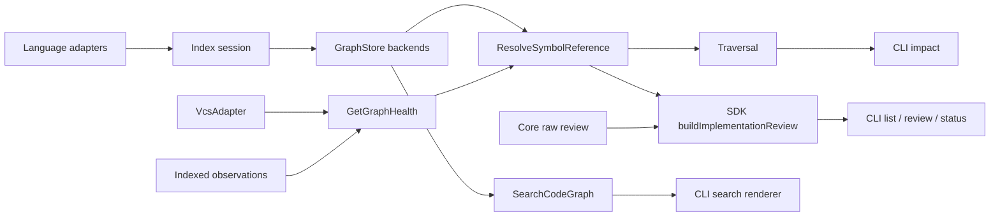

# Design: implementation-review-symbol-resolution

## Objectives

Provide one conservative, deterministic, multi-language symbol-reference system for
implementation review, search, and impact. A public export must be independently
queryable while still resolving to its real logical implementation; aliases and
hierarchy paths must affect impact only when statically proven; incomplete graph
evidence must never create false `missing` diagnostics. `stale` describes indexed
inputs, workspaces, and the aggregate graph; it is not a symbol-resolution outcome.

The final package boundary is Code Graph resolution and persistence, SDK
cross-subsystem orchestration, Core raw tracking, and CLI input/presentation.

## Non-goals

- No fuzzy matching, edit distance, best-candidate selection, runtime execution,
  language server, compiler/type-checker integration, reflection, monkey-patch or
  whole-program value-flow inference.
- No persisted implementation-link rewriting, sidecar migration, new archive blocker,
  or interactive `implementation add` suggestions.
- No `schema-std`, manifest, or spec-lock schema increment.
- No work from the separate `deprecate-ladybug-store` change. Ladybug remains a
  supported backend in this design and must receive the same schema, query, migration,
  and contract-test behavior as SQLite.

## Affected areas

### Code Graph model and application

- `packages/code-graph/src/domain/value-objects/symbol-node.ts`
  - Add half-open complete construct and declared-name selection ranges without
    changing the existing location-based `id`, `line`, `column`, or closed
    `SymbolKind`.
  - Impact: 106 direct dependents and 53 affected files; CRITICAL. All additions must
    be backward-compatible and backend contract fixtures must be updated together.
- `packages/code-graph/src/domain/value-objects/language-adapter.ts`,
  `file-analysis.ts`, `index-session.ts`
  - Add adapter capabilities, logical declaration groups, binding/member facts,
    build-context inputs, and coverage outcomes.
- `packages/code-graph/src/domain/ports/graph-store.ts`
  - Add batch logical/reference/binding/coverage queries, indexed-input freshness
    state, a single-session bulk writer, and paged source-content candidate queries.
  - CRITICAL integration point used by traversal, indexer, both backends, provider,
    in-memory test store, and contract tests.
- `packages/code-graph/src/application/use-cases/in-memory-index-session.ts`,
  `index-code-graph.ts`
  - Build indexed maps, group declarations, preserve bindings, persist coverage and
    logical `COVERS_SYMBOL`, and perform incompatible full rebuild.
  - Public bindings use a route identity that includes the proven target identity;
    the surface/name/space tuple remains the lookup slot. Resolving an unresolved
    placeholder removes only that placeholder, while two resolved targets in the
    same slot remain stored as competing routes.
- New resolver files under
  `packages/code-graph/src/application/use-cases/resolve-symbol-reference.ts` and
  `packages/code-graph/src/domain/value-objects/symbol-reference.ts`.
  - Hierarchy resolution batches member lookups beneath reached ancestor owners and
    selects only candidates at the nearest proven hierarchy depth; equal-precedence
    competing members remain ambiguous.
- Traversal services under `packages/code-graph/src/domain/services/`, especially
  `analyze-impact.ts`, `analyze-file-impact.ts`, `analyze-files-impact.ts`, and
  `analyze-spec-impact.ts`
  - Resolve targets first, return exact-public-binding and canonical impact views,
    and attach deduplicated file/symbol covering-spec evidence with minimum depth.
- `packages/code-graph/src/application/use-cases/search-code-graph.ts`,
  `packages/code-graph/src/domain/services/expand-search-query.ts`, and search result
  value objects
  - Replace symbol-only enrichment with the authoritative multi-category application
    use case. It builds one query plan, executes semantic and content lanes, verifies
    source occurrences, suppresses declaration duplicates, ranks/groups, and applies
    post-suppression limits. It also resolves exact file selectors, caps general and
    wildcard searches to ten relevance-ranked matches per file, returns total/omitted
    counts from the complete visible set, and leaves exact single-file searches
    uncapped and ordered by source position.
  - Current graph impact for the use case plus its regression test is CRITICAL:
    15 direct dependents, 125 transitive dependents, and 42 affected files. The
    follow-up therefore changes only internal occurrence ordering/classification and
    retains every public request/result shape and Store contract. Only symbol groups
    that survive the visible category limit suppress their declaration occurrences.
- `packages/code-graph/src/application/services/resolve-graph-selector.ts`
  - Replace broad case-insensitive unqualified impact selection with two exact-name
    passes: case-exact first, case-insensitive only if empty. Return one target,
    bounded ambiguity, or missing; never reuse prefix/text discovery for impact.
- `packages/code-graph/src/application/use-cases/get-graph-health.ts`,
  `assess-indexed-resource-freshness.ts`, `index-project-graph.ts`, visibility,
  staleness and fingerprint services
  - Expose aggregate/workspace current, stale, and unknown state; share VCS scope
    evaluation; use filesystem observations for non-VCS/hybrid scopes; and persist
    only monotonic freshness-cache mutations. Discovery, stat, content-read and hash
    failures remain unknown and never masquerade as a content mismatch.
- `packages/code-graph/src/composition/code-graph-provider.ts`,
  `create-code-graph-provider.ts`, `public.ts`, `index.ts`
  - Wire resolver, exact public-binding retrieval, unified search, freshness, and
    indexing-repair lifecycle and export only host-facing contracts. Both single and
    batch resolution receive the same targeted resource-freshness assessor even when
    a caller supplies a shared aggregate health snapshot.

### Language adapters

The fresh combined impact of the shared helper, four built-in adapters, and unified
search use case is CRITICAL: 113 direct, 200 indirect, and 536 transitive dependents
across 85 files. Their internal contracts therefore require focused adapter/helper
regressions followed by the complete Code Graph suite and affected SDK/CLI checks.

- `typescript-language-adapter.ts`: preserve current declarations, imports, exports,
  calls, types and package behavior; derive supported class/interface owners from
  full parser-range containment, distinguish static/instance forms, omit unsupported
  object/prototype/namespace/enum members from logical facts, keep member declarations
  out of package-level public bindings, and emit `extends`/`implements`/override
  hierarchy facts plus ordered resolver steps consistent with relations.
- `python-language-adapter.ts`: preserve supported `.py`/`.pyi`, import, annotation,
  call and package behavior; derive class/nested-class owners from full parser-range
  containment, omit unproven methods from logical facts, emit no speculative module
  exports, and emit ordered base-owner and protocol evidence without pretending to
  implement nested functions, class assignments, static `__all__`, or complete C3 MRO.
- `go-language-adapter.ts`: preserve current module, import, selector and construction
  behavior; use one package surface for every file in the root package, make supported
  same-file receiver/interface ownership logical, retain pointer/value evidence, keep
  member declarations out of package exports, and emit only local interface embedding
  plus same-file complete-method-set provenance without speculative promotion or
  cross-file interface satisfaction.
- `php-language-adapter.ts`: preserve Composer, namespace, require/include and
  framework-loader behavior; derive supported class/interface/trait method and
  property owners from full parser-range containment, omit unproven methods from
  logical facts, keep members out of namespace-level public bindings, and emit
  inheritance/contract/trait provenance while leaving class constants, enum cases,
  case-insensitive lookup, and unsupported adaptation conflicts inconclusive.
- `packages/code-graph/src/infrastructure/tree-sitter/reference-fact-helpers.ts`
  centralizes two-pass owner-to-logical-ID construction, declaration occurrence
  projection, hierarchy-fact creation, resolution-step creation, and deterministic
  deduplication. Adapters supply syntax-specific owner/hierarchy descriptors; shared
  code never parses language syntax.
- `adapter-registry.ts`: expose declared capabilities.

### Persistence

- `packages/code-graph/src/infrastructure/sqlite/sqlite-graph-store.ts`
  - Add normalized declaration, logical symbol, public/local binding, provenance and
    coverage and indexed-input tables/columns and indexes; add substring-capable
    source FTS and one/two-character fallback; rebuild search indexes once per bulk
    commit; move logical/binding lookup and ranking to indexed structured columns
    instead of serialized canonical-id expressions; bump the actual next schema
    version once.
- `packages/code-graph/src/infrastructure/ladybug/ladybug-graph-store.ts`
  - Equivalent structured properties/indexes, selector precedence, file match counts,
    source search, and schema 10 to 11. Ladybug remains supported.
- `packages/code-graph/src/infrastructure/storage-generation.ts`
  - Rotate generation on incompatible recreation.
- Shared graph-store contract tests, in-memory test store, backend tests, adapter
  fixtures, traversal and health/index tests are affected.

### SDK and CLI

- New `packages/sdk/src/orchestration/build-implementation-review.ts` plus tests.
- `packages/sdk/src/orchestration/run-index-project-graph.ts` and public barrel:
  indexing repair and review exports.
- `packages/cli/src/commands/change/_implementation-tracking.ts`
  - Remove matching policy; delegate review construction to SDK.
  - Current impact includes implementation/status commands and five CLI test files.
- `packages/cli/src/commands/change/implementation.ts` and `status.ts`
  - Render the same SDK projection.
- Graph command modules for impact, search, index and stats
  - Add export selector, reference fields, `--files`, file covering-spec output,
    repair and coverage diagnostics. Search makes exactly one provider call and
    contains no query expansion, candidate merge, ranking, deduplication, or limiting.
    Search text omits canonical ids, shows declaration locations, and shows only a
    directly matched export as a project-relative `matched export` location. Impact
    renders bounded ambiguity rather than traversing multiple exact candidates.
    Structured search projection preserves `matchedPublicBindings`, `totalMatches`,
    and `omittedMatches`; export impact retrieves the selected binding exactly rather
    than filtering a capped symbol-search response.
- `packages/core/src/application/ports/vcs-adapter.ts`,
  `packages/core/src/infrastructure/{git,hg,svn,null}/vcs-adapter.ts`, external VCS
  adapters, and the VCS-backed implementation detector
  - Make `ref()` a stable revision only; make `modifiedFiles()` complete,
    repository-root-relative and cwd-independent; rebase detector results from the
    repository root to the configured project root.
- `docs/cli/cli-reference.md`, `docs/sdk/index.md`,
  `docs/code-graph/index.md`, and new
  `docs/adr/0024-logical-symbol-resolution.md`
  - Document statuses, selectors, public versus canonical impact, health reasons and
    reindex recovery; record the cross-package ownership and conservative-resolution
    decision in MADR format.

`GraphStore` has 31 direct and 111 indirect dependents and affects at least 38 files;
its risk is CRITICAL. `CodeGraphProvider` is also a cross-workspace integration
boundary. `registerGraphSearch` has only two direct dependents and is LOW risk, but
its behavior is constrained by the provider contract. Compatibility and contract
tests therefore precede consumer migration.

## New constructs

```ts
type SymbolSpace = 'value' | 'type' | 'namespace' | 'function' | 'constant'
type MemberForm =
  | 'function'
  | 'method'
  | 'property'
  | 'getter'
  | 'setter'
  | 'constructor'
  | 'field'
  | 'static-method'
  | 'static-property'
  | 'contract-member'

interface DeclarationOccurrence {
  symbolId: string
  filePath: string
  range: SourceRange
}

interface SourceRange {
  startLine: number // 1-based
  startColumn: number // 0-based
  endLine: number // 1-based
  endColumn: number // 0-based, exclusive
}

interface LogicalSymbol {
  id: string // deterministic hash/encoding of structured fields, never a line number
  workspace: string
  module: string | null
  owner: string | null
  space: SymbolSpace
  name: string
  memberForm: MemberForm | null
  canonicalReference: string
  declarations: readonly DeclarationOccurrence[]
}

interface PublicBinding {
  id: string // encode(surface, exportedName, space, targetLogicalSymbolId ?? unresolved-marker)
  surface: string
  exportedName: string
  space: SymbolSpace
  targetLogicalSymbolId: string
  path: readonly ResolutionStep[]
}

interface LocalBinding {
  id: string // encode(file, lexical scope/range, local name, space)
  filePath: string
  scope: SourceRange
  localName: string
  space: SymbolSpace
  targetLogicalSymbolId: string | null
}

type IndexCoverageStatus = 'indexed' | 'excluded' | 'unsupported' | 'parse-failed' | 'partial'

interface IndexCoverage {
  target: string
  status: IndexCoverageStatus
  indexedContentHash: string | null
  reasonCode: string | null
  adapterCapabilities: readonly string[]
}
```

The new internal `reference-fact-helpers.ts` contract is:

```ts
interface AdapterDeclarationDescriptor {
  symbol: SymbolNode
  surface: string
  space: SymbolSpace
  ownerSymbolId?: string
  memberForm?: MemberForm
}

interface AdapterHierarchyDescriptor {
  childSymbolId: string
  parentSymbolId: string
  kind: 'extends' | 'implements' | 'embeds' | 'composes'
  precedence: number
}

function buildLogicalDeclarationFacts(input: {
  workspace: string
  declarations: readonly AdapterDeclarationDescriptor[]
}): {
  declarations: readonly DeclarationOccurrence[]
  logicalBySymbolId: ReadonlyMap<string, LogicalSymbol>
}

function buildHierarchyReferenceFacts(input: {
  hierarchy: readonly AdapterHierarchyDescriptor[]
  logicalBySymbolId: ReadonlyMap<string, LogicalSymbol>
}): {
  hierarchy: readonly HierarchyFact[]
  steps: readonly ResolutionStep[]
}
```

`buildLogicalDeclarationFacts` is strictly two-pass: create all top-level/owner
logical identities first, then members using the mapped logical owner ID. A missing
declared owner is a coverage gap for that member, not permission to emit an unowned
member. `buildHierarchyReferenceFacts` accepts only syntax-resolved symbol IDs,
translates them to logical owner IDs, preserves precedence, deduplicates exact edges,
sorts deterministically, and emits one matching ordered resolution step per edge.
Language adapters remain responsible for producing descriptors from their ASTs and
for rejecting semantics they cannot prove.

Canonical references are rendered from length-delimited or percent-escaped structured
components and must parse back exactly. No consumer splits on `.`, `#`, or `::`.
Logical IDs use the normalized structured identity, with language-specific identifier
case preserved.

```ts
interface ResolveSymbolReferenceInput {
  workspace: string
  requested: string
  filePath?: string
  publicSurface?: string
  symbolSpace?: SymbolSpace
  kind?: SymbolKind
  memberForm?: MemberForm
  buildContext?: Readonly<Record<string, string>>
}

type ResolutionStatus = 'resolved' | 'ambiguous' | 'unresolved' | 'missing'

interface SymbolResolutionResult {
  request: ResolveSymbolReferenceInput
  status: ResolutionStatus
  reasonCode: string | null
  health: ResolutionHealth
  target: LogicalSymbol | null
  candidates: readonly ResolutionCandidate[]
  path: readonly ResolutionStep[]
}

interface ResolveSymbolReference {
  execute(input: ResolveSymbolReferenceInput): Promise<SymbolResolutionResult>
  executeBatch(
    inputs: readonly ResolveSymbolReferenceInput[],
  ): Promise<readonly SymbolResolutionResult[]>
}

interface ExactPublicBindingSelector {
  surface: string
  exportedName: string
  space: SymbolSpace
  targetId: string
}

interface ExactPublicBindingResult {
  binding: PublicBinding
  declarations: readonly DeclarationOccurrence[]
}
```

Stable reason-code families are `GRAPH_*`, `COVERAGE_*`, `REFERENCE_*`,
`AMBIGUOUS_*`, and `RUNTIME_UNSUPPORTED`. Results sort by workspace, module, owner,
space, name, member form, then declaration path/range.

```ts
interface BuildImplementationReviewInput {
  changeName: string
}
interface BuildImplementationReviewResult {
  review: GetImplementationReviewResult
  graphHealth: GetGraphHealthResult
  links: readonly ReviewedImplementationLink[]
}

async function buildImplementationReview(
  ctx: SdkHostContext,
  input: BuildImplementationReviewInput,
): Promise<BuildImplementationReviewResult>
```

`CodeGraphProvider` adds `resolveSymbolReference`, `resolveSymbolReferences`,
`getExactPublicBinding`, `analyzePublicBindingImpact`, coverage queries, and an
indexing-specific open/repair path. `getExactPublicBinding(selector)` performs one
structured `GraphStore.findPublicBindings` lookup for the complete binding key,
rejects any non-exact result, loads declarations for the selected target through the
existing batched declaration lookup, and returns `null` when absent. It never invokes
semantic/text search and has no page or ranking limit. Ordinary `open()` never repairs
an incompatible store.

The source-search and unified-search contracts are:

```ts
type SearchCategory = 'symbols' | 'files' | 'specs' | 'documents'
type SearchMatchKind = 'full-query' | 'raw-token' | 'expanded-token'

interface SearchCodeGraphInput {
  query: string
  categories: readonly SearchCategory[]
  limit: number
  includeSnippet: boolean
  kinds?: readonly SymbolKind[]
  filePattern?: string
  workspace?: string
  excludePaths?: readonly string[]
  excludeWorkspaces?: readonly string[]
  includeSpecContent?: boolean
}

interface SourceContentMatch {
  range: SourceRange
  matchedText: string
  matchKind: SearchMatchKind
  sourceToken: string
  snippet?: { range: SourceRange; content: string }
}

interface SourceFileSearchResult {
  file: FileNode
  score: number
  matches: readonly SourceContentMatch[]
  totalMatches: number
  omittedMatches: number
}

interface ReferenceAwareSymbolResult {
  logicalSymbol: LogicalSymbol
  declarations: readonly SymbolNode[]
  publicBindings: readonly PublicBinding[]
  matchedPublicBindings: readonly PublicBinding[]
  matchTier: SymbolSearchMatchTier
  matchReasons: readonly string[]
  score: number
}

type GraphSelectorResolution =
  | { status: 'resolved'; symbol: SymbolNode }
  | { status: 'ambiguous'; candidates: readonly SymbolNode[]; totalCandidates: number }
  | { status: 'missing'; candidates: readonly [] }

interface SearchCodeGraphResult {
  symbols: readonly ReferenceAwareSymbolResult[]
  files: readonly SourceFileSearchResult[]
  specs: readonly SearchResult[]
  documents: readonly DocumentSearchResult[]
}

interface SourceContentCandidateQuery {
  normalizedQuery: string
  rawTerms: readonly string[]
  expandedTerms: readonly string[]
  limit: number
  cursor?: string
  filePattern?: string
  workspace?: string
  excludePaths?: readonly string[]
  excludeWorkspaces?: readonly string[]
}

interface SourceContentCandidatePage {
  candidates: readonly {
    file: FileNode
    backendScore: number
  }[]
  nextCursor?: string
}
```

`SearchCodeGraph.execute(input): Promise<SearchCodeGraphResult>` is the single
authoritative multi-category operation exposed by `CodeGraphProvider.search(input)`.
Existing category-specific methods may remain temporarily for compatibility, but the
CLI must not call them. `GraphStore.searchSourceContentCandidates(query)` returns
filtered, deterministic pages only; it never performs cross-category suppression or
final ranking. Code Graph consumes all candidate pages before final semantic file
ranking and limiting, unless the backend order is explicitly proven equivalent to
that final score.

`resolveGraphSelector` returns `GraphSelectorResolution`. Qualified and full
occurrence selectors retain their exact behavior. A bare name queries structured
`name` fields case-sensitively first; when empty it performs a case-insensitive exact
query. It sorts candidates deterministically, returns at most ten ambiguity candidates
plus `totalCandidates`, and never performs prefix, component, comment, or FTS lookup.

`SymbolNode` adds `endLine`, `endColumn`, and `selectionRange`. Its complete range is
`{ startLine: line, startColumn: column, endLine, endColumn }`, is non-empty, and
contains `selectionRange`. Invalid ranges are rejected by the value-object factory.
Built-in adapters use parser node ranges; an adapter that cannot produce a trustworthy
range omits that symbol.

File-impact coverage uses:

```ts
interface CoveringSpecEvidence {
  kind: 'file' | 'symbol'
  target: string
  depth: number
}

interface CoveringSpecImpact {
  specId: string
  minDepth: number
  evidence: readonly CoveringSpecEvidence[]
}
```

`FileImpactResult.coveringSpecs` is sorted by `minDepth`, `specId`, then evidence
depth/kind/target. `GraphStore.findCoveringSpecsForFiles(paths)` and
`findCoveringSpecsForSymbols(ids)` are batch operations; empty inputs return before
backend access.

Freshness persistence and assessment use:

```ts
type FreshnessState = 'current' | 'stale' | 'unknown'
type FreshnessMode = 'vcs' | 'filesystem' | 'hybrid'

interface IndexedInputObservation {
  workspace: string
  resourceKind: 'file' | 'document' | 'spec' | 'project'
  resourceId: string
  inputKind: 'filesystem' | 'repository'
  locator: string // normalized logical locator; never absolute
  contentHash: string
  observedMtimeMs?: number
  observedSize?: number
  repositoryRevision?: string
  stale: boolean
  generation: string
}

interface WorkspaceFreshness {
  workspace: string
  state: FreshnessState
  knownStaleSinceLastIndex: boolean
  mode: FreshnessMode
  reasons: readonly string[]
}
```

Store mutations are compare-and-set by generation. A stale input, workspace latch,
and aggregate latch are monotonic between successful indexes. Unknown results are
never persisted as stale. Only a successful single-session index clears them.

Bulk indexing is expressed as `GraphStore.beginBulkIndexSession(metadata)`, returning
an `IndexWriteSession` with bounded `writeFiles`, `writeDocuments`, `writeSpecs`,
`writeSymbols`, `writeReferenceFacts`, `writeObservations`, and `writeRelations`
methods plus `commit()` and `rollback()`. There is one transaction, one commit, and
one semantic/source-index rebuild. Endpoint and hierarchy validation accept batches;
no per-relation Store query is allowed.

## Approach

### 1. Model and store

Introduce additive logical/declaration/member/binding/coverage value objects. Keep
`SymbolNode.id`, `SymbolKind`, existing relation APIs and old structured-output fields.
Bindings are stored as first-class rows/entities keyed by binding ID; they are not
encoded only in ordinary relation metadata. Add indexed batch queries and backend
contract fixtures before changing consumers. Persist complete construct and selection
ranges with every symbol and source content with every `FileNode`.

### 2. Indexing

During Pass 1 adapters emit declaration/member/binding/capability facts. The index
session groups occurrences into logical symbols by language-provided grouping key.
During Pass 2 it resolves imports, reexports and hierarchy from indexed maps, records
ordered provenance, and persists a coverage row for every considered source file.
The public slot index is keyed by `(surface, exportedName, space)`, but its values are
route bindings keyed by the target-aware binding ID. Replacing an unresolved slot
placeholder never deletes an already resolved route. Consequently, two star/named
re-exports exposing the same name and space from different modules survive indexing
and are later reported as ambiguity.

Spec implementation links resolve to logical identity. A non-unique or unproven link
does not emit guessed coverage. The transient `IndexResult.errors` remains for CLI
reporting while durable coverage retains the evidence later health/resolution needs.
Every semantic input also produces an `IndexedInputObservation`. The indexer opens one
bulk session, writes bounded chunks, validates relation endpoints and hierarchy in
batches, commits once, then rebuilds semantic and source-content indexes once.
Failures roll back the entire generation.

### 3. Resolution

For every request:

1. Validate workspace and structured constraints.
2. Read health/coverage; infrastructure generation failures throw. Build the targeted
   assessment set from the explicit file when supplied, otherwise from the addressed
   public surface, plus every declaration file contributing candidate evidence. A
   current complete public surface with no compatible export slot can therefore prove
   `missing`; an unknown/stale surface remains `unresolved`.
3. Try exact declaration, exact public binding, scoped local binding, then
   deterministic hierarchy.
4. Deduplicate declaration occurrences by logical ID, not by location.
5. Return `resolved` only for one proven logical target; `ambiguous` for competing
   targets; `unresolved` for unsafe evidence; `missing` only for current complete
   coverage proving absence.

Batch execution shares health, prepared queries and traversal caches. All traversals
track visited binding/logical IDs and have bounded depth/memory.

Hierarchy traversal performs one breadth-first closure from each requested owner.
For every reached ancestor owner ID, it batches a structured logical-symbol lookup
using the original requested name, workspace, symbol space, and member form with that
ancestor as `ownerId`. A reached owner is never itself a member candidate. Direct
members have already won in the exact-declaration phase; inherited candidates are
restricted to the minimum hierarchy depth that yields a member. Candidates at the
same minimum depth remain ambiguous unless indexed language precedence has already
removed them. Each candidate path contains the owner-to-ancestor steps plus the
ancestor-member declaration evidence; cycles are visited once and stop at
`MAX_PATH_DEPTH`.

### 4. Language semantics

Adapters remain the only syntax-aware components. Each declares capabilities and
provides normalization/grouping/build-context logic. Unsupported conditions remain
explicit coverage. Go `use`-equivalent aliases, PHP `use`, Python imports and
JavaScript reexports stay distinct provenance kinds. Hierarchy edges preserve source
to target direction and source-language precedence.

All four adapters use the shared two-pass reference-fact helpers. During AST traversal
they retain a compact descriptor for each declaration: the extracted `SymbolNode`,
semantic surface/space/form, and the extracted symbol ID of its syntactic owner. They
also retain resolved hierarchy descriptors in parser state. `buildReferenceFacts`
first constructs owner logical identities, then member identities, then hierarchy
facts/steps. Legacy `buildRelations` consumes the same hierarchy descriptors so
`EXTENDS`, `IMPLEMENTS`, and `OVERRIDES` cannot disagree with resolver provenance.

- TypeScript locates the nearest supported class or interface owner by complete
  half-open parser-range containment, including compact same-line declarations;
  static modifiers, constructors, accessors and instance methods select member form.
  Object-literal, prototype-assignment, namespace and enum method-like symbols remain
  location-backed but are omitted from logical facts when no supported owner exists.
  `extends`/`implements` targets resolve through local declarations, imports and proven
  barrel bindings. Conditional/tsconfig-driven alternatives remain unsupported with
  `buildContext: false`.
- Python locates the nearest supported class/nested-class owner by complete range and recognizes instance,
  `classmethod`, `staticmethod`, and property forms only from deterministic syntax.
  Nested functions and class assignment members remain unsupported, and public routes
  are not inferred from leading underscores while static `__all__` is unsupported.
  Base descriptors retain source order; local/imported protocol evidence may emit
  `IMPLEMENTS`, but selection that requires complete C3, metaclass or descriptor
  semantics stays ambiguous/unresolved.
- Go maps receiver methods to a supported receiver type in the same analysis and
  interface methods to their local interface owner, retaining pointer/value receiver
  metadata. Root-package files share the workspace package surface rather than a
  filename-derived surface. Direct local interface embedding emits ordered owner
  edges. Concrete `IMPLEMENTS` evidence is emitted only when one file contains the
  complete known interface and receiver-method set; embedded structs, promotion,
  unknown package coverage, build tags and generic type-set uncertainty block proof.
- PHP maps supported methods/properties to class, interface, or trait logical owners. Namespace
  `use` remains only a local binding. Class/interface inheritance and contracts emit
  owner facts; trait composition is emitted only when conflict/alias precedence is
  provable, otherwise lookup stays ambiguous/unresolved. Logical IDs remain
  case-preserving; complete case-insensitive PHP lookup is not claimed.

For every adapter, a declaration descriptor marked as requiring an owner is omitted
from logical reference facts when no supported owner can be mapped. Public bindings
are emitted only for supported module/package-level declarations; a member must never
leak onto the package surface merely because its name satisfies a visibility rule.

Each adapter's existing declaration, import, call, type, construction, package and
framework-loader behavior remains covered by its own complete spec and regression
suite. Capability `hierarchy: true` is asserted only after representative supported
syntax produces non-empty hierarchy facts and ordered steps.

### 5. Impact and covering specs

`--symbol` resolves a logical target. `--export name --from surface` resolves a public
binding. Export impact returns `{ bindingImpact, canonicalImpact, binding, target,
path }`.

An unqualified symbol selector performs a case-exact structured-name query. A unique
result is traversed. Several results produce a ten-candidate ambiguity projection and
no impact traversal. Only an empty case-exact result enables a case-insensitive exact
query. For example, `Change` selects a unique `Change` declaration instead of hundreds
of `change` locals; misspelled singular `ValidateArtifact` does not select the real
`ValidateArtifacts` prefix result.

File impact assigns depth zero to every input file and every symbol defined by an
input. It records the shallowest depth for each affected file and symbol, batches
reverse `COVERS_FILE` and `COVERS_SYMBOL` lookups over deduplicated resource sets, and
folds relations into one `CoveringSpecImpact` per spec. File evidence remains visible
when no symbol-coverage relation exists. Multi-file impact performs one combined
coverage fold so all inputs and their symbols are depth zero.

CLI text renders `minDepth === 0` specs as direct coverage and the remainder as
blast-radius coverage. Mixed evidence appears once in the direct text group; JSON and
TOON retain every evidence item. CLI never queries or derives coverage.

### 6. Unified graph search

`SearchCodeGraph` builds one query plan with `expandSearchQuery`: normalized complete
query, raw whitespace terms, and separator/CamelCase-expanded terms. It requests the
selected categories through independent Store candidate primitives, adds the semantic
symbol lane, then performs all observable orchestration inside Code Graph.

Symbol tiers are exact logical identity, exact public binding, exact case-sensitive
declaration, language-normalized declaration, logical prefix or structural component,
exact local symbol, then backend text relevance. The declaration tiers require a
proven logical target. A case-exact backend hit without one is classified as
`exact-local-symbol`; normalized-only local hits remain textual. Backend score orders
only within a tier. Exact `Change` therefore precedes lowercase CLI/test locals unless
a `--kind variable` filter explicitly selects them.

The exact-logical-identity tier applies only when the raw request equals the canonical
logical target id. Equality with the target's simple `name` is declaration matching,
not identity matching, and therefore cannot outrank an exact public binding merely by
being attached to that target. An exact canonical-ID lookup inserts the parsed direct
logical target into the result-ID set before grouping, even when it is non-exported
and has neither a public binding nor a backend text hit.

The result retains every public binding for structured discovery and separately records
the binding(s) responsible for the match. CLI text never prints the length-prefixed
canonical id by default. It prints the declaration path/range; for an export match it
first prints `matched export: <config-relative-path>::<exportedName>`, then the target
declaration. Unrelated routes are summarized by count rather than enumerated.

SQLite uses an FTS5 trigram source-content table keyed by canonical file path.
Supported Ladybug uses an equivalent substring index. Queries of three or more
normalized characters use that index. One- and two-character queries use a
deterministically path-ordered fallback capped at 512 filtered files per page.
Workspace, file-pattern, and exclusion predicates apply before every backend page
limit.

For each candidate page, Code Graph scans only persisted candidate content to locate
case-folded literal occurrences of the full query, raw terms, and expanded terms.
It preserves original matched text and half-open source range. Duplicate occurrences
at one range keep the strongest provenance:
`full-query > raw-token > expanded-token`. File-level ranking prefers a contiguous
complete query, then all raw terms, individual raw terms, and expanded-only matches.

Suppression is per occurrence. Code Graph first slices ordered symbol groups to the
requested symbol-category limit. A file occurrence is removed only when it overlaps a
surviving visible symbol group's declared-name `selectionRange` and that symbol
represents the same query token. A semantic candidate omitted by the symbol limit does
not suppress its source occurrence. The complete construct range is never the suppression boundary, so
calls, strings, comments, and body occurrences remain. A file disappears only when
all its occurrences are suppressed. Code Graph consumes candidate pages until the
backend is exhausted, unless a backend query is changed to provide an order proven
equivalent to the final Code Graph file score. It ranks the complete visible file set
and only then applies the requested file-category limit; filling the limit with an
early expanded-token page never hides a stronger later page. It computes
`totalMatches` from the complete visible set, then orders general and wildcard-path occurrences by
`full-query`, `raw-token`, and `expanded-token`, using start/end source coordinates as
the deterministic tie-breaker inside each tier. Only after that ordering does it
retain ten matches and set `omittedMatches = totalMatches - matches.length`. This
ensures an exact `SpecRepository` occurrence cannot be displaced by ten earlier
expanded `Spec` occurrences in the same file. Exact file filters are resolved by the
provider from canonical workspace path, config-relative path, or absolute path; they
retain every visible occurrence and sort exclusively by source coordinates to support
complete file inspection. Wildcards remain patterns and use relevance ordering plus
the ten-match cap.

Snippets are derived from persisted content after exact matches are known. Snippet,
match, construct, and selection ranges remain distinct. The CLI sends one
`provider.search` request and only renders `symbols`, `files`, `specs`, and
`documents`, in that order. Its JSON/TOON mapper is lossless for the documented
projection: symbol groups retain both all and directly matched public bindings, while
file groups retain `matches`, `totalMatches`, and `omittedMatches`.

### 7. SDK and CLI

SDK gets raw Core review once, opens the provider once, gets health once, and sends all
symbol links in one resolver batch. The provider resolves stored project-relative file
selectors to canonical graph paths and the owning workspace before logical, binding and
coverage queries; the review projection still preserves the stored values byte-for-byte.
CLI list/review/status render that result and delete their matching helpers. File links
bypass symbol resolution. No outcome mutates Core.

Batch construction always supplies `AssessIndexedResourceFreshness` to
`ResolveSymbolReference`, including the branch that reuses caller-provided aggregate
health. The shared snapshot avoids repeated global health work; it does not authorize
candidate resolution from declaration files that have not passed targeted assessment.

For `graph impact --export`, the CLI resolves the reference first, then calls
`getExactPublicBinding` with the resolved target id, selected surface/name, and target
space. It combines the returned binding/declarations with the resolver's target and
path for `analyzePublicBindingImpact`. A missing exact binding after resolution is an
inconclusive/ambiguity path; the CLI never calls `searchReferenceSymbols` to reconstruct
the selection.

### 8. Freshness scopes and targeted assessment

`GetGraphHealth` first reads the aggregate `knownStaleSinceLastIndex` latch. If true,
it returns stale without scanning scopes, files, or symbols. Otherwise VCS-backed
workspaces are grouped by detected repository root and share one
`modifiedFiles(indexedRevision)` evaluation. Code Graph rebases and filters the
complete adapter result using the same effective `excludePaths`, `allowedPaths`,
gitignore/default exclusions, and explicit code/document/spec channels as indexing.
A path excluded from every channel cannot affect health.

Visible VCS entries are normalized and sorted as `{path, state, contentHash}` with
present and missing states distinct; visible rename sides both participate. Absolute
roots never enter persisted identities or output. Workspaces sharing a repository
reuse the evaluation but retain independent latches.

Non-VCS workspaces compare visible membership and observations. Matching mtime and
size avoids reading content. A stamp mismatch triggers hashing: equal content
refreshes mtime/size with generation compare-and-set, while different or missing
content marks the input, workspace, and aggregate latch stale. Assessment stops on
the first proof. VCS workspaces with `respectGitignore: false` use hybrid assessment
for ignored untracked graph inputs.

Read, stat, hash, repository, or VCS failures return transient `unknown`, never set a
stale flag, and are retried later. Aggregate precedence is
`stale > unknown > current`. Targeted `AssessIndexedResourceFreshness` checks only
observations for requested files, documents, or specs and may prove them current
despite unrelated global staleness. Corpus-wide absence, uniqueness, ranking, or
fallback retains aggregate non-current diagnostics.

`VcsAdapter.ref()` returns only a stable short revision. `modifiedFiles(baseRef)`
includes staged, unstaged, untracked, deleted, and both rename sides and is independent
of construction cwd for Git, Mercurial, SVN, and external adapters; failures reject.
The implementation detector rebases repository-root-relative paths to the configured
project root, removes outside paths, normalizes, deduplicates, and sorts. It performs
no graph filtering or fingerprint construction.

### 9. Health, rebuild and compatibility

Health separately reports VCS ref, working-tree/content, derivation, schema/generation
and coverage state. The released Code Graph package version changes the derivation
fingerprint. Physical schema changes bump the active backend version exactly once.
Content freshness follows the scope and observation algorithm above. A dirty VCS tree
is current immediately after indexing, while a later visible content or membership
difference becomes stale.

Normal read open rejects incompatible schema. `graph index` reaches an
indexing-specific provider path, recreates derived storage, rotates `storage.epoch`,
re-extracts all source and rebuilds FTS before readiness. CLI/SDK/index results expose
`fullRebuild` and `fullRebuildReason`.

No retry applies to deterministic resolution. Existing bounded store/repository retry
policies are unchanged. Concurrent old providers fail generation validation after
rotation.

## Key decisions

- **Complete per-language contracts plus shared fact builders** → adapter syntax and
  unsupported boundaries stay explicit while two-pass logical-owner and hierarchy
  projection is implemented once. Duplicating owner-ID/provenance construction in
  four adapters or teaching the generic resolver language syntax was rejected.
- **Relations and resolver hierarchy share descriptors** → a capability cannot be
  advertised from impact-only relations while resolver facts are empty. Independent
  relation and provenance extraction was rejected because they can drift.
- **Rank the complete visible file candidate set before limiting** → later exact or
  all-term matches must beat early expanded-token pages. Stopping when the first page
  fills the limit was rejected because backend relevance is not the final score.
- **Public surfaces are targeted freshness resources** → export absence is provable
  without inventing a source-file selector. Treating missing `filePath` as absence of
  an addressed resource was rejected.
- **Inspection failure is unknown, not dirty** → only content evidence can set the
  monotonic stale latch. Mapping I/O exceptions to mismatches was rejected.
- **First-class binding and logical identity** → prevents relation-metadata
  deduplication and overload ambiguity. Location-only identity was rejected.
- **SDK orchestration, Code Graph policy** → preserves dependency direction. CLI and
  Core ownership were rejected.
- **One Code Graph search use case** → query expansion, semantic/content lanes,
  source verification, cross-category suppression, ranking, grouping, and limits must
  remain identical for CLI and future hosts. CLI-side orchestration was rejected.
- **Structured lookup with canonical ids at the boundary** → SQLite columns and
  Ladybug properties for workspace, surface, name, space, owner, member form, and
  exported name drive indexes, ranking, and selectors. Parsing/lowercasing/substring
  ranking serialized canonical ids was rejected as slower and semantically fragile.
- **Exact impact selectors are not discovery queries** → case-exact names win,
  case-insensitive exact names are fallback only, ambiguity is bounded, and prefix or
  textual widening is forbidden. Traversing every broad match was rejected.
- **Actionable human search output** → declarations and directly matched export paths
  are shown; canonical ids and complete binding sets stay in structured results.
- **Relevance-before-cap with exact-file source-order escape hatch** → general and
  wildcard output cannot hide a later full-query occurrence behind earlier expanded
  tokens, while a deliberate single-file search remains exhaustive and navigable in
  source order. Applying the cap before ranking or relevance-sorting exact-file output
  were rejected because they respectively lose the strongest evidence and weaken
  file inspection.
- **File/input staleness, not symbol staleness** → one cached input assessment is
  reusable for every symbol in that file and avoids signature-level comparison.
- **Global and workspace monotonic latches plus targeted observations** → health can
  short-circuit after proof while exact-resource consumers can assess only what they
  address. Rescanning all files or symbols on every call was rejected.
- **VCS candidates plus Code Graph visibility** → adapters enumerate complete native
  changes; Code Graph alone knows which paths participate in the graph. Filtering in
  Core/VCS adapters was rejected.
- **Content plus coverage freshness** → VCS ref alone cannot prove absence.
- **Full rebuild** → new facts require source re-extraction; empty-column migration
  cannot recover them.
- **Additive public contracts** → minimize CRITICAL blast-radius breakage.
- **Session lookup indexes for relation construction** → build declaration-to-logical,
  logical-by-id, imports-by-local-name and bindings-by-surface/name maps once, then
  reuse them for calls, dependencies and re-exports. Repeated full-collection scans
  inside per-relation loops are prohibited.
- **One bulk transaction and one search-index rebuild** → relation construction,
  persistence, and FTS maintenance remain bounded. Per-file transactions or
  per-relation existence queries were rejected.
- **Selection-range suppression only** → removes duplicate declaration hits without
  hiding meaningful calls, comments, strings, or body text. Whole-symbol-range
  suppression was rejected.

## Trade-offs

- Larger graph and FTS indexes → normalize compact facts and add covering indexes;
  measure batch size and query latency.
- Short source queries cannot use trigram lookup → use filtered deterministic pages
  of at most 512 files and expose no unbounded application-layer scan.
- Candidate paging can require several backend round trips after declaration
  suppression → consume each stable cursor exactly once and rank only after
  exhaustion; repeated backend cursors terminate deterministically and duplicate file
  candidates are processed once. A future optimization may stop early only if the
  backend order is proven equivalent to the final semantic file score.
- Full semantic re-extraction can still be required to atomically replace derived
  reference facts, but relation linking remains linear in the extracted facts plus
  one-time lookup-index construction rather than calls multiplied by all declarations.
- Full reindex cost on upgrade → one explicit, observable repair with progress and
  reason is safer than partial migration.
- Conservative unresolved results → preserve candidates/reasons for diagnosis rather
  than increasing false positives.
- Multi-language matrix is broad → fixture-driven capability tests prevent one
  adapter from silently weakening the generic contract.

## Spec impact

The 28 modified/new specs form the complete behavioral boundary. The general
`code-graph:language-adapter` contract now owns only the common port, facts,
capabilities and failure rules; complete TypeScript, Python, Go and PHP adapter specs
own their observable syntax and semantics and depend on the general contract,
`symbol-model`, and `workspace-integration`. Existing dependents
of `symbol-model`, `graph-store`, `composition`, `get-graph-health`, SDK composition
and CLI commands remain compatible because fields and APIs are additive. Specs for
hotspots, coverage, project status snapshots and graph CLI context consume the same
provider/health types without changing their behavior; their existing contracts
remain satisfied and require no delta. Archived `specs implementation` mutation is
also unchanged because resolution is read-only. `core:vcs-adapter-port` dependents
continue receiving repository-relative paths but now receive complete, cwd-independent
sets; `core:vcs-implementation-detector` owns the required project rebase. No
additional dependent spec requires a delta. The earlier freshness and file-impact
changes are fully absorbed here and may be discarded only after this change passes
implementation and verification.

## Dependency map



```text
┌──────────────────┐   facts   ┌──────────────────┐ one commit ┌───────────────┐
│ language adapters│──────────▶│ index session    │───────────▶│ graph stores  │
└──────────────────┘           └──────────────────┘            └───┬───────┬───┘
                                                                   │       │
                                      candidates + persisted source│       │facts
                                                                   ▼       ▼
                                                          ┌────────────┐ ┌───────────────┐
                                                          │ SearchCode │ │ resolver /    │
                                                          │ Graph      │ │ traversal     │
                                                          └─────┬──────┘ └───────┬───────┘
                                                                │                │
                                                                ▼                ▼
                                                          ┌────────────┐ ┌───────────────┐
                                                          │ CLI renders│ │ impact + SDK  │
                                                          └────────────┘ └───────────────┘
                                                                       │
                                ┌──────────────────┐                   ▼
┌──────────────────┐ raw review │ SDK review      │◀──────────┌───────────────┐
│ Core             │───────────▶│ orchestration   │           │ resolver      │
└──────────────────┘            └────────┬─────────┘           └───────┬───────┘
                                        │                             │
                                        ▼                             ▼
                               ┌──────────────────┐           ┌───────────────┐
                               │ CLI change views │           │ impact/search │
                               └──────────────────┘           └───────────────┘

┌──────────────┐ complete diff ┌─────────────────┐ observations ┌──────────────┐
│ VcsAdapter   │──────────────▶│ GetGraphHealth  │◀─────────────│ GraphStore   │
└──────────────┘               └────────┬────────┘              └──────────────┘
                                       │ workspace + aggregate state
                                       ▼
                                ┌──────────────┐
                                │ CLI / SDK    │
                                └──────────────┘
```

## Compliance remediation contract

The final implementation must close the compliance audit without weakening the
accepted safety boundary:

- `ResolveSymbolReference.executeBatch` first prepares all candidates, then derives
  the deduplicated set of declaration files contributing to exact, public-binding,
  local-binding, or hierarchy candidates. It calls targeted freshness assessment
  once for that union plus explicitly addressed files. Any stale or unknown required
  declaration input makes the corresponding outcome `unresolved`; no resolved or
  ambiguous result may depend on non-current declaration evidence.
- If a request has `publicSurface` and no `filePath`, the public surface is included
  in the exact-resource assessment set. Current complete absence of its export slot is
  `missing`; stale/unknown/incomplete evidence is `unresolved`.
- Every built-in adapter derives logical member owners from syntax through the shared
  two-pass helper and emits hierarchy facts plus steps whenever `hierarchy: true`.
  Existing impact relations and resolver provenance are built from the same compact
  descriptors and tested for consistency in TypeScript, Python, Go and PHP. Full-range
  containment handles compact same-line owners; required-owner descriptors without a
  proven supported owner are omitted. Member declarations never become package-level
  public bindings, and Go root-package files share one package surface.
- Exact canonical-ID search inserts a directly parsed logical target into grouping;
  normal simple-name equality never selects the canonical-identity tier. File search
  exhausts stable candidate pages before semantic ranking and final limiting unless
  backend ordering is formally equivalent.
- Discovery/stat/read/hash exceptions remain unknown evidence and cannot set content
  dirty or monotonic stale latches.
- Adapter capabilities describe only facts actually emitted. TypeScript and Go use
  `buildContext: false` until project/build-condition inputs are consumed. Advanced
  tsconfig/package conditions, Python namespace/`__all__`/complete MRO, Go workspace/
  replace/internal/build-tag policy, and PHP classmap/files/trait-conflict policy are
  explicit unsupported coverage, never generic guesses.
- `GraphStore` provides a deterministic coverage-summary read. Health aggregates
  indexed, excluded, unsupported, parse-failed, and partial facts; `coverageComplete`
  is true when every fact has a terminal indexed, excluded, or unsupported outcome,
  false when an indexed generation contains parse-failed or partial evidence, and null
  before an index. Excluded and unsupported reasons remain queryable but do not poison
  aggregate health; reasons for incomplete facts participate in the aggregate result.
- Aggregate health composes every canonical dimension. Content or VCS staleness,
  derivation mismatch, incompatible schema/generation, incomplete coverage, or a
  monotonic latch makes the aggregate non-current with `stale > unknown > current`.
  A result cannot expose `state: current` alongside a reason that invalidates the
  graph's proof boundary.
- Derivation fingerprints include normalized content hashes for visible resolution
  inputs discovered under each workspace: `package.json`, `tsconfig*.json`,
  `jsconfig*.json`, `pyproject.toml`, `setup.cfg`, `setup.py`, `go.mod`, `go.work`,
  and `composer.json`. Entries use workspace-relative normalized paths plus content
  hash, never absolute roots. Missing/unreadable optional files are absent; read
  failures for discovered inputs are surfaced as unknown during health/indexing
  rather than silently proving compatibility.
- Incremental indexing uses content hashes for accurate changed/skipped accounting and
  re-extracts only new/changed files plus their transitive importer, relation,
  hierarchy, and public-route affected closure. Unchanged compact reference facts are
  hydrated from the Store so affected adapters can resolve against the retained graph;
  unrelated files are not parsed. Full-corpus extraction is limited to an initial,
  forced, or incompatible rebuild. Construction remains bounded through shared lookup
  indexes and one bulk session, with no Store round trip or global scan per relation.
  Progress exposes stable phase metrics for import resolution,
  dependency facts, adapter relations, re-exports, hierarchy/overrides, persistence,
  and search-index rebuilding, including count and elapsed milliseconds. Persistence
  and search timing are disjoint, and a no-search commit reports zero search duration.
- Multi-file implementation mutations preflight every requested path before the
  first Core mutation. Resolve and unresolve require every file to exist in the
  relevant tracked state; ignore uses the same all-input preflight. If any input is
  invalid, the command reports the Core-compatible error and performs zero mutations.
- The generic VCS implementation detector may apply caller-owned implementation
  exclusions but remains unaware of workspaces and Code Graph effective visibility.
  `graph stats` renders one provider-owned health result and does not repeat workspace
  discovery or retain obsolete exact-warning-prose requirements.

Focused regression tests must cover declaration-file freshness batching, backend
resolver ordering parity, coverage aggregation, every fingerprint input family,
aggregate state precedence, adapter capability truthfulness, bounded semantic
reconstruction and progress metrics, and zero-mutation multi-file preflight failures.

## Migration / Rollback

1. Implement additive types, queries and backend schemas behind current consumers.
2. Update indexer/adapters and backend contract tests.
3. Add resolver, traversal/search and SDK orchestration.
4. Switch CLI consumers and structured output.
5. Change released Code Graph package version and backend schema constants.
6. Run `graph index`; verify visible rebuild reason, rotated generation and fresh
   health.

Rollback requires restoring the previous package/code and deleting/rebuilding the
derived graph with the previous backend schema. User-authored manifests and spec
sidecars need no rollback. Never downgrade by opening a newer database with older
code.

The physical changes in this implementation require exactly one schema increment per
backend from the versions current at implementation start: SQLite `5 -> 6` and
Ladybug `10 -> 11`, unless an intervening already-landed schema bump changes the
starting values, in which case each moves to its next integer once. Normal reads must
reject the previous version; only the explicit indexing repair path recreates storage,
rotates `storage.epoch`, and rebuilds both semantic and source-content indexes.

## Security, permissions and observability

No new authorization surface or external dependency is introduced. Paths remain
workspace-confined and parameterized backend queries must be used. Dynamic source
content is never executed. Logs use the shared logger and record indexing phase,
rebuild reason, coverage/error counts, bulk chunk counts, candidate-page counts,
freshness assessment mode, short-circuit reason, and duration without dumping source
contents, absolute roots, VCS credentials, or source snippets. CLI text and structured
health are the operational diagnostics; no new telemetry service is required.

Invalid query/category/filter input is a usage error before provider open. Busy,
stale-provider-generation, schema incompatibility, backend search failure, and VCS
execution failure use existing typed infrastructure errors and exit-code mapping.
There is no retry for deterministic resolution or invalid input. Existing bounded
backend-busy retries remain unchanged. No feature flag is introduced: schema and
derivation incompatibility force the explicit rebuild path.

## Testing

### Automated

- Domain/model tests: canonical round-trip/escaping, language case rules, logical
  declaration grouping, member spaces/forms, shadowing, target-aware competing-route
  binding identity, valid
  half-open construct/selection containment, source extraction, and unchanged IDs.
- Resolver tests: precedence, candidates, every status/reason, dirty/partial coverage,
  cycles, build context, competing same-slot re-export ambiguity, real owner-to-parent
  hierarchy facts with ancestor-member lookup, nearest-depth precedence, and batch
  query-count bounds. Add a public-surface-only absence case proving `missing` from a
  current complete export surface and unknown/stale surface counter-cases.
- Adapter fixtures in each existing `*-language-adapter.spec.ts` cover the complete
  per-language verify file. Add explicit same-name members in different owners,
  static/instance or receiver forms, non-syntax-parent logical owner IDs, non-empty
  hierarchy facts/steps, relation/provenance consistency, ancestor-member lookup, and
  unsupported precedence/build-context cases for TypeScript/JavaScript, Python, Go,
  and PHP. Cover compact same-line declarations, owner-required descriptor omission,
  member/public-surface separation, Python's absent speculative exports, Go's shared
  root-package surface, local-interface embedding and explicit lack of struct
  promotion/member-level fulfillment. Shared helper tests cover two-pass owner
  construction, missing-owner gaps, full-range containment, hierarchy deduplication,
  precedence ordering and cycles.
- Shared graph-store contract plus SQLite and Ladybug integration tests:
  round-trip, deterministic order, parallel bindings, coverage, indexed lookup, FTS,
  trigram substring candidates, bounded short-query pagination, filter-before-limit,
  batched reverse coverage, observations/latches, one bulk commit/index rebuild,
  rollback, schema rejection, generation rotation, full rebuild, structured-column/
  property lookup without canonical-id parsing, case precedence, and ambiguity bounds.
- Traversal tests: public versus canonical impact, hierarchy direction, ambiguity,
  logical deduplication, direct and blast-radius covering specs, file-only coverage,
  mixed evidence, multi-file depth zero, deterministic ordering, and bounded reverse
  lookup counts.
- `search-code-graph` tests: one shared multi-word/CamelCase plan; semantic `Change`
  precedence; full/all-raw/individual/expanded ranking; exact occurrence ranges;
  declaration-only suppression; retained call/string/comment/body matches; all-match
  suppression; additional candidate pages; post-suppression limits; no live FS read;
  snippet/match/range separation; `ValidateArtifact` visibly partial versus exact
  `ValidateArtifacts`; matched-export provenance; ten-match general/wildcard cap;
  a later full-query occurrence retained ahead of more than ten earlier expanded-token
  occurrences; source-position tie-breaking inside each relevance tier; accurate
  total/omitted counts; exhaustive source-ordered exact-file results; canonical/
  config-relative/absolute file normalization; visible-only symbol suppression; an
  omitted symbol declaration retained as a file occurrence; reachable exact-local
  classification after logical-component candidates; an exact canonical ID returning
  a non-exported direct logical target with no text/binding hit; a later candidate page
  displacing early expanded-only files after full-set ranking; and backend parity.
- Health/index tests: dirty content before indexing, a fully indexed dirty worktree,
  aggregate-latch short circuit, workspace ordering, stale/unknown/current precedence,
  VCS scope sharing, excluded-only and mixed diffs, visible deletion/rename,
  non-VCS mtime/size fast path, equal-hash metadata refresh, hybrid ignored files,
  transient discovery/stat/read/hash failures returning unknown without setting
  latches, targeted resource evidence, unsupported/parse-failed/partial,
  package fingerprint change, schema repair and result reasons.
- Core VCS and detector tests: stable ref across dirty state; complete staged,
  unstaged, untracked, deletion and rename enumeration; cwd independence; Git/Hg/SVN/
  external failure propagation; repository-to-project rebase; outside-path omission;
  normalization, deduplication and ordering.
- Index performance regression tests: synthetic high-cardinality calls/declarations
  assert one-time lookup-index construction and bounded relation work; a repository
  `graph index` timing comparison guards the end-to-end phase.
- SDK tests: one Core read, provider/health once, one batch resolution, canonical
  provider-owned file/workspace normalization, unchanged stored values, file-link
  bypass and infrastructure error propagation.
- CLI tests: list/review/status equality, no fallback helper calls, export selector
  validation, file-impact coverage groups/evidence, `--files` versus `--file`, four
  default categories, exactly one provider search call, no CLI orchestration,
  text output without canonical ids, project-relative matched-export plus declaration,
  omission summaries, `Change` case-exact impact, bounded exact ambiguity, misspelled
  prefix rejection, text/JSON/TOON source-match output, graph stats reasons and index
  repair output.
- Review-regression tests: a batch with caller-supplied health still rejects stale
  declaration evidence through targeted assessment; ordinary `run` does not receive
  the canonical-identity tier; export impact finds a selected binding beyond twenty
  same-name targets without search pagination; JSON and TOON retain directly matched
  bindings; and JSON and TOON retain total/omitted source-match counts.
- Public export and TypeScript type tests for Code Graph and SDK barrels.

Every GIVEN/WHEN/THEN scenario in the 28 verification artifacts maps to the matching
suite above; existing scenarios remain in their current suites.

### Manual / E2E

1. Build and test affected packages with pnpm.
2. Index a fixture containing a TS barrel, Python package, Go embedding and PHP alias/
   trait; expect zero guessed relations, distinct logical owners for same-name members,
   non-empty hierarchy/provenance facts matching relations, and complete coverage.
3. Run `graph search "Change"` and confirm the logical declaration precedes local
   variables and text omits canonical ids. Search a barrel alias and confirm a
   project-relative `matched export` line followed by the real declaration. Search
   `ValidateArtifact` and confirm `ValidateArtifacts` is labeled partial rather than
   exact. Run a multi-word search with `--files`, verify exact ranges, then add a
   declaration, call, string, and comment occurrence and confirm only the duplicate
   declaration occurrence is suppressed. Confirm general/wildcard output shows ten
   matches plus an omission count, with `full-query` before `raw-token` before
   `expanded-token` even when the complete match occurs later in the file. Confirm
   canonical, config-relative, and absolute exact `--file` forms all return every
   match for the same file in source order. With a symbol limit below the candidate
   count, confirm a declaration belonging only to an omitted symbol remains visible
   in the file category. Search the exact canonical ID of a private/non-exported
   symbol and confirm its declaration is returned without a text or binding hit. Use
   a fixture whose strongest file match is on a later backend page and confirm it
   displaces earlier expanded-only candidates. Simulate a backend that repeats a
   cursor and confirm search terminates while processing each returned file once.
4. Run `graph impact --file <path>` and confirm direct/blast-radius covering specs and
   file-only evidence. Run `graph impact --export X --from <surface>` and confirm
   separate binding and canonical views; repeat with more than twenty same-name
   exports and select one outside the first ranked page. Run `--symbol Change` and confirm the
   case-exact symbol is selected before lowercase variables; use a genuinely duplicate
   exact name and confirm bounded ambiguity with no traversal; confirm singular
   `ValidateArtifact` is missing rather than widened to `ValidateArtifacts`.
5. Run implementation list, review and status; confirm identical outcomes.
6. Modify an indexed file without committing; confirm health becomes stale and symbol
   absence remains unresolved. Reindex, remove a symbol, and confirm current complete
   absence is `missing`; repeat with a public-surface-only export selector and confirm
   missing export proof. Change only an excluded manifest and confirm health remains
   current. Repeat in a non-VCS fixture and confirm mtime/hash behavior. Make one
   visible input unreadable in a controlled fixture and confirm health is unknown and
   no stale latch is persisted.
7. Open SQLite 5 and Ladybug 10 fixtures, confirm reads reject, then run graph index
   and confirm versions 6 and 11 respectively, visible rebuild, new generation, fresh
   stats, and backend-equivalent structured lookup/search results.
8. Capture indexing phase timings before and after the change; verify relation
   construction has no per-relation Store-call growth and FTS rebuild occurs once.
9. Run lint, typecheck and backend/adapter/CLI test suites.

Update `docs/cli/cli-reference.md`, `docs/code-graph/index.md`, and SDK documentation
with `--files`, unified search ownership, source ranges/matches, covering specs,
freshness modes/reasons, VCS/non-VCS behavior, deterministic boundary and recovery.
The Code Graph documentation must state that capped general/wildcard file matches use
`full-query > raw-token > expanded-token` ordering before truncation, while exact
single-file matches remain exhaustive and source ordered. It must also document the
four specific adapter contracts, logical declaring owners, hierarchy capability
truthfulness, direct canonical-ID search, public-surface freshness assessment, and
inspection-failure unknown semantics.
Add JSDoc to every exported symbol,
and to every other added or modified function, method, class, type alias, and
interface; use ESM named exports, strict types and no `any`. Record the architectural
decision in `docs/adr/0024-logical-symbol-resolution.md`, linking back to the central
symbol-model, resolver, and SDK orchestration specs.
