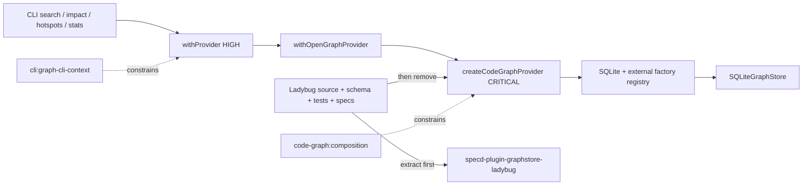

# Design: deprecate-ladybug-store

## Objectives and expected outcomes

This change extracts the current Ladybug graph-store work from the specd monorepo into a preservation repository named `specd-plugin-graphstore-ladybug`, then removes Ladybug as shipped product code. After completion:

- `@specd/code-graph` has one built-in graph-store id, `sqlite`.
- `createCodeGraphProvider` still accepts `graphStoreId` and additive `graphStoreFactories`; unknown ids and collisions with the built-in id remain typed, deterministic errors.
- SQLite is validated against the current `GraphStore` and Code Graph consumer contracts. Ladybug is not a compatibility oracle for SQLite.
- `@ladybugdb/core`, Ladybug source, schema, tests, examples, and runtime workarounds are absent from the monorepo and lockfile.
- read-only graph CLI commands use the shared `resolveGraphCliContext` plus `withProvider` lifecycle and return normally after provider close.
- long-lived hosts continue to open, reuse, and close `CodeGraphProvider` explicitly; `CodeGraphProvider[Symbol.asyncDispose]` and `withOpenGraphProvider` remain unchanged.
- the external repository contains the last complete Ladybug implementation, tests, schema, and normative spec/verify content before their active copies are retired here.
- the external `ladybug:graph-store` spec keeps its existing dependencies on specd specs through external `readOnly` workspaces, while only the local `ladybug` workspace is writable.

The extraction source baseline is the repository state at `90d5682b` plus all Ladybug changes already present in the working branch, notably the semantic reference additions introduced by `b86b81c1`. Extraction must use the files in the implementation worktree immediately before deletion, not an older archived version.

## Non-goals

- No plugin discovery, installation, configuration schema, runtime package loading, or plugin-manager integration.
- No `specd.yaml` graph-store selection setting.
- No stable public `GraphStore` plugin API. The current `GraphStoreFactory` return type still relies on the `@specd/code-graph/internal` contract.
- No publication or activation of `specd-plugin-graphstore-ladybug` as a supported runtime plugin.
- No Ladybug-to-SQLite data conversion, backwards-compatibility layer, feature flag, fallback, or automatic migration.
- No change to `GraphStore`, semantic resolution, search, traversal, coverage, impact, hotspot, indexing, or health behavior except removal of Ladybug-specific implementations and assumptions.
- No removal of `withOpenGraphProvider`, SDK host composition, provider explicit lifecycle, or long-lived-host ownership.
- No changes to the language `AdapterRegistry`; it is distinct from the retained graph-store factory registry.

## Constraints and final contracts

### Graph-store composition contract

The existing public types retain these shapes:

```ts
export interface GraphStoreFactoryOptions {
  readonly storagePath: string
}

export interface GraphStoreFactory {
  create(options: GraphStoreFactoryOptions): GraphStore
}

export interface CodeGraphCompositionOptions {
  readonly graphStoreId?: string
  readonly graphStoreFactories?: Readonly<Record<string, GraphStoreFactory>>
  readonly adapters?: readonly LanguageAdapter[]
}

export interface CodeGraphOptions extends CodeGraphCompositionOptions {
  readonly storagePath: string
  readonly projectRoot?: string
}
```

`GraphStore` in the factory return type remains internal in this change. The registry algorithm is:

1. initialize a fresh registry with `{ sqlite: createSqliteGraphStoreFactory() }`;
2. iterate caller-provided `graphStoreFactories` in `Object.entries` order;
3. if an external id is the existing built-in `sqlite` id, throw `GraphStoreRegistryError.alreadyRegistered(id)` before constructing any store;
4. select `graphStoreId ?? 'sqlite'`;
5. if selection is absent, throw `GraphStoreRegistryError.notFound(id)`;
6. call exactly the selected factory with `{ storagePath }` and construct one provider.

The stable error code remains `GRAPH_STORE_REGISTRY_ERROR`. External registrations are additive and cannot override SQLite. The `Readonly<Record<string, GraphStoreFactory>>` input structurally contains at most one external value per key, so duplicate external keys are not a separate runtime state.

### CLI lifecycle contract

`withProvider` keeps its current signature and format-aware error translation. It creates or accepts an SDK host context and delegates open/close to `withOpenGraphProvider`. It no longer registers `SIGINT` or `SIGTERM` listeners and never calls `process.exit(0)` or `process.exit(130)`. On success it resolves normally after close. On failure it calls the existing `handleError` path.

`graph stats` joins `search`, `hotspots`, and `impact`: it calls `resolveGraphCliContext({ configPath: opts.config, repoPath: opts.path })`, then calls `withProvider(context.config, opts.format, callback)`. Configured mode preserves the resolved configuration and kernel, including valid projects outside VCS; bootstrap mode retains the synthetic `default` workspace and VCS-root storage context used by the other read-only graph commands. The callback calls `provider.getGraphHealth()` once and preserves all current text, JSON, and TOON projections and infrastructure exit codes.

### Extraction boundary

The external repository is a source-preservation package, not an active plugin. Its initial package may compile against the explicitly unstable `@specd/code-graph/internal` entry point. Its README must state that this dependency is transitional and that runtime loading is unsupported until a future graph-store plugin contract exists.

Its `specd.yaml` declares four spec workspaces:

```yaml
schema: '@specd/schema-std'

contextIncludeSpecs:
  - 'default:*'

workspaces:
  default:
    prefix: _global
    specs:
      adapter:
        type: fs
        config:
          path: ../specd/specs/_global
    codeRoot: ../specd
    ownership: readOnly

  ladybug:
    specs:
      adapter:
        type: fs
        config:
          path: specs/ladybug
    codeRoot: .
    ownership: owned

  code-graph:
    specs:
      adapter:
        type: fs
        config:
          path: ../specd/specs/code-graph
    codeRoot: ../specd/packages/code-graph
    ownership: readOnly

  core:
    specs:
      adapter:
        type: fs
        config:
          path: ../specd/specs/core
    codeRoot: ../specd/packages/core
    ownership: readOnly
```

Paths are relative to the external repository's `specd.yaml`; the initial supported checkout topology places `specd-plugin-graphstore-ladybug` and `specd` as siblings. External status is inferred from the paths. The Ladybug spec id is `ladybug:graph-store`, and it retains dependencies on `code-graph:graph-store`, `core:config`, `code-graph:symbol-model`, and `code-graph:workspace-integration`. Read-only ownership permits context and dependency resolution but blocks changes to those upstream specs from the Ladybug repository.

The extraction is considered complete only when the external repository contains and can trace the source of:

- `LadybugGraphStore`, its schema and factory;
- `@ladybugdb/core` dependency and native test configuration;
- Ladybug infrastructure tests and a copied graph-store contract harness sufficient to run them;
- the complete pre-retirement Ladybug `spec.md` and `verify.md`, including semantic references, structured identity, source search, coverage, schema generation, and bulk transaction behavior;
- license and provenance identifying the source specd commit.

The monorepo retirement delta leaves only a tombstone recording ownership transfer because specd deltas do not have a whole-spec deletion operation. All Ladybug operational requirements and verification scenarios are removed from the active spec; the tombstone must not be interpreted as a supported backend.

## Affected areas

### External preservation repository

- `specd-plugin-graphstore-ladybug/package.json`, `tsconfig.json`, `vitest.config.ts`, `specd.yaml`, `README.md`, `LICENSE`: create an ESM, strict-TypeScript, named-export-only preservation package with one owned Ladybug workspace and read-only upstream spec workspaces. It is not added to this pnpm workspace and is not loaded by specd.
- `src/ladybug-graph-store.ts`, `src/schema.ts`, `src/index.ts`: copy the final Ladybug adapter and schema, adjust only import paths, and expose `LadybugGraphStore` plus `createLadybugGraphStoreFactory`.
- `test/ladybug-graph-store.spec.ts`, `test/ladybug-graph-store-multi-kind.spec.ts`, `test/graph-store.contract.ts`: preserve the current backend and contract coverage against temporary directories.
- `specs/ladybug/graph-store/spec.md`, `specs/ladybug/graph-store/verify.md`: recreate the complete pre-retirement normative content as `ladybug:graph-store`, retaining the four upstream spec dependencies before the monorepo copy is retired.
- `PROVENANCE.md`: record source repository, source commit, copied file paths, dependency version `@ladybugdb/core@0.19.1`, and that no runtime plugin contract exists yet.

### `@specd/code-graph`

- `packages/code-graph/src/infrastructure/ladybug/index.ts`, `ladybug-graph-store.ts`, `schema.ts`: remove after the external copy gate passes. `LadybugGraphStore` has CRITICAL file impact in the current graph (60 direct, 50 indirect, 61 transitive dependents), largely because it implements the high-fan-out `GraphStore` surface; removal must not modify that port or its consumers.
- `packages/code-graph/src/composition/create-code-graph-provider.ts` — `createCodeGraphProvider` and `createGraphStoreRegistry`: remove the Ladybug import/factory/registration, retain SQLite plus additive registrations and collision checks. The factory is CRITICAL (21 direct dependents, 20 transitive, 15 affected files), so its overloads, return type, storage-root derivation, language adapters, health wiring, and synchronous construction remain byte-for-byte behaviorally equivalent outside backend selection.
- `packages/code-graph/src/composition/graph-store-factory.ts`: retain the public registry seam and clarify JSDoc that SQLite is the default and external factories are additive. Do not export `GraphStore` publicly.
- `packages/code-graph/src/domain/errors/graph-store-registry-error.ts`: retain `notFound`, `alreadyRegistered`, message shapes, and error code; no new error class.
- `packages/code-graph/src/public.ts` and `src/index.ts`: verify no Ladybug export survives. Retain `GraphStoreFactory`, options, provider, SQLite factory, and all semantic model exports.
- `packages/code-graph/package.json` and `pnpm-lock.yaml`: remove `@ladybugdb/core@0.19.1` and all now-unreachable platform packages by running pnpm lockfile resolution, while preserving `better-sqlite3`.
- `packages/code-graph/vitest.config.ts`: retain `maxWorkers: 1` because SQLite tests remain native/filesystem intensive; remove only the Ladybug wording.
- `packages/code-graph/test/infrastructure/ladybug/**`: remove after copying to the external repository.
- `packages/code-graph/test/composition/code-graph-provider.spec.ts`: remove built-in Ladybug construction; assert SQLite-only defaults, external selection, unknown selection, and collision with `sqlite`. Existing custom factory tests remain the primary guard for the future plugin seam.
- `packages/code-graph/test/application/use-cases/index-project-graph-integration.spec.ts`: keep the external `session-only` factory coverage unchanged.
- `packages/sdk/test/composition/host-context.spec.ts`: replace Ladybug example ids with a neutral externally registered id or SQLite while continuing to prove option forwarding. No SDK production API changes.

### CLI

- `packages/cli/src/commands/graph/with-provider.ts` — `withProvider`: HIGH impact (7 direct dependents, 10 affected files). Remove signal listeners and forced exits only; preserve SDK context construction, optional host/beforeOpen inputs, provider callback, and error handling.
- `packages/cli/src/commands/graph/stats.ts` — `registerGraphStats`: replace its independent `openSpecdHost`/`withOpenGraphProvider` path with `resolveGraphCliContext`/`withProvider`, remove the final `process.exit(0)`, and preserve parsing, health retrieval, rendering, and errors.
- `packages/cli/src/commands/graph/search.ts`, `hotspots.ts`, `impact.ts`: no production change is required beyond inheriting the simplified `withProvider`; their behavior remains backend-neutral.
- `packages/cli/test/commands/graph-cli-context.spec.ts`: retain configured-mode and VCS-only bootstrap regression coverage; replace exit spies with assertions that SDK close completes and no signal listeners or success exit are installed.
- `packages/cli/test/commands/graph-stats.spec.ts`: mock the shared context/lifecycle modules, remove successful-exit expectations, retain every health/rendering/error assertion, and cover configured non-VCS context reaching provider health.
- `packages/cli/test/commands/graph-search.spec.ts`, `graph-hotspots.spec.ts`, `graph-impact.spec.ts`: run unchanged as regression coverage for the HIGH-impact wrapper.

Current graph impact for `create-code-graph-provider.ts`, `graph-store-factory.ts`, `with-provider.ts`, and `stats.ts` is **CRITICAL**: 62 direct dependents, 117 indirect dependents, and 77 affected files. The implementation and verification plan therefore retains workspace-wide regression gates and explicitly covers CLI graph consumers, SDK composition, indexing, health, and SQLite storage behavior.

### Documentation and specifications

- `packages/code-graph/README.md`: describe SQLite as the sole built-in; keep an external-factory example; remove the `ladybug` selection example and alternate-built-in claim.
- `docs/code-graph/index.md`: describe SQLite alone as the built-in persistence implementation and keep semantic identity requirements backend-neutral.
- `docs/adr/0024-logical-symbol-resolution.md`: add an amendment that Ladybug ownership moved to the external preservation repository; do not rewrite the historical decision record.
- `../specd-plugin-graphstore-ladybug/README.md`: state that `ladybug` is the only owned workspace; describe `default` as the read-only `_global` workspace alongside the read-only `code-graph` and `core` dependencies.
- `specs/code-graph/ladybug-graph-store/{spec.md,verify.md}`: retire all operational requirements/scenarios and retain only the ownership-transfer tombstone produced by the validated deltas.
- `specs/code-graph/composition`, `sqlite-graph-store`, `specs/cli/graph-cli-context`, and `graph-stats`: receive the validated deltas. `graph-impact`, `graph-hotspots`, and `graph-search` receive no-op deltas because their observable contracts are unchanged.
- Historical changelogs remain unchanged; they truthfully record earlier Ladybug releases.

## New constructs

### External Ladybug factory

Location: `specd-plugin-graphstore-ladybug/src/create-ladybug-graph-store-factory.ts`.

```ts
import type { GraphStoreFactory } from '@specd/code-graph'

export function createLadybugGraphStoreFactory(): GraphStoreFactory
```

It returns a factory whose `create({ storagePath })` constructs `LadybugGraphStore`. It performs no plugin registration, configuration lookup, dynamic discovery, or eager native loading. `@ladybugdb/core` continues to load during store `open()`.

### Extraction provenance manifest

Location: `specd-plugin-graphstore-ladybug/PROVENANCE.md`.

The manifest records the source repository URL, exact source commit, extraction date, original source/test/spec paths, copied dependency version, and SHA-256 hashes of the copied Ladybug source, schema, spec, and verify files. Hashes are computed before monorepo deletion and again after copy; any mismatch blocks deletion unless it is solely an enumerated import-path adjustment.

No new monorepo production symbol is introduced.

## Approach

1. **Freeze and verify the extraction set.** From the implementation worktree, enumerate the three Ladybug source files, two Ladybug-specific test files, applicable shared graph-store contract tests, and the complete pre-retirement spec/verify documents. Compute hashes and record the source commit.
2. **Create the preservation repository before deletion.** Scaffold the external strict ESM package and its `specd.yaml`, confirm only `ladybug` is owned and upstream workspaces are external/read-only, copy code/tests/specs with retained dependencies, add the factory and provenance manifest, then install and run its build, typecheck, lint, spec validation, and tests. Import-path-only changes must be listed in provenance. If the external repository cannot build because of the intentionally internal `GraphStore` contract, preserve the exact sources and mark the repository non-publishable; do not redesign the public plugin API in this change.
3. **Remove Ladybug from composition.** Delete the built-in constant and registry entry, leaving `sqlite` as the initial registry. Preserve additive merging, collision failure, unknown-id failure, synchronous provider creation, language adapter registration, health wiring, overloads, and lifecycle.
4. **Remove monorepo implementation and dependency.** Delete Ladybug infrastructure/tests, remove `@ladybugdb/core`, regenerate `pnpm-lock.yaml`, and remove all current Ladybug references from production docs and tests. Historical changelog references are allowed.
5. **Normalize transient CLI lifecycle.** Simplify `withProvider`; route stats through the same context and lifecycle path; retain SDK helper use and long-lived host behavior.
6. **Apply the spec ownership transfer.** Archive the validated deltas so no active Ladybug backend requirements or scenarios remain here. The external spec and verify files are the normative Ladybug copy; this repository keeps only a retirement record.
7. **Re-index and validate.** Run the full build/typecheck/lint/test suite, then `node packages/cli/dist/index.js graph index --format toon`. A re-index is the only migration step.

Deletion in step 4 is blocked until step 2 has produced a verifiable local external repository copy. Publishing or pushing that repository is a separate external-state action, but the preservation copy itself is part of completion.

## Key decisions

**SQLite is defined by current Code Graph contracts, not Ladybug parity** → the supported backend must satisfy `GraphStore` and consumer behavior directly. **Alternatives rejected** → retaining Ladybug-era parity language would make removed implementation details a permanent constraint on SQLite.

**Preserve the graph-store factory registry** → it is the existing injection point required by a future plugin system and already supports selection, external factories, and typed failures. **Alternatives rejected** → hard-wiring SQLite directly would save little code and force a later composition redesign.

**Do not promote `GraphStore` to a stable public plugin port yet** → plugin packaging, version compatibility, configuration, and lifecycle negotiation require a dedicated design. **Alternatives rejected** → exposing the current large internal abstract class now would accidentally freeze it as public API.

**External repository first, monorepo deletion second** → preservation is an acceptance gate, not a follow-up. **Alternatives rejected** → relying only on git history makes continued maintenance and future plugin conversion harder and does not satisfy ownership transfer.

**Retain a spec tombstone in specd** → the current delta/archive model retires requirements by removing sections and recording their replacement; it cannot express whole-spec deletion. **Alternatives rejected** → deleting base spec files before archive would invalidate the change and lose traceability.

**Retain cross-repository spec dependencies through read-only workspaces** → repository ownership and spec dependency are independent concerns; the external project can consume upstream contracts without modifying them. **Alternatives rejected** → copying generic Code Graph/Core specs would fork their source of truth, while dropping dependencies would hide the actual contract Ladybug implements.

**Keep SDK lifecycle helpers and remove only CLI native workarounds** → provider lifecycle is useful independently of Ladybug and already supports transient and long-lived hosts. **Alternatives rejected** → deleting `withOpenGraphProvider` or adding new disposal APIs would broaden scope and regress current SDK consumers.

## Error handling, concurrency, and operations

- Unknown graph-store ids and collisions with the built-in `sqlite` id fail synchronously before store construction with `GraphStoreRegistryError` and code `GRAPH_STORE_REGISTRY_ERROR`.
- External factory construction errors propagate unchanged; no fallback to SQLite occurs after an explicit id was selected.
- Provider open, busy, stale-generation, query, and close errors retain current typed handling. No retry is added.
- Removing CLI signal interception delegates interruption behavior to the normal Node/Commander host. Provider cleanup is guaranteed for normal completion and thrown callback errors by `withOpenGraphProvider`; abrupt process termination has no stronger cleanup guarantee.
- Registry creation is per provider and contains no shared mutable state, so concurrent provider construction cannot mutate a global registry.
- SQLite concurrency, transaction, schema-generation, and performance behavior remain unchanged. Removing Ladybug reduces native dependency and process-thread risk.
- No new logging, metric, telemetry, permission, authorization, network, secret, or feature-flag behavior is introduced.

## Trade-offs

- **[External repository temporarily depends on an internal API]** → mark it non-runtime/non-plugin and pin provenance; evolve it only when the plugin contract is designed.
- **[A tombstone path remains discoverable in this repo]** → its text contains no backend contract and clearly names the external owner; all operational content lives externally.
- **[No automatic recovery of Ladybug data]** → document and test full SQLite re-index as the supported recovery boundary.
- **[Changing a CRITICAL factory and HIGH-impact CLI wrapper can cause broad regressions]** → keep signatures unchanged and run all code-graph, SDK, CLI, and workspace-wide suites.
- **[External copy may drift after extraction]** → provenance hashes make the initial transfer auditable; subsequent evolution belongs to the external repository.

## Spec impact

### `code-graph:ladybug-graph-store`

- Direct and transitive dependents: none.
- All backend requirements and scenarios transfer to `ladybug:graph-store`; its four existing dependencies resolve from external read-only specd workspaces. The local tombstone has no downstream behavioral contract.

### `code-graph:composition`

- Direct/transitive affected specs reported by the graph: `cli:change-implementation`, `cli:change-status`, `cli:graph-index`, `cli:graph-search`, `cli:graph-stats`, `code-graph:get-graph-health`, `code-graph:graph-store`, `code-graph:index-project-graph`, `code-graph:staleness-detection`, `sdk:build-implementation-review`, `sdk:composition`, and `sdk:run-index-project-graph`.
- Their requirements depend on provider construction, health, indexing, search, or SDK forwarding, not on Ladybug identity. They remain satisfied because factory signatures, default SQLite behavior, SDK lifecycle, and provider operations are unchanged.
- `cli:graph-search` and `cli:graph-stats` are already in scope. The remaining dependents require regression testing, not spec deltas.

### `code-graph:sqlite-graph-store`

- Direct/transitive dependents: none.
- Its contract expands no API; it removes historical Ladybug comparison language and confirms existing SQLite consumer coverage.

### `cli:graph-cli-context`

- Direct dependents: `cli:graph-hotspots`, `cli:graph-impact`, `cli:graph-search`; no transitive dependents.
- All three are in scope with no-op behavior deltas and retain existing command semantics through the simplified wrapper.

### `cli:graph-stats`, `cli:graph-impact`, `cli:graph-hotspots`, `cli:graph-search`

- No downstream specs are reported.
- Stats changes lifecycle wiring only; the other three retain their existing observable contracts.

No additional spec requires a delta.

## Dependency map



```
┌────────────────────────────────────────────┐
│ CLI search · impact · hotspots · stats     │
└──────────────────────┬─────────────────────┘
                       ▼
             ┌───────────────────┐
             │ withProvider      │
             │      [HIGH]       │
             └─────────┬─────────┘
                       ▼
             ┌───────────────────┐
             │ SDK lifecycle     │
             └─────────┬─────────┘
                       ▼
             ┌───────────────────┐
             │ createCodeGraph   │
             │ Provider [CRIT]   │
             └─────────┬─────────┘
                       ▼
        ┌─────────────────────────────┐
        │ registry: sqlite + external │
        └──────────────┬──────────────┘
                       ▼
             ┌───────────────────┐
             │ SQLiteGraphStore  │
             └───────────────────┘

┌─────────────────────┐  extract first  ┌──────────────────────────┐
│ Ladybug code/tests/ │────────────────▶│ external preservation    │
│ schema/specs        │                  │ repository               │
└──────────┬──────────┘                  └──────────────────────────┘
           └─ ─ ─ remove built-in path ─ ─ ─ ─ ─ ─ ─ ─ ─ ─ ─ ─ ▶

code-graph:composition ─ ─ ▶ createCodeGraphProvider
cli:graph-cli-context  ─ ─ ▶ withProvider
```

## Migration / Rollback

There is no data migration. After deploying the monorepo change, run:

```bash
node packages/cli/dist/index.js graph index --format toon
```

If the existing graph is absent, Ladybug-backed, schema-incompatible, or generation-stale, a full SQLite rebuild is expected. No Ladybug file is read or converted.

Rollback of the monorepo code restores the Ladybug source, registry entry, dependency, tests, and CLI workarounds from version control. The external preservation repository is retained regardless of rollback. A rollback that re-enables Ladybug must restore the exact matching `@ladybugdb/core` lockfile entries and pre-retirement specs; it must not consume SQLite state as Ladybug state.

## Testing

### External repository gate

- Verify provenance hashes against the pre-deletion monorepo files.
- Run install, build, typecheck, lint, and Vitest in `specd-plugin-graphstore-ladybug` where its transitional internal dependency permits it.
- Run the copied Ladybug contract, hierarchy, persistence, search, schema migration, generation, prepared-statement, semantic-reference, coverage, source-search, and multi-kind scenarios.
- Validate that its `spec.md` and `verify.md` contain every pre-retirement requirement/scenario. Failure blocks monorepo deletion.
- Run project status and spec validation in the external repository; require `ladybug` to be writable, `default`/`code-graph`/`core` to be external `readOnly`, and all four `ladybug:graph-store` dependencies to resolve.

### Monorepo automated tests

- `packages/code-graph/test/composition/code-graph-provider.spec.ts`: SQLite is the only built-in; default selection; external factory receives `storagePath`; SQLite is not instantiated for an external id; unknown id; collision with `sqlite`; factory-only public construction.
- `packages/code-graph/test/infrastructure/sqlite/sqlite-graph-store.spec.ts` plus `graph-store.contract.ts`: every existing SQLite requirement and scenario, including persistence, relations, search/ranking, transactions, bulk indexing, schema/generation recovery, semantic references, coverage, and source search. Add the explicit no-Ladybug-comparison and re-index recovery assertions where they are not already observable.
- `packages/code-graph/test/application/use-cases/index-project-graph-integration.spec.ts`: retain the non-built-in `session-only` external factory integration and all provider/index health behavior.
- `packages/sdk/test/composition/host-context.spec.ts`, `packages/sdk/test/composition/with-open-graph-provider.spec.ts`, and SDK implementation-review tests: composition options still forward and transient/long-lived lifecycle remains intact.
- `packages/cli/test/commands/graph-cli-context.spec.ts`: configured context (including valid non-VCS roots), VCS-only bootstrap, SDK open/close delegation, normal return, no graph-store signal listeners, no successful forced exit, and existing format-aware errors.
- `packages/cli/test/commands/graph-stats.spec.ts`: shared configured/bootstrap context, explicit config outside VCS reaching provider health, one health call, unchanged rendering/errors, cleanup before normal return, and no `process.exit(0)`.
- Existing `graph-search.spec.ts`, `graph-impact.spec.ts`, and `graph-hotspots.spec.ts`: run unchanged to cover every backend-neutral scenario in their no-op verify deltas and to catch wrapper regressions.
- Barrel and package tests: no Ladybug concrete export or dependency, while `GraphStoreFactory`, options, SQLite factory, provider types, and semantic APIs remain available.

Run at minimum:

```bash
pnpm --filter @specd/code-graph build
pnpm --filter @specd/code-graph typecheck
pnpm --filter @specd/code-graph lint
pnpm --filter @specd/code-graph test
pnpm --filter @specd/sdk test
pnpm --filter @specd/cli test
pnpm build
pnpm lint
pnpm test
```

Tests follow the global constraints: Vitest, mirrored `test/` paths, explicit assertions rather than snapshots, temporary-directory cleanup, strict TypeScript, ESM, named exports, no `any`, and JSDoc on every source symbol.

### Manual and end-to-end verification

1. Confirm current production/test/docs references with `rg -n -i 'ladybug|lbug|@ladybugdb/core' packages docs pnpm-lock.yaml`. Only historical changelog entries, the ADR amendment, and the retirement record may remain.
2. Build the CLI and run `node packages/cli/dist/index.js graph index --format toon`; it must complete with SQLite and no Ladybug native package installed.
3. Run `graph stats`, `graph search`, `graph impact`, and `graph hotspots`; each must return normally with expected output and no hanging native thread.
4. Construct a provider with an in-test external factory id; it must select that factory. Repeat with `sqlite` collision and an unknown id; both must fail with `GRAPH_STORE_REGISTRY_ERROR`.
5. Open one provider under an SDK long-lived host, make repeated reads, close it, and confirm post-close operations retain current failure behavior.
6. Review `packages/code-graph/README.md`, `docs/code-graph/index.md`, and the ADR amendment for alignment with SQLite-only built-ins and the deferred plugin contract.
7. Re-index the repository and confirm `node packages/cli/dist/index.js graph stats --format toon` reports a usable SQLite graph.

## Acceptance criteria

- The external preservation repository exists locally, passes its feasible validation gate, and contains auditable copies of all Ladybug work and specs before deletion.
- Its `specd.yaml` exposes upstream specs as external `readOnly` workspaces and keeps `ladybug:graph-store` dependencies intact.
- The monorepo has no active Ladybug backend, native dependency, implementation test, or CLI workaround.
- SQLite is the sole built-in and all current Code Graph behavior remains green.
- External graph-store factory selection, collision errors, and unknown-id errors are tested and documented.
- All validated spec and verify deltas are implemented; all eight scoped specs pass artifact validation.
- Documentation is updated in `docs/` and the package README.
- The full monorepo verification and a SQLite re-index succeed.
