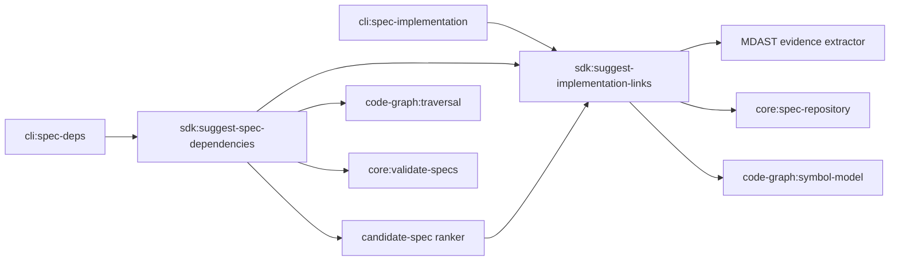

# Design: suggest-implementation-and-spec-deps

## Overview

This design artifact is the **master technical specification** for implementing automated, static-analysis suggestion capabilities in `@specd/sdk` and exposing them via `@specd/cli`. An implementer reading this document and `tasks.md` has complete, unambiguous contracts, code signatures, step-by-step algorithms, data structures, and CLI handler specifications without needing to consult other artifacts.

The feature consists of two application use cases in `@specd/sdk`, each in its own file:

1. `SuggestImplementationLinks` (`packages/sdk/src/application/use-cases/suggest-implementation-links.ts`)
2. `SuggestSpecDependencies` (`packages/sdk/src/application/use-cases/suggest-spec-dependencies.ts`)

And two CLI subcommands in `@specd/cli`:

1. `specd specs implementation suggest` (`packages/cli/src/commands/spec/implementation.ts`)
2. `specd specs deps suggest` (`packages/cli/src/commands/spec/deps.ts`)

## Design revision after full verification (authoritative)

This section is authoritative and all later paths and flows are interpreted according to it. Concrete filesystem construction, config resolution, `existsSync`, cache instantiation, and exploration-file writes never belong in application use cases.

### Application, orchestration, and composition boundary

- `src/application/use-cases/suggest-implementation-links.ts` and `suggest-spec-dependencies.ts` coordinate already-resolved ports and use cases only. Their canonical factories are `createSuggestImplementationLinks(deps)` and `createSuggestSpecDependencies(deps)`. Orchestration names this workflow behaviour; it is not a separate layer and is not synonymous with composition.
- `src/composition/` owns config overloads and resolver helpers. It may import `src/infrastructure/`, construct `FsImplementationSuggestionCache`, `FsSpecDepsSuggestionCache`, a required file-observation adapter, and Core use cases, then delegates to the canonical application factory.
- The public SDK facade may preserve config overload compatibility, but the implementation path is always config facade → composition resolver → `createX(deps)`.
- Application may not import `node:fs`, concrete `Fs*` adapters, or derive paths below `configPath`. File existence/content observations needed by the analysis are required injected dependencies; no permissive fallback may assume files exist.
- The SDK follows the global domain/application/infrastructure/composition topology. Presentation and shared modules remain allowed. The root entrypoint exports curated use cases, ports, models, and composition factories, but never `FsImplementationSuggestionCache` or `FsSpecDepsSuggestionCache`; explicit infrastructure subpaths may expose them when intentional.
- The legacy SDK prohibition on `application/` and `infrastructure/` is superseded. The replacement invariant is dependency direction: application does not import concrete SDK infrastructure, while composition is the sole construction boundary for it.

### Optional exploration as change repository data

`AlignmentChangeWriter` is removed from the design. Alignment creation uses the existing `CreateChange` application use case:

```typescript
interface CreateChangeInput {
  // existing fields omitted
  readonly explorationContent?: string
}

interface CreateChangeStorageOptions {
  readonly explorationContent?: string
}

interface ExplorationMeta {
  readonly lastModified: string
  readonly size: number
}
```

`CreateChange.execute` forwards non-empty `explorationContent` to `ChangeRepository.create(change, options)`. It never writes a file itself. Exploration is optional: absent, `undefined`, or empty content creates a normal change without exploration.

The repository contract exposes `readExploration(change): Promise<string | null>` and `writeExploration(change, content): Promise<void>`. `get` and list operations never load exploration content. A loaded active `Change` may carry `explorationMeta: ExplorationMeta | null`, obtained cheaply by the adapter, solely to signal existence. There is no exploration revision/conflict token in this iteration.

`FsChangeRepository` privately maps the semantic exploration to `.specd-exploration.md`. Initial manifest/exploration persistence has first-create atomic failure semantics: if exploration persistence fails, the new directory is cleaned up and the change is not observable. `_manifestToChange` stats the file for metadata but does not read it. Other adapters, including a future database repository, may use their native representation and need not create any file.

### Post-apply correctness and preconditions

Before mutation, `SuggestSpecDependencies` validates that `ValidateSpecs` exists and, when alignment creation is requested, that `CreateChange` exists. Missing dependencies raise `InvalidInputError` before `UpdatePersistedSpecDeps` runs. Every apply runs post-apply validation.

`ValidateSpecs.execute` returns `{ entries, totalSpecs, passed, failed }`; each entry is `{ spec, passed, failures, warnings }`. `SuggestSpecDependencies` derives invalid specs only from entries whose `passed` is false and formats their failures/warnings. It never reads an `issues` field.

If validation reports invalid specs and alignment creation is authorized, the application use case formats all failures as `[artifactId: description]` and passes the resulting text as `explorationContent` to one `CreateChange.execute` call. If the validator throws, the error is propagated or represented by an explicit validation-failed result; it is never converted into `{ status: 'all-valid', invalidSpecs: [] }`. Update/apply failures likewise remain observable.

### Compliance-report remediations

The implementation phase must also:

- register JSON and TOON help schemas/examples on both CLI suggestion leaves;
- emit the exact reason token `exact-primary-symbol-match` for a primary match;
- ensure validation and optional `CreateChange` dependencies are checked before mutation;
- make `createBuiltinAdapterRegistry` return `AdapterRegistryPort` from every overload and export it from `packages/code-graph/src/composition/index.ts`;
- ensure `FsSpecRepository.artifactMeta` reuses the shared observation/hash path, with `includeMeta` as the canonical list option;
- add focused tests for the dependency preconditions, canonical validator entries, validator exception propagation, exploration delegation/lazy read, composition boundary, root-export boundary, required observer, registry port contract, exact reason, and structured help.

### Updated impact and risk

Graph impact classifies `CreateChange` and `ChangeRepository` as CRITICAL; `CreateChange` reaches 71 affected files and `ChangeRepository` is a repository-wide port hotspot. `Change` is also CRITICAL. Changes therefore remain additive/optional, preserve existing `create(change)` callers through an optional second argument, and avoid loading exploration bytes into aggregate reads. Test doubles and composition/kernel fixtures implementing `ChangeRepository` are part of the required migration surface.

## Context

Spec authors currently manually discover and correlate implementation files, exported AST symbols, and inter-spec `dependsOn` relationships when initializing or updating `spec-lock.json`. This manual process is error-prone and creates onboarding friction. Automated static analysis deduces implementation links and spec dependencies with 100% determinism, zero LLM token cost, and sub-second performance.

## Scope

- **New SDK Use Cases**: `SuggestImplementationLinks` and `SuggestSpecDependencies` in `@specd/sdk`.
- **New CLI Commands**: `suggest` subcommands under `specd specs implementation` and `specd specs deps`.
- **System Cache**: Persistent suggestion cache stored under `join(projectDir, config.configPath, 'tmp', 'fs-cache', 'implementation-suggestions/suggestions.json')`.
- **Non-Existent Spec Validation**: Commands and SDK use cases throw `SpecNotFoundError` if specified target spec IDs do not exist in the repository.
- **Structured Markdown & Dynamic Multi-Language Correlator**: Parses `spec.md` with MDAST, classifies fenced-code, inline-code, heading, and prose evidence, and queries supported source extensions dynamically from an injected `AdapterRegistryPort`, whose composition factory is `createBuiltinAdapterRegistry()`. It validates weak prose candidates against `code-graph`, supports injected file observation, and preserves lifecycle `open()`/`close()` management on `codeGraphProvider`.
- **Deterministic Candidate-Spec Resolution**: When dependency analysis must map an imported file or symbol back to a spec, it ranks every eligible spec from the implementation-suggestion cache. Confirmed links are authoritative; structured evidence, workspace affinity, capability/symbol affinity, and suggestion score disambiguate unconfirmed candidates. A semantic tie remains ambiguous instead of depending on iteration order.
- **Interactive Apply & Batch Confidence Filtering**: Interactive terminal execution of `--apply` uses `@clack/prompts` `multiselect` per spec so users review and select candidates with checkboxes (pre-selecting `HIGH` confidence by default, with convenient select-all / deselect-all controls). The `--yes` / `-y` flag bypasses prompts and defaults to `--confidence HIGH` unless an explicit threshold (`MEDIUM`, `LOW`) is provided. Machine-readable formats (`json`, `toon`) and non-TTY environments never block on interactive stdin.

## Non-goals

- No recursive SDK-owned source index: `code-graph` remains the only codebase index.
- No public “spec owner” API and no persisted ownership claim. Candidate-spec resolution is an internal dependency-suggestion heuristic.
- No constructor, method-signature, parameter-order, or general spec/code completeness comparison. Those belong to a separate completeness capability.
- No iteration-order tie breaker. Equal semantic ownership ranks remain explicitly ambiguous.

## Affected areas & Code Graph Impact Analysis

Impact findings computed via `specd graph impact --direction dependents`:

- `packages/sdk/src/application/use-cases/suggest-implementation-links.ts` (MODIFIED)
  - Target symbol: `SuggestImplementationLinks`.
  - Graph impact: 21 direct dependents, 25 indirect dependents, 6 affected files.
  - Risk: CRITICAL. Its results feed `SuggestSpecDependencies`, both SDK composition factories, and both SDK suggestion test suites. The public input/result shapes remain backward compatible; the change is confined to evidence extraction and deterministic scoring.

- `packages/sdk/src/application/use-cases/suggest-spec-dependencies.ts` (MOVED/RENAMED)
  - Risk: HIGH for this revision because it consumes candidate-spec resolution and must preserve dependency ordering, additive mutation, and post-apply validation.

- `packages/sdk/src/application/services/extract-markdown-symbol-evidence.ts` (NEW)
  - Risk: LOW · Pure MDAST traversal with no filesystem access and no codebase indexing.

- `packages/sdk/package.json` and `pnpm-lock.yaml` (MODIFIED)
  - Add `mdast-util-from-markdown` as an SDK runtime dependency; the version MUST follow the existing workspace lock resolution.

- `packages/sdk/src/domain/value-objects/implementation-suggestion-cache.ts` (NEW)
  - Risk: LOW · Domain value objects, types, stamp contracts, and constants for implementation suggestion cache.

- `packages/sdk/src/domain/value-objects/spec-deps-suggestion-cache.ts` (NEW)
  - Risk: LOW · Domain value objects and types for spec dependencies suggestion cache.

- `packages/sdk/src/application/ports/implementation-suggestion-cache-port.ts` (NEW)
  - Risk: LOW · Abstract application port (`ImplementationSuggestionCachePort`) exposing object-oriented query methods (`get`, `set`, `setMany`, `isSpecFresh`, `findSpecByFile`, `getFileToSpecMap`, `flush`, `invalidate`).

- `packages/sdk/src/application/ports/spec-deps-suggestion-cache-port.ts` (NEW)
  - Risk: LOW · Abstract application port (`SpecDepsSuggestionCachePort`) exposing object-oriented query methods (`get`, `set`, `setMany`, `isSpecFresh`, `flush`, `invalidate`).

- `packages/sdk/src/infrastructure/fs/fs-implementation-suggestion-cache.ts` (NEW)
  - Risk: LOW · Filesystem adapter (`FsImplementationSuggestionCache`) implementing lazy single-pass loading, in-memory bidirectional indexing (`code -> spec`), dirty tracking, and atomic persistence.

- `packages/sdk/src/infrastructure/fs/fs-spec-deps-suggestion-cache.ts` (NEW)
  - Risk: LOW · Filesystem adapter (`FsSpecDepsSuggestionCache`) implementing lazy single-pass loading, dirty tracking, and atomic persistence.

- `packages/cli/src/commands/spec/implementation.ts` (MODIFIED)
  - Target symbol: `registerSpecImplementation`
  - Direct dependents: 3 (`packages/cli/src/index.ts`, `packages/cli/test/commands/spec-implementation.spec.ts`)
  - Risk Level: MEDIUM
  - Note: Extends existing command group by registering `specd specs implementation suggest`. Signature of existing `list`, `add`, `remove` subcommands remains unchanged.

- `packages/cli/src/commands/spec/deps.ts` (MODIFIED)
  - Target symbol: `registerSpecDeps`
  - Direct dependents: 5 (`packages/cli/src/index.ts`, `packages/cli/test/commands/spec-deps.spec.ts`)
  - Risk Level: MEDIUM
  - Note: Extends existing command group by registering `specd specs deps suggest`. Signature of existing `list`, `add`, `remove`, `set`, `clear` subcommands remains unchanged.

---

## Complete Data Contracts & Interfaces

### 1. System Cache & Application Ports

#### Domain Value Objects (`packages/sdk/src/domain/value-objects/implementation-suggestion-cache.ts`)

```typescript
export interface ImplementationSuggestionCacheHeader {
  readonly updatedAt: string
  readonly projectDir: string
  readonly cacheVersion: string
  readonly graphLastIndexedAt: string
  readonly graphFingerprint: string
}

export interface ImplementationSuggestionSpecStamp {
  readonly lastModified: string
  readonly hash: string
  readonly artifacts: readonly {
    readonly filename: string
    readonly lastModified: string
    readonly hash?: string
  }[]
  readonly persistedStateHash?: string
  readonly persistedStateLastModified?: string
}

export interface ImplementationSuggestionLockData {
  readonly files: readonly string[]
  readonly symbols: readonly string[]
  readonly dependsOn: readonly string[]
}

export interface ImplementationSuggestionEntry {
  readonly file: string
  readonly symbols: readonly string[]
  readonly confidence: 'HIGH' | 'MEDIUM' | 'LOW'
  readonly reasons: readonly string[]
  readonly score: number
  readonly alreadyIncluded: boolean
}

export interface ImplementationSuggestionSpecEntry {
  readonly specId: string
  readonly title: string
  readonly specStamp: ImplementationSuggestionSpecStamp
  readonly existing: ImplementationSuggestionLockData
  readonly suggestions: readonly ImplementationSuggestionEntry[]
}

export interface ImplementationSuggestionsCacheFile {
  readonly header: ImplementationSuggestionCacheHeader
  readonly specs: Record<string, ImplementationSuggestionSpecEntry>
}
```

#### Application Ports (`packages/sdk/src/application/ports/`)

```typescript
export abstract class ImplementationSuggestionCachePort {
  abstract isGraphFresh(graphFingerprint: string): Promise<boolean>
  abstract get(specId: string): Promise<ImplementationSuggestionSpecEntry | null>
  abstract set(specId: string, entry: ImplementationSuggestionSpecEntry): Promise<void>
  abstract setMany(
    entries: readonly ImplementationSuggestionSpecEntry[],
    meta?: { readonly graphFingerprint?: string; readonly graphLastIndexedAt?: string },
  ): Promise<void>
  abstract getAll(): Promise<ReadonlyMap<string, ImplementationSuggestionSpecEntry>>
  abstract isSpecFresh(
    specId: string,
    currentStamp: ImplementationSuggestionSpecStamp,
  ): Promise<boolean>
  abstract findSpecByFile(filePath: string, symbolName?: string): Promise<string | null>
  abstract getFileToSpecMap(): Promise<ReadonlyMap<string, string>>
  abstract flush(): Promise<void>
  abstract invalidate(): Promise<void>
}

export abstract class SpecDepsSuggestionCachePort {
  abstract isGraphFresh(graphFingerprint: string): Promise<boolean>
  abstract get(specId: string): Promise<SpecDepsSuggestionSpecEntry | null>
  abstract set(specId: string, entry: SpecDepsSuggestionSpecEntry): Promise<void>
  abstract setMany(
    entries: readonly SpecDepsSuggestionSpecEntry[],
    meta?: { readonly graphFingerprint?: string; readonly graphLastIndexedAt?: string },
  ): Promise<void>
  abstract getAll(): Promise<ReadonlyMap<string, SpecDepsSuggestionSpecEntry>>
  abstract isSpecFresh(
    specId: string,
    currentStamp: ImplementationSuggestionSpecStamp,
  ): Promise<boolean>
  abstract flush(): Promise<void>
  abstract invalidate(): Promise<void>
}
```

### 2. `SuggestImplementationLinks` DTOs & Use Case Class

```typescript
export interface SuggestImplementationLinksInput {
  readonly specId?: string
  readonly specIds?: readonly string[]
  readonly workspace?: string
  readonly all?: boolean
  readonly apply?: boolean
  readonly rebuildCache?: boolean
  readonly confidenceThreshold?: 'HIGH' | 'MEDIUM' | 'MED' | 'LOW'
  // Input validation normalizes shorthand `MED` (case-insensitive) to `MEDIUM` before execution.
  readonly onProgress?: OnSuggestImplementationProgress
}

export interface SpecImplementationSuggestion {
  readonly specId: string
  readonly title: string
  readonly existing: ImplementationSuggestionLockData
  readonly suggestions: readonly ImplementationSuggestionEntry[]
}

export interface SuggestImplementationLinksResult {
  readonly result: 'ok'
  readonly targetWorkspace?: string
  readonly specs: readonly SpecImplementationSuggestion[]
  readonly appliedMutations?: {
    readonly updatedSpecsCount: number
    readonly filesAddedCount: number
    readonly symbolsAddedCount: number
  }
}

export interface SuggestImplementationLinksDeps {
  readonly specRepositories: ReadonlyMap<string, import('@specd/core').SpecRepository>
  readonly getPersistedImplementation: import('@specd/core').GetPersistedSpecImplementation
  readonly updatePersistedImplementation: import('@specd/core').UpdatePersistedSpecImplementation
  readonly fileObserver: {
    exists(filePath: string): Promise<boolean>
    readText(filePath: string): Promise<string>
  }
  readonly codeGraphProvider?: import('@specd/code-graph').CodeGraphProvider
  readonly adapterRegistry: import('@specd/code-graph').AdapterRegistryPort
  readonly projectDir?: string
  readonly configPath?: string
}

export class SuggestImplementationLinks {
  constructor(private readonly deps: SuggestImplementationLinksDeps) {}
  async execute(input: SuggestImplementationLinksInput): Promise<SuggestImplementationLinksResult>
}

// Composition Factory Triple & Resolver
export function createSuggestImplementationLinks(
  deps: SuggestImplementationLinksDeps,
): SuggestImplementationLinks
export function createSuggestImplementationLinks(
  config: import('@specd/core').SpecdConfig,
  options?: import('@specd/core').CompositionResolutionOptions,
): SuggestImplementationLinks
export function createSuggestImplementationLinks(
  depsOrConfig: SuggestImplementationLinksDeps | import('@specd/core').SpecdConfig,
  options?: import('@specd/core').CompositionResolutionOptions,
): SuggestImplementationLinks

export function resolveSuggestImplementationLinksDeps(
  resolver: import('@specd/core').CompositionResolver,
): SuggestImplementationLinksDeps
```

### 3. `SuggestSpecDependencies` DTOs & Use Case Class

```typescript
export interface SuggestSpecDependenciesInput {
  readonly specId?: string
  readonly specIds?: readonly string[]
  readonly workspace?: string
  readonly all?: boolean
  readonly apply?: boolean
  readonly rebuildCache?: boolean
  readonly createAlignmentChange?: boolean
  readonly changeNamePrefix?: string
  readonly onProgress?: OnSuggestSpecDepsProgress
}

export interface SuggestedSpecDependency {
  readonly specId: string
  readonly title: string
  readonly reason: string
}

export interface SpecDependencySuggestion {
  readonly specId: string
  readonly title: string
  readonly existingDependsOn: readonly string[]
  readonly suggestedDependsOn: readonly SuggestedSpecDependency[]
}

export interface CreatedAlignmentChangeInfo {
  readonly name: string
  readonly changePath: string
  readonly specIds: readonly string[]
}

export interface PostApplyValidationDiagnostic {
  readonly status: 'all-valid' | 'invalid-specs-detected'
  readonly invalidSpecs: readonly {
    readonly specId: string
    readonly failures: readonly {
      readonly artifactId: string
      readonly description: string
    }[]
  }[]
  readonly suggestedAlignmentCommand?: string
  readonly createdChange?: CreatedAlignmentChangeInfo
}

export interface SuggestSpecDependenciesResult {
  readonly result: 'ok'
  readonly targetWorkspace?: string
  readonly specs: readonly SpecDependencySuggestion[]
  readonly appliedMutations?: {
    readonly updatedSpecsCount: number
    readonly depsAddedCount: number
  }
  readonly postApplyValidation?: PostApplyValidationDiagnostic
}

export interface SuggestSpecDependenciesDeps {
  readonly suggestImplementationLinks: SuggestImplementationLinks
  readonly specRepositories: ReadonlyMap<string, import('@specd/core').SpecRepository>
  readonly getPersistedDeps: import('@specd/core').GetPersistedSpecDeps
  readonly updatePersistedDeps: import('@specd/core').UpdatePersistedSpecDeps
  readonly validateSpecs: import('@specd/core').ValidateSpecs
  readonly createChange?: import('@specd/core').CreateChange
  readonly codeGraphProvider?: import('@specd/code-graph').CodeGraphProvider
  readonly projectDir?: string
  readonly configPath?: string
}

export class SuggestSpecDependencies {
  constructor(private readonly deps: SuggestSpecDependenciesDeps) {}
  async execute(input: SuggestSpecDependenciesInput): Promise<SuggestSpecDependenciesResult>
}

// Composition Factory Triple & Resolver
export function createSuggestSpecDependencies(
  deps: SuggestSpecDependenciesDeps,
): SuggestSpecDependencies
export function createSuggestSpecDependencies(
  config: import('@specd/core').SpecdConfig,
  options?: import('@specd/core').CompositionResolutionOptions,
): SuggestSpecDependencies
export function createSuggestSpecDependencies(
  depsOrConfig: SuggestSpecDependenciesDeps | import('@specd/core').SpecdConfig,
  options?: import('@specd/core').CompositionResolutionOptions,
): SuggestSpecDependencies

export function resolveSuggestSpecDependenciesDeps(
  resolver: import('@specd/core').CompositionResolver,
): SuggestSpecDependenciesDeps
```

---

## Detailed Step-by-Step Execution Algorithms

### Structured Markdown evidence service

`packages/sdk/src/application/services/extract-markdown-symbol-evidence.ts` exports a
pure, named API:

```typescript
export type MarkdownEvidenceSource = 'fenced-code' | 'inline-code' | 'prose'

export interface MarkdownSymbolEvidence {
  readonly candidate: string
  readonly kind: 'symbol' | 'file-path'
  readonly source: MarkdownEvidenceSource
  readonly sectionPath: readonly string[]
}

export interface ExtractMarkdownSymbolEvidenceInput {
  readonly markdown: string
  readonly supportedExtensions: ReadonlySet<string>
  readonly supportedLanguages: ReadonlySet<string>
  readonly reservedKeywords: ReadonlySet<string>
}

export function extractMarkdownSymbolEvidence(
  input: ExtractMarkdownSymbolEvidenceInput,
): readonly MarkdownSymbolEvidence[]
```

The service calls `fromMarkdown(markdown)` once and walks the returned tree in source
order. Heading nodes maintain `sectionPath`. Code nodes are eligible only when their
language is in `supportedLanguages`; inline-code nodes may yield identifiers or paths
whose extension is in `supportedExtensions`; heading and text nodes yield PascalCase,
camelCase, and member-root candidates. Universal prose stop words and registry-provided
language keywords are rejected before output. The result is deduplicated by
`kind + candidate`; duplicate evidence keeps the strongest source
(`fenced-code > inline-code > prose`) and, for equal strength, the first source location.
The service performs no I/O and never queries or indexes source code.

`SuggestImplementationLinks` resolves prose symbols through
`CodeGraphProvider.findSymbols({ name, workspace })` before they enter candidate path
derivation or scoring. Unresolved prose is discarded. Evidence contributes exactly one
source bonus per symbol/file pair and exposes the corresponding stable reason:

| Source                | Score bonus | Reason                  |
| --------------------- | ----------: | ----------------------- |
| fenced code           |         +30 | `fenced-code-evidence`  |
| inline code           |         +20 | `inline-code-evidence`  |
| graph-validated prose |          +5 | `prose-symbol-evidence` |

These bonuses supplement existing primary-symbol, derivative, filename, and token-affinity
scores; they do not independently qualify a candidate as `HIGH` confidence.
Composition injects `AdapterRegistryPort`; the use case derives `supportedExtensions` from
`getSupportedExtensions()`, `supportedLanguages` from the union of
`getAdapters().flatMap(adapter => adapter.languages())`, and reserved words from
`getReservedKeywords()`.

### Algorithm A: `SuggestImplementationLinks`

1. **Target Spec Resolution & Validation**:
   - Parse `input.specId`, `input.specIds`, `input.workspace`, or `input.all`.
   - Retrieve workspace repositories via `deps.specRepositories`. Call `SpecRepository.list({ includeMeta: true })` to load target `SpecListEntry` list.
   - If `input.specId` or `input.specIds` are provided, verify each spec ID exists in the repositories. If any spec ID is missing, throw `SpecNotFoundError`.

2. **2-Stage Staleness Check (`lastModified` -> `hash`)**:
   - Read `join(projectDir, configPath, 'tmp', 'fs-cache', 'implementation-suggestions/suggestions.json')`.
   - Check `header.graphLastIndexedAt` and `header.graphFingerprint` against `code-graph` health stats. If graph generation shifted or `input.rebuildCache` is `true`, invalidate globally.
   - For each target spec:
     - Compare `entry.artifacts[].lastModified` against `cachedSpec.specStamp.lastModified`.
     - If equal: **Cache HIT**. Return cached entry in < 1 ms.
     - If changed: retrieve content hash via `SpecRepository.getSpecMeta(specPath, { includeHash: true })`.
     - Compare `newHash` vs `cachedSpec.specStamp.hash`.
     - If hashes equal: update `lastModified` in cache and preserve suggestions (**Cache HIT preserved**).
     - If hashes differ: ❌ **Cache MISS** (re-calculate Pass 1 & Pass 2).

3. **Tier 1: Structured Markdown Symbol Evidence & Path Derivatives**:
   - Read `spec.md` for cache miss specs via `SpecRepository.get(...)`.
   - Call `extractMarkdownSymbolEvidence` once. Do not run document-wide fenced-code or inline-code regular expressions in parallel with the MDAST traversal.
   - Resolve prose evidence against `CodeGraphProvider.findSymbols` in the target workspace before it can create a candidate. Fenced-code and inline-code evidence still require the existing candidate-file and declared-symbol checks before output.
   - Parse inline-code filenames for any extension declared by `AdapterRegistryPort`, not only `.ts`, to register derived candidate paths.
   - Derive candidate paths from capability name (e.g., `cli:spec-deps` -> `packages/cli/src/commands/spec/deps.ts`).
   - Filter candidate paths through the required injected file-observation port. Composition supplies the filesystem implementation; the use case does not call `existsSync`.
   - **Path & Token Affinity (`computePathSpecAffinity`)**:
     - Splits spec capability name and candidate file paths into normalized tokens with `[\/\\_\-.:]+` and plural stemming (`length > 2 && !endsWith('ss')`).
     - Computes token coverage. If candidate file path lacks distinctive spec tokens (e.g., candidate missing `port` token for `core:spec-repository-port`), penalizes candidate with a per-token score penalty of `missingTokens.length * 150` (i.e. `-150` per missing token) and records the `missing-distinctive-tokens` reason. Candidates carrying that reason are excluded from `HIGH` confidence regardless of final score.
   - **Symbol Differentiation**:
     - Exact Primary Symbol Match: +200 points.
     - Derivative Symbol Match: +50 points.
   - Score candidates:
     - `HIGH` confidence: score >= 150 AND clean token affinity (zero missing distinctive spec tokens) AND exact primary symbol or slug match.
     - `MEDIUM` confidence: 80 <= score <= 149 (naming path derivative match).
     - `LOW` confidence: score < 80.
   - Retain Tier 1 candidates while Tier 2 runs so hierarchical candidates can compete in the same ranked set.

4. **Tier 2: Hierarchical Domain Prefix Derivation & Sub-token Content Matching**:
   - For multi-segment capability slugs (e.g. `schema-which-command`), derives parent domain candidate paths across standard source folders (e.g. `src/commands/schema.ts`, `src/application/schema.ts`).
   - Verifies whether missing distinctive sub-tokens (e.g. `which`) exist inside candidate file content via disk inspection and SQLite FTS5 search in `code-graph`.
   - Assigns `subtoken-content-match` bonus (+160 points) and associates top-level exported AST symbols from the matched domain container.
   - After Tier 2, return the combined Tier 1/Tier 2 ranked set when non-empty; this short-circuits only Tier 3 and never discards Tier 1 results.

5. **Tier 3: Fallback Syntax Tag & Requirement Keyword Co-occurrence Search**:
   - Triggered **only when Tiers 1 and 2 yield zero candidate suggestions**.
   - Extracts distinctive syntax tags (e.g. `<rules>`, `<template>`) and keywords from Requirement headings in `spec.md`.
   - Queries `code-graph` for candidate source files exhibiting multi-term co-occurrence.
   - Ranks candidate files by co-occurrence density and assigns `fallback-content-co-occurrence` with `MEDIUM` confidence.

6. **Cache Inversion & Disambiguation (`FsImplementationSuggestionCache`)**:
   - When building the inverse `file -> specId` map across all specs:
     - If a file is confirmed in `spec-lock.json` (`isExisting === true`), that spec wins authoritatively.
     - `findSpecByFile(filePath, symbolName?)` first collects every spec that confirms or suggests the canonical file. When `symbolName` is provided and at least one candidate suggestion lists that resolved symbol, candidates not listing it are removed.
     - Rank the remaining candidates lexicographically by the semantic tuple `(confirmed, evidenceStrength, workspaceAffinity, capabilitySymbolAffinity, score)`, where booleans are `1|0`, evidence strength is fenced `3`, inline `2`, prose `1`, and naming-only `0`, workspace affinity means the spec and file share a workspace, and capability/symbol affinity means the normalized capability basename equals the symbol's kebab-case name.
     - A unique highest tuple wins. `specId` sorting is used only for deterministic diagnostics and MUST NOT break a semantic tie; equal highest tuples return `null` and remain ambiguous.
     - `getFileToSpecMap()` applies the same algorithm without `symbolName`. It never selects the first insertion-order match.

7. **Pass 3: Mutation & Persistence**:
   - Persist calculated entries in `configPath/tmp/fs-cache/implementation-suggestions/suggestions.json` with `IMPLEMENTATION_SUGGESTION_CACHE_VERSION = '1.1.0'`.
   - If `input.apply === true`:
     - Group suggestions by spec.
     - Invoke `deps.updatePersistedImplementation` with `action: 'add'` for each discovered `file` and `symbols`.
     - Set union guarantees existing links in `spec-lock.json` are retained without deletion.

---

### Algorithm B: `SuggestSpecDependencies`

1. **Pass 1: Dry-Run Cache Warm-up & Global Inverse Map**:
   - Execute `await this.deps.suggestImplementationLinks.execute({ all: true, apply: false })` to ensure `ImplementationSuggestionCachePort` is 100% complete and warm for all specs in the monorepo.
   - Load confirmed `spec-lock.json` files + `HIGH` confidence suggested files across all specs.
   - Build in-memory inverse index mapping relative production file path -> `specId`.
   - Initialize `SpecDepsSuggestionCachePort` validating `SPEC_DEPS_CACHE_VERSION = '1.1.0'`.

2. **Pass 2: AST Import Analysis & Impact Traversal**:
   - For each target spec, obtain its implementation source files.
   - Parse TypeScript `import` declarations in those source files.
   - Execute `analyzeFileImpact` (`maxDepth = 1`) via `code-graph` to resolve direct imports and barrel re-export files.
   - When traversal resolves an imported symbol and file, call `findSpecByFile(filePath, symbolName)` so explicit symbol evidence can disambiguate multiple candidate specs. When only a file is resolved, call `findSpecByFile(filePath)`.
   - Treat `null` as ambiguous/no owner and emit no dependency for that edge. Never select a spec by cache, map, or repository insertion order.
   - Deduce initial candidate inter-spec dependencies.

3. **Pass 2.5: Directional Code Import Validation**:
   - For each candidate spec $C$ suggested for target spec $T$:
     - Check if candidate $C$'s implementation files import target $T$'s files.
     - Check if target $T$'s implementation files import candidate $C$'s files.
     - If candidate $C$ imports target $T$, but target $T$ does NOT import candidate $C$:
       - The relationship is strictly inverted (e.g. adapter importing port, or implementation importing interface).
       - Automatically prune $C$ from $T$'s suggested dependencies.

4. **Pass 2.6: Direct Recommendation Transitive Reduction**:
   - For each candidate recommendation $B$, checks whether another candidate recommendation $A$ directly depends on $B$ ($B \in \text{directDeps}(A)$).
   - If $A$ directly depends on $B$, $B$ is pruned so only the first / most specific spec in the recommendation chain is suggested directly for target spec $T$.

5. **Pass 3: Mutation, Post-Apply Validation & Conditional Alignment Change**:
   - If `input.apply === true`:
     - Call `deps.updatePersistedDeps` with `add` set to the new dependency `specId` array (set union mutation).
     - Execute `deps.validateSpecs.execute({})`.
     - Extract validation `failures: Array<{ artifactId: string, description: string }>`.
     - **Conditional Alignment Change Creation**:
       - If `failures` array is non-empty (`status: "invalid-specs-detected"`) AND `input.createAlignmentChange === true` (or `--create-change` flag / TTY acceptance):
         - Create a single alignment change gathering ALL failing specs: `align-spec-deps-<timestamp>`.
         - Write `<changePath>/.specd-exploration.md` using the exploration template with exact `[artifactId: description]` failure entries.
       - If all specs are valid (`status: "all-valid"`):
         - No change is created under any circumstances.

---

## CLI Formatting & Command Registration (`@specd/cli`)

### 1. `specd specs implementation suggest` (`packages/cli/src/commands/spec/implementation.ts`)

- Command signature:
  `specd specs implementation suggest [<spec-id>] [--spec <id>...] [--all] [--workspace <name>] [--apply] [--confidence <HIGH|MED>] [--rebuild-cache]`
- Accepts `--format text|json|toon` (default `text`).
- Handlers delegate directly to `SuggestImplementationLinks.execute(input)`.

### 2. `specd specs deps suggest` (`packages/cli/src/commands/spec/deps.ts`)

- Command signature:
  `specd specs deps suggest [<spec-id>] [--spec <id>...] [--all] [--workspace <name>] [--apply] [--create-change] [--rebuild-cache]`
- Accepts `--format text|json|toon` (default `text`).
- In `--format text`, if invalid specs are detected after `--apply` and interactive TTY is present, prompts `[y/N]` to create an alignment change.
- In `--format json` or `--format toon`, **NEVER prompts or blocks stdin**. Automatically includes `createdChange` metadata if `--create-change` was passed, or returns diagnostic report if not.

---

## Approach

1. **Layer Structure**:
   - `@specd/sdk`: houses each suggestion use case in its own `packages/sdk/src/application/use-cases/` file; ports live in `application/ports`, concrete caches in `infrastructure/fs`, and config assembly in `composition`.
   - `@specd/core`: Remains pure and independent of `code-graph`.
   - `@specd/cli`: Houses subcommands in `packages/cli/src/commands/spec/`.
2. **Execution Order**:
   - Add the SDK MDAST dependency and pure evidence service -> replace regex-only Markdown extraction in `SuggestImplementationLinks` -> add evidence bonuses and inverse-cache ranking -> pass resolved symbol names from `SuggestSpecDependencies` -> update unit/integration tests -> run existing CLI and documentation verification.

## Key decisions

- **Decisions**: Use Cases live in `@specd/sdk` → `@specd/core` stays independent of `@specd/code-graph`.
- **Decisions**: 2-stage staleness evaluation (`lastModified` -> `hash`) → sub-millisecond cache hit, zero unnecessary hash recalculations.
- **Decision**: Interactive multiselect per spec using `@clack/prompts` for `--apply` -> provides user control over every proposed implementation link and dependency link before mutating `spec-lock.json`. **Alternative rejected**: blindly applying all lower-confidence links without confirmation.
- **Decision**: `--yes` / `-y` flag defaults to `HIGH` confidence threshold when `--confidence` is omitted -> enables safe, unattended automation while requiring explicit `--confidence MEDIUM` or `LOW` to auto-accept lower-confidence candidates.
- **Decision**: Interpret `ValidateSpecsResult.entries` directly and propagate validator failures → invalid specs cannot be mislabeled as valid. **Alternative rejected**: reading a synthetic `issues` list or failing open.
- **Decision**: Composition returns ports and hides concrete infrastructure from package roots → callers remain insulated from adapter choice. **Alternative rejected**: public factories typed as `AdapterRegistry` or SDK root exports of FS caches.
- **Decision**: Reuse the PoC's evidence hierarchy, not its filesystem index → MDAST supplies structural evidence while `code-graph` remains ground truth. **Alternative rejected**: recursively scanning `packages/` and building a TypeScript-only symbol map inside SDK.
- **Decision**: Resolve candidate specs with a complete semantic ranking tuple and explicit ambiguity → deterministic across repository/list order. **Alternative rejected**: the PoC's first matching contract/domain/reference candidate and lexical `endsWith` ownership choice.
- **Decision**: Keep ownership inference internal to dependency suggestions → improves file/symbol-to-spec disambiguation without creating a new public contract. **Alternative rejected**: exposing primary ownership or completeness results from `SuggestImplementationLinks`.

## Trade-offs

- [Risk] Large monorepo initial cache generation latency → Mitigation: 2-stage cache staleness stamp check preserves cache HIT in < 1 ms after initial run.
- [Risk] Moving use cases from `orchestration/` changes import paths → Mitigation: update internal imports/tests atomically and preserve only intentional curated root exports; do not keep a second implementation.
- [Risk] `ChangeRepository`, `CreateChange`, and `Change` are CRITICAL fan-in hotspots → Mitigation: keep exploration fields optional, preserve existing call signatures, update every repository double, and exercise cleanup/no-hydration integration tests.
- [Risk] `SuggestImplementationLinks` is CRITICAL (21 direct dependents, 6 affected files) → Mitigation: preserve public DTOs, make `symbolName` optional on cache lookup, keep existing confidence thresholds, and run both suggestion test suites.
- [Risk] Prose harvesting increases false positives → Mitigation: prose candidates must resolve in the target workspace and receive only +5; they cannot independently establish `HIGH` confidence.
- [Risk] A shared implementation file legitimately belongs to multiple specs → Mitigation: confirmed links dominate, symbol evidence narrows candidates when available, and a tied semantic tuple yields no inferred dependency.

## Spec impact

- Modifies `cli:spec-implementation` and `cli:spec-deps` by adding `suggest` subcommands.
- Adds new SDK specs `sdk:suggest-implementation-links` and `sdk:suggest-spec-dependencies`.

## Dependency map



```
┌────────────────────────────────┐       ┌──────────────────────────────┐
│ cli:spec-implementation        │──────▶│ sdk:suggest-                 │
└────────────────────────────────┘       │ implementation-links         │
                                         └──────┬───────┬───────────────┘
                                                │       │
                                                │       ▼
                                                │  ┌────────────────────┐
                                                │  │ MDAST evidence     │
                                                │  │ extractor          │
                                                │  └────────────────────┘
                                                        │
┌────────────────────────────────┐       ┌──────────────▼───────────────┐
│ cli:spec-deps                  │──────▶│ sdk:suggest-spec-            │
└────────────────────────────────┘       │ dependencies                 │
                                         └──────┬───────┬───────────────┘
                                                │       │
                                                │       ▼
                                                │  ┌────────────────────┐
                                                │  │ candidate-spec     │
                                                │  │ semantic ranking   │
                                                │  └────────────────────┘
                                                        │
                                                        ▼
                                         ┌──────────────────────────────┐
                                         │ core:validate-specs          │
                                         └──────────────────────────────┘
```

## Testing

### Automated tests

- Unit tests in `packages/sdk/test/application/use-cases/suggest-implementation-links.spec.ts`:
  - Assert 2-pass symbol matching and confidence scoring.
  - Assert 2-stage cache HIT on unchanged `lastModified` stamp.
  - Assert additive set union when `apply: true`.
  - Assert Tier 2 retains Tier 1, Tier 3 runs only for an empty combined set, and a missing observer fails construction.
  - Assert MDAST source precedence (`fenced-code > inline-code > prose`), stable reason tokens, graph rejection of unmatched prose, and absence of recursive source indexing or completeness output.
- Unit tests in `packages/sdk/test/application/use-cases/suggest-spec-dependencies.spec.ts`:
  - Assert import graph tracing and barrel re-export resolution (depth `1` plus a conditional barrel re-export hop).
  - Assert canonical `{ entries, totalSpecs, passed, failed }` interpretation, conditional alignment creation, and validator/update failure propagation.
  - Assert candidate-spec ranking prefers a confirmed link, then symbol-matched structured evidence; repository order does not affect the winner; equal semantic tuples return `null` and produce no dependency.
- Pure service tests in `packages/sdk/test/application/services/extract-markdown-symbol-evidence.spec.ts` cover heading paths, supported/unsupported fenced languages, inline file paths across registered extensions, keyword filtering, strongest-source deduplication, and stable source order.
- CLI integration tests in `packages/cli/test/commands/spec-implementation.spec.ts` and `spec-deps.spec.ts`.
- SDK composition/export tests assert FS cache construction is confined to composition and concrete FS caches are absent from the root API.
- Code Graph composition tests assert `createBuiltinAdapterRegistry` is exported and publicly returns `AdapterRegistryPort`.
- Core FS tests assert `artifactMeta` shares observation/hash logic, exploration is lazy, and failed initial exploration persistence leaves no change.

### Manual / E2E verification

- Run `node packages/cli/dist/index.js specs implementation suggest --all` and inspect formatted output.
- Run `node packages/cli/dist/index.js specs deps suggest --spec cli:change-implementation --apply --create-change` and verify post-apply validation and repository-owned exploration persistence.

## Documentation

- `docs/cli/spec-implementation.md`: Document `specd specs implementation suggest [<spec-id>] [--spec <id>...] [--all] [--workspace <name>] [--apply] [--confidence <HIGH|MED>] [--rebuild-cache]`.
- `docs/cli/spec-implementation.md`: Also describe fenced/inline/prose evidence reasons and that prose must resolve in code graph.
- `docs/cli/spec-deps.md`: Document `specd specs deps suggest [<spec-id>] [--spec <id>...] [--all] [--workspace <name>] [--apply] [--create-change] [--rebuild-cache]`, including explicit ambiguity when no unique candidate spec exists.
- `docs/cli/cli-reference.md`: Update main CLI reference index for `spec implementation suggest` and `spec deps suggest`.

## Architecture conformance

There are no accepted architecture exceptions for this feature. SDK application use cases
depend only on ports and other application contracts; SDK composition is the only SDK layer
that imports SDK infrastructure; Core remains independent of Code Graph; CLI consumes the
curated SDK host surface. Domain modules perform no I/O. TypeScript remains strict ESM with
named exports, no default exports, and JSDoc on public APIs. Concrete filesystem caches are
not exported from the SDK root, and exploration filesystem layout remains private to
`FsChangeRepository`.

**Graph-index lock routing (deferred).** `@specd/cli` currently imports
`acquireGraphIndexLock` from the code-graph `"./internal"` development barrel and declares a
direct `@specd/code-graph` dependency. This knowingly deviates from `_global/architecture`
(hosts must go through `@specd/sdk`; public barrels must stay free of infrastructure) and is
accepted as debt: no approved composition boundary exists today for this host-facing
capability. A dedicated follow-up change will introduce a fork-based isolated indexer worker
owned by `@specd/sdk`, at which point the CLI drops both the internal import and the direct
dependency.

**Cache stamp identity pre-filter (size+mtime).** At this repo's scale (~270 specs,
2-3 artifacts each), every `--all` pass fetched the content hash 2-4 times per spec
(cache `get()` + `set()` across both adapters), re-hashing identical content within a
single process. Resolution: `SpecArtifactEntry` and `ArtifactMeta` now carry `size`
(byte length from the same `stat` that already produced `lastModified` — zero extra
I/O, added to both `repo.get()` and `artifactMeta` for API coherence). The FS cache
stamps persist optional `size`, and freshness becomes a three-stage identity check:
(1) size/mtime pre-filter decides without hashing when both match or when size
differs; (2) content-hash precedence settles drifted-mtime/equal-size cases; (3)
timestamp fallback only when no usable hash exists. Legacy stamps without `size`
fall through to stage 2/3 unchanged. Contracts updated in `core:spec-repository-port`
and `core:fs-spec-repository`; behavior in both FS suggestion caches.

Accepted residual risk of stage 1: a content change that preserves BOTH the byte
length and the exact mtime would be served as fresh. This requires adversarial
conditions (same-second write with identical byte count) and is considered an
acceptable trade for skipping hashing on the common path; stage 2 remains the
authority whenever the pre-filter cannot decide.

**Shared cache plumbing dedup (refactor).** Both FS suggestion adapters duplicated
three blocks verbatim: the atomic flush sequence (mkdir + temp write + rename),
the cheap spec-stamp reader, and the lazy hash enrichment. Extraction into two
sdk-local helpers under `infrastructure/fs/`: `write-json-atomic.ts` (mkdir +
temp-with-UUID write + rename, unlinking the temp file when rename fails — same
semantics as core's internal `writeFileAtomic`) and `spec-stamp-source.ts`
(`readSpecStamp(deps, specId)` / `enrichSpecHash(deps, specId, stamp)` /
`decideFreshness(cached, current)` returning fresh | stale | needs-hash so stage
2 enrichment stays at the call site). Core keeps its own copy of the atomic write
(core cannot depend on sdk); cross-package consolidation is deferred until a
shared kernel location exists. No behavioral change — all existing tests must
stay green untouched.

## Open questions

- None.
