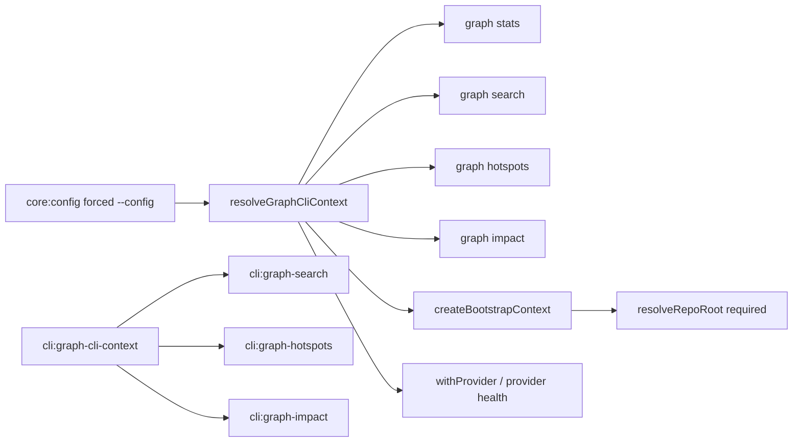

# Design: fix-graph-cli-context-explicit-config

## Objectives and outcome

Graph read commands SHALL accept a valid project selected with `--config` when
the configured project root has no VCS repository. The configured context shall
retain its project configuration and kernel; its VCS-root field shall be `null`
when repository discovery is unavailable. `--path` and no-config bootstrap shall
remain VCS-bound and continue to create the existing synthetic single-workspace
configuration only after a repository root has been resolved.

The change fixes the regression exposed by `graph stats` without restoring a
stats-specific host lifecycle. `stats`, `search`, `hotspots`, and `impact` shall
continue to use `resolveGraphCliContext` and `withProvider`.

## Non-goals

- Do not change `core:config` discovery or forced-file semantics.
- Do not make bootstrap mode work outside VCS.
- Do not change provider health calculation, output formatting, storage, locks,
  signals, or exit handling.
- Do not change Ladybug deprecation behavior or SQLite graph-store specs.
- Do not add a feature flag, migration, retry policy, new public command, data
  model, or documentation page; this is a backwards-compatible CLI fix.

## Affected areas

- `resolveGraphCliContext` and `GraphCliContext` in
  `packages/cli/src/commands/graph/resolve-graph-cli-context.ts`.
  Change `vcsRoot` from `string` to `string | null` and split repository
  resolution by mode. This public internal graph-command boundary has HIGH
  impact: 11 direct dependents, 2 indirect dependents, and 13 affected files.
  Consumers include `search`, `hotspots`, `impact`, `index-graph`, `stats`, and
  their command tests. No consumer may assume `vcsRoot` is present in configured
  mode after this change.
- `packages/cli/test/commands/graph-cli-context.spec.ts`.
  Extend the focused resolver tests; this existing test file is already a direct
  dependent of the resolver.
- `packages/cli/test/commands/graph-stats.spec.ts`.
  Keep the handler's forwarding of `--config` to shared context covered, and add
  a regression-level assertion that the configured non-VCS context can reach the
  provider lifecycle rather than failing at context resolution.

No production graph handler needs an implementation change: they consume the
resolved `config`, while VCS health remains provider-owned.

## New constructs

None. The change modifies the existing interface and resolver only.

## Interfaces and execution flow

`GraphCliContext` shall have this relevant shape:

```ts
interface GraphCliContext {
  readonly mode: 'configured' | 'bootstrap'
  readonly config: SpecdConfig
  readonly configFilePath: string | null
  readonly kernel: Kernel | null
  readonly projectRoot: string
  readonly vcsRoot: string | null
}
```

`resolveGraphCliContext(options?: { configPath?: string; repoPath?: string })`
shall preserve the existing mutual-exclusion validation. Its mode-specific flow
is:

1. If `repoPath` is supplied, invoke `createBootstrapContext(repoPath)`. That
   helper calls `resolveRepoRoot`; failure remains `CliValidationError` with the
   existing bootstrap diagnostic.
2. If `configPath` is supplied, call `resolveCliContext({ configPath })`, return
   configured context from that result, and set `vcsRoot: null`. It must not call
   `resolveRepoRoot`.
3. If no flag is supplied and `resolveConfigPath()` finds configuration, call
   `resolveCliContext()`, return configured context, and set `vcsRoot: null`. It
   must not call `resolveRepoRoot`.
4. If no configuration is discoverable, call `createBootstrapContext(process.cwd())`.

VCS availability is intentionally not probed in configured mode. The provider's
existing health implementation owns VCS detection and may report unknown or
unavailable VCS-derived fields. This avoids converting health uncertainty into a
CLI validation failure.

## Key decisions

**Use `null` for configured-mode `vcsRoot` without VCS probing** → distinguishes
an absent repository from a resolved bootstrap root and avoids a second,
unnecessary VCS path through configuration execution.

**Apply the rule to both explicit and discovered configuration** → `core:config`
defines CWD-only discovery outside VCS and both branches already represent a
configured project. Applying it only to `--config` would retain the same defect
for valid discovered configuration.

**Keep `createBootstrapContext` unchanged** → it is the sole place that needs a
VCS root to construct synthetic bootstrap config. Weakening it would violate the
bootstrap contract.

**Do not revert stats to `openSpecdHost`** → the active deprecation change has
standardized read-only graph commands on the shared resolver/provider lifecycle;
the defect is in shared context semantics, not the stats command.

## Error handling, compatibility, and operations

Invalid config and mutually exclusive flags retain their current user-error path
and exit code. Bootstrap outside a repository retains the current actionable
`CliValidationError`. Provider-open and graph-health failures remain provider or
infrastructure errors and their existing exit behavior is unchanged.

The type widening is internal to the CLI package. Every current consumer must
compile with `string | null`; no external API contract or persisted data changes.
There is no migration, rollback operation, permission change, logging change, or
new observability signal. Reverting this change restores the previous resolver
branch only.

## Spec impact

`cli:graph-cli-context` has three direct spec dependents:
`cli:graph-hotspots`, `cli:graph-impact`, and `cli:graph-search` (MEDIUM spec
impact). Their requirements remain satisfied because all configured commands
receive the same config/kernel as before; only the formerly invalid non-VCS
configured case becomes valid. They require no deltas. `cli:graph-stats` has no
dependent specs (LOW spec impact). `core:config` is unchanged because its forced
configuration requirement already establishes the desired behavior.

## Dependency map



```
┌───────────────────────────┐
│ core:config: forced config│
└─────────────┬─────────────┘
              ▼
┌───────────────────────────┐      ┌──────────────────────────┐
│ resolveGraphCliContext    │─────▶│ withProvider / health     │
│ [HIGH: 11 direct callers] │      │ VCS may be unavailable    │
└───┬─────────┬─────────┬───┘      └──────────────────────────┘
    │         │         │
    ▼         ▼         ▼
 ┌───────┐ ┌───────┐ ┌─────────┐
 │ stats │ │search │ │hotspots │
 └───────┘ └───────┘ └─────────┘
    │ bootstrap only
    ▼
┌───────────────────────────┐
│ createBootstrapContext    │───▶ resolveRepoRoot (required)
└───────────────────────────┘

cli:graph-cli-context ─ ─depends on─ ─▶ cli:graph-search / hotspots / impact
```

## Testing and acceptance criteria

Automated tests in `graph-cli-context.spec.ts` shall mock configured context and
VCS resolution to verify all of the following:

- Explicit valid config outside VCS resolves as `mode: 'configured'`, preserves
  config/kernel/projectRoot, returns `vcsRoot: null`, and does not reject.
- A discovered valid config outside VCS has the same result.
- `--path` and no-config fallback outside VCS still reject with the bootstrap
  validation error.
- Bootstrap in VCS still returns its synthetic default workspace and a non-null
  VCS root.
- `--config` plus `--path` continues to fail before resolver/provider work.

`graph-stats.spec.ts` shall verify that a stats invocation with explicit config
passes it to shared context and, when that context represents a non-VCS configured
project, invokes `withProvider` and obtains health rather than emitting a bootstrap
error. Existing one-health-call and format assertions remain unchanged.

Run `pnpm --filter @specd/cli test`, `pnpm --filter @specd/cli lint`, and the
repository typecheck. Manually create a temporary valid project outside a VCS
repository, then run:

```sh
node packages/cli/dist/index.js graph stats --config /tmp/project/specd.yaml --format toon
```

The command must reach normal graph-health output or provider-owned health data;
it must not print the bootstrap repository validation error. Also run
`graph stats --path /tmp/non-vcs-project` and confirm the bootstrap validation
error remains. No `docs/` update is needed because the global `--config` contract
already documents this behavior and the command syntax is unchanged.

## Open questions

None.
