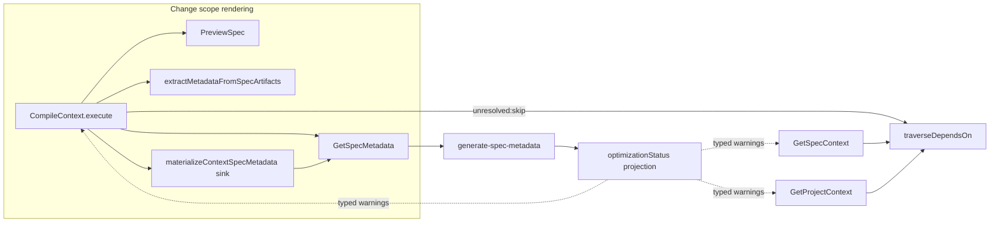

# Design: context-extracted-first

## Objectives

1. For every collected spec whose ID is in `change.specIds` (the change scope), `CompileContext` renders title, description, and section content from schema-driven extraction over the merged `PreviewSpec` artifact set in **all** display modes (except `list`), with canonical metadata as fallback.
2. Eliminate spurious context warnings: no metadata-absence warnings for specs whose merged view provides data; no optimization warnings for scoped specs; no "was regenerated" warning anywhere.
3. Outside the change scope, split the single `stale-optimization` warning into `missing-optimization` (never optimized) and `stale-optimization` (baselines drifted).
4. Make `dependsOn` traversal structurally correct for non-persisted change-scoped specs: manifest-declared deps traverse before any repository access; discovered deps that resolve to no persisted spec are neither registered nor warned.

## Non-goals

- No changes to `.specd/config/skills/shared/shared.md` agent policy wording.
- No changes to `GetProjectContext`/`GetSpecContext` change-agnosticism: they get only the shared-sink fix and the warning-type split; no change-scope exemption.
- No auto re-optimization after archive; no new CLI flags or output formats; no schema YAML changes.
- No changes to project-level optimized-context freshness logic (`_shared/project-metadata-freshness.ts`) or its `stale-optimization` usage for the project blob.
- No persistence of merged-derived metadata: extraction over merged files is computed per load and never written to `metadata.json`.

## Affected areas

All paths relative to `packages/core/`.

| Symbol / file                                                                                                  | Change                                                                                                                                                                                                                                                                                                                                                                              | Impact                                                                                                                                                                                                                                                                                                                               |
| -------------------------------------------------------------------------------------------------------------- | ----------------------------------------------------------------------------------------------------------------------------------------------------------------------------------------------------------------------------------------------------------------------------------------------------------------------------------------------------------------------------------- | ------------------------------------------------------------------------------------------------------------------------------------------------------------------------------------------------------------------------------------------------------------------------------------------------------------------------------------ |
| `CompileContext.execute` + private render helpers in `src/application/use-cases/compile-context.ts`            | Rework per-spec rendering loop (:529-703): preview-first for scoped specs in all modes; fallback ladder; warning emission rules. Rework Step 5 ordering (:424-490). Replace optimization-warning block (:573-582).                                                                                                                                                                  | Blast radius CRITICAL by wiring transitivity (163 files reach it through composition/kernel), but **no constructor, input, or result signature changes** — behavior-only inside the loop. Direct callers: CLI `changes context`, `changes status --context`, kernel factory (`src/composition/use-cases/compile-context.ts`), tests. |
| `appendMaterializationDiagnostics` in `src/application/use-cases/_shared/materialize-context-spec-metadata.ts` | Remove the `regenerated → stale-metadata` relay block (:35-41). Keep `metadata-cache-write-failed` relay.                                                                                                                                                                                                                                                                           | Consumers: `CompileContext`, `GetSpecContext`, `GetProjectContext` — all three lose the noise simultaneously; no signature change.                                                                                                                                                                                                   |
| `traverseDependsOn` in `src/application/use-cases/_shared/depends-on-traversal.ts`                             | Add trailing optional parameter `options?: TraverseDependsOnOptions` with `{ unresolved?: 'warn' \| 'skip' }` (default `'warn'`). When `'skip'`: probe existence via `ws.specRepo.get(specPathObj)` BEFORE registering into `dependsOnAdded`; return silently when null. The existing registration at :76-78 and the `missing-metadata` emission at :108-112 stay for default mode. | Callers: `CompileContext` Step 5 (passes `'skip'`), `GetSpecContext`, `GetProjectContext` (default `'warn'`, behavior unchanged — their spec scenarios "Missing dependency spec emits warning" remain valid).                                                                                                                        |
| `buildFreshOptimizationProjections` in `src/application/use-cases/generate-spec-metadata.ts`                   | Additionally emit an `optimizationStatus` diagnostic on the metadata projection (see New constructs).                                                                                                                                                                                                                                                                               | Pure addition; `classifyOptimizationFieldFreshness` already computes everything needed.                                                                                                                                                                                                                                              |
| `specMetadataSchema` / `SpecMetadata` in `src/domain/services/parse-metadata.ts`                               | Add optional `optimizationStatus` field (zod `.optional()`) so persisted snapshots without it keep parsing.                                                                                                                                                                                                                                                                         | Additive; old cached `metadata.json` files remain valid.                                                                                                                                                                                                                                                                             |
| `GetSpecContext.execute` rendering in `src/application/use-cases/get-spec-context.ts`                          | Optimization warning block (~:245-247) switches to typed classification from `metadata.optimizationStatus`.                                                                                                                                                                                                                                                                         | No constructor/deps change.                                                                                                                                                                                                                                                                                                          |
| `GetProjectContext.execute` rendering in `src/application/use-cases/get-project-context.ts`                    | Same switch (~:290-296).                                                                                                                                                                                                                                                                                                                                                            | No constructor/deps change.                                                                                                                                                                                                                                                                                                          |
| `ContextWarning` union in `src/application/use-cases/_shared/context-warning.ts`                               | Add `'missing-optimization'` to the union (`'stale-optimization'` stays).                                                                                                                                                                                                                                                                                                           | Type-level only.                                                                                                                                                                                                                                                                                                                     |
| Tests                                                                                                          | `test/application/use-cases/compile-context.spec.ts` (several stale-optimization assertions at :3620-3692 must flip to the new taxonomy + new scenarios), `_shared/depends-on-traversal.spec.ts`, `get-spec-context.spec.ts`, `get-project-context.spec.ts`.                                                                                                                        | Existing failing assertions updated; new describes added (see Testing).                                                                                                                                                                                                                                                              |

## New constructs

```typescript
// src/domain/services/parse-metadata.ts — additive optional field on SpecMetadata
export interface SpecMetadata {
  // ...existing fields...
  /**
   * Why lock-owned optimizations are absent from this projection, per field.
   * Present only when a field is NOT projected; omitted entirely (or per-field
   * 'present') when optimizations are fresh. Absent on legacy persisted caches.
   */
  readonly optimizationStatus?: {
    readonly optimizedDescription?: 'missing' | 'stale'
    readonly optimizedContext?: 'missing' | 'stale'
  }
}
// zod: optimizationStatus: z.object({
//   optimizedDescription: z.enum(['missing', 'stale']).optional(),
//   optimizedContext: z.enum(['missing', 'stale']).optional(),
// }).optional()

// src/application/use-cases/_shared/depends-on-traversal.ts
export interface TraverseDependsOnOptions {
  /** 'warn' (default) preserves current behaviour; 'skip' silently drops unresolvable discoveries before registration. */
  readonly unresolved?: 'warn' | 'skip'
}
export async function traverseDependsOn(
  /* ...existing 12 params unchanged... */
  fallback?: DependsOnFallback,
  options?: TraverseDependsOnOptions,
): Promise<void>
```

No new files, classes, ports, factories, or public exports beyond the two additions above.

## Approach

### 1. Shared sink fix (all three contexts)

In `_shared/materialize-context-spec-metadata.ts`, delete the `if (result.regenerated)` block. Regeneration provenance remains available on `MaterializeSpecMetadataResult` (`source`, `regenerated`) for diagnostics surfaces (`specs metadata`). This single edit removes the "was regenerated" warning from CompileContext, GetSpecContext, and GetProjectContext.

### 2. Optimization status projection

In `generate-spec-metadata.ts`, extend `buildFreshOptimizationProjections` to also build the `optimizationStatus` object: for each field, when the lock records no value → `'missing'`; when recorded but `classifyOptimizationFieldFreshness(...).fresh === false` → `'stale'`; when projected fresh → omit the key. Attach to metadata alongside `freshOptimizations`. Legacy persisted snapshots lack the field; consumers treat absent status as `'missing'` only when `optimizedContext` is also absent (see consumer rule below).

Consumer rule (all three use cases), replacing today's unconditional emission:

```typescript
const hasOptimized = metadata.optimizedContext !== undefined && metadata.optimizedContext !== ''
if (optimizedEnabled && !hasOptimized) {
  const status = metadata.optimizationStatus?.optimizedContext ?? 'missing'
  const type = status === 'stale' ? 'stale-optimization' : 'missing-optimization'
  warnings.push({
    type,
    path: specId,
    message:
      type === 'stale-optimization'
        ? `Spec '${specId}' drifted since its last LLM-optimization. Launch specd-spec-context-optimizer agent to refresh.`
        : `Spec '${specId}' has never been LLM-optimized. Launch specd-spec-context-optimizer agent to refresh.`,
  })
}
```

In `CompileContext` this block is additionally gated by `!isScoped` (scoped specs never warn and never consume optimizations).

### 3. Extracted-first rendering ladder in `CompileContext`

Inside the per-spec loop of `execute`, for `mode !== 'list'`, compute:

```typescript
const isScoped = specIdsSet.has(specId)
let mergedFiles: SpecContentFile[] | undefined
if (isScoped) {
  try {
    const preview = await this._previewSpec.execute({ name: input.name, specId })
    for (const w of preview.warnings) warnings.push({ type: 'preview', path: specId, message: w })
    if (preview.files.length > 0) {
      baseFiles = await this._loadBaseSpecFiles(specRepo, spec, descriptors)
      mergedFiles = this._mergePreviewFiles(preview.files, baseFiles, descriptors)
    }
  } catch {
    warnings.push({
      type: 'preview',
      path: specId,
      message: `PreviewSpec failed for '${specId}' — falling back to base content`,
    })
  }
}
```

Then resolve fields via the ladder (replaces the current summary/full split):

```typescript
type ExtractedView = { title: string; description: string; content?: string }

// rung 1 — merged extraction (scoped only)
if (isScoped && mergedFiles !== undefined) {
  const extracted = await extractMetadataFromSpecArtifacts({
    effectiveSpecSchema: schema, workspace, specPath: SpecPath.parse(capPath),
    artifacts: mergedFiles, parsers: this._parsers,
    extractorTransforms: this._extractorTransforms,
    repositories: reposFromWorkspaces(workspaceMap),
    workspaceRoutes: this._workspaceRoutes,
  })
  view = {
    title: extracted.metadata.title ?? '',
    description: extracted.metadata.description ?? '',
    content: mode === 'summary' ? undefined
      : this._renderFromMetadata(extracted.metadata, sectionsFilter, /* llm */ false),
  }
}
// rung 2 — canonical projection (any spec)
if (!hasUsable(view)) {
  metadata = await materializeContextSpecMetadata(this._getMetadata, specId, warnings).catch(() => null)
  if (metadata !== null) { /* title/description/content as today; llm flag honored for non-scoped, forced off for scoped */ }
}
// rung 3 — base-file extraction (scoped only)
if (isScoped && !hasUsable(view)) {
  displayFiles = mergedFiles ?? (baseFiles ??= await this._loadBaseSpecFiles(specRepo, spec, descriptors))
  content = await this._renderExtractedSectionsFromFiles(schema, displayFiles, ...)
}
// all rungs exhausted → missing-metadata warning + minimal entry (existing behaviour)
```

Rules embedded in the ladder:

- `hasUsable(view)` = non-empty `title` OR non-empty `description` OR non-empty rendered `content`. While any rung yields usable data, NO `stale-metadata`/`missing-metadata` warning is pushed for the spec.
- `llmOptimizedContext` is forced to `false` inside every render call for `isScoped` entries (change-scope bypass) but keeps its configured value for non-scoped entries.
- Within rung 1, if the extractor yields an empty title, `_extractTitleFromFiles(mergedFiles)` may fill it as cosmetic last resort inside that rung (it is not the primary extractor).
- Non-scoped entries keep today's flow exactly: materialize → render (with H1 title fallback against base files where already implemented).

Summary-mode scoped entries emit `{ specId, source, mode: 'summary', title, description }` — no `content` key.

### 4. Step 5 reorder + traversal options

In `CompileContext.execute` Step 5, replace the per-spec block with:

```typescript
for (const specId of change.specIds) {
  const manifestDeps = change.specDependsOn.get(specId)
  if (manifestDeps !== undefined && manifestDeps.length > 0) {
    dependsOnList = [...manifestDeps]           // tier 1: no repository access
  } else {
    const spec = await repo.get(specPathObj)     // existence gate only now
    if (!spec) continue                          // non-persisted, nothing declared → nothing to traverse
    // tier 2: GetSpecMetadata (try/catch → missing-metadata warning + depFallback)
    // tier 2.5 for scoped specs: extraction over MERGED preview files when materialization failed
    //        (reuse _extractDependsOnFallback, passing merged artifacts instead of base files
    //         when mergedFiles for this specId are already available from the render phase cache)
  }
  for (const dep of dependsOnList) await traverseDependsOn(/* ... */, { unresolved: 'skip' })
}
```

Implementation note: because rendering happens after collection, the merged-files availability needed for tier 2.5 is obtained by invoking `PreviewSpec` lazily inside the catch branch (only when materialization actually failed and the schema declares `dependsOn` extraction). Do not pre-preview all scoped specs during collection.

In `traverseDependsOn`, when `options.unresolved === 'skip'`: after cycle/seen checks and workspace resolution, probe `await ws.specRepo.get(specPathObj)`; on `null` return immediately — before the `dependsOnAdded.set(key, ...)` registration line. Default mode (`'warn'`) keeps the exact current sequence (register first, then `readPersistedState`, then `missing-metadata` warning + fallback extraction), preserving GetSpecContext/GetProjectContext contracts.

### 5. Warning taxonomy types

`context-warning.ts` union gains `'missing-optimization'`. Emission sites switched to the consumer rule in §2. The `Optimization warning signal` requirement's scope gating lives only in `CompileContext`.

## Key decisions

- **Extend the metadata projection with `optimizationStatus` instead of injecting `GetPersistedSpecOptimizations` into three use cases** → zero constructor/factory/kernel/test-wiring churn on a CRITICAL-blast-radius symbol; classification is computed exactly where freshness is already evaluated. _Rejected_: port injection — precise but forces signature changes across ~10 construction sites and test helpers for one diagnostic bit.
- **Legacy-cache ambiguity accepted**: a persisted snapshot cached before an optimization existed lacks `optimizationStatus`; consumers report `'missing'`. Any artifact drift forces regeneration which restores precision; misclassification window is benign (wrong remediation hint, same action).
- **`unresolved: 'skip'` as opt-in traversal option instead of changing shared defaults** → GetSpecContext/GetProjectContext scenarios ("Missing dependency spec emits warning") remain true without editing their specs.
- **Extraction forced-off for LLM preferences on scoped entries (`llm=false`)** → lock content describes pre-change artifacts by definition; rendering it would reintroduce the bicéphalic output this change removes.
- **Preview invoked once per scoped spec per load, lazily** → cost bounded by change scope size; identical to what full mode already paid before this change.
- **No persistence of merged-derived metadata** → avoids polluting canonical caches with delta-applied content that archive will supersede; matches user decision ("extract internally without persisting").

## Trade-offs

- [CRITICAL graph risk on `compile-context.ts`] → mitigated: no signature/input/result shape changes; all edits are intra-loop behavior; full unit suite + targeted new describes guard regressions.
- [Extraction cost per load grows with change scope size] → bounded by typical scope (≤ ~15 specs); full mode already paid it; summary previously free now pays one extraction per scoped spec.
- [`missing` vs `stale` can mislabel in the legacy-cache window] → self-heals on first regeneration; message remediation identical either way.
- [Silent traversal skips could hide genuinely broken references] → references surfaced through seeding still warn at rendering; only pure-transitive ghosts are silent, matching the approved design.

## Spec impact

### `core:compile-context`

- Direct dependents (specs declaring dependsOn): `core:get-spec-context`, `core:get-project-context` (both modified in this change), plus `core:composition-resolver` consumers unaffected (wiring unchanged).
- Transitive dependents via those two: none introduce conflicting requirements — their deltas in this change realign them explicitly.
- Requirements referencing changed concepts: `core:preview-spec` (unchanged contract — CompileContext remains its consumer); `core:get-spec-metadata` (unchanged policy `if-needed`; only its _consumers'_ warning relays change).

### `core:get-spec-context` / `core:get-project-context`

- Dependents of each: CLI/MCP command specs reference them by name only (no behavioral coupling to warning types). Verified via `graph impact --spec` during exploration: no dependent spec states warning-type literals.

No additional specs require deltas beyond the three in scope.

## Dependency map



```
┌────────────────────────────┐        ┌──────────────────────┐
│ CompileContext.execute     │───────▶│ PreviewSpec (merged) │
│  [rendering loop, scoped]  │──┐     └──────────────────────┘
└─────────────┬──────────────┘  │     ┌──────────────────────┐
              │                 └────▶│ extractMetadata...   │
              ▼                        │ (schema-driven)      │
┌────────────────────────────┐        └──────────────────────┘
│ materialize sink           │── removes regenerated relay ─▶ all 3 contexts
└─────────────┬──────────────┘
              ▼
┌────────────────────────────┐        ┌──────────────────────┐
│ GetSpecMetadata            │───────▶│ generate-spec-md     │
└────────────────────────────┘        │ + optimizationStatus │
                                      └──────────────────────┘
┌──────────┐  unresolved:'skip'  ┌──────────────────┐
│ Compile  │────────────────────▶│ traverseDependsOn │◀── default 'warn' ── GSC/GPC
└──────────┘                     └──────────────────┘
```

## Migration / Rollback

Purely internal behavior change; no persisted-format migration (`optimizationStatus` is additive-optional; old caches parse). Rollback = revert the commit; no state cleanup required.

## Testing

Automated (`packages/core`, vitest, mocked ports per `default:_global/testing`):

- `test/application/use-cases/compile-context.spec.ts`
  - Update stale-optimization describes (:3620-3692 region) to the typed taxonomy.
  - New: summary mode renders change-only new spec from merged extraction (no persisted metadata, no warnings).
  - New: preview failure falls back to canonical projection + `preview` warning.
  - New: scoped entry with fresh lock optimization renders merged content, not optimized text.
  - New: no optimization warnings for scoped specs; `missing-optimization` vs `stale-optimization` for non-scoped.
  - New: regeneration emits no warning; write-failure still forwarded.
  - New: manifest-declared deps traverse for non-persisted scoped specs; ghost traversal discovery skipped silently.
  - New: delta edit invalidates cached `unchanged` fingerprint.
- `test/application/use-cases/_shared/depends-on-traversal.spec.ts`
  - New: `unresolved: 'skip'` drops unresolvable discovery without registration/warning; `'warn'` (default) keeps current behavior.
- `test/application/use-cases/get-spec-context.spec.ts`, `get-project-context.spec.ts`
  - New: `missing-optimization` / `stale-optimization` typing; regeneration produces no warning.
- Every scenario added to the three `verify.md` deltas maps to at least one test above.

Manual / E2E verification:

```bash
node packages/cli/dist/index.js changes context <name> designing --format text
```

on (a) `implementation-snapshot` (6 non-persisted scoped specs): expect catalogue titles/descriptions populated from merged files and empty `warnings`; (b) `deprecate-ladybug-store`: expect `stale-optimization` only for non-scoped drifted specs (`graph-store`, `traversal`), none for `composition` (scoped); (c) after touching a delta file, `--fingerprint` returns `changed`. Lint/typecheck gates: `pnpm lint && pnpm typecheck && pnpm test` (hooks already enforce).

Documentation: no docs/cli updates needed (no CLI surface or format changes). JSDoc required on the new `TraverseDependsOnOptions` export and the `optimizationStatus` field per `default:_global/docs`.

Global-spec compliance: hexagonal respected (application-layer orchestration only; no domain I/O; no new infrastructure); naming/export conventions followed (named exports, no default exports, no `any`); testing uses mocked ports in application layer.

## Open questions

None — all four proposal questions were resolved with the user and are encoded here (metadataExtraction pipeline as extractor; two warning types; change-agnostic GetSpec/GetProject with shared fixes; structural traversal reorder + existence check).
