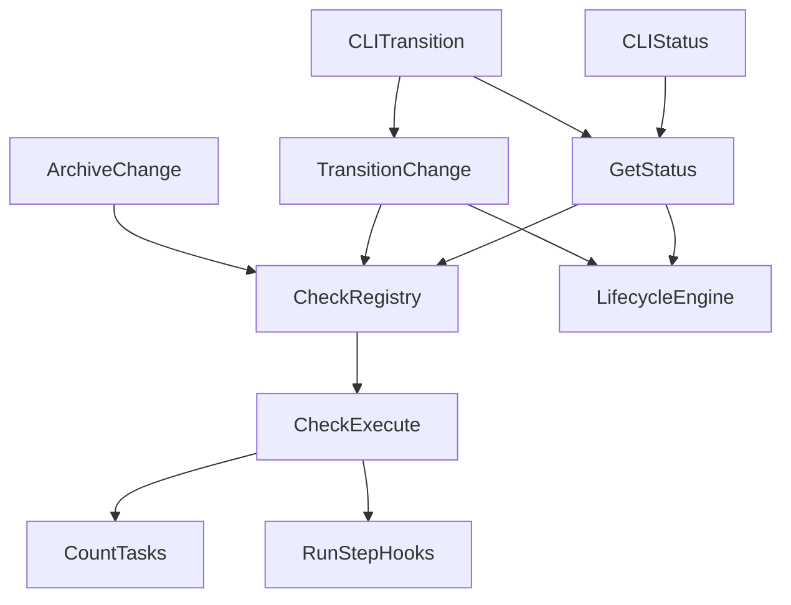

# Design: workflow-transition-checks

## Objectives and expected outcomes

Status (`GetStatus` / `specd changes status`), repair guides (`specd changes transition` failure), and execute (`TransitionChange` / `ArchiveChange`) MUST answer “may this change move?” with one evaluation.

After this change:

- `availableTransitions` excludes targets whose blocking **predicates** fail (including incomplete tasks, enter-`ready` deps/readOnly, **forward** exit-`implementing` impl integrity).
- `validTransitions` remains the `VALID_TRANSITIONS` list (protocol).
- In `implementing`, when gated tasks are complete and `verifying` is allowed, `nextAction.target` is `verifying` and `command` is `/specd-verify`. When tasks are incomplete, target stays `implementing` / `/specd-implement`.
- Same exit-hop pattern: `designing` + `ready` available → `target: ready` / `/specd-design`; `verifying` + `done` available → `target: done` / `/specd-verify`.
- `done` / `signed-off` / `archivable` list `implementing` and `verifying` in `availableTransitions`. Happy-path `nextAction` stays forward: `done`/`signed-off` → `archivable` + `/specd-verify`; `archivable` → `archiving` + `/specd-archive`.
- `TransitionChange` MUST NOT CountTasks or re-walk `requires` after a green evaluation of the same attempt. Failed predicates map to existing `InvalidStateTransitionError` reasons. `CountTasks` runs inside `workflow.taskCompletion.execute`, not as a use-case gather step. `GetStatus` MUST NOT call `CountTasks` a second time or take it as a constructor gatherer. Public `blockers` MUST include failed requires and approval predicates.
- `ValidateArtifacts` and `GetArtifactInstruction` call `evaluate` with empty `checksByTarget` (`projectArtifacts` / `nextArtifact` only). Hop consumers (`GetStatus`, `TransitionChange`, `ArchiveChange`) execute matching predicates then evaluate. No `gatherPredicateSnapshots`.
- `implementing → verifying` fails on open tracked impl files (`impl.filesResolved`) using the same runner as archive. `implementing → designing` (`along = redesign`) MUST NOT run `impl.*`.
- `designing → ready` fails on readOnly specs and extracted vs persisted `dependsOn` mismatch using the same runners as archive.
- `run:` source.post executes only when `along === 'forward'`. `--skip-hooks` skips effects only.

- `GetStatus.lifecycle` copies engine `availableSteps`. When `requestedTarget` includes `workflow.requires` results, engine blockers do not dual-write `MISSING_ARTIFACT`. Unknown `workflow[].step` is `SchemaValidationError` at `buildSchema`. Delete unused `executeHookEffect` / `shouldExecuteHookEffect`. `applyBindingSpecs` throws `InvalidInputError`.

## Non-goals

- `transition --dry-run`, `status --target`, or any new CLI flag for dry-run.
- Omitting `implementing` from schema YAML as a **graph** change (`ready → verifying` as a new shipped edge). Living copy MUST already say that omitting a `workflow[]` row does **not** delete the protocol state.
- Binding `spec.overlap` to enter-`ready`.
- Treating review/drift as a new per-edge check id (review blockers stay as today, then fold into `nextAction`).
- Listing check ids in schema YAML.
- Any-state → any-previous graph.
- New hops: `archivable → done`, hops to `ready`, hops from `archiving` except `archivable` and `designing`.
- Binding `archive.publication` as a registry check (merge/publish preflight stays in `ArchiveChange`).
- Binding `approval.signoff` to archive.
- Binding `impl.*` to `to = verifying`.
- Binding `approval.spec` with `along = any`.
- Changing human `approve spec` / `approve signoff` **commands** beyond recording consent in `ready`/`done` (drain from pending remains).
- Skill template entry-state rewrites (`specd-implement` / `specd-verify`).
- Rewriting historical ADRs under `docs/adr/`.
- New error codes. Reuse `INVALID_TRANSITION`, `INCOMPLETE_TASKS`, `INCOMPLETE_ARTIFACT`, `APPROVAL_REQUIRED`, `SchemaMismatchError`, `ReadOnlyWorkspaceError`, `SpecOverlapError`, `ArchiveDependencyMismatchError`, `ArchiveImplementationStateError`, `ArchivePreflightError`, `ArchiveArtifactMissingError`, `HookFailedError`.
- Schema-std YAML shape changes.

## Scope

Packages: `@specd/core`, `@specd/cli` (status/transition/approve rendering), `@specd/skills` (workflow `.tpl` sources and `template-workflow` tests), and **living documentation** listed under Docs.

## Assumptions

- Approvals remain `specd.yaml` booleans (`approvals.spec`, `approvals.signoff`), default false.
- Schema `workflow[]` is a lookup table of extras (`requires` / `requiresTaskCompletion` / `hooks`) on existing `ChangeState` names. It does not add, remove, or own protocol membership. `VALID_TRANSITIONS` stays the machine. `classifyAlong` uses listed known states then splices missing delivery steps by `AXIS_FALLBACK` index (`buildAxis`).
- `CountTasks`, `detectSpecOverlap`, `change.assertArchivable()`, implementation tracking on `Change`, and archive publication preflight already exist. This change shares the named runners. Publication preflight stays in `ArchiveChange` (not a registry check).

## Constraints and rules (global)

- Matcher, `classifyAlong`, and optional private `runRule` helpers in domain MUST NOT perform I/O. Application `WorkflowCheck.execute` performs that check’s I/O through constructor ports. There is no shared snapshot bag.
- ESM, named exports only, no `any`, JSDoc on public symbols (`default:_global/docs`).
- Existing blocker codes and CLI exit codes (1 invalid transition, 2 hook failure) stay.

## Architecture decisions

**Single attempt evaluation.** For each candidate `(from, to)` or for operation `archive`, classify `along` (transitions only), attach matching checks in registry order, run `check.execute(ctx)` for matching predicates, set `allowed` iff no blocking predicate failed (`skip` is not a failure). Effects run only on execute after `allowed`, via matching effect `execute`.

**No pending routing.** `_resolveTarget` MUST NOT rewrite `implementing` → `pending-spec-approval` or `archivable` → `pending-signoff`. `approval.spec` / `approval.signoff` are predicates on the **requested delivery edge**. When they fail, the change stays in `ready` / `done`. Pending states remain drain-only for in-flight changes.

**Shared runners.** `deps.consistent` and `workspace.readOnly` are one check class each (one `create*`), bound to enter-ready **and** operation `archive`. `impl.filesResolved` and `impl.linksInScope` are one class each, bound to exit-implementing **and** archive. Do not copy archive private methods.

**No third use case.** Do not add `EvaluateTransition`. `GetStatus` and `TransitionChange` both: `registry.predicates(attempt)` → `execute` → `LifecycleEngine` projects from `CheckResult`s. `ArchiveChange` uses `registry` with operation `archive`.

**Check ABI.** Each check is `create*(deps)` returning a `WorkflowCheck`-compatible instance. Bindings reference those instances. Use cases MUST NOT `switch` on `CheckId` to gather facts, skip effects, or launch hooks. Mapping a failed predicate id to an existing typed error is allowed. `CheckId` MAY be a closed TypeScript union of built-ins.

**Binding table owns pipeline slot and failure policy.** `CheckBinding` carries `phase` (`before-persist` | `after-persist`) and `onFailure` (`abort` | `collect`) for effects. Use cases open those slots around persist and iterate matching bindings, then `check.execute(ctx)`. They MUST NOT branch on `check.id === 'hook.pre'` / `'hook.post'` to decide timing, fail-soft, skip, or to call `RunStepHooks`. Applicability is declared **once**. Rejected alternative: two archive operations in the table. Rejected: encoding persist in the domain. Rejected: `PredicateSnapshots` / closed `needs[]` / `gatherPredicateSnapshots` / engine `check.run` snapshot fallback.

**This branch is the engine.** `main` still gather-then-evaluates. Remaining work is to delete the bag, not document it.

## System boundaries

```
CLI / skills  →  GetStatus | TransitionChange | ArchiveChange | ValidateArtifacts | GetArtifactInstruction
                         →  registry.predicates / registry.effects
                         →  check.execute(ctx)   (WorkflowCheck; ports in create*)
                         →  LifecycleEngine.project (from CheckResults)
                         ↘  RunStepHooks only from hook.* execute
```

`Change.transition` still enforces `VALID_TRANSITIONS` as the last protocol check inside mutate.

## State model

`VALID_TRANSITIONS` in `packages/core/src/domain/value-objects/change-state.ts` MUST become:

```ts
drafting: ['designing'],
designing: ['ready', 'designing'],
ready: ['implementing', 'designing'],
'pending-spec-approval': ['spec-approved', 'designing'],
'spec-approved': ['implementing', 'designing'],
implementing: ['verifying', 'designing'],
verifying: ['implementing', 'done', 'designing'],
done: ['archivable', 'designing', 'implementing', 'verifying'],
'pending-signoff': ['signed-off', 'designing'],
'signed-off': ['archivable', 'designing', 'implementing', 'verifying'],
archivable: ['archiving', 'designing', 'implementing', 'verifying'],
archiving: ['archivable', 'designing'],
```

`isValidTransition` stays `VALID_TRANSITIONS[from].includes(to)`.

Archive is **not** a pair in this table. `change.assertArchivable()` remains the protocol of the archive operation (`archivable` or `archiving`).

## `along` classification (normative algorithm)

Export `classifyAlong(from: ChangeState, to: ChangeState, workflowSteps: readonly string[]): TransitionAlong` from the new domain module.

`TransitionAlong = 'forward' | 'backward' | 'redesign' | 'recovery' | 'any'`

1. If `from === 'archiving'` and `to === 'archivable'` → `'recovery'`.
2. If `to === 'designing'` and `from !== 'designing'` and `from !== 'drafting'` → `'redesign'`.
3. If `from === 'designing'` and `to === 'designing'` → `'any'`.
4. Else compute **delivery** states:
   - `pending-spec-approval` | `spec-approved` → `'implementing'`
   - `pending-signoff` | `signed-off` → `'archivable'`
   - otherwise the state itself
5. Build **axis**: keep listed names that are `ChangeState`. Splice missing `AXIS_FALLBACK` members (`ready`, `implementing`, `verifying`, `done`, `archivable`, `archiving`) by canonical index so omitted middle states do not invert retry (`verifying → implementing` stays `backward`). Drop unknown strings (they MUST NOT occupy axis slots). If `'drafting'` is absent, treat it as index `-1`. Do **not** insert `designing` as “previous step”.
6. `fromIndex = axis.indexOf(delivery(from))`, `toIndex = axis.indexOf(delivery(to))`. If either is missing, treat as `'any'` (matcher still uses exact `from`/`to` on checks that do not need direction).
7. If `toIndex > fromIndex` → `'forward'`. If `toIndex < fromIndex` → `'backward'`. If equal → `'any'`.

Examples: `ready → implementing` forward; `ready → designing` redesign (rule 2); `verifying → implementing` backward; `done → implementing` backward; `implementing → verifying` forward; `archiving → designing` redesign. Drain hops `pending-spec-approval → spec-approved` remain forward for in-flight changes only.

## Check identity

```ts
export type CheckKind = 'predicate' | 'effect'

/** Built-in ids. The ABI treats `id` as a stable string so a later plugin can add ids without widening this union in use cases. */
export type CheckId =
  | 'protocol.edge'
  | 'workflow.requires'
  | 'workflow.taskCompletion'
  | 'deps.consistent'
  | 'workspace.readOnly'
  | 'impl.filesResolved'
  | 'impl.linksInScope'
  | 'approval.spec'
  | 'approval.signoff'
  | 'schema.nameMatch'
  | 'archive.archivable'
  | 'spec.overlap'
  | 'hook.pre'
  | 'hook.post'

export type CheckOutcome = 'pass' | 'fail' | 'skip'

export interface CheckResult {
  readonly id: CheckId | string
  readonly kind: CheckKind
  readonly outcome: CheckOutcome
  readonly code?: string
  readonly message?: string
  readonly details?: Readonly<Record<string, unknown>>
}

export type CheckAttempt =
  | { readonly scope: 'transition'; readonly from: ChangeState; readonly to: ChangeState }
  | { readonly scope: 'archive' }

export interface CheckExecutionContext {
  readonly change: Change
  readonly schema: Schema
  readonly attempt: CheckAttempt
  readonly approvals: { readonly spec: boolean; readonly signoff: boolean }
  readonly skipHookPhases?: readonly string[]
  readonly allowOverlap: boolean
  readonly allowOutOfScope: boolean
}

export interface Check {
  readonly id: CheckId | string
  readonly kind: CheckKind
  execute(ctx: CheckExecutionContext): Promise<CheckResult>
}
```

`instruction:` hooks NEVER produce `CheckResult`.

### WorkflowCheck and `create*`

`WorkflowCheck` lives in **application** (`packages/core/src/application/checks/workflow-check.ts`). It implements `Check`, exposes `pass` / `fail` / `skip` helpers, and MUST NOT take snapshots, `needs`, or `RunStepHooks` on the base.

Each built-in check:

1. `class FooCheck extends WorkflowCheck` with `readonly id` and `readonly kind`.
2. Constructor deps = **only** ports that `execute` uses.
3. `export function createFoo(deps): Check` returns `new FooCheck(deps)`.

Examples:

```ts
export function createWorkflowTaskCompletion(deps: { countTasks: CountTasks }): Check
export function createHookPre(deps: { runStepHooks: RunStepHooks }): Check
export function createDepsConsistent(deps: { extractDependsOn: ExtractDependsOn }): Check
```

A check MAY keep a private pure `runRule(...)` in domain for unit tests. I/O stays in `execute`. Applicability is **not** on the class.

Composition constructs instances once and passes them into `bind(...)`.

Matcher (`checkMatches`, `classifyAlong`) stays in `transition-checks.ts`. Bindings: `packages/core/src/domain/services/check-bindings.ts` (or application registry that holds `Check` instances + domain applicability rows).

Matcher: a transition check matches when `scope === 'transition'` AND (`from` is `*` or equals attempt.from) AND (`to` is `*` or equals attempt.to — for schema checks `to` is **effective** target) AND (`along` is `*` or equals classified along). Archive checks match only archive attempts.

## Registry order (predicates)

Transition registry (stable order):

1. `protocol.edge` — every transition; fail-fast (later predicates MAY still be computed for status rows but `allowed` is false; implement fail-fast on execute). `to`/`from` exact requested pair against `isValidTransition`. Code `INVALID_TRANSITION`.
2. `workflow.requires` — `to = effective`, `from = *`, `along = *`, skip if no workflow step or empty requires. Fail `INCOMPLETE_ARTIFACT` / existing incomplete-artifact reason fields. **Skip entirely** when along is `recovery`.
3. `workflow.taskCompletion` — `to = effective`, skip if no `requiresTaskCompletion`. Missing capability → `missing-task-capability`. Incomplete → `INCOMPLETE_TASKS`. Skip on `recovery`.
4. `deps.consistent` — `to = ready`, `from = *`, `along = any`.
5. `workspace.readOnly` — `to = ready`, `from = *`, `along = any`.
6. `impl.filesResolved` — `from = implementing`, `to = *`, `along = forward`. MUST NOT match redesign (`implementing → designing`).
7. `impl.linksInScope` — `from = implementing`, `to = *`, `along = forward`. Skippable when `allowOutOfScope === true` (`bypassFlag` `--allow-out-of-scope`). MUST NOT match redesign.
8. `approval.spec` — `from = ready`, `to = *`, `along = forward`. MUST NOT match `ready → designing` (`redesign`). Skip if spec gate off. Gate on + no recorded spec approval → fail `APPROVAL_REQUIRED`; change stays in `ready`. Gate on + recorded approval → pass.
9. `approval.signoff` — `from = done`, `to = archivable`, `along = forward`. MUST NOT bind to archive or `pending-signoff`. Skip if signoff off. Fail `APPROVAL_REQUIRED` until recorded; pass after `ApproveSignoff` while still in `done`.

Archive registry (operation `archive`, not along):

1. `schema.nameMatch`
2. `archive.archivable`
3. `spec.overlap` — skippable `--allow-overlap` (`allowOverlap` true → skip fail, existing invalidation side effects stay in `ArchiveChange` after predicates, not in the engine)
4. `workspace.readOnly` (same runner)
5. `deps.consistent` (same runner)
6. `impl.filesResolved` (same runner)
7. `impl.linksInScope` (same runner, skippable `--allow-out-of-scope`)

Remaining merge/publish preflight stays **inside** `ArchiveChange` after these predicates allow the operation. Do not register `archive.publication`.

`protocol.edge` is N/A for archive.

## Effects registry

Effect bindings add two fields on `CheckBinding` (not on the check module):

```ts
export type CheckApplicability =
  | {
      readonly scope: 'transition'
      readonly from: ChangeState | '*'
      readonly to: ChangeState | '*'
      readonly along: TransitionAlong | '*'
    }
  | { readonly scope: 'archive' }

export type EffectPipelinePhase = 'before-persist' | 'after-persist'
export type EffectOnFailure = 'abort' | 'collect'

export interface CheckBinding {
  readonly check: Check
  readonly applicability: readonly CheckApplicability[]
  readonly reportSkipWhenUnmatched?: boolean
  readonly exceptAlong?: readonly TransitionAlong[]
  readonly phase?: EffectPipelinePhase
  readonly onFailure?: EffectOnFailure
}
```

Predicates omit `phase` / `onFailure` (evaluate before any persist). Effects MUST set both.

- Transition `hook.post`: `from = *`, `to = *`, `along = forward`; `phase = before-persist`; `onFailure = abort`
- Transition `hook.pre`: `from = *`, `to = *`, `along = *` except `recovery`; `phase = before-persist`; `onFailure = abort`
- Archive `hook.pre`: `{ scope: 'archive' }`; `phase = before-persist`; `onFailure = abort`
- Archive `hook.post`: `{ scope: 'archive' }`; `phase = after-persist`; `onFailure = collect`

`--skip-hooks` / `skipHookPhases` filters effects only.

Helper used by both use cases (application, next to `execute-hook-effect.ts`):

```ts
function matchingEffects(
  bindings: readonly CheckBinding[],
  attempt: CheckAttempt,
  phase: EffectPipelinePhase,
): readonly CheckBinding[]
```

Filter: `isEffectCheck`, `bindingMatches(attempt)`, `binding.phase === phase`. Then `binding.check.execute(ctx)`. On failure: `onFailure === 'abort'` throw `HookFailedError`; `'collect'` push onto the result list. Use cases MUST NOT call `RunStepHooks` except inside hook check `execute`.

Transition execute when predicates pass (single slot `before-persist`):

1. Iterate `matchingEffects(transitionBindings, attempt, 'before-persist')` in registry order (post then pre). Honour skip flags using binding `phase` (and `source.post` / `target.pre` / `all` selectors). `TransitionChange` MUST NOT default `transitionBindings` to domain stub `TRANSITION_BINDINGS`.
2. `ChangeRepository.mutate` with invalidation + `change.transition(effectiveTarget, actor)`.

Archive execute:

1. Predicates 1–7.
2. Remaining publication preflight **in the use case** (not a check).
3. `matchingEffects(ARCHIVE_BINDINGS, { scope: 'archive' }, 'before-persist')` — abort on fail; skip via `'pre'`/`'all'` mapped to `phase`, not check id.
4. Existing commit pipeline.
5. `matchingEffects(..., 'after-persist')` — collect on fail; skip via `'post'`/`'all'`.

Do not run transition `hook.post` on backward, redesign, or recovery (`along` filter).

## Per-check I/O (no snapshot bag)

Do **not** add `PredicateSnapshots` or `gatherPredicateSnapshots`. Each `create*` receives that check’s ports. Flags (`allowOverlap`, `allowOutOfScope`, `skipHookPhases`) live on `CheckExecutionContext`.

Where I/O lives:

- `workflow.taskCompletion`: `CountTasks` in `createWorkflowTaskCompletion`
- `deps.consistent`: extract vs persisted dependsOn (enter-ready: vs `change.specDependsOn`; archive: existing sidecar `finalDependsOn`). Skip spec when extract undefined
- `workspace.readOnly`: `SpecRepository.ownership()`
- `impl.filesResolved`: `change.trackedImplementationFiles` open
- `impl.linksInScope`: shared detector extracted from ArchiveChange (callable without publishing)
- `approval.*`: recorded facts on `change` + schema gates
- `hook.pre` / `hook.post`: `RunStepHooks` in `createHookPre` / `createHookPost`

Publication preflight I/O stays in `ArchiveChange` after predicates, not in a check `execute`.

`deps.consistent` fail → throw/map `ArchiveDependencyMismatchError` at archive; at transition throw `InvalidStateTransitionError` with message listing spec ids and extracted vs persisted arrays. Status blockers MUST use `code: 'INCOMPLETE_ARTIFACT'` only for requires.

**Decision:** status `Blocker.code` values:

- deps: `'DEPS_INCONSISTENT'`
- readOnly: `'READ_ONLY_WORKSPACE'`
- impl open: `'IMPLEMENTATION_STATE'` — text `message` is count + at most three paths (`examples:` when truncated); full list in `details.files`; **not** skippable with `--allow-out-of-scope`
- impl scope: `'IMPLEMENTATION_STATE'` (skippable, `bypassFlag: '--allow-out-of-scope'` only when check id is `impl.linksInScope`)

Blocker projection in `LifecycleEngine` / `GetStatus` MUST key skippable + `bypassFlag` off **check id**, not the shared error code alone.

These codes already exist on typed errors; exposing them on GetStatus blockers is required for honest status. If a test snapshot freezes blocker unions, extend the union.

Throws on TransitionChange: keep `InvalidStateTransitionError` for protocol/requires/tasks/approval; throw `ReadOnlyWorkspaceError`, `ArchiveDependencyMismatchError`, `ArchiveImplementationStateError` for those shared checks (enter-ready and exit-implementing). CLI transition: catch those errors, exit 1, print Repair Guide from GetStatus.

## New constructs

Each check id is its own module under `packages/core/src/application/checks/` (or `domain/checks` for a private `runRule` + application class that `create*` returns). Engine wiring: `check-bindings.ts`. Matcher/types: `transition-checks.ts`. Registry: `predicates(attempt)` / `effects(attempt, phase)` over bound **instances**.

`Check.kind` is required (`'predicate' | 'effect'`). `isEffectCheck` is `check.kind === 'effect'`.

### Shared module `packages/core/src/domain/services/transition-checks.ts`

- `classifyAlong`
- `checkMatches(applicability, attempt)`
- `CheckApplicability` / `CheckBinding` (binding holds a `Check` instance, not an id lookup in the use case)

Engine bindings own `from` / `to` / `along`, `{ scope: 'archive' }`, and for effects `phase` / `onFailure`. Use cases attach matching **predicate** bindings and call `check.execute(ctx)`. Domain `run` takes **that check’s facts only**. Optional `runRule` helpers stay in the check’s file for unit tests.

Do not keep a second copied binding table. Do not export `PredicateSnapshots`. Publication is not a check.

### `packages/core/test/domain/services/transition-checks.spec.ts`

Matcher, `classifyAlong`, binding `kind` / `phase` / `onFailure`. Factory tests live next to each check.

### Types on `LifecycleVerdict`

Add `readonly checks: readonly CheckResult[]` for the happy-path candidate used by nextAction **plus**:

```ts
readonly checksByTarget: Readonly<Partial<Record<ChangeState, readonly CheckResult[]>>>
```

GetStatus copies `checksByTarget` onto `LifecycleContext`. `LifecycleEngine` consumes already-executed `CheckResult`s (or a thin `project` API). It MUST NOT require `PredicateSnapshots`.

### Composition

`packages/core/src/composition/use-cases/` (GetStatus / TransitionChange / ArchiveChange) call every `create*` with that check’s ports and pass instances into `bind`. Delete `gather-predicate-snapshots.ts` once this lands.

## Affected areas

### `VALID_TRANSITIONS` / `isValidTransition`

`packages/core/src/domain/value-objects/change-state.ts`

Change: remove `pending-spec-approval` from `ready` and `pending-signoff` from `done`; add skill-aligned hops on `done` / `signed-off` / `archivable` as listed in State model. Pending states keep drain-only outgoing edges.

Callers: `packages/core/src/domain/services/lifecycle-engine.ts`, `packages/core/src/application/use-cases/get-status.ts` (fallback VALID_TRANSITIONS on schema fail stays protocol-only), `packages/core/src/infrastructure/fs/manifest-change-loader.ts`, `change-repository.ts`, `run-step-hooks.ts`, `get-hook-instructions.ts`, `build-schema.ts` (valid state set). Risk: **HIGH** (public export `packages/core/src/public.ts`). Tests: `packages/core/test/domain/value-objects/change-state.spec.ts` currently expects `archivable: ['archiving', 'designing']` — update.

### `ApproveSpec` / `ApproveSignoff`

`packages/core/src/application/use-cases/approve-spec.ts`, `approve-signoff.ts`

From `ready` / `done`, record consent and **stay in that state**. Do not call `TransitionChange` into pending. Drain: still allow `pending-spec-approval` → `spec-approved` and `pending-signoff` → `signed-off` for in-flight changes.

CLI: `packages/cli/src/commands/change/` approve commands; tests must not require pending as the only valid source.

### `LifecycleEngine.evaluate` / `_nextAction` / `availableTransitions` filter

`packages/core/src/domain/services/lifecycle-engine.ts`

Change: `LifecycleEngine` projects from predicate `CheckResult`s (no `snapshots` option). Replace `availableTransitions` filter that only uses `isReady`/`isPermitted` with predicate `allowed` per target. Keep `availableSteps` but derive `isReady`/`isPermitted` from the same requires/protocol predicates so CompileContext consumers do not lie.

`_nextAction` in `implementing`: if `availableTransitions.includes('verifying')` → `target: verifying`, command `/specd-verify`; else `target: implementing`, `/specd-implement`.

Same pattern for other skill-owned exit hops:

- `designing` / `drafting`: if `ready` available → `target: ready`, `/specd-design`; else `target: designing`, `/specd-design`.
- `verifying`: if `done` available → `target: done`, `/specd-verify`; else stay `verifying` / `/specd-verify`.
- `done` / `signed-off` (signoff satisfied): `target: archivable`, `/specd-verify` (not archive CLI).
- `archivable`: `target: archiving`, `/specd-archive`.

Do not recommend backward hops as default `nextAction` from `done` / `archivable`.

`done` / `signed-off` / `archivable`: if review required, keep `/specd-design`. Else keep existing archive commands. If signoff gate on and not recorded, recommend `changes approve signoff`. Do **not** pick implementing because it is now available.

`ready`: if spec gate on and not recorded, recommend `changes approve spec`, not `/specd-implement` and not a pending hop.

Risk: **HIGH** (GetStatus, TransitionChange, ValidateArtifacts, CompileContext). Tests: `packages/core/test/domain/services/lifecycle-engine.spec.ts`.

### `GetStatus._buildActiveResult`

`packages/core/src/application/use-cases/get-status.ts`

Change: for each `VALID_TRANSITIONS[state]`, `registry.predicates(attempt)` then `execute(ctx)`. Pass `checksByTarget` into engine project. Copy `availableTransitions` / `nextAction` / blockers including failed predicates. Extend `LifecycleContext` with `checksByTarget`. Constructor + `GetStatusDeps` + `resolveGetStatusDeps` wire the `create*` ports (CountTasks, extract, ownership, impl detector) — **into check factories**, not a gather helper.

Remove constraint of evaluate-then-CountTasks (lines ~335–374). Remove `gatherPredicateSnapshots`.

Tests: `packages/core/test/application/use-cases/get-status.spec.ts` — cases that compared `availableTransitions` to raw `VALID_TRANSITIONS['designing']` remain valid if designing has no extra predicate fails; add implementing incomplete-tasks case.

### `TransitionChange.execute`

`packages/core/src/application/use-cases/transition-change.ts`

Change: `allowOutOfScope` on `CheckExecutionContext`. For `requestedTarget: input.to`, execute matching predicates. If `!allowed`, map first failed predicate to throw. Remove post-evaluate requires/task loops. `along` for effects uses `fromState` → **requested** `input.to` (no pending rewrite). `implementing → designing` redesign → no implementing.post.

Invalidation inside mutate:

- redesign (`to designing` from later state): existing invalidate approvals + downgrade files
- `verifying → implementing`: existing preserve artifacts
- `done|signed-off|archivable → implementing|verifying`: invalidate **signoff only** (`change.invalidateSignoff` or equivalent existing API). If only combined invalidate exists, add `invalidateSignoff(actor)` on `Change` that clears signoff without artifact downgrade and without spec approval clear. **Must not** call full `invalidate()`.
- recovery: no requires, no source.post

Tests: `packages/core/test/application/use-cases/transition-change.spec.ts` (create if coverage is spread).

Composition: `packages/core/src/composition/use-cases/transition-change.ts` — same `create*` wiring as GetStatus.

### `ArchiveChange`

`packages/core/src/application/use-cases/archive-change.ts`

Change: after predicates (`execute` on matching archive predicates including publication), run `matchingEffects(..., 'before-persist')` then `check.execute`, then commit, then `matchingEffects(..., 'after-persist')`. Do not filter by `hook.pre` / `hook.post` ids. Overlap invalidation stays in the use case when `allowOverlap`.

### `RunStepHooks` / hook selection

If `TransitionChange` currently always runs source.post, gate with `classifyAlong` **on the binding**. `RunStepHooks` is a constructor dep of `createHookPre` / `createHookPost` only.

### CLI

`packages/cli/src/commands/change/status.ts` (or `change-status.ts`): render `lifecycle.availableTransitions` and `nextAction` from GetStatus only.

`packages/cli/src/commands/change/transition.ts`: Repair Guide from GetStatus after failure; catch new typed errors. Tests: `packages/cli/test/commands/change/change-status.spec.ts`, `change-transition` tests.

### Skills

SoT is `packages/skills/templates/**/*.tpl`, not installed copies under `.claude/skills`. Rewrite:

- `templates/skills/specd/SKILL.md.tpl` — router only; MUST NOT teach spec/signoff gates (those live in the hop-owning skills and `shared.md.tpl`).
- `templates/skills/specd-verify/SKILL.md.tpl` — stay in `done`; human `approve signoff`; this skill still owns `done → archivable`. MUST NOT mention `pending-signoff`. Owns `implementing → verifying`: drain open tracked files (`IMPLEMENTATION_STATE`) via shared tracking commands; do not bounce to `/specd-implement` solely for open files.
- `templates/skills/specd-implement/SKILL.md.tpl` — MUST NOT `transition implementing` from `ready` while spec gate is on and unsatisfied. Stop for human `approve spec`. MUST NOT recommend `/specd-verify` while any tracked implementation file is still `open`. Links: top-level `--symbol` that realizes the spec; not variables or catch-all dumps.
- `templates/shared/shared.md.tpl` — wait is stay-in-`ready`/`done`; pending = drain only; hook pass-through MUST NOT list pending as happy-path intermediates; skip+manual MUST NOT run `source.post` on backward/redesign/recovery. Canonical `changes implementation` list/resolve/ignore/add cookbook (verify/implement point here).
- `templates/skills/specd-new/SKILL.md.tpl` — `pending-*` rows drain-only; `ready`/`done` + unsatisfied gate → approve command.
- `templates/skills/specd-design/SKILL.md.tpl` — after `ready`, stay there for spec gate; stop for human `approve spec`.
- `templates/skills/specd-archive/SKILL.md.tpl` — `--skip-hooks pre` on archive so post `run:` execute inside `ArchiveChange`; do not `run-hooks archiving --phase post` after success.

Tests: `packages/skills/test/template-workflow.spec.ts` — assert absence of happy-path parking copy.

After the `.tpl` rewrites and those tests, run `pnpm specd project update` so installed skill copies for agents declared in `specd.yaml` pick up the new templates. Do not treat `.claude/skills` as the source of truth.

### Docs (in this change — required)

Every living page that teaches the lifecycle, transition graph, approval gates, or related CLI **must** match the in-place check model. Narrative to write wherever approvals appear:

- Happy path: `drafting → designing → ready → implementing ⇄ verifying → done → archivable → archiving`.
- Optional gates: the change **stays in `ready` / `done`**. `specd changes approve spec|signoff` records consent. Then the same `ready → implementing` / `done → archivable` edge is allowed. **Do not** document `change transition` into `pending-spec-approval` / `pending-signoff` as the wait.
- `pending-*` / `spec-approved` / `signed-off` may be mentioned only as **drain** states for in-flight changes, not as the current product path.
- Skill-aligned hops: `done` / `signed-off` / `archivable` → `implementing` / `verifying`.
- `availableTransitions` is check-derived (tasks, enter-ready, exit-implementing, approval delivery), not protocol-only.
- Post `run:` hooks: `along = forward` only (if the page describes hook timing).

**Must update:**

| File                                                   | What to change                                                                                                                                                                                                                                                                                                                                                                          |
| ------------------------------------------------------ | --------------------------------------------------------------------------------------------------------------------------------------------------------------------------------------------------------------------------------------------------------------------------------------------------------------------------------------------------------------------------------------- |
| `docs/guide/workflow.md`                               | State diagram, per-state “transition out”, approval-gates section, transition table. Remove pending as the happy-path wait. Opening “The workflow is the rules” MUST NOT say the schema defines which states exist or which transitions are valid — that is `ChangeState` / `VALID_TRANSITIONS`. `workflow[]` only attaches extras.                                                     |
| `docs/guide/schemas.md`                                | Opening: schema declares artifacts and extras on named states; it does not invent or delete lifecycle states.                                                                                                                                                                                                                                                                           |
| `docs/guide/_sections/getting-started/lifecycle.md`    | Approval-gates paragraph (today invents a compliance check / violation report). Human approve in place.                                                                                                                                                                                                                                                                                 |
| `docs/guide/configuration.md`                          | `approvals.spec` / `signoff` rows: blocked until `approve`, not pending hops.                                                                                                                                                                                                                                                                                                           |
| `docs/config/config-reference.md`                      | Same `approvals` table.                                                                                                                                                                                                                                                                                                                                                                 |
| `docs/config/examples/approvals-and-workflow-hooks.md` | Replace `ready → pending-spec-approval → spec-approved → implementing` with stay-in-ready + approve + `ready → implementing`.                                                                                                                                                                                                                                                           |
| `docs/cli/cli-reference.md`                            | `change approve spec/signoff`: valid from `ready`/`done`; does not move to pending. `change transition`: no silent routing to pending.                                                                                                                                                                                                                                                  |
| `docs/core/domain-model.md`                            | `ChangeState` graph, `VALID_TRANSITIONS` table and `VALID_TRANSITIONS['done']` example (hops; no pending from ready/done). Drain-only note for parking states.                                                                                                                                                                                                                          |
| `docs/core/use-cases.md`                               | `GetStatus.availableTransitions`; `TransitionChange` no redirect to pending; `ApproveSpec`/`ApproveSignoff` stay in ready/done.                                                                                                                                                                                                                                                         |
| `docs/core/errors.md`                                  | Examples that assume pending is the wait state.                                                                                                                                                                                                                                                                                                                                         |
| `docs/core/overview.md`                                | Any graph / `VALID_TRANSITIONS` blurb.                                                                                                                                                                                                                                                                                                                                                  |
| `docs/schemas/schema-format.md`                        | `workflow` is lookup rows on existing states; order is display + `along` axis (fallback steps still classify). MUST NOT say `workflow` defines the sequence of states a change occupies. Fix `taskCompletionCheck` if it still says the **implementing** step’s `requires` gates `implementing → verifying` — gating is `workflow.taskCompletion` on the **target** step (`verifying`). |
| `packages/specd/README.md` and root `README.md`        | Lifecycle diagram and approval checkpoints without pending hops. Optional: skill-aligned hops in one sentence.                                                                                                                                                                                                                                                                          |

**Touch only if still wrong after the files above:** `docs/guide/getting-started.md` (if it inlines lifecycle), `docs/config/examples/single-repo-minimal.md` (leave if it already says free `ready → implementing`).

**Out of documentation scope:** `docs/adr/**` (historical). `packages/specd/CHANGELOG.md` (append only when this change ships, if that process requires it). Installed copies under `.claude/skills` (regenerated from templates).

Implementer MUST grep `docs/`, root `README.md`, and `packages/specd/README.md` for `pending-spec-approval`, `pending-signoff`, `silently routed`, `availableTransitions`, `workflow-visible`, `selects which states`, `defines which states exist`, and `sequence of steps a change follows` after the edits and fix remaining living hits. Leave `docs/adr/**` historical.

### Tests that freeze graphs

`packages/core/test/domain/value-objects/change-state.spec.ts`

Any fixture listing archivable targets.

## Approach (execution flows)

### GetStatus (schema OK)

1. Load change, optional impl refresh (existing).
2. For each `VALID_TRANSITIONS[state]`, `registry.predicates(attempt)` → sequential `execute(ctx)` (`allowOverlap: false`, `allowOutOfScope: false`).
3. `lifecycle.project(change, schema, { approvals, checksByTarget })`.
4. Paint `taskCompletion` from `workflow.taskCompletion` result details (do not CountTasks again in GetStatus).
5. Merge review blockers + failed predicates of the **nextAction** candidate into `blockers`.
6. Schema failure path unchanged (validTransitions static, availableTransitions `[]`).

### TransitionChange

1. Refresh impl tracking (existing default).
2. Matching predicates `execute` for `input.to`.
3. If protocol fail → `InvalidStateTransitionError` invalid-transition.
4. If other predicate fail → typed error or InvalidStateTransitionError as specified.
5. Emit existing `requires-check` / `task-completion-failed` progress from check results (do not re-read files in the use case).
6. `matchingEffects` for `before-persist`, each `check.execute`, then mutate.

### ArchiveChange

1. Load change, schema.
2. Matching archive predicates `execute` (flags on ctx).
3. Domain-equivalent archive predicates 1–7 + publication check; throw on fail (overlap allowOverlap: skip throw, run invalidation).
4. `before-persist` effects (`onFailure` from bindings; default abort) via `execute`.
5. Existing commit pipeline.
6. `after-persist` effects (`onFailure` collect for `hook.post`).

## Public APIs

Export from `packages/core/src/public.ts` / domain index: `classifyAlong`, `CheckResult`, `CheckId`, `Check`, `WorkflowCheck` (if tests/CLI need the class). Do not export `PredicateSnapshots`. Do not export internal registry arrays if not needed.

`GetStatusResult.lifecycle` gains `checksByTarget`. CLI structured output includes it (toon/json). Text mode MAY omit full check rows; MUST use check-derived availableTransitions/nextAction.

## Error handling

| Predicate               | Throw (execute)                                                            | Status blocker code                    |
| ----------------------- | -------------------------------------------------------------------------- | -------------------------------------- |
| protocol.edge           | InvalidStateTransitionError `invalid-transition`                           | INVALID_TRANSITION                     |
| workflow.requires       | InvalidStateTransitionError `incomplete-artifact`                          | INCOMPLETE_ARTIFACT / MISSING_ARTIFACT |
| workflow.taskCompletion | InvalidStateTransitionError `incomplete-tasks` / `missing-task-capability` | INCOMPLETE_TASKS                       |
| approval.\*             | InvalidStateTransitionError `approval-required` / `gate-not-required`      | APPROVAL_REQUIRED / INVALID_TRANSITION |
| deps.consistent         | ArchiveDependencyMismatchError                                             | DEPS_INCONSISTENT                      |
| workspace.readOnly      | ReadOnlyWorkspaceError                                                     | READ_ONLY_WORKSPACE                    |
| impl.\*                 | ArchiveImplementationStateError                                            | IMPLEMENTATION_STATE                   |
| schema.nameMatch        | SchemaMismatchError                                                        | (archive)                              |
| archive.archivable      | InvalidStateTransitionError                                                | INVALID_TRANSITION                     |
| spec.overlap            | SpecOverlapError                                                           | OVERLAP_CONFLICT                       |
| hooks                   | HookFailedError                                                            | (execute only)                         |

## Edge cases

- Gate off: `approval.*` skip; requesting `pending-spec-approval` from `ready` is `INVALID_TRANSITION` (not in `VALID_TRANSITIONS`). Drain: `ApproveSpec` from `pending-spec-approval` still moves to `spec-approved`.
- Empty tasks file: CountTasks omits artifact → taskCompletion skip (existing).
- `designing → designing`: along any; no invalidation; designing.pre may run (onEnter any).
- Concurrent mutate: still `ChangeRepository.mutate`.
- GetStatus `unchanged` short-circuit: do not execute checks (existing).

## Concurrency / consistency

Same as today: status is a read; transition/archive serialize via mutate. Check `execute` can race with disk; accept the same race as current CountTasks.

## Performance

GetStatus in `implementing` runs `workflow.taskCompletion.execute` (CountTasks) + impl checks when those bindings match. Enter-ready candidates run deps/readOnly checks when `to = ready` matches. Matcher already skips unmatched checks — no central gather optimizer required. Archive always runs archive bindings.

## Configuration / flags

No new specd.yaml keys. Existing `--allow-overlap`, `--allow-out-of-scope`, `--skip-hooks`.

## Migration / rollback

Additive graph edges. Rollback = revert commit. No persisted manifest version bump. Old agents that refuse done-state implement skill still can `changes transition`; templates fix the dead-end.

## Backward compatibility

Public `VALID_TRANSITIONS` values change (more targets). Callers that snapshot exact arrays must update. `LifecycleEngine.evaluate` MUST NOT take `PredicateSnapshots`. In-repo callers execute checks then project. No silent skip of task gating.

## Observability

Keep `LifecycleEngine` debug log; add `along`, `allowed`, `failedCheckIds`. Archive debug already logs guards.

## Security

Unchanged: hook commands still escaped via HookRunner; readOnly still blocks writes.

## Spec impact

### `core:change`

Dependents include lifecycle-engine, get-status, transition-change, archive-change, CLI. Graph extension is explicit. Overlap: change `implementation-snapshot` also lists `core:change` — archive collision possible; do not silently merge.

### `core:lifecycle-engine`

Dependents: get-status, transition-change, compile-context, validate-artifacts. Signature + availability semantics.

### `core:get-status`

CLI status/transition. Check `execute` I/O.

### `core:transition-change`

CLI transition, skills.

### `core:workflow-model`

Axis meaning; CompileContext display order unchanged.

### `core:archive-change`

Shared runners; not first failure for readOnly/deps/open impl after implementing. **Constructor:** required `archiveBindings` only — no `RunStepHooks` argument and no `defaultArchiveBindings` fallback on the use case. Composition owns the registry (`createHook*` still takes `RunStepHooks`).

### `core:schema-format`

`artifacts[].requires` feeds `LifecycleEngine.projectArtifacts` / `Schema.artifactDag()`. Incomplete / `in-progress` parent → dependent `in-progress`. Review parent (`pending-review` / `drifted-pending-review` / `pending-parent-artifact-review`) → dependent `pending-parent-artifact-review`. Do not document `Change.effectiveStatus()`. **`core:storage` is in this change** and MUST use the same engine cascade (no `Change.effectiveStatus()`).

### `core:hook-execution-model`

Post along=forward. Numbered archive example: `hook.pre` execute before persist (abort), `hook.post` execute after persist (collect). `RunStepHooks` is inside those checks, not an `ArchiveChange` constructor argument.

### `cli:change-status` / `cli:change-transition`

Projections only. `--next` is `to: 'next'` in Core (happy-path next state). CLI MUST NOT keep a from→to table. Not `GetStatus.nextAction`.

**Text `review:`:** print `required` / `route` / `reason` when `review.required` is true. Do not list `affectedArtifacts` (already in `artifacts (details):` as `pending-review` / `[drift]`). Keep overlap peers in text when `reason` is `spec-overlap-conflict`. JSON/TOON keep the full `review` object including `overlapDetail`. Commander help schema MUST list `overlapDetail`. Examples MUST NOT include a standalone `specs:` list.

**`IMPLEMENTATION_STATE` message:** count + at most three paths/examples; label `examples:` when truncated. Applies to both `impl.filesResolved` and `impl.linksInScope`. Full list in structured `details` / CLI — not text blockers. Do not compact `DEPS_INCONSISTENT` / `READ_ONLY_WORKSPACE`.

### `core:storage`

Load-time file status stays hash-derived. DAG cascade is `LifecycleEngine.projectArtifacts`. No `Change.effectiveStatus()`.

### Generic check progress bus (all checks)

Every `Check` declares mandatory gerund `label` (see transition-checks table). `CheckExecutionContext.onCheckProgress` is the sink.

`TransitionChange` / `ArchiveChange` wrap each matching `execute`:

1. emit `check-start { id, label }`
2. call `execute(ctx)` (check may emit `check-progress`)
3. emit `check-done { id, label, outcome, reason? }`

Replace public `OnHookProgress` / hook-only CLI contract with mapping inside `hook.pre`/`hook.post` → `check-progress`. Keep `RunStepHooks` internals; change the envelope only.

CLI (`change transition`, `change archive`): one presenter for the bus. Text:

```text
Checking implementation links (impl.linksInScope)
✓ Checking implementation links

Running post hooks (hook.post)
  …hook stdout…
✓ Running post hooks
```

`GetStatus`: no live stream; `checksByTarget` rows include `label`. Blockers from failed predicates include `label` + `checkId`. CLI text:

```text
! DEPS_INCONSISTENT — Checking spec dependencies: Extracted dependsOn disagrees with persisted values for: cli:change-archive
```

Review-only blockers (no check) stay `! CODE: message`.

### Actionable fail diagnostics

`deps.consistent` today only lists mismatched spec ids — insufficient. Change `runDepsConsistent` so `message` / `details` include **extracted vs persisted** per spec (render `[]` explicitly). Same full-diff bar for overlap peers and readOnly specs (+ workspace when known).

**Exception — `impl.*`:** keep the existing compact text summary (count + ≤3 `examples:`). Do **not** dump full open-path / out-of-scope inventories into blocker/repair/transition prose — those sets are large and already listable via CLI / structured status. Task **15.6** covers deps/overlap/readOnly only for the expanded messages; impl stays on the §13 compact rule.

Files: `transition-checks.ts` (event types + context field), each check module (`label` const), `WorkflowCheck` helpers, `transition-change.ts` / `archive-change.ts` emitters, `packages/cli/.../transition.ts`, `packages/cli/.../archive.ts` (or shared presenter), tests.

### `skills:skill-templates-source`

In-scope. See Skills above. Depends on `core:transition-checks`.

### `core:approve-spec` / `core:approve-signoff` / `cli:change-approve` / `core:config`

Consent in place; config copy; CLI from ready/done.

### `core:transition-checks`

New; listed dependents already registered on the change.

No additional specs required beyond the change’s specIds.

## Dependency map



```
┌────────────┐     ┌──────────────────┐     ┌─────────────────┐
│ GetStatus  │────▶│ registry.preds   │────▶│ check.execute   │
│ Transition │     │ registry.effects │     │ (create* ports) │
└─────┬──────┘     └────────┬─────────┘     └────────┬────────┘
      │                     │                        │
      │                     ▼                        ▼
      │            ┌─────────────────┐      ┌─────────────────┐
      └───────────▶│ LifecycleEngine │      │ RunStepHooks    │
                   │ project results │      │ (hook execute)  │
                   └─────────────────┘      └─────────────────┘
```

## Testing

Map verify scenarios to tests (minimum):

| Area                     | File                                                                 | Assert                                                                                                                                                                                                                                                                     |
| ------------------------ | -------------------------------------------------------------------- | -------------------------------------------------------------------------------------------------------------------------------------------------------------------------------------------------------------------------------------------------------------------------- |
| Graph hops               | `packages/core/test/domain/value-objects/change-state.spec.ts`       | done/signed-off/archivable include implementing+verifying; archiving does not; archivable not to done                                                                                                                                                                      |
| classifyAlong            | `packages/core/test/domain/services/transition-checks.spec.ts`       | redesign vs backward vs recovery vs forward; approval.spec does not match ready→designing; omitting `implementing` from `workflowSteps` still classifies `ready → verifying` as `forward`                                                                                  |
| Matcher / registry       | same                                                                 | impl not on ready→verifying; impl on implementing→verifying; deps on designing→ready                                                                                                                                                                                       |
| Check ABI                | `packages/core/test/application/checks/*.spec.ts`                    | each `create*` returns WorkflowCheck-compatible instance; execute takes CheckExecutionContext                                                                                                                                                                              |
| Engine project           | `packages/core/test/domain/services/lifecycle-engine.spec.ts`        | incomplete tasks hide verifying; complete tasks include verifying; nextAction verify vs implement; designing+ready→`target:ready`/`/specd-design`; verifying+done→`target:done`; done→`archivable`/`/specd-verify`; archivable→`/specd-archive`; recovery skips requires   |
| No snapshot bag          | same + get-status                                                    | engine has no PredicateSnapshots; GetStatus does not gather a bag                                                                                                                                                                                                          |
| GetStatus                | `packages/core/test/application/use-cases/get-status.spec.ts`        | CountTasks called from task-completion check (spy); checksByTarget present; DEPS_INCONSISTENT when extract mismatches                                                                                                                                                      |
| TransitionChange         | `packages/core/test/application/use-cases/transition-change.spec.ts` | no second CountTasks; skipHooks all still fails tasks; source.post skipped on designing; source.post runs implementing→verifying; signoff cleared on done→implementing; artifacts not downgraded; ReadOnlyWorkspaceError on designing→ready; no `id === 'hook.pre'` branch |
| Archive shared checks    | `packages/core/test/application/use-cases/archive-change.spec.ts`    | still throws same errors; same create\* instances as enter-ready / exit-implementing                                                                                                                                                                                       |
| Hooks                    | existing hook tests + transition-change + archive-change             | fail-fast source.post no persist; archive pre abort from `onFailure`; archive post collect from binding `phase`/`onFailure` not check id                                                                                                                                   |
| CLI status               | `packages/cli/test/commands/change/change-status.spec.ts`            | does not union VALID_TRANSITIONS over GetStatus                                                                                                                                                                                                                            |
| CLI status review header | `packages/cli/test/commands/change-status.spec.ts`                   | text has `review:` required/route/reason; no affected file paths under `review:`; overlap: still prints                                                                                                                                                                    |
| ArchiveChange ctor       | `packages/core/test/application/use-cases/archive-change.spec.ts`    | construct without RunStepHooks; composition deps omit runStepHooks                                                                                                                                                                                                         |
| CLI transition           | existing transition tests                                            | repair guide uses verify command when nextAction says so                                                                                                                                                                                                                   |
| Docs                     | `docs/guide/workflow.md` and listed living pages                     | no happy-path pending hops; approve in place; hops documented                                                                                                                                                                                                              |

Gates: tests with `approvals.spec` true/false and `approvals.signoff` true/false for approval checks and nextAction.

Task counts: 0 incomplete, partial, 100% complete.

## Manual / E2E

From a fixture change in implementing with `- [ ]` in tasks: `node packages/cli/dist/index.js changes status <name> --format text` MUST NOT list verifying as available; nextAction implement. Complete the checkbox; status lists verifying; nextAction `/specd-verify`. Transition to verifying succeeds.

Put an `open` tracked impl file: transition to verifying fails before archive.

Add a readOnly spec in designing: transition to ready fails.

From done: status lists implementing; `changes transition <name> implementing` succeeds without wiping artifacts; signoff cleared if present.

`--skip-hooks all` with incomplete tasks still fails.

## 26. Recorte 26 (status vs execute, overlap, --next, saneo)

Implementers: this section is the remaining code contract after prior tasks 1–25.

### Saneo

Files: `packages/core/src/infrastructure/fs/change-repository.ts` (load ~1422, `persistableArtifactStatus` ~1700). Keep coerce `pending-parent-artifact-review` → `in-progress`. `packages/core/src/domain/value-objects/artifact-file.ts` MUST keep throwing on that token. Tests: load/save coerce, constructor reject. Do not throw on wire JSON.

### Overlap split

Victim of another archive: `review.reason === 'spec-overlap-conflict'`. `_reviewBlockers` MUST NOT emit `OVERLAP_CONFLICT`. `ReviewSummary.message` MUST be human prose (reuse engine overlap copy, e.g. conflict with archived overlapping specs). `nextAction.command` = `/specd-design`. CLI text: `review:` includes `message`; `overlap:` peers; no `! OVERLAP_CONFLICT` for this path.

Live archive overlap: `GetStatus` constructor takes `archiveBindings` (same registry as ArchiveChange). When `change.state === 'archivable'`, after/alongside `executeChecksByLegalTargets`, execute **all archive-scope predicates** (not `hook.pre`/`hook.post`) with `allowOverlap: false`, `allowOutOfScope: false`. Failed `spec.overlap` → public skippable `OVERLAP_CONFLICT` + `--allow-overlap`. `resolveGetStatusDeps` MUST resolve `archiveBindings`.

### CountTasks passMemo

`CheckExecutionContext.passMemo?: Map<string, unknown>` (or equivalent). `executeChecksByLegalTargets` and `TransitionChange` predicate pass create **one** map per outer execute. `WorkflowTaskCompletionCheck` keys CountTasks result on that map; delete `_cached` instance field. Second `GetStatus.execute` on the same Kernel instance MUST recount.

### `--next` / HAPPY_PATH_NEXT

Add `HAPPY_PATH_NEXT` next to `VALID_TRANSITIONS` in `packages/core/src/domain/value-objects/change-state.ts`:

```ts
export const HAPPY_PATH_NEXT: Partial<Record<ChangeState, ChangeState>> = {
  drafting: 'designing',
  designing: 'ready',
  ready: 'implementing',
  'spec-approved': 'implementing',
  implementing: 'verifying',
  verifying: 'done',
  done: 'archivable',
  'signed-off': 'archivable',
}
```

`TransitionChangeInput.to`: `ChangeState | 'next'`. Resolve `'next'` before `protocol.edge`. Missing map entry → typed `SpecdError` (pending-spec-approval, pending-signoff, archivable, archiving). CLI `transition.ts`: delete `resolveNextTarget`; pass `to: 'next'` when `--next`. Print Core error on stderr, exit 1.

### Status collect-all vs execute fail-fast

`executeChecksByLegalTargets`: run every matching predicate including `protocol.edge`. `TransitionChange.execute`: `protocol.edge` fail-fast; remaining predicates after pass.

### Skip no-ops

Tests: `skipHookPhases` containing `source.pre` or `target.post` does not skip `hook.pre`/`hook.post` on the current table.

### CLI tests

Mirror `src/`: `packages/cli/test/commands/change/status.spec.ts`, `transition.spec.ts`, `archive.spec.ts`, `approve.spec.ts`. Merge/delete `test/commands/change-status.spec.ts`, `change-transition.spec.ts`, nested `change/change-status.spec.ts` duplicates.

### Docs

CLI reference: `--next` is Core `to: 'next'`; archive `--allow-out-of-scope`. No `default:_global/architecture` delta.

### Recorte 26 tests (add to Testing)

- GetStatus: invalidation overlap without OVERLAP_CONFLICT; archivable live overlap with skippable OVERLAP_CONFLICT; CountTasks recount across executes; archiveBindings on ctor/factory.
- TransitionChange: `to: 'next'` resolving verifying from implementing; reject from archivable.
- CLI: `--next` forwards `'next'`; no local switch.
- ArtifactFile reject + fs coerce.
- skip source.pre / target.post no-ops.
- ValidateArtifacts constructed with ListWorkspaces.

## Open questions

None. Deferred product: dry-run UI, skip implementing step, overlap-at-ready.

## Acceptance criteria

All requirements in this change’s specs and all WHEN/THEN scenarios in verify artifacts are implemented by the files and tests above. Implementers MUST NOT consult proposal.md; this document is sufficient.
