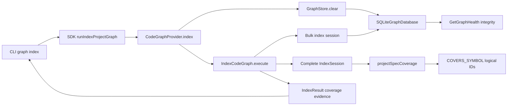

# Design: repair-code-graph-coverage-indexing

## Objectives and expected outcomes

The implementation must restore trustworthy requirement-to-code coverage without requiring users to delete the SQLite database manually.

After implementation:

- a forced index of a healthy populated store reconsiders every selected input and commits a complete logical generation;
- a clean or forced generation persists both file coverage and symbol coverage whose targets are logical symbol IDs;
- an implementation-only persisted spec-state change can update coverage while code remains unchanged;
- replacing a covered file reprojects coverage from canonical persisted spec state instead of preserving obsolete occurrence IDs;
- missing and ambiguous implementation symbols produce structured diagnostics and never guessed relations;
- health cannot report a graph as current and coverage-complete when successfully indexed inputs lack their physical graph nodes;
- CLI text and structured output retain full-rebuild, coverage-summary, and coverage-diagnostic evidence.

## Non-goals

- Do not repair or recreate orphan `spec-lock.json` sidecars. That issue is parked separately.
- Do not add fuzzy symbol matching or automatically degrade unresolved symbol links to `COVERS_FILE`.
- Do not define new owner-qualified member syntax. The active `language-agnostic-member-symbol-references` change owns that capability.
- Do not change logical symbol encoding, declaration occurrence IDs, language adapters, or search ranking.
- Do not migrate derived SQLite data in place. Code Graph remains rebuildable derived storage.
- Do not introduce a new graph backend, configuration option, feature flag, authorization boundary, external dependency, or network operation.

## Functional contract

### Forced indexing

`CodeGraphProvider.index({ force: true })` keeps the existing healthy-store lifecycle: the provider holds the index lock, calls `GraphStore.clear()` while the store remains open, and invokes `IndexCodeGraph.execute()` with `force: true`.

`IndexCodeGraph.execute()` must treat `options.force === true` as an unconditional full logical rebuild. It must not enter the normal hash-diff branch. Every discovered input is placed in the reconsideration set even if a faulty or third-party store still returns an old node, observation, or `IndexCoverage.contentHash`. This is defense in depth in addition to fixing built-in stores.

The run returns `fullRebuild: true`, retains the current stable forced reason, reports zero hash-matched skips for selected inputs, and classifies inputs that cannot become code nodes by their real coverage status or error.

### Coverage projection

Spec preparation becomes an explicit phase before the decision to hydrate semantic state. For every repository spec it materializes metadata and reads canonical persisted state once, producing a run-local prepared record containing the `SpecNode`, metadata fingerprint, dependencies, implementation links, and whether the persisted projection differs from the stored spec node.

Coverage is reprojected when any of these conditions holds:

1. the run is forced or fingerprint-invalidated;
2. code files are new, changed, reprocessed, or deleted;
3. at least one prepared spec projection changed;
4. no persisted coverage generation exists.

When none holds, existing coverage remains untouched and semantic hydration is not performed solely for coverage.

When projection is required, the indexing session must represent the complete semantic generation:

- changed/new files are analyzed into the session;
- retained files and physical symbols are hydrated from the store;
- retained logical symbols, declarations, bindings, and resolution facts are hydrated from `getAllReferenceFacts()`;
- deleted/replaced paths are excluded from retained facts;
- spec coverage is projected only after Pass 1 has registered the new declarations.

Coverage is rebuilt from every canonical prepared implementation link, not only from specs whose Markdown or lock fingerprint changed. This ensures that code-only changes restore every relation removed by file-local cleanup. The existing `preservedFileCoverageRelations` rescue path is removed; deterministic reprojection replaces it.

Projection rules are exact:

- a link with no `symbols` produces `COVERS_FILE` only when its canonical file exists in the committed generation;
- each symbol name is matched against physical declarations from the linked file, then mapped through one precomputed `declarationSymbolId -> logicalSymbolId` map;
- exactly one distinct logical ID produces `COVERS_SYMBOL`;
- zero logical IDs produces `SYMBOL_NOT_FOUND`;
- more than one distinct logical ID produces `SYMBOL_AMBIGUOUS`;
- an absent linked file produces `FILE_NOT_INDEXED`;
- unresolved symbol-qualified links produce no file fallback;
- relations target logical IDs and are deduplicated by source, type, and target.

Human owner-qualified names that the current semantic model cannot prove remain unresolved diagnostics. Once `language-agnostic-member-symbol-references` provides authoritative structured resolution, this projection service may consume that resolver without changing the diagnostic or relation contract.

### SQLite endpoint integrity

SQLite relation staging must collect both physical symbol IDs and logical symbol IDs after reference facts are written. Endpoint validation changes only for `COVERS_SYMBOL`: source must exist in `specs`, and target must exist in `logical_symbols`. Other symbol-to-symbol relation families continue to validate against physical declaration occurrence IDs.

Logical symbols and declarations must be inserted before relation validation in the same bulk transaction. Existing forward/reverse relation queries and relation statistics operate on opaque text IDs and therefore require no schema shape change.

### Health integrity

`GetGraphHealth` already reads all coverage facts. It will additionally fetch persisted files and build a set of canonical file paths. Every `IndexCoverageStatus.Indexed` fact must have a corresponding `FileNode`. `Unsupported` and `Excluded` facts do not require code nodes; `ParseFailed` and `Partial` remain incomplete through the existing rules.

If one or more indexed paths are absent:

- `coverageComplete` is false;
- `contentFresh` is false;
- aggregate state cannot be `current`;
- `reasonCodes` includes `GRAPH_CONTENT_INCONSISTENT` exactly once;
- `coverage.reasons` includes `indexed-node-missing` exactly once.

This assessment is read-only and never clears, recreates, or indexes the store.

## Affected areas

### Production code

- `IndexCodeGraph.execute()` in `packages/code-graph/src/application/use-cases/index-code-graph.ts`
  - Change: split prepared spec projection from relation emission; route force outside normal hash diff; hydrate complete semantic state when coverage reprojection is required; project all canonical implementation links; build run coverage summary and diagnostics.
  - Impact: central write path, part of a CRITICAL eight-file blast radius. Preserve existing progress ranges, chunking, single bulk session, and error isolation.

- `CodeGraphProviderImpl.index()` in `packages/code-graph/src/composition/code-graph-provider.ts`
  - Change: retain the current lock/clear/execute order and add a regression assertion that `force` reaches the indexer unchanged. No public signature change.
  - Impact: CRITICAL integration point with 47 direct file dependents in the graph analysis. Avoid lifecycle or locking changes.

- `IndexResult` in `packages/code-graph/src/domain/value-objects/index-result.ts`
  - Change: add required `coverage` and `coverageDiagnostics` fields and export their supporting types.
  - Impact: CRITICAL public value object with 5 direct, 23 indirect, and 4 transitive symbol dependents across Code Graph, SDK, worker protocol, and tests. The change is additive at the data boundary, but every constructor/fixture must populate the fields.

- `GraphStore.clear()` and coverage method documentation in `packages/code-graph/src/domain/ports/graph-store.ts`
  - Change: clarify complete logical-clear semantics and that symbol coverage APIs accept logical symbol IDs. No new abstract method and no method rename.
  - Impact: CRITICAL port with multiple adapters and many test doubles. Shared contract tests are authoritative.

- `SQLiteGraphDatabase.clear()`, `commitBulkIndex()`, and relation endpoint validation in `packages/code-graph/src/infrastructure/sqlite/sqlite-graph-database.ts`
  - Change: atomically delete all generation-owned tables; include logical ID sets in relation validation; accept `COVERS_SYMBOL` only against logical targets.
  - Impact: worker-owned synchronous database core. Preserve one transaction and statement ordering.

- `SQLiteGraphStore.clear()` in `packages/code-graph/src/infrastructure/sqlite/sqlite-graph-store.ts`
  - Change: no protocol shape change is expected; verify the host method awaits the existing worker `clear` operation and invalidates no storage generation. Adjust only if tests reveal host-side cached metadata remains stale.

- `GetGraphHealth.execute()` and `readCoverageHealth()` in `packages/code-graph/src/application/use-cases/get-graph-health.ts`
  - Change: reconcile indexed coverage with persisted files and merge the integrity result into every return path.
  - Impact: CRITICAL spec ripple with five direct spec dependents and SDK/project-status consumers. Result shape remains unchanged; only values and stable reasons become stricter.

- `formatTextIndexResult()` in `packages/cli/src/commands/graph/index-graph.ts`
  - Change: render coverage status counts and structured coverage diagnostics after existing rebuild/phase fields. JSON and TOON continue passing through the complete result unchanged.
  - Impact: LOW, with two direct callers and three affected files.

- Barrel exports under `packages/code-graph/src/domain/value-objects/index.ts`, `packages/code-graph/src/domain/index.ts`, `packages/code-graph/src/index.ts`, and `packages/code-graph/src/public.ts`
  - Change: export the new result types wherever `IndexResult` is currently exported.

### Tests and fixtures

- `packages/code-graph/test/application/use-cases/workspace-indexing.spec.ts`
- `packages/code-graph/test/application/use-cases/index-project-graph-integration.spec.ts`
- `packages/code-graph/test/application/use-cases/get-graph-health.spec.ts`
- `packages/code-graph/test/composition/code-graph-provider.spec.ts`
- `packages/code-graph/test/domain/ports/graph-store.contract.ts`
- `packages/code-graph/test/helpers/in-memory-graph-store.ts`
- `packages/code-graph/test/helpers/make-mock-spec-repository.ts`
- `packages/code-graph/test/infrastructure/sqlite/sqlite-graph-store.spec.ts`
- `packages/code-graph/test/infrastructure/sqlite/sqlite-worker-lifecycle.spec.ts`
- `packages/cli/test/commands/graph-index.spec.ts`
- SDK and Code Graph fixtures that construct `IndexResult`, found by TypeScript after the required fields are added.

### Documentation

- `docs/code-graph/index.md`: document logical-symbol coverage, unresolved diagnostics, and forced logical rebuild recovery.
- `docs/cli/cli-reference.md`: document the additional coverage and diagnostic fields in graph-index output.

## New constructs

### Index result coverage types

Location: `packages/code-graph/src/domain/value-objects/index-result.ts`.

```ts
export type IndexCoverageDiagnosticReason =
  | 'FILE_NOT_INDEXED'
  | 'SYMBOL_NOT_FOUND'
  | 'SYMBOL_AMBIGUOUS'

export interface IndexCoverageDiagnostic {
  readonly specId: string
  readonly filePath: string
  readonly symbolName?: string
  readonly reason: IndexCoverageDiagnosticReason
}

export interface IndexRunCoverageSummary {
  readonly total: number
  readonly byStatus: Readonly<Record<IndexCoverageStatus, number>>
  readonly reasons: readonly string[]
}

export interface IndexResult {
  // existing fields remain unchanged
  readonly coverage: IndexRunCoverageSummary
  readonly coverageDiagnostics: readonly IndexCoverageDiagnostic[]
}
```

Diagnostics are sorted by `specId`, `filePath`, `symbolName ?? ''`, then `reason`. Summary reasons are unique and lexicographically sorted. Counts are derived from the complete coverage snapshot staged by the run, not from only changed inputs.

### Prepared spec projection

Location: internal interfaces in `packages/code-graph/src/application/use-cases/index-code-graph.ts`.

```ts
interface PreparedSpecProjection {
  readonly specNode: SpecNode
  readonly dependsOn: readonly string[]
  readonly implementation: readonly PersistedImplementationLink[]
  readonly changed: boolean
}
```

Preparation owns repository and metadata I/O and is executed once per spec. It does not resolve code symbols or mutate the store.

### Pure coverage projector

Location: new file `packages/code-graph/src/application/services/project-spec-coverage.ts`.

```ts
export interface ProjectSpecCoverageInput {
  readonly specs: readonly {
    readonly specId: string
    readonly implementation: readonly PersistedImplementationLink[]
  }[]
  readonly indexedFilePaths: ReadonlySet<string>
  readonly symbolsByFile: (filePath: string) => readonly SymbolNode[]
  readonly logicalIdByDeclarationSymbolId: ReadonlyMap<string, string>
}

export interface ProjectSpecCoverageResult {
  readonly relations: readonly Relation[]
  readonly diagnostics: readonly IndexCoverageDiagnostic[]
}

export function projectSpecCoverage(input: ProjectSpecCoverageInput): ProjectSpecCoverageResult
```

This application service is deterministic and side-effect free. It performs no filesystem, repository, SQLite, or logging I/O. `IndexCodeGraph` owns hydration and passes only the complete run-local semantic view.

## Execution flow

1. Discover selected workspace and root inputs.
2. Load existing nodes, coverage, statistics, and stored fingerprint.
3. Prepare every repository spec once, including canonical persisted implementation links.
4. If forced or fingerprint-invalidated, classify every discovered input for reconsideration without consulting retained hashes.
5. Otherwise perform the existing observation-assisted hash diff.
6. Set `coverageProjectionRequired` from force/fingerprint state, code changes, prepared spec changes, or absent coverage.
7. Load persisted reference facts when semantic refresh or coverage projection needs retained declarations.
8. Hydrate retained files/symbols/facts, excluding deleted and replaced paths.
9. Analyze new/changed/reprocessed files through existing Pass 1 and Pass 2.
10. Build one declaration-to-logical map from the complete session.
11. Materialize changed spec nodes and dependency relations.
12. If coverage projection is required, run `projectSpecCoverage()` across every prepared spec; otherwise stage no coverage mutations.
13. Build the complete `ReferenceFactsWrite.coverage` snapshot and `IndexRunCoverageSummary`.
14. Stage removals, physical nodes, specs, semantic reference facts, observations, code relations, spec dependencies, and projected coverage in the existing single bulk session.
15. SQLite inserts logical symbols before validating `COVERS_SYMBOL` relations.
16. Commit atomically, return summary plus sorted diagnostics, and preserve per-file error behavior.

## Key decisions

**Force is fixed twice** → SQLite clear removes all reusable state, and the indexer independently refuses incremental skips when `force` is true. This prevents a future backend regression from recreating the unrecoverable empty-graph state.

**Coverage is reprojected from canonical persisted state** → changed-file cleanup can delete both file and symbol coverage, so retaining old relations is unsafe. The existing file-only preservation path is removed. Blind preservation of physical `COVERS_SYMBOL` was rejected because declaration occurrence IDs are not stable semantic identities.

**Hydrate only when projection or semantic refresh is required** → implementation-only changes need persisted symbols, but a completely unchanged incremental run should retain its fast skip path. Always hydrating all 37,923 current symbols was rejected as unnecessary steady-state memory cost.

**Logical IDs are canonical coverage endpoints** → one logical symbol may have multiple declarations and stable identity across source shifts. Retargeting coverage to physical occurrences was rejected.

**Diagnostics instead of fallback** → an unresolved symbol link cannot truthfully claim file coverage. Automatic `COVERS_FILE` fallback and fuzzy selection were rejected.

**No SQLite schema-version bump** → relation IDs are already text, required semantic tables already exist, and clear behavior changes rather than schema shape. A forced reindex replaces legacy derived relations. If implementation discovers a physical schema alteration is unavoidable, it must increment the reference schema version exactly once and update this design before coding further.

**Additive public result fields** → SDK, worker, and structured CLI already pass `IndexResult` through. Required fields prevent producers and fixtures from silently omitting the evidence; consumers that ignore extra serialized fields remain compatible.

## Error handling and consistency

- Repository or metadata failures remain per-spec `IndexError` entries and do not abort unrelated specs.
- Coverage resolution failures are `coverageDiagnostics`, not infrastructure errors, and do not change exit code.
- SQLite clear and bulk generation commit are separate atomic transactions under the same provider-owned index lock. A clear failure preserves the old generation; a later indexing failure leaves the logically cleared store, matching current force semantics. The next forced run remains recoverable because no stale skip authority survives.
- SQLite worker/connection/disk failures continue aborting the run through existing typed infrastructure errors.
- Coverage diagnostic fields contain identities only; do not include source content or secrets.
- No retry is added inside the indexer. Existing SDK recovery remains limited to typed recoverable open failures.
- Concurrent indexing remains serialized by the existing graph index lock. No new lock or cross-process protocol is introduced.

## Performance and scalability

- Normal unchanged indexing retains content-hash and observation skips and performs no full semantic hydration solely for coverage.
- Coverage projection is linear in prepared links plus matching declarations. Build the declaration-to-logical map once; do not scan all logical declaration groups for every symbol name.
- Repository persisted state is read once per spec per run, not once for change detection and again for relation projection.
- SQLite clear uses bounded fixed-count `DELETE` statements in one worker transaction.
- Bulk persistence remains staged, chunked, and committed once. Do not send a second repository-sized worker payload.
- Health performs one all-files read plus one all-coverage read and set membership checks; it must not issue one lookup per coverage fact.

## Trade-offs

- Full semantic hydration is still required when implementation-only state changes. This increases that run's memory use but avoids parsing code and is bounded by the existing persisted semantic generation.
- A forced clear commits before the new generation. If indexing later fails, the store is empty rather than retaining the old generation. This preserves current provider semantics; replacing it with a cross-clear-and-index transaction would require a larger lifecycle redesign.
- Owner-qualified legacy strings may remain diagnostic until the overlapping member-reference change lands. This design produces correct nonzero coverage for resolvable logical symbols and never lies about unresolved ones.
- Adding required `IndexResult` fields causes compile-time updates in fixtures. This is intentional to make result evidence exhaustive.

## Spec impact

### `code-graph:indexer`

- Graph impact: CRITICAL; 3 direct, 12 indirect, and 11 transitive dependents; 36 affected files and 26 affected specs.
- Relevant dependents include `code-graph:index-project-graph`, `sdk:run-index-project-graph`, `cli:graph-index`, health, traversal, and coverage use cases.
- They remain satisfied because provider and SDK orchestration signatures do not change and `IndexResult` is forwarded additively.

### `code-graph:graph-store`

- Graph impact: CRITICAL; 10 direct, 13 indirect, and 12 transitive dependents; 61 affected files and 35 affected specs.
- Existing backends/test doubles must satisfy stronger clear and logical-coverage contracts. No query method is removed or renamed.
- Traversal, search, implementation review, and coverage consumers continue treating relation targets as opaque IDs and require no requirement change.

### `code-graph:sqlite-graph-store`

- Graph impact: LOW at spec level; no dependent spec declares a direct dependency.
- Worker and store tests change, but backend selection, schema ownership, lifecycle, and search contracts remain intact.

### `code-graph:get-graph-health`

- Graph impact: CRITICAL; 5 direct, 13 indirect, and 10 transitive dependents; 43 affected files and 28 affected specs.
- CLI stats, project status, SDK snapshot, search/impact warnings, and implementation review become more conservative when the graph is inconsistent. Their existing requirement to avoid trusting stale absence remains satisfied; no additional spec delta is needed.

### `cli:graph-index`

- Graph impact: LOW; no dependent spec and only its command tests are directly affected.

### Active overlaps

- `code-graph-symbol-semantic-context` overlaps `code-graph:indexer` but focuses on structural context/ranges and does not yet contain artifacts.
- `language-agnostic-member-symbol-references` overlaps indexer/store/SQLite and plans normalized member semantics plus structured resolution. This change must not edit member identity fields or canonical encoding. Implementation should merge against its current code if it lands first; coverage consumes whatever logical IDs the session exposes.
- No additional spec requires a delta now. If either overlapping change introduces an incompatible store or indexing contract before implementation begins, re-run spec previews and request artifact review rather than silently resolving the conflict in code.

## Dependency map



```
┌──────────────────┐      ┌──────────────────────┐
│ CLI graph index  │─────▶│ SDK orchestration    │
└─────────▲────────┘      └──────────┬───────────┘
          │                          ▼
          │               ┌──────────────────────┐
          │               │ CodeGraphProvider    │
          │               │ index() [CRITICAL]   │
          │               └──────┬────────┬──────┘
          │                      │        │
          │                      ▼        ▼
┌─────────┴────────┐   ┌──────────────┐  ┌──────────────────┐
│ IndexResult      │◀──│ IndexCodeGraph│  │ GraphStore.clear │
│ evidence         │   │ [CRITICAL]    │  │ [CRITICAL]       │
└──────────────────┘   └──────┬───────┘  └────────┬─────────┘
                              ▼                   │
                   ┌────────────────────┐          │
                   │ complete semantic │          │
                   │ IndexSession       │          │
                   └─────────┬──────────┘          │
                             ▼                     ▼
                   ┌────────────────────┐  ┌──────────────────┐
                   │ projectSpecCoverage│─▶│ SQLite bulk/clear│
                   │ logical targets    │  │ endpoint checks  │
                   └────────────────────┘  └────────┬─────────┘
                                                   ▼
                                          ┌──────────────────┐
                                          │ GetGraphHealth   │
                                          │ integrity check  │
                                          └──────────────────┘
```

## Migration / rollback

No source-data migration is required. The graph database is derived state.

Deployment procedure:

1. Build and test the updated packages.
2. Run `node packages/cli/dist/index.js graph index --force --format toon` once per configured project.
3. Confirm the forced result has `fullRebuild: true`, zero hash-matched skips, nonzero file/symbol counts for code-bearing projects, and no unexpected coverage diagnostics.
4. Run graph stats and confirm `COVERS_FILE` and `COVERS_SYMBOL` are nonzero where canonical links exist.
5. Run a normal index and confirm the incremental skip path is restored.

Rollback procedure:

1. Restore the previous package version.
2. Remove the derived graph database or invoke that version's supported recreation path.
3. Reindex from source and canonical specs. Do not attempt to reinterpret new logical coverage as old physical-symbol coverage.

## Testing

### Automated tests

- `workspace-indexing.spec.ts`
  - Preserve all existing incremental scenarios.
  - Prove force ignores retained coverage hashes and produces no hash skips.
  - Use a repository returning real persisted implementation state, not the null mock.
  - Prove clean file and logical-symbol coverage, implementation-only reprojection, changed-declaration reprojection, missing-file diagnostics, missing-symbol diagnostics, ambiguity diagnostics, and no file fallback.

- `index-project-graph-integration.spec.ts`
  - Build a temporary real workspace with real `spec.md`/`spec-lock.json`, TypeScript code, and SQLite.
  - Index empty storage, assert nonzero file and logical-symbol coverage, force the populated store, assert coverage survives, then run normal incremental indexing and assert normal skips.
  - Without changing any code file, replace only the persisted implementation links in the real `spec-lock.json`, run another normal incremental index, and assert that the old SQLite coverage relations are removed and the replacement file and logical-symbol relations are present. The test must also assert that the code adapter was not invoked for the second run.

- `graph-store.contract.ts`
  - Populate every abstract generation-owned state family, call `clear()`, and assert backend parity, unchanged storage generation, and no reusable state.
  - Persist logical coverage, assert forward/reverse round-trip and statistics, and reject missing or occurrence-only endpoints.

- `sqlite-graph-store.spec.ts` and `sqlite-worker-lifecycle.spec.ts`
  - Inspect every generation table after clear.
  - Inject a mid-clear SQL failure and assert rollback.
  - Stage logical symbols before coverage and assert endpoint acceptance, metadata round-trip, reverse lookup, and invalid-target rejection.

- `get-graph-health.spec.ts`
  - Cover retained indexed coverage over an empty graph, a consistent complete generation, unsupported inputs without code nodes, and the no-mutation guarantee.

- `code-graph-provider.spec.ts`
  - Assert force calls clear under the existing lock and forwards `force: true` to the indexer.

- `graph-index.spec.ts`
  - Assert text, JSON, and TOON expose forced rebuild evidence, coverage summary, classification counts, and diagnostics without recomputation.

- Compile-time fixture updates
  - Every `IndexResult` producer supplies complete zero-valued coverage and diagnostics when a test does not exercise them.
  - `make-mock-spec-repository.ts` gains an optional persisted-state input instead of forcing `null`.

### Manual / E2E verification

Run from the repository root after building:

```text
node packages/cli/dist/index.js graph index --force --format toon
node packages/cli/dist/index.js graph stats --format toon
node packages/cli/dist/index.js graph index --format toon
```

Expected observations:

- forced output: `fullRebuild: true`, `filesIndexed > 0`, `filesSkipped: 0` for reconsidered inputs;
- stats: `fileCount > 0`, `symbolCount > 0`, `COVERS_FILE > 0`, and `COVERS_SYMBOL > 0` for this repository's canonical links;
- normal output immediately afterward: unchanged inputs use the incremental skip path;
- health remains current only while indexed coverage has corresponding graph nodes;
- unresolved links appear under structured coverage diagnostics rather than disappearing silently.

Run package tests, type checking, linting, and build through the repository's existing pnpm scripts. Tests follow global testing rules: application logic uses mocked ports, SQLite behavior uses real temporary storage, and E2E exercises the built CLI boundary.

## Documentation and maintenance rules

All artifacts, code, comments, diagnostics, and documentation are English. New exported interfaces and public methods require JSDoc. Use strict TypeScript, ESM imports with project conventions, no `any`, no default exports, and no I/O in the pure coverage projector. Production logging uses the shared logger; coverage diagnostics are result data and must not be printed directly by Code Graph.
