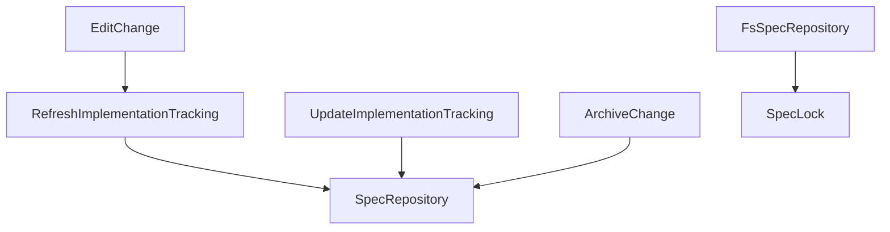

# Design: prevent-orphan-spec-locks

## Context & scope

Filesystem inspection discovered orphan `spec-lock.json` sidecar files in spec directories where no canonical `spec.md` existed. This issue stemmed from three systemic causes:

1. Lack of `specId` validation in `UpdateImplementationTracking` when adding links, allowing nonexistent or mistyped spec IDs into `manifest.json`.
2. Lingering implementation links for removed specs in `EditChange`, which were never cleaned up because `RefreshImplementationTracking` only checked for deleted files, not invalid spec IDs.
3. Blind inclusion of all spec IDs in `ArchiveChange._prepareArchivePlan`, coupled with `FsSpecRepository.publish` creating empty directories with only lock sidecars when `artifacts` is empty.

This design implements multi-layered defense-in-depth and self-healing across `@specd/core`.

## Affected areas

- `packages/core/src/application/use-cases/update-implementation-tracking.ts`:
  - Changes: In `_validateMutation`, validate `input.specId` against `change.specIds` and canonical `SpecRepository`. Throw `SpecNotFoundError` if missing.
  - Risk: MEDIUM (Application boundary validation).
- `packages/core/src/application/use-cases/refresh-implementation-tracking.ts`:
  - Changes: Add `_specSweep` to prune dangling implementation links referencing specs not in `change.specIds` and not found in `SpecRepository`.
  - Risk: MEDIUM (Self-healing prune logic).
- `packages/core/src/application/use-cases/edit-change.ts`:
  - Changes: Trigger `refreshImplementationTracking.execute({ name })` when `specIds` change (`invalidated: true`).
  - Risk: LOW (Use case orchestration).
- `packages/core/src/application/use-cases/archive-change.ts`:
  - Changes: In `_prepareArchivePlan`, safely discard nonexistent spec publication candidates.
  - Risk: LOW (Safe publication filtering).
- `packages/core/src/infrastructure/fs/spec-repository.ts`:
  - Changes: In `publish`, assert `specDirExists || publication.artifacts.length > 0`, throwing `SpecPublicationError` otherwise.
  - Risk: LOW (Repository integrity guard).
- `packages/core/src/composition/use-cases/*.ts`:
  - Changes: Wire `specRepositories` into `UpdateImplementationTracking` and `RefreshImplementationTracking`, and `refreshImplementationTracking` into `EditChange`.
  - Risk: LOW (Composition wiring).

## New constructs

No new exported classes or interfaces are introduced. Dependencies in existing use cases and composition factory helpers are enriched with optional collaborators:

- `UpdateImplementationTrackingDeps.specRepositories?: ReadonlyMap<string, SpecRepository>`
- `RefreshImplementationTrackingDeps.specRepositories?: ReadonlyMap<string, SpecRepository>`
- `EditChangeDeps.refreshImplementationTracking?: RefreshImplementationTracking`

## Approach

1. **Input Validation (`UpdateImplementationTracking`)**:
   - When `action === 'add'`, check if `input.specId` exists in `change.specIds`.
   - If not in `change.specIds`, lookup the spec in `_specRepositories.get(workspace)`. If `repo.get(specPath)` returns null/throws, throw `SpecNotFoundError(input.specId)`.
2. **Self-Healing Sweep (`RefreshImplementationTracking`)**:
   - `_specSweep(freshChange)` iterates through `freshChange.implementationLinks`.
   - If a link's `specId` is neither in `freshChange.specIds` nor resolvable in `_specRepositories`, prune the link from the change.
3. **Auto-refresh Trigger (`EditChange`)**:
   - When `persisted.invalidated` is true (after spec removals/additions), invoke `_refresh.execute({ name })` to immediately run file and spec sweeps.
4. **Archive Safety (`ArchiveChange`)**:
   - When building the publication plan from `implementationBySpecId`, check if the spec exists in canonical repository or is being created in the change. If nonexistent, remove from publication candidates.
5. **Storage Guard (`FsSpecRepository`)**:
   - If `!specDirExists && publication.artifacts.length === 0`, throw `SpecPublicationError`.

## Key decisions

- **Decision: Validate against both `change.specIds` and canonical `SpecRepository`** → Allows implementation tracking to link files to both newly introduced specs in the active change and pre-existing specs from the workspace.
  _Alternatives rejected:_ Validating only against `change.specIds` would prevent linking to unchanged existing specs in the workspace.
- **Decision: Self-healing sweep in `RefreshImplementationTracking`** → Ensures any legacy or out-of-band invalid links in manifests are automatically repaired whenever status or transition runs.
  _Alternatives rejected:_ Failing or crashing on status when encountering bad links.
- **Decision: Trigger refresh in `EditChange`** → Keeps `manifest.json` clean immediately after a user or agent removes a spec from a change.

## Trade-offs

- [Risk: Spec lookup overhead during link addition] → Mitigation: Map lookup by workspace + targeted repository `get()`, fast in-memory index.
- [Risk: Automatic pruning of links if spec repository is temporarily unavailable] → Mitigation: `_specRepositories` is loaded from kernel config; sweep only executes when repository map is available.

## Spec impact

- `core:update-implementation-tracking`: Enforces `specId` validation on link addition.
- `core:refresh-implementation-tracking`: Enforces spec sweep on refresh execution.
- `core:edit-change`: Orchestrates refresh on spec scope modifications.
- `core:archive-change`: Guarantees nonexistent specs are omitted from publication.
- `core:fs-spec-repository`: Rejects publication of empty spec directories.
- `core:spec-lock`: Reinforces constraint that lockfiles cannot exist without canonical spec artifacts.

## Dependency map



```
┌────────────────────────────┐
│         EditChange         │
└──────────────┬─────────────┘
               │ (on specIds change)
               ▼
┌────────────────────────────┐       ┌────────────────────────────┐
│RefreshImplementationTrack. │◀──────│ UpdateImplementationTrack. │
└──────────────┬─────────────┘       └─────────────┬──────────────┘
               │                                   │
               │ (validates specId / sweeps)       │
               ▼                                   ▼
┌─────────────────────────────────────────────────────────────────┐
│                         SpecRepository                          │
└─────────────────────────────────────────────────────────────────┘
                               ▲
                               │ (guards publish)
┌──────────────────────────────┴──────────────────────────────────┐
│                        FsSpecRepository                         │
└─────────────────────────────────────────────────────────────────┘
```

## Migration / Rollback

Purely additive validation and self-healing. No data migrations or schema changes required. Rollback restores previous permissive use case implementations.

## Testing

### Automated tests

- `packages/core/test/application/use-cases/update-implementation-tracking.spec.ts`:
  - Asserts `action = 'add'` throws `SpecNotFoundError` when given unknown `specId`.
  - Asserts adding link for existing workspace spec or change spec succeeds.
- `packages/core/test/application/use-cases/refresh-implementation-tracking.spec.ts`:
  - Asserts `_specSweep` prunes dangling implementation links pointing to nonexistent specs.
- `packages/core/test/application/use-cases/edit-change.spec.ts`:
  - Asserts `EditChange` invokes `refreshImplementationTracking` when `specIds` change.
- `packages/core/test/application/use-cases/archive-change.spec.ts`:
  - Asserts nonexistent spec in `implementationBySpecId` is safely discarded from publication.
- `packages/core/test/infrastructure/fs/spec-repository.spec.ts`:
  - Asserts `publish` throws `SpecPublicationError` when attempting to create a new spec directory with `artifacts: []`.

### Manual / E2E verification

Run full core test suite:

```bash
pnpm --filter @specd/core test
```

Verify all 195 test files and 2,400+ tests pass cleanly.

## Documentation

No changes to public user guides in `docs/` are required since CLI syntax and commands remain identical.

## Open questions

(none)
