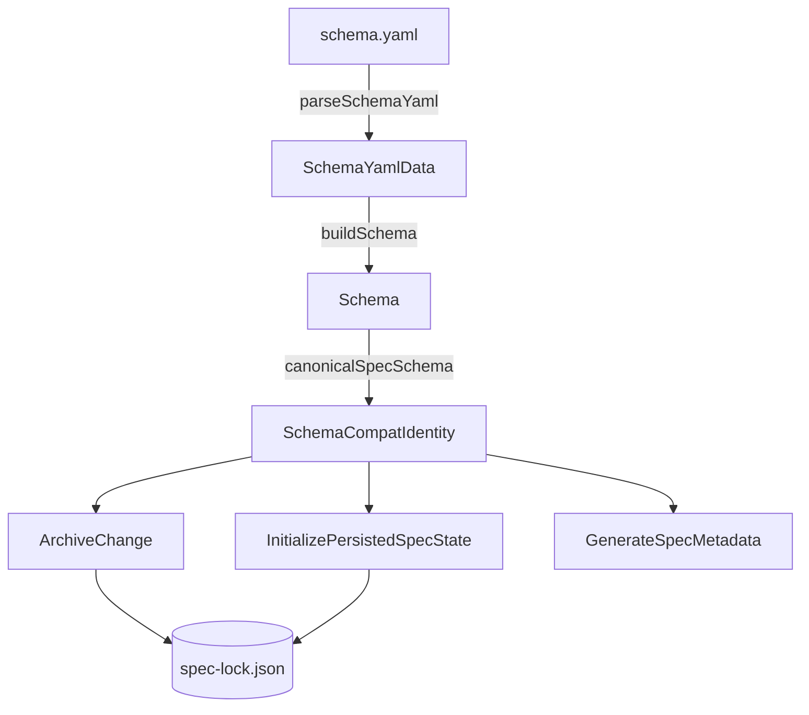

# Design: schema-compat

## Context & constraints

- **Hexagonal Architecture**: Value objects (`Schema`, `SchemaCompatIdentity`) and pure parsing/resolution helpers (`parseSchemaCompat`) live in the `domain/` layer with zero dependencies on infrastructure or I/O.
- **Backwards Compatibility**: Existing schemas omitting `compat` preserve their exact current behavior without regressions.
- **Spec Immutability**: Pre-existing `spec-lock.json` lockfiles in canonical workspace specs are preserved when archiving changes; `canonicalSpecSchema()` is only applied to newly published/initialized specs without prior lock state.
- **Deterministic 3-Tier Resolution**: `Schema.canonicalSpecSchema()` implements `compat` → `extends` → `name@version`.

## Affected areas

- `packages/core/src/domain/value-objects/schema.ts`
  - Symbol: `SchemaCompatIdentity`, `parseSchemaCompat`, `Schema` methods `compat()` and `canonicalSpecSchema()`
  - Callers: Schema parser, domain services, application use cases · Risk: LOW (strictly additive)
- `packages/core/src/infrastructure/schema-yaml-parser.ts`
  - Symbol: `parseSchemaYaml`, `SchemaYamlZodSchema`, `SchemaYamlData`
  - Callers: `ValidateSchema`, `BuildSchema` · Risk: LOW
- `packages/core/src/domain/services/build-schema.ts`
  - Symbol: `buildSchema`
  - Callers: `ResolveSchema`, `ValidateSchema` · Risk: LOW
- `packages/core/src/domain/services/merge-schema-layers.ts`
  - Symbol: `mergeSchemaLayers`, `SetTargets`, `RemoveTargets`
  - Callers: `ResolveSchema` · Risk: LOW
- `packages/core/src/application/use-cases/resolve-extends-chain.ts`
  - Symbol: `resolveExtendsChain`, `overlayData`
  - Callers: `ResolveSchema` · Risk: LOW
- `packages/core/src/application/use-cases/archive-change.ts`
  - Symbol: `ArchiveChange.execute`
  - Callers: CLI `changes archive` · Risk: MEDIUM (lockfile persistence)
- `packages/core/src/application/use-cases/initialize-persisted-spec-state.ts`
  - Symbol: `InitializePersistedSpecState.execute`
  - Callers: CLI `spec schema init` · Risk: LOW
- `packages/core/src/application/use-cases/generate-spec-metadata.ts`
  - Symbol: `GenerateSpecMetadata.execute`
  - Callers: Metadata materializer, CLI context · Risk: LOW
- `packages/cli/src/commands/schema/show.ts`
  - Symbol: `formatSchemaText`, `serializeSchema`
  - Callers: CLI `specd schema show` · Risk: LOW

## New constructs

- **`SchemaCompatIdentity`** (interface in `packages/core/src/domain/value-objects/schema.ts`):
  - Shape: `{ readonly name: string; readonly version: number }`
  - Responsibility: Strongly-typed canonical spec schema identity.
  - Relationships: Produced by `parseSchemaCompat` and returned by `Schema.compat()` and `Schema.canonicalSpecSchema()`.

- **`parseSchemaCompat`** (function in `packages/core/src/domain/value-objects/schema.ts`):
  - Shape: `(raw: string | { name: string; version?: number }): SchemaCompatIdentity`
  - Responsibility: Normalizes string identifiers (`@scope/pkg@version`, `pkg@version`, `pkg`) and structured objects into a canonical `{ name, version }`.
  - Relationships: Used in `buildSchema` and `Schema.canonicalSpecSchema()`.

## Approach

1. **Domain Representation**: Add `_compat?: SchemaCompatIdentity` to `Schema`. Implement `compat()` to return the optional declared compatibility, and `canonicalSpecSchema()` to resolve through the 3-level fallback (`this._compat ?? (this._extends ? parseSchemaCompat(this._extends) : { name: this._name, version: this._version })`).
2. **Schema YAML Validation**: In `schema-yaml-parser.ts`, validate `compat` on `kind: schema` (accepting string reference or object `{ name, version }`). Add a refinement to ensure `kind: schema-plugin` throws `SchemaValidationError` if `compat` is declared.
3. **Merge & Extends Cascade**: In `mergeSchemaLayers`, support `set.compat` and `remove.compat`. In `resolve-extends-chain`, propagate `compat: child.compat ?? parent.compat` in `overlayData`.
4. **Canonical State Stamping**: In `archive-change.ts`, resolve `publicationPersistedSchema` from `args.schema.canonicalSpecSchema()` when `persistedSchema` is null. In `initialize-persisted-spec-state.ts` and `generate-spec-metadata.ts`, use `schema.canonicalSpecSchema()`.
5. **CLI Introspection**: In `packages/cli/src/commands/schema/show.ts`, safely format and serialize `schema.compat` when present.

## Key decisions

- **3-tier resolution hierarchy (`compat` → `extends` → `name@version`)**:
  - _Rationale_: Allows standalone workflow schemas to declare compatibility with canonical specs, allows inherited schemas to naturally inherit their parent schema identity, and falls back to self-identity for base schemas.
  - _Alternatives rejected_: Storing only `extends` reference — rejected because ceremony schemas that do not extend the base schema still need to declare format compatibility without inheriting rules/workflows they don't want.
- **Immutable existing lockfiles on archive**:
  - _Rationale_: Protects existing specs from unwanted schema drift when touched by changes with different ceremony schemas.
- **Forbidden on `kind: schema-plugin`**:
  - _Rationale_: Plugins only inject layers (rules/hooks), they do not define full schema contracts.

## Trade-offs

- **[Risk: Stale or unverified compat declaration]** → A schema could declare `compat: @specd/schema-std@1` while generating incompatible artifact markdown.
  - _Mitigation_: Structural parsers in `ArchiveChange` (`_isStructurallyCompatiblePreparedArtifacts`) validate all artifact files against declared parser rules before commit.

## Spec impact

- `core:schema-format`: Added `compat` field, validation rules, and schema-plugin restriction.
- `core:schema-merge`: Added `set.compat` and `remove.compat` support.
- `core:resolve-schema`: Added extends cascading of `compat`.
- `core:archive-change`: Updated `spec-lock.json` persistence for new specs.
- `core:initialize-persisted-spec-state`: Updated lockfile initialization.
- `core:generate-metadata`: Updated fallback schema identity.
- `cli:schema-show`: Updated text and JSON schema output.

## Dependency map



```
┌─────────────────┐       ┌─────────────────┐
│   schema.yaml   │──────▶│ parseSchemaYaml │
└─────────────────┘       └────────┬────────┘
                                   │
                                   ▼
┌─────────────────┐       ┌─────────────────┐
│ canonicalSpec   │◀──────│  buildSchema()  │
│ Schema() [3-tier│       │   → Schema VO   │
└────────┬────────┘       └─────────────────┘
         │
         ├───▶ ArchiveChange ──────────────┐
         ├───▶ InitializePersistedSpecState──▶ ┌────────────────┐
         └───▶ GenerateSpecMetadata ───────┘   │ spec-lock.json │
                                               └────────────────┘
```

## Testing

### Automated unit tests

- `packages/core/test/infrastructure/schema-yaml-parser.spec.ts`:
  - `parseSchemaYaml — compat field`: accepts string, accepts object, rejects `schema-plugin` with `compat`.
- `packages/core/test/domain/services/build-schema.spec.ts`:
  - `buildSchema`: populates `compat()` and `canonicalSpecSchema()` with 3-tier fallback precedence (`compat` → `extends` → `name@version`).
- `packages/core/test/application/use-cases/resolve-schema.spec.ts`:
  - `ResolveSchema — extends`: cascades `compat` down multi-level `extends` chains.
- `packages/core/test/application/use-cases/archive-change.spec.ts`:
  - `ArchiveChange`: archives new spec using `compat` schema identity in `spec-lock.json`.
- `packages/cli/test/commands/schema-show.spec.ts`:
  - `specd schema show`: displays `compat` in text and JSON modes.

### Manual / E2E verification

1. Run `node packages/cli/dist/index.js schema show --format json` on a schema declaring `compat` and verify `"compat": { "name": "...", "version": N }` appears.
2. Run `node packages/cli/dist/index.js schema show` and verify `compat: <name>@<version>` appears in text mode.
3. Archive a test change with a custom schema declaring `compat: @specd/schema-std@1` and inspect created `spec-lock.json` to confirm `"schema": { "name": "@specd/schema-std", "version": 1 }`.

## Open questions

None.
