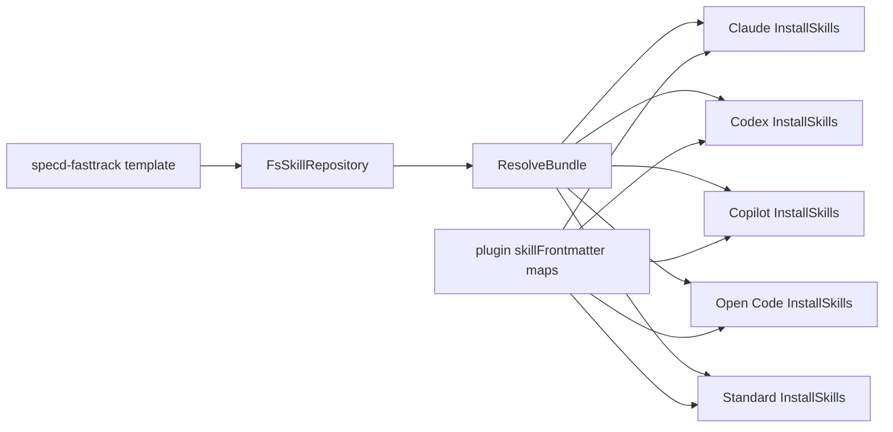

# Design: package-fasttrack-skill

## Objectives and expected outcomes

Add `specd-fasttrack` to the canonical `@specd/skills` template inventory and remove
the independently maintained local Markdown source as the distribution authority. Every
supported agent plugin must discover, render, install, filter, and uninstall the same
skill through its existing `SkillRepository` and `ResolveBundle` path. The rendered skill
must preserve a resumable code-first workflow: `.specd-exploration.md` is updated
immediately after each meaningful decision, code or scope action, implementation-link
update, test/debug result, contract finding, and audit result; a final summary supplements
but never substitutes for those live entries.

## Non-goals

- Do not alter the `SkillRepository`, `ResolveBundle`, plugin installation API, or the
  `SkillTemplateMetadata` schema; directory discovery and structured frontmatter already
  provide the required extension points.
- Do not create a new plugin, new runtime capability, runtime-specific renderer, network
  integration, persistent data model, feature flag, or migration format.
- Do not convert fast-track into a replacement for the normal design/approval lifecycle.
  It must still stop and request the user's explicit decision before `/specd-design`.

## Affected areas

- `packages/skills/templates/skills/specd-fasttrack/SKILL.md.tpl` and
  `skill.meta.json` (new): canonical template and metadata. The template is discovered
  by directory name; it must have no static frontmatter, reference
  `@{{sharedFolder}}/shared.md`, and use capability conditionals only where a runtime
  lacks MCP or delegated-agent support.
- `.agents/skills/specd-fasttrack/SKILL.md` (remove or regenerate through the existing
  skill synchronization workflow): it must not remain a hand-maintained canonical copy.
- `packages/skills/test/template-workflow.spec.ts` and any repository/bundle tests that
  enumerate standard templates: assert discovery, metadata validation, rendered file name,
  shared-file routing, frontmatter exclusion from shared output, and the live journal
  wording.
- `packages/plugin-agent-{claude,copilot,codex,opencode,standard}/src/domain/frontmatter/index.ts`:
  add the `specd-fasttrack` entry to each `skillFrontmatter` map. These maps are a
  CRITICAL-risk surface collectively: the graph reports 158 direct, 16 indirect, and 9
  transitive dependents across 21 files. Keep their exported shape unchanged and add only
  one keyed value per runtime.
- `packages/plugin-agent-{claude,copilot,codex,opencode,standard}/test/install-skills.spec.ts`:
  extend default-install assertions to find `specd-fasttrack`; add focused assertions for
  rendered frontmatter and conditional content. The existing `InstallSkills` classes and
  their public exports are consumers, not edit targets, unless a failing test proves an
  existing generic path is incomplete.

## New constructs

### `specd-fasttrack` template directory

Location: `packages/skills/templates/skills/specd-fasttrack/`.

Files:

- `skill.meta.json`:
  ```json
  {
    "kind": "skill",
    "supportedCapabilities": ["mcp", "agents", "frontmatter"],
    "requiredCapabilities": [],
    "requiredSharedTemplates": ["shared.md"]
  }
  ```
- `SKILL.md.tpl`: standard skill source rendered to `SKILL.md`. Its responsibility is
  workflow guidance only; it performs no I/O, frontmatter construction, or path
  resolution. It consumes `sharedFolder` and capability identifiers supplied by
  `ResolveBundle`.

No TypeScript API, class, interface, or domain object is added.

## Approach

1. Copy the behavioural content of the current local fast-track skill into the template,
   removing only text already mandatory in `shared.md`. Keep the distinct phases:
   intent/approach alignment; unscoped change selection/creation; governing-spec and
   contract analysis; code-first work; live implementation tracking; consolidation/audit;
   explicit hand-off stop.
2. Make live journaling an imperative at every action boundary. The template must say to
   append the decision/action immediately, before the next meaningful action, with date or
   sequence context, rationale, affected file/symbol and test/result when applicable. It
   must state that committing, pausing, or discarding intermediate code does not remove the
   obligation to record the action.
3. Use `{{#if capabilities.mcp}}` only for MCP-oriented guidance and
   `{{#if capabilities.agents}}` only for delegated-agent guidance. All core workflow
   steps must remain understandable and executable by Standard, which supplies only
   `frontmatter`.
4. Add frontmatter-map entries with the same semantic name and description in all plugins.
   Codex emits only `name` and `description`; Copilot and Open Code emit only their
   supported modeled fields; Standard must include `allowed-tools` for Read, Write, Edit,
   Grep, Glob, Node, SpecD, PNPM and Agent. Plugins continue to pass structured values to
   `ResolveBundle`; no plugin prepends a serialized frontmatter block.
5. Extend tests rather than changing `InstallSkills`: its unfiltered branch already calls
   `repository.list()`, filters `kind === 'skill'`, and resolves each selected name. Test
   both unfiltered discovery and a filtered install/uninstall path so the new name follows
   the same selection semantics.
6. Run the package test suites and relevant lint/typecheck commands. Regenerate a local
   development copy only via the existing synchronization mechanism, then verify it equals
   the package-rendered source rather than editing it directly.

## Key decisions

- **Directory discovery, not registration** → `FsSkillRepository.list()` enumerates
  `templates/skills`, so adding the directory is the single source of truth. **Rejected:**
  a hard-coded inventory or a plugin-specific path; both create drift and bypass metadata
  validation.
- **Explicit frontmatter maps** → even though plugins have fallback descriptions, a
  dedicated entry establishes stable user-facing metadata and Standard's required tools.
  **Rejected:** rely on fallback values; it cannot express the Standard tool contract.
- **Journal is an append-during-work record** → resumption must not infer work from git
  state, which can omit commits, resets, or unfinished edits. **Rejected:** a final-only
  audit; it loses state when the session stops before consolidation.
- **No installer changes by default** → generic discovery already supplies installation,
  filter, and uninstall behaviour. **Rejected:** modify `InstallSkills` eagerly; it would
  enlarge the critical blast radius without a contract need.

## Dependency map



```
┌───────────────────────┐     ┌───────────────────┐     ┌───────────────┐
│ specd-fasttrack .tpl  │────▶│ FsSkillRepository │────▶│ ResolveBundle │
└───────────────────────┘     └───────────────────┘     └───────┬───────┘
                                                                  │
   ┌───────────────────────────────┬──────────────────────────────┼───────────────────────────────┐
   ▼                               ▼                              ▼                               ▼
┌─────────┐                    ┌────────┐                    ┌─────────┐                     ┌──────────┐
│ Claude  │                    │ Codex  │                    │ Copilot │                     │ OpenCode │
└────┬────┘                    └───┬────┘                    └────┬────┘                     └────┬─────┘
     │                             │                              │                               │
     └──────────────────────┬──────┴──────────────┬───────────────┴───────────────────────────────┘
                            ▼                     ▼
                    ┌───────────────┐      ┌──────────────────────┐
                    │ Standard      │      │ skillFrontmatter maps │
                    └───────────────┘      └──────────────────────┘
```

## Spec impact

The repository and resolver specs have no behaviour-breaking dependent requirement:
their existing consumers already expect directory-discovered standard skills and generic
bundle resolution. The five plugin specs already require `ResolveBundle`, structured
frontmatter, default installation of discovered skills, and name-filtered uninstall; the
new deltas make the previously implicit fast-track instance explicit. No additional spec
requires a delta. The CRITICAL graph classification arises from fan-in around frontmatter
maps, not an API or dependency-direction change; preserving map types and installer
interfaces contains that risk.

## Constraints, compatibility, errors, and operations

- Use strict ESM TypeScript, named exports, no `any`, existing file naming, and JSDoc for
  changed TypeScript symbols. This change adds no production domain I/O and preserves the
  existing ports/adapters direction.
- No user data, credentials, permissions escalation, external service, retry policy,
  concurrency control, telemetry, metric, or feature flag is introduced.
- Invalid `skill.meta.json`, unsupported required capabilities, missing shared templates,
  and filtered unknown skill names retain the current repository/plugin error paths; do
  not catch or reinterpret them.
- The change is additive for installed inventories. Existing skill IDs, rendered files,
  shared-folder resolution, frontmatter schemas, filtering, and uninstall semantics are
  backward compatible.
- No `docs/` update is required: this is an internal packaged workflow template and its
  user-facing guidance lives in the installed skill. Add documentation only if the
  existing public skill inventory is discovered to be maintained elsewhere during
  implementation.

## Testing and acceptance criteria

Automated coverage must include:

1. `packages/skills/test/template-workflow.spec.ts` (or the existing equivalent): the
   directory is discovered, metadata validates, bundle output is `SKILL.md`, shared context
   is routed separately, no static frontmatter is present in source, and journal wording
   requires an immediate update after every listed action class.
2. `packages/skills` resolver tests: resolve with full capabilities and with Standard's
   `['frontmatter']`; verify built-in variables remain project-relative, unsupported
   branches disappear, and shared content receives no frontmatter.
3. Each plugin's `test/install-skills.spec.ts`: default installation writes fast-track to
   that runtime's existing skills directory; its map entry supplies supported frontmatter;
   Codex has only name/description; Standard has `allowed-tools`; Copilot/Standard omit
   unavailable branches; Claude/Open Code retain MCP/agent branches when supplied.
4. Filtered installation/uninstallation for `specd-fasttrack`: selected installation works
   and selected removal removes only the skill directory while preserving shared resources.
5. Run the focused workspace tests, root lint/typecheck prescribed by package scripts, and
   the existing skill-sync command if one owns the local development copy.

Manual end-to-end verification: create a temporary project config, install each plugin
without a skill filter, open the five generated `SKILL.md` files, verify their paths and
frontmatter, search each for the immediate-journal rule, and confirm Standard/Copilot do
not show instructions requiring unavailable capabilities. Run a filtered uninstall and
confirm the target skill disappears while shared context remains when other skills exist.

Acceptance requires all eight new spec requirements and verification scenarios to pass,
no static frontmatter in package templates, no direct local-source distribution path, no
installer API changes, and no unexpected failure in existing installed skills.
