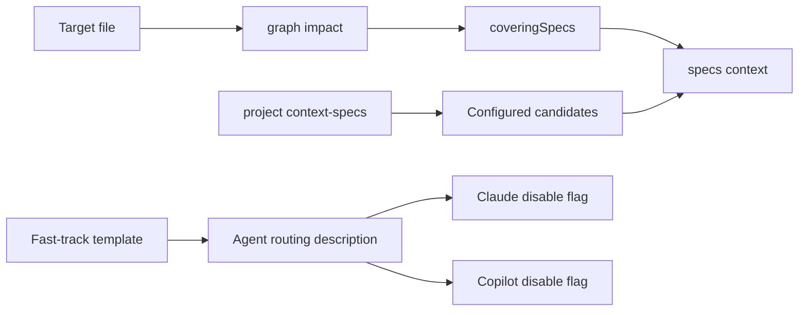

# Design: fasttrack-context-resolution

## Non-goals

- Do not add a new cross-agent `manualOnly` frontmatter field or a central runtime gate; only Claude and Copilot expose native model-invocation controls.
- Do not change public APIs, storage, or skill installation locations.

## Affected areas

- `packages/skills/templates/skills/specd-fasttrack/SKILL.md.tpl`: define file-first governing-spec discovery and an explicit manual-only activation boundary. Markdown templates are not graph-indexed; its source contract is covered by `skills:skill-templates-source`.
- `packages/skills/test/template-workflow.spec.ts`: assert graph-impact ordering, compiled-context-only reads, and manual-only wording.
- `skillFrontmatter` in each `packages/plugin-agent-*/src/domain/frontmatter/index.ts`: prepend the fast-track routing description with the explicit-invocation restriction. Graph search identifies one exported map in each adapter; these are independent workspace-local declarations with no shared signature change.
- `packages/plugin-agent-*/test/install-skills.spec.ts`: assert the rendered frontmatter values. Claude and Copilot additionally assert their native disable flags.

## New constructs

None.

## Approach

1. In fast-track discovery, run `graph impact --file <workspace:path> --direction dependents --format toon` first. Read `coveringSpecs`; an empty result is valid and does not imply that any workspace spec applies.
2. Resolve configured project/workspace candidates with `project context-specs`; load only applicable covering or candidate specs through `specs context --follow-deps`. Never instruct `specs show` or `specs resolve-path` for this purpose.
3. Add an activation boundary to the shared template requiring an explicit `/specd-fasttrack` user invocation and directing ordinary work to `/specd`.
4. Update all agent routing descriptions with the same manual-only prefix. Set `disable_model_invocation: true` for Claude and `disable-model-invocation: true` for Copilot; do not emit unsupported fields for Codex, OpenCode, or Agent Skills standard.

## Key decisions

- **Graph coverage is primary evidence** → `coveringSpecs` is tied to the target file and can be empty. **Rejected:** inferring applicability solely from workspace membership.
- **Compiled context is the only fast-track spec reader** → agents receive dependency-aware semantic context. **Rejected:** raw `specs show`.
- **Description plus template boundary is cross-runtime** → descriptions are read by routing before template contents. **Rejected:** a new non-standard field that unsupported runtimes would ignore.
- **Native disable flags only where supported** → preserves each adapter's frontmatter contract.

## Trade-offs

- Unsupported runtimes cannot technically block automatic selection; the routing description and template instruction are the portable guard.
- Markdown template files are outside code-graph indexing; their contract and tests provide the validation surface.

## Spec impact

- `skills:skill-templates-source`: no dependent spec contract is invalidated; the new requirement extends the existing fast-track template contract.
- Each `plugin-agent-*:plugin-agent` spec gains an adapter-local routing requirement. No changed dependency relation or downstream spec requires a delta.

## Dependency map



```
┌─────────────┐     ┌──────────────┐
│ target file │────▶│ graph impact │────▶ coveringSpecs
└─────────────┘     └──────────────┘            │
                                                ▼
project context-specs ───▶ configured IDs ─▶ specs context

fast-track template ───▶ routing description ───▶ Claude/Copilot flags
```

## Testing

- Extend `packages/skills/test/template-workflow.spec.ts` to assert graph-impact-first discovery, `coveringSpecs` empty handling, `specs context` use, no `specs show`, and the activation boundary.
- Extend each plugin install test to assert the manual-only description; Claude and Copilot tests also assert their respective native disable field.
- Run `pnpm --filter @specd/skills test -- template-workflow.spec.ts` and each `pnpm --filter @specd/plugin-agent-<name> test -- install-skills.spec.ts` suite.
- Manual verification: install each agent plugin into a temporary project, inspect the generated fast-track `SKILL.md`, confirm the manual-only description in every runtime, and confirm native disable fields only in Claude/Copilot.
- No `docs/` update is needed: this is an internal skill-template and adapter metadata contract; existing tests are the user-facing verification surface.

## Open questions

None.
