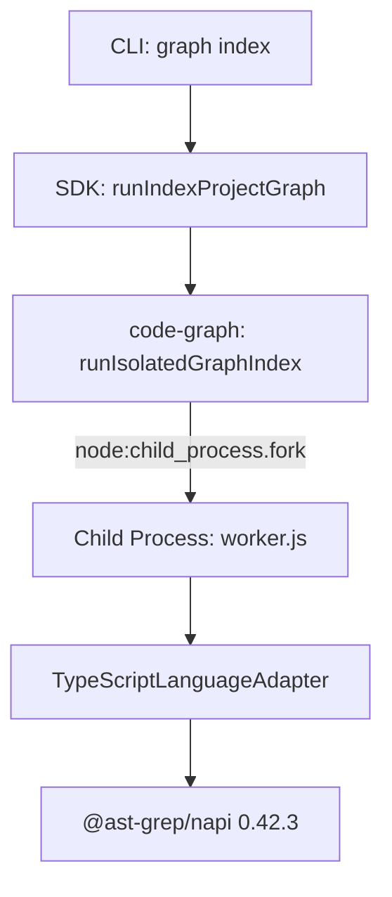

# Design: stabilize-isolated-index-worker

## Summary

Stabilize the isolated graph index worker lifecycle during forced and incremental indexing by upgrading the native parser dependency `@ast-grep/napi` from 0.41.1 to `^0.42.1` (resolving to 0.42.3) in `@specd/code-graph`. This eliminates a post-indexing native `SIGSEGV` crash during process finalization and teardown without altering supervisor crash containment, IPC protocols, or TypeScript indexer logic. Durable regression coverage is established via a publish-shaped subprocess teardown integration test fixture.

## Affected areas

- `packages/code-graph/package.json`
  - **Construct**: Package dependencies manifest.
  - **Changes**: Update `@ast-grep/napi` dependency version constraint from `0.41.1` to `^0.42.1`.
  - **Impact & Risk**: Direct dependency of `@specd/code-graph` for AST extraction across TypeScript/JavaScript source files. Low risk since 0.42.3 provides backwards-compatible AST query APIs while fixing upstream V8 finalizer concurrency crashes.
- `pnpm-lock.yaml`
  - **Construct**: Package lockfile.
  - **Changes**: Update resolved `@ast-grep/napi` version and associated platform-specific native binary packages (e.g., `@ast-grep/napi-darwin-arm64`, `@ast-grep/napi-linux-x64-gnu`, etc.) to 0.42.3.
  - **Impact & Risk**: Lockfile integrity across supported operating systems.
- `packages/code-graph/test/infrastructure/isolated-index-worker/dist.spec.ts`
  - **Construct**: Published worker distribution test suite.
  - **Changes**: Add an integration test exercising a heavy native AST parse and traversal workload inside the forked subprocess, verifying terminal result delivery and natural zero-exit. Allow configurable timeout via `settlesWithin(promise, timeoutMs)`.
  - **Impact & Risk**: Confined to test suite. Risk: LOW.

## New constructs

- `packages/code-graph/test/fixtures/isolated-index-worker/built-napi-teardown-task.mjs`
  - **Location**: `packages/code-graph/test/fixtures/isolated-index-worker/built-napi-teardown-task.mjs`
  - **Signature**:
    ```js
    export async function runGraphIndexTask(input, emitProgress)
    ```
  - **Responsibility & Invariants**: Standalone ESM task fixture executing a simulated forced index workload (parsing and traversing 1,200 TypeScript source files via `@ast-grep/napi`, accumulating and releasing `SgRoot` instances, emitting progress, returning a valid payload). Invariant: child must exit naturally with code 0 upon return without crashing.
  - **Wiring & Dependencies**: Forked by `runIsolatedGraphIndex` in `dist.spec.ts` using the built ESM child entrypoint.

## Data models & Contracts

No changes to existing data models or interface contracts. The `IsolatedGraphIndexRunner` application port, `runIsolatedGraphIndex` composition function, IPC message envelopes, and typed error hierarchy (`SpecdCodeGraphError`, `GraphIndexWorkerExitError`) remain completely unchanged.

## Approach & Execution flow

1. **Reproduction & Root Cause Verification**:
   - In forced indexing mode (`--force`), the indexer processes all workspace files, causing the TypeScript adapter to accumulate native `SgRoot` references in `IndexSession` (`napi-keepalive`).
   - In `@ast-grep/napi` 0.41.1, releasing roots triggers an upstream V8 finalizer concurrency crash (`SIGSEGV` / exit 139) during natural process teardown after the result is returned.
   - The supervisor detects abnormal child termination and reports `GraphIndexWorkerExitError`.
2. **Dependency Resolution**:
   - Upgrade `@ast-grep/napi` to `^0.42.1` in `packages/code-graph`.
   - Update `pnpm-lock.yaml` with resolved native platform packages.
3. **Durable Regression Test**:
   - In `built-napi-teardown-task.mjs`, generate and parse 1,200 TypeScript AST structures using native `@ast-grep/napi`.
   - Execute the task through the supervisor's `runIsolatedGraphIndex` in `dist.spec.ts`.
   - Assert that the supervisor resolves the result and the child exits with code 0 without signal failure.

## Error handling & Edge cases

- **Abnormal Child Exit**: The supervisor's existing crash-containment boundary remains active: if any child crashes or exits non-zero, `GraphIndexWorkerExitError` is thrown, releasing the graph lock.
- **Large AST Workloads**: Heavy parse sessions complete and tear down safely under the upgraded native bindings.
- **Slow CI Environments**: Regression test includes an explicit 10-second timeout budget in `settlesWithin` to prevent test flakiness on resource-constrained runners.

## Key decisions

- **Upgrade `@ast-grep/napi` vs local workarounds**:
  - _Decision_: Upgrade to upstream `^0.42.1` (resolving 0.42.3) containing the native SIGSEGV fix.
  - _Rejected_: In-process indexing fallback (violates crash isolation contract), automatic supervisor retries (masks deterministic faults), or weakening the clean-exit requirement (accepting a result before a native crash).
- **Preserve Keepalive Retention**:
  - _Decision_: Keep the existing `napi-keepalive` array in `IndexSession` since it guards against live-traversal finalizer races.

## Trade-offs

- [Lockfile platform package churn] → Normal pnpm behavior for multi-platform native NAPI bindings; verified with full monorepo typecheck and package test suites.

## Spec impact

- `code-graph:isolated-index-worker`: Existing requirements already mandate clean child exit; covered by no-op delta.
- `code-graph:language-adapter`: Requirements for language parsing and symbol extraction remain satisfied; covered by no-op delta.

## Dependency map



```
┌────────────────────────┐
│  cli: graph index      │
└───────────┬────────────┘
            │
            ▼
┌────────────────────────┐
│  SDK orchestration     │
└───────────┬────────────┘
            │
            ▼
┌────────────────────────┐
│  Supervisor (host)     │
└───────────┬────────────┘
            │ fork
            ▼
┌────────────────────────┐
│  Worker (child)        │
│  @ast-grep/napi 0.42.3 │
└────────────────────────┘
```

## Migration / Rollback

No database migrations or configuration changes required. Rollback, if ever needed, consists of downgrading the package dependency in `packages/code-graph/package.json` and reinstalling lockfile entries.

## Testing

**Automated tests**:

- Integration test: `packages/code-graph/test/infrastructure/isolated-index-worker/dist.spec.ts` with `built-napi-teardown-task.mjs` verifying clean subprocess exit after 1,200 AST parses.
- Full code-graph suite: `pnpm --filter @specd/code-graph test` (59 files, 713 tests).
- Full CLI suite: `pnpm --filter @specd/cli test` (82 files, 883 tests).
- Monorepo typecheck: `pnpm typecheck`.

**Manual verification**:

- Forced index execution: `node packages/cli/dist/index.js graph index --force --format toon` completing with 1,391 files and exit code 0.
- Incremental index execution: `node packages/cli/dist/index.js graph index --format toon` completing with exit code 0.

## Open questions

None.
