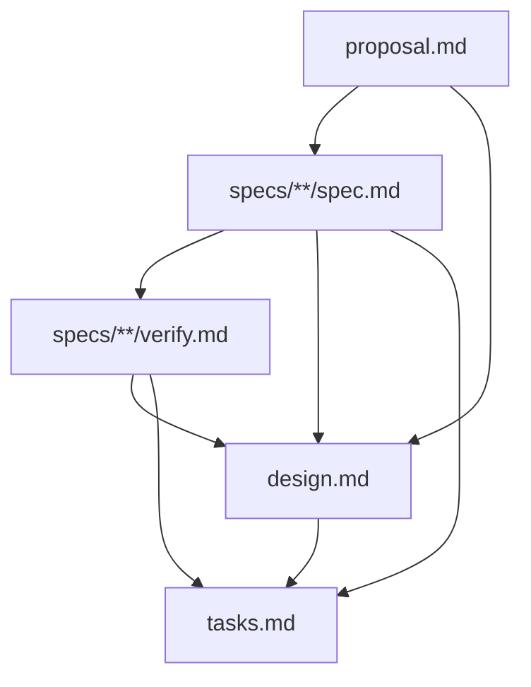

# Design: init-schema-std-and-metapackage-specs

## Architecture and design

This change establishes the formal specification suites for `@specd/schema-std` and `@specd/specd` (metapackage), aligns the canonical `schema.yaml` artifact DAG so that `tasks` explicitly requires `specs`, `verify`, and `design`, and verifies that all templates, metadata extractors, and release workflows conform to the newly defined requirements.

### Target Architecture

1. **`@specd/schema-std` (`packages/schema-std`)**:
   - `schema.yaml`: Contains the canonical schema definition, DAG invariants, workflow lifecycle states (`drafting` ... `archiving`), artifact validation rules, and metadata extractors.
   - `templates/`: Houses standard markdown templates (`proposal.md`, `design.md`, `tasks.md`, `spec.md`, `verify.md`) adhering to structural section contracts and placeholder standards.
   - Specifications under `specs/schema-std/`:
     - `schema-std:standard-schema`: Governs `schema.yaml`, artifact contracts, validations, lifecycle hooks, and metadata extraction.
     - `schema-std:templates`: Governs markdown template requirements, section hierarchies, and guidance comments.

2. **`@specd/specd` (`packages/specd`)**:
   - Acts as the distribution metapackage bundling all `@specd/*` modules with `workspace:*` dependencies.
   - Orchestrates releases via `@changesets/cli` and `dev/scripts/` prepublish checks.
   - Specifications under `specs/specd/`:
     - `specd-metapackage:metapackage`: Governs umbrella dependency bundling, version synchronization, and pure aggregator invariants.

3. **Schema DAG Invariant Alignment**:
   - Update `packages/schema-std/schema.yaml` `tasks` entry to `requires: [specs, verify, design]`. This ensures implementation task checklists cannot be drafted before verification criteria are fully formulated and validated.

## Affected areas

- **`packages/schema-std/schema.yaml`**
  - Construct: `artifacts[id=tasks].requires`
  - Change: Update `requires` from `[specs, design]` to `[specs, verify, design]`.
  - Impact & Risk: Low risk. Enforces the intended workflow sequence where `verify` precedes `tasks`.
- **`specs/schema-std/standard-schema/`**
  - Construct: New spec suite (`spec.md`, `verify.md`).
  - Change: Define formal requirements and verification scenarios for `schema.yaml`.
- **`specs/schema-std/templates/`**
  - Construct: New spec suite (`spec.md`, `verify.md`).
  - Change: Define formal requirements and verification scenarios for `templates/`.
- **`specs/specd/metapackage/`**
  - Construct: New spec suite (`spec.md`, `verify.md`).
  - Change: Define formal requirements and verification scenarios for metapackage bundling and release flow.
- **`docs/` updates**
  - Review and align `docs/schemas/schema-format.md` if necessary to ensure documented DAG examples match the updated `tasks` prerequisites.

## New constructs

No new runtime TypeScript source classes, interfaces, or functions are introduced in this change. All additions consist of schema YAML configurations, markdown template alignments, and specification suite files.

## Data models & Contracts

### Canonical Artifact DAG Contract (`packages/schema-std/schema.yaml`)

```yaml
artifacts:
  - id: proposal
    scope: change
    requires: []
  - id: specs
    scope: spec
    requires:
      - proposal
  - id: verify
    scope: spec
    requires:
      - specs
  - id: design
    scope: change
    requires:
      - proposal
      - specs
      - verify
  - id: tasks
    scope: change
    hasTasks: true
    requires:
      - specs
      - verify
      - design
```

### Template File Mapping Contract (`packages/schema-std/templates/`)

| Template File           | Artifact ID | Scope    | Target Output                        |
| ----------------------- | ----------- | -------- | ------------------------------------ |
| `templates/proposal.md` | `proposal`  | `change` | `{{change.path}}/proposal.md`        |
| `templates/spec.md`     | `specs`     | `spec`   | `{{change.path}}/specs/**/spec.md`   |
| `templates/verify.md`   | `verify`    | `spec`   | `{{change.path}}/specs/**/verify.md` |
| `templates/design.md`   | `design`    | `change` | `{{change.path}}/design.md`          |
| `templates/tasks.md`    | `tasks`     | `change` | `{{change.path}}/tasks.md`           |

## Approach & Execution flow

1. **Update `packages/schema-std/schema.yaml`**:
   - Edit `artifacts[id=tasks].requires` to include `specs`, `verify`, and `design`.
2. **Review `docs/schemas/` Documentation**:
   - Inspect `docs/schemas/schema-format.md` to ensure any DAG diagrams or configuration examples reflect the updated `tasks` prerequisites.
3. **Validate Specs and Schemas**:
   - Run `node packages/cli/dist/index.js specs validate` to ensure all 276+ specs in the workspace remain completely valid.
4. **Execute Monorepo Quality Gates**:
   - Run `pnpm typecheck` across all workspace packages.
   - Run `pnpm lint` across the monorepo.
   - Run `pnpm test` across core, cli, and code-graph test suites.

## Error handling & Edge cases

- **DAG Cycle Detection**: Validated by core's `resolveArtifactDag` topological sorter. Any circular dependency in `schema.yaml` fails change initialization and validation.
- **Missing Prerequisite Artifact**: If an agent or user attempts to generate `tasks.md` before `verify.md` is complete, core's validation gate blocks the transition with a structural blocker (`missing prerequisite: verify`).
- **Template Placeholder Parsing**: When templates are instantiated, unfilled placeholders or malformed markdown comments are flagged during artifact validation.

## Key decisions

- **Require `verify` for `tasks`**: In a spec-driven workflow, task decomposition must map directly to both spec requirements and concrete acceptance scenarios in `verify.md`. Making this dependency explicit in `schema.yaml` eliminates gaps between verification planning and task execution.
- **Separate `standard-schema` and `templates` specs**: Distinguishing between schema engine rules (`schema.yaml`) and template file contracts (`templates/*.md`) allows independent evolution and clearer requirement traceability.
- **Metapackage as Pure Aggregator**: Enforce the architectural invariant that `@specd/specd` contains zero business logic, delegating all domain logic and execution to bundled packages while serving as a release coordination point.

## Trade-offs

- _[Stricter DAG requirement for tasks]_ → Guarantees that verification criteria are always authored and validated before breaking down implementation tasks, preventing out-of-order execution.

## Spec impact

- Initializes coverage for `schema-std:standard-schema`, `schema-std:templates`, and `specd-metapackage:metapackage`.
- No existing specs are broken or modified.

## Dependency map



```
┌─────────────┐
│  proposal   │
└──────┬──────┘
       │
       ▼
┌─────────────┐
│    specs    │
└──────┬──────┘
       │
       ▼
┌─────────────┐
│   verify    │
└──────┬──────┘
       │
       ▼
┌─────────────┐
│   design    │
└──────┬──────┘
       │
       ▼
┌─────────────┐
│    tasks    │
└─────────────┘
```

## Migration / Rollback

This change is non-breaking and backwards-compatible with existing changes and specs. In case of unexpected issues, `schema.yaml` can be reverted to its previous `requires` state.

## Testing

### Automated Tests

1. **Monorepo unit and integration tests**:
   ```bash
   pnpm test
   ```

   - Covers core schema parsing, DAG topological resolution, validation rules, and CLI execution.
2. **Monorepo typecheck**:
   ```bash
   pnpm typecheck
   ```
3. **Monorepo linting**:
   ```bash
   pnpm lint
   ```
4. **Spec validation across the entire workspace**:
   ```bash
   node packages/cli/dist/index.js specs validate
   ```

   - Validates all workspace specs against the updated schema rules.

### Manual / E2E Verification

1. **Validate change artifacts within the change directory**:
   ```bash
   node packages/cli/dist/index.js changes validate init-schema-std-and-metapackage-specs --format text
   ```

   - Assert all artifacts pass without errors.
2. **Check change status**:
   ```bash
   node packages/cli/dist/index.js changes status init-schema-std-and-metapackage-specs --format text
   ```

   - Assert `tasks` prerequisite shows `specs`, `verify`, and `design`.

## Open questions

None.
