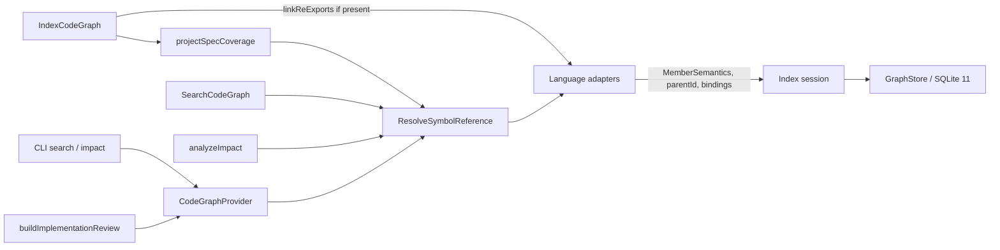

# Design: language-agnostic-member-symbol-references

## Non-goals

- Do not emit new `IMPORTS` or `CALLS` edges for `obj.method()`, dynamic import, or Go relations. Existing import resolution stays.
- Do not index markdown, YAML, JSON, templates, or `package.json` as code. `FILE_NOT_INDEXED` stays.
- Do not rewrite implementation sidecars or spec-lock symbol strings. `@specd/sdk barrel` and `Integration (real kernel)` stay unresolved because they name nothing.
- Do not add `cli:change-implementation` or `code-graph:workspace-integration` requirement text.
- Do not add an alias table or a package field on `LogicalSymbol`. `qualified_name` is a stored exact-match spelling, not a second canonical id.
- Do not keep `MemberForm` or the old six-field logical id as a second canonical model.
- Do not run every language adapter when a text query has no file, public surface, or explicit language.
- Do not change CLI flags, exit codes for missing symbols (still 0), or output formats.

## Affected areas

Blast radius of the four core files (`symbol-reference.ts`, `index-code-graph.ts`, `schema.ts`, `typescript-language-adapter.ts`) is **CRITICAL**: 96 direct dependents, 235 indirect, 325 transitive, 99 affected files. Call sites compile against the new `MemberSemantics` field. There is no dual-read.

### Domain model

`packages/code-graph/src/domain/value-objects/symbol-reference.ts`

- Remove `MemberForm` and `isMemberForm`.
- `LogicalSymbol.memberForm` becomes `memberSemantics: MemberSemantics | undefined`.
- `createLogicalSymbol` / `parseLogicalSymbol` use the versioned encoding below. Parsing an old `logical|` id with six fields returns `undefined`.
- `ResolveSymbolReferenceInput.memberForm` becomes `memberSemantics?: MemberSemantics`.
- `LogicalSymbol` gains `qualifiedName: string | undefined`. It is not encoded in the canonical id. Absent when `ownerId` is absent. Present members store the generic dotted path.

`packages/code-graph/src/domain/value-objects/language-adapter.ts`

- Add optional `linkReExports` and `parseSymbolReference` / `renderSymbolReference` on `LanguageAdapter`. No I/O in `parseSymbolReference` or `renderSymbolReference`. `linkReExports` may call existing manifest readers.

`packages/code-graph/src/domain/ports/graph-store.ts`

- `LogicalSymbolLookup.memberForm` becomes the four optional axes `memberKind`, `memberDispatch`, `memberAccessor`, `nativeKind`. An omitted axis is a SQL `NULL` match on that column only when the caller passed `undefined` meaning "do not filter". A caller that sets an axis filters equality, including matching only rows whose column equals that value. A stored `NULL` does not match a provided axis.

### Adapters

- `packages/code-graph/src/infrastructure/tree-sitter/typescript-language-adapter.ts`
- `packages/code-graph/src/infrastructure/tree-sitter/python-language-adapter.ts`
- `packages/code-graph/src/infrastructure/tree-sitter/go-language-adapter.ts`
- `packages/code-graph/src/infrastructure/tree-sitter/php-language-adapter.ts`
- `packages/code-graph/src/infrastructure/tree-sitter/reference-fact-helpers.ts`

Each adapter emits `MemberSemantics` instead of `MemberForm`, sets `SymbolNode.parentId` while analyzing, and implements `parseSymbolReference` / `renderSymbolReference` for the syntax it proves. Only the TypeScript adapter implements `linkReExports`. `resolutionManifests()` stays and still performs no I/O.

Delete from `packages/code-graph/src/application/use-cases/index-code-graph.ts`:

- `linkTypeScriptReExports`
- `TypeScriptReExport` and `TypeScriptReExportState`
- `assignParentIds` and the set `typescript`, `tsx`, `javascript`, `jsx`, `python`, `php`

The indexer calls `adapter.linkReExports` when the method exists. It does not read `parserState.kind`.

### Resolution, coverage, search, impact

- `packages/code-graph/src/application/use-cases/resolve-symbol-reference.ts` — `Tipo.miembro` and `Tipo::miembro` match stored `qualified_name` without an adapter. Other human text still needs a file, surface, or language.
- `packages/code-graph/src/application/services/project-spec-coverage.ts` — one call into `ResolveSymbolReference` per symbol link. `symbol.name === storedString` is removed.
- `packages/code-graph/src/application/use-cases/search-code-graph.ts` — extract qualified tokens, exact-match them, and still run the full-query symbol search without removing tokens.
- `packages/code-graph/src/domain/services/analyze-impact.ts` and traversal entry — start id comes from the resolver. Traversal stays id-based.
- `packages/code-graph/src/composition/create-code-graph-provider.ts` and `code-graph-provider.ts` — the registry built for indexing is the same object passed into resolution.
- `packages/cli/src` graph search and graph impact commands — pass the selector string through. No delimiter split, no SQLite, no `package.json`.
- `packages/sdk/src/orchestration/build-implementation-review.ts` — `requested` stays the stored string. No parse.

### SQLite

- `packages/code-graph/src/infrastructure/sqlite/schema.ts` — `SQLITE_SCHEMA_VERSION` from 10 to 11.
- `packages/code-graph/src/infrastructure/sqlite/sqlite-graph-database.ts` — inserts, selects, and the member lookup index use the new columns. No `ALTER TABLE`.
- `packages/code-graph/src/infrastructure/sqlite/sqlite-worker.ts` and `sqlite-worker-protocol.ts` — row shape matches the new columns.

### Documentation

Update `docs/adr/0024-logical-symbol-resolution.md` so the logical-symbol bullet says member semantics (`kind`, `dispatch`, `accessor`, optional `nativeKind`), stored `qualified_name`, and the versioned id `logical|2|...`. Remove "member-form". State that schema 12 replaces `member_form`, stores `qualified_name`, and that derived storage is rebuilt. No other docs mention `MemberForm`.

## New constructs

Defined in `packages/code-graph/src/domain/value-objects/symbol-reference.ts` and exported from `src/index.ts` and `src/public.ts`.

```ts
export const MemberKind = {
  Method: 'method',
  Property: 'property',
  Field: 'field',
  Constructor: 'constructor',
  Signature: 'signature',
  Indexer: 'indexer',
  Operator: 'operator',
  Event: 'event',
  Other: 'other',
} as const
export type MemberKind = (typeof MemberKind)[keyof typeof MemberKind]

export const MemberDispatch = {
  Instance: 'instance',
  Static: 'static',
} as const
export type MemberDispatch = (typeof MemberDispatch)[keyof typeof MemberDispatch]

export const MemberAccessor = {
  Get: 'get',
  Set: 'set',
} as const
export type MemberAccessor = (typeof MemberAccessor)[keyof typeof MemberAccessor]

export interface MemberSemantics {
  readonly kind: MemberKind
  readonly dispatch?: MemberDispatch
  readonly accessor?: MemberAccessor
  readonly nativeKind?: string
}

export interface SymbolPathSegment {
  readonly name: string
  readonly role: 'namespace' | 'type' | 'member'
}

export interface StructuredSymbolReference {
  readonly segments: readonly SymbolPathSegment[]
  readonly memberSemantics?: MemberSemantics
  readonly space?: SymbolSpace
}

export interface ParsedSymbolReference {
  readonly candidates: readonly StructuredSymbolReference[]
}
```

Invariants: a non-member logical symbol has `memberSemantics === undefined`. A member that is proved has `kind`. `nativeKind` is set only when that adapter's grammar proves it. `accessor` is set only for getters and setters. Instance getter: `{ kind: 'property', dispatch: 'instance', accessor: 'get' }`. Static getter: `{ kind: 'property', dispatch: 'static', accessor: 'get' }`. Constructor: `{ kind: 'constructor' }` with no dispatch and no accessor. Instance method: `{ kind: 'method', dispatch: 'instance' }`.

`LanguageAdapter` gains:

```ts
parseSymbolReference?(text: string): ParsedSymbolReference
renderSymbolReference?(symbol: LogicalSymbol, ownerPath: readonly string[]): {
  readonly generic: string
  readonly native?: string
}
linkReExports?(
  session: IndexSession,
  packageToWorkspace: ReadonlyMap<string, string>,
): { readonly publicBindings: readonly PublicBinding[]; readonly steps: readonly ResolutionStep[] }
```

`isExactLaneQuery(query: string): boolean` lives in `packages/code-graph/src/domain/services/exact-lane-query.ts`. It returns true when `query.startsWith('logical|2|')`, or `query.includes('::')`, or `query` matches `/^[A-Za-z_$][\w$]*\.[A-Za-z_$][\w$]*$/`. It does not resolve a member. Search applies it to each whitespace token. Impact applies it to the whole selector. The CLI does not call it.

`qualifiedLookupText(token: string): string | undefined` lives beside it. For a token that is `Tipo::miembro` (exactly one `::`, both sides identifiers), it returns the same text with `::` replaced by `.`. For a token that already matches the dotted pattern, it returns that token. Otherwise it returns `undefined`. It does not split a single `:`.

## Data models & Contracts

### Canonical id

Nine length-prefixed fields after the literal prefix `logical|2|`: workspace, surface, name, space, ownerId, memberKind, memberDispatch, memberAccessor, nativeKind. Absent optional values are empty strings. The encoding is the same length-prefix scheme already used (`<decimalLength>:<value>` joined by `|`). `.` and `::` are never separators. `parseLogicalSymbol` returns `undefined` unless the prefix is `logical|2|` and every enum field is empty or a known value.

Qualified display text is `logical_symbols.qualified_name`: walk `ownerId` to root simple names plus `name`, joined with `.`. A symbol with no owner stores `NULL`. The same string may still be appended to `symbol_fts.search_text` for discovery. That FTS field is not the exact key. `symbols.search_text` stays the expanded bare name and is not read as identity.

### SQLite version 12

`logical_symbols` columns: `id`, `workspace`, `surface`, `name`, `space`, `owner_id`, `member_kind`, `member_dispatch`, `member_accessor`, `native_kind`, `qualified_name`. The last five are nullable `TEXT`. `member_form` is gone. `CREATE INDEX idx_logical_symbols_qualified_name ON logical_symbols(qualified_name)`.

`idx_logical_symbols_member_lookup` is `(workspace, surface, name, space, owner_id, member_kind, member_dispatch, member_accessor, native_kind)`.

Unchanged columns: `public_bindings(id, surface, exported_name, space, target_id)`, `resolution_steps`, `symbols.parent_id`, `symbols.search_text`, `logical_declarations`, `local_bindings`, `index_coverage`, `relations`, `symbol_fts(id, search_text, comment)`.

`meta.schemaVersion` must equal `12`. Any other stored value, including 10 and 11, throws `GraphSchemaIncompatibleError`. Recovery reason stays `SCHEMA_INCOMPATIBLE`, which recreates the derived database on `graph index`. No `ALTER TABLE`. Opening version 12 does not rebuild.

### Public binding

`surface` is the re-exporting file id (`sdk:src/index.ts`). `exportedName` is the name on that file (`runIsolatedGraphIndex`, or the alias if `export { A as B }`). `targetId` is the logical id already published by the entry file. `space` is copied from that route. Default exports are not copied by `export *`.

### Coverage request

For a symbol implementation link `{ file, symbol }`, the coverage caller builds:

```ts
{
  workspace: workspaceOf(file),
  requested: symbol,
  filePath: file,
  publicSurface: file,
}
```

Exactly one `resolved` logical id writes `COVERS_SYMBOL`. `ambiguous` writes diagnostic `SYMBOL_AMBIGUOUS`. `unresolved` or `missing` writes `SYMBOL_NOT_FOUND`. The file is not rewritten to the declaring file.

## Approach & Execution flow

### 1. Analyze

`analyzeFile` sets `SymbolNode.parentId` when the syntax has a declaring construct. Top-level declarations omit it. Go methods set `parentId` from the receiver. The indexer does not call `assignParentIds`.

Member facts use `MemberSemantics`. A required owner that is missing or cyclic is dropped. No synthetic owner id is stored.

### 2. Package map

The indexer still builds `packageName → workspaceName` by calling `getPackageIdentity` on each registered adapter. The first non-`undefined` identity wins. The indexer does not open `package.json`, `exports`, `main`, `go.mod`, `pyproject.toml`, or `composer.json`.

### 3. Re-export linking

After declarations and same-file public bindings exist in the session, and before spec coverage:

```ts
for (const adapter of registry.getAdapters()) {
  const linked = adapter.linkReExports?.(session, packageToWorkspace)
  if (linked) session.addReferenceFacts(linked)
}
```

TypeScript `linkReExports`:

1. Read re-export routes from that adapter's own analysis state. The indexer never sees those routes.
2. Relative specifier: existing `resolveRelativeImportPath`. Keep a candidate only when `session.getFileId` exists. Two indexed candidates (`file.ts` and `file/index.ts`) produce no binding.
3. Non-relative specifier: `resolvePackageFromSpecifier`, then `packageToWorkspace`, then that workspace's `package.json` `exports` or `main`. Map `dist/X.js` to the indexed source `src/X.ts` (then `src/X.tsx`, then `src/X/index.ts`) under the target workspace prefix. `@specd/code-graph` uses `exports["."]` → `dist/public.js` → `code-graph:src/public.ts`. `@specd/code-graph/internal` uses `./internal` → `dist/index.js` → `code-graph:src/index.ts`. A path under the importer such as `sdk:src/@specd/code-graph.ts` is not a candidate.
4. Copy the entry file's proven public bindings onto the re-exporting file. Named re-export uses `importedName` and writes `exportedName` (alias included). Star re-export copies every non-default binding. If the entry file has no binding yet, use the same-file declaration with that name, one logical id only.
5. Do not call `findSymbolsByName(...)[0]`.
6. Repeat passes until a pass adds nothing, bounded by the session file count, so a barrel that re-exports another barrel settles. A cycle writes no extra binding.

### 4. Persist

`writeReferenceFacts` stores adapter facts, then `projectSpecCoverage` runs. Coverage therefore sees the bindings from step 3. When a logical symbol is written, if it has an owner, set `qualifiedName` by walking `ownerId` to the root simple names and joining them with `.` plus the member name. A symbol with no owner stores `qualifiedName` as absent. Do not write that spelling only into `symbol_fts.search_text`.

### 5. Resolve

Order:

1. If `requested` parses as `logical|2|...`, return that logical symbol or `missing`.
2. If `qualifiedLookupText(requested)` is defined, load every logical symbol whose `qualified_name` equals that text. A supplied `filePath` or `publicSurface` keeps only symbols visible in that file. One remaining symbol: `resolved`. Several: `ambiguous` with every match. Zero: `unresolved`. Do not select an adapter for this branch.
3. If `requested` is a location-backed symbol id, return its current logical symbol.
4. If other human text and there is an explicit language, or `filePath` / `publicSurface` is an indexed file, select that file's adapter and `parseSymbolReference`. Zero candidates: continue as a simple name. One candidate: resolve owner segments, then the member under that owner, using space and `memberSemantics` when present. Several candidates: `ambiguous`.
5. If other human text and none of those contexts exist: `unresolved`. Do not loop adapters.
6. Otherwise the existing precedence: declaration in the addressed file, public binding on `publicSurface` plus exported name plus space, local binding, hierarchy. File path alone does not select a binding. A binding target may live in another workspace.
7. Same simple name in value and type with no `space`: `ambiguous`.
8. Owner exists and the member does not: `unresolved`. Do not search other owners for that member name.

### 6. Search and impact

Search always calls `store.searchSymbols` with the original query. No token is removed. Full-text search and bare-name identity stay as they are, including per-token equality, prefix, suffix, and substring against `symbols.name`.

Search also splits the original query on whitespace. Each token for which `isExactLaneQuery` is true and which is a canonical id or `qualifiedLookupText` is defined is an extra exact lookup. Canonical ids use `findLogicalSymbolsByIds`. Dotted and `::` tokens use `qualified_name` equality and include every match. Those hits are tier `exact-logical-identity` and sort before the normal hits. Duplicate logical ids collapse. If none of those tokens match, the normal result is unchanged. A bare token such as `execute` is not an exact qualified lookup. `GetStatus.execute otra cosa` therefore returns the exact member and still returns the full-query hits for the whole string.

Impact uses the whole selector. If the selector is `Tipo.miembro` or `Tipo::miembro`, look up `qualified_name`. One hit: traverse that id. Several hits: print every candidate (`N symbols exactly match "..."`) and do not traverse. Zero hits: `No symbol found matching "<selector>".`, exit 0, and do not search the terminal name. Bare `validate` with three declaration matches still analyzes each. A selector that includes an indexed file uses that file as `filePath` and `publicSurface` and filters the qualified matches.

### 7. SDK review

`buildResolutionRequests` sets `requested` to the stored symbol string and `filePath` to the link file when present. It does not split `.` or `::` and does not read `packageToWorkspace`. Provider `unresolved` or `ambiguous` is copied into the review row. Order matches the stored links. One batch call.

## Error handling & Edge cases

- Old logical ids do not resolve. Callers see `missing` until reindex. No thrown parse error on the public resolver; `parseLogicalSymbol` returns `undefined`.
- Version other than 12: `GraphSchemaIncompatibleError`. Message text is `schema ${current} is incompatible with expected 12`. No `ALTER TABLE`. Version 12 open does not rebuild. Versions 10 and 11 rebuild.
- Two entry files, unknown package, missing export name, cyclic re-export: no binding, no throw.
- `@specd/sdk barrel` on `sdk:test/barrel.spec.ts` and `Integration (real kernel)`: `SYMBOL_NOT_FOUND`. They are not package lookups.
- Markdown and `package.json` links: `FILE_NOT_INDEXED`. No adapter call.
- Empty selector on impact stays `INVALID_GRAPH_SELECTOR`.
- Value/type pairs stay `SYMBOL_AMBIGUOUS` after `MemberForm` is removed.

## Key decisions

- **MemberSemantics replaces MemberForm in one revision.** A single axis cannot store instance and getter together. Rejected: deprecation window and dual columns.
- **Id prefix `logical|2|`.** Old rows are discarded by the schema rebuild. Rejected: wrapping the old id.
- **Adapters emit re-export bindings.** `IndexCodeGraph` only merges the returned facts. Rejected: a TypeScript branch in the indexer, and `findSymbolsByName()[0]`.
- **Schema 12, no ALTER.** `CREATE TABLE IF NOT EXISTS` cannot add `qualified_name` to a version 11 file or drop `member_form` from version 10. Rejected: in-place migration.
- **Unanchored `Tipo.miembro` and `Tipo::miembro` match `qualified_name`.** Every equal row is returned. Rejected: running every adapter, and leaving the member unproven because FTS splits on `.`.
- **Search keeps the full query.** Qualified tokens are an extra exact lookup. The original string still goes through FTS and bare-name identity. Rejected: deleting the qualified token from the FTS query.
- **Exact lane detection is per whitespace token for search, and the whole selector for impact.** Resolution of that spelling is equality, not an adapter parse.
- **This change owns owner and member identity.** Ranges and `declarationText` stay with `code-graph-symbol-semantic-context`.
- **Qualified path is stored as `qualified_name`.** It is rebuilt from `ownerId`. Search text may repeat it and is not the exact key. Rejected: alias table, and using `symbols.search_text` as the key.

## Trade-offs

- `graph impact --symbol EditChange.execute` without a file analyzes that one member when only one `qualified_name` matches, and lists every match when several do. A missing member still prints not-found and does not analyze other `execute` symbols.
- Re-export linking can take several adapter passes on deep barrels. Mitigation: stop when a pass adds nothing, cap at the session file count.
- `linkReExports` on the TypeScript adapter reads `package.json` of the target workspace. That I/O stays in the adapter, which already reads manifests in `getPackageIdentity`. The domain interface stays optional and free of SQL.
- CRITICAL blast radius. Mitigation: one mechanical field rename, then behavior tests listed below. No second registry and no second store.

## Spec impact

Direct spec dependents of the edited contracts stay inside this change: `language-adapter`, `resolve-symbol-reference`, `graph-store`, `sqlite-graph-store`, `indexer`, `composition`, `traversal`, `cli:graph-search`, `cli:graph-impact`, `sdk:build-implementation-review`. Their requirement text is already updated.

`code-graph:symbol-model` also feeds document search and health. Those specs still talk about logical ids and coverage outcomes, not `MemberForm`. No extra spec ids. `cli:change-implementation` keeps delegating to the SDK. `code-graph:workspace-integration` is not given new requirements.

Global constraints: domain types stay pure; manifest I/O stays on the adapter; SQLite stays behind `GraphStore`; new exports are named ESM exports; new public types get JSDoc; tests use Vitest and the existing `*.spec.ts` layout.

## Dependency map



```
adapters --facts--> session --write--> SQLite 11
indexer --calls linkReExports--> adapters
indexer --then--> projectSpecCoverage --calls--> resolver
CLI / SDK --unparsed text--> provider --calls--> resolver
resolver --parse only with file or language--> adapters
```

## Migration / Rollback

1. Ship code and `SQLITE_SCHEMA_VERSION = 11` together.
2. The next `graph index` sees schema 10, throws `GraphSchemaIncompatibleError`, recovers as `SCHEMA_INCOMPATIBLE`, deletes the derived database, and rebuilds.
3. Rollback is deploy the previous build and run `graph index` again. That build expects version 10, so it rebuilds a version 10 database. Sidecars and specs are untouched either way.

## Testing

Unit and integration tests extend the existing files. Assertions below are the ones that must exist. Do not snapshot full graphs.

`packages/code-graph/test/domain/symbol-reference.spec.ts` (create if absent):

- Old six-field id parses as `undefined`.
- `logical|2|` id round-trips kind, dispatch, accessor, nativeKind.
- Same name in value and type yields two ids.
- Instance getter and static getter differ in both dispatch and accessor.
- Constructor kind is `constructor` and has no dispatch.
- `Execute` and `execute` are different ids.
- Moving a declaration's line does not change the id.
- Rebuilt path `EditChange.execute` comes from `ownerId`, and the symbol has no package field.

`packages/code-graph/test/infrastructure/tree-sitter/typescript-language-adapter.spec.ts`:

- `EditChange.execute` parses to owner then member. The domain module has no `.` split helper.
- Dynamic text returns no candidate.
- Canonical `logical|2|` text is not parsed as human syntax.
- `resolutionManifests()` does not read disk.
- `@specd/code-graph` re-export binds `sdk` surface to `code-graph:src/public.ts`'s logical id, not `sdk:src/@specd/code-graph.ts`, and not another same-named symbol.
- `@specd/code-graph/internal` binds `code-graph:src/index.ts`.
- Relative `./public.js` from `code-graph:src/index.ts` binds `public.ts` without the package map.
- Two indexed entry candidates, a missing name, and an unknown package emit no binding.
- `export { A as B }` stores exported name `B` and A's target.
- `export *` copies named bindings and skips default.
- Value and type exports of one name are two bindings.

`packages/code-graph/test/infrastructure/tree-sitter/go-language-adapter.spec.ts`: a method's `parentId` is the receiver. A top-level function omits `parentId`.

`packages/code-graph/test/infrastructure/tree-sitter/php-language-adapter.spec.ts`: anchored `ArchiveChange::execute` and generic `ArchiveChange.execute` parse to the same segments. A TypeScript file does not use the PHP parser.

`packages/code-graph/test/application/use-cases/resolve-symbol-reference.spec.ts`:

- Unanchored `EditChange.execute` resolves that member by `qualified_name`. No adapter runs.
- `ArchiveChange::execute` with no language resolves the same member as `ArchiveChange.execute`.
- Two stored `GetStatus.execute` values are both returned.
- A file filter keeps only the member declared in that file.
- Owner is resolved before the member for syntax that is not a single dotted or `::` pair. `EditChange.missing` is `unresolved` even if another type has `missing`.
- Public binding matches surface plus exported name. A different file with the same simple name is not selected. File path without `publicSurface` does not match.
- `MemberForm` value and type with no space is `ambiguous`.
- Location-backed id and `logical|2|` id resolve without human parsing.

`packages/code-graph/test/infrastructure/sqlite/sqlite-graph-store.spec.ts`:

- Open versions 10 and 11 reject with `GraphSchemaIncompatibleError` and do not run `ALTER TABLE`. Version 9 and 13 do the same. Version 12 opens without rebuild.
- After reindex, `member_form` is absent, `qualified_name` and the four member columns exist, `qualified_name` is indexed, old id strings are absent, `public_bindings` and `symbol_fts` column sets are unchanged, and `symbols.search_text` is the bare name.
- Worker insert/select includes `qualified_name`.
- Lookup with `dispatch: instance` does not return a static getter.
- A top-level function round-trips with null member axes.
- Equality lookup does not parse the canonical id.

`packages/code-graph/test/application/use-cases/index-project-graph-integration.spec.ts`:

- `EditChange.execute` on its declaring file writes one `COVERS_SYMBOL` to that member, not via string equality.
- SDK barrel re-export of `runIsolatedGraphIndex` is stored before coverage and covers the code-graph logical id.
- `@specd/sdk barrel` and `Integration (real kernel)` are `SYMBOL_NOT_FOUND`.
- Value/type `MemberForm` is `SYMBOL_AMBIGUOUS`.
- A markdown link is `FILE_NOT_INDEXED`.
- Indexer source has no `linkTypeScriptReExports` and no language allowlist. Assert by behavior: Go `parentId` is present and a package re-export binding exists without a workspace-wide name scan.

`packages/code-graph/test/application/use-cases/search-code-graph.spec.ts`:

- `execute` does not call the qualified-name lookup. The full query still ranks `Change` and a public binding named `run`.
- Unanchored `EditChange.execute` is an exact hit and the full-query hits remain.
- `GetStatus.execute otra cosa` exact-matches `GetStatus.execute` and still searches the original string.
- Two `Owner.execute` rows are both exact hits.
- `EditChange.missing` adds no exact hit and leaves the normal search.
- `--kind variable` still filters the method out.
- Unanchored `ArchiveChange::execute` is the same exact hit as `ArchiveChange.execute`.

`packages/code-graph/test/composition/code-graph-provider.spec.ts`: one registry instance. Unanchored `EditChange.execute` resolves by `qualified_name` without an adapter. Other unanchored text stays `unresolved`. A custom adapter registered on that registry is the one resolution uses for other syntax.

`packages/cli/test` graph impact: unanchored `EditChange.execute` analyzes that member and exits 0. Two `Owner.execute` matches list both candidates and do not analyze a guess. Three bare `validate` matches still print three reports. `EditChange.missing` prints `No symbol found matching "EditChange.missing".` The CLI test double does not see SQLite or `package.json` calls.

`packages/sdk/test` implementation review: stored `EditChange.execute` is forwarded unchanged with its file. Three links keep order in one batch. A link with no file is forwarded with an empty file. `@specd/sdk barrel` stays unresolved. Ambiguous provider results stay ambiguous.

Manual: `node packages/cli/dist/index.js graph index --format text`. Expect a schema rebuild from 10 to 11, then a later index with `filesIndexed` incremental and no `member_form` errors. `EditChange.execute`, `TransitionChange.execute`, and `UpdateImplementationTracking._validateMutation` are absent from `SYMBOL_NOT_FOUND`. `runIsolatedGraphIndex` linked at `sdk:src/index.ts` is absent from `SYMBOL_NOT_FOUND`. `@specd/sdk barrel` remains `SYMBOL_NOT_FOUND`.
