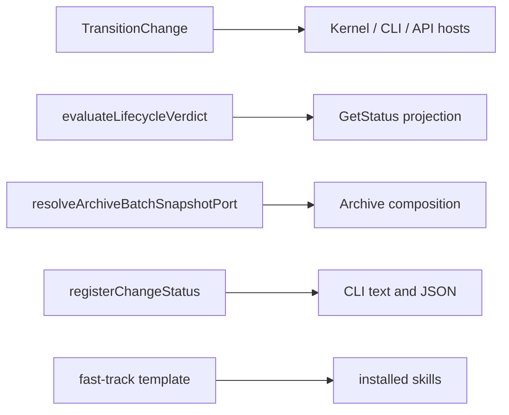

# Design: lifecycle-polish-followups

## Non-goals

This change does not redesign lifecycle protocol states, add an approval transition, alter archive storage formats, or change public CLI field names. It does not change the default-off registry behavior outside production composition.

## Affected areas

- `packages/core/src/application/use-cases/transition-change.ts`: `TransitionChange._assertDrainAndGateTargets(from, target)` now runs before predicate evaluation. Its public constructor and `execute()` signature are unchanged. For historic `pending-spec-approval` and `pending-signoff`, only the drain target proceeds; every other target throws `InvalidStateTransitionError` with `{ type: 'approval-required', gate: 'spec' | 'signoff' }`.
- `packages/core/src/domain/services/lifecycle-verdict.ts`: `evaluateLifecycleVerdict()` derives `transitionBlockers.blocking` from failed `workflow.requires` check details via the existing blocker-ID projection. It remains pure and performs no I/O.
- `packages/core/src/composition/use-cases/archive-change.ts`: `resolveArchiveBatchSnapshotPort()` keeps one lazily initialized `FsArchiveBatchSnapshot` promise when layouts cannot be derived, so `snapshot`, `recordCreatedFile`, and `restore` share state.
- `packages/cli/src/commands/change/status.ts`: `registerChangeStatus()` selects `displayStatus ?? effectiveStatus ?? state` for artifact and file text/structured output. No response-field type changes are introduced. Active output continues to use `lifecycle`; drafts retain empty legacy top-level transition arrays and no artifact DAG.
- `packages/skills/templates/skills/specd-fasttrack/SKILL.md.tpl`: Step 2 explicitly asks for a mode selection and stops; graph blast-radius instructions use `dependents` and `--direction dependents`.
- Focused tests: `packages/core/test/application/use-cases/transition-change.spec.ts`, `packages/core/test/domain/services/lifecycle-verdict.spec.ts`, `packages/core/test/composition/archive-batch-snapshot-port.spec.ts`, `packages/cli/test/commands/change/status.spec.ts`, and `packages/skills/test/template-workflow.spec.ts`.
- `packages/core/src/application/use-cases/get-status.ts`: `GetStatus.execute()` MUST project a stable `SCHEMA_RESOLUTION_FAILED` lifecycle blocker when `SchemaProvider.get()` raises `SchemaNotFoundError`; it keeps `availableTransitions` empty and does not enable mutation.
- `packages/core/test/application/use-cases/get-status.spec.ts`: assert the degraded projection contains the stable blocker code and no available transition.
- `packages/core/test/infrastructure/schema-yaml-parser.spec.ts`: assert a `schema-plugin` declaration with `metadataExtraction` is rejected.
- `docs/guide/configuration.md` and `docs/config/config-reference.md`: replace language saying schema plugins can add or modify metadata extraction with a user-facing explanation that plugins use supported merge layers but cannot declare a top-level `metadataExtraction` block; projects use the base schema or `schemaOverrides` for that declaration.

`TransitionChange` is CRITICAL in graph impact (10 direct, 126 indirect dependents; 54 affected files), so regression coverage protects Kernel composition, approval use cases, CLI/API hosts, and status consumers. `resolveArchiveBatchSnapshotPort` is MEDIUM (4 direct dependents; 8 affected files) through archive composition. No caller signature changes are required.

## New constructs

None. The implementation reuses `InvalidStateTransitionError`, existing check result details, and `FsArchiveBatchSnapshot`.

## Data models & Contracts

The parked-state error reason is the existing discriminated shape:

```ts
{ readonly type: 'approval-required'; readonly gate: 'spec' | 'signoff' }
```

The CLI fallback is ordered and non-null at render time:

```ts
const renderedStatus = displayStatus ?? effectiveStatus ?? state
```

`blocking` is a readonly artifact-ID array. It contains the `workflow.requires` failure's `details.artifactId` when present. No persisted manifest schema changes occur.

## Approach & Execution flow

1. Load a change and resolve `to` to its effective target.
2. Before evaluating the registry, inspect historic parked states. Permit the documented drain target; otherwise throw the typed approval-required failure and stop.
3. For other transitions, retain the existing predicate/effect evaluation and persistence flow.
4. During pure lifecycle projection, map a failed requires predicate's artifact detail into `transitionBlockers.blocking`.
5. During archive composition without layouts, initialize one fallback snapshot lazily and delegate every fallback-port operation to it.
6. During CLI rendering, use the ordered display fallback; preserve active/draft structural compatibility.
7. Render the fast-track template with its explicit Step 2 stop and dependents wording.

## Error handling & Edge cases

- A parked non-drain request returns the existing `InvalidStateTransitionError`, not a generic error and not `invalid-transition`.
- A parked drain request remains supported.
- A requires failure without an artifact ID leaves `blocking` empty rather than inventing an ID.
- Missing `displayStatus` falls through to effective status and then persisted state; rendering never stringifies `undefined`.
- A fallback snapshot must survive all methods in one composed port; separate composition instances remain isolated.
- Draft status is inspection-only: it does not advertise mutation hops or a schema DAG.
- `SchemaNotFoundError` remains non-throwing only on the GetStatus read path. Its blocker uses a stable code and actionable message; all other schema-provider errors propagate, and transition/archive mutation paths remain fail-closed.
- User documentation must not imply that `schemaPlugins` can own metadata extraction. It must direct users to the supported base-schema or `schemaOverrides` route without changing existing merge behavior.

## Key decisions

- Check approval precedence in `TransitionChange`, not in `protocol.edge`, because historic parking is a use-case boundary rule and must produce typed repair guidance before general protocol rejection.
- Keep lifecycle blocker mapping in the domain verdict because it is a pure projection of already-evaluated check facts.
- Keep snapshot lifetime in composition because adapter creation is I/O wiring, not domain behavior.
- Preserve existing JSON compatibility instead of normalizing drafts to active lifecycle shape.
- Do not reopen the historical workflow change; this bounded follow-up preserves auditability.

## Trade-offs

- Default-off overlap detection remains available for isolated wiring; production factories must inject it. This avoids implicit I/O in test stubs while documenting the production invariant.
- Markdown delta serialization may normalize harmless escaping in existing prose; merged previews must be reviewed before archive.

## Spec impact

The modified contracts are `core:transition-change`, `core:lifecycle-engine`, `core:transition-checks`, `core:archive-change`, `cli:change-status`, and `skills:skill-templates-source`. Their direct dependency contracts remain valid: no new public types, cross-workspace imports, or runtime dependencies are introduced. The dependent CLI and SDK host surfaces retain the same signatures; focused regressions cover their observable outputs. No dependent spec requires a behavior delta beyond the six scoped contracts.

## Dependency map



```text
TransitionChange [CRITICAL] --> Kernel, approval use cases, CLI/API hosts
evaluateLifecycleVerdict --> GetStatus lifecycle blockers
archive snapshot resolver [MEDIUM] --> ArchiveChange composition
registerChangeStatus --> CLI consumers
fast-track template --> rendered agent skills
```

## Migration / Rollback

No data migration or deployment sequencing is required. Rollback reverts the five source/template edits and their tests; persisted change manifests, archive data, and CLI response field names remain compatible.

## Testing

- `transition-change.spec.ts`: create parked spec/signoff changes, request non-drain targets, and assert the matching `approval-required` gate rather than `invalid-transition`.
- `lifecycle-verdict.spec.ts`: inject a failed `workflow.requires` fact with `details.artifactId` and assert `transitionBlockers.blocking` contains it.
- `archive-batch-snapshot-port.spec.ts`: use fallback composition, snapshot, record a created file, restore, and assert removal.
- `status.spec.ts`: omit `displayStatus` and assert text/JSON uses effective or state fallback; assert drafted JSON remains read-only.
- `template-workflow.spec.ts`: assert Step 2 stop language and `dependents`/`--direction dependents`, with no downstream wording.
- Run targeted Core, CLI, skills, and archive tests plus workspace typecheck. Expected result: all suites pass with no TypeScript errors.

## Documentation

The six spec and verification deltas are the required contract documentation. No separate user guide or ADR is needed because no command syntax, configuration, architecture, or external integration changes.

## Specification hygiene reconciliation

Seven additional contracts are reconciled: hook schema forms, metadata extraction/plugin boundaries, task-completion scope, degraded `GetStatus` reads, canonical archive naming, optional ConfigWriter configuration, and artifact-instruction timing. `external:` is the third declared hook form even when no production external runner is installed. A schema plugin cannot declare `metadataExtraction`. The `GetStatus` correction is intentionally a small runtime and test change so its public degraded read is actionable; the other corrections are specification-only. `core:change` intentionally overlaps the active `implementation-snapshot` change; this change confines its delta to task-completion wording and must be coordinated at archive time.

## Open questions

None.
