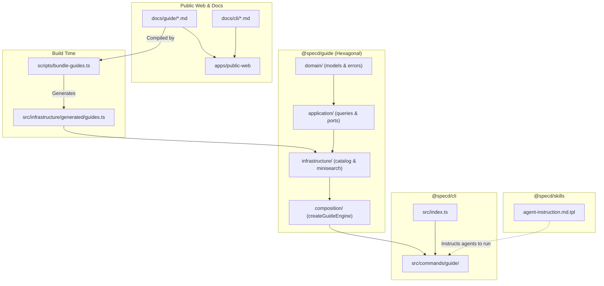
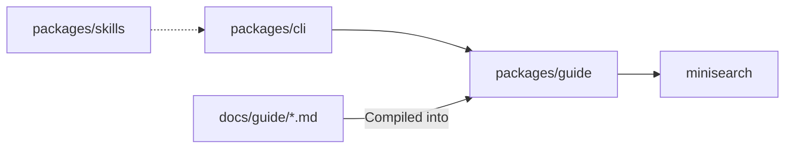

# Design: CLI Guide Command & Documentation Engine

## Overview

This change delivers a self-contained, on-demand documentation and guide system for SpecD. It introduces `@specd/guide`, a zero-core-dependency headless library with pre-compiled guide catalogs, in-memory BM25 full-text search (`minisearch`), section outline extraction, and line-window slicing. It delivers the `specd guide [topic]` and `specd guide search <query>` CLI commands in `@specd/cli`. It updates `@specd/skills` to instruct agents via `AGENTS.md` and `CLAUDE.md` to consult `specd guide` on demand. Finally, it conducts a full-fidelity audit, completion, and alignment of the entire repository documentation suite (`docs/`), creating missing CLI command docs, adding `docs/cli/index.md`, and aligning Docusaurus navigation in `apps/public-web/sidebars.ts`.

## Architecture overview

The solution is divided across three layers:

1. **Core Documentation & Headless Engine (`packages/guide`)**:
   - Strictly decoupled from `@specd/core` with zero runtime core dependencies.
   - Built with Hexagonal Architecture:
     - `domain/`: Pure models (`GuideTopic`, `GuideSection`, `GuideOutline`, `GuideSearchHit`, `GuideSummary`) and error classes (`SpecdGuideError`, `GuideTopicNotFoundError`, `GuideSectionNotFoundError`).
     - `application/`: Driven ports (`GuideCatalogPort`, `GuideSearchPort`) and application queries (`ListGuidesQuery`, `GetGuideQuery`, `GetGuideOutlineQuery`, `GetGuideSectionQuery`, `SearchGuidesQuery`).
     - `infrastructure/`: Adapters (`PrebundledGuideCatalogAdapter`, `MiniSearchGuideEngineAdapter`) and pre-bundled generated catalog (`guides.ts`).
     - `composition/`: Factory facade (`createGuideEngine()`) assembling queries and default adapters.
   - Build-time bundler (`scripts/bundle-guides.ts`): Compiles markdown files from `docs/guide/*.md`, validates Docusaurus YAML frontmatter, parses heading line spans, and generates static TypeScript catalogs.
2. **Delivery Layer (`packages/cli`)**:
   - Thin command adapter under `src/commands/guide/` delegating execution to `@specd/guide`.
   - Supports `specd guide [topic]` with `--meta`, `--section <name>`, `--start-line <n>`, `--lines <m>`, `--line-numbers`.
   - Supports `specd guide search <query>` with `--topic <id>`, `--limit <n>`, `--snippet-lines <n>`.
   - Supports `--format text|markdown|json|toon`.
3. **Agent Integration (`packages/skills`)**:
   - Updates `agent-instruction.md.tpl` to inject the mandatory on-demand documentation protocol into `<!-- <specd> -->` blocks across `AGENTS.md`, `CLAUDE.md`, etc.
4. **Documentation Suite & Docusaurus Web (`docs/`, `apps/public-web`)**:
   - Reorganizes `docs/guide/` (user-facing) and moves developer internals (e.g. `skills-template-rendering.md`) to `docs/skills/`.
   - Consolidates CLI user guide in `docs/guide/cli.md` and completes all per-command docs under `docs/cli/` with `docs/cli/index.md`.
   - Reconciles configuration cascade docs (`specd.yaml` + `specd.*.yaml` + `specd.local.yaml`).
   - Updates `apps/public-web/sidebars.ts`.



## Affected areas

### 1. `packages/cli`

- **File**: `packages/cli/package.json`
  - Add workspace dependency: `"@specd/guide": "workspace:*"`
- **File**: `packages/cli/src/index.ts`
  - Register `registerGuideCommand(program)`
  - Delegate CLI execution to `createProgram()` factory
- **File**: `packages/cli/src/program.ts`
  - Decoupled `createProgram()` Commander factory for headless testing and CLI introspection
- **File**: `packages/cli/src/helpers/table.ts`
  - Responsive terminal table width calculation (`fitColumnsToTerminal`) adapting right-to-left down to 10-char minimum
- **File**: `packages/cli/src/commands/guide/index.ts`
  - Commander action handler for `guide [topic]` and `guide search <query>`
- **File**: `packages/cli/src/commands/guide/formatters.ts`
  - Formatter functions for `text`, `markdown`, `json`, and `toon`

### 2. `packages/skills`

- **File**: `packages/skills/templates/prompt/agent-instruction.md.tpl`
  - Add Section: `## On-Demand Documentation Protocol` instructing agents to consult `specd guide` instead of guessing configuration, schemas, deltas, or CLI flags.

### 3. `packages/guide` (New Package)

- Root files: `package.json`, `tsconfig.json`, `vitest.config.ts`, `README.md`, `scripts/bundle-guides.ts`
- Source files: `src/domain/`, `src/application/`, `src/infrastructure/`, `src/composition/`, `src/index.ts`, `src/public.ts`
- Test files: `test/` unit and integration tests

### 4. `docs/` & `apps/public-web`

- Complete file-by-file audit of `docs/guide/`, `docs/cli/`, `docs/core/`, `docs/code-graph/`, `docs/sdk/`, `docs/config/`, `docs/schemas/`, `docs/adr/`.
- Add `docs/cli/index.md` and missing CLI docs.
- Reconcile `docs/config/config-reference.md` and `docs/guide/configuration.md`.
- Update `apps/public-web/sidebars.ts`.

## New constructs

### 1. Domain Layer (`packages/guide/src/domain/`)

```typescript
// packages/guide/src/domain/models/guide-topic.ts
export interface GuideTopic {
  readonly topic: string
  readonly title: string
  readonly description: string
  readonly order: number
  readonly content: string
  readonly lineCount: number
  readonly byteLength: number
  readonly outline: readonly GuideSection[]
}

// packages/guide/src/domain/models/guide-section.ts
export interface GuideSection {
  readonly index: number
  readonly heading: string
  readonly level: number
  readonly startLine: number
  readonly endLine: number
  readonly lines: number
  readonly content: string
}

// packages/guide/src/domain/models/guide-summary.ts
export interface GuideSummary {
  readonly topic: string
  readonly title: string
  readonly description: string
  readonly order: number
  readonly lineCount: number
  readonly byteLength: number
}

// packages/guide/src/domain/models/guide-outline.ts
export interface GuideOutline {
  readonly topic: string
  readonly file: string
  readonly lines: number
  readonly bytes: number
  readonly sections: readonly GuideSection[]
}

// packages/guide/src/domain/models/guide-search-hit.ts
export interface GuideSearchHit {
  readonly topic: string
  readonly file: string
  readonly section: string
  readonly sectionIndex: number
  readonly level: number
  readonly startLine: number
  readonly endLine: number
  readonly score: number
  readonly snippet: string
  readonly readCommand: string
}

// packages/guide/src/domain/errors/specd-guide-error.ts
export abstract class SpecdGuideError extends Error {
  readonly specd = true as const
  abstract readonly code: string
  constructor(message: string) {
    super(message)
    this.name = this.constructor.name
  }
}

// packages/guide/src/domain/errors/guide-topic-not-found-error.ts
export class GuideTopicNotFoundError extends SpecdGuideError {
  readonly code = 'UNKNOWN_GUIDE_TOPIC'
  constructor(
    readonly topic: string,
    readonly availableTopics: readonly string[],
  ) {
    super(`Guide topic '${topic}' not found. Available topics: ${availableTopics.join(', ')}`)
  }
}

// packages/guide/src/domain/errors/guide-section-not-found-error.ts
export class GuideSectionNotFoundError extends SpecdGuideError {
  readonly code = 'UNKNOWN_GUIDE_SECTION'
  constructor(
    readonly heading: string,
    readonly availableHeadings: readonly string[],
  ) {
    super(`Section '${heading}' not found. Available sections: ${availableHeadings.join(', ')}`)
  }
}

// packages/guide/src/domain/errors/guide-section-ambiguous-error.ts
export class GuideSectionAmbiguousError extends SpecdGuideError {
  readonly code = 'AMBIGUOUS_GUIDE_SECTION'
  constructor(
    readonly heading: string,
    readonly matchingIndices: readonly number[],
    readonly matchingHeadings: readonly string[],
  ) {
    super(
      `Multiple sections match '${heading}'. Matching sections: ${matchingHeadings.join(', ')}. Use --section <number> to disambiguate.`,
    )
  }
}
```

### 2. Application Layer (`packages/guide/src/application/`)

```typescript
// packages/guide/src/application/ports/guide-catalog-port.ts
export interface GuideCatalogPort {
  listGuides(): Promise<readonly GuideSummary[]>
  getGuide(topic: string): Promise<GuideTopic | null>
  getAllGuides(): Promise<readonly GuideTopic[]>
}

// packages/guide/src/application/ports/guide-search-port.ts
export interface GuideSearchOptions {
  readonly topic?: string
  readonly limit?: number
  readonly snippetLines?: number
}

export interface GuideSearchPort {
  search(query: string, options?: GuideSearchOptions): Promise<readonly GuideSearchHit[]>
}

// Queries:
// - ListGuidesQuery(catalogPort)
// - GetGuideQuery(catalogPort)
// - GetGuideOutlineQuery(catalogPort)
// - GetGuideSectionQuery(catalogPort) -> supports section: string | number
// - SearchGuidesQuery(searchPort)
// Utilities:
// - sliceGuideLines(content: string, startLine?: number, lineCount?: number): string
// - formatWithLineNumbers(content: string, startLine?: number): string
```

### 3. Infrastructure Layer (`packages/guide/src/infrastructure/`)

```typescript
// packages/guide/src/infrastructure/adapters/prebundled-guide-catalog-adapter.ts
export class PrebundledGuideCatalogAdapter implements GuideCatalogPort { ... }

// packages/guide/src/infrastructure/adapters/minisearch-guide-engine-adapter.ts
export class MiniSearchGuideEngineAdapter implements GuideSearchPort { ... }
```

### 4. Composition Root (`packages/guide/src/composition/`)

```typescript
export interface GuideEngine {
  listGuides(): Promise<readonly GuideSummary[]>;
  getGuide(topic: string): Promise<GuideTopic>;
  getGuideOutline(topic: string): Promise<GuideOutline>;
  getGuideSection(topic: string, section: string | number): Promise<GuideSection>;
  sliceGuideLines(content: string, startLine?: number, lineCount?: number): string;
  formatWithLineNumbers(content: string, startLine?: number): string;
  searchGuides(query: string, options?: GuideSearchOptions): Promise<readonly GuideSearchHit[]>;
}

export function createGuideEngine(options?: GuideEngineOptions): GuideEngine { ... }
```

## Data models & Contracts

### 1. Docusaurus Markdown Frontmatter Schema

Each guide file in `docs/guide/*.md` must start with:

```yaml
---
title: Human Readable Title
description: Concise topic summary for search and metadata
sidebar_position: 1
---
```

### 2. CLI Command Options Contract

```
specd guide [topic]
  --meta                  Emit outline metadata instead of full document (with [index] <heading>)
  --section <name|index>  Extract targeted section by heading title, slug, or 1-indexed section number
  --start-line <n>        1-indexed start line window
  --lines <m>             Maximum lines to return from startLine
  --line-numbers          Prefix lines with 1-indexed padded numbers
  --format <fmt>          text|markdown|json|toon (default: text)

specd guide search <query>
  --topic <id>            Scope search to single topic
  --limit <n>             Maximum search hits (default: 5)
  --snippet-lines <n>     Contextual lines before/after match (default: 3)
  --format <fmt>          text|markdown|json|toon (default: text)
```

## Approach & Execution flow

### 1. Build-Time Bundling Flow (`scripts/bundle-guides.ts`)

1. Read all `.md` files in `docs/guide/`.
2. Extract and parse YAML frontmatter using lightweight parser.
3. Validate required fields (`title`, `description`, `sidebar_position`). Throw on failure.
4. Scan lines outside fenced code blocks (```blocks) for headings`#`to`######`.
5. Assign a 1-indexed sequential `index` (1, 2, ...) and compute `startLine` and `endLine` for each heading section.
6. Assemble array of `GuideTopic` records and topic index map.
7. Emit `packages/guide/src/infrastructure/generated/guides.ts`.

### 2. Topic Inspection & Slicing Flow (`specd guide <topic>`)

1. Normalize query topic: trim spaces, lowercase, strip optional `.md` suffix.
2. Query `GuideEngine.getGuide(topic)`. If not found, throw `GuideTopicNotFoundError`.
3. If `--meta`: return `GuideOutline` (total lines, bytes, and sections array with `[<index>] <heading>`).
4. If `--section <name|index>`:
   - If argument parses as a positive integer $k$, select the $k$-th section by `section.index === k` (1-indexed). This resolves disambiguation when duplicate section titles exist.
   - Otherwise, match by exact heading, normalized heading, or slugified heading.
   - If multiple sections match the queried heading text or slug, throw `GuideSectionAmbiguousError` containing matching section indices and line spans, instructing the caller to disambiguate with `--section <index>`.
   - If no match found, throw `GuideSectionNotFoundError`.
   - Return section body up to next peer heading.
5. If `--start-line` or `--lines`: slice line window.
6. If `--line-numbers`: format with padded 1-indexed line numbers.
7. Format output according to `--format` (`text`, `markdown`, `json`, `toon`).

### 3. Full-Text Search Flow (`specd guide search <query>`)

1. Validate query string. If empty or whitespace-only, return empty array.
2. Filter target sections if `--topic` specified.
3. Query `minisearch` index over sections with field boosting (`title: 5`, `heading: 3`, `content: 1`).
4. For each hit:
   - Identify line of match.
   - Extract `snippetLines` before and after.
   - Format snippet with 1-indexed line numbers.
   - Include `sectionIndex` (1-indexed).
   - Generate `readCommand`: `specd guide <topic> --section <sectionIndex>` (or heading if unique).
5. Sort hits by BM25 score and slice to `--limit`.
6. Format output according to `--format`.

## Error handling & Edge cases

- **Unknown Topic**: CLI displays `UNKNOWN_GUIDE_TOPIC: Guide topic '<topic>' not found. Available topics: ...` and exits with code 1.
- **Unknown Section**: CLI displays `UNKNOWN_GUIDE_SECTION: Section '<name|index>' not found. Available sections: ...` and exits with code 1.
- **Ambiguous Section**: CLI displays `AMBIGUOUS_GUIDE_SECTION: Multiple sections match '<name>'. Matching sections: [2] <heading> (lines 15-40), [6] <heading> (lines 120-150). Use --section <number> to disambiguate.` and exits with code 1.
- **Empty Search Query**: CLI returns 0 hits gracefully with exit code 0.
- **Code Block False Positives**: Fenced code blocks (` ```bash # comment ``` `) are ignored by the heading parser.
- **Windows CRLF vs Linux LF**: Line counting normalizes newline characters to prevent offset drift.
- **Out of Bounds Line Slicing**:
  - `startLine <= 0`: Defaults to line 1.
  - `startLine > totalLines`: Returns empty string without crashing.
  - `lines <= 0`: Returns empty string.
  - `lines > remainingLines`: Emits all remaining lines up to end-of-file.
- **Unicode & Multibyte Characters**: UTF-8 Buffer byte counting ensures accurate byte size.

## Key decisions

1. **Standalone `@specd/guide` Package**:
   - _Rationale_: Keeps documentation logic headless and reusable across CLI and future MCP server tools without circular dependencies or coupling to CLI Commander code.
2. **Build-Time Bundling with Zero Core Dependencies**:
   - _Rationale_: Allows `@specd/guide` to run anywhere without pulling in heavy core parsers, achieving 0 ms parsing latency and $O(1)$ memory lookup.
3. **`minisearch` for In-Memory Search**:
   - _Rationale_: 7 KB zero-dependency in-memory BM25 search engine with field boosting, prefix search, and typo tolerance.
4. **Docusaurus Native Frontmatter**:
   - _Rationale_: Guarantees 100% compatibility with `apps/public-web` static site generator.

## Trade-offs

- [Pre-compiled catalog increases package bundle size slightly (~300 KB)] → Offset by $O(1)$ startup speed and zero filesystem path fragility in external repos.
- [Static bundle requires rebuild when docs change] → Included in monorepo build pipeline (`pnpm build`).

## Spec impact

- Modified specs: `default:_global/docs` and `skills:agent-instruction-template`.
- All dependent specs verified; no regressions introduced.

## Dependency map



## Documentation updates

The implementation tasks will execute a complete audit and update of the documentation suite:

1. `docs/guide/`:
   - `getting-started.md`, `configuration.md`, `workflow.md`, `schemas.md`, `standard-schema.md`, `custom-schemas.md`, `templates.md`, `deltas.md`, `code-graph.md`, `workspaces.md`, `selectors.md`, `cli.md`.
2. `docs/cli/`:
   - Create `docs/cli/index.md` as the main index.
   - Audit and create individual docs for all commands: `guide.md`, `changes.md`, `drafts.md`, `discarded.md`, `archive.md`, `schema.md`, `graph.md`, etc.
3. Reconcile config cascade documentation across `docs/config/` and `docs/guide/configuration.md`.
4. Relocate `docs/guide/skills-template-rendering.md` to `docs/skills/`.
5. Update `apps/public-web/sidebars.ts`.

## Testing

### Automated tests

- `packages/guide/test/unit/domain/`: Test entity creation, line/byte counting, and error classes.
- `packages/guide/test/unit/application/`: Test queries (`ListGuidesQuery`, `GetGuideQuery`, `GetGuideOutlineQuery`, `GetGuideSectionQuery`, `SliceGuideLines`, `SearchGuidesQuery`) with mock ports.
- `packages/guide/test/unit/infrastructure/`: Test `PrebundledGuideCatalogAdapter` and `MiniSearchGuideEngineAdapter`.
- `packages/guide/test/integration/`: Test `createGuideEngine()` end-to-end.
- `packages/cli/test/commands/guide/`: Test CLI commands, options (`--meta`, `--section`, `--lines`, `--line-numbers`), formats (`text`, `json`, `toon`), and exit codes.
- `packages/cli/test/helpers/table.spec.ts`: Test terminal width adaptation and right-to-left reduction with 10-char minimum constraint.
- `packages/cli/test/documentation-coverage.spec.ts`: Automated dynamic test verifying all registered CLI commands, aliases, and subcommands have complete documentation in `docs/cli/` and `docs/guide/cli.md`.

### Manual / E2E verification

- Run `node packages/cli/dist/index.js guide`
- Run `node packages/cli/dist/index.js guide workflow --meta --format toon`
- Run `node packages/cli/dist/index.js guide workflow --section "Lifecycle States" --line-numbers`
- Run `node packages/cli/dist/index.js guide search "lifecycle states" --limit 3 --format toon`
- Run `pnpm --filter public-web build` to verify Docusaurus build passes without broken links.

## Open questions

None.
