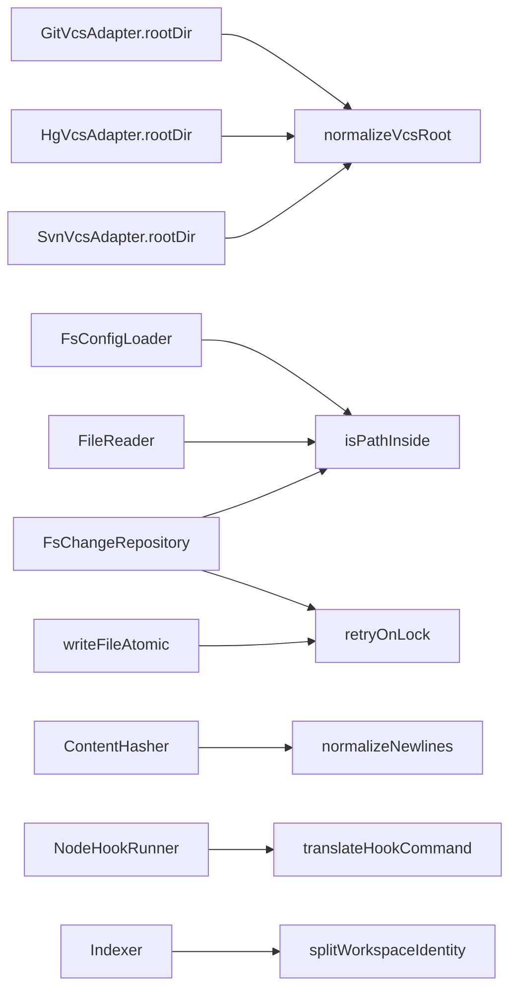

# Design: windows-platform-compatibility

## Non-goals

- Do not wrap `path.join`, `path.resolve`, or `path.sep`. Those stay the filesystem APIs.
- Do not change `core:vcs-adapter-port`. `rootDir()` already returns an absolute path. Built-in adapters normalize before that return.
- Do not `realpath` a VCS root.
- Do not collapse `.` or `..` when converting `\` to `/`.
- Do not move every local `replaceAll('\\', '/')` into the helper. Only the boundaries named in Affected areas.
- Do not redesign PID-reuse detection for change locks.
- Do not change PHP PSR-4 joins that turn a namespace `\` into `path.sep`.
- Do not add apt, brew, or Chocolatey packages to CI. Native modules install through `pnpm install`.
- Do not run `@specd/public-web`, changeset status, publish, or Gemini from `ci.yml`.
- Do not edit the installation guide. Its WSL wording stays as it is.
- Do not implement the optional single-executable `execFile` shortcut for hooks. Every `run:` hook uses the platform shell.
- `@ladybugdb/core` is already removed from `pnpm-workspace.yaml` and is not part of this implementation.
- Do not change which files the graph fingerprint treats as resolution manifests. That list stays in `discoverResolutionInputs`. Moving it onto language adapters is a later change.
- Do not sweep leftover `/tmp` strings inside mocks, or replace standing `as unknown as` port doubles. Those are outside this Windows contract.

## Affected areas

Graph impact of `write-atomic.ts`, `config-loader.ts`, and `hook-runner.ts` is CRITICAL: 36 direct dependents, 476 transitive dependents, 206 affected files. Signatures below stay compatible. Callers do not change. The behavioral risk is hash equality for text that contains `\r`, and containment results for Windows drive letters.

- `packages/core/src/infrastructure/git/vcs-adapter.ts`, `packages/core/src/infrastructure/hg/vcs-adapter.ts`, `packages/core/src/infrastructure/svn/vcs-adapter.ts`
  - `rootDir()` currently returns CLI stdout. After: cache and return `normalizeVcsRoot(stdout)`.
  - Modified-file lists pass each path through `toPortablePath`.
  - `NullVcsAdapter.rootDir()` still throws.
- `packages/core/src/infrastructure/git/exec.ts`, `hg/exec.ts`, `svn/exec.ts`
  - `execFile` options gain `windowsHide: true` when `process.platform === 'win32'`. `cwd` stays the normalized root.
- `packages/core/src/composition/config-loader.ts`
  - The root passed into the filesystem loader is the string from `rootDir()` after the adapter normalizes it. No second normalization.
- `packages/core/src/infrastructure/fs/config-loader.ts`
  - Replace `startsWith(root + path.sep)` for the config file, `fs` storage keys, and `fs` workspace `specsPath` with `isPathInside`.
  - A storage binding whose adapter is not `fs` skips the inside-root check. A workspace whose specs adapter is not `fs` has `isExternal` false.
- `packages/core/src/infrastructure/fs/path-confinement.ts`, `file-reader.ts`, `archive-repository.ts`, `change-repository.ts`, `spec-repository.ts`
  - Escape and confinement checks call `isPathInside`.
- `packages/core/src/infrastructure/fs/write-atomic.ts`
  - `rename` retries on `EPERM`, `EBUSY`, and `EACCES` via `retryOnLock`, then throws the original error.
- `packages/core/src/infrastructure/fs/move-dir.ts`
  - On `EPERM` or `EXDEV`, copy. Existing `ENOTEMPTY` and `EEXIST` handling stays.
- `packages/core/src/infrastructure/fs/ensure-tmp-gitignore.ts`
  - Compare content after `normalizeNewlines`. Equality is success only for this file.
- `packages/core/src/infrastructure/fs/spec-repository.ts` publication renames
  - Use `retryOnLock` around `rename`. After the budget is exhausted, throw the original `ErrnoException`, including `code`. Do not wrap that failure in `SpecPublicationError` when the wrapper would drop `code`.
  - Differing artifact bytes are never success.
- `packages/code-graph/src/infrastructure/storage-generation.ts`
  - `retryLocked` and `retryLockedAsync` use the same five attempts, delays, and lock codes as `retryOnLock`. `@specd/core` does not export the infrastructure helper, so code-graph keeps this local copy.
- `packages/core/src/application/use-cases/refresh-implementation-tracking.ts`
  - `_toPortableProjectRelativePath` uses `isPathInside` against the project root. A string prefix without a separator boundary is outside. Drive-letter case does not matter.
  - Composition injects `isPathInside`. The use case file does not import `infrastructure/`.
- `packages/core/src/application/template-expander.ts`
  - `shellEscape(value: string): string` becomes `shellEscape(value: string, dialect: 'posix' | 'cmd'): string`.
- `packages/core/src/infrastructure/node/hook-runner.ts`
  - `run()` calls `expand()` and then `translateHookCommand`. It does not call `expandForShell`.
  - Windows: `cmd.exe` with `['/d', '/s', '/c', command]`, `windowsVerbatimArguments: true`, `windowsHide: true`.
  - Other platforms: `$SHELL` when it is absolute, otherwise `/bin/sh`, with `['-c', command]`. No `windowsVerbatimArguments`.
- `packages/core/src/application/use-cases/_shared/compute-artifact-hash.ts`, `packages/core/src/infrastructure/node/content-hasher.ts`, `packages/core/src/infrastructure/fs/hash.ts`
  - `sha256` and `NodeContentHasher.hash` pass text through `normalizeNewlines` before the digest. LF-only input keeps today's digest.
  - `computeArtifactHash` keeps pre-hash cleanup, which collapses whitespace before the digest. It is not required to preserve line endings.
  - `normalizeNewlines` lives in `packages/core/src/domain/services/` so application code does not import infrastructure.
- `packages/core/src/domain/entities/change.ts`
  - After the existing slug pattern matches, reject `isWindowsDeviceName(slug)`.
- Workspace name validation and spec-id capability-segment validation
  - Reject a whole segment that `isWindowsDeviceName` accepts. `con-foo` stays legal. `default` and `root` stay reserved.
- `packages/code-graph/src/infrastructure/sqlite/sqlite-graph-store.ts` `recreate()`
  - Delete the database file, `-wal`, and `-shm` with `retryOnLock`. Do not delete `graph/index.lock`.
- `packages/code-graph/src/infrastructure/isolated-index-worker/supervisor.ts`
  - Release the index lease on `exit` and on `SIGBREAK`, in addition to the existing `SIGINT` and `SIGTERM` handlers. `SIGBREAK` is also forwarded to the child.
- Indexer and workspace-integration identity splits, `packages/code-graph/src/domain/services/matches-exclude.ts` `extractWorkspace`, and `packages/cli/src/commands/graph/resolve-impact-file-selectors.ts` `splitWorkspaceIdentity`
  - A drive-letter path is not a workspace. The shared helper, the exclusion extractor, and the CLI copy all treat `^[A-Za-z]:[/\\]` and `^[A-Za-z]:$` as drive-letter paths. `splitWorkspaceIdentity('C:')` and `extractWorkspace('C:')` do not return workspace `C`.
  - The CLI keeps a local copy so its bundle does not import the code-graph internal barrel. `matches-exclude.ts` keeps its local extractor. Both copies use the same match as `isDriveLetterPath`.
  - The same rule applies to language-adapter relative-import splits, scoped binding, `compute-hotspots` `extractWorkspace`, the SQLite workspace inclusion filter, and CLI display in `impact.ts`, `search.ts`, and `hotspots.ts`. PHP namespace backslashes stay local.
- `package.json` `lint-staged`: replace `bash -c 'pnpm typecheck'` with `pnpm typecheck`.
- `.gitignore`: stop ignoring workflow files, keep the rest of `.github/` ignored.
- New `.gitattributes` and `.github/workflows/ci.yml`.

## New constructs

`packages/core/src/domain/services/windows-device-name.ts`

```ts
const WINDOWS_DEVICE_NAME = /^(con|prn|aux|nul|com[1-9]|lpt[1-9])$/i

export function isWindowsDeviceName(segment: string): boolean {
  return WINDOWS_DEVICE_NAME.test(segment)
}
```

Invariant: the argument is one path segment or one slug, not a full path. `con-foo` returns false. Comparison is case-insensitive. No Node I/O.

`packages/core/src/infrastructure/fs/path-platform.ts`

```ts
import path from 'node:path'

export function normalizeVcsRoot(raw: string): string

export function isPathInside(root: string, candidate: string): boolean

export function toPortablePath(value: string): string

export function normalizeNewlines(text: string): string

export async function retryOnLock<T>(operation: () => Promise<T>): Promise<T>
```

`normalizeVcsRoot`: trim, then resolve. A drive-letter path uses `path.win32.resolve`; every other path uses `path.resolve`. If the result matches `^[A-Za-z]:`, uppercase that letter. Do not call `realpath`.

`isPathInside`: resolve both arguments with the same drive-letter rule, uppercasing both drive letters before compare. Relative path uses `path.win32.relative` when the root has a drive letter, otherwise `path.relative`. Empty relative path means the candidate is the root and returns true. A relative path that starts with `..`, or is absolute, returns false. `C:/repo` contains `c:/repo/specd.yaml`. `C:/repo` does not contain `C:/repository`.

`toPortablePath`: `value.replaceAll('\\', '/')`. Do not call `path.posix.normalize`.

`normalizeNewlines`: replace `\r\n` with `\n`, then remaining `\r` with `\n`.

`retryOnLock`: five attempts. Delays before retries 2 through 5 are 50ms, 100ms, 150ms, and 200ms. Retry only when `error` is a Node `ErrnoException` whose `code` is `EPERM`, `EBUSY`, or `EACCES`. Any other error throws immediately. After the fifth failure, throw that error unchanged.

`packages/code-graph/src/domain/services/split-workspace-identity.ts`

```ts
export function isDriveLetterPath(value: string): boolean

export function splitWorkspaceIdentity(
  value: string,
): { workspace: string; relativePath: string } | null
```

`isDriveLetterPath` is true when `value` matches `^[A-Za-z]:[/\\]` or `^[A-Za-z]:$`. `splitWorkspaceIdentity` returns null for those strings, including the bare drive letter `C:`. Otherwise it splits on the first `:`. The left side is `workspace`. The right side is `relativePath`. Callers that receive null must not invent a workspace named `C`. The CLI copy and `extractWorkspace` in `matches-exclude.ts` use that same match.

`toPortableGraphPath(value: string): string` is `value.replaceAll('\\', '/')`. It does not collapse `.` or `..`.

Wiring: application and infrastructure import the domain functions directly. The CLI selector duplicates the drive-letter split locally. No new composition factory. Domain does not import infrastructure.

## Data models & Contracts

No persisted schema changes. Graph keys and spec ids keep their current string forms.

Device-name set, whole segment only: `con`, `prn`, `aux`, `nul`, `com1`–`com9`, `lpt1`–`lpt9`.

`ci.yml` contract:

- Triggers: `pull_request`, and `push` to `main`.
- Matrix: `macos-latest`, `ubuntu-latest`, `windows-latest`.
- Each job: checkout, install pnpm `10.6.5`, install Node 22, `pnpm install --frozen-lockfile`, `pnpm typecheck`, `pnpm build`, `pnpm test`.
- Root `package.json` script `test` is `turbo test --concurrency=3` with filters `@specd/core`, `@specd/cli`, `@specd/code-graph`, `@specd/guide`, `@specd/sdk`, `@specd/skills`, `@specd/plugin-manager`, `@specd/plugin-agent-claude`, `@specd/plugin-agent-codex`, `@specd/plugin-agent-copilot`, `@specd/plugin-agent-opencode`, and `@specd/plugin-agent-standard`. `preflight:test` is `pnpm test`. `typecheck` and `build` exclude `@specd/public-web`. `@specd/mcp` is not in `pnpm test`.
- Native builds happen inside `pnpm install` for `better-sqlite3`, `@ast-grep/lang-go`, `@ast-grep/lang-php`, `@ast-grep/lang-python`, and `esbuild`. `core-js` and `core-js-pure` are allowlisted and are not native.

`.gitignore` replacement for the `.github/` line:

```
.github/*
!.github/workflows/
!.github/workflows/**
```

That tracks every file in `.github/workflows/`, including the six Gemini workflows and `ci.yml`. Agents, skills, and `copilot-instructions.md` stay ignored.

`.gitattributes`:

```
* text=auto eol=lf
*.md text eol=lf
*.yaml text eol=lf
*.yml text eol=lf
*.json text eol=lf
```

## Approach & Execution flow

1. Add the domain device-name helper and the infrastructure path helpers, with unit tests that do not depend on `process.platform` for drive-letter cases. Those tests pass `C:/` and `c:\` strings on macOS.
2. Call `normalizeVcsRoot` at the end of git, hg, and svn root detection, before the value is cached. Pass modified-file paths through `toPortablePath`. Set `windowsHide` on those `execFile` calls.
3. Replace prefix containment in the config loader, file reader, spec repository, archive repository, and change repository with `isPathInside`.
4. Wrap destination `rename` calls in `writeFileAtomic` and spec publication with `retryOnLock`. Wrap storage-generation renames with the local `retryLocked` copy. Teach `moveDir` to copy on `EPERM` and `EXDEV`.
5. Normalize newlines in the three text hashers and in the tmp `.gitignore` compare.
6. Expand developer `run:` hooks verbatim, then translate only the quote syntax the host shell does not understand. Windows uses `cmd.exe /d /s /c` with verbatim arguments and a hidden console. Other platforms use the POSIX shell.
7. Reject device-name slugs, workspace names, and capability segments through `isWindowsDeviceName`.
8. Route graph identity splits through `splitWorkspaceIdentity`. `recreate()` deletes only the sqlite trio and retries. The supervisor releases the lease on `exit` and `SIGBREAK`.
9. Add `.gitattributes`, the gitignore exception, `ci.yml`, and the lint-staged edit.
10. Point filesystem tests at `os.tmpdir()` and `pathToFileURL`. Replace Windows-ineffective `chmod 0o000` unreadable setups.

Developer `run:` hooks do not pass through `shellEscape`. `expand()` inserts each value as text. `translateHookCommand` then rewrites quote syntax:

- Host `cmd`: a single-quoted span, including `'\''`, becomes a double-quoted span. A `"` inside it becomes `""`. A POSIX `\"` inside an existing double-quoted span becomes `""`.
- Host `posix`: a `""` pair inside a double-quoted span becomes `\"` when a closing quote still follows. `echo ""` stays an empty argument. Single-quoted spans stay.

`%` is never rewritten. Program names, flags, and pipes are never rewritten. `expandForShell` remains for a command string SpecD itself builds. `HookRunner` does not call it.

The Windows spawn is `cmd.exe /d /s /c` plus that command line, with verbatim arguments and `windowsHide`, so Node does not strip the developer quotes before `cmd.exe` parses them.

## Error handling & Edge cases

- `retryOnLock` does not wrap errors. The last `EPERM`, `EBUSY`, or `EACCES` propagates with its original `code`.
- `EXDEV` on a directory move copies. It is not retried as a lock error.
- `NullVcsAdapter.rootDir()` throws the same error it throws today.
- A config, storage path, archive path, or file read outside the root still throws the existing `ConfigValidationError` or `PathTraversalError`.
- Device-name rejection uses the existing invalid-name error for that validator. Do not add a new error class.
- `splitWorkspaceIdentity` returns null for a drive letter. Callers skip the workspace assignment and keep the original path.
- Identical bytes are success only after newline normalization of the tmp `.gitignore`. A different artifact is a failed write.
- LF text hashes do not change. Text that contained `\r` gets a new digest. The next validation reports drift once. That is the intended equalization, not a retry case.
- `SIGTERM` may never arrive on Windows. `exit` still releases the lease. `SIGBREAK` releases it too.

## Key decisions

- Helpers that need `node:path` live in infrastructure. The device-name check is a pure domain function so change, workspace, and spec-id validation do not import Node.
- Drive-letter logic uses `path.win32` when the string has a drive letter, so macOS tests exercise the Windows rule without mocking `process.platform`.
- Retry budget is five attempts and delays 50, 100, 150, 200 ms. A shorter budget fails on a brief file lock. An unbounded budget can hang publication.
- Hooks always use a shell. Developer commands are expanded verbatim. Only quote syntax the host does not understand is translated. `expandForShell` is reserved for commands SpecD builds itself.
- `ci.yml` installs pnpm, then runs `pnpm install --frozen-lockfile`. The install step is what builds native modules.
- Gemini workflow files are tracked because `.github/workflows/` is re-included as a directory. They are not invoked by `ci.yml`.

## Trade-offs

- CRITICAL blast radius on atomic write, config load, and hooks → signatures stay stable, and POSIX LF hashes stay stable.
- CRLF hash change causes one-time artifact drift for files that were hashed with carriage returns → `.gitattributes` makes later checkouts LF, so the drift does not repeat.
- Tracking the Gemini workflows can start those jobs on GitHub once they are on the default branch and credentials exist. `gemini-plan-execute.yml` can write to the repo. `gemini-scheduled-triage.yml` runs hourly. Mitigation: this change does not add secrets. The jobs no-op or fail closed without Gemini or GCP credentials.
- Markdown delta apply can escape a `_` in an untouched list item when a spec is re-serialized. `core:change` and `code-graph:indexer` show that in merged preview (`SYSTEM_ACTOR`, `node_modules`). Do not hand-edit those lines in the delta. Archive must not treat the escape as a requirement change.

## Spec impact

`default:_global/continuous-integration` is new. `ci.yml`, the `.gitignore` workflow exception, and the root `test` script implement it. `default:_global/testing` stays the rule for how tests are written. CI only chooses which commands run and on which runners.

Direct dependents of the modified specs stay valid. `core:vcs-adapter-port` still requires an absolute `rootDir()` and a throwing null adapter. `core:config` still owns the YAML shape. `code-graph:graph-store` still owns the abstract store. No additional spec needs a requirement change. Overlapping active changes on `code-graph:indexer`, `code-graph:sqlite-graph-store`, `core:change`, `core:refresh-implementation-tracking`, and `core:vcs-adapter` must keep their own wording. These deltas only add the Windows behavior.

`default:_global/architecture` is satisfied: domain has no I/O, path helpers stay in infrastructure. `default:_global/conventions` is satisfied: named ESM exports, no default export. `default:_global/docs`: the workflow guide documents verbatim hook substitution, the variables, and the quote translation. It tells developers to use their own script when a hook must choose commands per platform. `default:_global/testing`: new tests use `os.tmpdir()` and the given/when/then description style.

## Dependency map



```
┌──────────────────┐     ┌────────────────────┐
│ git/hg/svn       │────▶│ normalizeVcsRoot   │
│ rootDir          │     │ isPathInside       │
└────────┬─────────┘     │ toPortablePath     │
         │               └─────────┬──────────┘
         ▼                         │
┌──────────────────┐               ▼
│ FsConfigLoader   │     ┌────────────────────┐
│ FileReader       │     │ writeFileAtomic    │
│ repositories     │     │ publication rename │
└──────────────────┘     └────────────────────┘
```

## Migration / Rollback

No data migration. Rollback is a revert of the code, `.gitattributes`, `.gitignore`, and `ci.yml`. Stored LF hashes remain valid. Reverting newline normalization makes CRLF checkouts drift again. Gemini workflows, once pushed, keep running until a later commit removes them. This change does not delete them.

## Testing

Automated:

- `packages/core/test/infrastructure/fs/path-platform.spec.ts`: `c:/repo` normalizes the drive to `C`; `isPathInside('C:/repo', 'c:/repo/specd.yaml')` is true; `isPathInside('C:/repo', 'C:/repository')` is false; `toPortablePath('src\\..\\secret')` is `src/../secret`; `normalizeNewlines` maps `\r\n` and `\r` to `\n`.
- `packages/core/test/domain/services/windows-device-name.spec.ts`: `con`, `NUL`, `com1`, and `lpt9` are devices; `con-foo` is not.
- VCS adapter tests: git stdout `c:/repo` caches a `C:` root; null adapter still throws; a backslash modified path is returned with `/`.
- Config loader tests: config `C:/repo/specd.yaml` with root `c:/repo` loads; `C:/repository` throws `ConfigValidationError`; storage and `isExternal` use the same cases.
- File reader test: drive-letter case does not throw `PathTraversalError`; `C:/repository/spec.md` does.
- `write-atomic` and publication tests: first `rename` fails with `EBUSY`, a later attempt succeeds; five `EBUSY` failures on publication surface the original error `code`; `EXDEV` and `EPERM` on `moveDir` copy.
- Hasher tests: `sha256` and `NodeContentHasher` map `\r\n` and `\r` to the LF digest. `computeArtifactHash` shares a digest because pre-hash cleanup collapses whitespace.
- `ensure-tmp-gitignore` test: `\r\n` content matches the LF marker; a different artifact does not.
- Hook runner tests on any OS: developer quotes stay in the command, quote syntax is translated for cmd and POSIX, and Windows spawn options include `windowsVerbatimArguments` and `windowsHide`. VCS spawns on Windows pass `windowsHide: true`.
- Change, workspace, and spec-id tests: `con` rejected, `con-foo` accepted.
- Graph tests: `C:/repo/src/a.ts` does not yield workspace `C` in adapter splits, hotspot classification, SQLite inclusion, or CLI display. Persisted `src\a.ts` becomes `src/a.ts`.
- SQLite recreate test: a live `index.lock` remains; five `EBUSY` failures on the wal file surface the original error.
- Supervisor test: `exit` and `SIGBREAK` release the lease.
- Refresh-implementation-tracking test: `C:/work/application` is not inside `C:/work/app`; `C:/work/app/src/file.ts` is inside `c:/work/app`.
- Fixture sweep: no test dependency on hardcoded `/tmp` or `file:///tmp/`; `get-graph-health.spec.ts` does not use `chmod 0o000` as the Windows unreadable condition.
- CLI `splitWorkspaceIdentity('C:')` is null. `extractWorkspace('C:')` is null, so `matchesExclude('C:', …, ['C'])` does not treat that identity as workspace `C`.
- The nested-path runner fixture omits `change.workspace`. The delegated-hook scenario is satisfied by `RunStepHooks` recording the schema command.
- A non-fs storage binding is not passed to `isPathInside`. A non-fs specs adapter yields `isExternal` false.

Manual: on a Windows checkout, `pnpm install --frozen-lockfile`, `pnpm typecheck`, `pnpm build`, and `pnpm test`. `pnpm test` runs the packages listed in the `ci.yml` contract. Loading a repo whose `git rev-parse --show-toplevel` prints `C:/...` must not report `configPath resolves outside VCS root`.

## Audit alignment

- `FsConfigLoader.load()` checks `isPathInside` on the resolved config file (`rootConfigPath`), not only on the YAML `configPath` setting. Forced mode rejects `C:/other/specd.yaml` when the root is `C:/repo`.
- `hashFiles` forwards the string. It does not classify binary strings. Newline normalization stays in the text hasher. Raw bytes do not go through `hashFiles`.
- `_toPortableProjectRelativePath` returns `''` when the candidate is the project root. `_collectExclusions` omits that empty prefix. `null` remains the outside signal.
- `HookVariables.change` is `{ name, path }`. The port spec no longer lists `workspace`.
- `RunStepHooks` stores `hook.command` on the result. Expansion and quote translation stay inside `HookRunner.run`.
- `HookVariables` is the `TemplateVariables` alias. The constraints section no longer calls it a domain value object. `HookResult` stays one. The object passed to `run()` may omit `project`; the expander supplies `project.root`.
- The default hook-execution requirement says `RunStepHooks` collects hooks and records the schema command. It does not expand them.
- `splitWorkspaceIdentity` returns null for `C:` as well as `C:/...`. `goPackageSurface('C:/a.go')` stays `C:`, and that surface is not workspace `C`.
- The CLI copy in `resolve-impact-file-selectors.ts` and `extractWorkspace` in `matches-exclude.ts` use the same bare-drive match. `C:` is not workspace `C` on either path.
- Nested-path verify variables are `{ change: { name, path }, project: { root } }`. They do not include `change.workspace`.
- The delegated-hook scenario says `RunStepHooks` collects, records the schema command, and executes. `HookRunner` expands. `RunStepHooks` does not.
- Storage containment and `isExternal` apply the inside-root check only to `fs` bindings.

Graph impact of `resolve-impact-file-selectors.ts` and `matches-exclude.ts` together is CRITICAL: 20 direct dependents, 37 indirect, 19 transitive, 45 affected files. The function signatures stay. The behavior change is only the bare drive letter `C:`, which currently becomes workspace `C` in those two copies and must become null instead. Slash-form paths such as `C:/repo/src/a.ts` already return null.

Coverage notes from the third audit stay out of the task list. Drive-letter `load()` and archive cases are already decided by `isPathInside`. A spy that `realpath` is absent, byte-equality success skips, and the private empty-string return of the project root do not change behavior. `EPERM`/`EACCES` share the lock-code set with the tested `EBUSY` path.

## Open questions

None.
