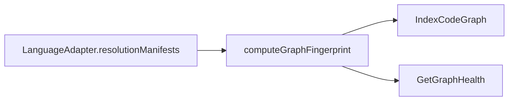

# Design: adapter-sourced-resolution-fingerprint

## Non-goals

- Do not change how TypeScript, Go, or PHP adapters parse package identity. Python identity parsing changes so only `[project].name` counts.
- Do not add `tsconfig*.json`, `jsconfig*.json`, `setup.cfg`, `setup.py`, or `go.work` to any adapter.
- Do not change JSON/TOON field names for staleness (`stale`, `fingerprintMismatch`). The text warning and full-rebuild reason do change so they name resolution-manifest content.
- Do not hash source files differently. Only resolution-manifest fingerprints change.
- Do not apply `.gitattributes` from the indexed project.
- Do not export `normalizeNewlines` from `@specd/core`. It is not on the public barrel. The fingerprint module keeps a private function with the same two replacements.

## Affected areas

`specd graph impact` on `code-graph:src/application/use-cases/_shared/compute-graph-fingerprint.ts` (dependents) is **CRITICAL** (27 direct, 329 transitive). The public fingerprint functions stay exported. Their inputs grow by a manifest-source port. Existing stored fingerprints will mismatch once and take the current full-rebuild path. Call sites that omit the new arguments will fail typecheck. The visible mismatch sentence changes.

- `packages/code-graph/src/domain/value-objects/language-adapter.ts`
  - Symbol: `LanguageAdapter`
  - Add a required method. No other method signatures change.

    ```ts
    resolutionManifests(): readonly string[]
    ```

  - The method returns exact basenames. It MUST NOT read the filesystem. JSDoc: description, `@returns`.
  - Risk: CRITICAL. Every class and test double that implements `LanguageAdapter` must add the method. Optional methods stay optional.

- `packages/code-graph/src/infrastructure/tree-sitter/typescript-language-adapter.ts`
  - Symbol: `TypeScriptLanguageAdapter`
  - Add `resolutionManifests(): readonly string[]` returning `['package.json']`.

- `packages/code-graph/src/infrastructure/tree-sitter/go-language-adapter.ts`
  - Symbol: `GoLanguageAdapter`
  - Add `resolutionManifests(): readonly string[]` returning `['go.mod']`.

- `packages/code-graph/src/infrastructure/tree-sitter/php-language-adapter.ts`
  - Symbol: `PhpLanguageAdapter`
  - Add `resolutionManifests(): readonly string[]` returning `['composer.json']`.

- `packages/code-graph/src/infrastructure/tree-sitter/python-language-adapter.ts`
  - Symbol: `PythonLanguageAdapter`
  - Add `resolutionManifests(): readonly string[]` returning `['pyproject.toml']`.

- `packages/code-graph/src/application/use-cases/_shared/compute-graph-fingerprint.ts`
  - Delete `RESOLUTION_MANIFESTS` and the `tsconfig` / `jsconfig` regex.
  - `GraphFingerprintInput` gains:

    ```ts
    readonly adapters: readonly LanguageAdapter[]
    readonly repoRoot: string | null
    readonly source: ResolutionManifestSource
    ```

  - Signature changes:

    ```ts
    export function computeGraphFingerprint(input: GraphFingerprintInput): string

    export function computeWorkspaceFingerprint(
      codeGraphVersion: string,
      projectRoot: string,
      workspace: ProjectWorkspace,
      workspaces: readonly ProjectWorkspace[],
      graphConfig: ProjectGraphConfig,
      adapters: readonly LanguageAdapter[],
      repoRoot: string | null,
      source: ResolutionManifestSource,
    ): string

    export function computeRootFingerprint(
      codeGraphVersion: string,
      projectRoot: string,
      workspaces: readonly ProjectWorkspace[],
      graphConfig: ProjectGraphConfig,
      adapters: readonly LanguageAdapter[],
      repoRoot: string | null,
      source: ResolutionManifestSource,
    ): string

    export function detectFingerprintMismatch(
      storedMap: Map<string, string>,
      codeGraphVersion: string,
      projectRoot: string,
      workspaces: readonly ProjectWorkspace[],
      graphConfig: ProjectGraphConfig,
      adapters: readonly LanguageAdapter[],
      repoRoot: string | null,
      source: ResolutionManifestSource,
    ): boolean
    ```

  - `parseFingerprintMap` and `serializeFingerprintMap` stay unchanged.
  - Do not import `normalizeNewlines` from `@specd/core`. It is not on the public barrel (`packages/core/src/index.ts` or `public.ts`). Copy the same two replacements into a private function in this file. Domain adapters still do not import `@specd/core`.

- Call sites that must pass `adapters` and `repoRoot`. `repoRoot` is the indexing run's `IndexOptions.vcsRoot`. `adapters` is `AdapterRegistryPort.getAdapters()` from the registry already wired into indexing and health:
  - `packages/code-graph/src/application/use-cases/index-code-graph.ts`
  - `packages/code-graph/src/application/use-cases/get-graph-health.ts`
  - `packages/code-graph/test/helpers/expected-fingerprint-map.ts` — `buildExpectedFingerprintMap` gains the same two trailing parameters and forwards them.
  - Every test that calls these functions, including `packages/code-graph/test/application/use-cases/compute-graph-fingerprint.spec.ts`, `packages/code-graph/test/application/use-cases/staleness-detection.verify.spec.ts`, and `packages/code-graph/test/application/use-cases/get-graph-health.spec.ts`.

- Test doubles that construct a `LanguageAdapter` must implement `resolutionManifests`. Doubles that are not asserting manifests return `[]`. The four real adapter specs assert the exact arrays above.

No `docs/` page lists the hardcoded manifest set or the dropped filenames as fingerprint inputs. Do not edit `docs/`. Update JSDoc on the touched exported functions.

## New constructs

`ResolutionManifestSource` in `packages/code-graph/src/application/ports/resolution-manifest-source.ts`:

```ts
export interface ResolutionManifestSource {
  directoryExists(path: string): boolean
  isRegularFile(path: string): boolean
  readText(path: string): string | undefined
}
```

`NodeResolutionManifestSource` in `packages/code-graph/src/infrastructure/fs/node-resolution-manifest-source.ts` implements that port with `node:fs`. `readText` returns `undefined` when the read throws. Composition passes one instance into indexing and graph health.

Private helper inside `compute-graph-fingerprint.ts`:

```ts
function normalizeNewlines(text: string): string {
  return text.replaceAll('\r\n', '\n').replaceAll('\r', '\n')
}
```

That function matches `packages/core/src/domain/services/normalize-newlines.ts`. It stays local because that symbol is not exported from `@specd/core`. Hashing uses the port's `readText` result. No `sha256:` prefix.

Shared diagnostic string, used as `fullRebuildReason` and, with a leading `⚠ `, as the graph-stats warning:

`Graph derivation fingerprint mismatch — code-graph version, workspace configuration, or resolution manifest content changed`

The stats line is `⚠ Derivation fingerprint mismatch — code-graph version, workspace configuration, or resolution manifest content changed`.

## Data models & Contracts

`ResolutionInputFingerprint` stays:

```ts
interface ResolutionInputFingerprint {
  readonly path: string
  readonly contentHash: string
}
```

`path` is the existing project-relative forward-slash form from `normalizeRelativePath`. `contentHash` is 64 lowercase hex characters. No `sha256:` prefix.

Fingerprint JSON payload shape is unchanged except `resolutionInputs` entries use the new discovery set and the new digest. Keys `v`, `w`, `g`, and `root` stay.

## Approach & Execution flow

1. Each built-in adapter implements `resolutionManifests()` with the single basename it already reads.
2. Callers pass the registered adapter list and `vcsRoot` into the fingerprint functions.
3. Collect basenames:
   - Union `adapter.resolutionManifests()` across the list.
   - Drop empty strings and any value that contains `/`, `\`, or `*`.
   - Do not add names from anywhere else.
4. For each workspace, set `start` to `resolve(codeRoot)` and `bound` to `resolve(repoRoot ?? projectRoot)`.
5. If `start` is `bound`, or `start` is inside `bound`, walk from `start` to `bound` inclusive via `dirname`. Stop at `bound`. Do not visit parents of `bound`.
6. If `start` is outside `bound`, inspect only `start`. Do not walk parents.
7. At each visited directory that exists, for each basename, if `join(dir, basename)` is a regular file, keep that absolute path. Deduplicate.
8. For each kept file, `readText`. If it returns `undefined`, omit the file. Otherwise `contentHash` is `sha256(normalizeNewlines(text))` as hex, hashed as UTF-8. `normalizeNewlines` rewrites CRLF and lone CR to LF. The application module does not import `node:fs`.
9. Sort entries by `path` with `localeCompare`.
10. `computeGraphFingerprint`, `computeWorkspaceFingerprint`, and `computeRootFingerprint` all call this helper for each workspace they already include. They do not scan a separate project-root directory list.

## Error handling & Edge cases

- Unreadable manifest: omit it. Do not throw from fingerprint computation.
- Missing basename: omit it. Do not hash empty content.
- `repoRoot === null`: bound is `projectRoot`.
- `adapters` empty: `resolutionInputs` is `[]`.
- Invalid basename (`*`, slashes, empty): ignore that entry.
- Directory whose name matches a basename: ignore it. Only regular files count.
- CRLF versus LF of the same text: equal `contentHash`.
- A declared manifest above `bound`: omitted.
- A declared manifest on the walk, including a parent of `codeRoot` still inside `bound`: included, even when a nearer file of the same name also exists.
- Changing normalized manifest text changes the fingerprint and uses the existing mismatch rebuild. A newline-only change does not.
- `tsconfig.json`, `jsconfig.json`, `setup.cfg`, `setup.py`, and `go.work` do not affect the digest unless some registered adapter returns that exact basename. Built-in adapters do not.

## Key decisions

- **Decision:** required `resolutionManifests(): readonly string[]` on `LanguageAdapter`. The typechecker forces every adapter and double to declare the set, including `[]`.
  - Rejected: optional method. A new adapter can read a manifest in `getPackageIdentity` and forget the declaration.
  - Rejected: globs. Built-in manifests are exact filenames, and globs reintroduce a second matching language in the fingerprint module.
- **Decision:** walk `codeRoot` to `vcsRoot` (else `projectRoot`) and hash every matching regular file on that walk.
  - Rejected: hash only the nearest file. A parent manifest is what the adapter reads when the nearer file is absent or does not yield an identity.
  - Rejected: keep the two-directory listing of project root and `codeRoot`. That misses manifests the adapter finds between them and still hashes files the adapter never reads.
- **Decision:** SHA-256 hex of locally defined `normalizeNewlines` UTF-8 text, no `sha256:` prefix. The helper stays in this module because `normalizeNewlines` is not exported from `@specd/core`.
  - Rejected: `NodeContentHasher.hash`, because that prefix would change the field format used inside the payload.
  - Rejected: raw bytes, because CRLF checkouts false-mismatch.
  - Rejected: a new `@specd/core` public export in this change.
- **Decision:** application fingerprint code reads manifests through `ResolutionManifestSource`. `node:fs` stays in `NodeResolutionManifestSource`.
  - Rejected: leave `readFileSync` in the application helper. That contradicts `default:_global/architecture`.
- **Decision:** Python identity is `[project].name` only, double- or single-quoted. An earlier table's `name` is ignored. A file without `[project].name` does not stop the walk.
- **Decision:** mismatch copy names resolution-manifest content in both `fullRebuildReason` and the text warning.

## Trade-offs

- Hashing every same-named file on the walk, including one shadowed by a nearer manifest, can still mismatch when only the unused parent changes newlines. Mitigation: the set is limited to declared basenames on the adapter walk, which removes the current false mismatches from `tsconfig`, `setup.py`, and `go.work`.
- Stored graphs mismatch once after upgrade. Mitigation: existing derivation-mismatch rebuild. No storage migration.
- `LanguageAdapter` implementors outside this repo must add the method. Mitigation: the method is a pure basename list and `[]` is valid.

## Spec impact

Direct spec dependents of the edited specs:

- `code-graph:go-language-adapter`, `code-graph:php-language-adapter`, and `code-graph:python-language-adapter` depend on `code-graph:language-adapter`. This change updates them.
- `code-graph:indexer` depends on `code-graph:language-adapter`. This change updates it.
- `code-graph:staleness-detection` depends on `code-graph:indexer` and, for this change, on `code-graph:language-adapter`. This change updates it.
- `code-graph:get-graph-health` and `cli:graph-stats` consume the existing mismatch boolean and warning text. Their requirements stay valid. Do not add them to the change.

No further spec deltas.

## Dependency map



```
┌──────────────────────────┐
│ LanguageAdapter          │
│ resolutionManifests()    │
└────────────┬─────────────┘
             │ basenames
             ▼
┌──────────────────────────┐     ┌─────────────────────┐
│ computeGraphFingerprint  │────▶│ IndexCodeGraph      │
│ computeWorkspace*        │     │ GetGraphHealth      │
│ computeRoot*             │     └─────────────────────┘
│ detectFingerprintMismatch│
└──────────────────────────┘
```

## Migration / Rollback

No schema or CLI migration. The next index sees a derivation mismatch and rebuilds. Rollback is reverting the code; the following index rebuilds again. Do not write a fingerprint migrator.

## Testing

Unit tests in `packages/code-graph/test/`, Vitest, `given/when/then` names. No snapshots. Use `os.tmpdir()` for filesystem cases. No hardcoded `/tmp`.

- `test/infrastructure/tree-sitter/typescript-language-adapter.spec.ts`: `resolutionManifests()` deep-equals `['package.json']`.
- `test/infrastructure/tree-sitter/go-language-adapter.spec.ts`: deep-equals `['go.mod']` and does not include `go.work`.
- `test/infrastructure/tree-sitter/php-language-adapter.spec.ts`: deep-equals `['composer.json']`.
- `test/infrastructure/tree-sitter/python-language-adapter.spec.ts`: deep-equals `['pyproject.toml']` and does not include `setup.cfg` or `setup.py`.
- `test/application/use-cases/compute-graph-fingerprint.spec.ts`:
  - A stub adapter returning `['package.json']` causes a `package.json` on `codeRoot` to be hashed.
  - The same text with LF and CRLF produces equal `contentHash` values, and the digest has no `sha256:` prefix.
  - `tsconfig.json` beside that file does not change the fingerprint when no adapter declares it.
  - A `composer.json` in a parent of `codeRoot` inside `repoRoot` is included when a stub declares `composer.json`.
  - A declared manifest above `repoRoot` is omitted.
  - With `repoRoot: null`, the walk stops at `projectRoot`.
  - An unreadable path is omitted rather than thrown. Skip this case on platforms where chmod cannot make a file unreadable; do not use `chmod 0o000` as the only path on Windows. Prefer a directory entry that is not a regular file, which must be omitted on every platform.
- `test/helpers/expected-fingerprint-map.ts` passes the same adapters and `repoRoot` the indexing tests use, so stored-map assertions stay aligned.
- `test/application/use-cases/staleness-detection.verify.spec.ts`: a CRLF-only manifest change does not report derivation mismatch when version and workspace config are unchanged; a normalized-text edit does.

Manual check after implementation:

```bash
node packages/cli/dist/index.js graph index --format toon
```

Expect one derivation rebuild, then a second index with no fingerprint mismatch while manifests are unchanged.

## Open questions

None.
