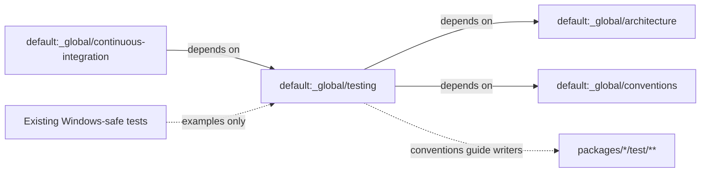

# Design: posix-windows-test-compatibility

## Non-goals

- Do not rewrite or remediate existing test files in packages (`packages/*/test/**`). Those already demonstrate the patterns; this change only makes the conventions binding in the global testing spec.
- Do not modify `default:_global/continuous-integration`, GitHub Actions workflows, Vitest config, or application `src/` code.
- Do not add a new capability spec; only evolve `default:_global/testing`.
- Do not change the Vitest-only, `test/` layout, typed-mock, or no-snapshot rules except where constraints list the new cross-platform bullets.

## Affected areas

Archive of this change merges deltas into these workspace files under the default (root) workspace:

| File                              | Change                                                                                                                                                                                                                                   |
| --------------------------------- | ---------------------------------------------------------------------------------------------------------------------------------------------------------------------------------------------------------------------------------------- |
| `specs/_global/testing/spec.md`   | Purpose mentions POSIX+Windows; new requirement **Tests are POSIX- and Windows-compatible**; **Fixtures are valid on Windows** body ties to that requirement and mentions `pathToFileURL`; Constraints gain four cross-platform bullets. |
| `specs/_global/testing/verify.md` | New requirement section with six scenarios; Fixtures temporary-path scenario also covers `pathToFileURL` / dynamic-import file URLs.                                                                                                     |

Change-local sources of truth until archive:

| File                                                                                                                     | Role                            |
| ------------------------------------------------------------------------------------------------------------------------ | ------------------------------- |
| `specd-sdd/changes/20260925-213024-posix-windows-test-compatibility/deltas/default/_global/testing/spec.md.delta.yaml`   | Spec delta (already written).   |
| `specd-sdd/changes/20260925-213024-posix-windows-test-compatibility/deltas/default/_global/testing/verify.md.delta.yaml` | Verify delta (already written). |

No TypeScript symbols, classes, or exports are modified. Blast radius is documentation/convention only: agents and humans writing future tests MUST follow the new rules; CI already fails Windows-incompatible tests via `default:_global/continuous-integration`.

**Reference anchors** (do not edit in this change; cite as examples of compliant technique):

- `packages/sdk/test/barrel.spec.ts` — `pnpm.cmd` + `shell: true` + `windowsHide` on `win32`
- `packages/core/test/infrastructure/node/hook-runner.spec.ts` — portable `node -e`; `%PATH%` expansion on Windows
- `packages/core/test/infrastructure/node/hook-runner-spawn.spec.ts` — `cmd.exe /d /s /c` + `windowsVerbatimArguments` when platform is `win32`
- `packages/core/test/infrastructure/node/translate-hook-command.spec.ts` — cmd vs POSIX quote translation
- `packages/code-graph/test/application/use-cases/workspace-indexing.spec.ts` — directory membership with `path.sep`
- `packages/core/test/application/use-cases/refresh-implementation-tracking.spec.ts` — `hostFiles()` remaps `/project/...` keys via `path.resolve`
- `packages/core/test/infrastructure/fs/config-loader-root-containment.spec.ts` — `path.win32` mock for drive-letter fixtures on any host
- `packages/core/test/infrastructure/fs/hash-newlines.spec.ts` / `ensure-tmp-gitignore.spec.ts` — CRLF ≡ LF for logical identity
- `packages/code-graph/test/composition/create-sqlite-graph-store-factory.spec.ts` — `os.tmpdir()` + `pathToFileURL`

## New constructs

_none_ — no new source files, types, or runtime modules.

## Data models & Contracts

_none_ — no runtime schemas. The normative contract is the merged markdown in `specs/_global/testing/spec.md` and `verify.md`.

### Normative requirements the archive MUST leave in place

1. **Tests are POSIX- and Windows-compatible** — every test MUST pass on POSIX (macOS, Linux) and Windows; paths via `node:path`; remap POSIX-looking fixture keys; `path.win32` (or equivalent) when testing Windows path rules off-Windows; portable spawn (`node -e`); Windows `*.cmd` + shell / expansion / quoting; CRLF/CR ≡ LF for logical text identity; no Unix-only permission/symlink sole setups on Windows.
2. **Fixtures are valid on Windows** — specializes filesystem fixtures: `os.tmpdir()`, `pathToFileURL` (or equivalent) for file URLs; no hardcoded `/tmp` / `file:///tmp/...`; no `chmod 0o000` as unreadability on Windows.
3. Existing requirements unchanged in intent: Test runner, Unit tests, Port mocks, Integration tests, Test naming, No snapshot tests.
4. Constraints MUST include the four new bullets (POSIX+Windows compatibility; `node:path` / no hardcoded POSIX absolute temp paths; portable process/hook behaviour; CRLF/CR ≡ LF).

### Spec dependencies (unchanged)

- `default:_global/architecture` — unit vs integration boundaries
- `default:_global/conventions` — ESM / Vitest rationale

Do not add `default:_global/continuous-integration` as a dependency of testing (CI already depends on testing).

## Approach & Execution flow

1. Confirm deltas under `deltas/default/_global/testing/` already encode the normative text above (spec + verify).
2. Implementation phase for this change is **archive-only content**: no code edits. Tasks are validate → ready → archive (and any compliance check that the deltas still preview correctly).
3. On archive, merge deltas into `specs/_global/testing/spec.md` and `specs/_global/testing/verify.md`.
4. After archive, project context / optimized summaries that derive from `default:_global/testing` will pick up the new language on the next context optimization; do not hand-edit generated agent instruction blocks inside `<specd>` tags.
5. **Documentation (`docs/`)**: no `docs/**` file currently documents `_global/testing` conventions as a user guide. Do **not** create a new docs page for this change. If a future guide catalogs monorepo conventions, it MUST point at `specs/_global/testing` rather than duplicating rules. Root `AGENTS.md` / `CLAUDE.md` generated `<specd>` blocks MUST NOT be manually patched; regenerate via specd context tooling after archive if summaries are stale.

## Error handling & Edge cases

- Delta apply failure at archive → fix selectors/content in the change deltas; do not hand-edit archived specs outside the workflow.
- Spec/verify requirement parity: every `### Requirement:` in merged `spec.md` MUST have a matching section in merged `verify.md` (already covered by the deltas).
- Agents reading only Purpose and missing the new requirement → Purpose now states POSIX+Windows MUST; Constraints also list the rules.
- Overlap with CI: if someone proposes changing the OS matrix, that belongs in `default:_global/continuous-integration`, not this change.

## Key decisions

| Decision                                 | Rationale                                                                          | Rejected                                  |
| ---------------------------------------- | ---------------------------------------------------------------------------------- | ----------------------------------------- |
| Add a new requirement plus keep Fixtures | Clear general rule + preserve concrete tmpdir/chmod/`pathToFileURL` specialization | Only renaming Fixtures; deleting Fixtures |
| Spec-and-verify-only                     | User asked to clarify the testing spec; suite already fixed                        | Bulk test remediation in this change      |
| Encode real suite techniques             | Avoid abstract “be portable” without actionable rules                              | Vague SHOULD language                     |
| No new CI dependency on testing          | CI already declares depends-on testing                                             | Bidirectional dep clutter                 |
| No new `docs/` page                      | Specs are source of truth; no existing testing guide to update                     | Parallel markdown that drifts             |

## Trade-offs

- [Spec grows longer] → Mitigation: Fixtures remains a short specialization; general rule carries the detail once.
- [Does not force-fix latent POSIX-only tests] → Mitigation: CI on `windows-latest` still fails them; compliance can be a follow-up change.
- [“MAY set windowsHide” is soft] → Mitigation: spawn correctness (shell / `*.cmd`) is MUST; hide is UX noise only.

## Spec impact

- **Modified:** `default:_global/testing`
- **Direct dependent already in tree:** `default:_global/continuous-integration` depends on testing for “what `pnpm test` means”. Its requirements remain valid; no delta needed (identical three-OS job still runs Vitest).
- **Transitive:** package-level specs that mention Vitest layout inherit conventions via global include patterns / agents reading `_global/testing`. No requirement text in those specs needs edits for this change.
- Do not add further specs to this change unless archive or compliance shows a contradictory requirement elsewhere.

## Dependency map



```
┌─────────────────────────────┐
│ continuous-integration      │
│ (macos/ubuntu/windows CI)   │
└──────────────┬──────────────┘
               │ depends on
               ▼
┌─────────────────────────────┐     ┌──────────────────┐
│ _global/testing             │────▶│ architecture     │
│ + POSIX/Windows requirement │     └──────────────────┘
│ + fixtures / pathToFileURL  │────▶┌──────────────────┐
└──────────────┬──────────────┘     │ conventions      │
               │ guides             └──────────────────┘
               ▼
        future Vitest tests
```

## Migration / Rollback

- **Deploy:** archive the change so merged specs land on `main`; no runtime migration.
- **Rollback:** revert the archive commit (or restore previous `specs/_global/testing/{spec,verify}.md`); no data migration.

## Testing

This change has no new Vitest files. Verification of the change itself:

1. `node packages/cli/dist/index.js changes validate posix-windows-test-compatibility --format text` — all artifacts pass.
2. `node packages/cli/dist/index.js changes spec-preview posix-windows-test-compatibility default:_global/testing --diff --format text` — merged spec/verify match the normative contract above.
3. Confirm verify scenarios exist for: path hardcoding; fixture key remap; `path.win32` off-Windows; POSIX-only shell builtins; Windows `*.cmd` / `%PATH%` / quoting; CRLF identity; tmpdir + `pathToFileURL`; chmod-on-Windows.
4. After archive: optional smoke `pnpm test` on the current host (not required to prove the wording; CI remains the multi-OS gate).

Manual checklist after archive: open `specs/_global/testing/spec.md` and confirm the new requirement heading and Constraints bullets are present.

## Open questions

_none_
