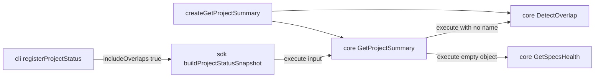

# Design: include-overlaps-in-project-summary

## Non-goals

- No second project-status use case.
- No new validation or overlap cache. Spec validation caching stays in `ValidateSpecs`.
- No change to `DetectOverlap` or `GetSpecsHealth` semantics.
- No new kernel member. `kernel.changes.detectOverlap` already exists.
- No edits to `packages/core/src/composition/kernel.ts` or `kernel-builder.ts` beyond what TypeScript requires if a call site constructs `GetProjectSummaryDeps` by hand. `createKernel` keeps `createGetProjectSummary(resolveGetProjectSummaryDeps(resolver))`.
- No API routes, client, or UI.
- No `project dashboard` change. It keeps calling `buildProjectStatusSnapshot` without `includeOverlaps`, so its summary stays without `overlaps`.
- No `failedClosedSpecs`, no `activeSpecIds` filter, and no "specs outside changes" health mode.

## Affected areas

- `packages/core/src/application/use-cases/get-project-summary.ts`
  - `GetProjectSummaryInput` gains `readonly includeOverlaps?: boolean`.
  - `GetProjectSummaryResult` gains `readonly overlaps?: OverlapReport`.
  - Import `OverlapReport` from `../../domain/value-objects/overlap-report.js` and `DetectOverlap` from `./detect-overlap.js`.
  - Constructor appends a last parameter `detectOverlap: DetectOverlap`, stored as `private readonly _detectOverlap`.
  - Before:
    ```ts
    constructor(
      changes: ChangeRepository,
      archive: ArchiveRepository,
      listWorkspaces: ListWorkspaces,
      listChanges: ListChanges,
      listDrafts: ListDrafts,
      countTasks: CountTasks,
      getSpecsHealth: GetSpecsHealth,
    )
    ```
  - After: same parameters, then `detectOverlap: DetectOverlap`.
  - `execute`: `const includeOverlaps = input?.includeOverlaps === true`. Add `includeOverlaps ? this._detectOverlap.execute() : Promise.resolve(undefined)` to the existing `Promise.all`. Spread `...(includeOverlaps && overlaps !== undefined ? { overlaps } : {})` on the returned object.
  - Callers of `new GetProjectSummary` and any object passed as `GetProjectSummaryDeps` must supply `detectOverlap`. Config-based `createGetProjectSummary(config, options?)` stays source-compatible.
  - `createGetProjectSummary` is riskLevel HIGH. Direct dependents are `createKernel` in `packages/core/src/composition/kernel.ts`, `packages/core/src/composition/kernel-builder.ts`, and composition tests. The config overload signature does not change.

- `packages/core/src/composition/use-cases/get-project-summary.ts`
  - `GetProjectSummaryDeps` gains `readonly detectOverlap: DetectOverlap`.
  - `resolveGetProjectSummaryDeps` sets `detectOverlap: createDetectOverlap(resolveDetectOverlapDeps(resolver))`.
  - Import `createDetectOverlap` and `resolveDetectOverlapDeps` from `./detect-overlap.js`.
  - `createGetProjectSummaryFromNormalized` passes `detectOverlap` into `new GetProjectSummary(...)` as the last argument.
  - `isGetProjectSummaryDeps` also requires `'detectOverlap' in value`.

- `packages/sdk/src/orchestration/build-project-status-snapshot.ts`
  - `BuildProjectStatusSnapshotOptions` gains `readonly includeOverlaps?: boolean`.
  - `const includeOverlaps = options?.includeOverlaps === true`.
  - `summaryInput` is built when `includeChanges || includeSpecsHealth || includeOverlaps`. Include `includeOverlaps: true as const` only when that flag is true. When all three are false, pass `undefined` to `execute`.
  - Do not call `DetectOverlap`. Do not copy `overlaps` onto the snapshot root. `result.summary` is the use-case result unchanged.
  - Callers that omit the flag stay count-only for overlaps. `project dashboard` is one of those callers and must keep compiling.

- `packages/cli/src/commands/project/status.ts` — `registerProjectStatus`
  - Both `buildProjectStatusSnapshot` calls (default and `--graph`) add `includeOverlaps: true` next to the existing `includeChanges: true` and `includeSpecsHealth: true`.
  - `const overlaps = summary.overlaps`.
  - json/toon root object gains `...(overlaps !== undefined ? { overlaps } : {})` beside `specsHealth`.
  - Help text JSON/TOON schema comment lists `overlaps?: { entries, hasOverlap }`.
  - Text mode, after the specs-health lines and before `graph.freshness`:
    - When `overlaps` is undefined, print nothing.
    - When `overlaps.hasOverlap` is false, print `overlaps: (none)`.
    - When `overlaps.hasOverlap` is true, print `overlaps:` and one line per entry: `  <specId>: <name> [<state>], <name> [<state>]` using `entry.changes` in report order, joined by `, `.
  - Do not call `kernel.project.getProjectSummary` or `kernel.changes.detectOverlap` from this handler.

- Tests listed in Testing. Update the existing `GetProjectSummary` contract in `docs/core/use-cases.md` and the existing `project status` sections in `docs/cli/cli-reference.md` and `docs/cli/project.md`. Command help in `status.ts` stays aligned with the same root `overlaps` field. Do not add a new doc file.
- `docs/cli/project.md` option `--graph` must say extended graph statistics and hotspots. It must not say that `--graph` indexes the graph or gates freshness. Freshness is always loaded because the handler passes `includeGraph: true`. `--graph` only sets `includeHotspots`.

## New constructs

None. `OverlapReport` and `DetectOverlap` already exist.

`OverlapReport` fields used here:

- `entries: readonly OverlapEntry[]`
- `hasOverlap: boolean` (`entries.length > 0`)

Each `OverlapEntry` has `specId: string` and `changes: readonly { name: string; state: string }[]`.

## Data models & Contracts

`GetProjectSummaryInput`:

```ts
export interface GetProjectSummaryInput {
  readonly includeChanges?: boolean
  readonly includeSpecsHealth?: boolean
  readonly includeOverlaps?: boolean
}
```

Defaults are false. Only `=== true` turns a flag on.

`GetProjectSummaryResult` adds:

```ts
readonly overlaps?: OverlapReport
```

Absent means the key is omitted, not `null` and not `undefined` assigned as an own property. With `exactOptionalPropertyTypes`, use a conditional spread.

`BuildProjectStatusSnapshotOptions` adds `readonly includeOverlaps?: boolean` with the same `=== true` rule.

`project status` json/toon adds a root field `overlaps` equal to `snapshot.summary.overlaps` when that property is present. Text shape:

```
overlaps: (none)
overlaps:
  core:get-project-summary: alpha [designing], beta [designing]
```

## Approach & Execution flow

`GetProjectSummary.execute`:

1. Read `includeChanges`, `includeSpecsHealth`, and `includeOverlaps` with `=== true`.
2. `Promise.all` the existing count and enrichment promises, plus the overlap promise: `includeOverlaps ? this._detectOverlap.execute() : Promise.resolve(undefined)`.
3. `execute()` takes no `name`. Every active change participates. Drafts, discarded, and archived changes stay out of the report because `DetectOverlap` only lists active changes.
4. Build `specsByWorkspace` as today.
5. Return counts plus conditional spreads for listings, `specsHealth`, and `overlaps`.
6. Do not post-process `specsHealth`. If `GetSpecsHealth.execute({})` includes a spec that is also in an active change's `specIds`, return that result unchanged.

`resolveGetProjectSummaryDeps`:

1. Resolve the existing seven dependencies the same way.
2. Set `detectOverlap` from `createDetectOverlap(resolveDetectOverlapDeps(resolver))`.
3. Pass that object to `new GetProjectSummary`.

`buildProjectStatusSnapshot`:

1. Derive the three summary booleans.
2. If none are true, `execute(undefined)`.
3. Otherwise `execute` with only the true flags set to `true`.
4. Return `{ summary, graphHealth, approvals, llmOptimizedContext, hotspots? }` as today. `summary.overlaps` is present only when the use case included it.

`project status`:

1. `openSpecdHost` as today.
2. Call `buildProjectStatusSnapshot` with `includeGraph: true`, `includeChanges: true`, `includeSpecsHealth: true`, `includeOverlaps: true`, and `includeHotspots` only when `--graph` is set.
3. Render `summary.overlaps` as specified above.

## Error handling & Edge cases

- `DetectOverlap.execute()` with no name does not throw `ChangeNotFoundError`. An empty active set returns `entries: []` and `hasOverlap: false`. The summary key `overlaps` is still present when the flag is true.
- `includeOverlaps: false` or omitted: do not call `DetectOverlap`. Omit `overlaps`.
- Do not catch overlap errors inside `GetProjectSummary`. A repository failure propagates.
- Graph failure behaviour in the snapshot is unchanged.
- `project status` still sends thrown errors through `handleError`.

## Key decisions

- Overlaps are an optional field on the existing summary, forwarded by the SDK snapshot. The CLI does not call core beside the snapshot.
- `project status` always passes `includeOverlaps: true`. There is no CLI flag to turn it off.
- The flag defaults to false on the use case and on the snapshot so other hosts, including `project dashboard`, stay unchanged.
- Empty overlap is a present report, not a missing key.
- `specsHealth` stays the raw `GetSpecsHealth.execute({})` result.

Rejected:

- A second `GetProjectSummary` or `DetectOverlap` call from the CLI.
- Copying `overlaps` to a sibling of `summary` on the snapshot.
- Filtering health by active-change `specIds`.
- A new cache.

## Trade-offs

- `includeOverlaps: true` loads every active change inside `DetectOverlap` → only the opt-in path pays that cost. `project status` always opts in.
- Adding a required constructor and deps field breaks hand-built `GetProjectSummary` / `GetProjectSummaryDeps` literals → update those tests in the same change. Config-based factories stay compatible.
- Dashboard does not show overlaps until a later change passes the flag → accepted.

## Spec impact

Modified specs: `core:get-project-summary`, `sdk:build-project-status-snapshot`, `cli:project-status`.

`cli:project-status` already depends on the summary and the snapshot. `sdk:build-project-status-snapshot` already depends on `core:get-project-summary`. `core:get-project-summary` now also depends on `core:spec-overlap`.

`core:spec-overlap` and `core:get-specs-health` are not modified. Their requirements stay valid: unfiltered `DetectOverlap` returns the full active-change report, and `GetSpecsHealth.execute({})` stays project-wide.

`cli:project-dashboard` depends on the snapshot but does not pass `includeOverlaps`. Default false keeps that command's current summary shape. It does not need a spec delta in this change.

No other spec needs a requirement change. Kernel exposure of `getProjectSummary` is unchanged.

## Dependency map



```
┌────────────────────┐
│ cli project status │
└─────────┬──────────┘
          │ includeOverlaps: true
          ▼
┌──────────────────────────┐
│ buildProjectStatusSnapshot│
└─────────┬────────────────┘
          │ getProjectSummary.execute
          ▼
┌────────────────────┐     ┌───────────────┐
│ GetProjectSummary  │────▶│ DetectOverlap │
└────────────────────┘     └───────────────┘
```

## Migration / Rollback

No stored data migration. Rollback is reverting the three packages. Persisted changes and spec locks are untouched. Old callers that omit `includeOverlaps` keep the previous result shape.

## Testing

Unit tests use Vitest, `given…, when…, then…` titles, and mocked ports. Unused mock methods throw `not implemented`.

`packages/core/test/application/use-cases/get-project-summary.spec.ts`:

- No flags: result has counts and no `active`, `drafts`, `specsHealth`, or `overlaps`. `DetectOverlap.execute` is not called.
- `includeOverlaps: true` with a report whose `hasOverlap` is true: `overlaps` equals that report. `execute` is called with no argument or with no `name`.
- `includeOverlaps: true` and an empty report: `overlaps.entries` is `[]` and `overlaps.hasOverlap` is `false`.
- `includeOverlaps: false`: key absent, `execute` not called.
- `includeSpecsHealth: true` while an active change `specIds` contains a spec that `GetSpecsHealth` returns: `specsHealth` equals that health result unchanged.

`packages/core/test/composition/use-cases/get-project-summary.spec.ts`:

- `resolveGetProjectSummaryDeps` / config factory supplies `detectOverlap` from `createDetectOverlap`.
- Explicit deps without `detectOverlap` are not treated as deps.

`packages/sdk/test/orchestration/build-project-status-snapshot.spec.ts`:

- `{ includeOverlaps: true }` forwards `includeOverlaps: true` and does not call `DetectOverlap`.
- `{}` calls `execute` without the three enrichment flags.
- With all three flags, `summary.overlaps` is on `summary` only, not on the snapshot root.

`packages/cli/test/commands/project/status.spec.ts`:

- The snapshot options include `includeOverlaps: true` with `includeChanges` and `includeSpecsHealth`.
- json/toon output includes `overlaps` from the summary.
- Text prints `overlaps: (none)` when `hasOverlap` is false.
- Text prints `specId` and change names when `hasOverlap` is true.
- The handler does not call `getProjectSummary` or `detectOverlap` on the kernel.

Run:

```bash
pnpm --filter @specd/core exec vitest run test/application/use-cases/get-project-summary.spec.ts test/composition/use-cases/get-project-summary.spec.ts
pnpm --filter @specd/sdk exec vitest run test/orchestration/build-project-status-snapshot.spec.ts
pnpm --filter @specd/cli exec vitest run test/commands/project/status.spec.ts
```

## Kernel mapping

`core:kernel` documents the keys `createKernel` already returns. Do not edit `packages/core/src/composition/kernel.ts` or `kernel-builder.ts`.

Add the missing table rows and rename `specs.resolveSchema` to `specs.resolve`. The full list is in the proposal. Root `registry` and `schemas` stay on the kernel object. The nested-groups scenario names those two fields plus `changes`, `specs`, and `project`.

`createKernel` is not modified, so this sync has no new code blast radius.

## Audit follow-up

`GetProjectSummary` is riskLevel CRITICAL. Dependents include `createKernel` and composition tests. This follow-up does not change the constructor signature or the result type. It changes when `specRepo.count()` starts.

In `packages/core/src/application/use-cases/get-project-summary.ts` `execute`:

1. Start `ListWorkspaces.execute()` in the same `Promise.all` as change-bucket counts, the archive count, and enabled enrichments.
2. Chain per-workspace `specRepo.count()` on that workspace promise so the counts begin when the list resolves.
3. Do not `await` the change-count batch and then start spec counts. Spec counts must not wait for `ChangeRepository.count`, `countDrafts`, `countDiscarded`, `ArchiveRepository.count`, or `DetectOverlap.execute()`.
4. `specsByWorkspace` stays keyed by workspace name in configuration order. `workspaceCount` stays `workspaces.length`.

`kernel.ts` stays unchanged. `CompositionResolver.getVcsAdapter()` already calls `createVcsAdapter(config.projectRoot, registry.vcsProviders)` and reuses the promise. `getActorResolver()` uses `createLazyVcsActorResolver(() => getVcsAdapter())` when `config.actorProvider` is omitted, and wraps `PrivacyActorResolver` when `config.privacy` is set. The VCS requirement body and the four VCS scenarios already say that. They do not tell callers to use `createKernelInternals` or `createVcsActorResolver(config.projectRoot)`.

The Constraints list in `core:kernel` must be a single bullet. Remove the item whose label is `` `createKernelInternals` is not exported from `@specd/core` — it is internal to the composition layer ``. Insert one item: `` `createKernel` does not export `createKernelInternals`. Project VCS and actor resolution stay on `CompositionResolver`. `` A list-item `modified` keeps the old label and nests the new sentence under it, so the delta uses `removed` and `added`. No source file changes for this bullet. `createKernel` is not edited, so this correction has no code blast radius.

In `packages/cli/src/commands/project/status.ts`, the after-help JSON/TOON schema:

- `overlaps` is present, with `hasOverlap` and `entries`. It is not optional.
- `approvals` is `{ specEnabled, signoffEnabled }`.
- each workspace entry includes `name`, `prefix`, `ownership`, `isExternal`, and `codeRoot`.

Docs:

- `docs/core/ports.md`: the `createGetProjectSummary` example uses `changes`, `archive`, `listWorkspaces`, `listChanges`, `listDrafts`, `countTasks`, `getSpecsHealth`, and `detectOverlap`. It does not pass `listDiscarded`, `listArchived`, or resolver list getters that do not exist.
- `docs/core/overview.md`: the `GetProjectSummary` export line says the default path returns counts without loading entities, and `includeOverlaps: true` loads active changes through `DetectOverlap.execute()`.
- `docs/guide/cli.md`: the `project status` line includes always-on overlaps.
- `docs/cli/cli-reference.md`: the workspace bullet includes `isExternal` and `codeRoot`.

Tests:

- `packages/core/test/application/use-cases/get-project-summary.spec.ts`: a deferred change-count promise must not block `specRepo.count()` once workspaces have resolved.
- `packages/cli/test/commands/project/status.spec.ts`: `--help` text contains `overlaps: {` without `overlaps?:`, contains `specEnabled` and `signoffEnabled`, and does not describe approvals as `{ spec, signoff }`.

## Open questions

None.
