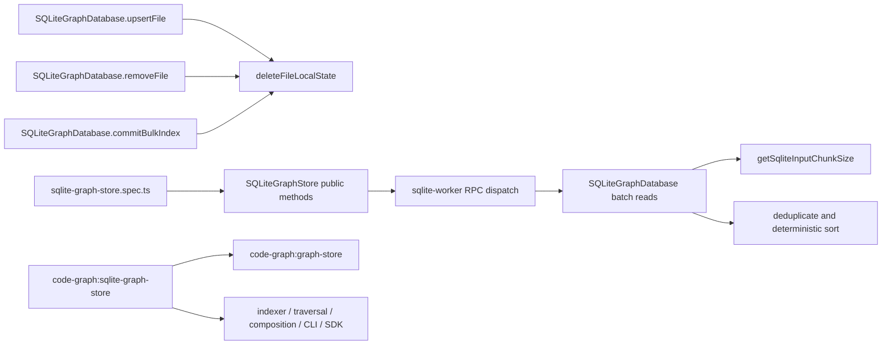

# Design: fix-sqlite-delete-file-variable-limit

## Non-goals

- Do not change `GraphStore`, `SQLiteGraphStore`, or worker RPC public signatures.
- Do not change the SQLite schema, schema version, indexes, persistence location, or
  migration behavior.
- Do not change TypeScript parsing or symbol extraction. Array-backed data-property
  filtering belongs to `filter-typescript-array-data-symbols`.
- Do not add temporary config exclusions or document such exclusions in specs or
  verification.
- Do not redesign paginated source search filters or filtered impact-frontier semantics.
  `searchSourceCandidates()` exclusion filters are not batch lookup keys, and
  `queryImpactFrontierDirection()` already accounts for its frontier, relation-type,
  and filter parameters. Their negative-filter and multi-dimensional query semantics
  require a separate design if their existing explicit budget behavior changes.
- Do not modify documentation under `docs/`. This is an internal correctness fix with
  no public API, CLI, configuration, schema, deployment, or operator-facing behavior
  change.

## Affected areas

### Existing implementation file

- `packages/code-graph/src/infrastructure/sqlite/sqlite-graph-database.ts`
  - `SQLiteGraphDatabase.deleteFileLocalState(db: SqliteDatabase, filePath: string): void`
    - Signature before and after is unchanged.
    - Replace materialization of every file-local symbol id and the three variable-width
      statements with three constant-width statements: delete relations whose source or
      target belongs to the file, delete symbols by `file_path`, then retain file-path
      relation, FTS, and file-row cleanup.
    - Direct callers are `upsertFile()`, `removeFile()`, and `commitBulkIndex()`.
    - Symbol impact: 3 direct dependents, 3 affected files, `MEDIUM` risk. The transaction
      boundaries remain at those callers, so rollback behavior is preserved.
  - `SQLiteGraphDatabase.findDirectlyAffectedFiles(filePaths: readonly string[]): string[]`
    - Signature is unchanged.
    - De-duplicate and sort lookup paths, execute the existing union query per safe chunk,
      merge affected paths into a `Set<string>`, and return one lexicographically sorted
      array. Each input path occupies two bind positions. The fixed parameters are the
      import relation type plus every symbol-dependency relation type.
    - Symbol impact: 2 direct dependents, 2 affected files, `LOW` risk.
  - `SQLiteGraphDatabase.getRelationsByTargets(type: RelationTypeValue, targets: readonly string[]): Relation[]`
    - Signature is unchanged.
    - Reserve one parameter for `type`, query sorted unique targets in safe chunks, merge
      relation rows by the composite key `source + NUL + type + NUL + target`, then map and
      sort with `compareRelations`.
    - Direct callers are `getCoveringSpecsForFiles()` and
      `getCoveringSpecsForSymbols()`. Symbol impact is `MEDIUM`: 2 direct and 1 indirect
      dependents across 3 files.
  - The following existing lookup methods keep their signatures and SQL projections but
    divide their primary caller-provided lookup keys into safe chunks:
    - `findLogicalSymbolsByIds(ids: readonly string[]): LogicalSymbol[]`
    - `findDeclarations(logicalSymbolIds: readonly string[]): LogicalDeclaration[]`
    - `findPublicBindingsByExportedNames(exportedNames: readonly string[]): PublicBinding[]`
    - `findSymbols(query: SymbolQuery): SymbolNode[]`, only for non-empty
      `query.filePaths`
    - `readFreshnessLatches(workspaces: readonly string[]): FreshnessLatches`
    - `findLogicalSymbolsByQualifiedNames(qualifiedNames: readonly string[]): LogicalSymbol[]`
    - `findLogicalDeclarations(logicalSymbolIds: readonly string[]): LogicalDeclaration[]`
    - `findResolutionSteps(fromIds: readonly string[]): ResolutionStep[]`
    - `findIndexCoverage(filePaths: readonly string[]): IndexCoverage[]`
  - Existing already-bounded methods remain behaviorally unchanged:
    `getSymbolsByIds()`, `getFilesByPaths()`, `getDocumentsByPaths()`,
    `getSpecsByIds()`, `getSymbolRelationsBatch()`,
    `queryImpactFrontierDirection()`, `loadExistingIds()`, and batched inserts.
  - File-level impact for this implementation file is `CRITICAL`: 29 direct, 340
    indirect, and 106 further transitive dependents across 63 files. This reflects that
    the class implements the central SQLite adapter, not a public contract change. Risk is
    mitigated by unchanged signatures, worker messages, schema, and transaction ownership,
    plus integration coverage through the public store.

- `packages/code-graph/src/infrastructure/sqlite/sqlite-graph-store.ts`
  - Keep every public method signature and worker payload unchanged.
  - Add host-boundary empty-input returns to `findDirectlyAffectedFiles()`,
    `getCoveringSpecsForFiles()`, `getCoveringSpecsForSymbols()`,
    `findLogicalSymbolsByQualifiedNames()`, `findLogicalSymbolsByIds()`,
    `findDeclarations()`, `findPublicBindings()`,
    `findPublicBindingsByExportedNames()`, `findResolutionSteps()`, and
    `findIndexCoverage()`.
  - Each guard returns `[]` before calling `client.sendRequest(...)`. This is required to
    preserve the no-worker-RPC contract for an empty logical batch; worker/database guards
    alone occur too late to satisfy it.
  - The change is backwards compatible: non-empty calls use the same RPC operation and
    DTO, while empty calls retain the same result and avoid unnecessary worker work.

### Existing test file

- `packages/code-graph/test/infrastructure/sqlite/sqlite-graph-store.spec.ts`
  - Add public-adapter integration cases for direct replacement, direct removal, bulk
    replacement, budget-plus-one lookup batches, duplicate/unknown keys, and statements
    with fixed or repeated parameters.
  - Add a direct `upsertFile()` rollback regression whose replacement relation has
    `metadata: { invalid: 1n }`. `BigInt` crosses the worker boundary through structured
    clone, but `SQLiteGraphDatabase.insertRelations()` must fail when it serializes that
    metadata with `JSON.stringify()` after file cleanup, file insertion, and symbol
    insertion have begun; assert the complete baseline graph and FTS state.
  - Reuse `SQLiteGraphStore` and existing domain factories. No test-only production hooks,
    exported constants, or direct inspection of SQL text are introduced.
  - File-level graph impact is reported as `CRITICAL` because the graph connects this broad
    integration suite to 23 implementation and test files. The file itself has no runtime
    consumers; changes are additive assertions.

### Callers inspected but not modified

- `packages/code-graph/src/infrastructure/sqlite/sqlite-worker.ts` dispatches the same
  operation names and serializable payloads.
- `packages/code-graph/test/composition/create-sqlite-graph-store-factory.spec.ts` is an
  impacted composition test but requires no change because construction is unchanged.
- `packages/code-graph/src/domain/ports/graph-store.ts` remains unchanged because all
  ordering, duplicate, unknown-key, empty-input, and atomicity behavior fits its existing
  contracts.

## New constructs

Two module-private helpers are added to
`packages/code-graph/src/infrastructure/sqlite/sqlite-graph-database.ts`:

```ts
/**
 * Computes how many primary input values fit in one SQLite statement.
 *
 * @param fixedParameterCount - Bind positions not contributed by the primary input.
 * @param inputMultiplicity - Bind positions occupied by each primary input value.
 * @returns A positive number of primary input values per SQL statement.
 * @throws {RangeError} When the accounting values are invalid or leave no usable budget.
 */
function getSqliteInputChunkSize(fixedParameterCount: number, inputMultiplicity?: number): number
```

The implementation treats omitted `inputMultiplicity` as `1`, requires both values to be
integers, requires `fixedParameterCount >= 0` and `inputMultiplicity >= 1`, and returns:

```ts
Math.floor((SQLITE_BATCH_PARAMETER_LIMIT - fixedParameterCount) / inputMultiplicity)
```

It throws `RangeError('Invalid SQLite batch parameter accounting')` for invalid accounting
arguments and `RangeError('SQLite batch parameter budget exhausted')` when the result is
less than one. The constant remains `SQLITE_BATCH_PARAMETER_LIMIT = 900`.

```ts
/**
 * Compares symbol nodes in a stable backend-independent order.
 *
 * @param left - First symbol.
 * @param right - Second symbol.
 * @returns Negative, zero, or positive according to file, source position, and id.
 */
function compareSymbolNodes(left: SymbolNode, right: SymbolNode): number
```

The comparator orders by `filePath`, `line`, `column`, then `id`, using `localeCompare`
for strings and numeric subtraction for coordinates. `findSymbols()` applies it after its
existing wildcard filters, whether or not `filePaths` required more than one chunk, so
chunk boundaries cannot affect output order.

No new exported file, class, interface, type, service, dependency, configuration value, or
worker protocol field is introduced.

## Data models & Contracts

Public and persisted data shapes are unchanged. The implementation observes these merge
contracts while executing multiple SQL statements for one logical worker operation:

| Result              | Merge identity                                                   | Final ordering                                  |
| ------------------- | ---------------------------------------------------------------- | ----------------------------------------------- |
| affected file path  | path string                                                      | `localeCompare`                                 |
| relation            | `source`, `type`, `target` joined with NUL separators            | `compareRelations`                              |
| logical symbol      | `id`                                                             | `compareLogicalSymbols`                         |
| logical declaration | `logicalSymbolId`, `symbolId`, `kind` joined with NUL separators | `compareLogicalDeclarations`                    |
| public binding      | `id`                                                             | `comparePublicBindings`                         |
| symbol              | `id`                                                             | `compareSymbolNodes`                            |
| freshness latch     | workspace string                                                 | existing `FreshnessLatches` object construction |
| resolution step     | `fromId`, `toId`, `kind` joined with NUL separators              | `compareResolutionSteps`                        |
| index coverage      | `filePath`                                                       | `filePath.localeCompare`                        |

Primary lookup inputs are de-duplicated and sorted before chunking whenever requested input
order is not part of the contract. This canonicalization applies to logical-symbol ids,
declaration ids, exported and qualified names, resolution-step source ids, index-coverage
paths, relation targets, and directly affected paths; equivalent input sets therefore
produce identical chunk membership regardless of caller permutation. Methods that already
filter empty strings continue doing so. Unknown lookup keys contribute no rows. Empty
primary inputs return the same empty result without preparing or executing SQL.
`readFreshnessLatches()` still always includes one internal `__graph__` key, sorts the
deduplicated query keys, and defaults missing rows to `false`.

One host call still maps to one worker RPC. Chunking exists only inside
`SQLiteGraphDatabase`; neither host payloads nor worker responses expose chunks.

## Approach & Execution flow

### File-local cleanup

For `upsertFile()`, `removeFile()`, and every removed path in `commitBulkIndex()`:

1. Enter the caller's existing `db.transaction(...)` callback.
2. Execute the following statement with `[filePath, filePath]`:

   ```sql
   DELETE FROM relations
   WHERE source IN (SELECT id FROM symbols WHERE file_path = ?)
      OR target IN (SELECT id FROM symbols WHERE file_path = ?)
   ```

3. Execute `DELETE FROM symbols WHERE file_path = ?` with `[filePath]`.
4. Execute the existing `DELETE FROM relations WHERE source = ? OR target = ?` with
   `[filePath, filePath]` to remove file-endpoint relations.
5. Execute the existing FTS and file-row deletes by path.
6. Continue the caller's existing replacement inserts or commit stages. If any statement
   fails, SQLite rolls back the complete caller transaction.

The relation deletion must precede symbol deletion because relation endpoints are
polymorphic and have no symbol foreign-key cascade. Existing indexes on
`symbols(file_path)`, `relations(source, type)`, and `relations(target, type)` support the
subqueries. The number of bind values is constant: two for symbol-relation cleanup, one for
symbol cleanup, and fixed-width existing path cleanup.

### Budget-aware batch reads

Every affected method follows this sequence:

1. Apply its existing input normalization, additionally de-duplicating the primary lookup
   collection before SQL generation. Sort normalized lookup keys when requested order is
   not part of the port contract.
2. Return immediately for an empty effective collection.
3. Count parameters that do not come from the primary collection.
4. Set `inputMultiplicity` to the number of placeholder occurrences contributed by each
   primary value. It is `2` only for `findDirectlyAffectedFiles()` and `1` for the other
   affected methods.
5. Compute the chunk size with `getSqliteInputChunkSize(fixed, multiplicity)`.
6. For each `chunksOf(normalizedInputs, chunkSize)` chunk, prepare and execute the existing
   query shape with placeholders only for that chunk. Scalar predicates and other fixed
   parameters are repeated for each statement.
7. Merge rows by the identity table above, preventing duplicates caused by duplicate inputs,
   overlapping chunks, joins, or unions.
8. Map rows to existing domain values and apply the existing comparator, or the new stable
   symbol comparator, before returning.

The exact parameter accounting is:

| Method / primary input                                  |                         Fixed parameters | Multiplicity |
| ------------------------------------------------------- | ---------------------------------------: | -----------: |
| `getRelationsByTargets()` / targets                     |                          1 relation type |            1 |
| `findDirectlyAffectedFiles()` / paths                   | 1 import type + `dependencyTypes.length` |            2 |
| `findSymbols()` / `query.filePaths`                     |    count of active scalar SQL predicates |            1 |
| all other affected lookups / their documented key array |                                        0 |            1 |

For `findSymbols()`, build scalar conditions and scalar parameters once, excluding the
`filePaths` predicate. If `query.filePaths` is non-empty, execute once per sorted unique
path chunk with `file_path IN (...)`; otherwise execute once with the existing scalar
conditions. Apply existing wildcard filtering after rows are merged, then sort with
`compareSymbolNodes`.

`readFreshnessLatches()` prepends `__graph__`, de-duplicates all names, queries name chunks,
and constructs the response using the original requested workspace list so result keys and
false defaults remain unchanged.

## Error handling & Edge cases

- SQLite errors continue crossing the worker boundary through existing serialization. No
  new public error class or code is introduced.
- Any cleanup or replacement statement failure aborts the enclosing SQLite transaction.
  Previous file rows, symbols, relations, FTS rows, and bulk generation visibility remain
  unchanged.
- A relation that points to a removed symbol from another file is deleted because both
  source and target subqueries are evaluated before symbols are removed.
- A file with no symbols skips no required work: both subquery deletes are valid no-ops and
  file-endpoint relations, FTS data, and the file row are still removed.
- Duplicate lookup keys are ignored. Unknown keys add no result. Empty inputs avoid SQL,
  except the intentional internal `__graph__` freshness lookup.
- A batch of exactly the computed chunk size uses one SQL statement; one value beyond it
  uses two. Every statement has at most 900 bind values.
- Fixed parameters and repeated primary values are included in the 900-value budget.
- Invalid internal accounting throws the exact `RangeError` messages defined for
  `getSqliteInputChunkSize()`. Normal public inputs for the affected methods cannot reach
  these defensive branches because their fixed counts are bounded.
- Existing `RangeError` behavior and messages in `getSymbolRelationsBatch()` and
  `queryImpactFrontierDirection()` remain unchanged.
- Chunks execute serially in the persistent worker. There is no new concurrency, shared
  mutable state, cancellation point, or host backpressure behavior.

## Key decisions

- **Use correlated file-path subqueries for cleanup.** They keep parameter count constant,
  avoid transferring thousands of ids into JavaScript, and use existing indexes.
  - Rejected: JavaScript-side deletion chunks. They avoid the limit but retain ID
    materialization, increase statement count, and complicate atomic cleanup.
  - Rejected: schema cascades. Relation endpoints are polymorphic, so conventional foreign
    keys cannot represent every endpoint type without a schema redesign and migration.
- **Use the existing conservative 900-parameter budget.** This works across SQLite builds
  whose compiled maximum differs and matches existing adapter practice.
  - Rejected: detect `SQLITE_MAX_VARIABLE_NUMBER` at runtime. It adds platform-dependent
    behavior and does not remove the need for complete parameter accounting.
- **Compute chunk size from the whole statement.** Subtract fixed parameters and divide by
  primary-input multiplicity before flooring.
  - Rejected: `chunksOf(input, 900)` everywhere. It fails for relation-type parameters and
    for paths appearing in two predicates.
- **Merge and sort inside the worker database class.** The host still sends one request,
  and deterministic semantics do not depend on chunk boundaries.
  - Rejected: multiple host RPCs. That changes protocol behavior, exposes partial progress,
    and increases worker boundary overhead.
- **Keep search exclusions and impact-filter Cartesian chunking out of scope.** They are
  not primary-key batch lookup operations, and splitting `NOT IN` predicates or multiple
  independent filter dimensions cannot be implemented by simple union without changing
  semantics.

## Trade-offs

- More SQL statements are executed for batches larger than the safe budget → values are
  still processed within one worker RPC, statements are bounded, and merged results are
  de-duplicated deterministically.
- The cleanup relation delete contains two indexed subqueries → this is preferable to
  materializing and binding every id; integration tests cover incoming and outgoing
  relations to guard correctness.
- Stable sorting adds `O(n log n)` work after some chunked reads → it prevents chunk order
  from becoming observable and operates only on already-returned result rows.
- Regression fixtures with roughly 16,384 symbols are heavier than ordinary unit cases →
  keep them in the SQLite integration suite and construct minimal nodes/relations so they
  directly reproduce the former two-place parameter expansion.
- File- and spec-level graph impact is `CRITICAL` because the SQLite adapter and its spec
  are central → unchanged APIs/schema and focused package-wide validation mitigate the
  broad theoretical blast radius.

## Spec impact

The modified `code-graph:sqlite-graph-store` spec has `CRITICAL` dependent impact: 2 direct,
5 indirect, and 25 further transitive dependents, 32 dependent specs in total. Direct and
transitive consumers include the abstract graph store, composition, indexing, traversal,
symbol resolution, graph CLI commands, SDK composition, and public API reference.

No dependent requirement needs a delta. The change strengthens an adapter guarantee while
preserving all port method signatures, result shapes, worker RPCs, ordering contracts,
atomic visibility, and schema compatibility. In particular:

- `code-graph:graph-store`, traversal, and resolution continue receiving the same complete,
  deterministic logical results.
- indexer and isolated-index-worker mutation paths retain the same atomic commit boundary.
- composition, CLI, SDK, and public-web contracts do not expose SQL chunking or cleanup
  implementation.
- Global architecture remains satisfied because all SQL and I/O stay in the infrastructure
  adapter; domain and application layers are untouched.
- Global conventions remain satisfied through strict types, named existing imports, no
  `any`, unchanged ESM structure, and explicit method return types.
- Global testing requirements are satisfied with public-adapter integration coverage.
- Global documentation requirements require no `docs/` edit because no public or documented
  contract changes. Both new private helpers receive complete JSDoc.

## Dependency map



```text
upsertFile ───────┐
removeFile ───────┼──▶ deleteFileLocalState ──▶ constant-width SQLite cleanup
commitBulkIndex ──┘                                  │
                                                    ▼
host GraphStore call ──▶ one worker RPC ──▶ bounded SQL chunks
                                               │
                                               ▼
                                  de-duplicate + deterministic sort
                                               │
                                               ▼
                                      unchanged public result

code-graph:sqlite-graph-store [CRITICAL spec reach]
  └── graph-store / indexer / traversal / composition / CLI / SDK
```

## Migration / Rollback

No data or schema migration is required. Existing databases open at the same schema version
and use the same indexes and rows. Deployment consists only of publishing the rebuilt
`@specd/code-graph` package through the normal repository release process.

Rollback is a code-only revert of the implementation and tests. Databases written by the
new version remain readable by the previous version because no schema or persisted value
changes. Rollback restores the former variable-limit vulnerability for large files and
batches, so it is operationally safe for data compatibility but not recommended for
affected repositories.

## Testing

### Automated integration tests

Extend `packages/code-graph/test/infrastructure/sqlite/sqlite-graph-store.spec.ts` with the
following public `SQLiteGraphStore` cases:

1. **Direct upsert cleanup over the former limit**
   - Insert one file with 16,384 minimal symbols and relations covering both directions
     between its symbols and retained external endpoints, a file-endpoint relation, and
     distinctive persisted source content that is visible through the existing FTS-backed
     search path.
   - Call `upsertFile()` with replacement state.
   - Assert no `too many SQL variables` error, no old symbol is retrievable, no incoming or
     outgoing old relation or old file-endpoint relation remains, the old content is no
     longer searchable, and only replacement state is visible.
2. **Direct remove cleanup over the former limit**
   - Insert an equivalent large file, call `removeFile()`, and assert the file, every old
     symbol, file-endpoint relation, symbol-endpoint relation, and file-content search entry
     are absent.
3. **Bulk commit cleanup over the former limit**
   - Commit a large initial file with incoming and outgoing symbol relations, a
     file-endpoint relation, and FTS-searchable source content; stage its
     removal/replacement through
     `beginBulkIndexSession()`, and commit.
   - Assert the commit succeeds atomically, removes every old relation and old FTS
     candidate, and exposes only replacement state.
4. **Cleanup rollback**
   - Commit a baseline file with two symbols, both incoming and outgoing symbol relations,
     a file-endpoint relation, and source content searchable through
     `searchSourceContentCandidates()`.
   - Create replacement symbols and a relation whose endpoints both exist in the replacement
     set, using `createRelation({ ... , metadata: { invalid: 1n } })`, then call the public
     adapter exactly as
     `store.upsertFile(replacementFile, replacementSymbols, [invalidMetadataRelation])`.
     `BigInt` is structured-cloneable, so the request reaches the worker. The relation passes
     endpoint filtering, but `SQLiteGraphDatabase.insertRelations()` MUST throw a `TypeError`
     when `JSON.stringify()` serializes its metadata, after `deleteFileLocalState()`, file
     insertion, and symbol insertion have executed inside the enclosing transaction.
   - Assert the call rejects; the original file and exact symbols remain; the original
     incoming, outgoing, and file-endpoint relations remain; the baseline source-content
     query still returns the file; the replacement source-content query returns no file;
     and no replacement symbol or relation is visible.
   - Do not add a production test hook, public API parameter, schema change, or error
     translation. The non-JSON-serializable metadata is a deterministic test input accepted
     by the existing `Relation.metadata: Readonly<Record<string, unknown>>` contract and
     keeps the regression entirely at the public adapter boundary.
5. **Repeated-input budget boundary**
   - Call `findDirectlyAffectedFiles()` with 446 and 447 unique paths plus duplicates and
     unknown paths. With 7 fixed values and multiplicity 2, 446 is the largest safe chunk.
   - Assert both calls succeed, return identical complete lexicographically ordered results
     for equivalent known inputs, and contain no duplicates.
6. **Fixed-parameter budget boundary**
   - Exercise `getCoveringSpecsForFiles()` and `getCoveringSpecsForSymbols()` with 899 and
     900 targets. One relation-type parameter leaves 899 target positions.
   - Assert complete `compareRelations` order, de-duplication, unknown omission, and no
     variable-limit error.
7. **Remaining collection lookup families**
   - Create 901 minimal records and invoke each affected public path for logical-symbol ids,
     declarations, exported names, `SymbolQuery.filePaths`, freshness workspaces, qualified
     names, logical declarations, resolution steps, and index coverage.
   - Include a duplicate and an unknown key in each call.
   - Assert exact returned identity sequences rather than counts alone: every known matching
     row appears once, unknowns are omitted/defaulted as defined, and reversing equivalent
     input sets preserves the same result.
   - Build symbol fixtures spanning multiple file paths, lines, columns, and ids and assert
     the exact `filePath`, `line`, `column`, `id` comparator order. Assert the corresponding
     exact comparator order for logical symbols, declarations, bindings, resolution steps,
     and index coverage, and retain the existing empty-input results.
8. **Single worker request invariant**
   - Extend the existing worker dispatch-spy test table for representative newly chunked
     methods and assert one logical call emits exactly one worker operation despite multiple
     internal SQL statements.

Existing relation-batch tests that exercise 896/897/898 identifiers with three relation
types and batches above 900 remain unchanged and must continue passing.

### Commands and expected results

Run from the repository root:

```bash
pnpm --filter @specd/code-graph test -- test/infrastructure/sqlite/sqlite-graph-store.spec.ts
pnpm --filter @specd/code-graph typecheck
pnpm --filter @specd/code-graph lint
pnpm --filter @specd/code-graph build
```

Expected results: every command exits with status 0; Vitest reports all SQLite graph-store
cases passing; typecheck reports no diagnostics; lint reports no errors; build emits the
ESM bundles and declarations successfully. Any `SqliteError: too many SQL variables`,
duplicate merged row, order mismatch, dangling relation, partial replacement state, worker
RPC count above one, or timeout is a failure.

No separate manual database migration or E2E UI check is needed. The integration tests use
the real SQLite adapter, persistent worker boundary, temporary database files, and public
store methods, which cover the complete changed execution path.
