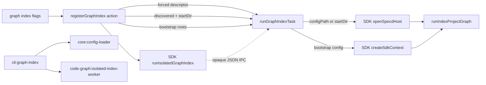

# Design: fix-graph-index-worker-config-cascade

## Non-goals

- Do not change config discovery, cascade ordering, `extends`, environment override, or forced-load semantics in `@specd/core`.
- Do not serialize or transfer `SpecdConfig`, kernels, adapters, maps, or other runtime objects across IPC.
- Do not change the generic isolated-worker protocol, supervisor, lock ownership, child lifecycle, or JSON validation in `@specd/code-graph`.
- Do not change the SQLite storage worker. It receives storage inputs and is not part of project-config reconstruction.
- Do not change graph commands other than `graph index`, their flags, output formats, or provider lifecycle.
- Do not add bootstrap fallback to a descriptor that represents a project discovered successfully by the parent.

## Affected areas

### Production code

- `packages/cli/src/commands/graph/index-graph.ts`
  - Symbol: `registerGraphIndex(parent: Command): void`, specifically its command action and `taskContext` construction.
  - The public function signature and command signature remain unchanged.
  - Capture `const discoveryStartDir = process.cwd()` before awaiting `resolveGraphCliContext(...)`. This is the directory used to represent the parent's automatic-discovery request; it must be absolute because `process.cwd()` is absolute.
  - Replace the two-way configured/bootstrap descriptor construction with three branches:
    - `context.mode === 'bootstrap'` produces the unchanged bootstrap descriptor.
    - configured context plus `opts.config !== undefined` produces `{ mode: 'forced', configPath: context.configFilePath }` after retaining the existing non-null guard.
    - configured context plus `opts.config === undefined` produces `{ mode: 'discovered', startDir: discoveryStartDir }`.
  - Continue passing `context.config.configPath` as `storageRoot`; this preserves the parent-selected lock identity.
  - Do not modify `resolveGraphCliContext`, `GraphCliContext`, other graph commands, output rendering, progress wiring, or error exit handling.
  - Impact: `registerGraphIndex` is consumed by CLI program registration and its command tests. File-level graph impact is MEDIUM, but changing the shared `GraphCliContext` would expand aggregate impact to CRITICAL across 17 files. Avoiding that shared type change is the compatibility mitigation.

- `packages/cli/src/graph-index-task.ts`
  - Symbols: `CliGraphIndexContextDescriptor` and `runGraphIndexTask`.
  - Replace the configured descriptor variant with separate forced and discovered variants. `CliGraphIndexTaskInput`, `CliGraphIndexProgress`, and the `runGraphIndexTask` function signature remain unchanged.
  - Reconstruct forced mode with `openSpecdHost({ configPath, options: { kernel } })`.
  - Reconstruct discovered mode with `openSpecdHost({ startDir, options: { kernel } })`.
  - Reconstruct bootstrap mode with the existing `createSdkContext(createBootstrapGraphConfig(...), { kernel })` flow.
  - Invoke `runIndexProjectGraph` exactly once after any successful reconstruction and preserve force, exclusion, progress, and result passthrough.
  - Impact: graph analysis reports MEDIUM risk, two direct callers/importers, no cross-workspace caller, and seven affected files including command registration and tests. `runGraphIndexTask` is a MEDIUM hotspot with two direct callers.

### Tests

- `packages/cli/test/commands/graph-index.spec.ts`
  - Update configured task-input assertions to expect forced or discovered descriptors.
  - Add distinct coverage for explicit `--config` and automatic discovery.
  - Mock or spy on `process.cwd()` for deterministic discovery-start assertions.
  - Preserve existing bootstrap, progress, result, validation, and isolation-boundary tests.

- `packages/cli/test/graph-index-task.spec.ts`
  - Replace the configured reconstruction test with separate forced and discovered tests.
  - Assert the exact `openSpecdHost` argument for each mode and that `createSdkContext` is not called.
  - Preserve bootstrap, option forwarding, progress forwarding, single invocation, and package-boundary tests.

### Explicitly unaffected shared areas

- `packages/cli/src/commands/graph/resolve-graph-cli-context.ts` and `GraphCliContext` remain unchanged. Search, stats, hotspots, and impact continue consuming the same configured/bootstrap context.
- `packages/sdk/src/composition/host-context.ts` remains unchanged. `OpenSpecdHostInput` already supports mutually exclusive `configPath` and `startDir`; absent `allowBootstrapFallback`, discovery failure propagates.
- `packages/code-graph/src/application/ports/isolated-graph-index-runner.ts` and isolated-worker infrastructure remain unchanged. The new descriptor is composed only of strings and object discriminants accepted by the existing JSON boundary.
- No `docs/` page requires an update because command flags, documented discovery behaviour, output, and public API remain unchanged. Update JSDoc on the modified descriptor variants and task reconstruction comments so generated API documentation accurately describes forced and discovered modes.

## New constructs

No new files, services, functions, classes, or exported entry points are introduced. The existing exported descriptor type is replaced in place by the following complete definition:

```ts
/** Serializable description of the graph context reconstructed by the task. */
export type CliGraphIndexContextDescriptor =
  | {
      /** Explicit config-file loading; filename discovery must not attach siblings. */
      readonly mode: 'forced'
      /** Absolute config entrypoint selected by --config. */
      readonly configPath: string
    }
  | {
      /** Normal project discovery replayed inside the child. */
      readonly mode: 'discovered'
      /** Absolute directory from which the parent started discovery. */
      readonly startDir: string
    }
  | {
      /** Explicit no-config graph bootstrap. */
      readonly mode: 'bootstrap'
      /** Absolute project root used by the bootstrap config. */
      readonly projectRoot: string
      /** Absolute VCS root used by the bootstrap config. */
      readonly vcsRoot: string
    }
```

The union must remain structurally JSON-serializable. All path fields are required strings; no variant accepts both `configPath` and `startDir`; there are no optional fallback fields.

## Data models & Contracts

`CliGraphIndexTaskInput` remains:

```ts
export interface CliGraphIndexTaskInput {
  readonly context: CliGraphIndexContextDescriptor
  readonly index: {
    readonly force: boolean
    readonly excludePaths?: readonly string[]
  }
}
```

The serialized payload contracts are:

```ts
// Explicit --config
{
  context: { mode: 'forced', configPath: '/abs/repo/specd.yaml' },
  index: { force: false }
}

// Automatic discovery
{
  context: { mode: 'discovered', startDir: '/abs/repo/subdirectory' },
  index: { force: false }
}

// Bootstrap
{
  context: { mode: 'bootstrap', projectRoot: '/abs/repo', vcsRoot: '/abs/repo' },
  index: { force: false }
}
```

The parent continues to derive the lock from the fully resolved `context.config.configPath`. The child descriptor carries reconstruction intent, not a second lock path and not an effective-config snapshot.

Backward compatibility is internal and source-level: `CliGraphIndexContextDescriptor` is exported from the task module but is not a CLI flag or SDK public contract. All repository call sites must migrate atomically from `mode: 'configured'` to `mode: 'forced' | 'discovered'`. There is no compatibility parser for the old descriptor because parent and packaged task are version-affine and deployed together.

## Approach & Execution flow

1. The `graph index` action parses flags and stores `process.cwd()` in `discoveryStartDir` before context resolution.
2. `resolveGraphCliContext({ configPath: opts.config, repoPath: opts.path })` runs unchanged:
   - `--config` loads an exact forced file and returns `mode: 'configured'`.
   - `--path` returns `mode: 'bootstrap'`.
   - no flags discover and merge project config from the current directory, or return bootstrap when no config exists.
3. The action converts the resolved command context into a task descriptor:
   - bootstrap context → bootstrap descriptor;
   - configured context with `opts.config` → forced descriptor using the resolved non-null `configFilePath`;
   - configured context without `opts.config` → discovered descriptor using `discoveryStartDir`.
4. The action constructs `CliGraphIndexTaskInput`, preserving `force` and `excludePaths`, then calls `runIsolatedGraphIndex` exactly once with the parent config's storage root.
5. The generic runner validates and transfers the descriptor as ordinary JSON without interpreting its mode.
6. `runGraphIndexTask` builds CLI kernel options once and switches on `input.context.mode`:
   - forced → `openSpecdHost({ configPath: input.context.configPath, options: { kernel } })`;
   - discovered → `openSpecdHost({ startDir: input.context.startDir, options: { kernel } })`;
   - bootstrap → existing `createBootstrapGraphConfig` plus `createSdkContext`.
7. After reconstruction succeeds, the task calls `runIndexProjectGraph` exactly once and forwards force, optional exclusions, and progress unchanged.
8. The result travels through the existing worker protocol and the parent renders it without transformation changes.

The discovered branch intentionally re-reads files. Given unchanged filesystem state, it uses the same start directory and loader algorithm as the parent and therefore reconstructs the same active cascade, including local variants.

## Error handling & Edge cases

- Explicit `--config` with a missing or invalid file continues to fail during parent context resolution as a CLI/domain error before a worker starts.
- A configured context selected by explicit `--config` with `configFilePath === null` retains the existing `cliError('configured graph context is missing its config file path', ..., 1)` guard.
- If a discovered config disappears or becomes invalid between parent resolution and child reconstruction, `openSpecdHost({ startDir })` rejects. `allowBootstrapFallback` MUST remain absent, so `ConfigNotFoundError` and validation failures propagate through the task failure and existing fatal exit-code-3 path.
- The discovered child MUST NOT fall back to bootstrap, retry from child CWD, or use the earlier root `configFilePath` as a forced fallback.
- If active local layers change during the parent-child window, the child observes the later discovery result. This is an inherent TOCTOU window; the command fails only if the resulting config is invalid or unavailable. Snapshot consistency is not introduced by this fix.
- Relative `--config` input is normalized by existing config loading; the forced descriptor uses the resolved `context.configFilePath`, not the raw flag.
- `startDir` is captured before asynchronous resolution so later process-CWD mutation cannot change the descriptor.
- `--path`, no-config bootstrap, `--force`, `--exclude-path`, text progress, structured output, worker lock errors, provider recovery, and per-file errors retain existing behaviour.
- IPC JSON validation needs no new error class or code. Invalid payloads continue to use existing isolated-worker protocol/task errors.

## Key decisions

- **Keep `GraphCliContext` unchanged.** `graph index` already has the flag information needed to distinguish explicit config from automatic discovery. This avoids a CRITICAL-impact shared-interface change affecting search, stats, hotspots, impact, their tests, program registration, and unrelated specs.
- **Replay discovery from an explicit parent-captured directory.** This reuses the existing loader contract and makes the discovery anchor deterministic.
- **Keep explicit `--config` forced.** Attaching sibling local files would violate established config-loader and CLI semantics.
- **Keep bootstrap explicit.** A discovered project must never silently become bootstrap if replay fails.
- **Keep the generic worker opaque.** Configuration belongs to the CLI task; the code-graph worker transports validated JSON and owns isolation mechanics only.

Rejected alternatives:

- Sending the resolved `SpecdConfig` snapshot was rejected because it expands IPC, includes richer runtime-oriented structures, and creates a serialization contract for composition state.
- Using inherited child CWD without a `startDir` field was rejected because it hides the parent's discovery anchor and is fragile under tests or future fork options.
- Sending the discovered root config path was rejected because reopening it with `configPath` is the defect: it converts discovery to forced mode.
- Changing forced mode to attach `specd.local.*` siblings was rejected because it breaks explicit-file semantics and custom config paths.
- Modifying `resolveGraphCliContext` to expose resolution provenance was rejected for this implementation because graph impact marks its shared interface CRITICAL and the index action can derive the same information locally.

## Trade-offs

- **Discovery is executed twice and remains subject to a filesystem TOCTOU window** → carry the exact start directory, fail rather than substitute bootstrap, and cover disappearance with a test. Snapshot atomicity is explicitly outside scope.
- **The descriptor type changes without accepting its previous configured variant** → parent and child task are packaged and versioned together; update all internal callers and tests in one change.
- **Resolution provenance is derived from CLI flags rather than stored in shared context** → limits blast radius; if future non-CLI callers need provenance, introduce a dedicated resolver result under a separate spec change.
- **Aggregate graph impact is CRITICAL when all initially considered files include the shared resolver** → do not modify that file; the final planned production set is only `index-graph.ts` and `graph-index-task.ts`, both covered by focused regression tests.

## Spec impact

- `cli:graph-index` changes its indexing-behaviour requirement. Fresh spec impact reports LOW risk, zero direct or transitive dependent specs, and one covered test file. No downstream spec requires a delta.
- `core:config-loader` is a no-op participant. Its existing discovery and forced-mode requirements already define the required behaviour.
- `code-graph:isolated-index-worker` is a no-op participant. Its existing opaque JSON-task contract already accepts the descriptor.
- Graph file impact lists `cli:graph-cli-context`, `cli:graph-hotspots`, `cli:graph-stats`, `cli:entrypoint`, and other CLI specs because they cover shared resolver/program files. The final design avoids changes to those shared files, so their requirements remain valid.
- Global architecture remains intact: CLI imports platform capabilities only through `@specd/sdk`; no domain layer gains I/O; no new workspace dependency or cycle is introduced. TypeScript remains strict ESM with named exports and documented public types.

## Dependency map



```text
┌──────────────────────────────┐
│ registerGraphIndex           │
│ index-graph.ts [MEDIUM]      │
│ flags + captured parent CWD  │
└──────────────┬───────────────┘
               │ forced | discovered | bootstrap (JSON)
               ▼
┌──────────────────────────────┐
│ isolated runner              │
│ opaque transport + lock      │
└──────────────┬───────────────┘
               ▼
┌──────────────────────────────┐
│ runGraphIndexTask [MEDIUM]   │
│ configPath | startDir | root │
└──────────────┬───────────────┘
               ▼
┌──────────────────────────────┐
│ SDK host + index orchestration│
└──────────────────────────────┘

Shared GraphCliContext [CRITICAL blast radius] is read but not modified.
```

## Migration / Rollback

No database, graph schema, persisted config, or user data migration is required. Parent and child task code ship in the same CLI package, so deployment is an atomic package upgrade.

Rollback consists of reverting the two production files and their tests to the previous `configured | bootstrap` descriptor. Existing graph databases remain compatible. A graph generated during a buggy pre-fix run may be refreshed with `node packages/cli/dist/index.js graph index --force` after upgrade; no storage deletion should be performed manually.

## Testing

### Automated tests

- `packages/cli/test/commands/graph-index.spec.ts`
  - Explicit `--config` produces `{ mode: 'forced', configPath: resolvedPath }` and retains parent-derived `storageRoot`.
  - Configured context without `--config` produces `{ mode: 'discovered', startDir: capturedCwd }`.
  - `--path` and no-config bootstrap produce the unchanged bootstrap descriptor.
  - Force, exclusion arrays, task module URL, text progress, structured-output silence, result rendering, exit codes, and absence of direct code-graph/isolation imports remain covered.

- `packages/cli/test/graph-index-task.spec.ts`
  - Forced descriptor calls `openSpecdHost` exactly once with `configPath` and kernel options.
  - Discovered descriptor calls `openSpecdHost` exactly once with `startDir` and kernel options.
  - Both configured variants avoid `createSdkContext`; bootstrap avoids `openSpecdHost`.
  - Every successful mode calls `runIndexProjectGraph` once and preserves result, force, exclusions, and progress.
  - A rejected discovered `openSpecdHost` call propagates and does not invoke bootstrap or indexing.

- Run focused tests:

  ```bash
  pnpm --filter @specd/cli test -- test/commands/graph-index.spec.ts test/graph-index-task.spec.ts
  ```

- Run package quality gates:

  ```bash
  pnpm --filter @specd/cli typecheck
  pnpm --filter @specd/cli lint
  pnpm --filter @specd/cli test
  pnpm --filter @specd/cli build
  ```

### Manual / E2E verification

1. Build the CLI with `pnpm --filter @specd/cli build`.
2. In a disposable git repository, create a valid `specd.yaml` whose graph configuration includes one base exclusion.
3. Create `specd.local.yaml` with `extends: true` and a visibly different graph exclusion or workspace path.
4. From a nested directory, run:

   ```bash
   node /path/to/specd/packages/cli/dist/index.js graph index --force --format toon
   ```

5. Confirm the indexed coverage/files reflect the local layer and the command exits 0.
6. From the same directory, run the explicit forced form:

   ```bash
   node /path/to/specd/packages/cli/dist/index.js graph index --config /path/to/repo/specd.yaml --force --format toon
   ```

7. Confirm the explicit command follows only `specd.yaml` plus its declared `extends` chain and does not attach the sibling local file.
8. Remove or rename the discovered config after parent resolution in a controlled test seam; confirm the child reports a fatal task/config error with exit code 3 and does not create a bootstrap graph.

Failure indicators are: discovery mode sending `configPath`, explicit mode sending `startDir`, parent and child using different workspace/exclusion sets, bootstrap fallback after replay failure, multiple calls to `runIndexProjectGraph`, IPC protocol errors for the new string-only payload, or changes to structured output.
