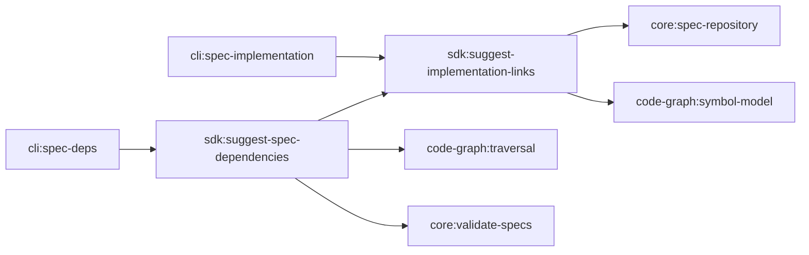

# Design: suggest-implementation-and-spec-deps

## Overview

This design artifact is the **master technical specification** for implementing automated, static-analysis suggestion capabilities in `@specd/sdk` and exposing them via `@specd/cli`. An implementer reading this document and `tasks.md` has complete, unambiguous contracts, code signatures, step-by-step algorithms, data structures, and CLI handler specifications without needing to consult other artifacts.

The feature consists of two orchestration use cases in `@specd/sdk`:

1. `SuggestImplementationLinks` (`packages/sdk/src/orchestration/suggest-implementation-links.ts`)
2. `SuggestSpecDependencies` (`packages/sdk/src/orchestration/suggest-spec-dependencies.ts`)

And two CLI subcommands in `@specd/cli`:

1. `specd specs implementation suggest` (`packages/cli/src/commands/spec/implementation.ts`)
2. `specd specs deps suggest` (`packages/cli/src/commands/spec/deps.ts`)

## Context

Spec authors currently manually discover and correlate implementation files, exported AST symbols, and inter-spec `dependsOn` relationships when initializing or updating `spec-lock.json`. This manual process is error-prone and creates onboarding friction. Automated static analysis deduces implementation links and spec dependencies with 100% determinism, zero LLM token cost, and sub-second performance.

## Scope

- **New SDK Use Cases**: `SuggestImplementationLinks` and `SuggestSpecDependencies` in `@specd/sdk`.
- **New CLI Commands**: `suggest` subcommands under `specd specs implementation` and `specd specs deps`.
- **System Cache**: Persistent suggestion cache stored under `join(projectDir, config.configPath, 'tmp', 'fs-cache', 'implementation-suggestions/suggestions.json')`.
- **Non-Existent Spec Validation**: Commands and SDK use cases throw `SpecNotFoundError` if specified target spec IDs do not exist in the repository.
- **AST Symbol & Dynamic Multi-Language Correlator**: Queries supported source extensions dynamically from registered language adapters (`createBuiltinAdapterRegistry().getSupportedExtensions()`) with zero hardcoded file extensions. Supports camelCase & PascalCase symbols, backticked file path parsing, prose keyword filtering, disk file existence verification (`existsSync`), and lifecycle `open()`/`close()` management on `codeGraphProvider`.

## Affected areas & Code Graph Impact Analysis

Impact findings computed via `specd graph impact --direction dependents`:

- `packages/sdk/src/orchestration/suggest-implementation-links.ts` (NEW)
  - Risk: LOW · Additive Use Case in `@specd/sdk`.

- `packages/sdk/src/orchestration/suggest-spec-dependencies.ts` (NEW)
  - Risk: LOW · Additive Use Case in `@specd/sdk`.

- `packages/sdk/src/domain/value-objects/implementation-suggestion-cache.ts` (NEW)
  - Risk: LOW · Domain value objects, types, stamp contracts, and constants for implementation suggestion cache.

- `packages/sdk/src/domain/value-objects/spec-deps-suggestion-cache.ts` (NEW)
  - Risk: LOW · Domain value objects and types for spec dependencies suggestion cache.

- `packages/sdk/src/application/ports/implementation-suggestion-cache-port.ts` (NEW)
  - Risk: LOW · Abstract application port (`ImplementationSuggestionCachePort`) exposing object-oriented query methods (`get`, `set`, `setMany`, `isSpecFresh`, `findSpecByFile`, `getFileToSpecMap`, `flush`, `invalidate`).

- `packages/sdk/src/application/ports/spec-deps-suggestion-cache-port.ts` (NEW)
  - Risk: LOW · Abstract application port (`SpecDepsSuggestionCachePort`) exposing object-oriented query methods (`get`, `set`, `setMany`, `isSpecFresh`, `flush`, `invalidate`).

- `packages/sdk/src/infrastructure/fs/fs-implementation-suggestion-cache.ts` (NEW)
  - Risk: LOW · Filesystem adapter (`FsImplementationSuggestionCache`) implementing lazy single-pass loading, in-memory bidirectional indexing (`code -> spec`), dirty tracking, and atomic persistence.

- `packages/sdk/src/infrastructure/fs/fs-spec-deps-suggestion-cache.ts` (NEW)
  - Risk: LOW · Filesystem adapter (`FsSpecDepsSuggestionCache`) implementing lazy single-pass loading, dirty tracking, and atomic persistence.

- `packages/cli/src/commands/spec/implementation.ts` (MODIFIED)
  - Target symbol: `registerSpecImplementation`
  - Direct dependents: 3 (`packages/cli/src/index.ts`, `packages/cli/test/commands/spec-implementation.spec.ts`)
  - Risk Level: MEDIUM
  - Note: Extends existing command group by registering `specd specs implementation suggest`. Signature of existing `list`, `add`, `remove` subcommands remains unchanged.

- `packages/cli/src/commands/spec/deps.ts` (MODIFIED)
  - Target symbol: `registerSpecDeps`
  - Direct dependents: 5 (`packages/cli/src/index.ts`, `packages/cli/test/commands/spec-deps.spec.ts`)
  - Risk Level: MEDIUM
  - Note: Extends existing command group by registering `specd specs deps suggest`. Signature of existing `list`, `add`, `remove`, `set`, `clear` subcommands remains unchanged.

---

## Complete Data Contracts & Interfaces

### 1. System Cache & Application Ports

#### Domain Value Objects (`packages/sdk/src/domain/value-objects/implementation-suggestion-cache.ts`)

```typescript
export interface ImplementationSuggestionCacheHeader {
  readonly updatedAt: string
  readonly projectDir: string
  readonly cacheVersion: string
  readonly graphLastIndexedAt: string
  readonly graphFingerprint: string
}

export interface ImplementationSuggestionSpecStamp {
  readonly lastModified: string
  readonly hash: string
  readonly artifacts: readonly {
    readonly filename: string
    readonly lastModified: string
    readonly hash?: string
  }[]
  readonly persistedStateHash?: string
  readonly persistedStateLastModified?: string
}

export interface ImplementationSuggestionLockData {
  readonly files: readonly string[]
  readonly symbols: readonly string[]
  readonly dependsOn: readonly string[]
}

export interface ImplementationSuggestionEntry {
  readonly file: string
  readonly symbols: readonly string[]
  readonly confidence: 'HIGH' | 'MEDIUM' | 'LOW'
  readonly reasons: readonly string[]
  readonly score: number
  readonly alreadyIncluded: boolean
}

export interface ImplementationSuggestionSpecEntry {
  readonly specId: string
  readonly title: string
  readonly specStamp: ImplementationSuggestionSpecStamp
  readonly existing: ImplementationSuggestionLockData
  readonly suggestions: readonly ImplementationSuggestionEntry[]
}

export interface ImplementationSuggestionsCacheFile {
  readonly header: ImplementationSuggestionCacheHeader
  readonly specs: Record<string, ImplementationSuggestionSpecEntry>
}
```

#### Application Ports (`packages/sdk/src/application/ports/`)

```typescript
export abstract class ImplementationSuggestionCachePort {
  abstract isGraphFresh(graphFingerprint: string): Promise<boolean>
  abstract get(specId: string): Promise<ImplementationSuggestionSpecEntry | null>
  abstract set(specId: string, entry: ImplementationSuggestionSpecEntry): Promise<void>
  abstract setMany(
    entries: readonly ImplementationSuggestionSpecEntry[],
    meta?: { readonly graphFingerprint?: string; readonly graphLastIndexedAt?: string },
  ): Promise<void>
  abstract getAll(): Promise<ReadonlyMap<string, ImplementationSuggestionSpecEntry>>
  abstract isSpecFresh(
    specId: string,
    currentStamp: ImplementationSuggestionSpecStamp,
  ): Promise<boolean>
  abstract findSpecByFile(filePath: string): Promise<string | null>
  abstract getFileToSpecMap(): Promise<ReadonlyMap<string, string>>
  abstract flush(): Promise<void>
  abstract invalidate(): Promise<void>
}

export abstract class SpecDepsSuggestionCachePort {
  abstract isGraphFresh(graphFingerprint: string): Promise<boolean>
  abstract get(specId: string): Promise<SpecDepsSuggestionSpecEntry | null>
  abstract set(specId: string, entry: SpecDepsSuggestionSpecEntry): Promise<void>
  abstract setMany(
    entries: readonly SpecDepsSuggestionSpecEntry[],
    meta?: { readonly graphFingerprint?: string; readonly graphLastIndexedAt?: string },
  ): Promise<void>
  abstract getAll(): Promise<ReadonlyMap<string, SpecDepsSuggestionSpecEntry>>
  abstract isSpecFresh(
    specId: string,
    currentStamp: ImplementationSuggestionSpecStamp,
  ): Promise<boolean>
  abstract flush(): Promise<void>
  abstract invalidate(): Promise<void>
}
```

### 2. `SuggestImplementationLinks` DTOs & Use Case Class

```typescript
export interface SuggestImplementationLinksInput {
  readonly specId?: string
  readonly specIds?: readonly string[]
  readonly workspace?: string
  readonly all?: boolean
  readonly apply?: boolean
  readonly rebuildCache?: boolean
  readonly confidenceThreshold?: 'HIGH' | 'MEDIUM' | 'MED' | 'LOW'
  // Input validation normalizes shorthand `MED` (case-insensitive) to `MEDIUM` before execution.
  readonly onProgress?: OnSuggestImplementationProgress
}

export interface SpecImplementationSuggestion {
  readonly specId: string
  readonly title: string
  readonly existing: ImplementationSuggestionLockData
  readonly suggestions: readonly ImplementationSuggestionEntry[]
}

export interface SuggestImplementationLinksResult {
  readonly result: 'ok'
  readonly targetWorkspace?: string
  readonly specs: readonly SpecImplementationSuggestion[]
  readonly appliedMutations?: {
    readonly updatedSpecsCount: number
    readonly filesAddedCount: number
    readonly symbolsAddedCount: number
  }
}

export interface SuggestImplementationLinksDeps {
  readonly specRepositories: ReadonlyMap<string, import('@specd/core').SpecRepository>
  readonly getPersistedImplementation: import('@specd/core').GetPersistedSpecImplementation
  readonly updatePersistedImplementation: import('@specd/core').UpdatePersistedSpecImplementation
  readonly codeGraphProvider?: import('@specd/code-graph').CodeGraphProvider
  readonly projectDir?: string
  readonly configPath?: string
}

export class SuggestImplementationLinks {
  constructor(private readonly deps: SuggestImplementationLinksDeps) {}
  async execute(input: SuggestImplementationLinksInput): Promise<SuggestImplementationLinksResult>
}

// Composition Factory Triple & Resolver
export function createSuggestImplementationLinks(
  deps: SuggestImplementationLinksDeps,
): SuggestImplementationLinks
export function createSuggestImplementationLinks(
  config: import('@specd/core').SpecdConfig,
  options?: import('@specd/core').CompositionResolutionOptions,
): SuggestImplementationLinks
export function createSuggestImplementationLinks(
  depsOrConfig: SuggestImplementationLinksDeps | import('@specd/core').SpecdConfig,
  options?: import('@specd/core').CompositionResolutionOptions,
): SuggestImplementationLinks

export function resolveSuggestImplementationLinksDeps(
  resolver: import('@specd/core').CompositionResolver,
): SuggestImplementationLinksDeps
```

### 3. `SuggestSpecDependencies` DTOs & Use Case Class

```typescript
export interface SuggestSpecDependenciesInput {
  readonly specId?: string
  readonly specIds?: readonly string[]
  readonly workspace?: string
  readonly all?: boolean
  readonly apply?: boolean
  readonly rebuildCache?: boolean
  readonly createAlignmentChange?: boolean
  readonly changeNamePrefix?: string
  readonly onProgress?: OnSuggestSpecDepsProgress
}

export interface SuggestedSpecDependency {
  readonly specId: string
  readonly title: string
  readonly reason: string
}

export interface SpecDependencySuggestion {
  readonly specId: string
  readonly title: string
  readonly existingDependsOn: readonly string[]
  readonly suggestedDependsOn: readonly SuggestedSpecDependency[]
}

export interface CreatedAlignmentChangeInfo {
  readonly name: string
  readonly changePath: string
  readonly explorationFilePath: string
  readonly specIds: readonly string[]
}

export interface PostApplyValidationDiagnostic {
  readonly status: 'all-valid' | 'invalid-specs-detected'
  readonly invalidSpecs: readonly {
    readonly specId: string
    readonly failures: readonly {
      readonly artifactId: string
      readonly description: string
    }[]
  }[]
  readonly suggestedAlignmentCommand?: string
  readonly createdChange?: CreatedAlignmentChangeInfo
}

export interface SuggestSpecDependenciesResult {
  readonly result: 'ok'
  readonly targetWorkspace?: string
  readonly specs: readonly SpecDependencySuggestion[]
  readonly appliedMutations?: {
    readonly updatedSpecsCount: number
    readonly depsAddedCount: number
  }
  readonly postApplyValidation?: PostApplyValidationDiagnostic
}

export interface SuggestSpecDependenciesDeps {
  readonly suggestImplementationLinks: SuggestImplementationLinks
  readonly specRepositories: ReadonlyMap<string, import('@specd/core').SpecRepository>
  readonly getPersistedDeps: import('@specd/core').GetPersistedSpecDeps
  readonly updatePersistedDeps: import('@specd/core').UpdatePersistedSpecDeps
  readonly validateSpecs: import('@specd/core').ValidateSpecs
  readonly createChange?: import('@specd/core').CreateChange
  readonly codeGraphProvider?: import('@specd/code-graph').CodeGraphProvider
  readonly projectDir?: string
  readonly configPath?: string
}

export class SuggestSpecDependencies {
  constructor(private readonly deps: SuggestSpecDependenciesDeps) {}
  async execute(input: SuggestSpecDependenciesInput): Promise<SuggestSpecDependenciesResult>
}

// Composition Factory Triple & Resolver
export function createSuggestSpecDependencies(
  deps: SuggestSpecDependenciesDeps,
): SuggestSpecDependencies
export function createSuggestSpecDependencies(
  config: import('@specd/core').SpecdConfig,
  options?: import('@specd/core').CompositionResolutionOptions,
): SuggestSpecDependencies
export function createSuggestSpecDependencies(
  depsOrConfig: SuggestSpecDependenciesDeps | import('@specd/core').SpecdConfig,
  options?: import('@specd/core').CompositionResolutionOptions,
): SuggestSpecDependencies

export function resolveSuggestSpecDependenciesDeps(
  resolver: import('@specd/core').CompositionResolver,
): SuggestSpecDependenciesDeps
```

---

## Detailed Step-by-Step Execution Algorithms

### Algorithm A: `SuggestImplementationLinks`

1. **Target Spec Resolution & Validation**:
   - Parse `input.specId`, `input.specIds`, `input.workspace`, or `input.all`.
   - Retrieve workspace repositories via `deps.specRepositories`. Call `SpecRepository.list({ includeMeta: true })` to load target `SpecListEntry` list.
   - If `input.specId` or `input.specIds` are provided, verify each spec ID exists in the repositories. If any spec ID is missing, throw `SpecNotFoundError`.

2. **2-Stage Staleness Check (`lastModified` -> `hash`)**:
   - Read `join(projectDir, configPath, 'tmp', 'fs-cache', 'implementation-suggestions/suggestions.json')`.
   - Check `header.graphLastIndexedAt` and `header.graphFingerprint` against `code-graph` health stats. If graph generation shifted or `input.rebuildCache` is `true`, invalidate globally.
   - For each target spec:
     - Compare `entry.artifacts[].lastModified` against `cachedSpec.specStamp.lastModified`.
     - If equal: **Cache HIT**. Return cached entry in < 1 ms.
     - If changed: retrieve content hash via `SpecRepository.getSpecMeta(specPath, { includeHash: true })`.
     - Compare `newHash` vs `cachedSpec.specStamp.hash`.
     - If hashes equal: update `lastModified` in cache and preserve suggestions (**Cache HIT preserved**).
     - If hashes differ: ❌ **Cache MISS** (re-calculate Pass 1 & Pass 2).

3. **Tier 1: AST Symbol & Path Derivatives**:
   - Read `spec.md` for cache miss specs via `SpecRepository.get(...)`.
   - Extract code block identifiers matching camelCase & PascalCase names (skipping language reserved keywords queried dynamically from `createBuiltinAdapterRegistry().getReservedKeywords()` and `SPEC_PROSE_KEYWORDS` prose terms).
   - Parse inline backticked `.ts` filenames (e.g. `` `domain/services/merge-schema-layers.ts` ``) to register derived candidate paths.
   - Derive candidate paths from capability name (e.g., `cli:spec-deps` -> `packages/cli/src/commands/spec/deps.ts`).
   - Filter candidate paths by checking disk existence (`existsSync(join(projectDir, path))`).
   - **Path & Token Affinity (`computePathSpecAffinity`)**:
     - Splits spec capability name and candidate file paths into normalized tokens with `[\/\\_\-.:]+` and plural stemming (`length > 2 && !endsWith('ss')`).
     - Computes token coverage. If candidate file path lacks distinctive spec tokens (e.g., candidate missing `port` token for `core:spec-repository-port`), penalizes candidate with a per-token score penalty of `missingTokens.length * 150` (i.e. `-150` per missing token) and records the `missing-distinctive-tokens` reason. Candidates carrying that reason are excluded from `HIGH` confidence regardless of final score.
   - **Symbol Differentiation**:
     - Exact Primary Symbol Match: +200 points.
     - Derivative Symbol Match: +50 points.
   - Score candidates:
     - `HIGH` confidence: score >= 150 AND clean token affinity (zero missing distinctive spec tokens) AND exact primary symbol or slug match.
     - `MEDIUM` confidence: 80 <= score <= 149 (naming path derivative match).
     - `LOW` confidence: score < 80.
   - If Tier 1 produces matching candidates with `HIGH` or `MEDIUM` confidence, early short-circuit occurs.

4. **Tier 2: Hierarchical Domain Prefix Derivation & Sub-token Content Matching**:
   - For multi-segment capability slugs (e.g. `schema-which-command`), derives parent domain candidate paths across standard source folders (e.g. `src/commands/schema.ts`, `src/application/schema.ts`).
   - Verifies whether missing distinctive sub-tokens (e.g. `which`) exist inside candidate file content via disk inspection and SQLite FTS5 search in `code-graph`.
   - Assigns `subtoken-content-match` bonus (+160 points) and associates top-level exported AST symbols from the matched domain container.
   - If Tier 2 produces matching candidates, early short-circuit occurs.

5. **Tier 3: Fallback Syntax Tag & Requirement Keyword Co-occurrence Search**:
   - Triggered **only when Tiers 1 and 2 yield zero candidate suggestions**.
   - Extracts distinctive syntax tags (e.g. `<rules>`, `<template>`) and keywords from Requirement headings in `spec.md`.
   - Queries `code-graph` for candidate source files exhibiting multi-term co-occurrence.
   - Ranks candidate files by co-occurrence density and assigns `fallback-content-co-occurrence` with `MEDIUM` confidence.

6. **Cache Inversion & Disambiguation (`FsImplementationSuggestionCache`)**:
   - When building the inverse `file -> specId` map across all specs:
     - If a file is confirmed in `spec-lock.json` (`isExisting === true`), that spec wins authoritatively.
     - If multiple specs propose the same file with `HIGH` confidence, the spec with strictly higher `score` (computed via path token coverage and symbol affinity) wins the mapping.
     - Only if a strict score tie exists is the file retained as ambiguous.

7. **Pass 3: Mutation & Persistence**:
   - Persist calculated entries in `configPath/tmp/fs-cache/implementation-suggestions/suggestions.json` with `IMPLEMENTATION_SUGGESTION_CACHE_VERSION = '1.1.0'`.
   - If `input.apply === true`:
     - Group suggestions by spec.
     - Invoke `deps.updatePersistedImplementation` with `action: 'add'` for each discovered `file` and `symbols`.
     - Set union guarantees existing links in `spec-lock.json` are retained without deletion.

---

### Algorithm B: `SuggestSpecDependencies`

1. **Pass 1: Dry-Run Cache Warm-up & Global Inverse Map**:
   - Execute `await this.deps.suggestImplementationLinks.execute({ all: true, apply: false })` to ensure `ImplementationSuggestionCachePort` is 100% complete and warm for all specs in the monorepo.
   - Load confirmed `spec-lock.json` files + `HIGH` confidence suggested files across all specs.
   - Build in-memory inverse index mapping relative production file path -> `specId`.
   - Initialize `SpecDepsSuggestionCachePort` validating `SPEC_DEPS_CACHE_VERSION = '1.1.0'`.

2. **Pass 2: AST Import Analysis & Impact Traversal**:
   - For each target spec, obtain its implementation source files.
   - Parse TypeScript `import` declarations in those source files.
   - Execute `analyzeFileImpact` (`maxDepth = 1`) via `code-graph` to resolve direct imports and barrel re-export files.
   - Look up imported target files in the global inverse map `file -> specId`.
   - Deduce initial candidate inter-spec dependencies.

3. **Pass 2.5: Directional Code Import Validation**:
   - For each candidate spec $C$ suggested for target spec $T$:
     - Check if candidate $C$'s implementation files import target $T$'s files.
     - Check if target $T$'s implementation files import candidate $C$'s files.
     - If candidate $C$ imports target $T$, but target $T$ does NOT import candidate $C$:
       - The relationship is strictly inverted (e.g. adapter importing port, or implementation importing interface).
       - Automatically prune $C$ from $T$'s suggested dependencies.

4. **Pass 2.6: Direct Recommendation Transitive Reduction**:
   - For each candidate recommendation $B$, checks whether another candidate recommendation $A$ directly depends on $B$ ($B \in \text{directDeps}(A)$).
   - If $A$ directly depends on $B$, $B$ is pruned so only the first / most specific spec in the recommendation chain is suggested directly for target spec $T$.

5. **Pass 3: Mutation, Post-Apply Validation & Conditional Alignment Change**:
   - If `input.apply === true`:
     - Call `deps.updatePersistedDeps` with `add` set to the new dependency `specId` array (set union mutation).
     - Execute `deps.validateSpecs.execute({})`.
     - Extract validation `failures: Array<{ artifactId: string, description: string }>`.
     - **Conditional Alignment Change Creation**:
       - If `failures` array is non-empty (`status: "invalid-specs-detected"`) AND `input.createAlignmentChange === true` (or `--create-change` flag / TTY acceptance):
         - Create a single alignment change gathering ALL failing specs: `align-spec-deps-<timestamp>`.
         - Write `<changePath>/.specd-exploration.md` using the exploration template with exact `[artifactId: description]` failure entries.
       - If all specs are valid (`status: "all-valid"`):
         - No change is created under any circumstances.

---

## CLI Formatting & Command Registration (`@specd/cli`)

### 1. `specd specs implementation suggest` (`packages/cli/src/commands/spec/implementation.ts`)

- Command signature:
  `specd specs implementation suggest [<spec-id>] [--spec <id>...] [--all] [--workspace <name>] [--apply] [--confidence <HIGH|MED>] [--rebuild-cache]`
- Accepts `--format text|json|toon` (default `text`).
- Handlers delegate directly to `SuggestImplementationLinks.execute(input)`.

### 2. `specd specs deps suggest` (`packages/cli/src/commands/spec/deps.ts`)

- Command signature:
  `specd specs deps suggest [<spec-id>] [--spec <id>...] [--all] [--workspace <name>] [--apply] [--create-change] [--rebuild-cache]`
- Accepts `--format text|json|toon` (default `text`).
- In `--format text`, if invalid specs are detected after `--apply` and interactive TTY is present, prompts `[y/N]` to create an alignment change.
- In `--format json` or `--format toon`, **NEVER prompts or blocks stdin**. Automatically includes `createdChange` metadata if `--create-change` was passed, or returns diagnostic report if not.

---

## Approach

1. **Layer Structure**:
   - `@specd/sdk`: Houses `SuggestImplementationLinks` and `SuggestSpecDependencies` in `packages/sdk/src/orchestration/`.
   - `@specd/core`: Remains pure and independent of `code-graph`.
   - `@specd/cli`: Houses subcommands in `packages/cli/src/commands/spec/`.
2. **Execution Order**:
   - Implement cache infrastructure first -> Implement `SuggestImplementationLinks` -> Implement `SuggestSpecDependencies` -> Implement CLI subcommands -> Unit & Integration Tests -> Documentation.

## Key decisions

- **Decisions**: Use Cases live in `@specd/sdk` → `@specd/core` stays independent of `@specd/code-graph`.
- **Decisions**: 2-stage staleness evaluation (`lastModified` -> `hash`) → sub-millisecond cache hit, zero unnecessary hash recalculations.
- **Decisions**: Additive set union mutation (`apply: true`) → existing confirmed links are never deleted or overridden.
- **Decisions**: Conditional change creation → alignment change created ONLY when `ValidateSpecs` reports invalid specs.

## Trade-offs

- [Risk] Large monorepo initial cache generation latency → Mitigation: 2-stage cache staleness stamp check preserves cache HIT in < 1 ms after initial run.

## Spec impact

- Modifies `cli:spec-implementation` and `cli:spec-deps` by adding `suggest` subcommands.
- Adds new SDK specs `sdk:suggest-implementation-links` and `sdk:suggest-spec-dependencies`.

## Dependency map



```
┌────────────────────────────────┐       ┌──────────────────────────────┐
│ cli:spec-implementation        │──────▶│ sdk:suggest-                 │
└────────────────────────────────┘       │ implementation-links         │
                                         └──────────────┬───────────────┘
                                                        │
┌────────────────────────────────┐       ┌──────────────▼───────────────┐
│ cli:spec-deps                  │──────▶│ sdk:suggest-spec-            │
└────────────────────────────────┘       │ dependencies                 │
                                         └──────────────┬───────────────┘
                                                        │
                                                        ▼
                                         ┌──────────────────────────────┐
                                         │ core:validate-specs          │
                                         └──────────────────────────────┘
```

## Testing

### Automated tests

- Unit tests in `packages/sdk/test/orchestration/suggest-implementation-links.spec.ts`:
  - Assert 2-pass symbol matching and confidence scoring.
  - Assert 2-stage cache HIT on unchanged `lastModified` stamp.
  - Assert additive set union when `apply: true`.
- Unit tests in `packages/sdk/test/orchestration/suggest-spec-dependencies.spec.ts`:
  - Assert import graph tracing and barrel re-export resolution (depth `1` plus a conditional barrel re-export hop).
  - Assert `ValidateSpecs` post-apply check and conditional alignment change creation.
- CLI integration tests in `packages/cli/test/commands/spec-implementation.spec.ts` and `spec-deps.spec.ts`.

### Manual / E2E verification

- Run `specd specs implementation suggest --all` and inspect formatted output.
- Run `specd specs deps suggest --spec cli:change-implementation --apply --create-change` and verify post-apply validation and exploration file generation.

## Documentation

- `docs/cli/spec-implementation.md`: Document `specd specs implementation suggest [<spec-id>] [--spec <id>...] [--all] [--workspace <name>] [--apply] [--confidence <HIGH|MED>] [--rebuild-cache]`.
- `docs/cli/spec-deps.md`: Document `specd specs deps suggest [<spec-id>] [--spec <id>...] [--all] [--workspace <name>] [--apply] [--create-change] [--rebuild-cache]`.
- `docs/cli/cli-reference.md`: Update main CLI reference index for `spec implementation suggest` and `spec deps suggest`.

## Open questions

- None.
