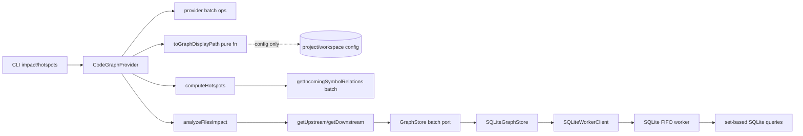

# Design: nonblocking-sqlite-graph-store

## Objectives

Keep `better-sqlite3` while moving every synchronous database operation to one persistent Node.js worker per open store. Treat the worker boundary as an RPC boundary: first-party consumers MUST prefer pure derivation, then batch `GraphStore` operations, then memoization of already-loaded data, then bounded concurrency, and may use unrestricted `Promise.all` only for intrinsically small, bounded collections. This prevents data-dependent caller fan-out from overflowing the serial worker queue (`STORE_OVERLOAD`) on the real SpecD graph (≈37,161 symbols, 1,084 files, 206 MB SQLite DB). Existing traversal results, persistence identities, CLI behavior, and the SQLite-only built-in composition from `main` remain unchanged.

## Non-goals

- Replacing `better-sqlite3`, adding a worker pool, worker-per-request execution, or restoring the removed Ladybug backend.
- Raising `maxPendingOperations` (default 256) to conceal caller fan-out, or replacing the hard limit with a silently unbounded host wait queue.
- Changing traversal direction, default depth, cycle behavior, risk thresholds, result shapes, or CLI syntax.
- Migrating a Ladybug store. Re-index remains the recovery boundary.
- Automatic worker restart or retry after an unexpected exit.
- Introducing a read-session/snapshot abstraction unless the audit in this change proves it necessary; it is recorded as a potential future optimization only.
- Making `toGraphDisplayPath` database-backed. Display-path conversion is pure and must stay pure.

## Constraints

- Domain traversal and hotspot computation depend only on `GraphStore`; worker/SQLite types stay in infrastructure.
- ESM, named exports, strict types, no `any`, and descriptive JSDoc apply (default `_global` conventions).
- Batch node operations accept arbitrary input ordering, deduplicate repeated requested identities, preserve first-requested identity order in the result, and omit identities that do not exist.
- Empty input arrays, or empty relation-type arrays for relation queries, return `[]` without RPC or SQL.
- One non-empty logical SQLite batch crosses IPC once. Physical SQL chunks remain worker-internal.
- Traversal and hotspot relation types are `CALLS`, `CONSTRUCTS`, `USES_TYPE`, `EXTENDS`, `IMPLEMENTS`, and `OVERRIDES`. Hotspot hierarchy signals use `EXTENDS`, `IMPLEMENTS`, and `OVERRIDES`.
- `maxPendingOperations` remains validated as a positive integer (`>= 1`) and defaults to 256. `STORE_OVERLOAD` remains the hard safety fuse.
- The worker boundary is an RPC boundary: serial worker-side execution means batching is preferable to request-level concurrency; high-level callers are responsible for avoiding unbounded fan-out.

## Affected areas

### Domain port — `packages/code-graph/src/domain/ports/graph-store.ts`

- Change: add three exact batch node methods (`getFilesByPaths`, `getDocumentsByPaths`, `getSpecsByIds`) beside the existing `getSymbolsByIds`, `getIncomingSymbolRelations`, and `getOutgoingSymbolRelations`.
- Impact: every `GraphStore` implementation (SQLite store, in-memory test store, memoized store) and the shared contract tests must implement them. HIGH risk — the port is consumed by traversal, indexer, freshness, coverage, search, and composition.

### Worker infrastructure — `packages/code-graph/src/infrastructure/sqlite/*`

- `sqlite-worker-protocol.ts`: add typed operation-map entries for `getFilesByPaths`, `getDocumentsByPaths`, `getSpecsByIds`.
- `sqlite-worker.ts`: dispatch the three new operations through the existing serial FIFO queue to `SQLiteGraphDatabase`.
- `sqlite-graph-database.ts`: implement set-based queries (`WHERE ... IN (...)`) with internal parameter chunking for files, documents, and specs.
- `sqlite-graph-store.ts`: add host empty-input guards and one-RPC batch methods.
- `sqlite-worker-client.ts`: unchanged transport; remains bounded at 256 with `STORE_OVERLOAD`.
- HIGH risk: protocol and database are the shared execution core; must retain FIFO lifecycle/backpressure and worker-side transactions.

### Traversal & impact domain services — `packages/code-graph/src/domain/services/`

- `get-upstream.ts`, `get-downstream.ts`: already batched per BFS frontier (preserve; do not regress).
- `analyze-file-impact.ts`, `analyze-files-impact.ts`: already share one memoized store and one `IMPACT_CONCURRENCY = 4` budget (preserve; do not regress). Audit remaining import paths (`getImporters`, `getImportees`, `findSymbols({ filePath })`) for wide-level batching candidates.
- `compute-hotspots.ts`: rewrite `collectHierarchySignals` to use batch relation retrieval (section "Hotspot hierarchy signals").
- `map-with-concurrency.ts`: keep the ordered scheduler with a clear scope (section "mapWithConcurrency scope").
- `analyze-impact.ts`, `analyze-file-impact.ts`: classify and fix remaining fan-outs per the audit table (section "Fan-out audit").

### Application services — `packages/code-graph/src/application/services/`

- `resolve-graph-selector.ts`: classify per-symbol/per-file resolution fan-outs (section "Fan-out audit"); use exact batch node APIs where they represent stable storage-neutral operations.

### Composition — `packages/code-graph/src/composition/code-graph-provider.ts`

- Add provider-level batch operations: `getFilesByPaths`, `getDocumentsByPaths`, `getSymbolsByIds`, `getSpecsByIds`.
- A provider batch method validates availability/generation once and then issues one logical batch store operation (section "Provider availability validation").
- `assertAvailable` remains for single-node public calls; composite facade operations validate once at the boundary.

### CLI presentation — `packages/cli/src/commands/graph/impact.ts`, `packages/cli/src/commands/graph/hotspots.ts`, `packages/cli/src/commands/graph/resolve-impact-file-selectors.ts`

- `toGraphDisplayPath` becomes a pure path projection; `impact.ts` formatting stops issuing `getFile`/`getDocument` RPCs per affected symbol (section "Pure display-path projection").
- `hotspots.ts` presentation stops any per-entry fan-out that is not batch or bounded.
- HIGH risk: `impact.ts` currently formats hundreds of symbols via unbounded `Promise.all(affectedSymbols.map(...))`; this is the confirmed CLI overload.

### Indexing — `packages/code-graph/src/application/use-cases/index-code-graph.ts`

- Audit line 1456 fan-out (section "Fan-out audit"); use batch reads or bounded concurrency as classified.

### Docs — `docs/adr/0025-nonblocking-worker-sqlite-graph-store.md`

- Extend with the RPC-boundary rule, serial-worker rationale, batch-over-concurrency preference, safety-fuse semantics, pure-derivation rule, exact batch APIs, and rejected worker-pool/unbounded-wait options.

### Tests — `packages/code-graph/test/**`, `packages/cli/test/**`

- GraphStore contract tests, in-memory test store, SQLite protocol/database/store tests, traversal/impact/hotspot suites, CLI impact/hotspots suites, and workload-level regression tests (section "Testing").

## New constructs

### `GraphStore` exact batch node methods — `packages/code-graph/src/domain/ports/graph-store.ts`

```ts
abstract getFilesByPaths(paths: readonly string[]): Promise<FileNode[]>
abstract getDocumentsByPaths(paths: readonly string[]): Promise<DocumentNode[]>
abstract getSpecsByIds(specIds: readonly string[]): Promise<SpecNode[]>
```

Contract (shared with the existing `getSymbolsByIds`):

- Arbitrary input ordering accepted.
- Repeated requested identities are deduplicated; results include each identity once.
- Results preserve first-requested identity order; unknown identities are omitted.
- Empty input returns `[]` without RPC or SQL.
- Each logical call crosses the worker boundary once; physical `IN`-chunked SQL stays worker-internal.
- Implementations must avoid N internal single `.get()` calls; use set-based queries.

Existing single-item APIs (`getFile`, `getDocument`, `getSymbol`, `getSpec`) and complete-collection APIs (`getAllFiles`, `getAllDocuments`, `getAllSpecs`) are retained unchanged.

### Worker protocol entries — `packages/code-graph/src/infrastructure/sqlite/sqlite-worker-protocol.ts`

```ts
getFilesByPaths: { payload: { filePaths: readonly string[] }; result: FileNode[] }
getDocumentsByPaths: { payload: { documentPaths: readonly string[] }; result: DocumentNode[] }
getSpecsByIds: { payload: { specIds: readonly string[] }; result: SpecNode[] }
```

### `SQLiteGraphDatabase` batch queries — `packages/code-graph/src/infrastructure/sqlite/sqlite-graph-database.ts`

```ts
getFilesByPaths(paths: readonly string[]): FileNode[]
getDocumentsByPaths(paths: readonly string[]): DocumentNode[]
getSpecsByIds(specIds: readonly string[]): SpecNode[]
```

Set-based queries: `files.path IN (...)`, `documents.path IN (...)`, `specs.id IN (...)`. Deduplicate input, chunk by `SQLITE_BATCH_PARAMETER_LIMIT = 900`, map rows by identity, and emit in first-requested identity order, omitting unknowns.

### `SQLiteGraphStore` batch methods — `packages/code-graph/src/infrastructure/sqlite/sqlite-graph-store.ts`

Host empty-input guards returning `[]` before IPC; otherwise exactly one `sendRequest` per logical call.

### Provider batch operations — `packages/code-graph/src/composition/code-graph-provider.ts`

```ts
getFilesByPaths(paths: readonly string[]): Promise<FileNode[]>
getDocumentsByPaths(paths: readonly string[]): Promise<DocumentNode[]>
getSymbolsByIds(symbolIds: readonly string[]): Promise<SymbolNode[]>
getSpecsByIds(specIds: readonly string[]): Promise<SpecNode[]>
```

Each runs availability/generation validation once (section "Provider availability validation") and then issues one logical batch store operation.

### Pure display-path projection — `packages/cli/src/commands/graph/resolve-impact-file-selectors.ts`

```ts
export function toGraphDisplayPath(config: CliGraphConfig, canonicalPath: string): string
```

- Pure function; no `GraphStore`/`CodeGraphProvider` access.
- For workspace resources: parse `workspace:path`, look up `workspace.codeRoot`, return `relative(projectRoot, join(codeRoot, path))` normalized with `/` separators and `./` stripped.
- For root resources (`root:path`): return `path`.
- Fallback: return the canonical path when the identity does not parse (documented edge case).
- The previous async signature and its per-symbol `provider.getFile`/`getDocument` fallback are removed. `impact.ts` formatting becomes synchronous; a per-render `Map<canonicalPath, displayPath>` avoids recomputation for repeated identities.

### `ImpactExecutionContext` — `packages/code-graph/src/domain/services/analyze-file-impact.ts`

Retained from the current design (shared memoized store + one concurrency budget). `IMPACT_CONCURRENCY = 4` stays an internal constant.

### `mapWithConcurrency` — `packages/code-graph/src/domain/services/map-with-concurrency.ts`

Retained. Contract: positive integer concurrency only; preserves input order; starts at most `concurrency` mappers; stops scheduling new work after the first rejection (already-running tasks may settle); performs no I/O. Invalid concurrency is a programmer-contract error and keeps its documented behavior (either a typed error consistent with `default:_global/error-handling-conventions` or an explicit documented `RangeError`; the design does not change its current contract unless the global error-handling spec requires it).

## Approach

### 1. RPC-boundary rule

Crossing the `GraphStore`/worker boundary is an RPC boundary. Consumers MUST resolve data-dependent collections in this priority order:

1. **Derive locally** without storage access when the data is already available (for example display-path projection from config).
2. **Use a batch `GraphStore` operation** (`getSymbolsByIds`, `getFilesByPaths`, `getDocumentsByPaths`, `getSpecsByIds`, `getIncomingSymbolRelations`, `getOutgoingSymbolRelations`).
3. **Reuse/cache already-loaded data** (the impact memoized store).
4. **Use bounded concurrency** (`mapWithConcurrency`) when batching is not practical.
5. **Use unrestricted `Promise.all`** only when the input cardinality is intrinsically small and bounded; document why.

`STORE_OVERLOAD` at 256 is a hard safety fuse, not normal flow control. The normal expectation after this change is that first-party operations remain far below 256 outstanding requests.

### 2. Pure display-path projection (CLI impact)

`impact.ts` currently formats results with unbounded `Promise.all(result.affectedSymbols.map((s) => toDisplayPath(s.filePath)))`; each call issues `provider.getFile` (plus `assertAvailable` → `getStorageGeneration`) and a `getDocument` fallback — ≈3 RPCs per symbol. A 3,909-line file producing 598 affected symbols issues ≈1,800 concurrent RPCs and overflows the queue.

The fix replaces this with the pure `toGraphDisplayPath(config, canonicalPath)` projection. The identity originates from an already-produced graph result; formatting must not perform existence checks. `impact.ts` builds one `Map<canonicalPath, displayPath>` per render and maps symbols/files synchronously, removing `Promise.all(...toDisplayPath...)` where it existed only because resolution was asynchronous. This applies to all impact presentation paths: single-file, multi-file, symbol, spec, and public-binding impact.

### 3. Hotspot hierarchy signals (batch)

`computeHotspots.collectHierarchySignals` currently runs, for every symbol, `getExtenders(id)`, `getImplementors(id)`, `getOverriders(id)` under nested unrestricted `Promise.all` — ≈111k RPCs for 37k symbols. Fix:

1. Compute the candidate symbol id list once (all candidate symbols whose scores are being computed).
2. Issue one logical batch: `store.getIncomingSymbolRelations(candidateIds, ['EXTENDS', 'IMPLEMENTS', 'OVERRIDES'])`.
3. Fold the returned relations in memory by `relation.target + relation.type` into per-symbol extender/implementor/overrider counts.
4. The SQLite implementation chunks the large `IN` set internally by its parameter budget (design preserved).

Conceptual change: ≈111,000 host↔worker RPCs → one logical batch RPC → internally chunked SQLite queries inside the worker. `mapWithConcurrency` is NOT the primary fix for this path.

### 4. Worker batch reads

`SQLiteGraphStore` performs the empty-input checks and otherwise sends exactly one typed RPC per logical batch. `SQLiteGraphDatabase` deduplicates values and executes bound-placeholder queries:

- symbols: `symbols.id IN (...)`;
- files: `files.path IN (...)`;
- documents: `documents.path IN (...)`;
- specs: `specs.id IN (...)`;
- incoming relations: `relations.target IN (...) AND relations.type IN (...)`;
- outgoing relations: `relations.source IN (...) AND relations.type IN (...)`.

Use `SQLITE_BATCH_PARAMETER_LIMIT = 900`. Symbol ids are chunked by 900. Relation ids are chunked by `900 - uniqueRelationTypes.length`; the six supported traversal types can never exhaust the budget; any unsupported type is rejected as invalid input. Chunks execute sequentially inside the single worker operation. Converted rows are mapped by identity and emitted in first requested-identity order. Converted relations are deduplicated by source/type/target and globally sorted by source, type, then target.

This does not change schema version 9 because no persisted field changes.

### 5. Bounded batched traversal (preserved)

At each upstream BFS level, deduplicate `currentIds`, invoke `getIncomingSymbolRelations(currentIds, TRAVERSAL_RELATION_TYPES)`, group by target, derive unvisited sources in frontier order, and invoke `getSymbolsByIds(nextIds)`. Downstream mirrors this with outgoing relations grouped by source and derives targets. Max-depth lookahead uses the same relation batch. Visited sets, first/shallowest depth, import expansion, truncation, and final deterministic sorting remain unchanged.

`analyzeFilesImpact` creates one `createMemoizedReadStore(store)` and one concurrency budget of 4 for the entire call. It deduplicates file work while preserving first-input order. `analyzeFileImpactDetails` uses that context and schedules per-symbol impact plus unbatched import reads through the same limiter. Nested scheduling MUST NOT hold an outer permit while waiting to acquire an inner permit; use one re-entrant scheduler or flatten `(file, symbol)` jobs. The number of active store operations therefore never becomes `files × symbols × frontier width`.

The memoized store implements the new batch methods (including `getFilesByPaths`, `getDocumentsByPaths`, `getSpecsByIds`) and populates per-id caches from batch results. Repeated ids across files share resolved/in-flight reads. Cache scope is one top-level impact call; it never survives store close, recreate, or another command.

### 6. Provider availability validation as an RPC multiplier

`CodeGraphProvider` public methods call `assertAvailable()`, which calls `store.getStorageGeneration()` (`readStorageGenerationSnapshot` RPC). Composing large numbers of public provider calls therefore approximately doubles the RPC count. Stale-generation protection is NOT removed.

Rule: composite Code Graph operations validate provider availability once at the public facade boundary and then execute internal work against `GraphStore`/application services. Internal loops must not repeatedly compose high-cardinality public provider calls. The new provider batch operations validate once and issue one logical batch store operation. Review current callers for violations during implementation; record a read-session/snapshot abstraction as a potential future optimization if the audit proves it necessary.

### 7. Fan-out audit

Audit the repository for `Promise.all(items.map((x) => store.someMethod(x)))` and `Promise.all(items.map((x) => provider.someMethod(x)))` and nested variants. Classify each occurrence as one of:

- **A. Pure derivation possible** — remove the storage operation.
- **B. Existing batch API available** — use the batch API.
- **C. Missing but generally useful batch API** — add it to `GraphStore` if it is a stable backend-neutral operation (this change adds the exact node batches; do not add speculative APIs).
- **D. True independent operations with no useful batch representation** — use `mapWithConcurrency`.
- **E. Intrinsically small bounded collection** — unrestricted `Promise.all` may remain, documented as bounded.

Known areas to inspect during implementation: `resolve-graph-selector.ts` (resolution loops), `analyze-impact.ts`, `analyze-file-impact.ts`, `analyze-files-impact.ts`, `get-upstream.ts`, `get-downstream.ts`, `compute-hotspots.ts`, `index-code-graph.ts`, CLI `impact.ts`, CLI `hotspots.ts`, and any other use case mapping data-dependent collections to provider/store operations. Pay particular attention to nested fan-out where a bounded top-level operation invokes an unbounded internal collection.

Preliminary classification for the confirmed callers:

| Location                                          | Classification      | Resolution                                          |
| ------------------------------------------------- | ------------------- | --------------------------------------------------- |
| CLI `impact.ts` display paths                     | A (pure derivation) | `toGraphDisplayPath` pure projection                |
| CLI `impact.ts` affected-symbol/entity formatting | B                   | batch via provider node batches; bounded render map |
| CLI `hotspots.ts` entry formatting                | B/D                 | batch node/relation reads or bounded concurrency    |
| `compute-hotspots.ts` hierarchy signals           | B                   | `getIncomingSymbolRelations` batch                  |
| `get-upstream`/`get-downstream` frontiers         | B                   | already batched (preserved)                         |
| `analyze-file-impact`/`analyze-files-impact`      | D                   | already bounded (preserved)                         |
| `resolve-graph-selector.ts` loops                 | C/D                 | exact batch node reads or `mapWithConcurrency`      |
| `index-code-graph.ts` fan-outs                    | C/D                 | batch reads or bounded concurrency                  |

Do not optimize by intuition alone: for every data-dependent fan-out, state the final classification and why.

### 8. Preserve impact-domain improvements

The domain improvements already made are correct and MUST NOT regress: `IMPACT_CONCURRENCY = 4`, shared memoized store for multi-file analysis, bounded multi-file analysis, `getSymbolsByIds`, `getIncomingSymbolRelations`, `getOutgoingSymbolRelations`, and batch traversal in `getUpstream`/`getDownstream`. The known impact overload occurs in CLI presentation after domain analysis. Still review the remaining import traversal paths (`getImporters(file)`, `getImportees(file)`, `findSymbols({ filePath })`) for wide graph levels; if batching those produces a generally useful abstraction, propose it in design rather than blindly adding concurrency.

### 9. Keep `StoreOverloadError` as defense in depth

Do not turn the pending-operation limit into an unlimited waiting queue. The design has exposed genuine pathological callers (hotspots ≈111k operations); silent waiting would hide those defects. Retain `maxPendingOperations = 256` default and `STORE_OVERLOAD` when exceeded. Tests use deliberately lower configured limits (16/32) to prove first-party operations respect backpressure.

### 10. Composition and exports

`createCodeGraphProvider` remains synchronous. Without an explicit external backend it selects the sole built-in `sqlite` factory. External factories remain selectable; duplicate ids and unknown ids retain their current typed failures. `createSqliteGraphStoreFactory` passes `SqliteRuntimeDescriptor` and `maxPendingOperations`; the worker dynamically imports `modulePath` during `open()`.

The public entry exports storage-neutral factory/options types, runtime descriptor/options, documented errors, model and resolver-result types, and host use-case factories. The internal entry exposes `SQLiteGraphStore`, `AdapterRegistry`, and language adapters. Worker protocol/database/client types remain private. `LadybugGraphStore` is absent from both entries.

### 11. Security, observability, and operations

SQL values use placeholders; no query value is interpolated. IPC contains structured-clone-safe data only, and source content or full SQL payloads are not logged. Existing logging records worker startup, shutdown, crash, forced termination, and index progress; individual batches do not produce noisy logs. No authorization, feature flag, or new metric is introduced. Operators distinguish `STORE_OVERLOAD`, `STORE_WORKER_ERROR`, `STORE_NOT_OPEN`, invalid configuration, bulk-session state, and schema incompatibility by typed code.

### 12. Compliance reconciliation (carried forward)

The prior compliance reconciliation remains binding: typed errors for expected failure modes (`BulkSessionStateError` `BULK_SESSION_STATE`, `InvalidGraphStoreConfigurationError` `INVALID_GRAPH_STORE_CONFIGURATION`, `GraphSchemaIncompatibleError` `GRAPH_SCHEMA_INCOMPATIBLE`) with round-trip serialization; complete empty JSDoc; ADR-0025 present and linked from all affected specs; `SQLiteGraphStoreOptions` naming canonicalized in specs without an unnecessary alias; relation enumeration covering all graph-store relation families including `CONSTRUCTS` and `USES_TYPE`; public export wording reflecting the actually required public surface; typed test doubles replacing `as unknown as Port` partial mocks; and runtime descriptor/factory/barrel test coverage retained. Do not reintroduce already-fixed issues while rebasing the design.

## Key decisions

- **One persistent worker instead of a pool**: SQLite writes/schema lifecycle need serialization, while one worker removes host blocking. Main-thread SQLite, worker-per-call startup, pool coordination, and an async-driver migration are rejected.
- **Treat the worker boundary as an RPC boundary**: serial worker-side execution makes batching strictly preferable to request-level concurrency. A pure-derivation-first rule eliminates entire RPC classes (display paths). Alternatives rejected: raising queue capacity, throttling per-symbol calls, silent unbounded waiting.
- **Batch at the `GraphStore` boundary**: set-based reads remove both RPC and SQL fan-out. Exact node batches (`getFilesByPaths`, `getDocumentsByPaths`, `getSpecsByIds`) mirror the existing `getSymbolsByIds` contract.
- **Hotspots use batch relation retrieval, not concurrency**: `mapWithConcurrency` would still issue 111k RPCs (just slower); one batch relation call is the correct shape. Rejected: bounded-concurrency-only fix.
- **Bound concurrency as a second layer**: file/import work still contains non-batch reads. A single shared budget prevents nested pools from multiplying. The conservative fixed value 4 may underuse a future parallel backend but is safe for the serial SQLite worker.
- **Chunk SQL inside one worker request**: this protects SQLite parameter limits without recreating host queue fan-out. Merging chunks costs bounded maps but guarantees deterministic results.
- **Provider availability validated once per composite operation**: keeps stale-generation protection without doubling RPCs in high-cardinality loops. A read-session abstraction is deferred unless the audit proves it necessary.
- **`STORE_OVERLOAD` remains a hard fuse at 256**: lowering or removing it hides pathological callers. Tests prove first-party operations stay far below it with low configured limits.
- **Manual crash recovery**: automatic restart could replay non-idempotent work. `close()` then `open()` is explicit and testable.
- **No schema bump**: batching adds query paths, not stored data. Schema 9 remains authoritative.

## Trade-offs

- [Synchronous pure display-path projection assumes canonical identity shapes (`workspace:path`, `root:path`)] → Verified against the indexer's canonicalization (`index-code-graph.ts`) and covered by CLI regression tests; unmatched identities fall back to the canonical path.
- [Batch node methods increase GraphStore surface] → Additive, backend-neutral, mirrored by every test store; single-item APIs remain for low-cardinality callers.
- [Validating availability once per composite operation slightly widens the stale-generation window] → Stale generation is still detected at the facade boundary; the window is a single composite call, not a loop.
- [Conservative `IMPACT_CONCURRENCY = 4` may underuse future parallel backends] → Safe for the serial worker; documented as tunable when a parallel backend exists.
- [Pure display projection removes the implicit existence check] → Graph identities originate from already-produced results; formatting must not perform existence checks.

## Spec impact

- `code-graph:graph-store`: direct dependents include SQLite, composition, traversal, indexer, freshness, document/search flows, and test stores. The additive batch node methods require implementations but do not alter existing contracts.
- `code-graph:traversal`: provider, CLI impact, change detection, and hotspots consume its stable results. Scheduling and hotspot signal retrieval change internally; result semantics are unchanged.
- `code-graph:sqlite-graph-store`: config, symbol model, workspace integration, search, indexing, and coverage retain canonical identities and schema. The worker changes execution placement only; batch node operations are worker-backed.
- `code-graph:composition`: indexer, traversal, health, coverage, resolver, and global architecture remain satisfied. Reconciliation adopts `main`'s SQLite-only built-in registry; provider batch operations and single availability validation are additive.
- `cli:graph-impact` / `cli:graph-hotspots`: newly in scope; require pure display-path projection (zero graph reads), bounded presentation fan-out, and completion on wide graphs without `STORE_OVERLOAD`. No CLI syntax or output shape changes.

## Dependency map



```
┌────────────────┐    ┌──────────────────┐    ┌────────────────────┐
│ CLI impact/    │───▶│ display projection│    │ pure config fn     │
│ hotspots       │    │ + batch provider  │    │ (zero RPCs)        │
└────────────────┘    └─────────┬────────┘    └────────────────────┘
                                │
                                ▼
                       ┌──────────────────┐    ┌────────────────────┐
                       │ provider batches │───▶│ hotspot signals    │
                       │ + assertAvailable│    │ batch relations    │
                       └─────────┬────────┘    └────────────────────┘
                                 │
                                 ▼
                       ┌──────────────────┐    ┌────────────────────┐
                       │ analyzeFilesImpact│───▶│ traversal batches  │
                       │ shared budget: 4  │    └─────────┬──────────┘
                       └──────────────────┘              │
                                                         ▼
                       ┌──────────────────┐    ┌────────────────────┐
                       │ SQLite database  │◀───│ FIFO worker        │
                       │ set-based SQL    │    │ one logical RPC    │
                       └──────────────────┘    └────────────────────┘
```

## Migration / Rollback

No data migration is required. Schema version 9 remains current. Incompatible persisted state is never silently replaced by a read; a full graph index rotates generation and recreates it. Rollback requires closing the provider before deploying previous code and re-indexing if that version rejects schema 9. A live worker must never be abandoned across deployment/process shutdown.

## Testing

### Automated tests

0. **Batch and traversal contract tests**:
   - GraphStore contract/test store: duplicate and unknown ids, requested order for symbols, files, documents, and specs; relation direction/type filtering; all six types; source/type/target ordering; empty no-op; bounded logical call count.
   - `get-upstream.spec.ts` / `get-downstream.spec.ts`: one relation and one symbol batch per wide frontier, lookahead batching, cycles/imports/hierarchy/static types, depth, truncation, and unchanged ordering.
   - File/multi-file impact tests: maximum active work is 4, one shared memoized view, overlapping reads deduplicate, and affected sets/counts/risk/coverage remain unchanged.
   - SQLite database/store/protocol tests: exactly one RPC per non-empty logical batch, no RPC for empty input, >900 parameters chunk inside the worker, deterministic merge, and typed payload/result round trip for the three new node batch operations.
   - Batch node method tests: contract-test ordering, deduplication, missing identities, SQLite parameter chunking, and one logical worker operation (spy at host/worker and database boundaries).

1. **Hotspot regression**:
   - `compute-hotspots.spec.ts`: hierarchy signals issue one `getIncomingSymbolRelations` call per candidate set with `EXTENDS`, `IMPLEMENTS`, `OVERRIDES`; counts match per-symbol semantics; call-count instrumented.
   - Wide-graph hotspot workload: a graph with enough symbols/hierarchy relations to make the old implementation exceed a low pending limit runs `computeHotspots` with `maxPendingOperations: 16` or `32` and completes without `STORE_OVERLOAD`.

2. **CLI display-path regression**:
   - `toGraphDisplayPath` pure-function tests: workspace (`core:src/index.ts` → `packages/core/src/index.ts`), root (`root:package.json` → `package.json`), `./`-stripping, backslash normalization, unparseable fallback.
   - Impact formatting tests (single-file, multi-file, symbol, spec, public-binding): a realistic single-large-file scenario with hundreds of affected symbols completes, and the formatting path performs zero `getFile`/`getDocument` `GraphStore`/provider calls for display-path conversion (assert via instrumented provider/store double).
   - `graph impact --file <large-file>` and multi-file impact run end-to-end with low `maxPendingOperations` without `STORE_OVERLOAD`.

3. **Coverage Contract Tests**: Verify `findIndexCoverage(filePaths)` vs `getAllIndexCoverage()` return exact matching records.

4. **Concurrency & Lifecycle Tests** (retained from current design): concurrent `open()`/`close()` sharing, drain semantics, `close` during in-flight `open`, drain-timeout forced termination, `faulted` recovery, `closePromise` clearing, worker ignoring `close` RPC, bulk-session state machine, no session resurrection, reference-facts chunk merge, `maxPendingOperations: 1` session, chunked `bulkLoad()`, responsiveness heartbeat with 10k staged entities.

5. **Backpressure & fuse tests**:
   - `StoreOverloadError` at the configured limit (default 256) retained.
   - First-party operations (impact, hotspots) complete with deliberately low configured limits (`maxPendingOperations: 16` / `32`) — proves first-party operations respect backpressure.

6. **Provider availability tests**: provider batch operations validate availability once (spy on `readStorageGenerationSnapshot` count); composite operations do not multiply generation checks per inner loop.

7. **Barrel/export/ADR tests** (carried forward): public/internal export smoke tests, typed test doubles without `as unknown as Port`, protocol round-trip of the three typed error codes, ADR-0025 present and linked from all affected specs.

### Manual / E2E verification

- Build code-graph and CLI, then run `node packages/cli/dist/index.js graph index --format toon`; expect `result: ok`.
- Against the real ~37k-symbol graph: `node packages/cli/dist/index.js graph hotspots --min-risk HIGH --format toon` completes without `STORE_OVERLOAD`.
- `node packages/cli/dist/index.js graph impact --file "code-graph:src/infrastructure/sqlite/sqlite-graph-database.ts" --direction dependents --format toon` completes without `STORE_OVERLOAD`; a multi-file impact command completes identically.
- Run the original six-file `graph impact --format toon` command twice; both runs must exit 0 without `STORE_OVERLOAD` and return identical ordered files, symbols, covering specs, depths, counts, and risk.
- During a deliberately long worker operation, observe a 10 ms host heartbeat; ticks must continue.
- Confirm lifecycle/fault tests leave no orphan worker.

All code-graph tests, TypeScript build, lint, and formatting checks must pass. Every verification scenario in all six deltas maps to the test groups above.

## Acceptance criteria

The change must not return to verification until:

- `graph hotspots --min-risk HIGH` works against the real ~37k-symbol SpecD graph without `STORE_OVERLOAD`.
- `graph impact --file <large-file>` works without `STORE_OVERLOAD`.
- Multi-file impact works without `STORE_OVERLOAD`.
- CLI impact display-path conversion performs zero graph DB reads.
- Hotspot hierarchy signals use batch relation retrieval.
- `getFilesByPaths`, `getDocumentsByPaths`, `getSpecsByIds`, and `getSymbolsByIds` have symmetric, tested contracts.
- Remaining high-cardinality `GraphStore`/provider fan-outs are classified (A–E) and fixed appropriately.
- First-party operations work with deliberately low `maxPendingOperations` in regression tests.
- `maxPendingOperations = 256` remains the normal default safety fuse.
- Full typecheck, lint, full Vitest suite, and build/dist worker tests pass without masked failures.
- Change specs and verify artifacts validate; a fresh compliance report has no change-attributable failures.

## Open questions

None. The audit may surface a generally useful batch abstraction for import traversal (`getImporters`/`getImportees`/`findSymbols` by file); if found, it is proposed in design rather than added speculatively. The read-session/snapshot abstraction remains a recorded potential future optimization unless the audit proves it necessary.

## 21. Pre-compliance cleanup pass (post-audit)

Decisions for the final cleanup requested before archiving:

### Task 1 — CLI ambiguous-symbol enrichment

The ambiguity branch in `impact.ts` currently enriches candidates with one
`provider.getSymbol(candidate.symbolId)` under `Promise.all`. It will issue one
`provider.getSymbolsByIds(...)` batch instead, mapping results back by id to
preserve candidate order and missing-symbol filtering. The resolved-single path
collapses its one-element `Promise.all(getSymbol)` into a single direct
`getSymbol` call (single lookup; batching adds nothing).

### Task 2 — Generic selector errors → typed error decision

`resolveFileSelector('')` / `resolveSymbolSelector('')` throw generic
`Error('empty file selector' | 'empty symbol selector')`. These ARE reachable
from host input through the public provider facade (the CLI happens to guard
empty input earlier, but MCP/sdk hosts are not required to). Under
default:\_global/error-handling-conventions expected validation failures must be
typed with machine-readable codes. Repository pattern research: every domain
error extends `SpecdCodeGraphError` and exposes `get code()` (e.g.
`InvalidRelationTypeError` → `INVALID_RELATION_TYPE`). Decision: introduce the
smallest fitting class `InvalidGraphSelectorError extends SpecdCodeGraphError`
with code `INVALID_GRAPH_SELECTOR`, message-preserving, exported from the
package barrels; replace both generic throws. No new error hierarchy.

### Task 3 — Residual fan-out classification (expected)

- `impact.ts` ambiguity enrichment → FIXED by 21.1 (batch).
- `get-upstream/get-downstream` includeFiles loop (`getImporters` per frontier
  file) → RETAINED: spec letter permits per-file reads (prohibition is per
  symbol/relation-type); cardinality is bounded by frontier width, not total
  graph size, and impact paths run with includeFiles:false.
- Fixed-cardinality probes in lifecycle/backpressure tests (2–3 parallel ops)
  → RETAINED: intentional fixed bounds exercising backpressure semantics.
- `analyze-files-impact` shared memoized view + concurrency budget 4 → already
  compliant.
- CLI hotspots/impact/search presentation → zero graph reads after section 19;
  no change.

### Task 4 — Batch API symmetry confirmation (verification-only)

Contract walk recorded at implementation time: identical dedup /
unknown-omission / first-requested-order / empty-input-`[]`-without-backend-work
semantics implemented on port abstract methods, in-memory store, SQLite store
(one RPC per logical batch), worker protocol + dispatcher, database set-based
queries, provider facade (availability once), memoized read store; contract
tests cover both backends via graph-store.contract.ts.

### Task 5 — SQLite parameter-limit analysis

`getSymbolRelationsBatch` computes `idChunkSize =
SQLITE_BATCH_PARAMETER_LIMIT - uniqueTypes.length` and guards with `RangeError`
when types exhaust the budget, so `IN(ids) AND IN(types)` never exceeds 900
bound parameters. Exact node batches bind only ids and chunk at 900. Gap:
no regression test exercises the multi-group accounting explicitly; 21.5 adds
one (six relation types × >894 ids).

### Task 6 — Regression scope

Full code-graph + cli suites, low-limit integration tests (16/32), typecheck,
lint, dist CLI manual regression (index, hotspots HIGH, six-file impact ×2,
large-file impact).

### Task 3/4/5 execution record (audit results)

Fan-out classification of remaining async loops in changed code:

- resolve-graph-selector.ts:77 (findFiles+findDocuments), :202 (getFile+getDocument)
  → RETAINED: fixed-cardinality pairs, independent of graph size.
- analyze-file-impact.ts:246 (covering-spec two-batch) → RETAINED: fixed pair of
  logical batches per analysis.
- analyze-file-impact.ts:389/431/445/457 → RETAINED: Promise.all over
  already-resolved in-memory cache promises (CPU-only, no store calls).
- compute-hotspots.ts:127 (3 fixed batch probes) → RETAINED: fixed cardinality.
- get-upstream/get-downstream includeFiles per-file importers loop → RETAINED:
  spec-permitted per-file reads, bounded by frontier width; impact paths use
  includeFiles:false.
- mapWithConcurrency sites (resolver 16, artifacts 16, impact budget 4) → RETAINED:
  deliberate bounded concurrency where no batch representation exists.

Batch symmetry walk (Task 4): confirmed identical semantics on all eight layers;
contract tests cover both backends; one logical batch = one worker RPC asserted
by sqlite-graph-store.spec.ts one-RPC tests for all four operations.

Parameter-limit regression (Task 5): new test "accounts for all bind parameters
when chunking ids together with relation types" (6 types × 905 ids) passes,
proving idChunkSize = 900 − |types| accounting on both directions.
