# Design: nonblocking-sqlite-graph-store

## Objectives

Keep `better-sqlite3` while moving every synchronous database operation to one persistent Node.js worker per open store. Wide graph traversal SHALL use set-based batch reads and one shared, fixed concurrency budget so normal impact analysis cannot overflow the worker queue merely because the input or BFS frontier is wide. Existing traversal results, persistence identities, CLI behavior, and the SQLite-only built-in composition from `main` remain unchanged.

## Non-goals

- Replacing `better-sqlite3`, adding a worker pool, or restoring the removed Ladybug backend.
- Raising `maxPendingOperations` to conceal caller fan-out.
- Changing traversal direction, default depth, cycle behavior, risk thresholds, result shapes, or CLI syntax.
- Migrating a Ladybug store. Re-index remains the recovery boundary.
- Automatic worker restart or retry after an unexpected exit.

## Constraints

- Domain traversal depends only on `GraphStore`; worker/SQLite types stay in infrastructure.
- ESM, named exports, strict types, no `any`, and descriptive JSDoc apply.
- Batch ids are deduplicated; unknown ids are omitted. Symbols follow first requested-id order. Relations sort by source, type, then target.
- Empty ids, or empty relation types for relation queries, return `[]` without RPC or SQL.
- Traversal relation types are `CALLS`, `CONSTRUCTS`, `USES_TYPE`, `EXTENDS`, `IMPLEMENTS`, and `OVERRIDES`.
- One non-empty logical SQLite batch crosses IPC once. Physical SQL chunks remain worker-internal.

## Affected areas

- `domain/ports/graph-store.ts` (`GraphStore`, HIGH risk): add three batch methods; SQLite and every test store must implement them.
- `domain/services/get-upstream.ts` and `get-downstream.ts` (HIGH risk): replace nested per-symbol/per-type requests with frontier relation and symbol batches.
- `domain/services/analyze-file-impact.ts` (`createMemoizedReadStore`/file analysis) and `analyze-files-impact.ts` (HIGH risk): share one memoized store and one concurrency budget across multi-file work; preserve result semantics.
- `domain/services/map-with-concurrency.ts`: new pure ordered scheduler utility.
- `infrastructure/sqlite/sqlite-worker-protocol.ts`, `sqlite-worker.ts`, `sqlite-worker-client.ts`, `sqlite-graph-store.ts`, and `sqlite-graph-database.ts` (HIGH risk): type, transport, dispatch, and execute batch reads; retain FIFO lifecycle/backpressure and worker-side transactions.
- `infrastructure/sqlite/sqlite-runtime-descriptor.ts`, composition factory/provider code, `public.ts`, and `index.ts`: retain serializable runtime configuration, curated exports, and SQLite-only composition. `LadybugGraphStore` is exported by neither entrypoint.
- `domain/errors/*`: preserve typed lifecycle, configuration, bulk-session, schema, overload, and worker errors across IPC.
- `test/helpers/in-memory-graph-store.ts`, traversal/impact tests, SQLite protocol/lifecycle/database/store tests, composition tests, and barrel tests: implement and verify the complete contract.
- `docs/adr/0025-nonblocking-worker-sqlite-graph-store.md`: document worker, FIFO, backpressure, batching, lifecycle, and rejected alternatives. No CLI guide changes are needed because commands/options do not change.

## New constructs

`GraphStore` gains:

```ts
abstract getSymbolsByIds(symbolIds: readonly string[]): Promise<SymbolNode[]>
abstract getIncomingSymbolRelations(
  symbolIds: readonly string[],
  relationTypes: readonly RelationType[],
): Promise<Relation[]>
abstract getOutgoingSymbolRelations(
  symbolIds: readonly string[],
  relationTypes: readonly RelationType[],
): Promise<Relation[]>
```

`domain/services/map-with-concurrency.ts` exports:

```ts
export async function mapWithConcurrency<T, R>(
  values: readonly T[],
  concurrency: number,
  mapper: (value: T, index: number) => Promise<R>,
): Promise<R[]>
```

It accepts only positive integer concurrency, preserves result order, starts at most the requested number of mappers, and stops scheduling new work after a rejection. It performs no I/O.

`analyze-file-impact.ts` defines the internal shared context:

```ts
export interface ImpactExecutionContext {
  readonly store: GraphStore
  readonly concurrency: number
}
```

`analyzeFileImpactDetails` accepts an optional final `context`; public signatures and result types do not otherwise change. `IMPACT_CONCURRENCY = 4` is an internal constant.

## Overview

`SQLiteGraphStore` encapsulates `better-sqlite3` database operations, statement caches, schema initialization, and transactional batch commits off the host Node.js event loop by executing them inside a dedicated, persistent worker thread (`node:worker_threads`).

This design establishes:

1. **Explicit Lifecycle State Machine**: `WorkerState = 'closed' | 'opening' | 'open' | 'closing' | 'faulted'` with concurrent promise sharing (`openPromise`, `closePromise`).
2. **Graceful Shutdown & Drain**: `close()` stops accepting new requests, drains in-flight operations with fallback timeout, sends explicit `close` to the database, and terminates the worker cleanly.
3. **Worker FIFO Serial Execution**: Explicit single-consumer serial queue inside `sqlite-worker.ts` preventing any race condition across async operations (`open`, `recreate`) and subsequent queries.
4. **Strongly-Typed RPC Contract**: An exhaustive `SQLiteWorkerOperationMap` ensuring compile-time type safety for operation names, payloads, and returned results (including dedicated `getAllIndexCoverage`).
5. **Strict Bounded Outstanding Requests**: Validated positive integer limit (`maxPendingOperations >= 1`) throwing `StoreOverloadError` on overflow.
6. **Fault Isolation & Manual Recovery**: Worker crashes transition the store to `faulted` (throwing `StoreWorkerError`), allowing manual recovery via `close()` followed by `open()` without silent auto-restart.

---

## Architectural breakdown

```
┌─────────────────────────────────────────────────────────────┐
│ Host Thread (CLI / SDK / Future HTTP API / MCP)             │
│   SQLiteGraphStore (implements GraphStore)                  │
│     └── SQLiteWorkerClient                                  │
│           ├── State Machine (closed|opening|open|closing|   │
│           │                  faulted)                       │
│           ├── Concurrent openPromise / closePromise sharing │
│           ├── Bounded Outstanding Requests Map (< 256)      │
│           └── Graceful shutdown drain with safety timeout   │
└──────────────────────────────┬──────────────────────────────┘
                               │ Worker MessagePort IPC
                               ▼
┌─────────────────────────────────────────────────────────────┐
│ Dedicated Worker Thread (sqlite-worker.ts)                  │
│   Single-Consumer Serial Execution Queue (FIFO Promise Chain)│
│     └── SQLiteGraphDatabase                                 │
│           ├── better-sqlite3 engine (synchronous)           │
│           ├── LRU / Map Prepared Statement Cache            │
│           ├── Atomic Bulk Index Transactions                │
│           ├── FTS5 Search Ranking Index                     │
│           └── Dedicated getAllIndexCoverage() query         │
└─────────────────────────────────────────────────────────────┘
```

---

## Technical Details

### 1. State Machine and Concurrent Deduplication

`SQLiteWorkerClient` maintains an explicit state variable:

```ts
type WorkerState = 'closed' | 'opening' | 'open' | 'closing' | 'faulted'

export class SQLiteWorkerClient {
  private state: WorkerState = 'closed'
  private openPromise?: Promise<void>
  private closePromise?: Promise<void>
  private readonly pendingRequests = new Map<number, PendingRequest>()

  get isOpen(): boolean {
    return this.state === 'open'
  }
}
```

- **Concurrent `open()`**:
  - If `state === 'open'`, resolves immediately.
  - If `state === 'opening'`, returns the existing `this.openPromise`.
  - If `state === 'closing'` or `state === 'faulted'`, throws an error requiring clean shutdown before reopening.
  - Otherwise, initializes `this.openPromise`, validates `maxPendingOperations`, spawns the worker, awaits `open` RPC ACK, transitions to `open`, and clears `openPromise`.

- **Concurrent `close()`**:
  - If `state === 'closed'`, resolves immediately.
  - If `state === 'closing'`, returns the existing `this.closePromise`.
  - Otherwise, initializes `this.closePromise`, transitions to `closing`, drains in-flight requests, sends `close` RPC, terminates worker, transitions to `closed`, and clears `closePromise`.

### 2. Shutdown & Drain Semantics

`drainPendingRequests(timeoutMs): Promise<boolean>` returns `true` if all in-flight requests settled
within the timeout, or `false` if the timeout expired before they did.

During `close()`:

1. `closePromise` is set at the very start of the outer IIFE. A single `try/finally` wrapping the
   **entire** body (including `await openPromise`) guarantees `closePromise` is always cleared —
   even when `open()` fails concurrently. Without this, a subsequent `close()` would find the stale
   resolved promise and silently skip recovery.
2. `deadline = Date.now() + drainTimeoutMs` is computed once at the entry of `close()`. This shared
   deadline bounds the graceful-shutdown phases — `await openPromise`, the drain phase, and the
   `close` RPC ACK — using a unref'd `withDeadline` helper. It is NOT a hard upper bound on the
   total `close()` wall-clock time: once the deadline expires, forced `worker.terminate()` is
   initiated and `close()` awaits the termination to conclude (a worker executing native code offers
   no mathematical guarantee of terminating within a fixed bound).
3. If `state === 'opening'`, `close()` sets `state = 'closing'` and awaits `openPromise` with `withDeadline`.
   `open()` sees `state !== 'opening'` and skips the `→ 'open'` transition. If `openPromise` rejects or times out,
   `close()` returns early from the inner catch — the outer `finally` still clears `closePromise` and terminates the worker.
   `handleWorkerExit` in `'closing'` state also rejects any stale pending requests (such as an unacknowledged `open` RPC).
4. `state` is set to `closing`. Any new incoming `sendRequest()` call immediately rejects with `StoreNotOpenError`.
5. `drainPendingRequests(Math.max(0, deadline - now))` waits for pending requests to settle. When the
   remaining time is `0`, `drainPendingRequests(0)` resolves `false` immediately without scheduling an interval tick.
6. **If `drained === true`** (all requests settled before deadline):
   - `withDeadline(sendRequestInternal('close'), deadline)` races the clean DB close RPC against the shared deadline.
7. **If `drained === false`** OR the `close` RPC times out:
   - Any remaining pending requests are rejected **before** `worker.terminate()` is called, so
     the drain-timeout `StoreWorkerError` is the rejection callers observe (not the exit-event error).
   - `worker.terminate()` is called unconditionally to force-kill the thread; `close()` awaits it.
8. `state` transitions to `closed` and `closePromise` is cleared in the `finally` block.

### 3. Worker-Side Serial FIFO Execution Queue

To guarantee strict serial FIFO execution even across asynchronous worker operations (`open`, `recreate`), `sqlite-worker.ts` utilizes an explicit execution queue:

```ts
let dispatchQueue: Promise<void> = Promise.resolve()

parentPort.on('message', (message: SQLiteWorkerRequest) => {
  dispatchQueue = dispatchQueue
    .then(() => handleMessage(database, message, (resp) => parentPort?.postMessage(resp)))
    .catch((error) => {
      // Unhandled error reported to host; queue remains unbroken
      parentPort?.postMessage({
        id: message.id,
        type: 'error',
        error: serializeError(error),
      })
    })
})
```

This ensures that queries dispatched after `recreate()` wait until `recreate()` finishes database teardown, schema creation, and initialization before executing.

### 4. Strongly-Typed RPC Protocol Map

The RPC protocol defines the complete contract mapping operation names to their payload and return types:

```ts
export interface SQLiteWorkerOperationMap {
  open: { payload: OpenWorkerPayload; result: void }
  close: { payload: Record<string, never>; result: void }
  recreate: { payload: Record<string, never>; result: void }
  clear: { payload: Record<string, never>; result: void }
  getFile: { payload: { filePath: string }; result: FileNode | undefined }
  findFilesByConfigRelativePath: { payload: { configRelativePath: string }; result: FileNode[] }
  getDocument: { payload: { documentId: string }; result: DocumentNode | undefined }
  findDocumentsByConfigRelativePath: {
    payload: { configRelativePath: string }
    result: DocumentNode[]
  }
  getSymbol: { payload: { symbolId: string }; result: SymbolNode | undefined }
  getSymbolsByIds: { payload: { symbolIds: readonly string[] }; result: SymbolNode[] }
  getIncomingSymbolRelations: {
    payload: { symbolIds: readonly string[]; relationTypes: readonly RelationType[] }
    result: Relation[]
  }
  getOutgoingSymbolRelations: {
    payload: { symbolIds: readonly string[]; relationTypes: readonly RelationType[] }
    result: Relation[]
  }
  findSymbols: { payload: { query: SymbolQuery }; result: SymbolNode[] }
  getSpec: { payload: { specId: string }; result: SpecNode | undefined }
  getSpecDependencies: { payload: { specId: string }; result: Relation[] }
  getSpecDependents: { payload: { specId: string }; result: Relation[] }
  getCoveredFiles: { payload: { specId: string }; result: Relation[] }
  getCoveringSpecsForFile: { payload: { filePath: string }; result: Relation[] }
  getCoveringSpecsForFiles: { payload: { filePaths: readonly string[] }; result: Relation[] }
  getCoveredSymbols: { payload: { specId: string }; result: Relation[] }
  getCoveringSpecsForSymbol: { payload: { symbolId: string }; result: Relation[] }
  getCoveringSpecsForSymbols: { payload: { symbolIds: readonly string[] }; result: Relation[] }
  getCallers: { payload: { symbolId: string }; result: Relation[] }
  getCallees: { payload: { symbolId: string }; result: Relation[] }
  getImporters: { payload: { filePath: string }; result: Relation[] }
  getImportees: { payload: { filePath: string }; result: Relation[] }
  findDirectlyAffectedFiles: { payload: { filePaths: readonly string[] }; result: string[] }
  getExtenders: { payload: { symbolId: string }; result: Relation[] }
  getExtendedTargets: { payload: { symbolId: string }; result: Relation[] }
  getImplementors: { payload: { symbolId: string }; result: Relation[] }
  getImplementedTargets: { payload: { symbolId: string }; result: Relation[] }
  getOverriders: { payload: { symbolId: string }; result: Relation[] }
  getOverriddenTargets: { payload: { symbolId: string }; result: Relation[] }
  getExportedSymbols: { payload: { filePath: string }; result: SymbolNode[] }
  getSymbolCallers: {
    payload: Record<string, never>
    result: Array<{ symbol: SymbolNode; callerFilePath: string }>
  }
  getFileImporterCounts: { payload: Record<string, never>; result: Map<string, number> }
  getAllFiles: { payload: Record<string, never>; result: FileNode[] }
  getAllDocuments: { payload: Record<string, never>; result: DocumentNode[] }
  getAllSpecs: { payload: Record<string, never>; result: SpecNode[] }
  getAllReferenceFacts: { payload: Record<string, never>; result: ReferenceFactsWrite }
  findLogicalSymbolsByIds: { payload: { ids: readonly string[] }; result: LogicalSymbol[] }
  findDeclarations: {
    payload: { logicalSymbolIds: readonly string[] }
    result: LogicalDeclaration[]
  }
  findPublicBindingsByExportedNames: {
    payload: { exportedNames: readonly string[] }
    result: PublicBinding[]
  }
  getStatistics: { payload: Record<string, never>; result: GraphStatistics }
  searchSymbols: {
    payload: { query: string; options: SearchOptions }
    result: Array<{
      symbol: SymbolNode
      score: number
      snippet: string
      startLine: number
      endLine: number
    }>
  }
  searchSpecs: {
    payload: { query: string; options: SearchOptions }
    result: Array<{
      spec: SpecNode
      score: number
      snippet: string
      startLine: number
      endLine: number
    }>
  }
  searchDocuments: {
    payload: { query: string; options: SearchOptions }
    result: Array<{
      document: DocumentNode
      score: number
      snippet: string
      startLine: number
      endLine: number
    }>
  }
  searchSourceCandidates: {
    payload: { query: SourceContentCandidateQuery }
    result: SourceContentCandidatePage
  }
  upsertFile: {
    payload: {
      file: FileNode
      symbols: SymbolNode[]
      relations: Relation[]
      referenceFacts?: ReferenceFactsWrite | undefined
    }
    result: void
  }
  removeFile: { payload: { filePath: string }; result: void }
  upsertDocument: { payload: { document: DocumentNode }; result: void }
  removeDocument: { payload: { documentPath: string }; result: void }
  upsertSpec: { payload: { spec: SpecNode; relations: Relation[] }; result: void }
  removeSpec: { payload: { specId: string }; result: void }
  removeSpecs: { payload: { specIds: readonly string[] }; result: void }
  addRelations: { payload: { relations: Relation[] }; result: void }
  readStorageGenerationSnapshot: {
    payload: Record<string, never>
    result: StorageGenerationSnapshot
  }
  rotateStorageGeneration: {
    payload: { expectedGeneration: string }
    result: StorageGenerationSnapshot
  }
  getIndexedInputObservations: {
    payload: { resources: readonly IndexedResourceKey[] }
    result: readonly IndexedInputObservation[]
  }
  markIndexedInputsStale: {
    payload: { updates: readonly MarkIndexedInputStaleInput[] }
    result: void
  }
  updateIndexedInputObservation: {
    payload: { updates: readonly UpdateIndexedInputObservationInput[] }
    result: void
  }
  readFreshnessLatches: { payload: { workspaces: readonly string[] }; result: FreshnessLatches }
  markWorkspacesAndGraphStaleSinceLastIndex: {
    payload: { workspaces: readonly string[] }
    result: void
  }
  replaceReferenceFacts: { payload: { facts: ReferenceFactsWrite }; result: void }
  findLogicalSymbols: {
    payload: { lookups: readonly LogicalSymbolLookup[] }
    result: LogicalSymbol[]
  }
  findLogicalDeclarations: {
    payload: { logicalSymbolIds: readonly string[] }
    result: LogicalDeclaration[]
  }
  findPublicBindings: {
    payload: { lookups: readonly PublicBindingLookup[] }
    result: PublicBinding[]
  }
  findLocalBindings: { payload: { lookups: readonly LocalBindingLookup[] }; result: LocalBinding[] }
  findResolutionSteps: { payload: { fromIds: readonly string[] }; result: ResolutionStep[] }
  findIndexCoverage: { payload: { filePaths: readonly string[] }; result: IndexCoverage[] }
  getAllIndexCoverage: { payload: Record<string, never>; result: IndexCoverage[] }
  rebuildFtsIndexes: { payload: Record<string, never>; result: void }
  beginBulkIndexSession: { payload: { sessionId: string }; result: void }
  stageBulkFiles: { payload: { sessionId: string; files: FileNode[] }; result: void }
  stageBulkSymbols: { payload: { sessionId: string; symbols: SymbolNode[] }; result: void }
  stageBulkReferenceFacts: {
    payload: { sessionId: string; facts: ReferenceFactsWrite }
    result: void
  }
  stageBulkRemovals: {
    payload: {
      sessionId: string
      filePaths?: string[]
      documentPaths?: string[]
      specIds?: string[]
    }
    result: void
  }
  commitBulkIndex: {
    payload: { sessionId: string; metadata?: SerializableIndexWriteSessionMetadata }
    result: void
  }
  rollbackBulkIndexSession: { payload: { sessionId: string }; result: void }
}
```

### 5. `getAllIndexCoverage()` Implementation

In `SQLiteGraphDatabase`:

```ts
getAllIndexCoverage(): IndexCoverage[] {
  const db = this.ensureOpen()
  const rows = db.prepare('SELECT * FROM index_coverage ORDER BY file_path').all() as IndexCoverageRow[]
  return rows.map(toIndexCoverage)
}
```

### 6. Set-based worker batch reads

`SQLiteGraphStore` performs the empty-input checks and otherwise sends exactly one typed RPC for each logical batch. `SQLiteGraphDatabase` deduplicates values and executes bound-placeholder queries:

- symbols: `symbols.id IN (...)`;
- incoming relations: `relations.target IN (...) AND relations.type IN (...)`;
- outgoing relations: `relations.source IN (...) AND relations.type IN (...)`.

Use `SQLITE_BATCH_PARAMETER_LIMIT = 900`. Symbol ids are chunked by 900. Relation ids are chunked by `900 - uniqueRelationTypes.length`. The six supported traversal types can never exhaust the budget; any unsupported type is rejected as invalid input. Chunks execute sequentially inside the single worker operation. Converted symbol rows are mapped by id and emitted in first requested-id order. Converted relations are deduplicated by source/type/target and globally sorted by source, type, then target.

This does not change schema version 9 because no persisted field changes. Ordinary incompatible-store open continues to reject; graph index repair performs destructive recreation and generation rotation.

### 7. Bounded batched traversal

At each upstream BFS level, deduplicate `currentIds`, invoke `getIncomingSymbolRelations(currentIds, TRAVERSAL_RELATION_TYPES)`, group by target, derive unvisited sources in frontier order, and invoke `getSymbolsByIds(nextIds)`. Downstream mirrors this with outgoing relations grouped by source and derives targets. Max-depth lookahead uses the same relation batch. Visited sets, first/shallowest depth, import expansion, truncation, and final deterministic sorting remain unchanged.

`analyzeFilesImpact` creates one `createMemoizedReadStore(store)` and one concurrency budget of 4 for the entire call. It deduplicates file work while preserving first-input order. `analyzeFileImpactDetails` uses that context and schedules per-symbol impact plus unbatched import reads through the same limiter. Nested scheduling MUST NOT hold an outer permit while waiting to acquire an inner permit; use one re-entrant scheduler or flatten `(file, symbol)` jobs. The number of active store operations therefore never becomes `files × symbols × frontier width`.

The memoized store implements the new batch methods and populates per-id caches from batch results. Repeated ids across files share resolved/in-flight reads. Cache scope is one top-level impact call; it never survives store close, recreate, or another command.

### 8. Composition and exports

`createCodeGraphProvider` remains synchronous. Without an explicit external backend it selects the sole built-in `sqlite` factory. External factories remain selectable; duplicate ids and unknown ids retain their current typed failures. `createSqliteGraphStoreFactory` passes `SqliteRuntimeDescriptor` and `maxPendingOperations`; the worker dynamically imports `modulePath` during `open()`.

The public entry exports storage-neutral factory/options types, runtime descriptor/options, documented errors, model and resolver-result types, and host use-case factories. The internal entry exposes `SQLiteGraphStore`, `AdapterRegistry`, and language adapters. Worker protocol/database/client types remain private. `LadybugGraphStore` is absent from both entries.

### 9. Security, observability, and operations

SQL values use placeholders; no query value is interpolated. IPC contains structured-clone-safe data only, and source content or full SQL payloads are not logged. Existing logging records worker startup, shutdown, crash, forced termination, and index progress; individual batches do not produce noisy logs. No authorization, feature flag, or new metric is introduced. Operators distinguish `STORE_OVERLOAD`, `STORE_WORKER_ERROR`, `STORE_NOT_OPEN`, invalid configuration, bulk-session state, and schema incompatibility by typed code.

---

## Key decisions and trade-offs

- **One persistent worker instead of a pool**: SQLite writes/schema lifecycle need serialization, while one worker removes host blocking. Main-thread SQLite, worker-per-call startup, pool coordination, and an async-driver migration are rejected.
- **Batch at the `GraphStore` boundary**: set-based reads remove both RPC and SQL fan-out. Raising queue capacity or only throttling per-symbol calls retains unnecessary work and is rejected.
- **Bound concurrency as a second layer**: file/import work still contains non-batch reads. A single shared budget prevents nested pools from multiplying. The conservative fixed value 4 may underuse a future parallel backend but is safe for the serial SQLite worker.
- **Chunk SQL inside one worker request**: this protects SQLite parameter limits without recreating host queue fan-out. Merging chunks costs bounded maps but guarantees deterministic results.
- **Manual crash recovery**: automatic restart could replay non-idempotent work. `close()` then `open()` is explicit and testable.
- **No schema bump**: batching adds query paths, not stored data. Schema 9 remains authoritative.

## Spec impact

- `code-graph:graph-store`: direct dependents include SQLite, composition, traversal, indexer, freshness, document/search flows, and test stores. The additive methods require implementations but do not alter existing contracts.
- `code-graph:traversal`: provider, CLI impact, change detection, and hotspots consume its stable results. Scheduling changes internally; no delivery spec delta is required.
- `code-graph:sqlite-graph-store`: config, symbol model, workspace integration, search, indexing, and coverage retain canonical identities and schema. The worker changes execution placement only.
- `code-graph:composition`: indexer, traversal, health, coverage, resolver, and global architecture remain satisfied. Reconciliation adopts `main`'s SQLite-only built-in registry; no dependent spec requires a further delta.

## Dependency map

```mermaid
graph LR
  CLI[CLI impact/hotspots] --> Provider[CodeGraphProvider]
  Provider --> Multi[analyzeFilesImpact]
  Multi --> Traversal[getUpstream/getDownstream]
  Traversal --> Port[GraphStore batch port]
  Port --> Store[SQLiteGraphStore]
  Store --> Client[SQLiteWorkerClient]
  Client --> Worker[SQLite FIFO worker]
  Worker --> DB[set-based SQLite queries]
```



```
┌────────────────┐    ┌──────────────────┐    ┌────────────────────┐
│ CLI / provider │───▶│ multi-file impact│───▶│ traversal batches  │
└────────────────┘    │ shared budget: 4 │    └─────────┬──────────┘
                      └──────────────────┘              │
                                                       ▼
┌────────────────┐    ┌──────────────────┐    ┌────────────────────┐
│ SQLite database│◀───│ FIFO worker      │◀───│ GraphStore / client│
│ set-based SQL  │    │ one logical RPC  │    │ backpressure       │
└────────────────┘    └──────────────────┘    └────────────────────┘
```

## Migration and rollback

No data migration is required. Schema version 9 remains current. Incompatible persisted state is never silently replaced by a read; a full graph index rotates generation and recreates it. Rollback requires closing the provider before deploying previous code and re-indexing if that version rejects schema 9. A live worker must never be abandoned across deployment/process shutdown.

## Testing Strategy

0. **Batch and traversal contract tests**:
   - GraphStore contract/test store: duplicate and unknown ids, requested symbol order, relation direction/type filtering, all six types, source/type/target ordering, empty no-op, and bounded logical call count.
   - `get-upstream.spec.ts` / `get-downstream.spec.ts`: one relation and one symbol batch per wide frontier, lookahead batching, cycles/imports/hierarchy/static types, depth, truncation, and unchanged ordering.
   - file/multi-file impact tests: maximum active work is 4, one shared memoized view, overlapping reads deduplicate, and affected sets/counts/risk/coverage remain unchanged.
   - SQLite database/store/protocol tests: exactly one RPC per non-empty logical batch, no RPC for empty input, >900 parameters chunk inside the worker, deterministic merge, and typed payload/result round trip.
   - integration test: wide overlapping multi-file graph with `maxPendingOperations: 32` completes upstream/downstream without `StoreOverloadError` and matches the in-memory result.

1. **Coverage Contract Tests**: Verify `findIndexCoverage(filePaths)` vs `getAllIndexCoverage()` return exact matching records.
2. **Concurrency & Lifecycle Tests**:
   - Multiple concurrent `open()` calls share one initialization promise.
   - Multiple concurrent `close()` calls share one shutdown promise.
   - `close()` drains in-flight requests and rejects new ones.
   - `close()` sends `close` to worker before termination.
   - Concurrent queries and `recreate()` preserve strict FIFO ordering.
   - `faulted` state prevents operations and recovers after `close()` + `open()`.
   - Strict validation of `maxPendingOperations` (< 1, non-integer, negative rejects).
   - **`close()` called while `open()` is still in-flight**: `close()` waits for `openPromise`, then
     proceeds to shut down; `open()` does **not** expose `'open'` state after resolving.
   - **Drain timeout forces worker termination**: when `drainPendingRequests()` returns `false`, the
     `close` RPC is skipped and `worker.terminate()` is called; pending requests are rejected with
     `StoreWorkerError`.
   - **Worker crash during `opening`**: unhandled worker exit before the `open` ACK leaves state as
     `faulted` (not `closed`), giving callers deterministic signal that startup failed.

- **`closePromise` cleared when `open()` fails during concurrent `close()`**: a subsequent
  `close()` executes the recovery path rather than returning the stale promise; a full
  `open()` → `close()` cycle succeeds afterwards.
  - **`close()` force-terminates when worker ignores the `close` RPC**: a mock worker that
    responds to `open` but never acknowledges `close` causes `close(N)` to give up graceful
    shutdown at ≈N ms and await forced termination; the store reaches `'closed'`.
  - **Bulk session state machine**: writes/removals, duplicate commits, and rollbacks are
    rejected while a commit (`committing`) or rollback (`rolling-back`) is in flight; the
    original operation completes unaffected.
  - **No session resurrection**: staging RPCs against a committed, rolled-back, closed, or
    recreated session reject instead of creating a new worker-side session (`createBulkSession`
    is only reachable from `beginBulkIndexSession`).
  - **Reference-facts chunk merge**: two `writeReferenceFacts()` calls in one session persist
    data from both chunks after commit.
  - **`maxPendingOperations: 1` session**: a full begin → stage → commit session succeeds
    because the begin RPC is shared and awaited (`ensureReady`) instead of fire-and-forget.
  - **`bulkLoad()` chunked staging**: large `bulkLoad()` inputs are staged in bounded chunks
    through the session flow; no single complete-graph structured-clone is sent.
  - **Responsiveness with many staging RPCs**: 10 000 files/symbols staged in 250-element
    chunks while the host heartbeat (10 ms interval) keeps ticking (`ticks > 0`) with bounded
    `maxLag`.

3. **End-to-End Indexing & Traversal**: Run indexer, health checks, symbol queries, and FTS search.

4. **Manual verification**:
   - Build code-graph and CLI, then run `node packages/cli/dist/index.js graph index --format toon`; expect `result: ok`.
   - Run the original six-file `graph impact --format toon` command twice; both runs must exit 0 without `STORE_OVERLOAD` and return identical ordered files, symbols, covering specs, depths, counts, and risk.
   - During a deliberately long worker operation, observe a 10 ms host heartbeat; ticks must continue.
   - Confirm lifecycle/fault tests leave no orphan worker.

All code-graph tests, TypeScript build, lint, and formatting checks must pass. Every verification scenario in all four deltas maps to the batch, traversal, lifecycle, transaction, composition, error, export, and E2E groups above.

---

## Compliance Reconciliation (post-audit round)

The full-mode compliance audit (reports/20260819-214909) found no architecture or concurrency
defects; remaining findings are error-contract, documentation, and test-coverage items. This round
reconciles them so the change can archive clean.

### Error contract — typed errors for expected failure modes

The following expected failure modes currently throw generic `Error`, violating
`default:_global/error-handling-conventions` (domain MUST NOT use generic `Error` for expected
failure modes or validation errors). They SHALL be replaced with `SpecdCodeGraphError` subclasses
that serialize/reconstruct identically across the worker boundary via
`serializeWorkerError` / `deserializeWorkerError`:

- `BulkSessionStateError` (code `BULK_SESSION_STATE`) — bulk index session already active,
  already finished, or invalid state; raised host-side in the session state machine
  (`sqlite-graph-store.ts`).
- `InvalidGraphStoreConfigurationError` (code `INVALID_GRAPH_STORE_CONFIGURATION`) — invalid
  `maxPendingOperations` validation; raised during `open()` (`sqlite-worker-client.ts`).
- `GraphSchemaIncompatibleError` (code `GRAPH_SCHEMA_INCOMPATIBLE`) — incompatible persisted
  SQLite schema version rejected on ordinary reads; raised worker-side on `open()`
  (`sqlite-graph-database.ts`) and MUST round-trip through `deserializeWorkerError` so the
  provider can distinguish this state and trigger destructive `recreate()`.

Worker-side session lookup failures (missing/duplicate `sessionId`) SHALL also use
`BulkSessionStateError` with a distinct message so hosts observe a typed, serializable error.
The worker `unknown operation` path remains an internal protocol error (programming bug only,
not an expected domain failure) and stays a generic `Error`.

`deserializeWorkerError` SHALL be extended with the three new codes before the round-trip test
suite passes.

### Documentation — ADR-0025

Add `docs/adr/0025-nonblocking-worker-sqlite-graph-store.md` (MADR format, `### Confirmation`,
`### Spec` links) recording the decision to keep `better-sqlite3` and execute it on one
persistent worker thread with FIFO RPC, backpressure, drain/deadline lifecycle, fault recovery,
and worker-side chunked bulk staging — and why alternatives (async driver, worker pool, worker
per operation, main-thread SQLite) were rejected. All four change specs gain `## ADRs` sections
linking it.

### JSDoc completion

Add real descriptions to the two empty JSDoc blocks: `SQLiteGraphStoreOptions`
(`sqlite-runtime-descriptor.ts`) and `WorkerBulkSession` (`sqlite-worker.ts`).

### Test coverage additions

- `SqliteRuntimeDescriptor.modulePath` end-to-end: descriptor supplied through
  `createSqliteGraphStoreFactory` / composition options reaches the worker during `open()` and
  drives the worker-side dynamic module load.
- `createSqliteGraphStoreFactory`: options plumb-through of `runtime` / `maxPendingOperations`,
  plus rejection of an invalid `maxPendingOperations`.
- Public barrel smoke tests asserting the spec-mandated `"."` exports are importable
  (`GraphStoreFactory`, `GraphStoreFactoryOptions`, `CodeGraphOptions`,
  `CodeGraphCompositionOptions`, `SqliteRuntimeDescriptor`, `SQLiteGraphStoreOptions`,
  `createSqliteGraphStoreFactory`, `LanguageAdapter`, model vocabulary,
  `SpecNotFoundError` `SPEC_NOT_FOUND` code + `specId`) and that host use-case factories
  (`createGetGraphHealth`, `createIndexProjectGraph`, `createGetSpecCoverage`,
  `createGetChangeSpecCoverage`) are named exports from the public barrel.
- Scope-limited mock cleanup: replace `as unknown as Port` partial mocks only where this change
  created or needed them (e.g. host-use-case factories and change-scoped coverage tests);
  pre-existing helper mocks are left untouched.
- Protocol round-trip coverage for the three new typed error codes: extend
  `test/infrastructure/sqlite/sqlite-worker-protocol.spec.ts` to round-trip
  `BULK_SESSION_STATE`, `INVALID_GRAPH_STORE_CONFIGURATION`, and `GRAPH_SCHEMA_INCOMPATIBLE`
  through `serializeWorkerError` / `deserializeWorkerError` (currently only the pre-existing
  `STORE_NOT_OPEN` / `STORE_OVERLOAD` / `STORE_WORKER_ERROR` codes are round-tripped directly).
- Host-side "already active" bulk-session branch: add a test asserting the
  `beginBulkIndexSession` already-active throw (`sqlite-graph-store.ts`) rejects with
  `BulkSessionStateError` by type (the in-flight commit/rollback branches are covered by
  message assertions).
- Post-close `analyzeImpact`: add a literal test in `code-graph-provider.spec.ts` asserting
  `analyzeImpact` throws `StoreNotOpenError` after `close()` (the shared `assertAvailable` gate
  is covered via `getStatistics`, but not via a literal impact call).
- Provider-level `resolveFileSelector`: add a direct facade test normalizing a project-relative
  path to the canonical graph identity (currently covered only at service level and via unified
  search exact-file filtering).
- `SpecNotFoundError.specId`: assert the `specId` getter alongside the `SPEC_NOT_FOUND` code in
  `barrel.spec.ts` (the getter is covered in `sqlite-worker-lifecycle.spec.ts` but not in the
  barrel surface test).
- Public resolver selector result types: export `ResolvedFileSelector`, `ResolvedSymbolSelector`,
  and `ResolvedSymbolSelectorResult` from the `"."` and `"./internal"` barrels. The public facade
  methods `resolveFileSelector` / `resolveSymbolSelector` return these types, so Requirement 8
  ("curated package surface SHALL export resolver input/result/status/reason/provenance types")
  requires them to be publicly nameable; they are currently defined in
  `application/services/resolve-graph-selector.ts` but only `normalizeFileSelectorPath` is
  exported.

Progress-stage event labeling (the nine documented stages) is already exercised through bulk
commit; no dedicated test is required because the labels are design detail, not an observable
host contract in the specs.
