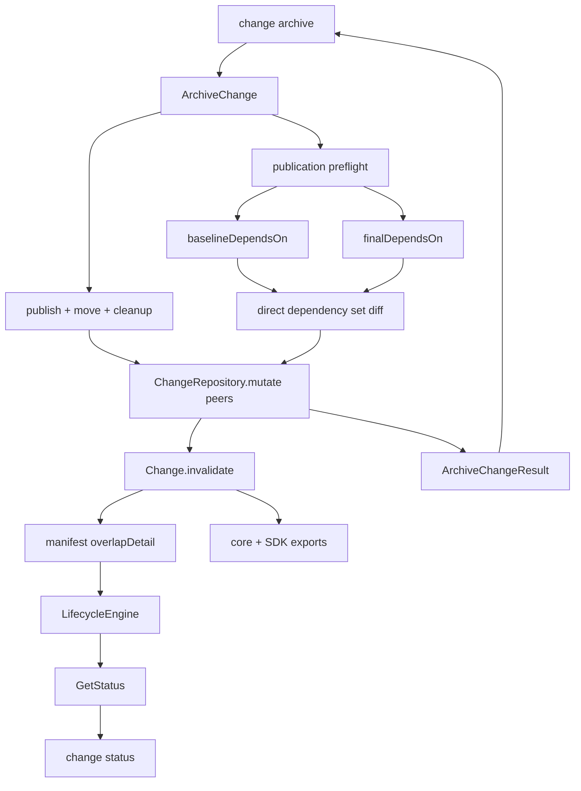

# Design: report overlap dependency changes

This change makes overlap invalidation evidence structured, durable, and visible both immediately from `changes archive` and later from `changes status`. The archived change's direct dependency delta is calculated from the same preflight state that is published, attached to every overlap invalidation event, persisted in the active peer's manifest, and projected without reparsing the human-readable message.

## Non-goals

- Reconcile, add, or remove `specDependsOn` declarations in an invalidated change.
- Change overlap detection: overlap remains the intersection of direct `specIds` owned by two active changes.
- Calculate transitive dependency or graph reachability differences.
- Introduce a new invalidation cause or change lifecycle transition policy.
- Backfill or rewrite historical invalidation events.
- Add configuration, feature flags, network calls, or external storage.

## Affected areas

### Core domain and persistence

- `packages/core/src/domain/entities/change.ts`: define dependency-delta/overlap-detail values, attach optional detail to `InvalidatedEvent`, and validate new evidence before appending history.
- `packages/core/src/domain/errors/invalid-overlap-detail-error.ts` (new): typed rejection for inconsistent structured evidence.
- `packages/core/src/domain/errors/archive-overlap-invalidation-error.ts` (new): typed post-commit failure stating that archive publication succeeded but some peer invalidations did not persist.
- `packages/core/src/domain/errors/index.ts`: export both errors.
- `packages/core/src/infrastructure/fs/manifest.ts`: add optional raw overlap detail.
- `packages/core/src/infrastructure/fs/manifest-change-loader.ts` and `packages/core/src/infrastructure/fs/change-repository.ts`: load/save the detail in every repository path while retaining legacy events.

### Application behavior

- `packages/core/src/application/use-cases/archive-change.ts`: plan peers without early mutation, calculate additions/removals from preflight, persist invalidations after durability, and return them.
- `packages/core/src/domain/services/lifecycle-engine.ts`: prefer structured evidence and retain message parsing only for legacy events.
- `packages/core/src/application/use-cases/get-status.ts`: project dependency changes into review status.

### Public API and adapters

- `packages/core/src/public.ts` and `packages/sdk/src/core-reexports.ts`: re-export the new value types and errors.
- `packages/cli/src/commands/change/archive.ts`: render dependency additions/removals in text and preserve them in JSON/TOON; document the enriched result in help/schema metadata.
- `packages/cli/src/commands/change/status.ts`: render the durable evidence later with the same structured-output behavior and help metadata.

No standalone guide or ADR is required. This is an additive observation of existing archive/status behavior, and graph document search found no guide owning this output contract. Canonical specs and generated command help are the user-facing documentation sources.

## New constructs

### Structured overlap evidence

The domain owns one serializable contract for archive, persistence, lifecycle review, status, CLI, and SDK:

```ts
export interface SpecDependencyChange {
  readonly specId: string
  readonly added: readonly string[]
  readonly removed: readonly string[]
}

export interface SpecOverlapInvalidationDetail {
  readonly archivedChangeName: string
  readonly overlappingSpecIds: readonly string[]
  readonly dependencyChanges: readonly SpecDependencyChange[]
}

export interface InvalidatedEvent extends ChangeEventBase {
  readonly type: 'invalidated'
  readonly cause: InvalidationCause
  readonly message: string
  readonly affectedArtifacts: readonly string[]
  readonly overlapDetail?: SpecOverlapInvalidationDetail
}
```

All arrays are sorted ascending and duplicate-free. `added` and `removed` are disjoint. Every dependency-change `specId` belongs to `overlappingSpecIds`; entries with both sides empty are omitted; `archivedChangeName` is non-blank. New overlap invalidations must provide detail, historical events may omit it, and other causes must not contain it.

`Change.invalidate` stays source-compatible by appending the optional argument after the policy override:

```ts
invalidate(
  cause: InvalidationCause,
  actor: ActorIdentity,
  message: string,
  affectedArtifacts: readonly string[],
  artifactDag: ArtifactDag,
  invalidationPolicyOverride?: InvalidationPolicy,
  overlapDetail?: SpecOverlapInvalidationDetail,
): void
```

Before changing state or history, the entity validates cause/detail consistency and normalization. Invalid evidence throws `InvalidOverlapDetailError` (`INVALID_OVERLAP_DETAIL`) without appending an event. It deep-copies arrays so caller mutation cannot alter history.

### Archive result

```ts
export interface InvalidatedChangesEntry {
  readonly name: string
  readonly specIds: readonly string[]
  readonly dependencyChanges: readonly SpecDependencyChange[]
}
```

`dependencyChanges` is always present in a new successful result, including as `[]`. Existing readers of `name` and `specIds` still work; complete typed fixtures must add the field.

### Post-commit invalidation failure

`ArchiveOverlapInvalidationError extends SpecdError` uses code `ARCHIVE_OVERLAP_INVALIDATION_FAILED` and exposes:

```ts
readonly archivedChangeName: string
readonly archiveDirPath: string
readonly failedPeerNames: readonly string[]
readonly successfulPeerNames: readonly string[]
```

Its message states that canonical publication/archive movement succeeded, lists failed peers, says durable writes were not rolled back, and directs the operator to inspect those active changes. It is not converted to `ArchiveChangeResult`, because normal success would falsely imply all peer state is reliable.

## Approach

### 1. Build an immutable overlap plan

The overlap guard still runs before hooks and writes. With overlap disallowed it throws as today. With `allowOverlap`, it records candidate peers and sorted intersecting `specIds`, but performs no `ChangeRepository.mutate`.

The candidate set is the active-change snapshot seen by the guard; changes created later are not retroactively included. This preserves the existing no-global-lock concurrency model.

### 2. Derive dependency deltas from archive preflight

`PreparedArchivePreflightSpec` gains `baselineDependsOn`. Baseline and final values are resolved before snapshots, transitions, canonical writes, or archive movement:

- Existing persisted state: baseline is its `dependsOn`.
- New spec without a canonical spec: baseline is `[]`.
- Lockless existing spec: extract baseline from unchanged canonical artifacts with `extractMetadataFromSpecArtifacts`, using the effective schema, parsers, transforms, repositories, and workspace routes used by archive preflight. Cached `metadata.json` is not authoritative.
- Final dependencies remain `finalDependsOn`, derived from the exact preflight artifacts/state patch selected for publication.

Normalize both direct dependency sets, then calculate:

```text
added   = finalDependsOn - baselineDependsOn
removed = baselineDependsOn - finalDependsOn
```

Only non-empty differences become `SpecDependencyChange`. This is calculated once from preflight objects; there is no post-write reread or transitive graph traversal. Lockless extraction failure is a preflight failure, before durable writes or peer events.

### 3. Commit before invalidating peers

The durable sequence is:

1. Load and validate change/schema.
2. Detect overlap and capture candidates.
3. Run pre-archive hooks.
4. Build publication preflight, including baseline/final dependencies.
5. Snapshot canonical state and transition the source to `archiving`.
6. Publish canonical artifacts and persisted state.
7. Move the source change into the archive repository.
8. Clean canonical backups, completing the existing commit boundary.
9. Re-read and invalidate each planned peer.
10. Materialize metadata and run post-archive hooks.
11. Return, or throw the accumulated post-commit invalidation error.

Steps 1–8 keep existing rollback behavior. Since peer mutation begins only after step 8, a failed archive cannot leave peer history claiming success.

### 4. Persist fresh, concurrency-safe peer events

Process each candidate with `ChangeRepository.mutate` so the callback sees the freshest peer. Inside it:

- Re-intersect planned IDs with current `specIds`.
- If the peer disappeared, is no longer active, or no longer overlaps, skip it without event/result entry.
- Filter dependency changes to that fresh intersection.
- Construct normalized `SpecOverlapInvalidationDetail` and a message from the same detail.
- Call `Change.invalidate`.

The message is readable evidence, not a machine contract:

```text
Invalidated because change '<archive>' was archived with overlapping specs: <specs>. Dependency changes: <spec> (added: <ids or none>; removed: <ids or none>).
```

When dependency changes are empty, omit the final sentence to retain the concise legacy-style explanation.

Append successful mutations to `ArchiveChangeResult.invalidatedChanges`. Capture repository I/O failures per active peer and continue remaining peers, metadata maintenance, and post-hooks. Afterwards, throw `ArchiveOverlapInvalidationError` if any failed. Successful events and the archive are never rolled back after the durable boundary.

### 5. Persist without rewriting history

The raw manifest gains nested optional `overlapDetail`. Serialization emits it only for `spec-overlap` and deep-copies normalized arrays. Deserialization rules:

- Legacy invalidated events load unchanged.
- Structured overlap events load detail without deriving from their message.
- If malformed persisted data attaches detail to another cause, omit the incompatible detail.
- Never invent dependency deltas for legacy history during load/save.

Both `ManifestChangeLoader` and the repository's direct deserializer implement the same mapping and get parity tests. New creation is strict; historical loading is tolerant.

### 6. Project lifecycle review and status

`LifecycleReviewOverlapEntry` and the `GetStatus` review entry gain `dependencyChanges`.

- Structured detail is authoritative even if message wording disagrees.
- Without detail, keep the current legacy-message parser for archived name/spec IDs and return `dependencyChanges: []`.
- Preserve handled-event boundaries, ordering, and drift-review priority.
- `GetStatus` deep-copies the projection; it does not access manifests, recalculate dependencies, or parse messages.

### 7. Render archive and status consistently

Both CLI adapters follow these rules:

- Show a dependency subsection only when changes exist.
- For every changed spec show both `added` and `removed`.
- Show `(none)` when one side is empty.
- Keep the current concise overlap line when there is no delta.
- Preserve nested arrays unchanged in JSON and TOON; never flatten/stringify them.

Local renderer helpers avoid a core presentation dependency; parity tests prevent drift. `change archive` prints no normal success result when `ArchiveOverlapInvalidationError` is thrown. Existing CLI `SpecdError` handling reports the partial-success message on stderr. Later `change status` exposes successfully persisted events.

## Key decisions

### Structured data is authoritative

The message remains human evidence, but new consumers use structured data. Wording changes cannot alter lifecycle behavior.

### Deltas describe the archived spec

Compare each archived spec's baseline/final direct dependencies, and attach that evidence only to peers overlapping that spec. Never compare or mutate the peer's dependency declarations.

### Preflight is the single calculation source

`baselineDependsOn` and `finalDependsOn` match the selected publication state. A second post-write read could observe unrelated concurrent state or stale metadata.

### Peer invalidation is post-commit and non-transactional

Early invalidation can create false history after rollback. Post-commit invalidation removes that risk but makes partial success possible; a typed explicit error is safer than silent success or impossible cross-repository rollback.

### Legacy evidence is readable, not synthesized

Message parsing remains a compatibility bridge. Legacy dependency changes are unknown and represented by `[]`, never inferred from current canonical state.

## Trade-offs

- Lockless canonical extraction adds preflight work only when persisted state is absent, and prevents stale sidecars becoming authoritative.
- The result type is richer; typed fixtures need updates while existing field readers remain compatible.
- Sequential fresh peer mutations expose partial outcomes but avoid stale overwrite and preserve per-peer repository atomicity.
- Legacy parsing remains isolated until old history ages out.
- Two small CLI formatting helpers avoid leaking presentation into core.

Performance is `O(A × D + P × O)` for archived specs/dependencies and planned peers/overlap. There is no transitive graph traversal. Dependency IDs/change names are existing user-visible metadata; logs/errors never include artifact contents or secrets.

## Spec impact

- `core:archive-change`: comparison, durable sequence, result, and post-commit error.
- `core:change`: normalized evidence and no peer dependency mutation.
- `core:lifecycle-engine`: structured-first review plus legacy fallback.
- `core:get-status`: status projection.
- `core:change-manifest`: optional backward-compatible persistence.
- `cli:change-archive`: immediate text/JSON/TOON presentation and partial-success behavior.
- `cli:change-status`: later text/JSON/TOON presentation.

Graph analysis reports critical combined core blast radius (508 direct and 1,673 indirect dependents across 315 files) because these are public composition roots. The five core specs also have critical spec impact; `cli:change-archive` is medium and `cli:change-status` low. Additive optional persistence, unchanged causes/detection, and unchanged existing result fields contain the ripple.

No extra behavioral delta is needed for SDK/composition specs: they re-export/factory the core contract. Barrel and composition tests cover that mechanical surface. The active overlap on `core:change` with `implementation-snapshot` is accepted; implementation must preserve unrelated edits and revalidate both deltas if it changes this event contract first.

## Dependency map



```text
change archive CLI
    `-- ArchiveChange
          |-- preflight
          |     |-- baselineDependsOn --\
          |     `-- finalDependsOn ------> direct set diff
          |-- publish + archive move + cleanup [durable]
          `-- ChangeRepository.mutate(peer)
                 |-- Change.invalidate(overlapDetail)
                 |     `-- manifest
                 |           `-- LifecycleEngine
                 |                 `-- GetStatus
                 |                       `-- change status text/JSON/TOON
                 `-- ArchiveChangeResult
                       `-- change archive text/JSON/TOON

Change types/errors --> core public exports --> SDK re-exports
```

## Migration / Rollback

No eager migration is required. Nested `overlapDetail` is optional, so old manifests load and coexist with new events. Existing history remains append-only and is not backfilled.

A version predating the field can read the surrounding event because raw schemas are tolerant, but a later save by old code may drop unknown nested detail. Safe operational rollback therefore avoids mutating affected active changes with the old binary, or explicitly accepts loss of optional evidence. Canonical specs/archive data are unaffected; reinstalling new code cannot reconstruct detail dropped by an old save.

There is no schema version bump, backfill command, or destructive rollback. After a post-commit invalidation error, keep the archived source and canonical specs, inspect named peers, and repair their lifecycle state before progression. Never move the archived change back merely to recreate peer events.

## Testing

### Core

- `packages/core/test/application/use-cases/archive-change.spec.ts`: additions, removals, mixed/unchanged, normalization, multiple specs/peers, persisted/new/lockless baselines, pre-commit failure boundaries, durable timing, concurrent peer changes, partial peer failure, and result shape.
- `packages/core/test/domain/entities/change.spec.ts`: valid evidence, defensive copies, invariants, invalid rejection without mutation, and unchanged `specDependsOn`.
- `packages/core/test/domain/services/lifecycle-engine.spec.ts`: structured precedence, contradictory message, legacy empty changes, handling/order boundaries.
- `packages/core/test/application/use-cases/get-status.spec.ts`: deep projection, newest-first events, legacy/empty, handled boundary, drift priority.
- `packages/core/test/infrastructure/fs/change-repository.spec.ts`: both load routes, structured/legacy round-trip, and incompatible-cause omission.
- `packages/core/test/composition/use-cases/archive-change.spec.ts` and `get-status.spec.ts`: unchanged constructor wiring.
- `packages/core/test/barrel.spec.ts`, `barrel-kernel-coverage.spec.ts`, and `packages/sdk/test/barrel.spec.ts`: supported exports.

### CLI

- `packages/cli/test/commands/change-archive.spec.ts`: text additions/removals, `(none)`, concise unchanged/empty peers, nested JSON/TOON, and no success output on post-commit error.
- `packages/cli/test/commands/change/change-status.spec.ts` and `packages/cli/test/commands/change-status.spec.ts`: equivalent current/legacy status rendering and structured output.

### Commands and observability

```bash
pnpm --filter @specd/core test -- archive-change change lifecycle-engine get-status change-repository
pnpm --filter @specd/cli test -- change-archive change-status
pnpm --filter @specd/sdk test -- barrel
pnpm lint
pnpm build
```

Add debug records for plan size, dependency-change count, peer success/skip/failure, and post-commit aggregation through the existing logger. No new metrics, telemetry channel, or sensitive-content logging is needed.
